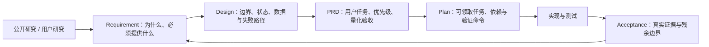

# Lanverse 软件工程文档导航

- 状态：active
- 最近审查：2026-08-14
- 本次能力审计基线：`main@b38d14b64735894c30c583bbdf359c173b5c2c23`（DEV-MVPA-12 工程与 Acceptance 038 已提交；产品签字见后续状态提交）

## 1. 当前结论

Lanverse 已经建立 Requirement → Design → PRD → Plan → Acceptance 的正式链路，不需要再创建一套平行文档。当前产品事实是：项目/单集、整剧导入、分集与改写、稳定叙事单元、资产状态、AI 分镜草案、剧本—分镜覆盖/readiness 和固定版本分镜包已形成真实验收，MVP-A 已 accepted；真实图片/视频生成、时间线、审核交付和成片导出尚未闭环。

“发布型 MVP”和“当前内部里程碑 MVP-A”必须分开：

- 发布型 MVP：从剧本到 MP4、SRT、DeliveryManifest 的完整 S0～S6 结果；
- MVP-A：从整剧导入到可信分镜制作包，不代表已经生成短剧；
- MVP-B：在 MVP-A 之上关闭真实图片 Provider、候选、媒体血缘和成本结算；
- MVP-C：再进入真实视频、音频/字幕、最小时间线、审核、渲染与交付。

## 2. 阅读与变更链路

发现范围或业务事实变化时，从 Requirement 开始向下游更新；实现细节变化但用户可观察行为不变时，从 Design 或 Plan 开始。Acceptance 只能记录已经真实执行的证据，不能用文档完成、Mock、字段占位或路由名称代替功能完成。

## 3. 文档分工

| 目录 | 回答的问题 | 当前入口 |
| --- | --- | --- |
| `requirement/` | 用户是谁、问题是什么、系统必须提供什么、有哪些质量/合规约束 | [需求索引](./requirement/README.md) |
| `design/` | 如何划分模块与事实、状态如何演进、接口/数据/失败如何协作 | [Design 索引](./design/README.md) |
| `prd/` | 先做什么、用户得到什么、用什么标准接受 | [PRD 索引](./prd/README.md) |
| `plan/` | 谁按什么依赖实施、运行哪些验证、何时停止 | [Plan 索引](./plan/README.md) |
| `acceptance/` | 哪些范围已被真实证据接受、仍保留什么边界 | [Acceptance 索引](./acceptance/README.md) |

## 4. 当前推荐阅读顺序

1. [产品需求工程总纲](./requirement/产品需求工程总纲.md)：先理解事实等级、状态、变更和验收规则；
2. [产品发现与竞品需求分析](./requirement/产品发现与竞品需求分析.md)：理解目标用户、VibeReels/GitHub 证据和产品原则；
3. [现状能力基线与需求差距](./requirement/现状能力基线与需求差距.md)：区分目标、`main` 实现、Acceptance 和外部门禁；
4. [平台总体需求](./requirement/001-平台总体需求概述.md)与[当前 MVP-A 增量需求](./requirement/015-AI短剧MVP核心制作能力需求.md)；
5. [架构与技术选型](./design/002-人工智能短剧平台架构与技术选型.md)、[业务闭环设计](./design/003-业务闭环与模块协作设计.md)和[当前模块拆分](./design/012-AI短剧MVP核心模块拆分与实施范围.md)；
6. 对应 PRD、Plan 与 Acceptance。

## 5. 维护规则

- Requirement 是业务需求事实源，不复制 ORM、目录、Worker 或供应商 SDK 细节；
- 公开事实、合理推断、待确认事项必须显式区分；时效性信息记录审查日期；
- 每个正式需求叶子必须唯一，并能追踪到 Design、产品任务、实施任务、测试与 Acceptance；
- `proposed`、`active`、`accepted`、`arrived` 表示不同对象的状态，不得互相替代；
- 当前实现判断必须同时给出 Git SHA、工作区状态、Acceptance 和外部门禁；
- 架构沿用现有模块化单体增量演进，除非新的 Design 证明必须改变，不因能力增多预建微服务。
