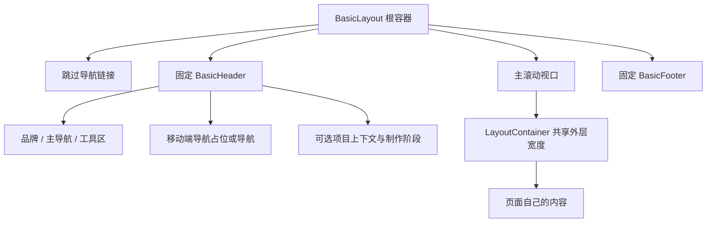

# DES-016 跨页面 BasicLayout 与壳层布局设计

- 状态：archived
- 实施状态：implemented
- 归档日期：2026-08-16
- 版本：v1.0
- 日期：2026-08-16
- 关联设计：[DES-000](../../design/000-项目顶层结构与工程规范.md)、[DES-003](../../design/003-身份Workspace与权限设计.md)、[DES-004](../../design/004-项目与剧集工作台设计.md)
- 关联页面：创建首页、项目、项目详情、资产库、单集工作台、治理、账户与工作空间、系统状态页

## 1. 问题、范围与非目标

当前各页面虽然复用了 `StudioShell`，但页面内容没有遵守同一外层布局契约：

| 位置 | 当前实现 | 结果 |
| --- | --- | --- |
| 导航壳层 | `max-w-[1440px]` | 导航基准宽度 |
| 工作空间页 | `max-w-[1120px]` | 主内容左右边缘与导航不对齐 |
| 资产库、单集工作台 | `max-w-[1420px]` | 与导航产生 20px 偏差 |
| 项目详情 | 重复写入 `max-w-[1440px]` | 容器规则分散，后续容易漂移 |
| 治理、项目列表 | 使用共享容器常量 | 相对一致，但页面自身仍决定滚动和垂直节奏 |
| 权限加载/错误 | `ProtectedRoute` 先渲染独立加载或状态页 | 加载完成后 header、导航和内容整体跳动 |
| footer | 仅认证页有页脚文案 | 页面壳层不完整，底部行为不一致 |

范围：建立跨页面的 `BasicLayout`、统一容器宽度、固定 header/footer、稳定主滚动区、统一加载/错误状态占位，并迁移现有应用页面。

非目标：不改变业务路由、权限规则、页面信息架构、API 契约、页面内部的编辑器布局，也不把认证页的双栏视觉强行改造成应用工作台。

## 2. 设计目标与原则

1. 每个应用页面的 header、正文外层容器和 footer 使用同一水平基准。
2. header 和 footer 固定在视口，只有中间主内容滚动。
3. 权限核对、数据加载、401/403/503 和正常内容使用相同壳层尺寸，状态切换不改变导航位置。
4. 页面内容可以在共享外层容器内使用有意的窄阅读列，但不能自行改变外层容器的左右边缘。
5. 继续复用现有 Geist、语义 token、官方 UI 组件和 `StudioBrand`，不增加第二套主题或布局系统。
6. 固定壳层不遮挡正文、弹窗焦点或键盘操作；移动端不产生横向滚动。

## 3. 目标布局结构



BasicLayout 只负责页面级空间和壳层，不负责页面业务数据：

```tsx
<BasicLayout
  active="projects"
  headerContext={projectContext}
  headerState="ready"
  viewer={viewer}
>
  <PageContent />
</BasicLayout>
```

现有 `StudioShell` 在第一阶段保留为适配层：它继续接收 `active`、`projectName`、`currentStep` 和 `viewer`，内部改为组合 `BasicLayout`。这样可以先统一空间模型，再逐页清理重复壳层，不引入永久的平行布局实现。

## 4. 尺寸与滚动契约

### 4.1 共享容器

所有应用页统一使用一个事实源：

```text
layoutContainerClassName = mx-auto w-full max-w-[1440px] px-5 md:px-8
```

页面需要更窄的阅读宽度时，只能在该容器内部声明，例如 `max-w-3xl` 的正文列；不得将 `1120px`、`1420px` 或新的页面级 `max-width` 写在外层页面容器上。

### 4.2 固定壳层高度

BasicLayout 使用 CSS 变量记录实际占用空间，避免各页面散落 `top-24`、`min-h-screen` 和 padding 计算：

```text
--basic-primary-header-height: 72px
--basic-mobile-nav-height: 44px
--basic-context-row-height: 44px
--basic-progress-row-height: 48px
--basic-footer-height: 48px
```

桌面端默认 header 为 72px；移动端额外保留 44px 的导航行。项目上下文和制作阶段按是否存在追加到 header stack。通知 toast 使用 header stack 作为偏移基准，不再固定写死 `top-24`。

### 4.3 主滚动区

BasicLayout 根节点占满 `100dvh` 并禁止 body 级滚动；主内容作为唯一纵向滚动区：

- `main` 使用 `overflow-y: auto`、`min-height: 0` 和 `overscroll-behavior-y: contain`；
- `main` 通过 `padding-block-start` 和 `padding-block-end` 让正文避开固定 header/footer；
- 主滚动区使用 `scrollbar-gutter: stable`，避免滚动条出现或消失时改变 header 内容位置；
- 弹窗、下拉菜单和命令面板继续使用 portal，不改变主滚动区的焦点顺序；
- 打印和窄屏降级时取消固定定位，恢复普通文档流。

## 5. Header 设计

Header 分为稳定的三个槽位，不因异步状态改变槽位位置：

| 槽位 | 内容 | 稳定规则 |
| --- | --- | --- |
| 左侧 | Lanverse 品牌 | 固定尺寸，不因页面标题变化 |
| 中间 | 主导航 | 角色未知时保留等宽占位；角色确认后只替换内容 |
| 右侧 | 搜索、通知、账户 | 搜索和账户保留最小槽位，未加载时显示不可交互占位 |

移动端保留同样的导航行高度；无权限或状态页隐藏导航内容但不移除占位行。这样登录态、权限角色和页面数据变化不会改变 header 的垂直几何。

项目名和制作阶段属于 header context，不属于每个页面自行拼接的普通正文。它们使用同一 `headerContext` 插槽，并且在 header 固定区内按顺序排列。

## 6. Footer 设计

BasicFooter 为固定、低干扰的单行区域：

- 使用共享外层容器，与 header 和正文左右对齐；
- 默认显示 `© 2026 Lanverse · 安全创作环境`；
- 不放置页面操作、表单或可变业务状态；
- 采用 spacing 和低对比背景，不为普通页面增加装饰性边框；
- 正文主滚动区预留 footer 高度，最后一行内容不会被遮挡。

认证双栏页可以继续保留左侧的认证页脚文案，但应复用同一 Footer 文案来源；认证页的双栏内容区不纳入应用工作台的固定主滚动模型。

## 7. 状态一致性

以下状态必须挂在同一 BasicLayout 内，不能返回另一套全屏结构：

| 状态 | Header | Footer | 主区 |
| --- | --- | --- | --- |
| session checking | 保留完整高度和占位槽 | 保留 | 居中 spinner |
| me loading | 保留完整高度和占位槽 | 保留 | 居中 spinner |
| 401/403/503 | 保留品牌、槽位和高度 | 保留 | SystemStatus 内容 |
| 页面数据 loading | 保留 | 保留 | 页面内 loading |
| 正常内容 | 保留 | 保留 | 页面内容滚动 |

`ProtectedRoute` 和 `SystemStatusPage` 统一改用 BasicLayout 的 `headerState`，避免当前“先显示无壳层 spinner，再替换为带导航页面”的跳变。

## 8. 组件边界与文件规划

建议新增：

- `frontend/src/components/layout/basic-layout.tsx`：根容器、主滚动区、CSS 变量和插槽；
- `frontend/src/components/layout/basic-header.tsx`：品牌、主导航、工具区、移动端导航和稳定占位；
- `frontend/src/components/layout/basic-footer.tsx`：固定页脚；
- `frontend/src/components/layout/layout-container.tsx`：共享容器和页面内容内层约束。

调整：

- `frontend/src/components/studio/studio-shell.tsx`：从完整壳层实现改为 BasicLayout 的工作台适配层；
- `frontend/src/components/system/system-status-page.tsx`：复用 BasicLayout 的品牌状态页变体；
- `frontend/src/components/auth/auth-form.tsx`：只复用页脚文案与 token，不改变认证双栏结构；
- `frontend/src/app/workspaces/page.tsx`、`frontend/src/app/projects/[projectId]/project-workspace.tsx`、`frontend/src/app/studio/comic-production-studio.tsx`、`frontend/src/app/studio/[episodeId]/episode-production-studio.tsx`：移除各自的页面级外层宽度，改用共享容器。

不新增通用 `utils` 或页面专属布局分支；页面内部的卡片、表格、编辑器和弹窗继续由各自业务组件拥有。

## 9. 迁移顺序

1. 建立 BasicLayout、BasicHeader、BasicFooter 和 LayoutContainer，并先覆盖固定尺寸、主滚动区和状态占位。
2. 将 StudioShell 的导航、搜索、账户菜单、项目上下文和制作阶段接入 BasicLayout。
3. 先迁移工作空间页、项目列表、项目详情、治理页和资产库，统一所有外层 `max-width`。
4. 迁移单集脚本、资产、媒体、分镜、任务页面，确认项目上下文仍固定在 header stack 内。
5. 迁移 SystemStatusPage 和 ProtectedRoute 的 loading/error 分支。
6. 最后处理认证双栏页的 footer 文案复用和打印/小屏降级。

每一步只改变壳层和外层几何，不同时重写页面内部业务布局，降低视觉回归定位成本。

## 10. 验收标准

### 布局与视觉

- 桌面端所有应用页的品牌、导航、正文外层和 footer 左右边缘落在同一 `1440px` 容器上；
- 不再存在应用页面外层 `1120px`、`1420px` 或重复的 `1440px` 容器；
- header/footer 在主内容滚动时保持固定，正文首尾不被遮挡；
- 从 loading、401/403/503 到正常内容切换时，header 高度、导航位置和 footer 高度不变化；
- 页面滚动条出现或消失时，导航和右侧工具区不发生水平位移；
- 移动端 header、导航行、正文和 footer 不发生横向溢出。

### 交互与无障碍

- 键盘可通过 skip link 直接进入 `main`；
- 固定 header/footer 不覆盖焦点元素，弹窗打开后焦点仍由 Dialog 管理；
- 主滚动区只有一个纵向滚动容器，滚轮、触摸和键盘滚动行为一致；
- loading 和权限状态有可读的状态文本，不依赖颜色或动画表达；
- 视觉回归覆盖 `/projects`、`/projects/:projectId`、`/studio`、`/studio/:episodeId/*`、`/governance`、`/workspaces` 和 401/403 状态页。

### 工程验证

- `npm run typecheck` 通过；
- `npm run test` 通过，并覆盖容器宽度、状态壳层和移动端导航占位；
- `npm run lint` 无新增 warning；
- `npm run build` 通过；
- `git diff --check` 通过。

## 11. 风险与待确认事项

| 风险/问题 | 处理建议 |
| --- | --- |
| 主内容改为内部滚动后，浏览器历史滚动恢复可能依赖框架行为 | 在代表性路由验证返回/前进与刷新后的滚动恢复；必要时保留页面级 scroll restoration |
| 固定 footer 占用可视高度，窄屏内容空间变小 | 移动端降低 footer 高度；打印时恢复普通流；不在 footer 放复杂内容 |
| 角色未知时导航占位可能让未登录页显得空 | 保留几何占位但降低视觉存在感，并让状态页明确当前身份状态 |
| 项目上下文由页面异步得到 | 先显示固定高度的 context skeleton，数据回来只替换文字，不改变行高 |
| 当前工作区已有未提交 UI 修改 | BasicLayout 实施前先基于当前工作树继续，不回滚既有修改；提交时单独检查布局范围 |

## 12. 待决策

| 问题 | 设计建议 | 关闭点 |
| --- | --- | --- |
| footer 是否在所有应用页显示 | 是，使用低干扰固定单行 footer | BasicLayout 视觉回归 |
| 页面正文是否使用独立滚动容器 | 是，统一由 BasicLayout 管理 | 键盘/触摸和返回滚动验证 |
| StudioShell 是否立即删除 | 否，先作为适配层；所有页面迁移后再评估删除 | 迁移完成后的重复依赖检查 |
| 认证页是否完全纳入 BasicLayout | 否，保留双栏认证布局，只复用 footer 文案和容器 token | 认证页视觉回归 |

## 13. 变更记录

| 版本 | 日期 | 变更 |
| --- | --- | --- |
| v1.0 | 2026-08-16 | 建立跨页面 BasicLayout、固定壳层、共享容器与迁移验收设计 |
