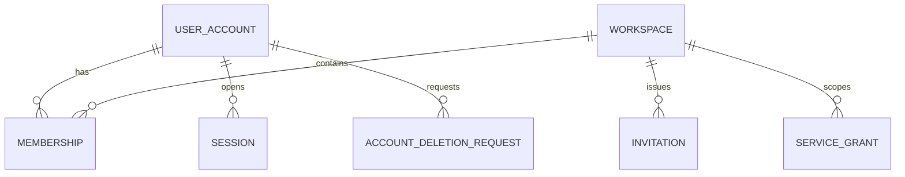

# DES-003 身份、Workspace 与权限设计

- 状态：proposed
- 版本：v1.0
- 日期：2026-08-14
- 关联需求：CUR-IAM-FR-001～009、CUR-IAM-NFR-001～010；CUR-PRJ-FR-009；CUR-PLT-FR-007/008/010
- 关联验收：AC-CUR-IAM-001-A～AC-CUR-IAM-009-B
- 上游：[CUR-IAM](../requirement/002-身份Workspace与成员协作需求.md)、[DES-001](./001-目标技术架构与选型.md)、[DES-002](./002-领域模块边界与跨模块契约.md)

## 1. 问题、范围与非目标

### 1.1 问题

所有创作事实、媒体、长任务和导出都必须属于唯一 Workspace。授权既要覆盖同步 API，也要覆盖 Worker、Provider 回调、短期媒体 URL 和导出下载；只在前端隐藏按钮无法形成权限边界。

### 1.2 范围

- UserAccount、VerifiedIdentity、Session、Workspace、Membership、Invitation、OwnershipTransfer、AccountDeletionRequest 和 ActorContext；
- owner/editor/viewer 固定角色与 action policy；
- API、Worker、媒体、审计和诊断授权；
- Workspace 隔离、成员变化和服务身份；
- 登录会话的安全要求与可观测验证。

### 1.3 非目标

- 不建设企业组织树、自定义角色、项目 ACL 或外部客户审片门户；
- 不建设套餐、席位、支付或员工生命周期系统；
- 不让 owner 查看 Provider Secret 明文；
- 不将权利/内容合规判断并入身份角色，相关规则见 DES-013。

## 2. 事实所有者与模型

Identity 模块拥有：

| 实体 | 关键字段 | 版本语义 |
| --- | --- | --- |
| UserAccount | `user_id`、登录标识引用、状态 | 稳定身份；登录标识变化不改变 ID |
| VerifiedIdentity | issuer/subject 的受控引用、验证时间、状态 | 不等于 Workspace role；不保存上游凭据明文 |
| Workspace | `workspace_id`、名称、状态、revision | active/archived；名称不是隔离键 |
| Membership | Workspace、User、role、status、revision | 角色变化追加审计；同用户同空间最多一个 active |
| Invitation | Workspace、绑定受邀身份摘要、role、secret hash、expiry、status | pending 可撤销/过期；接受幂等；不存 Secret 明文 |
| OwnershipTransfer | 当前/目标 Membership、基线修订、重新验证、决定 | 一次原子转移；全程恰有一个 current owner |
| Session | session ID、User、issued/expiry/revoked | 可撤销，不保存上游令牌明文 |
| AccountDeletionRequest | User、重新验证、影响/blocker、状态、Governance 交接 | 幂等耐久请求；不改历史 actor |
| ActorContext | User/Service actor、Workspace、role、session/任务来源 | 请求期不可变数据契约，不落为第二套身份 |
| ServiceGrant | `task_id`、固定 Workspace、允许 action/target、有效期 | 只完成已授权后台任务，不可扩大范围 |



Provider 凭据引用由 Platform 拥有，媒体权利与 AuditRecord 由 Governance 拥有；Identity 只提供 actor 与 action 决策所需事实。

## 3. 角色与 action policy

| Action | viewer | editor | owner | service actor |
| --- | --- | --- | --- | --- |
| 读取项目、镜头、候选和历史包摘要 | 是 | 是 | 是 | 仅固定任务需要 |
| 创建/修改创作事实 | 否 | 是 | 是 | 否，除恢复已有任务输出 |
| 提交生成、取消、安全重试 | 否 | 是 | 是 | 仅执行/对账已有 Task |
| 设置主选、重新确认、冻结导出 | 否 | 是 | 是 | 否 |
| 下载原始 Candidate | 否 | 是 | 是 | 仅媒体处理 |
| 下载素材包 | 否 | 是 | 是 | 否 |
| 管理成员/Workspace 状态 | 否 | 否 | 是 | 否 |
| 查看普通审计 | 否 | 业务必要最小范围 | 受控范围 | 受控支持查询 |
| 查看 Secret/完整 Provider 原响应 | 否 | 否 | 否 | 仅专用受控运维能力，Identity 不授权明文 |

Policy 以稳定 action 名判断，例如 `video.generate`、`video.select`、`export.freeze`、`media.download`。Persona（导演、编剧、美术、制作人）只描述职责，不创建隐藏角色。

## 4. 请求认证与 ActorContext

### 4.1 浏览器会话提案

- 身份提供方和协议通过 ADR 选择，目标为标准 OIDC/OAuth 2.1 或等价托管身份能力；
- Web 使用 Secure、HttpOnly、SameSite 会话 Cookie；若使用短期 access token，不得持久化到可被任意脚本读取的长期存储；
- CSRF、会话固定、退出、过期、撤销和多设备策略必须通过安全测试；
- API 从受信会话组装 ActorContext，忽略前端提交的 role、workspace owner 标记和任务终态。

### 4.2 Workspace 选择

请求中的 Workspace ID 只是目标上下文。API 必须查询 active Membership 并生成授权结果；直接 ID 查询、搜索、分页和错误响应使用同一隔离规则。

### 4.3 错误语义

- 未认证：统一 `AUTHENTICATION_REQUIRED`；
- 无 Membership、跨 Workspace 或资源不存在：对外统一不可用，避免存在性探测；
- 有 Membership 但 action 不允许：`ACTION_FORBIDDEN`，可返回角色和必要下一动作但不泄露资源；
- 会话中途失效：写入失败，前端保留未提交草稿并重新认证。

## 5. 数据隔离设计

1. 所有 Workspace 业务表保存不可空 `workspace_id`。
2. 子实体 FK 必须能证明与父实体同 Workspace；不能只校验客户端传入值。
3. Repository 默认要求 ActorScope，禁止无作用域业务查询；受控运维 Query 使用独立接口和审计。
4. PostgreSQL Row-Level Security 作为提案的纵深防御；是否启用由数据库迁移、连接池和 Worker PoC 关闭。
5. 对象 Key 不包含可猜用户名/项目名，采用不可预测稳定 ID；Bucket 全部 private。
6. 短期 URL 在签发前检查当前 Membership、action、Media Workspace 和用途；过期后重新签发，不改变 MediaVersion。
7. 搜索索引、缓存、SSE Channel、Outbox 和 Worker payload 均包含 Workspace 路由并重新验证，不能仅靠名称前缀隔离。

## 6. 同步命令与查询

| 能力 | 输入 | 原子输出/失败 |
| --- | --- | --- |
| 创建 Workspace | 已认证 User、名称、幂等键 | Workspace + owner Membership；零半创建 |
| 创建/撤销邀请 | Workspace、绑定受邀身份摘要、editor/viewer、有效期、幂等键 | pending/revoked Invitation；不强制预建邮件发送 |
| 接受邀请 | 已验证身份、一次 Secret、Invitation revision、幂等键 | accepted + 唯一 Membership；身份不匹配/过期/撤销零写入 |
| 修改角色 | Membership、目标 editor/viewer、期望 revision | 新 revision；owner 变更只走 OwnershipTransfer |
| 移除成员 | Membership、期望 revision | removed；当前 Session 对该 Workspace 立即失效 |
| 转移 owner | 当前/目标 Membership、成员修订、重新验证、确认 | 一事务将目标设 owner、原 owner 设 editor；冲突零变化 |
| 归档/恢复 Workspace | 影响预检、expected revision、owner 确认 | 新状态或 unknown Task/保留阻塞清单 |
| 请求账号删除 | 重新验证、归属/任务/保留影响、幂等键 | blocker 或 deletion_pending + DES-013 数据生命周期交接 |
| 读取 Actor 权限 | User/Service actor、Workspace、action、target | allowed/denied + policy version |
| 撤销会话 | Session、actor | revoked；重复请求幂等 |

邀请是 P0 事实，但通知通道可首发使用 owner 受控复制的一次链接；不为邮件、域名、席位或企业目录预建系统。

## 7. 异步事件与后台授权

事件：

- `WorkspaceCreated`
- `WorkspaceArchivedOrRestored`
- `MembershipGranted`
- `MembershipRoleChanged`
- `MembershipRemoved`
- `OwnershipTransferred`
- `InvitationChanged`
- `SessionRevoked`
- `AccountDeletionRequested`

事件不携带登录标识、会话令牌或邀请 Secret。

### 7.1 ServiceGrant

用户提交长任务时，在同一业务事务固定：

- 原始 actor 与 Workspace；
- task ID、目标资源 ID/版本和允许动作；
- 权限/权利检查版本和时间；
- 有效期和撤销策略。

Worker 只可完成该 Task 的外部提交、结果登记、媒体处理和状态更新。成员随后被移除时：

- 不允许创建新 Attempt、扩大范围或新导出；
- 已发生且无法撤销的 Provider 工作仍如实对账、登记媒体和成本；
- 当前用户不再获得读取/下载能力；
- 处置记录进入 Audit。

## 8. 状态与不变式

```text
UserAccount: active → suspended | deletion_pending → deleted
Workspace: active ↔ archived；blank-only → deleted
Membership: active → removed
Invitation: pending → accepted | expired | revoked
OwnershipTransfer: prepared → confirmed | cancelled | conflicted
Session: active → expired | revoked
ServiceGrant: active → completed | expired | revoked_for_new_side_effects
```

不变式：

1. active/archived Workspace 恰有一个 current owner。
2. viewer 不能产生 Provider 消耗、改变 current 或冻结新包。
3. Membership role 不由前端或 Worker payload 决定。
4. Workspace 归档后历史只读，不接受新生成/新导出。
5. 跨 Workspace ID 的响应不得泄露对象类型、名称、媒体规格或任务存在性。
6. ServiceGrant 不因后台代码重试而扩大 action 或 target。
7. 历史 Audit 保留原 actor/role 快照，但授权永远按当前 action 时点判断。
8. Invitation 接受、Membership 建立与 owner 转移幂等且零半状态。
9. 账号删除不改写历史 actor；唯一 owner、unknown Task、legal hold/保留依赖未处理时不 completed。

## 9. 失败与恢复

| 失败 | 行为 | 恢复 |
| --- | --- | --- |
| Identity Provider 暂不可用 | 已有有效会话按既定短窗口运行；新登录 unavailable | 恢复后登录，不伪造匿名用户 |
| Membership 并发变化 | 写命令拒绝 | 重新加载最新 role/revision |
| Invitation 重复/过期/身份不匹配 | 不建重复 Membership，不泄露成员资料 | 回读原结果或联系 owner 新建邀请 |
| owner 转移并发/移除 current owner | 恰有一个 owner，冲突零部分变化 | 重读成员修订并重新验证 |
| 账号删除有归属/unknown/hold blocker | 返回类型化 blocker，不撤销历史 actor | 转移 owner/对账/关闭 hold 后重做预检 |
| Worker 收到过期/伪造 Workspace | 统一拒绝并审计 | 不自动换 Workspace |
| 短期 URL 签发后成员被移除 | URL 保持极短 TTL；撤销能力按存储方案评估 | 新请求必须拒绝；高风险可代理下载 |
| 会话过期时有本地草稿 | 不提交 | 前端保留草稿，重新认证后以最新 revision 重试 |

## 10. 安全、隐私与审计

- 密码/上游令牌处理由身份提供方或专用认证组件负责，不自行记录明文。
- Membership、角色、Workspace 状态、会话撤销和所有越权拒绝写追加式 AuditRecord。
- Audit 默认不含邮箱/手机号完整值；用稳定 User ID 和受控显示摘要。
- 登录、成员变更、下载和敏感 Query 应有速率限制与异常检测。
- 用户枚举、IDOR、CSRF、Session fixation、Cookie 属性和权限缓存失效列入安全 Acceptance。

## 11. 可观测性

- Metric：登录成功/失败、会话撤销、action deny、跨空间拒绝、Membership 变更、短期 URL 签发/拒绝；
- Trace：`actor_id` 和 `workspace_id` 可作为受控日志字段，不作为无限基数指标标签；
- 告警：跨空间成功访问必须为 0；权限依赖 unavailable 不能回退 allowed；
- 诊断 ID 可关联请求、policy version、Membership revision 和 Audit ID，不返回敏感登录信息。

## 12. 验证

- AC-CUR-IAM-001-A～003-B：首次进入幂等、Workspace 切换隔离、会话撤销和草稿恢复；
- AC-CUR-IAM-004-A～005-B：Invitation 绑定/过期/撤销、Membership 唯一和恰一 owner 原子转移；
- AC-CUR-IAM-006-A～008-B：viewer 生成/主选/原件下载拒绝、授权失效、Workspace 归档/受控删除与最小安全历史；
- AC-CUR-IAM-009-A/B：唯一 owner 和保留阻塞；deletion_pending 撤销 Session，历史 actor 不改，交接 DES-013；
- 直接 ID、搜索、分页、SSE、Worker、媒体 URL、导出下载跨 Workspace 成功数为 0；
- 最后 owner 不可被移除或降级；
- 角色变化后缓存与既有会话在目标时限内生效；
- 重复成员命令幂等、并发冲突零部分写入；
- 被移除用户的未完成 Provider 任务仍可由 service actor 对账，但用户无访问权；
- 普通日志、前端错误和 Audit 中令牌/凭据出现数为 0；
- 键盘和非颜色方式可感知权限阻断与下一动作。

## 13. 待决策

| 决策 | 当前建议 | 关闭点 |
| --- | --- | --- |
| 身份提供方/自建认证 | 优先标准托管 OIDC，避免自建密码体系 | ADR-005 与地区/成本/数据要求 |
| viewer 下载 Candidate/包 | 已决策为不允许；viewer 可读摘要/受控预览 | CUR-IAM 已决策、G-D 验证 |
| RLS 是否首发启用 | 作为纵深防御优先 PoC | 连接池、迁移、Worker 和性能测试 |
| 邀请通知通道 | 实现 Invitation 事实和一次链接；首发可手工受控分享，不预建邮件系统 | CUR-IAM-OQ/交互验收 |
| 会话时长和高风险再认证 | 短会话 + 可刷新；下载/成员管理可再认证 | 安全评审 |

## 14. 变更记录

| 版本 | 日期 | 变更 |
| --- | --- | --- |
| v1.0 | 2026-08-14 | 建立 Workspace 隔离、固定角色、ServiceGrant 和全链路权限设计 |
