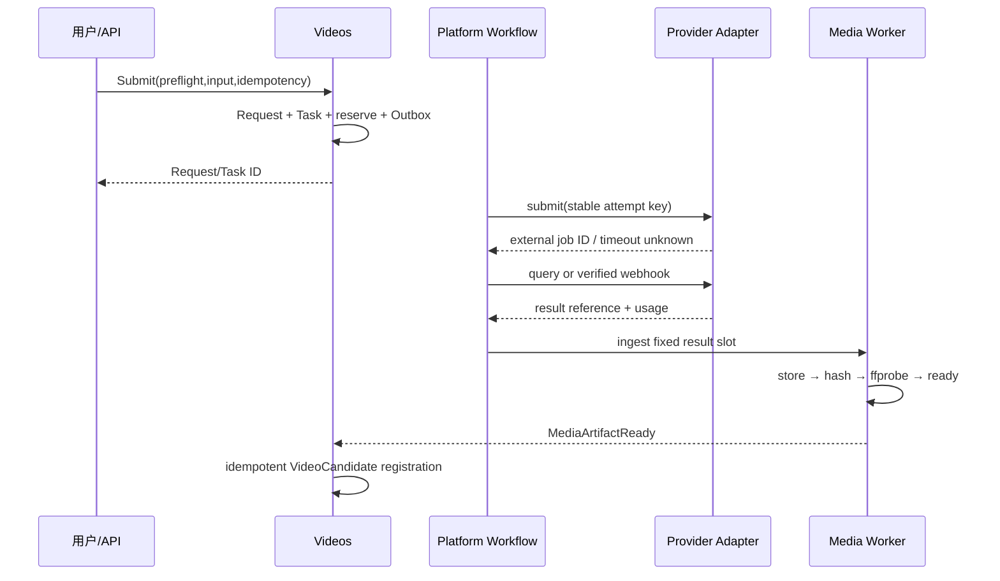

# DES-009 视频生成候选与主选设计

- 状态：proposed
- 版本：v1.0
- 日期：2026-08-14
- 关联需求：CUR-VID-FR-001～010、CUR-VID-NFR-001～011
- 关联验收：AC-CUR-VID-001-A～AC-CUR-VID-010-B
- 上游：[CUR-VID](../requirement/008-镜头视频生成与候选选择需求.md)、[DES-008](./008-关键帧与视觉参考设计.md)、[DES-012](./012-平台Capability与Provider耐久任务及媒体设计.md)

## 1. 问题、范围与非目标

Videos 模块把固定 ShotSpec、关键帧和视觉参考提交给真实视频 Capability，保留每镜多次生成的不可变原始视频 Candidate，并让用户显式选择每镜唯一 current。它是创作结果选择模块，不是剪辑、转码或成片模块。

范围：视频模式/预检、单镜/选定镜头生成、任务投影与恢复、Provider/上传 Candidate、播放比较下载、星标/拒绝、唯一主选、stale/reconfirmation、导出 readiness。

非目标：裁切、拼接、变速、调色、字幕、配音、音轨处理、时间线、成片、自动主选、商业账单、自托管 GPU 和通用工作流。

## 2. 事实所有者与模型

| 实体 | 含义 | 所有权/版本 |
| --- | --- | --- |
| VideoGenerationIntent | 用户选择模式和允许业务参数 | 可修订草稿，不是请求 |
| VideoPreflight | 固定输入、Capability、blocker/warning、预计消耗和有效期 | 短期不可变证据 |
| VideoGenerationRequest | 一个 Shot 的固定输入和确认 | 不可变；一个业务请求对应一个 WorkTask |
| VideoBatch | 用户选定 Shot 集合和逐项请求结果 | 聚合引用，不拥有全局终态 |
| VideoTaskProjection | DES-012 WorkTask 的类型化只读投影 | 不复制 canonical 状态 |
| VideoCandidate | 一次生成/上传得到的单镜原始视频 | 不可变 MediaVersion/InputSnapshot |
| VideoCandidateDecision | star/reject/undo/质量说明 | 追加式 |
| VideoSelection | select/replace/clear/reconfirm | 追加式 + 唯一 current projection |
| VideoReadiness | 指定 Baseline 下每 Shot 导出就绪度 | 派生 |

WorkTask、Attempt、Capability、Media 和 Cost 由 Platform 拥有，Rights/Content/Audit 决定由 Governance 拥有；Videos 只保存业务请求、候选和选择语义。

## 3. 输入快照与模式

每个 VideoGenerationRequest 固定：

- Workspace/Project/Episode、StoryboardBaseline、OrderRevision、Shot、ShotSpecVersion；
- 模式和其必需 KeyframeSlot Selection；
- 每个 KeyframeCandidate/MediaVersion；
- VisualReferenceRevision 和有序 MediaVersion；
- 受控业务参数、CapabilityConfigVersion、PromptTemplateVersion；
- 权限/权利预检引用、预计消耗、warning 确认、canonical input hash。

模式候选为 `text_to_video`、`start_frame_to_video`、`start_end_frame_to_video`，首发实际开放集合由 CUR-VID-OQ-001 和真实 Provider PoC 决定。Capability Catalog 负责声明必需 Slot、参考图数量和参数边界，Videos 不硬编码 Provider 原字段。

## 4. 核心不变式

1. 一个 Request 固定一个 Shot 和输入，创建后不得改参数。
2. VideoCandidate 登记后原始媒体、来源、InputSnapshot 不可替换。
3. 生成/上传成功默认 unmarked、active、unselected。
4. 同一 Shot + video purpose 同时最多一个 current VideoSelection。
5. export-ready Shot 必须恰有一个显式、媒体 valid、针对当前输入确认的主选。
6. starred ≠ selected，rejected ≠ deleted；播放、比较、下载都不改变主选。
7. 最新成功、最近查看、最高评分和排序首项不得兜底。
8. 批量生成只是独立单镜 Request/Task 集合，局部失败不回滚成功项。
9. unknown 未对账前不得自动新 Attempt。
10. 原始媒体中的音轨保持原样；产品不编辑也不承诺音频质量。

## 5. 同步命令与查询

| 能力 | 输入 | 结果 |
| --- | --- | --- |
| ListVideoModes | Shot、目标用途 | 经验证模式、输入要求、限制、可用性、计量单位 |
| PreflightVideo | 固定 Baseline/Spec/Keyframe/Reference、模式/参数 | ready/warning/blocked、预计、input hash、有效期 |
| SubmitSingle | 有效 Preflight、幂等键、warning 确认 | Request + Task ID，≤2 秒返回 |
| SubmitSelectedBatch | 明确 Shot ID 集合、逐项 Preflight | Batch + 每 Shot accepted/blocked/failed，不建伪全局终态 |
| GetTaskProjection | Task、Shot | canonical 状态、stage、Attempt 摘要、cost、next action |
| RegisterUploadIntent | Shot、来源/权利、文件元数据 | 上传 session；不自动 Candidate |
| List/CompareCandidates | Shot、筛选、2～4 Candidate | 原始/预览访问、来源、输入、标记、Selection |
| MarkCandidate | Candidate、star/reject/undo、expected decision | 追加 Decision；Selection 不变 |
| SelectCandidate | Candidate、Shot、expected current/input | 唯一 current 或冲突 |
| ReconfirmSelection | Selection、当前 input hash、差异和理由 | 追加确认或版本冲突 |
| GetVideoReadiness | 目标 Baseline/Order、Shot 集合 | 每 Shot ready/missing/stale/blocked/unavailable 和 Export 交接 |

取消、重试和对账通过 DES-012 的 Task Command，Videos 不直接修改 Task 状态。

## 6. 异步生成和 Candidate 登记



一次 Attempt 可返回多个结果，每个结果使用稳定 `provider_output_slot` 幂等登记。Task succeeded 的业务完成定义至少包括所有声明结果已被持久化或明确列出不可恢复的登记失败；不能仅凭 Provider 返回 200 宣称 Candidate 可用。

上传 Candidate 经过同一 Media 安全路径并固定来源/权利，之后使用同一比较、标记和选择规则。

## 7. 任务、取消、重试和 unknown

Videos 展示 DES-012 状态：`queued → running → waiting_external → succeeded/failed/cancelled/unknown`。`downloading/probing/registering` 是 stage。

- queued 未创建 Attempt 可本地取消；
- 已外发时记录 `cancel_requested`，等待 Provider 真实结果；不立即伪 cancelled；
- Provider 确认取消后才 cancelled；取消请求后返回成功则如实 succeeded、登记 Candidate/Cost 并标记 late result；
- failed 仅在错误可重试且已证明无成功副作用时新建 Attempt；
- unknown 先按 external job ID/idempotency key/Webhook 对账，无法确认进入 manual resolution；
- 播放/媒体错误不是重新生成依据，只恢复媒体访问/登记。

## 8. Selection、stale 与导出交接

Selection current projection 由数据库唯一约束保证。选择命令验证：Candidate 同 Shot/Workspace、Media ready、未 rejected/blocked、当前输入匹配或已有有效 reconfirmation、expected current 未冲突。

当 Baseline、ShotSpec、Keyframe Selection 或 VisualReferenceRevision 变化：

1. Candidate 固定来源不变；
2. Impact 比较受影响字段；
3. current Selection 进入 `needs_reconfirmation`；
4. 用户可重生成、选择其他 Candidate，或查看差异后追加 current input hash/actor/reason 的重新确认；
5. 重新确认期间输入再变则冲突；
6. Export 只能读取 `selected + current input confirmed + media ready`。

## 9. 状态与失败恢复

```text
Candidate: validating → valid | blocked | unavailable
Decision: unmarked ↔ starred；active ↔ rejected
Selection: missing → selected → needs_reconfirmation → selected
Readiness: incomplete | ready | stale | blocked | unavailable
```

| 失败 | 行为 | 恢复 |
| --- | --- | --- |
| Capability/消耗 unknown | Preflight unavailable，不创建 Task | 验证能力/计量后重检 |
| 批量 3/20 blocked | 17 项可按确认提交，3 项独立 blocker | 修复对应 Shot，不重跑成功项 |
| Provider submit timeout | Task unknown | 对账，不自动重发 |
| Provider success/下载失败 | 无可用 Candidate，保留 external result | 重试下载/登记，不重新生成 |
| 视频损坏/无视频轨 | Candidate blocked | 重新获取相同结果或新生成 |
| 主选并发 | 旧/较新 current 保持 | 返回最新状态后重做 |
| 当前输入变化 | Selection 待确认，导出 blocked | 重选/重生成/reconfirm |

## 10. 权限、安全与权利

- owner/editor 预检、提交、取消、安全重试、上传、标记、选择和重新确认；viewer 只读。
- 每次 submit 和 Export freeze 重检固定资源权限/权利；旧 Preflight 不能复用。
- Provider 结果抓取采用 allowlist、重定向/大小/超时限制和 SSRF 防护。
- 外部上传 MP4/WebM/MOV、500 MiB、1～30 秒均为 proposed 假设；实际类型、轨道和 hash 必须探测，不静默转码。
- 原始下载只发指定 Candidate 的原始字节，不用代理预览替代。
- 日志/事件不含 Prompt、签名 URL、媒体字节、凭据和 Provider 完整原响应。

## 11. 可观测性

- Request/Task/Attempt/ProviderJob/Media/Candidate/Selection 全链关联；
- submit 延迟、Provider ack/poll/callback、unknown age、取消结果、retry 原因；
- 媒体 download/probe/register 各阶段失败；
- 每 Shot Candidate 数、missing/stale/blocked/unavailable readiness；
- reserve/settle/release/adjust 收敛；
- 不用 Task/Candidate/Prompt 作为 metric label。

## 12. 验证

- AC-CUR-VID-001-A～003-B：模式/预检、单镜和批量独立提交；
- AC-CUR-VID-004-A/B：刷新、取消、重试、unknown 和对账；
- AC-CUR-VID-005-A～006-B：生成/上传 Candidate、媒体持久化和逐文件错误；
- AC-CUR-VID-007-A～009-B：播放比较下载、标记独立、唯一主选；
- AC-CUR-VID-010-A/B：输入影响、重新确认和 Export readiness；
- 故障注入证明重复点击/消息/回调/Worker 重启不重复业务请求或 Provider 副作用；
- 120 Shot、每 Shot 20 Candidate 容量和 CUR-VID-NFR 性能/恢复测试；
- 跨 Workspace、原始下载和权利门禁绕过成功数为 0；
- 任何当前验收不调用裁切、拼接、转码、字幕、音频或成片。

## 13. 待决策

| 问题 | 当前建议 | 关闭点 |
| --- | --- | --- |
| 首发模式 | 由首个真实 Provider 质量和输入契约选择一个最小模式 | CUR-VID-OQ-001/G-C |
| 外部上传 P0 | 建议 P1；真实 Provider Gate 应用稳定 fixture/结果持久化验证 | CUR-VID-OQ-002 |
| 20 Candidate/500 MiB/1～30 秒 | 仅 proposed 压测/样片假设 | CUR-VID-OQ-003 |
| 主选双人确认 | 首发任一 owner/editor 显式决定 | CUR-VID-OQ-004 |
| Provider Adapter | 只实现首个真实视频 Provider 所需接口，第二个 Provider 后再验收扩展性 | G-C |

## 14. 变更记录

| 版本 | 日期 | 变更 |
| --- | --- | --- |
| v1.0 | 2026-08-14 | 建立固定请求、耐久任务投影、原始视频 Candidate、唯一主选和导出交接设计 |
