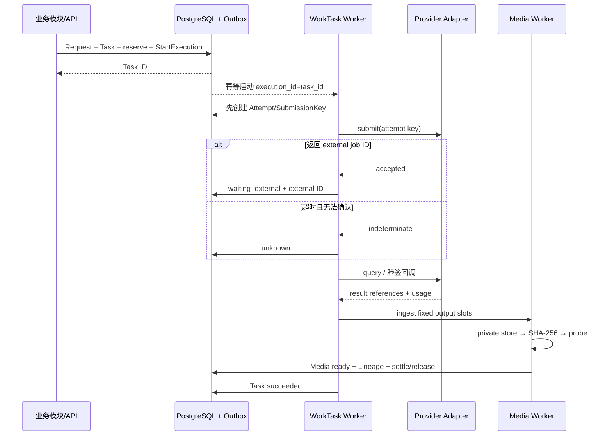

# DES-012 平台 Capability、Provider、耐久任务与媒体设计

- 状态：proposed
- 版本：v1.0
- 日期：2026-08-14
- 关联需求：CUR-PLT-FR-001～010、CUR-PLT-NFR-001～010；CUR-SCR/AST/SBD/KFR/VID/EXP 中的 AI 任务、媒体、血缘、消耗和恢复要求
- 关联验收：AC-CUR-PLT-001-A～AC-CUR-PLT-010-C
- 上游：[CUR-PLT](../requirement/010-平台支撑与跨模块质量需求.md)、[DES-001](./001-目标技术架构与选型.md)、[DES-002](./002-领域模块边界与跨模块契约.md)

## 1. 问题、范围与非目标

### 1.1 问题

真实 AI Provider 的延迟、限额、回调、临时 URL、取消和计量语义都不稳定。平台必须使“用户可观察任务”与队列/工作流内部 Job 分离，使“Provider 返回成功”与“媒体已安全持久化”分离，并在无法确认副作用时保留 `unknown` 而不盲目重发。

### 1.2 范围

- 经真实证据核验的 Capability Catalog 和 Provider Adapter；
- WorkTask、ExecutionAttempt、ProviderSubmission、取消/重试/对账；
- Production Harness/LangGraph、WorkTask/RabbitMQ 与 PostgreSQL 用户事实的三层边界；
- 上传/Provider 输出的隔离接收、私有存储、hash、探测、预览与短期访问；
- Lineage、Impact 输入摘要和内部 CostRecord；
- 幂等、容量保护、诊断关联、可观测和故障 PoC。

### 1.3 非目标

- 不拥有 Script/Asset/Shot/Keyframe/VideoCandidate/Selection/ExportSnapshot 业务语义；
- 不建模型市场、用户代码插件、通用 AI DAG、自托管 GPU 或训练平台；
- 不把内部消耗扩展为余额、套餐、订单、支付、发票或客户账单；
- 不对原始视频裁切、拼接、转码、剔除音轨或渲染成片；
- 不在首个真实 Provider 闭环前验收“通用多 Provider 插件化”。

## 2. 事实所有者和领域模型

| 实体 | 所有事实 | 版本/不变式 |
| --- | --- | --- |
| CapabilityDefinition | 业务用途、输入/输出契约、参数边界、计量单位 | 版本化；不暴露 Provider Secret |
| CapabilityVerification | 账号/地域/模型权限/参数/配额/计量的真实验证证据 | 有验证时间、有效期和证据摘要；过期不可 active |
| ProviderProfile | Provider/Endpoint/region、secret reference、限流/回调能力 | 技术配置版本；数据处理准入由 DES-013 拥有 |
| WorkTask | Workspace 内用户可观察主状态、stage、进度证据、错误、next action、revision | 一个业务请求一个 Task；不等于 Job；只能引用同一 Workspace 的业务目标 |
| ExecutionAttempt | 一次可能产生外部副作用的执行尝试 | 继承 WorkTask 的 Workspace；追加；不等于轮询/消息次数 |
| ProviderSubmission | submission key、配置版本、发送时间、external job ID、ack/证据 | submit 前先存；超时可为 unknown |
| ProviderCallbackInbox | Provider event ID/signature/replay 摘要、接收时间 | 重复/乱序幂等；不存敏感完整响应 |
| MediaArtifact | Workspace 内稳定媒体身份、purpose/source | 稳定 ID |
| MediaArtifactVersion | 对象位置版本、size、实际类型、探测规格、SHA-256、state | 字节就绪后不可变 |
| MediaDerivative | 缩略图/安全预览到原媒体版本的血缘 | 独立版本；不替代导出原件 |
| LineageRecord | 固定输出→固定输入/Task/Attempt/Capability/actor | 只追加；不自环、不用 current 回填历史 |
| CostRecord | submitted/not_submitted/unknown、内部预占、Provider 返回的单位/值、来源版本与关联 Attempt | 只追加；计量 unavailable 时不自行估价；不是项目预算、币种设置或客户账单 |

RightsDecision、ContentDecision、DataProcessingProfile 和 AuditRecord 由 DES-013 Governance 拥有。Platform 在每个外发/媒体/下载边界调用门禁并提交最小审计记录，不保存第二份决定。

## 3. Capability Catalog 与 Provider Adapter

### 3.1 三层契约

1. **Business capability**：`script_analysis`、`asset_image_generation`、`keyframe_image_generation`、`shot_video_generation` 等当前用例，由业务输入/输出定义。
2. **Capability configuration**：将业务参数边界、ProviderProfile、模型标识、计量、验证和治理配置固定为版本。
3. **Provider adapter**：只把已验证业务输入映射为 Provider HTTP/SDK，再将结果映射为稳定内部契约。

Adapter 最小端口：

```text
verifyCapability(config) -> VerificationEvidence
preflight(config, normalizedInput) -> ProviderPreflight
submit(config, attemptKey, normalizedInput) -> accepted(externalJobId?) | definitelyRejected | indeterminate
query(config, externalJobId | attemptKey) -> running | succeeded(resultRefs, usage) | failed | cancelled | indeterminate
requestCancel(config, externalJobId) -> confirmed | requested | unsupported | indeterminate
verifyAndNormalizeWebhook(headers, body) -> ProviderEvent | rejected
fetchUsage(config, externalJobId) -> usage | unavailable
```

Adapter 不创建 WorkTask/Candidate/Media/Cost/主选，不读写业务表，不把 Provider 错误原文直接返回用户。第二 Provider 只能新增 Adapter/CapabilityConfig，不能新建 Task/Media/Cost 体系。

### 3.2 能力状态

```text
draft → verifying → active → degraded | suspended
                 └→ unavailable
active/degraded → review_required（验证/数据处理证据过期）
```

Secret 存在、公开文档列出模型或测试一次 200 均不等于 active。每个 active 能力必须有未过期的真实账号/地域/参数/输出/计量证据与 DES-013 DataProcessingProfile。

## 4. 同步命令、预检与事务

| 能力 | 输入 | 原子输出/失败 |
| --- | --- | --- |
| ListCapabilities | purpose、actor、输入类型 | 已验证能力、限制、计量和不可用原因；不返回 Secret |
| PreflightCapability | 固定业务输入、参数、用途、scope | ready/warning/blocked/unavailable、input hash、config version、estimate、有效期；零任务/预占/外发 |
| CreateWorkTask | 业务 request ref、有效 Preflight、确认、幂等键 | WorkTask + reserve + StartExecution Outbox；任一失败零半任务 |
| GetTask/ListTasks | actor、scope/filter | canonical state、stage、Attempt 摘要、消耗、错误、next action |
| RequestCancel | Task、expected revision、幂等键 | 本地取消或 cancel_requested，不伪造 Provider 确认 |
| RequestSafeRetry | failed Task、固定输入、失败证据、幂等键 | 带 predecessor 引用的新 WorkTask/ExecutionAttempt 或明确不可重试；原 failed Task 不逆转，unknown 拒绝 |
| ReconcileTask | unknown/waiting Task、外部证据 | 对账计划/结果或 manual action |
| RequestMediaAccess | actor、MediaVersion、purpose | 短期私有访问能力；当前权限/治理重检 |

业务拥有模块负责创建不可变业务 Request。在当前模块化单体中，业务 Request、WorkTask、reserve 和 Outbox 通过 Platform 公开端口参与同一 PostgreSQL 事务；不允许业务模块直写 Platform 表。拆服务前必须重做该原子边界 Design。

幂等键唯一范围为 `workspace + command_type + business_target + idempotency_key`，同键保存 canonical input hash；同键同输入回读，同键异输入冲突。

## 5. WorkTask 状态机与执行层

### 5.1 Canonical 状态

```text
queued → running | cancelled
running → waiting_external | succeeded | failed | cancelled | unknown
waiting_external → succeeded | failed | cancelled | unknown
unknown → succeeded | failed | manual_attention
```

`submitting`、`polling`、`downloading`、`probing`、`registering`、`packaging` 是可验证 stage，不是另一套主状态。进度只使用 Provider 可靠数值、已校验输出数或已打包字节/文件数，不按时间伪造百分比。

Canonical 终态只有 `succeeded`、`failed`、`cancelled`、`manual_attention`，不得出现 `reconciled_to_*` 或 `manual_resolution` 等同义状态。终态不由普通命令逆转；failed 的安全重试创建带 predecessor 的新 WorkTask/ExecutionAttempt，unknown 不创建新 Attempt。

### 5.2 耐久执行步骤



Worker/队列内部 Job 不是用户事实。每个可观察转移先写 PostgreSQL WorkTask/Attempt，Worker 从稳定 ID 继续。回调先验签/防重放并写 Inbox，再通知对应执行；重复/乱序回调不产生新 Attempt/Candidate/Cost。

### 5.3 Production Harness 与 WorkTask 的边界

MVP 使用 Production Harness/LangGraph 管理项目级阶段、Skill 编排、门禁、人工等待和恢复引用；使用现有 WorkTask、Outbox/Inbox、RabbitMQ 与 Python Worker 承载异步执行、Provider 交互和媒体对账。两者不能共享一套“当前状态”字段：ProductionRun/StageRun/Gate 是生产流程事实，WorkTask/Attempt 是一次可观察执行事实，LangGraph checkpoint 只是恢复指针。

MVP 不引入 Temporal 或另一个独立耐久 Workflow 服务。Temporal 仅作为规模、定时器或跨服务恢复证据出现后的 post-MVP 对比候选；届时必须证明不会产生第二个 ProductionRun/StageRun/Gate 事实源。无论采用何种内部执行机制，都不能声称外部副作用 Exactly-once。

## 6. Provider 外部副作用、取消、重试与 unknown

1. submit 前持久化 Attempt、submission key、CapabilityConfigVersion、canonical request hash 和 `submit_started_at`。
2. Provider 支持幂等键时必须传递；不支持时，已可能外发的 submit 不自动网络重试。
3. 明确在请求外发前失败可标记 failed/retryable；超时发生在连接/请求可能外发后则进入 unknown。
4. unknown 使用 external ID、Provider 幂等查询、submission key、签名 Webhook、账单/用量证据或受控人工决定对账；不能由普通用户“强制失败”。
5. queued 且无 Attempt 可本地取消；Provider 已受理时记 `cancel_requested`，只在 Provider 确认或可靠终态证据后 cancelled。
6. 取消后到达的成功结果仍持久化媒体/消耗并标记 late result，不丢弃事实。
7. Provider 成功但下载/探测/候选登记失败，只重试同一 output slot 的持久化步骤，不新建 Provider Attempt。

## 7. 媒体存储与完整性

### 7.1 存储区域

对象存储使用私有托管 S3 兼容能力，逻辑分区为 `quarantine`、`original`、`derivative`、`export`。具体 Bucket 数量由 ADR-004 决定；任何区域都不公开。

- object key 使用不可预测 ID，不含用户名、项目名、Prompt、Token 或 Provider key；
- 数据库保存 Bucket/key/object version、size、SHA-256、实际类型与探测结果；签名 URL 从不持久化为媒体位置；
- multipart ETag 不等于内容 hash，内容身份统一用流式 SHA-256；
- 对象已写入但 DB 未登记时保留 quarantine receipt，以 output slot 幂等登记；孤立对象仅经可审计 GC 清理；
- 位置迁移只在新对象 size/hash 成功后追加新 Locator；失败继续读已验证旧位置。

### 7.2 媒体状态

```text
pending_bytes → stored → probing → ready | quarantined | failed
ready → unavailable | archived
unavailable → ready | archived
archived → ready（仅显式恢复且重新校验通过）
```

`retry_store_or_probe` 是允许动作，不是状态；安全重试追加新的存储/探测尝试，不覆盖原失败证据。ready 前必须验证：字节大小、实际 MIME/magic bytes、完整解码或受控 probe、用途需要的视频/图片规格、SHA-256、存储可读、Workspace/source/rights 关联。只有 ready 媒体可成为新的主选/导出输入；archived 只服务既有历史引用，恢复后也必须重新校验。媒体安全硬上限和治理门禁见 DES-013。

### 7.3 上传、Provider 下载和访问

- 大文件上传候选为 tus/对象存储分片上传，必须经短期上传意图、限制和完成回调验证；
- Provider URL 抓取用 allowlist、DNS/IP 重解析、禁止内网/metadata address、重定向限制、大小/时间限制防 SSRF；
- ffprobe 只用于受控读取容器/轨道信息；原件不转码。缩略图/预览是独立 Derivative，导出仍读 original MediaVersion。
- 预览/下载在每次签发时重检 actor、Workspace、purpose、MediaVersion 和 GovernanceDecision；使用极短 TTL/指定 disposition，过期后重新申请。

## 8. 血缘、影响与消耗

### 8.1 Lineage

LineageRecord 使用类型化 `InputRef/OutputRef` 和版本化 canonical JSON SHA-256。一个 AI 输出至少关联业务 Request、固定输入、CapabilityConfigVersion、Task/Attempt、Provider output slot、MediaVersion、actor/service grant。人工上传使用人工来源/权利引用，不伪造 Attempt。

上游新版本通过 Impact Query 比较固定输入摘要与当前目标摘要，产生 stale 证据；不修改旧 Candidate/Selection/Snapshot。

### 8.2 CostRecord

```text
preflight → estimate（非账本）
submit → reserve
provider evidence → settle + release_remainder
cancel/fail_before_use → release
later evidence → adjust
```

CostRecord 固定是否已外发、Attempt、evidence source/version；Provider 真实返回计量时才保存精确 decimal + unit/currency，未返回时记录 unavailable 而不自行估价。unknown 显示可能已外发和待对账。普通工作台不展示预算、币种输入或项目成本面板，任何内部数据都不表达客户应付或余额。

## 9. 容量保护和真实降级

- 在 Provider submit 前按 actor、Workspace、Project、Capability/Provider 和全局在途数进行限流/并发保护；
- 达到产品在途上限时返回 current/limit/next action，不创建预占或外部任务；
- 业务批量按单镜预检/提交，返回 accepted/waiting/blocked/failed 逐项结果，不建全局伪终态；
- Provider 或治理依赖 unavailable 时阻断新副作用，但保持历史 Task/Media/候选可读；
- Redis 如用于限流/热点缓存，缓存丢失不得增加可提交配额；高风险门禁同步读可靠事实。

安全硬上限、产品签认容量和 UI 预警三者分开，详见 DES-014。

## 10. 权限、安全与隐私

- 所有 Query/Command/Worker 以 Workspace 和固定目标重新授权；service actor 只可在 DES-003 ServiceGrant 固定 Task/target 内执行。
- Provider Secret 只从 Secret Manager/KMS 通过 reference 取得；前端、DB、Task payload、日志和 Audit 均不保存明文。
- 正式 submit、Provider 结果登记为 ready、主选/导出/下载前按 DES-013 重检相应用途的治理决定。
- Webhook 必须验证签名、timestamp/nonce/replay window、Provider/Capability 关联、body size；失败只记脱敏证据。
- 普通日志/前端错误禁止凭据、授权头、签名 URL、完整 Prompt/剧本、敏感媒体和 Provider 完整原响应。

## 11. 可观测性与诊断

稳定关联链：

```text
request_id → business_request_id → task_id → execution_id
→ attempt_id → provider_submission/external_job_id
→ media_artifact/version → lineage_id → cost_record
→ candidate/selection/export_snapshot/package_build → audit/diagnostic_id
```

- OTel Trace 跨 API、Production Harness、Outbox、Worker、Adapter、媒体和业务候选登记；
- Metric：任务提交延迟、queue age、状态可见延迟、stage age、unknown age、取消结果、回调重复/验签失败、Provider latency/error、下载/探测/登记失败、成本未收敛、隔离对象 age；
- Metric label 仅使用模块、capability/provider 受控码、state/stage、result/error code；不用 User/Workspace/Task/Media/Prompt 作 label；
- 用户错误提供安全摘要、retryable、next action、时间和诊断 ID；受控支持查询仍按 Workspace/最小必要授权并审计。

## 12. 验证与 PoC Gate

| 需求/验收 | 必须证明 |
| --- | --- |
| FR-001 / AC-001-* | 未验证 Capability 不 active；输入/参数/计量/配置变化准确阻断；Preflight 零副作用 |
| FR-002 / AC-002-* | 重复点击、超时、重复消息和重启只有一 Request/Task/外发；半任务 0 |
| FR-003 / AC-003-* | queued 取消、已受理取消、safe retry、unknown 对账和 manual action 均可故障注入 |
| FR-004 / AC-004-* | Provider URL 过期仍可用；hash/type/probe 不符不 ready；跨空间访问 0；位置切换失败不丢原件 |
| FR-005 / AC-005-* | 输出追溯至固定输入/Attempt/Capability/Media；上游变更不改历史 |
| FR-006 / AC-006-* | 成功/失败/本地取消/unknown/迟到证据的 reserve-settle-release-adjust 收敛可解释 |
| FR-007～008 / AC-007-*～008-* | 权限/权利过期零新外发；审计可串联但敏感值为 0 |
| FR-009～010 / AC-009-*～010-* | 容量保护在外发前；partial/unavailable 不变 0；诊断可关联且不可跨空间探测 |
| NFR-001～010 | 幂等、≤2s 返 Task、≤5s 可见、恢复、媒体 100% 完整、隔离、脱敏、OTel 关联、键盘路径和第二 Provider 边界 |

### 12.1 真实 Provider Gate

每个候选 Provider 用真实账号/首发地域至少记录：有效输入、参数边界、多输出、临时 URL TTL、轮询/回调、取消、幂等、submit timeout、迟到结果、用量/账单样本、数据处理政策。图片和视频能力各至少一个通过才能关闭 G-B/G-C。

### 12.2 故障 Gate

在 Production Harness、WorkTask/RabbitMQ 和 Python Worker 的当前边界上至少执行 100 次重复提交/回调、所有关键 kill point、网络超时、URL 过期、损坏/伪 MIME、hash 不符、对象存储中断和跨 Workspace payload。重复外发/重复正式媒体/跨空间成功必须为 0；不能自动恢复的项必须进明确 unknown/manual action。

## 13. 待决策

| 问题 | 当前建议 | 关闭点 |
| --- | --- | --- |
| Production Harness + WorkTask/RabbitMQ | MVP 固定该边界；Temporal 仅作为 post-MVP 对比候选 | DES-001 / ADR-003 |
| 首个图片/视频 Provider | 仅以真实账号、地域、样片质量和故障证据选择 | CUR-PLT-Q-001/G-B/G-C |
| 对象存储 | 私有托管 S3 兼容，验证 object version、Range、生命周期与 20 GiB 包 | ADR-004/G-D |
| 断点上传 | 对外上传进入 P0 时在 tus 和对象存储 multipart 中 PoC | 真实用户上传样本 |
| unknown 人工处置 | 受控内部操作者；普通用户不可强制终态 | CUR-PLT-Q-003/运维评审 |
| 媒体/包保留 | 按引用、对账、删除、申诉和 legal hold 分类 | DES-013/014、G-D |

## 14. 变更记录

| 版本 | 日期 | 变更 |
| --- | --- | --- |
| v1.0 | 2026-08-14 | 建立验证后 Capability、受控 Adapter、PostgreSQL Task 事实、耐久执行、unknown 对账、私有媒体和内部消耗设计 |
