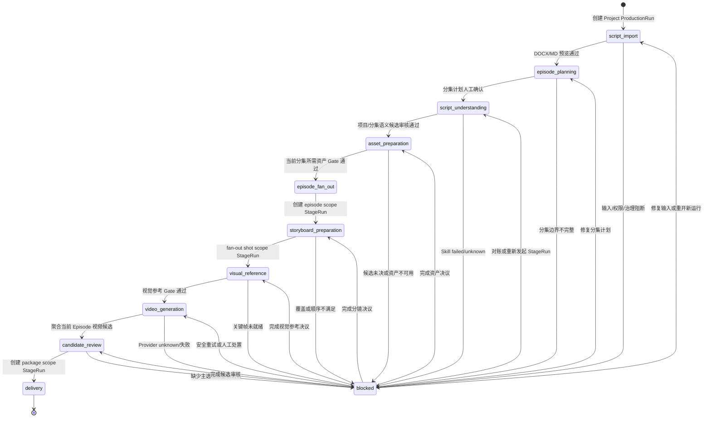

# Production Harness 与 Agent Skill 总体设计

- 文档 ID：DES-017
- 状态：proposed
- 版本：v0.2
- 日期：2026-08-19
- 适用阶段：MVP
- 上游：CUR-00、CUR-PROD、CUR-SCR、CUR-AST、CUR-PLT、CUR-SEC
- 目标：在不建设画布和通用低代码编排器的前提下，由 Production Harness 在 Workspace 授权边界内为每个 Project 从剧本导入开始统一管理深度解析、资产、分镜、生成、审核和交付的阶段、门禁、恢复与重入

## 1. 结论

MVP 采用“领域事实 + Production Harness + LangGraph Skill + WorkTask 执行层”的模式，不采用画布驱动业务，也不把 LangGraph checkpoint 当作第二套产品事实。

Production Harness 负责一个 Workspace 内每个 Project 的全流程：阶段依赖、作用域、输入版本、完成门禁、人工确认、暂停/恢复、失败重入和下一动作。LangGraph 负责 Harness 主图和每个 Skill 内部的结构化推理图。现有 `WorkTask + Outbox/Inbox + RabbitMQ + PostgreSQL` 负责可观察任务、消息投递、重复消费、Provider 执行、失败和未知状态。PostgreSQL 保存带 Workspace/Project 归属的 ProductionRun、StageRun、Gate、WorkTask 和业务对象；LangGraph 只保存恢复位置与结果引用。

```text
Workspace
  → Project
  → ProductionRun
  → StageRun(scope=project): DOCX/MD 导入、预览、分集规划、全局理解、共享资产
  → StageRun(scope=episode): 分集语义审核、分镜、候选审核
  → StageRun(scope=shot): 视觉参考、视频生成与选择
  → StageRun(scope=package): 预检、素材包冻结与交付
```

Workspace 是权限、协作和隔离容器，不是所有短剧共用的运行实例：一个 Workspace 可以包含多个 Project；每个 Project 同时最多一个 current ProductionRun，并保留历史运行。Episode 不是 ProductionRun 的父对象；它与 Shot、Package 一样通过 StageRun 的显式作用域独立推进，共用同一套版本化阶段、门禁、恢复和 Workspace 授权边界。

## 2. 当前范围

### 2.1 MVP 必须完成

- DOCX 和 Markdown 进入同一文档导入入口；
- Workspace 是制作流程的顶层作用域；每次导入、解析、候选审核、任务执行和交付都必须绑定当前 Workspace，不能跨 Workspace 复用或查询制作事实；
- 导入后先完成确定性格式分析并可预览，不自动创建正式业务对象；
- 固定的 DocumentRevision/ScriptVersion 作为 AI Skill 的输入版本；
- `script-structure-extraction` 作为第一个受控 Skill；
- 深度解析结果必须覆盖剧集摘要、场景、对白、人物档案、世界观规则、可复用资产、镜头和场景级生产任务建议；
- 剧集边界以原文显式分集标记和确定性文档分析为事实来源，模型只补充摘要和语义，不决定或改写正文边界；
- Skill 输出只能进入候选表，不得直接覆盖正式资产、分镜或当前选择；
- 复用已有 Task、Outbox、Inbox、RabbitMQ 和 Worker 完成异步执行；
- 结构化输出必须通过 Pydantic 契约和业务范围校验；
- 记录 Skill 名称、版本、输入 hash、trace_id、错误码和下一动作；
- 本地开发默认通过 Codex Python SDK 启动 `codex app-server`，使用只读沙箱、拒绝工具审批和临时线程；DeepSeek 仅作为显式备用 provider；
- Production Harness 的阶段图必须覆盖导入、解析、资产、分镜、关键帧、视频、审核和交付；当前 MVP 可以按阶段逐步实现，但不能再用独立页面或局部 Task 代替全局流程模型；
- 超时、响应未知、结构化输出非法、服务拒绝和限流均能映射到可观察任务状态；
- 现有项目页面可以按照业务状态继续推进，不依赖画布。

### 2.2 MVP 非目标

- 无限画布、节点、连线、自动布局和画布状态；
- 任意技术节点或用户自定义工作流编排；
- Agent 直接读写数据库、文件系统、密钥或任意项目资源；
- 自动接受 AI 候选、自动主选、自动导出或自动覆盖正式对象；
- MVP 不额外引入独立 Durable Workflow 服务；如未来规模需要，必须通过 ADR 证明它不会成为第二套业务事实；
- 以 Agent Harness 取代领域模块、任务状态机或治理门禁。

## 3. 分层边界

| 层 | MVP 责任 | 不承担 |
| --- | --- | --- |
| 业务模块 | 文档、脚本版本、候选、资产、分镜和人工决定 | Provider 调用细节、全流程推进 |
| Production Control | Workspace 内 Project 级 ProductionRun、分作用域 StageRun、Gate、Checkpoint 引用、阶段转移、暂停/恢复和下一动作 | 下游业务正文、Provider 技术细节、跨 Workspace 事实 |
| Platform Task | Task、Attempt、Outbox、Inbox、重试/未知状态和任务查询 | Prompt、阶段语义和候选业务语义 |
| Agent Harness（LangGraph） | Production 主图、Skill 子图、输入版本、结构化输出、checkpoint 和统一错误 | 直接写数据库、绕过门禁、任意工具权限 |
| Provider Adapter | DeepSeek 等模型调用、供应商错误映射 | Task、资产、主选和成本事实 |
| UI | 导入预览、启动 Skill、查看候选和人工审核 | 直接修改任务终态或绕过后端校验 |

### 3.1 Production Control 模型

Production Control 是逻辑模块，不是新的微服务。它拥有以下流程事实：

| 实体 | 作用 | 关键约束 |
| --- | --- | --- |
| `WorkflowDefinition` | 固定的阶段、依赖、允许作用域和 Gate 规则 | 版本化；运行开始后不得静默改变 |
| `ProductionRun` | 一个 Project 的一次完整制作运行 | 固定 `workspace_id`、`project_id`、workflow version、目标范围和运行策略；同 Project current 至多一个 |
| `StageRun` | ProductionRun 内某阶段在明确作用域的一次执行 | 固定 `scope_kind=project/episode/shot/package`、`scope_id`、输入版本/hash、输出引用、Task 引用、失败证据和重入次数 |
| `ProductionGate` | 阶段是否可以进入下一阶段 | 继承 `ProductionRun` 的 `workspace_id`；`pending / passed / blocked / rejected`，人工决定追加保存 |
| `ProductionCheckpoint` | Harness 恢复所需的位置 | 继承 `ProductionRun`/`StageRun` 的 Workspace 归属；只保存图节点、阶段 ID 和稳定引用，不保存正文副本 |

ProductionRun 的业务阶段定义固定，但运行实例按作用域形成依赖图而不是整个 Project 的单条串行链：

```text
script_import
→ episode_planning
→ script_understanding
→ asset_preparation
→ [episode] storyboard_preparation
→ [shot] visual_reference
→ [shot] video_generation
→ [episode] candidate_review
→ [package] delivery
```

`script_import`、`episode_planning` 和跨集理解/共享资产协调为 project scope；深度理解可以由 project 父 StageRun fan-out 为 episode 子 StageRun；分镜按 episode，视觉与视频生成按 shot，交付按 package。某个 Episode 满足自己的固定剧本、语义与所引用资产 Gate 后即可进入分镜，不等待其他 Episode；Project 快照聚合各作用域状态，但不把聚合百分比当作子范围事实。

阶段不允许通过 UI 任意跳过。只有满足本作用域的前置版本、readiness、治理、权限和人工 Gate 后，Harness 才能创建下一 StageRun。单个 StageRun 失败可以从同一固定输入追加重入；上游版本变化先计算影响，只将受影响 StageRun/输出标为 stale 或 superseded。同一 workflow/交付目标内局部返工不强制创建新 ProductionRun；整体目标或 workflow version 改变时才显式新建运行并关联被取代运行。任何阶段转移都必须同时校验 Workspace、Project、scope 目标、输入版本和 ActorContext 的归属关系。

Harness 节点只调用领域模块公开的 Command/Query/Port。确认候选、发布版本、创建正式资产、发布分镜基线、选择视频和冻结交付包，均由对应领域模块完成；Harness 只记录结果引用并决定下一步。

## 4. Agent Harness 契约

每一次 Skill 执行必须绑定：

- `workspace_id`、`project_id`、`production_run_id` / `stage_run_id`、`scope_kind/scope_id`：所属 Workspace、Project 运行、阶段运行和作用域目标；没有固定上下文不得启动 Skill；
- `actor_context`：Workspace 成员、角色、权限和治理上下文；系统执行也必须使用受控 service actor；
- `skill_name`：稳定的能力标识；
- `skill_version`：提示词、输出 schema 和实现共同组成的版本；
- `input_hash`：固定输入正文或规范化 payload 的 SHA-256；
- `trace_id`：贯穿 API、Outbox、Worker 和 Provider；
- `output_schema`：Pydantic 结构化输出类型；
- `allowed_tools`：本次 Skill 可使用的工具集合，MVP 默认为空；
- `timeout_seconds` 和单次模型调用的 Chunk 长度上限；整稿不以模型上下文上限拒绝，长稿由 Harness 分块调度；
- `candidate_only`：MVP 所有剧本解析 Skill 必须为 true。

Skill Harness 的成功条件是“返回符合契约且通过领域边界校验的候选结果”，不等于正式业务对象已创建。Production Harness 的成功条件是“阶段输出已由领域模块确认、Gate 已通过且下一阶段输入已固定”，二者不能混用。

### 4.1 Production Harness 主图

Production Harness 使用固定的业务主图，不开放用户自定义节点和任意连线：

```text
START
  → load_run
  → validate_scope_and_input_versions
  → run_current_stage
  → persist_stage_result
  → evaluate_gate
  → wait_human_or_continue
  → create_next_stage
  → END
```

`run_current_stage` 根据阶段注册表进入对应 Skill 子图或领域命令；`evaluate_gate` 同时读取领域 readiness、治理决定、WorkTask canonical 状态和人工决定。发生 `failed`、`unknown`、版本冲突或治理不可用时，主图只能进入明确的 blocked/manual_attention 状态，不得猜测性推进。

### 4.2 Skill LangGraph 图结构

MVP 的每个 Skill 使用显式 `StateGraph`，而不是在 Provider 类中手写隐式顺序。短文本仍可走单块图；达到长剧本阈值时，剧本结构 Skill 使用可恢复的 fan-out / 聚合图：

```text
START
  → validate_input
  → segment_script
  → fan_out_chunks
  → extract_chunk × N
  → aggregate_candidates
  → validate_output
  → candidate_gate
  → END
```

`segment_script` 依据确定性文档块和分集/场景边界生成有全局字符范围的 Chunk；`extract_chunk` 只接收一个 Chunk，输出局部范围候选；`aggregate_candidates` 将范围映射回整稿、限定候选 key、去重跨集资产、合并同集摘要和世界观事实，并保留类型化候选。输出类型至少包括 `EpisodeUnderstandingCandidate`、`SceneCandidate`、`DialogueCandidate`、`CharacterCandidate`、`WorldFactCandidate`、`AssetCandidate`、`ShotCueCandidate`、`ContinuityIssueCandidate` 和 `ProductionTaskSuggestion`；不得通过 `continuity(scope=...)` 或通用 `asset` 枚举混装不同产品语义。这样每种候选都有独立 schema、审核动作和下游物化责任，长稿也不会因为单次上下文或响应上限被截断。当前没有 `MAX_SCRIPT_CHUNKS`、整稿字符数、集数或单集字符数这类业务上限，只有单 Chunk 的 provider 保护阈值；媒体上传仍受统一对象存储字节保护，DOCX 解压仍有压缩炸弹防护，这些是基础设施安全边界而不是剧本业务上限。图支持注入 LangGraph checkpointer；MVP 默认不把它作为第二套业务事实，仍由领域 Task 持有运行结果。

本地 Codex 适配器不连接当前桌面聊天窗口，而是由 I/O Worker 通过官方 Python SDK 管理一个本机 `codex app-server` stdio 进程。每个 Chunk 使用临时线程，`Sandbox.read_only`、`ApprovalMode.deny_all` 和严格 JSON Schema；适配器自身以并发信号量保护 app-server 队列。这样后端可直接复用本机 Codex 登录态，同时保持 Skill 无数据库写入和无文件写入权限。

图中的状态只保存当前执行所需的结构化数据；业务任务、候选、正式资产和人工决定仍由 Lanverse 模块持有。`SceneCandidate` 必须包含分集号、场景序号、叙事目的、出场角色、道具/环境、连续性提示和建议的制作任务；确认正式场景时，这些内容保存到 `semantic_context`，不因候选确认而丢失。`CharacterCandidate` 负责跨 Chunk 人物归一及目标、关系、外观和角色弧光；`WorldFactCandidate` 负责世界事实、规则、实体和主题；`AssetCandidate` 仅负责当前范围内的角色、地点、道具、服装和视觉风格参考身份，不引入声音资产。`EpisodeUnderstandingCandidate` 负责分集标题、logline、摘要、hook、关键节拍和类型化子候选引用；`ShotCueCandidate` 负责后续分镜草案所需的镜头目的、构图/运动、视觉提示和资产绑定建议。制作任务建议只作为候选事实，审核后再由领域 Task 命令创建真实任务。

需要人工确认的高成本动作后续使用 LangGraph `interrupt()`，并通过可注入的 checkpointer 恢复；当前剧本候选审核仍由既有业务 API 完成，不在 Worker 内等待用户。

### 4.3 剧本理解输出契约

`script-understanding` 的输出不是只有分集边界的 `EpisodeProposal`，而是候选型的 `EpisodeUnderstandingCandidate`。每个显式分集必须返回：

```text
episode_number
title
logline
summary
hook
key_beats[]
scene_refs[]
dialogue_refs[]
character_refs[]
world_fact_refs[]
asset_refs[]
shot_refs[]
continuity_issue_refs[]
production_task_suggestion_refs[]
source_ranges[]
confidence
issues[]
```

其中：

- `title`、`logline`、`summary`、`hook` 和 `key_beats` 是 `EpisodeUnderstandingCandidate` 的一等字段；
- `dialogue_refs`、`character_refs`、`world_fact_refs`、`asset_refs`、`shot_refs`、`continuity_issue_refs` 和 `production_task_suggestion_refs` 指向对应显式类型候选 key，不直接创建正式业务对象；
- `scene_refs` 必须引用同一解析结果中的 scene candidate；
- `source_ranges` 必须回到固定 `DocumentRevision`/`ScriptVersion` 的全局字符范围；
- `production_task_suggestion_refs` 指向的内容只是建议，审核后才能通过领域命令创建真实 Task；
- `第 N 集` 只能作为缺失语义时的临时显示标识，不得作为成功的解析标题。

分集规划负责边界和顺序；剧本理解 Skill 负责语义补全。模型不得修改确定性分集边界，也不得以语义候选覆盖原文。

### 4.4 真实剧本验收样本

当前验收样本为 `He Left Our Kids to Drown—He Didn’t Know I Was the Empress.docx`，提取后为 139,723 个字符（140,565 UTF-8 字节），包含 60 个显式分集标记、131 个场景头和 3,981 个确定性文档块。解析 Skill 至少必须满足：

1. 文档预览不因旧的整稿字符数、单集字符数或集数业务上限被拒绝；
2. 确定性分段保留 60 个分集边界和 131 个场景边界的全局 source range（包括 `I/E.` 场景头）；
3. Skill 以 Chunk 执行并聚合；该样本实际生成 121 个 Chunk，最大 Chunk 为 3,837 个字符，不向模型发送超过单 Chunk 上限的整稿；
4. 聚合结果中每个显式分集都有完整的 `EpisodeUnderstandingCandidate`，至少包含标题、logline、summary、hook 和 key beats；场景、对白、资产、镜头、世界观和连续性候选均可追溯到原文范围；
5. 跨集重复角色/地点/道具不会生成无限重复的资产候选，角色资产保留跨集出现信息和人物档案；
6. 任一 Chunk 失败时整体任务进入明确的 failed/unknown，不提交部分成功的正式候选。

### 4.5 错误分类

| Harness 错误 | 任务结果 | 用户下一动作 |
| --- | --- | --- |
| `agent_output_invalid` | failed | 修复输入或重新发起解析 |
| `agent_input_invalid` | failed | 修复输入版本 |
| `agent_timeout` | unknown | 等待对账或人工重新发起 |
| `agent_provider_unavailable` | unknown/failed | 检查服务后重试 |
| `agent_provider_rejected` | failed | 配置或更换已验证能力 |
| `agent_tool_denied` | failed | 修改 Skill 配置，不允许绕过 |

未知状态不自动生成第二次外部请求；安全重试必须由现有 Task 命令创建新任务。

## 5. 业务闭环状态



每个作用域同时保留三类独立状态：阶段控制状态、领域对象 readiness、WorkTask canonical 状态。解析候选与正式对象之间必须存在明确的人工决定。解析成功只代表候选完整可审阅，不代表角色、场景、镜头已经正式生效。Episode 的交付完成只允许在其目标 package 由 ExportSnapshot 冻结且 PackageBuild ready 后出现；ProductionRun 只在目标范围内全部 package Gate 通过后完成。

## 6. 现有代码的复用和调整

- 复用 `backend/app/modules/production` 的 Task 状态与命令；
- 在同一 `production` 逻辑模块内以 `control` 边界增加 Project 级 ProductionRun、带显式 scope 的 StageRun、Gate 和恢复引用；现有 WorkTask 作为 `tasks` 执行边界复用。两者可以同进程但不能混成一个状态机，也不复制下游领域对象；
- 复用 `backend/app/modules/messaging` 的 Outbox/Inbox 和 Worker 交接；
- 复用 `backend/app/modules/scripts/documents` 的文档 revision 与确定性分析；
- 复用 `backend/app/modules/scripts/extractions` 的候选、决定和结果入库；
- 将 `backend/app/integrations/deepseek.py` 的剧本解析调用接入 LangGraph Harness；
- 当前不新增独立 AgentRun 事实表；Skill 执行通过 StageRun、WorkTask、Attempt、审计和固定输入 hash 关联表达，LangGraph checkpoint 只保存可恢复指针；
- Episode Planning 继续作为剧集创建门禁；显式分集直接由确定性分析生成预览，确认后批量创建正式 Episode。旧的 10 集、整稿字符数和单集字符数业务上限已从最终 ORM/契约中移除；单 Chunk 和底层媒体安全边界仍保留。

## 7. 验收门禁

1. 同一个 Skill、同一个输入 hash 和同一个幂等键不会生成第二个业务任务。
2. 模型返回非法 JSON 或不符合 schema 时，不产生正式候选，不进入成功状态。
3. 模型超时或连接结果未知时，任务进入 `unknown`，不会自动重复外发。
4. 解析结果中越界的 source range、无效候选引用和重复 candidate key 必须失败。
5. 候选审核可以接受新对象、带修改接受、关联已有对象或忽略，且并发 revision 冲突不会覆盖他人决定。
6. Worker 重启、重复消息和重复回调不产生第二批候选、第二个 Task 或第二次审计事实。
7. DOCX 和 Markdown 经过预览后使用同一个 DocumentRevision/Extraction 流程。
8. 任意跨 Workspace 的 Project、Episode、DocumentRevision、Candidate、WorkTask、Media 或 Export 引用都必须被拒绝，成功数为 0。
9. 本机 Codex 可用时，默认使用 `codex_local` 完成结构解析；关闭本机 Codex 后可显式选择 DeepSeek 或 disabled，服务仍能完成导入预览，只有启动 AI Skill 时明确提示能力不可用。
10. 用户确认结构后，正式场景仍保留故事节拍、人物、道具、环境、连续性和场景级生产任务建议；这些建议不会被误报为已经创建的生产任务。
11. 一个 Episode 的 blocked/failed/unknown 不阻止其他已满足依赖 Episode 进入下一阶段，也不回滚其成功候选、分镜或媒体；Project 快照逐类汇总而非伪造单一状态。
12. ProductionRun 必须属于 Project；任何把 Episode 作为 ProductionRun 父对象，或没有 `scope_kind/scope_id` 的 StageRun，都不能通过架构与契约验收。

## 8. 后续演进

当 MVP 通过真实项目和故障测试后，再评估：

1. 将更多脚本、分镜草案、关键帧和视频辅助能力接入既有 Production Harness；
2. 增加有限的领域工具白名单和人工确认提议；
3. 在真实规模和故障证据不足时，才评估 Temporal 等独立 Durable Workflow 基础设施；
4. 最后再评估 LibTV 风格的项目画布作为同一领域事实的只读/操作投影。

## 9. 变更记录

| 版本 | 日期 | 变更 |
| --- | --- | --- |
| v0.1 | 2026-08-18 | 建立 LangGraph Skill Harness、候选边界和本地 Codex 解析设计。 |
| v0.2 | 2026-08-19 | 增加 Project 级 ProductionRun、显式 StageRun scope、人工 Gate、分集并行、影响恢复和端到端交付边界。 |
