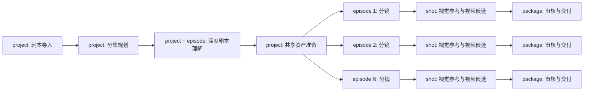

# CUR-PROD 制作流程控制与 Agent Harness 需求

## 0. 文档元数据

| 项目 | 内容 |
| --- | --- |
| 文档 ID | CUR-PROD |
| 文档序号 | 013 |
| 版本 | 0.2 |
| 状态 | proposed |
| 当前产品阶段 | 从 DOCX/Markdown 剧本到逐镜视频素材包；不包含剪辑与成片 |
| 上游输入 | CUR-00、CUR-IAM、CUR-PRJ、CUR-SCR、CUR-PLT、CUR-SEC |
| 下游需求 | CUR-AST、CUR-SBD、CUR-KFR、CUR-VID、CUR-EXP；CUR-CAN 仅为 post-MVP 投影 |

## 1. 模块定位

Production Control 是一部短剧项目完整制作生命周期的唯一流程控制面。它从剧本导入开始，管理阶段依赖、固定输入、人工门禁、分集并行、暂停恢复、局部返工和下一动作，但不复制剧本、资产、分镜、媒体、任务或导出事实。

Workspace 是授权、协作和隔离边界；Project 是一部完整短剧及其制作运行边界；Episode、Shot 和 Export Package 是项目运行中的可独立推进范围。一个 Project 同时最多有一个 current ProductionRun，历史运行不可覆盖。

### 1.1 产品目标

1. 用户始终知道当前项目处于什么阶段、哪些分集可继续、被什么事实阻塞以及下一步是什么。
2. 整剧解析和共享资产只管理一次，单集与镜头可在满足自身依赖后并行推进，不被无关分集阻塞。
3. AI Skill 只产生可追溯候选；任何正式对象、版本、主选或交付冻结仍由对应领域模块和人工决定产生。
4. 刷新、断线、Worker 重启、重复消息和 Provider 结果未知时，流程可以从已提交事实恢复，不重复外部副作用。
5. 上游版本变化只使受影响范围 stale/superseded，不回滚其他已确认分集，也不改写历史交付。

### 1.2 成功指标

| KPI ID | 指标 | 目标 |
| --- | --- | --- |
| CUR-PROD-KPI-001 | 页面展示但无法回到来源事实的阶段、进度、阻塞或下一动作 | 0 |
| CUR-PROD-KPI-002 | 一个 Episode 局部失败导致其他已满足依赖 Episode 被强制回滚 | 0 |
| CUR-PROD-KPI-003 | 刷新、重复提交或 Worker 重启产生重复 StageRun、WorkTask 或 Provider 请求 | 0 |
| CUR-PROD-KPI-004 | 跨 Workspace 读取、推进、恢复或关联 ProductionRun/StageRun 成功数 | 0 |
| CUR-PROD-KPI-005 | 从 blocker 进入正确修复对象并返回原制作上下文的任务成功率 | ≥95% |

## 2. 范围与非范围

### 2.1 当前范围

- 为 Project 创建、恢复、暂停、取消和完成唯一 current ProductionRun；
- 固定版本的阶段定义、依赖、作用域、StageRun、Gate 和人工决定；
- `project / episode / shot / package` 四类执行作用域及其聚合摘要；
- 整剧级阶段与分集/镜头级阶段的 fan-out、独立推进和受控聚合；
- StageRun 固定输入、输出引用、关联 WorkTask、失败证据和重入历史；
- AI Skill 的名称、版本、输入 hash、输出契约、候选边界和工具白名单；
- 上游变化的影响计算、stale/superseded 标记和局部返工；
- 项目/分集工作台消费的阶段、blocker、next action 和新鲜度快照；
- Workspace 授权、CUR-SEC 治理与 CUR-PLT 外部任务状态的最终门禁。

### 2.2 明确非范围

- 用户自定义流程、任意节点连线、BPMN、低代码编排器或 Canvas；
- 把 LangGraph checkpoint、RabbitMQ 消息或前端状态当作产品事实；
- 直接编辑或持有剧本、资产、Shot、媒体候选、主选和导出包正文；
- 自动接受 AI 候选、自动选择媒体、自动冻结交付或绕过人工门禁；
- Timeline、字幕、音频后期、视频拼接、整集渲染、成片和发布分发；
- 项目预算、币种、支付、账单或商业额度管理；
- 为 MVP 单独建设新的 Durable Workflow 微服务。

## 3. 顶层作用域与流程图

```text
Workspace
└── Project
    ├── ProductionRun（current 至多一个，历史可追溯）
    │   ├── StageRun(scope=project)
    │   ├── StageRun(scope=episode, scope_id=Episode)
    │   ├── StageRun(scope=shot, scope_id=Shot)
    │   └── StageRun(scope=package, scope_id=ExportSnapshot/PackageBuild)
    └── Episode × N
```

Episode 不是 ProductionRun 的父对象。整剧导入、分集规划、全局世界观/角色归一和共享资产发生在 Project 级；分集分镜、视觉参考、逐镜生成、候选审核和交付按 Episode/Shot/Package 级推进。



某一 Episode 进入分镜只要求其固定剧本语义和所引用共享资产满足门禁，不等待所有 Episode 完成；Project 完成则要求目标交付范围内全部 Episode 的 package Gate 通过。

## 4. 角色与权限

| 能力 | owner | editor | viewer |
| --- | :---: | :---: | :---: |
| 查看运行、阶段、阻塞和历史 | ✓ | ✓ | ✓ |
| 创建/恢复/暂停 ProductionRun | ✓ | ✓ | — |
| 启动或安全重入 StageRun/Skill | ✓ | ✓ | — |
| 通过/拒绝人工 Gate | ✓ | ✓ | — |
| 取消整个 ProductionRun | ✓ | — | — |
| 查看诊断引用而非敏感正文 | ✓ | ✓ | 按 CUR-SEC 脱敏 |

页面打开后权限变化时，下一次写命令必须重新授权；前端隐藏按钮不能代替服务端校验。

### 4.1 用户场景与用户语言

| 场景 ID | 用户场景 | 成功结果 |
| --- | --- | --- |
| CUR-PROD-US-001 | 创作者离开项目后重新登录并点击“继续制作” | 回到同一 current ProductionRun、正确作用域、阻塞和下一动作，不重新创建运行或任务。 |
| CUR-PROD-US-002 | 60 集中部分集已具备分镜条件、部分集仍待确认 | 可继续满足依赖的 Episode；阻塞集保持独立，项目概览同时显示完成/阻塞/未知范围。 |
| CUR-PROD-US-003 | 某一镜 Provider 返回未知、失败或候选质量不合格 | 只处理该 Shot 的对账、重入或重新选择，不回滚其他已确认镜头。 |
| CUR-PROD-US-004 | 上游剧本修改后继续制作或重新导出 | 先看到受影响 Episode/Shot/Package，再选择局部返工；历史运行和素材包保持可追溯。 |
| CUR-PROD-US-005 | owner 需要暂停或取消整部项目制作 | 系统列出已外发、不可取消和 unknown 任务，确认后停止创建新副作用并保留恢复/审计证据。 |

面向创作者的页面使用“制作流程、当前步骤、待确认、被阻塞、继续制作、局部重做”等语言；`ProductionRun`、`StageRun`、`Gate`、checkpoint、WorkTask 和 LangGraph 只出现在诊断/API/开发文档中，不能作为理解主流程的前提。

## 5. 功能需求清单

| FR ID | 名称 | 优先级 | 状态 |
| --- | --- | --- | --- |
| CUR-PROD-FR-001 | 创建和恢复 Project 级 ProductionRun | P0 | proposed |
| CUR-PROD-FR-002 | 以固定阶段图和显式作用域推进流程 | P0 | proposed |
| CUR-PROD-FR-003 | 固定 StageRun 输入、输出和任务引用 | P0 | proposed |
| CUR-PROD-FR-004 | 执行领域 readiness 与人工 Gate | P0 | proposed |
| CUR-PROD-FR-005 | 安全暂停、恢复、重入和结果未知处理 | P0 | proposed |
| CUR-PROD-FR-006 | 分集/镜头 fan-out 与独立失败隔离 | P0 | proposed |
| CUR-PROD-FR-007 | 处理上游版本变化和局部返工 | P0 | proposed |
| CUR-PROD-FR-008 | 生成可解释快照、blocker 和 next action | P0 | proposed |
| CUR-PROD-FR-009 | 在受控 Agent Skill 中产生候选 | P0 | proposed |
| CUR-PROD-FR-010 | 按目标范围完成运行和交付 | P0 | proposed |
| CUR-PROD-FR-011 | 强制 Workspace 隔离和审计关联 | P0 | proposed |

## 6. 详细功能需求

### CUR-PROD-FR-001 创建和恢复 Project 级 ProductionRun

- **前置条件：** Project active；当前 Workspace owner/editor；没有另一个 active current ProductionRun。
- **主流程：** 系统基于固定 workflow definition 创建 ProductionRun，绑定 Workspace/Project、目标范围和策略版本；重复意图回读同一运行；用户回到项目时恢复 current 运行而非新建。
- **失败与规则：** 同 Project 同时创建两个 current 运行必须零部分成功；新运行不能覆盖旧运行，重新开始须显式 supersede 旧运行并保留原因。
- **UI：** 显示运行状态、当前阻塞、最近活动和“继续制作”；不要求用户理解 LangGraph、Task 或内部节点。

### CUR-PROD-FR-002 以固定阶段图和显式作用域推进流程

- **主流程：** 系统按版本化阶段依赖创建 StageRun，每个 StageRun 必须有 `scope_kind` 和稳定 `scope_id`；只有依赖和 Gate 满足时才可进入下一阶段。
- **业务规则：** project 阶段不能伪装成 episode 阶段；页面不得手工设置完成百分比或跳过必需依赖；阶段显示名与内部 code 分离。
- **UI：** 先显示面向创作者的主阶段，再允许展开分集/镜头子进度；没有有效事实时显示 unavailable，不显示 0% 冒充已计算。

### CUR-PROD-FR-003 固定 StageRun 输入、输出和任务引用

- **主流程：** 创建 StageRun 时固定输入版本/hash、作用域、Skill/命令版本和治理策略；执行完成后只登记稳定输出引用、WorkTask/Attempt 引用和验证结果。
- **失败与规则：** 输入发生变化时旧 StageRun 不得静默改写；输出越界、引用其他 Workspace 或缺少固定输入时不得 passed。

### CUR-PROD-FR-004 执行领域 readiness 与人工 Gate

- **主流程：** Gate 同时检查依赖 StageRun、领域 readiness、CUR-PLT canonical Task 状态、CUR-SEC 决定、权限和所需人工决定。
- **业务规则：** AI 置信度不能自动通过人工 Gate；Gate `pending / passed / blocked / rejected` 的每次决定均保留 actor、理由、时间和输入摘要；治理 unavailable 时 fail-closed。
- **UI：** 明确区分“AI 已完成”“候选待确认”“正式对象已就绪”和“可以进入下一阶段”。

### CUR-PROD-FR-005 安全暂停、恢复、重入和结果未知处理

- **主流程：** 用户暂停后不创建新 StageRun/Task，已外发任务按 CUR-PLT 能力处理；恢复从数据库已提交状态继续；failed 可在同一固定输入上追加新 StageRun 尝试。
- **失败与规则：** `unknown` 必须先对账，不自动重发；checkpoint 只定位恢复节点，丢失 checkpoint 时可从 ProductionRun/StageRun/WorkTask 事实重建安全下一动作。

### CUR-PROD-FR-006 分集/镜头 fan-out 与独立失败隔离

- **主流程：** project Gate 通过后按目标 Episode/Shot 建立独立 StageRun；满足自身依赖的范围可继续，失败范围显示 blocker 并可局部重入。
- **业务规则：** 一个 Episode/Shot 的 failed、blocked 或 unknown 不删除其他范围成功输出；聚合进度必须同时报告完成数、阻塞数、未知数和总范围，不用单一伪精确百分比掩盖状态。

### CUR-PROD-FR-007 处理上游版本变化和局部返工

- **主流程：** 上游 current 变化后先计算影响范围；受影响 StageRun/输出进入 stale 或 superseded，未受影响范围保持有效；用户从影响清单选择沿用确认、局部重做或显式新运行。
- **业务规则：** 历史 StageRun、候选、主选和 ExportSnapshot 不改变；沿用必须记录所比较版本、actor 和理由；影响分析 unavailable 时不宣称 ready。

### CUR-PROD-FR-008 生成可解释快照、blocker 和 next action

- **主流程：** 为 Project 和 Episode 提供当前阶段、各作用域摘要、来源时间、blocker、允许动作和目标路由；Projects 模块只投影该结果。
- **业务规则：** next action 是建议导航，不自动执行副作用；每个状态和数字必须回到 StageRun/Gate/领域 readiness/WorkTask 来源；partial failure 分区显示。

### CUR-PROD-FR-009 在受控 Agent Skill 中产生候选

- **主流程：** StageRun 启动版本化 Skill，固定输入、schema、provider、允许工具、超时和 candidate-only；结果经结构、范围、引用和领域规则校验后写入拥有模块的候选入口。
- **业务规则：** Skill 不直接写正式对象，不自行推进 Gate，不访问未授权 Workspace 资源；长文可分块 fan-out/reduce，但整体提交必须满足引用完整性，部分结果不得冒充完整成功。

### CUR-PROD-FR-010 按目标范围完成运行和交付

- **主流程：** PackageBuild ready 后关闭对应 package/episode Gate；目标范围全部完成后 ProductionRun 才可 completed。
- **业务规则：** 当前完成结果是固定、有序、可追溯的逐镜视频素材包，不是成片；`partial` 与 `complete` 的范围必须显式；完成后新变更产生新 StageRun/PackageBuild，不改旧完成证据。

### CUR-PROD-FR-011 强制 Workspace 隔离和审计关联

- **主流程：** 所有命令、查询、事件、checkpoint 引用和 WorkTask handoff 都携带 Workspace 与稳定目标，服务端从父链重新验证。
- **失败与规则：** 跨 Workspace 目标统一拒绝且不泄露存在性；普通日志不记录正文、Prompt、媒体 URL 或凭据；高风险决定关联 CUR-SEC AuditRecord。

### 6.1 逐 FR 输入、输出、备选与失败契约

| FR | 前置条件与输入 | 成功输出 | 备选/失败与恢复 | UI/交互要求 |
| --- | --- | --- | --- | --- |
| FR-001 | active Workspace/Project、owner/editor、workflow version、幂等键 | 唯一 current ProductionRun、恢复位置、下一动作 | 已有 current 时回读；冲突零写入；创建 Project 成功而 Run 未完成时以同一意图恢复 | “继续制作”优先，不暴露内部运行 ID |
| FR-002 | current Run、目标 scope、固定阶段定义、依赖快照 | 具有 code、scope、依赖和状态的 StageRun | 依赖未满足返回 blocker；未知 scope、跨 Project 或跳阶段拒绝 | 主阶段 + 可展开的分集/镜头子状态；无来源时显示 unavailable |
| FR-003 | StageRun、输入版本/hash、Skill/命令版本、治理策略 | 稳定输出引用、WorkTask/Attempt 引用、验证摘要 | 输入漂移则旧 StageRun 保持不变并进入 stale；非法/悬空引用整体失败 | 显示固定输入摘要、最近尝试与可安全重入动作 |
| FR-004 | 依赖 StageRun、领域 readiness、Task canonical 状态、治理与权限决定 | append-only Gate 决定和允许的下一动作 | 低置信或治理 unavailable 保持 waiting/blocked；并发决定冲突零写入 | 用完整文字区分 AI 完成、待人工确认、正式就绪、可推进 |
| FR-005 | active/paused/failed Run 或 StageRun、预期 revision、理由 | 新控制状态、重入 StageRun 或对账入口 | 不可取消任务继续追踪；unknown 只对账；checkpoint 丢失时由数据库事实重建 | 暂停/取消前列出影响；重试仅在明确安全时可用 |
| FR-006 | 已通过的 project/episode Gate、目标 Episode/Shot 集合 | 独立子 StageRun 与分区聚合摘要 | 单范围失败只标记该范围；批量部分创建保留成功并列出失败，不伪造整体成功 | 支持按 ready/blocked/unknown 筛选并直接进入目标对象 |
| FR-007 | 旧/新 current 版本、血缘、目标运行 | 影响清单、stale/superseded 标记、局部返工方案 | 影响计算 unavailable 时停止推进；用户可沿用未受影响范围或显式新 Run | 先预览受影响数量/对象/原因，再允许确认局部重做 |
| FR-008 | Project、可选 Episode、actor、各来源快照 | 分区状态、新鲜度、blocker、next action | 单来源失败只使该分区 unavailable；过期结果显示最后成功时间 | 首屏只突出真实下一动作，不用单一百分比掩盖分区状态 |
| FR-009 | 固定文本/媒体版本、Skill/schema/provider/工具策略 | 结构校验通过的类型化候选与完整性报告 | Provider 不可用可换显式备用；部分/非法输出不得 passed；正式对象写入意图拒绝 | 候选可跳回来源并显示模型版本、范围和审核状态 |
| FR-010 | 目标 package、完整性预检、固定 ExportSnapshot、ready PackageBuild | 对应 package/episode Gate 和按范围完成的 Run | partial 必须显式；缺镜、stale、unknown 或包 hash 异常保持 blocked | 明确输出是逐镜素材包而非成片，并提供历史包入口 |
| FR-011 | ActorContext/service actor、Workspace/Project/scope 父链、审计策略 | 授权结果和必要 AuditRecord 关联 | 角色撤销立即拒绝下一写入；跨 Workspace 不泄露存在性；敏感诊断脱敏 | 无权操作不显示可执行控件，直接 ID 仍由服务端统一拒绝 |

## 7. 领域实体、状态与不变式

| 实体 ID | 实体 | 关键含义 |
| --- | --- | --- |
| CUR-PROD-ENT-001 | WorkflowDefinition | 版本化固定阶段、依赖、作用域和 Gate 规则。 |
| CUR-PROD-ENT-002 | ProductionRun | Project 一次完整制作运行；current 至多一个，历史不可覆盖。 |
| CUR-PROD-ENT-003 | StageRun | 某阶段在 project/episode/shot/package 作用域上的一次固定输入执行。 |
| CUR-PROD-ENT-004 | ProductionGate | 阶段是否可以交接的显式、可解释决定。 |
| CUR-PROD-ENT-005 | ProductionCheckpointRef | 仅用于 Harness 恢复的稳定引用，不保存领域正文。 |
| CUR-PROD-ENT-006 | ProductionSnapshot | 面向工作台的可重建 Project/Episode 流程投影。 |

```text
ProductionRun lifecycle: active ↔ paused → completed | cancelled | superseded
Stage control: not_started → active → waiting_human → passed
                               └→ blocked
                               └→ superseded
Gate: pending → passed | blocked | rejected
```

Stage control、领域 readiness 和 WorkTask canonical 状态是三类独立事实，不能压成一个状态。`unknown` 属于 WorkTask 待对账状态，不是 StageRun 成功或失败结论。

核心不变式：

1. 一个 Project 同时最多一个 active/paused current ProductionRun；ProductionRun 不隶属于 Episode。
2. StageRun 必须绑定唯一 Workspace、Project、ProductionRun、scope、固定输入和 workflow version。
3. 同一运行可有多个 Episode/Shot StageRun 并行；聚合状态不得覆盖子范围事实。
4. Gate passed 不改变领域对象；领域对象改变也不自动伪造 Gate passed。
5. Skill、页面、Task 和 checkpoint 都不能直接修改流程终态。
6. 历史运行、阶段、决定和交付证据不可原地覆盖。

## 8. 接口与事件

| IF ID | 能力 | 必要输入 | 用户可观察输出 |
| --- | --- | --- | --- |
| CUR-PROD-IF-001 | 创建/读取 current 运行 | Workspace、Project、workflow version、幂等键 | ProductionRun 或冲突 |
| CUR-PROD-IF-002 | 启动/恢复 StageRun | scope、固定输入、expected run revision | StageRun、WorkTask 引用或 blocker |
| CUR-PROD-IF-003 | Gate 决定 | Gate、固定输入摘要、actor、理由、expected revision | 新决定、冲突或下一动作 |
| CUR-PROD-IF-004 | 获取工作台快照 | Project、可选 Episode、actor | 分区摘要、来源、新鲜度、blocker、next action |
| CUR-PROD-IF-005 | 影响分析/局部返工 | 旧/新版本、目标范围 | 受影响 StageRun/输出和允许动作 |
| CUR-PROD-IF-006 | 暂停/恢复/取消 | ProductionRun、expected state、理由 | 新状态或无法安全操作的任务清单 |

事件至少包括 `ProductionRunCreated/StateChanged`、`StageRunStarted/StateChanged`、`ProductionGateDecided`、`ProductionScopeBecameStale` 和 `ProductionSnapshotChanged`。事件只含稳定 ID、版本、状态、错误码和关联引用，不含正文或完整模型输出。

## 9. 非功能需求

| NFR ID | 要求 | 验收目标 |
| --- | --- | --- |
| CUR-PROD-NFR-001 | 隔离 | 跨 Workspace 读写、推进、恢复、事件消费和 Task handoff 成功数为 0。 |
| CUR-PROD-NFR-002 | 幂等 | 100 次重复创建/启动/Gate 决定不产生第二正式事实或外部副作用。 |
| CUR-PROD-NFR-003 | 恢复 | API/Worker/Broker 重启后从已提交事实恢复；已确认事实丢失和重复 Provider submit 均为 0。 |
| CUR-PROD-NFR-004 | 状态可见 | 已提交 Stage/Gate/领域/Task 变化后，工作台可观察目标 P95 ≤5 秒；超时显示新鲜度未知。 |
| CUR-PROD-NFR-005 | 局部隔离 | 60 集样本中任一 Episode/Chunk/Shot 失败不回滚其他已提交成功范围。 |
| CUR-PROD-NFR-006 | 追溯 | 100% StageRun/Gate/next action 可回到 workflow version、固定输入、scope、actor/系统身份、Task 和输出引用。 |
| CUR-PROD-NFR-007 | 可解释性 | 用户测试中至少 90% 能区分 AI 完成、待人工确认、正式就绪和流程完成。 |
| CUR-PROD-NFR-008 | 可访问性 | 继续、暂停、查看 blocker、Gate 决定和局部重入满足 WCAG 2.2 AA，并可仅用键盘完成。 |
| CUR-PROD-NFR-009 | 隐私 | 普通日志、指标和事件中完整剧本、Prompt、媒体 URL、Provider 原响应和凭据泄露数为 0。 |

## 10. 验收条件

| AC ID | 关联 FR | Given / When / Then |
| --- | --- | --- |
| AC-CUR-PROD-001 | FR-001 | Given Project 已有 active current run，When 重复创建，Then 回读同一运行或明确冲突，不创建第二个。 |
| AC-CUR-PROD-002 | FR-002/006 | Given 60 集中第 2 集阻塞、第 1 集资产就绪，When 用户继续第 1 集，Then 可进入分镜且第 2 集 blocker 保持独立。 |
| AC-CUR-PROD-003 | FR-003 | Given StageRun 固定 V1，When current 改为 V2，Then V1 记录不变，受影响范围 stale，不把输入替换成 V2。 |
| AC-CUR-PROD-004 | FR-004 | Given Skill succeeded 但候选未审，When 读取阶段，Then 显示 waiting_human，不显示资产/分镜 ready。 |
| AC-CUR-PROD-005 | FR-005 | Given Provider submit 超时且结果未知，When Worker 重启，Then 同一 WorkTask 保持 unknown/对账入口，不产生第二 submit。 |
| AC-CUR-PROD-006 | FR-006 | Given 一个 Chunk 输出非法，When 聚合，Then 本次完整解析不 passed，其他已提交项目事实不回滚，部分候选不冒充完整成功。 |
| AC-CUR-PROD-007 | FR-007 | Given Episode 1 剧本变更但 Episode 2 输入不变，When 影响计算，Then 仅 Episode 1 相关 StageRun/输出待复核。 |
| AC-CUR-PROD-008 | FR-008 | Given Videos 摘要 unavailable，When 打开工作台，Then 该分区显示 unavailable/更新时间，其他分区继续可读且不显示 0 伪装成功。 |
| AC-CUR-PROD-009 | FR-009 | Given Skill 返回正式对象写入指令或跨 Workspace 引用，When 校验，Then 整体拒绝，不推进 Gate。 |
| AC-CUR-PROD-010 | FR-010 | Given目标范围所有镜头唯一主选且 PackageBuild ready，When 关闭交付 Gate，Then Episode/Project 按范围完成，历史包冻结不漂移。 |
| AC-CUR-PROD-011 | FR-011 | Given actor 属于 Workspace A，When 操作 Workspace B 的 Run/Stage/Task，Then 统一拒绝且不泄露资源存在性。 |
| AC-CUR-PROD-012 | FR-001～011 | Given 用户刷新或重新登录，When 回到 Project，Then 恢复同一 current ProductionRun、正确阶段、blocker 和下一动作。 |

## 11. 已决策与开放问题

### 11.1 已决策

- ProductionRun 属于 Project，不属于 Episode；Episode/Shot/Package 通过 StageRun scope 表达。
- 一个 Project 同时最多一个 current ProductionRun；运行历史追加保存。
- 流程主图固定且版本化；MVP 不允许用户自定义节点和任意跳阶段。
- 分集与镜头在满足自身依赖后可独立推进；Project 状态是聚合，不强制全局串行。
- LangGraph 是执行与恢复工具，不是业务事实源；业务状态以 PostgreSQL 中领域事实和 Production Control 为准。
- 当前完成结果是逐镜视频素材包，不是成片。

### 11.2 开放问题

| ID | 问题 | 当前处理 |
| --- | --- | --- |
| CUR-PROD-OQ-001 | 首次真实项目允许同时运行多少 Episode/Shot StageRun？ | 由 60 集样本和 Provider 限流 PoC 签认并发策略；不作为项目业务上限。 |
| CUR-PROD-OQ-002 | 哪些 Gate 可由规则自动通过？ | 仅纯确定性完整性 Gate 可提案；涉及候选接受、版本发布、主选和交付冻结仍需显式人工决定。 |
| CUR-PROD-OQ-003 | current ProductionRun 完成后改稿是追加 StageRun 还是新运行？ | 同一交付目标内局部返工追加 StageRun；改变整体目标/workflow version 时显式新运行并保留关联。 |

## 12. 变更记录

| 版本 | 日期 | 变更 |
| --- | --- | --- |
| 0.1 | 2026-08-19 | 建立 Project 级 ProductionRun、显式 StageRun 作用域、分集并行、门禁、恢复、影响与端到端验收契约。 |
| 0.2 | 2026-08-19 | 补齐用户场景、创作者语言和逐 FR 输入/输出/备选/失败/UI 契约。 |
