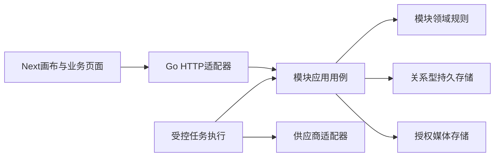
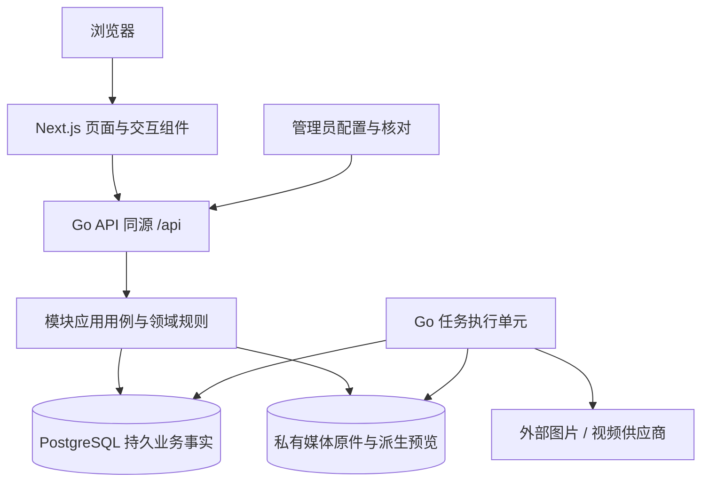
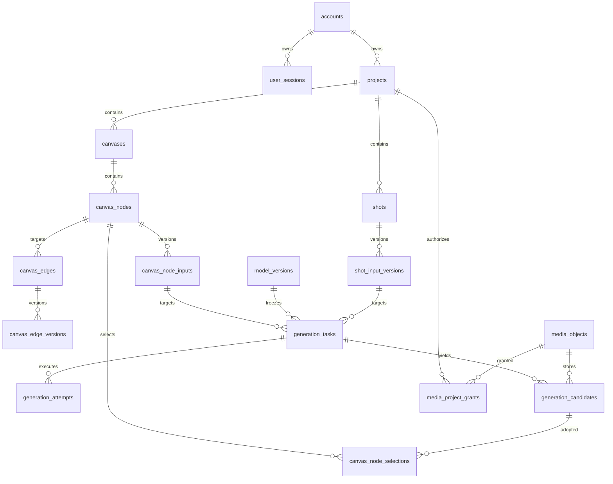

# Design 00：项目需求设计

## M0执行基线：本地优先与接入准备

2026-10-09，用户明确“本地优先，使用我们的codex的能力，不需要真实生成，但是需要先实现能力，方便及时介入”。本轮接受的是执行策略：先实现、验证本地工程与生成接入合同，不执行真实生图/视频，不要求当前提供供应商、密钥或预算。真实媒体产出目标与D-AC保留，外部能力/费用/外发实证在启用真实接入前落实，不作为本轮M0的退出前置。

Codex承担开发及已有生图适配器的合同核验。已存在的适配器仅支持受限单张文生图，且当前测试使用可控协议响应；安装了Codex CLI不等于本机推理、离线处理或视频生成能力已经核验。视频尚无对应Codex执行路径，必须保持未接入，不以图片适配器或通用任务DTO推定可用。后续接入沿共享生成合同，通过明确注入的执行/回执边界实现；不为本轮新增无人使用的供应商框架。

本地fixture只用于测试执行协议、幂等、未知状态和回执恢复，不作为候选媒体发布。页面开发中无适配器时应显示未接入并拒绝生成；有草稿/边不等于执行任务，未知响应不得重发，不填造费用、模型能力或媒体成功。接入真实服务时另记录能力证据、参数限制、数据流与费用授权。本轮实施与验证证据见[Demo Plan M0记录](../plan/06-画布生图生视频Demo.md#8-m0本地执行记录)，实际状态见[BACKLOG](../../BACKLOG.md#里程碑执行台账)。

## 从原始需要到项目设计

本轮补齐原始需求→PRD→Design→Plan的追踪链。用户已经明确首轮优先画布生图生视频；需求及技术方案的接受仍须分别记录。这里形成可审阅设计，不继续编写业务代码、DDL或迁移，也不以旧实现决定新需求。

原始[需求总览](../requirement/01-需求总览.md)保留06～19及73条FR；[产品PRD](../prd/00-浮光.md)描述意图，各模块PRD细化用户结果。Design解决职责、数据、接口、状态、失败与取舍；[执行顺序](../plan/00-执行顺序.md)管理工作依赖，[BACKLOG](../../BACKLOG.md)管理当前事项。根[DESIGN](../../DESIGN.md)仍负责视觉与交互，不改作技术设计。

| 执行号 | 原始需要                              | 项目设计                             | 对应交付                                                                          |
| ------ | ------------------------------------- | ------------------------------------ | --------------------------------------------------------------------------------- |
| 01     | 用户身份、账号、会话（REQ06）         | [用户](01-用户.md)                   | [PRD](../prd/01-用户.md) / [Plan](../plan/01-用户.md)                             |
| 02     | 项目身份、归属、复制（REQ07）         | [项目](02-项目.md)                   | [PRD](../prd/02-项目.md) / [Plan](../plan/02-项目.md)                             |
| 03     | 媒体真实字节、授权与素材条目（REQ08） | [素材](03-素材.md)                   | [PRD](../prd/03-素材.md) / [Plan](../plan/03-素材.md)                             |
| 04     | 安全凭据与真实测试（REQ09）           | [供应商](04-供应商.md)               | [PRD](../prd/04-供应商.md) / [Plan](../plan/04-供应商.md)                         |
| 05     | 发布模型与能力校验（REQ10）           | [模型](05-模型.md)                   | [PRD](../prd/05-模型.md) / [Plan](../plan/05-模型.md)                             |
| 06     | 原始生成/画布的优先闭环（REQ14＋16）  | [画布Demo](06-画布生图生视频Demo.md) | [PRD](../prd/06-画布生图生视频Demo.md) / [Plan](../plan/06-画布生图生视频Demo.md) |
| 07     | 原件、解析、分集和抽取（REQ11）       | [剧本](07-剧本.md)                   | [PRD](../prd/07-剧本.md) / [Plan](../plan/07-剧本.md)                             |
| 08     | 设定版本、参考锁定、声音声明（REQ12） | [设定](08-设定.md)                   | [PRD](../prd/08-设定.md) / [Plan](../plan/08-设定.md)                             |
| 09     | 镜头输入、采用、历史（REQ13）         | [镜头](09-镜头.md)                   | [PRD](../prd/09-镜头.md) / [Plan](../plan/09-镜头.md)                             |
| 10     | 冻结任务、费用和安全恢复（REQ14）     | [生成](10-生成.md)                   | [PRD](../prd/10-生成.md) / [Plan](../plan/10-生成.md)                             |
| 11     | 多镜头查询、参数、批量任务（REQ15）   | [故事板](11-故事板.md)               | [PRD](../prd/11-故事板.md) / [Plan](../plan/11-故事板.md)                         |
| 12     | 画布结构、业务引用、编辑（REQ16）     | [画布](12-画布.md)                   | [PRD](../prd/12-画布.md) / [Plan](../plan/12-画布.md)                             |
| 13     | 有口径的统计与待处理事实（REQ17）     | [分析](13-分析.md)                   | [PRD](../prd/13-分析.md) / [Plan](../plan/13-分析.md)                             |
| 14     | 安全事件、查询、导出（REQ18）         | [审计](14-审计.md)                   | [PRD](../prd/14-审计.md) / [Plan](../plan/14-审计.md)                             |
| 15     | 实际运行健康与处理入口（REQ19）       | [健康](15-健康.md)                   | [PRD](../prd/15-健康.md) / [Plan](../plan/15-健康.md)                             |

00是总体方案；01～15与PRD/Plan同主题同号。06优先组合01～05、10、12的最小能力，文件顺序不要求10/12等到全部前序模块实现。

## 现状事实与新方案边界

当前工具和组织规则来自[PROJECT](../../PROJECT.md)及[AGENTS](../../AGENTS.md)。[前端清单](../../frontend/package.json)、[后端清单](../../backend/go.mod)说明已安装依赖，不能证明新业务接通。当前[画布页面](../../frontend/src/app/canvas/_components/canvas-page.tsx)仍有fixture及本地演示生成状态；旧[画布领域文件](../../backend/internal/canvas/domain/document.go)只作为实现对照，不继承其全部节点、表与操作。

建议保留Next.js App Router前端和按职责组织的Go模块。首轮一个模块化业务应用、关系型持久存储、媒体存储、可恢复任务执行即可；以现有PostgreSQL驱动和对象存储适配能力作为候选，实际部署及权限需D0确认。任务执行可由受控运行单元承载，不为本轮新增微服务、通用DAG、Redis/Kafka/Temporal依赖。现有依赖是否复用，要以持久恢复、故障测试及运维条件评审，不能因go.mod存在而强制加入。

图中的运行调用经注入端口完成；domain不引用HTTP、ORM或供应商SDK。模块间由消费方声明小接口和边界数据，组合根注入，不绕过所属模块写表。图表示职责，不表示多个独立部署或新源码目录。

## 共享数据和接口约束

- 建议使用不透明唯一ID、UTC时间、单调revision。用户、项目、媒体、输入版本、任务、候选分别有身份；显示名/URL不是身份。外部供应商ID只保存在服务端执行事实中。
- 登录上下文来自服务端会话，项目授权来自持久归属；客户端传来的user_id、role、project_id都不能自行授权。列表先授权/筛选再分页，详情、写入、预览和导出再次校验；管理员跨项目范围应显式限定。
- 可编辑对象带expected_revision，服务端条件更新。冲突返回安全的当前版本/差异定位，本地保留未保存内容，不自动以最新值覆盖。列表只给摘要，正文、历史、重媒体按需读。
- 业务写入、关联版本和关键审计事件尽量在同一数据库事务提交。外部I/O不放进长事务，采用先记录意图→外部执行→记录真实结果；跨存储失败按所属状态恢复。
- 异步创建采用request_key和输入指纹；精确范围、保留及费用绑定以[生成设计](10-生成.md)为准。非生成操作采用本模块明确的范围，不能用通用重试中间件盲目重复外部收费。
- 错误语义包括未认证、未授权/不存在、字段无效、版本冲突、幂等冲突、依赖不可用、结果未知。HTTP状态及业务码在实施时进入Handler/DTO注解；安全request_id可追踪，不返回原始堆栈、供应商密钥或会话标记。

下文HTTP路径均为拟议资源结构，**不是当前路由事实**。Design接受后在Handler/DTO与swag注解实现，生成OpenAPI和前端client，不手工维护第二套规范。表名、字段、约束和索引方案以各模块工程合同明确；接受后生成DDL并确定精确源码改动，最终态Schema单一来源，已有数据迁移另行评审。

## 前端状态与数据边界

页面入口保持现有App Router结构；交互画布及媒体播放使用必要的Client Component，跨页面组件仍在components/业务范围，不新建src/features。身份与私有数据沿用PROJECT已接受工具链；缓存按用户/项目划分，注销、失权和切换项目清除旧请求结果及选择状态。独立读取并行，重媒体按可见节点加载，未接入/空/失败/未知各自展示。

布局和草稿是可保存数据；视口、hover、选择框及播放是临时状态。只在服务端回执覆盖当前本地编辑版本时显示“已保存”。新增任务先显示排队，再查询实际状态；图形动画与通知不制造保存或生成成功。错误关联输入，键盘等价操作、对话框焦点及响应式布局在真实浏览器验证。

## 原始质量需要如何进入设计

各模块MNFR不是从PRD故事简表推断；第4节和第6节仍是原质量条件/缺口来源。下面明确跨模块设计落点，实施切片需继续记录具体MNFR与证据，不把本轮FR覆盖数称为全部质量达标。

| 原始质量类别                     | 项目方案落点                                                       | 实施后可验证边界                                                     |
| -------------------------------- | ------------------------------------------------------------------ | -------------------------------------------------------------------- |
| 权限隔离、秘密保护               | 01会话/角色、02归属、03原件授权、04服务端秘密、14允许字段审计      | 两制作者及管理员交叉读/写/预览/导出；合成秘密不进响应/包/日志        |
| 并发、幂等、完整性               | 各可编辑对象revision、10冻结任务/键唯一、11原子参数批改、12保存CAS | 并发/重复/丢响应核实际行数、版本、调用数及本地草稿                   |
| 性能、容量与加载                 | 列表摘要、可见媒体、历史按需；03容量计量、12交互规模               | 在确认设备/网络/数据规模测字节/请求/耗时及前端指标；阈值未定不报达标 |
| 可访问、响应式、视觉             | 沿用根DESIGN及原交互需求；画布键盘等价移动、错误关联和焦点         | 1440/1280/390布局、键盘和读屏实际检查；视觉/工具支持范围另接受       |
| 异步可靠、费用与外部格式         | 07导入阶段/原件、10调用意图/核对/媒体恢复、04测试、05发布能力      | 外部超时/受理丢响应/重启/损坏原件/能力边界；真实费用与输出另留证     |
| 可观测、统计真实性               | 安全request_id/Task来源、13口径/as_of、14事件、15运行事实          | 固定事实复算、局部故障/未接入/无样本可辨，无固定成功提示             |
| 备份恢复、隐私治理（原补充提案） | 持久关系与媒体一致恢复；模块明确原件/外发/导出/保留                | 隔离恢复演练、权限与版本引用不变；RPO/RTO/地域/保留/责任人待接受     |
| 可维护、部署连续性（原补充提案） | 显式模块边界/生成合同、单一Schema、受控执行生命周期                | 适用质量门禁、运行/升级/回退证据；不在本轮自动迁移或清旧数据         |

既有明确数值（如会话期限、素材分页、健康刷新窗口）按原始规格保留；性能/规模、审核、运行/恢复等未定参数保持待确认。Design接受后，测试计划把本表与当次模块AC/MNFR逐条对应。

## 本轮设计决定与评审入口

| 设计问题     | 本轮建议                               | 接受前条件或阻塞边界                                      |
| ------------ | -------------------------------------- | --------------------------------------------------------- |
| 首轮视频输入 | 单图作为首帧；明确选图和版本边         | 实际模型支持首帧并有能力/参数证据，否则改方案后评审       |
| 画布与任务   | 可变草稿＋不可变任务输入，手动分别提交 | 接受选图/更新输入/晚到结果规则                            |
| 调用与恢复   | 持久任务＋执行意图＋租约；不确定先核对 | 核供应商查询/幂等/对账能力，不能承诺全局exactly-once      |
| 费用         | 指纹绑定确认；首轮未知价格禁止提交     | 确认金额/上限来源、有效期及外发范围；未知费用政策可另评审 |
| 删除/撤销    | 首轮不提供节点删除及撤销重做           | 接受范围取舍；完整模块另明确历史引用/撤销边界             |
| 视口         | 首轮会话内临时保存，不写业务revision   | 接受刷新适应节点的体验，后续用户偏好可扩展                |
| 架构         | 模块化应用＋持久任务，不强制旧中间件   | 核环境、并发规模、任务执行所有权与恢复办法                |
| 后续模块     | 提供职责与候选方案，不先预建实现       | 每个切片接受对应业务政策及Design再排技术任务              |

各模块末节记录受影响的原始缺口与设计选择，不在这里用统一默认值消除差异。接受时记录范围、接受者、日期和Git基线；当前所有文件status为unreviewed，不能用文档存在或提交替代接受。

## 验证、运行与交付边界

当前只验证设计追踪、链接、编号和逻辑一致性。实施后按原模块AC/质量要求与Demo D-AC验收：单元/并发测试→真实数据库和媒体→故障恢复→真实供应商→浏览器→产品接受，各层分别留证。

备份设计至少覆盖身份/项目/画布/版本/任务/审计关系与媒体原件，恢复后核ID、权限、引用及未知执行；备份周期、RPO/RTO、保留与责任人待确定。发布/迁移/回退与现有运行代码对照后形成精确方案，不在本轮执行。质量容量、设备、性能阈值未明确时，只报告已测结构和行为，不能宣称SLA达标。

## 工程合同：架构与运行边界

以下工程合同补全前文概念设计，作为本轮待评审技术基线。各模块的“工程合同”节定义实际候选表名、类型、约束、API/DTO和事务；概念对象映射到这些表，不再将必要表字段和接口合同整体后置。真实供应商协议、容量/费用/保留参数仍由对应D0条件接受。精确实施差异和已有库增量SQL在接受后准备，本轮不操作数据库。

### 系统上下文与部署方案

建议采用Next.js前端＋模块化Go后端＋PostgreSQL 18＋私有S3兼容媒体存储。数据库版本依据当前[环境Compose](../../docker-compose-env.yml)的18系列声明，存储复用现有MinIO适配能力；这是目标方案，不证明本机或生产已运行这些版本。浏览器经同源/api访问Go，媒体预览经授权代理或短期受控地址，供应商只由服务端访问。

首轮本地可将API与受控执行单元放同一后端进程；生产建议同一构建产物分API/Worker角色，便于独立停止领取及重启。现有[入口路由](../../backend/internal/app/router.go)、[服务生命周期](../../backend/internal/app/server.go)及Compose角色只作为接入位置观察；数据库领取型Worker尚未实现，不把旧Temporal/relay角色直接当成本方案。Redis/Kafka/Temporal不在首轮必选依赖中；是否复用后续由实际恢复/运维验证决定。本轮不改Compose/启动服务。

### 模块、端口与源码接入位置

| 模块           | 拥有的写入                                | 消费的最小端口                                                                                               | 首轮接入与依赖方向                                                    |
| -------------- | ----------------------------------------- | ------------------------------------------------------------------------------------------------------------ | --------------------------------------------------------------------- |
| 用户           | 账号/凭据摘要/会话/偏好                   | 头像媒体可用校验                                                                                             | HTTP鉴权→用户用例；其他模块只取Actor                                  |
| 项目           | 项目/复制操作                             | 空画布初始化、原件导入/授权引用                                                                              | 创建用例组织所属模块事务，不写其私有表                                |
| 素材媒体       | 原件元数据/项目授权/素材条目/转存状态     | 对象存储、内容探测、任务输出读                                                                               | 生成只调用IngestOutput/VerifyReference/Preview                        |
| 供应商/模型    | 凭据版本/测试、模型草稿/发布/启停         | SecretStore、VendorTest、CapabilityEvidence                                                                  | 普通创作者只读发布能力，不读秘密                                      |
| 画布           | 布局/输入版本/明确选择/边版本             | CandidateReader、MediaVerifier                                                                               | 生成目标快照通过注入端口解析；画布不执行供应商                        |
| 生成           | 预检/确认/冻结Task/Attempt/候选/核对/费用 | TargetSnapshotReader、PublishedModelReader、ReferenceVerifier、VendorGenerator、MediaIngestor、AuditAppender | application声明消费接口；适配器转换所属模块数据，domain不依赖这些外层 |
| 剧本/设定/镜头 | 各自内容版本/明确采用                     | 原件读、共享生成、参考校验                                                                                   | 后置接入同Task合同，不复制执行框架                                    |
| 故事板         | 显式批次/项关联                           | 镜头输入变更、共享生成准入                                                                                   | 参数批改一次事务；外部生成逐项执行                                    |
| 分析/健康      | 无新增业务写表                            | 授权查询与运行观测                                                                                           | SQL读投影；不以刷新触发测试或生成                                     |
| 审计           | 安全追加事件                              | 事务内Append、管理员查询                                                                                     | 与关键业务事务共提交，无编辑/删除用例                                 |

接口由消费方application声明，跨模块适配器和组合根将数据显式转换；生成不import画布/镜头的HTTP/ORM类型，反向也不调用供应商SDK。多模块事务共享同一UnitOfWork的数据库事务，端口实现参加该事务；不在两个独立提交之间宣称原子冻结。跨模块只调用所属用例/端口，不由生成直接UPDATE画布表。

沿现有`backend/internal/<业务>/{adapter,application,domain}`职责补实现，组合根仍在internal/app；本节只指定职责与接入位置，不创建空目录。前端仍按App Router页面/_components与components/<业务>组织；画布交互最小Client边界，网络/任务状态和高频视口状态分离。现有frontend/src/api目录尚不存在，客户端在实施时由Handler/DTO生成，不能引用不存在的客户端作为已经接通的证据。

### 架构决定与替代方案

- 单一Go业务写入入口保持事务与权限一致；数据库中的任务及调用意图已经满足首轮可靠领取，无证据不引入额外消息系统。若未来规模/隔离需要队列，用相同任务ID/执行账本替换调度适配器，不改变收费幂等合同。
- 媒体字节放私有对象存储，SQL保存身份、权限、元数据与来源，不把视频bytea或供应商URL当画布内容。对象写入与SQL提交采用就绪状态机恢复，不能伪造跨存储事务。
- 结构与输入分版本，当前指针可变、历史输入不可变；迟到结果写候选而非改当前指针。首轮CAS优先正确性，多人实时协同/CRDT没有本轮需要。
- 接受后补依赖注入、Handler与DTO，按PROJECT生成OpenAPI/client；当前不新建独立手写OpenAPI作为第二个运行事实源。

## 工程合同：数据库全局约定

### 业务库、Schema与数据库权限

建议一个业务数据库（部署目标名lanverse），首轮所有模块表在同一业务Schema/public命名空间按业务前缀归属，不为每个模块建独立数据库或跨库事务。当前仓库Schema含identity/media/canvas等多个旧业务Schema；本轮单命名空间是新方案取舍，不能视为已有兼容映射。部署库名/现有Schema需迁移前清点；名称是候选方案，不新建或改现有库。私有媒体字节仍放对象存储，SQL库只保存业务关系/元数据/执行账本。

当前仓库运行Schema已引用lanverse_app作为业务授权角色。本轮建议继续运行角色与DDL所有者分离：部署登录角色获得lanverse_app必要权限，库/Schema所有者或迁移身份只用于获授权初始化/增量结构变更，应用不得以超级用户运行或AutoMigrate。登录角色与秘密由环境配置，不在文档存连接凭据。

业务角色按表/列授权：版本/发布/确认/审计/输出事实表只INSERT/SELECT；可变状态、当前指针和用户资料表仅获所属用例需要的UPDATE列；没有本轮永久删除业务时不给通用DELETE。身份凭据摘要、provider秘密引用只由后台读取，公开DTO不直接映射表。数据库最小权限是纵深保护，应用层仍逐请求校验user/project，未部署/验证的RLS策略不能被写成已生效。

数据库不放浏览器Cookie/token明文，不把创作者角色等同数据库登录账号。连接池、事务/语句超时、存储配额、备份/WAL及恢复参数随实际环境测量后接受；本轮不填无依据配置值，也不创建缓存/分片/分区架构。

### 类型、默认值与边界

| 记号      | 每张表实际展开的字段/约束                                                                                                                             |
| --------- | ----------------------------------------------------------------------------------------------------------------------------------------------------- |
| B         | `id uuid PRIMARY KEY`（应用生成），`created_at timestamptz NOT NULL DEFAULT now()`；均为非空                                                          |
| C         | B＋`revision bigint NOT NULL DEFAULT 1 CHECK(revision>0)`、`updated_at timestamptz NOT NULL DEFAULT now()`；更新显式推进revision/time，不靠读操作改变 |
| P         | `project_id uuid NOT NULL REFERENCES projects(id) ON DELETE RESTRICT`；有id的项目表加`UNIQUE(project_id,id)`供跨项目复合FK使用                        |
| Rev/版本  | SQL bigint；API十进制字符串，避免JS整数精度损失；0仅用于HTTP“尚无版本”的条件输入，已保存版本>0                                                        |
| 金额      | `numeric(20,6)`＋`currency char(3)`；未知金额NULL并带cost_state，不能用默认0。API十进制字符串                                                         |
| 时间/时长 | 时间timestamptz，API RFC3339 UTC；媒体时长/镜头时长用`duration_ms bigint`，已知时>0，未知NULL                                                         |
| 文本/JSON | text；已知业务长度用CHECK。jsonb只承载版本化参数/快照/安全详情，不替代关系ID、权限、状态或唯一约束                                                    |
| 空值/默认 | 下文显式NULL者可空；其余NOT NULL。只有标DEFAULT者有默认，不能靠ORM零值悄悄补字段                                                                      |

状态使用text＋CHECK允许集合；新增状态作为合同变更，不直接让前端随意传state。版本/发布/确认/事件表原则上只INSERT/SELECT，业务运行角色不获任意UPDATE/DELETE；当前指针和可变状态表按所属用例更新。所有引用默认ON DELETE RESTRICT，本轮没有级联清历史或永久删除。

同项目引用使用`(project_id, object_id[,version])`复合FK；指向媒体还须有media_project_grants及当前准入校验。FK保证身份/归属，账号enabled、模型启停、媒体ready/审核、字段schema等动态业务规则由加锁应用用例检查，**不能把跨表状态比较写成普通CHECK**。[PostgreSQL约束文档](https://www.postgresql.org/docs/18/ddl-constraints.html)说明了该边界。

### 基础操作回执表

非生成的需幂等写入使用`command_receipts`，由执行该命令的模块负责事务内登记，不建全局业务Service。生成提交直接用generation_tasks唯一键，不再重复保存Task快照。

| 表               | 字段/类型与空值                                                                                                                                                                     | 约束与索引                                                                                                  | 保留                                           |
| ---------------- | ----------------------------------------------------------------------------------------------------------------------------------------------------------------------------------- | ----------------------------------------------------------------------------------------------------------- | ---------------------------------------------- |
| command_receipts | B；actor_id uuid FK accounts；scope_key text、operation text、request_key uuid、fingerprint bytea、result_type text、result_id uuid NULL、response_safe jsonb、http_status smallint | UNIQUE(actor_id,scope_key,operation,request_key)；CHECK(octet_length(fingerprint)=32)；INDEX(created_at,id) | 与所属对象/操作历史同寿命；不短TTL回收后再执行 |

scope_key由服务端构造（如user:ID/project:ID/canvas:ID），不接受客户端替换；body仅提供request_key。回执仅存允许字段，密码/API Key/会话token及签名URL不存response_safe；登录/秘密交付不复用这个返回体缓存。先鉴权，再查回执/校验指纹，已完成同键返回原对象，异输入409；新回执与业务写入同事务，事务失败不留“成功回执”。

### 关系总图与建表依赖

图显示主关系，不替代各模块复合键设计。建议建表顺序：accounts→projects/媒体/供应商→模型发布→画布与内容身份→各输入版本→preflight/consent/tasks→attempt/events/candidates→采用/边版本/批次/audit及回执。循环指针（节点current_input_revision、当前selection、edge head、模型发布/锁定版本）先建表再ALTER添加FK；需在一次事务插入身份和首版本的指针FK用DEFERRABLE INITIALLY DEFERRED。非空head从1起，不能以可空永久绕过有效版本。

### 查询、锁与不可变性

普通读用Read Committed；一请求的列表/数量或指标组合用同一只读Repeatable Read快照。as_of表示本次采样时间，不自动承诺跨请求MVCC快照；跨页cursor减少排序漂移，统计/导出一致要求以同窗口/明确水位解释。所有授权范围先过滤，不能读全表后在内存隐去。

需要同事务冻结时按账号→项目→供应商/模型→目标父对象/目标版本→媒体/授权（稳定ID顺序）→任务/操作的顺序加锁，写入用FOR UPDATE，必须阻止动态准入变更的读用FOR SHARE。仅存在性FK锁不能替代enabled/ready检查。[PostgreSQL锁文档](https://www.postgresql.org/docs/18/explicit-locking.html)是实现核验依据。涉及同类多个对象时先按稳定ID加锁；最后管理员状态命令按账号集合先加锁，不先以操作者锁制造相反顺序。Worker状态推进依次锁Attempt→Task（所有回执/核对相同顺序）；媒体完成单独提交，候选发布按媒体→任务顺序，避免反向锁。

Task领取的SKIP LOCKED仅用于工作竞争，不用于业务查询；状态推进比较state_revision/lease_token，外部I/O在事务外。不确定调用保留dispatch账本，接管者不再POST。事务死锁/序列化失败只能有界重试数据库事务，不能自动重试其中外部收费I/O。

## 工程合同：HTTP全局约定

### 路径、鉴权和基础类型

本轮统一候选合同为`/api`，具体资源路径由模块工程节唯一给出，替代前文无前缀路径草案。既有/healthz、/readyz维持现状观察，不替代管理员健康接口。HTTPS及同源Cookie鉴权；服务端从Session确定actor，项目读写为项目所有者，管理员不能因此自动读全部创作内容，管理员接口单独限定。

`Id=UUID string`，`Rev=正十进制string`，`Time=RFC3339 UTC string`，`Money=十进制string`，`Json=经过指定schema校验的object`。JSON字段snake_case，数组为[]不为null；未知单值用null及availability/reason。客户端不能传role/owner/state替代服务端事实。

| 共享DTO       | 字段与语义                                                                                                                                                                              |
| ------------- | --------------------------------------------------------------------------------------------------------------------------------------------------------------------------------------- |
| Actor         | id:Id、display_name:string、role:creator/admin、must_change_password:boolean                                                                                                            |
| Operation     | id:Id、state:queued/running/success/failed/unknown/manual、result_type:string、result_id:Id?、reason_code:string?、updated_at:Time                                                      |
| Page<T>       | items:T[]、total:integer、page:integer、page_size:integer、as_of:Time；默认页长作为配置，素材固定40，其他按评审参数                                                                     |
| CursorPage<T> | items:T[]、next_cursor:string?、as_of:Time；cursor为服务端签名/校验的排序边界，不可替代权限                                                                                             |
| MediaRef      | media_id:Id、media_version:Rev、kind:image/video/audio/text?（未探测为null）、availability:receiving/validating/ready/failed、moderation:unknown/approved/rejected、reason_code:string? |
| CostView      | cost_state:known/unknown/not_executed、amount:Money?、max_amount:Money?、currency:string?、source:string?；金额未知不返回0                                                              |
| ApiError      | error:{code:string,message:string,request_id:string,fields?:[{path:string,code:string}],current_revision?:Rev,conflicting_ids?:Id[]}                                                    |

路径ID和body关系需一致，否则422；无权详情与不存在统一404，无认证401、管理员资格不足403；不能在冲突IDs中泄露无权对象。内容类型application/json，文件上传例外；拒绝未知可写字段、防止客户端注入秘密/状态字段。分页page≥1、页长/筛选限额由接受的配置控制，超过不截断成伪成功。

### 状态码和重试

| HTTP/业务code                                                             | 条件与前端行为                                                     |
| ------------------------------------------------------------------------- | ------------------------------------------------------------------ |
| 200/201/202/204                                                           | 读/更新、同步创建、异步意图已持久受理、无内容撤销；202不是生成完成 |
| 400 malformed_request                                                     | 不能解析/错误类型；关联字段，不重发原错误输入                      |
| 401 unauthenticated                                                       | 会话无效；重新登录，保留安全草稿，不自动提交收费                   |
| 403 forbidden                                                             | 已认证但不是该管理操作角色；不泄露管理详情                         |
| 404 not_found                                                             | 对象不存在或不在授权范围；清旧上下文，不能回落样例                 |
| 409 revision_conflict / request_key_conflict / source_changed             | CAS、同键异输入、源版本变化；保留输入，明确重新读取/更新/预检      |
| 422 invalid_input / model_unavailable / media_not_ready / consent_invalid | 结构可解析但业务准入不成立；调用供应商前拒绝                       |
| 429 rate_limited                                                          | 本地准入限制，Retry-After如可确定；不自动换键重提                  |
| 503 dependency_unavailable                                                | 尚未完成本地准入，DB/存储不可用；先查原键判断是否已受理            |

任务已有不确定外部执行时GET返回200 Task.state=unknown/manual，不以HTTP 500暗示“安全重新生成”。请求连接断开不能证明未提交；重发POST只在持有原键/同输入时进行。HTTP幂等方法语义与应用request_key机制分别处理，POST不因为前端重试就自动安全；依据[RFC 9110](https://www.rfc-editor.org/rfc/rfc9110.html#section-9.2.2)。

写入命令带request_key、可编辑状态带expected_revision；首次同步创建201/异步202，同键回查200并给同对象，Location指资源查询地址。登录/读接口无request_key。精确例外见各模块表，不新增全局“失败即重试”拦截器。

## 工程合同：生命周期、迁移与运行

| 阶段           | 本项目必要产物与本轮位置                                   | 进入下一阶段的证据                                         |
| -------------- | ---------------------------------------------------------- | ---------------------------------------------------------- |
| 需求分析/接受  | 原始FR/MNFR/AC＋PRD、政策缺口                              | 实际接受范围/人/日期/基线，未定只阻塞受影响切片            |
| 架构与详细设计 | 本文部署/端口、模块库表/API/状态、Demo时序/事务            | 架构与字段/约束/DTO评审；真实供应商能力/费用边界明确       |
| 实施准备       | Plan技术工作包、表/API/测试追踪                            | 当次精确变更/估算/责任、可执行失败测试；不先建全产品空模块 |
| 编码/集成      | 所属模块实现＋Handler注解→OpenAPI→client、唯一最终态Schema | Go/前端适用门禁；版本/生成漂移检查；不手改产物             |
| 系统验证/验收  | 原AC/MNFR＋D-AC数据库/媒体/外部/浏览器证据                 | 真持久、并发/未知/重启、播放及用户接受分别成立             |
| 迁移/发布      | 环境差异、精确增量SQL/前后核对、部署/回退手册              | 授权/备份恢复可行，停止新准入、在途保护，发布后真实烟测    |
| 运行维护       | 指标口径、诊断/核对、备份、秘密轮换                        | 审计与任务可追踪；实际监控、故障处理和恢复演练             |
| 退役/清理      | 对象引用/历史/保留与外发处理决策                           | 精确范围和授权，不能删除仍被引用原件/费用/幂等记录         |

新空库接受后由`backend/db/schema.sql`维护最终态并一次初始化；已有库不得直接执行这个最终态当迁移。先只读核实际Schema/版本与目标差异，形成评审的增量SQL和数据映射，逐表验证归属/重复键/孤立引用；不新增自动AutoMigrate，也不新建第二套正式迁移目录。循环FK/不变量在提交前验证，必要的临时NULL回填必须有收敛检查。

发布前停止新的生成准入及Worker领取，记录已有dispatching/accepted；核对和媒体恢复不靠“重置全部queued”。备份覆盖关系数据、秘密引用恢复条件和对象存储字节清单，不把明文秘密导出进普通备份/文档。演练在隔离环境核恢复后ID、原件、权限、版本、键/执行意图，不只测SQL能恢复。

回退先判断结构变更是否兼容旧二进制；不可兼容数据不自动降级运行。保留任务受理/费用账本，绝不通过数据库回滚使已经外部受理的任务“从未发生”；必要时暂停执行、前向修复、人工核对。RPO/RTO、保留、运行并发/超时/告警、备份/值班责任仍须环境确定后接受，设计不编造SLA。
