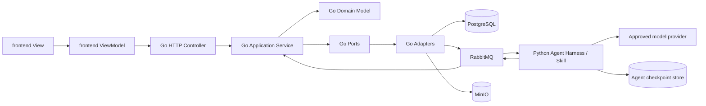
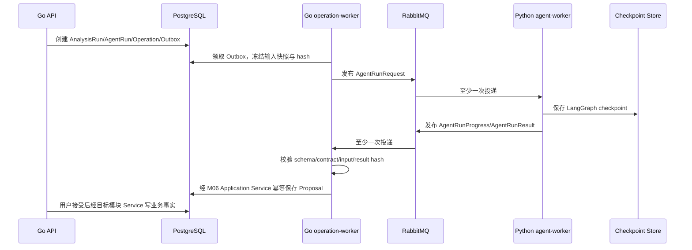

# AI 视频生产平台目标系统架构设计

> 状态：accepted，目标架构冻结 v10；实现必须遵循，变更须先更新 Design 并重新评审
> 日期：2026-08-22
> 需求基线：[000-AI 视频生产平台目标需求总览](../requirement/000-AI视频生产平台目标需求总览.md)
> 产品设计：[002-AI视频生产平台目标产品与功能模块设计](002-AI视频生产平台目标产品与功能模块设计.md)
> 数据与接口：[001-AI视频生产平台核心领域与数据模型设计](001-AI视频生产平台核心领域与数据模型设计.md)、[003-AI视频生产平台接口工作流与功能实现设计](003-AI视频生产平台接口工作流与功能实现设计.md)
> 实施基线：[005-AI视频生产平台服务与模块实施基线](005-AI视频生产平台服务与模块实施基线.md)
> 设计方式：从目标业务重新设计，不继承旧实现、旧目录、旧 Schema 或兼容性要求；技术决策以官方资料和活跃开源实现为证据

## 1. 冻结结论

Lanverse 固定采用三工程、双运行时、单业务事实源架构：

1. `frontend/`：TypeScript、React、Next.js 浏览器应用，负责 MVVC 的 View 与 ViewModel。
2. `backend/`：Go 模块化单体，是唯一业务后端，负责 MVVC 的 Controller、Application Service、POJO 等价领域 Model、PostgreSQL 事务、公共 API 和全部非 Agent Worker。
3. `agent/`：Python Agent Runtime，使用 LangGraph 实现 Harness、Skill、模型与只读 Tool 编排；只产生结构化结果和业务命令提案，不拥有业务表、业务事务、审批或 current 状态。

以下不再作为候选：Python 业务后端、Go/Python 双写业务事实、按 M01—M15 拆微服务、Agent 直接写 PostgreSQL、Agent 持有通用 MinIO 凭据、URL `v1`/`v2`、数据库 migration 历史链、旧 Schema 兼容层和旧接口转换层。

目标系统是“一套 Go 业务模型、五个 Go 进程角色、一个 Python Agent 进程角色”。六个角色共享当前发布单元的契约，但具有独立生命周期、队列、身份、网络策略与资源限制。模块边界用于事实所有权和依赖约束，不等于部署边界。

## 2. 架构目标与非目标

### 2.1 目标

1. 每个业务事实只有一个 Go 模块写入所有者。
2. 前端、手工操作、画布和 Agent 提案最终调用同一个 Go Application Service。
3. 长任务在重启、消息重复、网络超时、回调丢失和人工等待后可恢复。
4. 数据库、消息、HTTP、Agent 和对象存储各只有一套当前契约。
5. 大媒体与业务元数据分离，所有 MinIO 对象可按精确版本与哈希追踪。
6. API、导入、Provider、媒体和 Agent 计算可以独立扩缩并隔离失败。
7. 领域规则不依赖 HTTP、数据库、消息、MinIO、LangGraph 或 Provider SDK 才可测试。
8. 用户命令可追踪到 Operation、Job、Attempt、AgentRun、Artifact 和审计事实。

### 2.2 非目标

- 首期按领域拆微服务、服务网格或多仓库。
- 在 Python 中复制 Go 领域对象、状态机或权限规则。
- 让 LangGraph checkpoint 取代 Operation、审批或业务 current。
- 用消息队列表示业务完成。
- 在 PostgreSQL、消息或 checkpoint 保存视频、图像和大型来源正文。
- 建立 AWS S3 adapter、多对象存储工厂或运行时存储切换。
- 旧数据库升级、旧消息消费、旧 API 兼容、alias、双读或双写。
- 商业计费、套餐、支付、公共市场或自动发布。

## 3. 顶层职责与依赖方向



依赖方向固定为：

- 前端 View 只能消费 ViewModel；ViewModel 只能通过生成客户端访问 Go Controller。
- Go Controller 只做协议、身份与 Command/Query 映射；每个写入口调用一个明确的 Application Service。
- Go Application Service 负责鉴权、幂等、乐观并发、短事务、领域调用与 Outbox。
- Go Domain 只使用标准库和本模块类型，不依赖 transport、database、RabbitMQ、MinIO 或 Agent。
- Adapter 实现 Port；sqlc、pgx、MinIO 和 Provider SDK 类型不得泄漏到 Domain/Application。
- Python Agent 只能消费 Go 发布的冻结快照，输出当前 Agent Contract；不得导入 Go 内部概念的另一套实现。
- 跨模块只能调用公开 Application Port、Query Port 或当前事件；禁止跨模块写表和引用其他模块 adapter。

## 4. 固定技术栈

| 层 | 固定选择 | 责任边界 |
| --- | --- | --- |
| Web 前端 | TypeScript strict、React、Next.js App Router、Tailwind、Radix/shadcn | View、ViewModel、交互和页面状态 |
| 前端数据 | OpenAPI 生成客户端、RTK Query | 服务端状态缓存；不手写重复 DTO |
| 公共 API | Go、`net/http`、oapi-codegen strict server | `/api` Controller、Webhook、SSE、鉴权中间件 |
| 业务应用 | Go Application Service + 显式 Port | 用例、权限、事务、幂等、Outbox |
| 领域模型 | Go plain struct/value object | POJO 等价的无框架实体、值、命令和结果 |
| 数据访问 | pgx/v5 + sqlc + 显式 SQL | PostgreSQL 事务和类型安全查询；不采用 ORM |
| Agent Runtime | Python + LangGraph | AgentRun 内推理、只读 Tool、结构化提案、checkpoint |
| 跨语言契约 | 当前 JSON Schema + canonical JSON + contract hash | Go 生成/校验请求，Python 生成/校验结果 |
| 异步投递 | PostgreSQL Outbox/Inbox + RabbitMQ | 至少一次投递、背压、死信和消费者隔离 |
| 对象存储 | 私有 MinIO；Go 使用 MinIO Go SDK | 原件、媒体、Agent 大载荷和交付对象 |
| 媒体处理 | Go 进程监督 FFmpeg/ffprobe | 探测、代理、抽帧、转码、装配和校验 |
| 运行态 | Redis | 会话、一次性验证、限流、短缓存、SSE fan-out |
| 可观测 | OpenTelemetry | API、任务、Agent、Provider 和媒体 Trace |
| 密钥 | Secret/KMS | Provider、Webhook 和服务身份的可轮换引用 |

版本由 `backend/go.mod`/`go.sum`、`agent/pyproject.toml`/锁文件、`frontend/package.json`/锁文件和容器 digest 固定。Design 固定技术边界；补丁版本升级不得改变模块职责或契约。

## 5. 六类生产运行角色

| ID | 入口 | 语言 | 必须承担 | 明确禁止 | 首次切片 |
| --- | --- | --- | --- | --- | --- |
| SVC-01 | `backend/cmd/api` | Go | 公共 `/api`、Webhook、SSE、鉴权、Query、短事务、Operation/Outbox 创建 | 模型调用、文档解析、Provider 长轮询、FFmpeg | A |
| SVC-02 | `backend/cmd/operation-worker` | Go | Outbox Publisher、Scheduler、Reconciler、Inbox、投影、Agent 请求/结果桥接 | 替用户批准、猜测 unknown 成功、跨模块直接写表 | A |
| SVC-03 | `backend/cmd/import-worker` | Go | DOCX/Markdown/TXT 解包、确定性解析、来源证据与 ParseResult | 默认公网外呼、模型/Provider 凭据、写 current | A |
| SVC-04 | `backend/cmd/provider-worker` | Go | Provider 提交/查询/取消/下载、回调后处理、unknown 对账证据 | 不可信文档解析、自动主选、绕过计划和治理 | C |
| SVC-05 | `agent/src/lanverse_agent/entrypoints/worker.py` | Python | LangGraph Harness、Skill、模型、只读 Tool、AgentResult、AI 评估 | 业务数据库、业务 Service、批准、生成执行、通用 MinIO 凭据 | B |
| SVC-06 | `backend/cmd/media-worker` | Go | MinIO 媒体摄取、probe、代理、抽帧、转码、确定性检查、装配与渲染 | 自动选择、关闭问题、批准交付 | A |

`backend/cmd/schema-init` 是空库初始化与 Schema 校验的一次性 Job，不是第七个常驻服务。通知和 Webhook 投递首期作为 SVC-02 的 Outbox consumer，不建设通知微服务。

## 6. 固定仓库与文件结构

以下是目标物理结构。目录仅在对应纵向切片产生首个真实用例时创建，但名称、职责和依赖方向不再变化。

```text
Lanverse/
├── frontend/
│   ├── package.json
│   ├── src/
│   │   ├── app/                         # Next.js route/layout；不含业务规则
│   │   ├── api/                         # OpenAPI 生成代码；禁止手改
│   │   ├── features/
│   │   │   └── <feature>/
│   │   │       ├── views/
│   │   │       ├── view-models/
│   │   │       ├── components/
│   │   │       └── tests/
│   │   └── platform/                    # 前端鉴权、错误、观测等工程能力
│   └── tests/e2e/
├── backend/
│   ├── go.mod
│   ├── go.sum
│   ├── api/
│   │   └── openapi.yaml                 # 唯一公共 HTTP 契约；路径只用 /api
│   ├── contracts/
│   │   └── agent/                       # 唯一 Go↔Python Agent JSON Schema
│   ├── schema/
│   │   └── current.sql                  # 唯一目标数据库结构
│   ├── queries/                         # 按 owner 模块组织的 sqlc SQL
│   ├── cmd/
│   │   ├── api/
│   │   ├── operation-worker/
│   │   ├── import-worker/
│   │   ├── provider-worker/
│   │   ├── media-worker/
│   │   └── schema-init/
│   ├── internal/
│   │   ├── modules/
│   │   │   └── <module>/
│   │   │       ├── domain/
│   │   │       ├── application/
│   │   │       │   ├── commands/
│   │   │       │   ├── queries/
│   │   │       │   ├── services/
│   │   │       │   └── ports/
│   │   │       ├── adapters/
│   │   │       │   ├── postgres/
│   │   │       │   └── <owned-technology>/     # 仅真实用例所需，如 documents/providers
│   │   │       └── transport/
│   │   │           └── http/controllers/
│   │   ├── contracts/                   # OpenAPI/Agent/Task 生成类型
│   │   └── platform/
│   │       ├── database/
│   │       ├── messaging/
│   │       ├── objectstorage/
│   │       ├── cache/
│   │       ├── secrets/
│   │       ├── mediaexec/              # 受限 FFmpeg/ffprobe 进程执行
│   │       └── observability/
│   └── tests/
│       ├── architecture/
│       ├── contract/
│       ├── integration/
│       └── e2e/
├── agent/
│   ├── pyproject.toml
│   ├── src/lanverse_agent/
│   │   ├── entrypoints/
│   │   │   └── worker.py
│   │   ├── runtime/                     # Harness、checkpoint、模型与 Tool 执行
│   │   ├── skills/
│   │   │   └── script_analysis/
│   │   │       ├── graph.py
│   │   │       ├── state.py
│   │   │       ├── nodes/
│   │   │       ├── prompts/
│   │   │       └── tests/
│   │   ├── contracts_generated/         # 从 backend/contracts/agent 生成
│   │   └── adapters/
│   │       ├── models/
│   │       ├── checkpoints/
│   │       └── messaging/
│   └── tests/
│       ├── architecture/
│       ├── contract/
│       └── integration/
├── deploy/                              # 各进程部署与基础设施配置
└── docs/
    ├── prd/
    ├── requirement/
    ├── design/
    ├── plan/
    └── acceptance/
```

禁止创建：`migrations/`、全局 `utils/`、全局 `managers/`、第二套 `shared DTO`、空微服务、`backend/python`、`agent/business`、AWS S3 adapter 和兼容性目录。

### 6.1 Go 模块模板与 POJO/Service 规则

每个 M01—M15 模块按同一职责模板组织，但只创建真实用例需要的文件：

- `domain/`：实体、值对象、不变量、领域行为和领域错误。结构体字段表达业务含义，不带 JSON/SQL/HTTP/SDK 注解。
- `application/commands|queries/`：用例输入输出 plain struct；不接收 `http.Request`、pgx transaction、sqlc row 或任意 `map[string]any`。
- `application/services/<use_case>.go`：一个明确用例，编排鉴权、幂等、版本、Domain、Port、事务和 Outbox。
- `application/ports/`：由调用方定义的最小接口，不按基础设施建立万能 Repository。
- `adapters/postgres/`：pgx/sqlc 映射；生成 row 不得离开 adapter。
- 模块专属外部协议留在 owner 模块 adapter：M03 文档解析为 `narrative/adapters/documents`，M08 Provider 为 `execution/adapters/providers/<provider>`；共享的受限 FFmpeg/ffprobe 执行器位于 `platform/mediaexec`，但媒体/交付业务规则仍归 M09/M13。
- `transport/http/controllers/<use_case>.go`：Header/Schema/Principal 到 Command/Query 的显式映射，只调用一个 Service/Query Handler。

Go 没有 JavaBean 规范；本文中的“POJO 风格”固定解释为：无框架基类、无基础设施依赖、单一职责、显式构造、显式值类型和可直接单元测试的 Go plain struct。不得模拟 Java getter/setter 仪式，也不得把所有字段暴露为可任意修改的数据袋。

### 6.2 M01—M15 Go 包名

| 模块 | Go 包目录 | 事实所有权 |
| --- | --- | --- |
| M01 | `identity` | Workspace、Membership、Policy、ServiceIdentity |
| M02 | `projects` | Project、Brief、ContentUnit、OrderRevision |
| M03 | `narrative` | Source、AnalysisRun、Breakdown、Narrative、Mention、Anchor |
| M04 | `productionknowledge` | ProductionEntity、Resolution、Requirement、Coverage、Occurrence |
| M05 | `shots` | Shot、ShotPlan、ShotOrder、Coverage、Animatic |
| M06 | `agents` | AgentRun、AgentProposal、ProposalItem、Decision、CanvasLayout |
| M07 | `generationplanning` | GenerationPlan、InputSnapshot、PromptCompilation、RouteDecision |
| M08 | `execution` | Operation、Job、Attempt、Receipt、ReconciliationCase |
| M09 | `media` | Artifact、Derivative、Candidate、SelectionDecision、UploadSession |
| M10 | `quality` | Evaluation、QualityIssue、IssueDecision、RepairPlan |
| M11 | `usage` | Estimate、Reservation、UsageEntry、Adjustment、Reconciliation |
| M12 | `review` | ReviewPackage、Annotation、Decision、NotificationIntent |
| M13 | `delivery` | Assembly、Build、RenderRun、Output、Snapshot |
| M14 | `governance` | Rights、PolicyEvaluation、Retention、LegalHold、Audit |
| M15 | `extensions` | Template、API Client、Webhook、PrivateCapability |

M06 Go 包拥有 Agent 的业务事实；Python `agent/` 只拥有运行实现。二者名称相近但依赖和数据权限完全分离。

## 7. Go 与 Python Agent 契约

### 7.1 唯一交接流程



固定规则：

1. JSON Schema 源文件只位于 `backend/contracts/agent/`；Go 和 Python 类型都从该源生成，生成代码不得手改。
2. 信封使用 canonical JSON 计算 `contract_hash`、`input_hash` 和 `result_hash`；未知 schema version、hash 不一致、未知枚举或超限 payload 一律 dead-letter。
3. `AgentRunRequest` 至少包含 run/workspace/project、initiator、stage/generation、冻结 snapshot ref/hash、允许 Skill/Tool/Command Schema、预算、deadline、idempotency key 和 trace。
4. `AgentRunResult` 至少包含 run/stage/generation、sequence、状态、Proposal item、证据 ref、用量、模型/Tool 清单、错误、result hash 和 contract hash。
5. 消息只传小型不可变引用。来源全文、模型原响应和大型结果写入 MinIO 后只传精确 object version、size 与 SHA-256。
6. Go operation-worker 是 Agent 请求与结果的业务边界；Python 不调用业务数据库，也不通过内部 SQL“补写”结果。
7. 手工命令和接受 AgentProposal 都调用相同 Go Service；Service 对实际 read/write set 重新鉴权、重算基线并执行细粒度 CAS。

### 7.2 Checkpoint 与对象权限

- LangGraph checkpoint 使用独立数据库/Schema、独立凭据和独立生命周期；只对空 checkpoint store 初始化当前结构，非当前结构拒绝启动且可按 AgentRun 恢复策略重建，不建立 migration 或兼容链。Go 产品查询不读取 checkpoint。
- checkpoint 只恢复单个 AgentRun 节点状态，不表示 AnalysisRun、Operation、批准或 current 完成。
- Python Agent 不持有业务 PostgreSQL 凭据、MinIO access key 或 Provider 执行凭据。
- Agent 大输入由 Go 生成 run-scoped 短时 GET capability；大结果由 Go 生成 run/item-scoped 短时 PUT capability。
- capability 绑定 bucket、canonical key、方法、最大 size、content type、过期时间和预期 hash；日志不得记录签名 query。
- Python 仅允许访问已批准模型 Provider、RabbitMQ、checkpoint store 和本次 capability URL。

## 8. 数据库与 Schema 策略

PostgreSQL 是唯一业务事实源。`backend/schema/current.sql` 是唯一目标 Schema：

1. 新环境只初始化空库，不升级旧库。
2. `backend/cmd/schema-init` 在部署前执行 `current.sql`，写入当前 schema fingerprint 并进行结构校验。
3. API 和 Worker 启动时只读校验 fingerprint、必需 extension、RLS 和权限；不建表、不改表、不修复 drift。
4. 非空库若与当前 Schema 不一致，readiness 失败；不执行兼容、回填、upgrade 或 downgrade。
5. 仓库禁止 `migrations/`、revision、legacy decoder、旧列 alias、双读和双写。
6. 项目首个生产基线冻结前，结构变化直接替换 `current.sql` 并重建开发/测试环境；当前架构不设计已有生产数据的结构演进、导入转换或兼容方案。

Go 通过 pgx/v5 使用显式 transaction；sqlc 从 `queries/` 和 `current.sql` 生成 adapter 内部代码。跨模块事务只能由拥有用例的 Application Service 经公开 Port 协调，不允许 Repository 互调。

## 9. HTTP、MVVC 与外部接口

### 9.1 公共 HTTP

- 唯一公共前缀是 `/api`；禁止 `/api/v1`、`/v1` 或版本 Header。
- `backend/api/openapi.yaml` 是唯一 HTTP 契约；oapi-codegen 生成 Go strict server 类型，前端从同一文件生成客户端。
- `operationId` 固定为 `<module>_<use_case>`；错误返回稳定 code、recovery action、trace ID 和安全 details。
- 写命令使用 `Idempotency-Key`、workspace context 和 expected revision；重复命令回读原结果。
- 长任务立即返回 `202 + Operation`；SSE 只投影 PostgreSQL 权威状态。
- Next.js Route Handler/Server Action 只能作薄代理，不能形成业务后端。

### 9.2 大文件与回调

- 浏览器先向 Go API 申请上传 capability，再直传私有 MinIO，最后提交 exact version/size/hash 完成确认。
- 普通内部预览可使用短时精确版本 GET capability；要求即时撤销的外部审阅和交付经过逐请求鉴权下载网关，Go API 不缓冲媒体正文。
- 外部 Webhook 由 Go API 验签、去重和记录 Receipt；后续处理通过 Outbox/Inbox，不在回调事务中下载媒体。

## 10. MinIO 对象规范

MinIO 是唯一对象存储实现。canonical key 固定为：

```text
workspaces/{workspace_id}/projects/{project_id}/
  sources/{source_revision_id}/{object_id}
  artifacts/{artifact_id}/original/{object_id}
  artifacts/{artifact_id}/derivatives/{derivative_id}/{object_id}
  agent-runs/{agent_run_id}/inputs/{snapshot_id}
  agent-runs/{agent_run_id}/results/{result_id}
  delivery-builds/{delivery_build_id}/{output_id}
  quarantine/{quarantine_id}/{object_id}
  temporary/{operation_id}/{object_id}
```

对象规则：

- bucket 全部 private，生产启用 TLS、versioning 和最小权限；正式对象使用不可覆盖唯一 key。
- PostgreSQL `StorageObjectRef` 保存 bucket、key、version ID、size、media type、SHA-256、owner、retention 与 legal-hold 状态。
- Go MinIO adapter 位于 `backend/internal/platform/objectstorage`；业务模块只能依赖 ObjectStorage Port。
- 临时 lifecycle 只处理 temporary、失败 multipart、隔离区和未引用 payload；正式对象删除必须由 M14 `DataLifecycleCase` 枚举精确 version。
- 禁止浏览器/Agent ListBucket、路径充当业务 ID、覆盖正式对象、root access key 和生产 `latest` 镜像。

## 11. 长任务、队列与一致性

### 11.1 权威状态

- `Operation`：唯一用户可见长操作状态。
- `Job`：一个逻辑后台工作。
- `Attempt`：一次追加式执行尝试。
- `Outbox/Inbox`：事务意图和幂等消费证据。
- `ReconciliationCase`：外部结果未知时的对账事实。

RabbitMQ 只负责投递。生产者在业务事务中写 Outbox；Go operation-worker 使用 publisher confirm 后标记发布；消费者先以 Inbox/idempotency key 去重，再调用所属模块 Service。`unknown` 不等同于 failed，未查明是否创建外部任务前不得盲目重试。

### 11.2 短事务原则

数据库事务中只允许鉴权、版本校验、领域计算、事实/Outbox 写入。MinIO、RabbitMQ、模型、Provider、文档解析、FFmpeg 和外部网络均在事务外执行，结果经受限 Service 幂等提交。

## 12. 剧本分析顶层闭环

剧本分析固定为同一个 M03 `AnalysisRun` 下三个顺序 AgentRun，并跨两个必须由用户批准的业务门禁：

```text
SourceRevision
  → Breakdown AgentRun / 手工拆集
  → M03 approved EpisodeBreakdownManifest
  → M02 原子物化 ContentUnit + OrderRevision + temporary-key mapping
  → Narrative AgentRun / 手工结构化
  → M03 NarrativeDraftImport 完整性校验
  → M03 approved NarrativeRevision
  → Knowledge AgentRun / 手工人物与生产要素决议
  → M04 MentionResolution + RequirementRevision
  → 确定性重建人物×剧集、Inventory、Readiness、Occurrence
```

Go M03/M04 拥有 AnalysisRun、Manifest、Narrative、Mention、Entity、Resolution、Requirement 和投影。Python Skill 仅依据冻结快照输出 M03/M04 Command Proposal：

- `breakdown`：只读 SourceRevision，提出 `CreateEpisodeBreakdownDraft`。
- `narrative`：只读 approved Manifest、stable ContentUnit/Order 与 mapping，按 ContentUnit 提出 `ApplyNarrativeContentUnitDraft`。
- `knowledge`：只读 approved Narrative、Order 和 M04 snapshot，提出 `ResolveMentionGroup`/`DecideCoverageWithRequirements`。

人物对应集数必须由 Go 根据 approved Narrative + MentionResolution + current Order 确定性重建，不接受 Agent 自由 JSON、前端拼接或 checkpoint 作为事实源。关闭 Python agent-worker 后，用户仍能用相同 Go Command 完成全流程。

## 13. 安全与租户隔离

- Go M01 `AuthorizationPort` 是统一授权入口；API、Worker、SSE、对象 capability 和 Agent Tool 均使用同一 policy result。
- 所有业务表带 `workspace_id` 并启用 RLS；应用 role 不是 table owner，后台角色也按 workspace context 受限。
- 服务身份分离：API、operation、import、provider、media、agent 和 schema-init 不共享凭据。
- Import 无默认公网；Provider 只有 allowlist egress 和连接级 KMS ref；Agent 只有模型 allowlist；Media 无模型/Provider 凭据。
- 外部回调验证签名、时间窗、nonce/event ID、body hash 和连接归属。
- 日志、Trace、checkpoint 和错误不记录来源全文、Prompt、签名 URL、凭据或敏感媒体内容。
- M14 在模型外发、Provider 提交、外部分享和交付前 fail closed 评估权利、地域、保留与例外。

## 14. 部署拓扑

第一阶段固定部署：Next.js frontend、五个 Go 二进制角色、一个 Python agent-worker，以及 PostgreSQL、Agent checkpoint store、MinIO、RabbitMQ、Redis、Secret/KMS 和观测后端。

- 切片 A：启用 Go `api`、`operation-worker`、`import-worker`、`media-worker`。
- 切片 B：启用 Python `agent-worker`。
- 切片 C：启用 Go `provider-worker`。
- `schema-init` 在目标环境部署前一次性运行；其他进程只做 readiness 校验。
- 每个角色独立健康检查、连接池/并发、队列 prefetch、服务身份、网络策略和资源限制。
- 可复用 Go 业务镜像，但进程生命周期与身份不能合并；Python Agent 使用独立镜像和依赖锁。
- 首期不要求 Kubernetes；只有 GPU 调度或既有基础设施要求出现时采用，业务代码不依赖调度平台。

## 15. 测试与架构守卫

| 层级 | 必须验证 |
| --- | --- |
| Go Domain 单元测试 | 状态机、不变量、权限决策输入、幂等和版本 |
| Go Application 测试 | Service 事务、Port 调用、Outbox、错误和恢复动作 |
| Go 集成测试 | pgx/sqlc、PostgreSQL、RLS、并发冲突、RabbitMQ、MinIO |
| Python Agent 测试 | 图路由、Tool allowlist、结构化输出、checkpoint 和预算 |
| 跨语言契约测试 | 同一 JSON Schema 的 Go/Python golden、hash、拒绝未知版本/字段 |
| 架构测试 | Go Domain 不依赖 adapter；Python 不连接业务 DB/MinIO；模块无跨 owner 写入 |
| 故障注入 | 重投、乱序、进程重启、unknown、回调重复、结果重复和取消 |
| E2E | 手工与 Agent 两条剧本分析路径得到同一业务事实 |

CI 必须拒绝：`backend/` 中 Python 业务代码、`agent/` 中业务 SQL/Repository、非生成 API DTO、`/api/v*`、`migrations/`、跨模块 adapter import、Agent 通用业务数据库 DSN 和 MinIO access key。

## 16. 初始服务目标

| 目标 | 初始值 |
| --- | --- |
| 常规查询 API 可用性 | 月度 99.9% |
| 非媒体 API 延迟 | p95 < 500 ms |
| 权威状态到前端可见延迟 | p95 < 5 s |
| 已接受任务无记录丢失 | 0 |
| 重复消息/回调产生重复事实 | 0 |
| PostgreSQL RPO | ≤ 5 min，以上线恢复演练为准 |
| PostgreSQL RTO | ≤ 60 min，以上线恢复演练为准 |
| MinIO RPO/RTO | 容量与部署评审固定，必须覆盖 DB 引用的精确版本 |

容量问题通过查询/索引、连接池、队列背压、并发限制和水平扩容处理；不得以容量优化为理由将业务规则复制到 Python 或新微服务。

## 17. 架构验收清单

- [ ] `frontend/`、`backend/`、`agent/` 三个工程职责与 §6 一致。
- [ ] 所有业务规则、业务事务和业务表写入只存在于 Go `backend/`。
- [ ] Python `agent/` 没有业务数据库、通用 MinIO、Provider 执行或业务 Service 权限。
- [ ] M01—M15 是 Go 模块，不是 15 个微服务；跨模块没有直接写表。
- [ ] View→ViewModel→生成客户端→Go Controller→Go Service→Domain/Port 可追踪。
- [ ] Go plain struct 不依赖 HTTP、pgx、sqlc、RabbitMQ、MinIO、LangGraph 或 Provider SDK。
- [ ] Controller 每个写入口只调用一个明确 Service；不存在万能 Manager/Service。
- [ ] 公共路径只使用 `/api`，OpenAPI 是前后端唯一 HTTP 类型源。
- [ ] Go↔Python 只使用当前 Agent JSON Schema/hash，不传 ORM/sqlc row/LangGraph State。
- [ ] AgentResult 只能由 Go M06 Service 保存；接受提案由目标 Go 模块重新鉴权和 CAS。
- [ ] LangGraph checkpoint 只恢复单次 Run，不作为产品完成或批准事实。
- [ ] API 不执行模型、解析、Provider 长轮询、FFmpeg 或评估长任务。
- [ ] 五个 Go 角色与一个 Python 角色可独立启动、停止、健康检查和扩缩。
- [ ] PostgreSQL 只有 `schema/current.sql`，仓库没有 migration、兼容、双读或双写链。
- [ ] MinIO 是唯一对象存储，所有正式对象保存 exact version、size 和 SHA-256。
- [ ] Operation 是唯一用户可见长操作状态；RabbitMQ/checkpoint 不与其竞争事实。
- [ ] 剧本三段 Run 严格经过 Manifest 与 Narrative 人工批准门禁。
- [ ] 人物出场集数、Inventory 和 Readiness 由 Go 根据批准事实确定性重建。
- [ ] 手工与 Agent 入口调用相同 Go Command；关闭 Agent 后业务闭环完整。
- [ ] 新技术/服务/目录在实现前有官方资料、活跃实现、当前用例、owner 和验收证据。

## 18. 技术依据与采用边界

- [Go 数据库文档](https://go.dev/doc/database/) 与 [事务文档](https://go.dev/doc/database/execute-transactions)：使用 `context`、连接池和显式 transaction；事务方法统一通过同一 transaction handle 执行。
- [Go Modules](https://go.dev/doc/modules/managing-dependencies) 与 [Go 项目布局](https://go.dev/doc/modules/layout)：依赖锁定、`internal` 边界和多个 `cmd` 二进制的组织依据。
- [pgx](https://github.com/jackc/pgx)：PostgreSQL 专用 Go 驱动与工具；本项目只在 adapter 使用。
- [sqlc](https://docs.sqlc.dev/en/stable/index.html)：从 SQL 生成类型安全 Go 代码；不让生成持久化类型成为领域对象。
- [oapi-codegen](https://github.com/oapi-codegen/oapi-codegen)：从唯一 OpenAPI 生成 Go server/client boilerplate；业务实现仍位于 Controller/Service。
- [RabbitMQ Go Work Queues](https://www.rabbitmq.com/tutorials/tutorial-two-go) 与 [Publisher Confirms](https://www.rabbitmq.com/docs/confirms)：长任务分发、ack、prefetch 和可靠发布依据；队列不承担业务事实。
- [LangGraph Persistence](https://docs.langchain.com/oss/python/langgraph/persistence)：checkpoint/thread 是 Agent 运行恢复状态；本设计将其与业务事实数据库隔离。
- [MinIO Go SDK](https://github.com/minio/minio-go) 与 [MinIO Object Versioning](https://docs.min.io/aistor/administration/objects-and-versioning/versioning/)：Go 对象访问、精确版本和生命周期治理依据。
- [PostgreSQL Row Security](https://www.postgresql.org/docs/current/ddl-rowsecurity.html)：RLS 默认拒绝和角色绕过边界依据。
- [Next.js App Router](https://nextjs.org/docs/app) 与 [Project Structure](https://nextjs.org/docs/app/getting-started/project-structure)：前端路由和结构依据；不据此建立第二业务后端。

采用的是这些项目经过验证的最小能力，不复制其完整目录或抽象。未采用 ORM、数据库迁移框架、gRPC/Protobuf、Temporal、服务网格、微服务、通用 Repository、Python Web API 和多对象存储工厂；出现真实需求时必须先修改 Design，不能预建。

## 19. 待产品与容量确认

架构边界已经固定，以下只影响配置和切片范围，不改变语言与职责：

1. 首期 API 峰值、SSE 连接数、并发项目、单剧本/镜头规模、单媒体大小和交付时长。
2. Agent 是否需要多轮长期记忆；默认每个 AgentRun 独立 thread。
3. 必须私有部署、禁止外发或限定地域的素材类型。
4. 首期图像/视频/模型 Provider 的幂等、回调、查询、取消、地域和数据条款。
5. Media Worker 是否需要独立 GPU 镜像；无真实模型或容量证据时固定为 CPU/FFmpeg。
