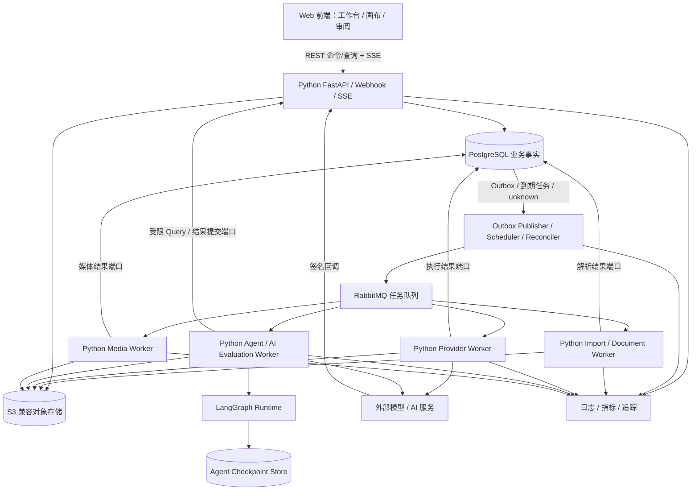
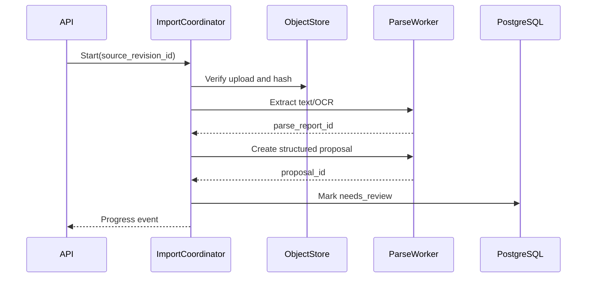

# AI 视频生产平台目标系统架构设计

> 状态：Python 主栈目标架构 v5，待容量基线与研发评审
> 日期：2026-08-22
> 需求基线：[000-AI 视频生产平台目标需求总览](../requirement/000-AI视频生产平台目标需求总览.md)
> 对应产品设计：[002-AI视频生产平台目标产品与功能模块设计](002-AI视频生产平台目标产品与功能模块设计.md)
> 数据与实现细化：[001-AI视频生产平台核心领域与数据模型设计](001-AI视频生产平台核心领域与数据模型设计.md)、[003-AI视频生产平台接口工作流与功能实现设计](003-AI视频生产平台接口工作流与功能实现设计.md)
> 服务与模块映射：[005-AI视频生产平台服务与模块实施基线](005-AI视频生产平台服务与模块实施基线.md)
> 设计方式：从目标系统重新设计，不把历史技术架构、代码结构或服务边界当作前提
> 范围：系统本身；不包含定价、收费、订阅、支付、增长或其他商业计划

## 1. 评估结论

**当前后端采用 Python 单栈：FastAPI 承载业务 API，Python 应用层拥有领域规则和事务，独立 Python Worker 承载 Agent、提供商和媒体任务。首期不引入 Go 工具链、Go 服务或跨语言契约；Go 只在容量证据满足 §3.4 Gate 后重新评估。**

这个结论不是把所有工作放进一个 Python 进程。系统保持“一套语言、一个业务模型、多个独立进程角色”：API 只做短请求和短事务；调度/对账、不可信文档解析、Agent、外部 Provider 和 FFmpeg 分别在受限 Worker 中运行。进程可以独立扩缩和失败隔离，但首期仍是模块化单体，不按领域拆微服务。

| 候选 | 技术可行性 | 对当前负载的有效收益 | 主要代价 | 当前决策 |
| --- | --- | --- | --- | --- |
| Python 业务 + Python Agent | 高 | I/O 并发、AI 生态、单一契约和快速迭代 | 需要严格进程隔离、类型和容量治理 | **主路径** |
| Go 业务 + Python Agent | 高 | 高并发控制面可获得更低资源占用和清晰二进制部署 | 重写、双工具链、跨语言契约和故障定位 | 延后；指标触发后 PoC |
| Java 业务 + Python Agent | 高 | 适合已有 JVM 平台和大型 Java 团队 | JVM 与双栈成本，当前无组织前提 | 不采用 |

当前边界：

- Python 是唯一后端业务主栈：HTTP API、Webhook、鉴权、领域规则、事务、查询、事件和任务协调均复用同一应用端口。
- LangGraph 是受限 Agent Runtime，只编排一次 AgentRun 内部的推理、只读 Tool 和提案节点；不能成为第二套业务工作流或审批事实源。
- API 进程不执行模型调用、长轮询、FFmpeg、文档解析或质量检测；这些工作通过事务 Outbox 和队列交给独立 Worker。
- PostgreSQL 保存业务事实和用户可见 `Operation`；S3 兼容对象存储保存媒体；RabbitMQ 承担至少一次任务投递。首期用数据库状态机、调度器和对账器恢复长任务。
- Temporal 不作为首期前置依赖。只有数据库状态机出现大量长定时器、复杂信号/人工等待或升级恢复负担，并通过独立 ADR/PoC 后，才可用 Temporal Python SDK 替换某一类流程的调度实现。
- Agent Worker 不直接执行高风险领域命令。它只读取授权上下文并返回版本化 `AgentRunResult`/`AgentProposal`；接受提案时仍由应用命令处理器重新鉴权、校验基线和提交。
- 浏览器端使用 TypeScript/React；它是前端技术，不形成第二套后端业务栈。
- Redis 只在限流、短期缓存、SSE fan-out 或实时协作有证据时引入，不保存权威状态。

语言统一不等于权限统一。业务 Worker 可以通过受约束应用端口提交任务结果；Agent/Evaluation Worker 使用独立服务身份，不能任意写业务表。所有进程共享同一版本化 Python 契约包，但各自只获得完成职责所需的数据库、队列、对象和网络权限。

## 2. 架构目标与非目标

### 2.1 目标

1. **业务事实明确**：每个对象只有一个权威模块，版本、选择、审批和交付可追溯。
2. **长流程可恢复**：进程重启、网络超时、回调丢失和人工等待后能继续，而不是重新开始。
3. **外部副作用安全**：幂等、对账、限流、熔断和未知状态防止重复调用。
4. **媒体与元数据分离**：大文件不进入数据库和工作流历史。
5. **租户隔离**：认证、授权、查询、对象存储和审计共同执行工作区隔离。
6. **渐进扩缩**：API、提供商调用、媒体处理和质量检测能独立扩缩。
7. **可观测**：一次用户命令可追踪到工作流、外部尝试、媒体和资源消耗。
8. **可测试**：领域规则不依赖 Web 框架、数据库或提供商 SDK 才能运行测试。
9. **单一运行语义**：计划、运行、结果和交付分别建模，不用一个“大状态机”同时表示四种含义。

### 2.2 非目标

- 首期多区域主动—主动部署。
- 首期事件溯源数据库或全局 CQRS。
- 首期 Kubernetes 必选。
- 首期按领域拆微服务、服务网格，或并行维护两套业务后端。
- 在数据库中保存视频、图像或大型提示上下文。
- 用消息队列代替业务状态机。
- 让 LLM 直接访问生产数据库或对象存储凭据。
- 实现客户计费、套餐、发票或支付系统。

## 3. 为什么采用 Python 单栈、多进程角色

| 维度 | 权威业务进程 | 专用 Worker | 边界判断 |
| --- | --- | --- | --- |
| 领域规则与事务 | FastAPI/API 与应用命令处理器 | 只能调用公开应用端口提交结果 | 一套领域实现 |
| API、Webhook、SSE | API/Webhook 进程 | 不暴露第二套产品 API | 单一公网入口 |
| 长操作 | PostgreSQL Operation/Job 状态机、Outbox、调度和对账 | 执行幂等任务并报告证据 | 产品状态只在 PostgreSQL |
| Agent 推理与规划 | 创建 AgentRun、准备最小上下文、接受提案 | LangGraph 节点、模型、Tool、checkpoint | Agent 只生成提案 |
| 文档/多模态/评估 | 授权、任务、版本和结果登记 | Python AI/CV/音频生态计算 | 结果经应用端口入库 |
| 托管 Provider | execution 模块拥有 Job/Attempt/unknown | Provider Worker 提交、查询、取消和下载 | 适配器不拥有业务状态 |
| FFmpeg | media/delivery 模块拥有 Artifact/RenderRun | Media Worker 监督隔离外部进程 | FFmpeg 不进入 API |
| 可观测与安全 | 统一身份、审计、Operation 和 Trace 根 | 传播 Trace、使用最小服务身份 | 进程权限不同 |

系统瓶颈预期主要来自数据库、对象存储、外部模型、媒体进程和队列等待。语言切换不能缩短这些外部耗时；应先用异步 I/O、队列背压、独立进程和水平扩容解决。只有性能剖析确认 Python 运行时本身是持续瓶颈，Go 才进入决策。

### 3.1 Python 业务主栈约束

- 选择处于官方支持窗口且关键依赖通过兼容测试的 Python 版本；依赖固定并生成可复现锁文件。
- 使用严格类型检查；领域值对象、命令、事件和任务载荷禁止无约束 `dict[str, Any]` 穿透模块。
- 领域包不依赖 FastAPI、SQLAlchemy、RabbitMQ、对象存储或厂商 SDK；入口和适配器依赖应用端口。
- 业务数据库写入只能通过应用端口和短事务；Worker 不直接拼接跨模块 SQL。
- 公共 HTTP 契约以 OpenAPI 为事实源；内部任务契约使用版本化 Pydantic/JSON Schema，禁止 API Schema、队列 Schema 和 Agent State 相互冒充。
- 所有并发必须受队列 prefetch、连接池、提供商限流、进程资源和工作区公平策略约束；`asyncio.create_task` 不能代替容量设计。
- API、调度/对账、Import/Document Worker、Provider Worker、Agent/Evaluation Worker 和 Media Worker 使用独立入口点；生产环境不由同一进程共同监督，避免任一 Worker 故障终止公网 API。Import 与 Provider 可以复用镜像依赖，但必须使用不同入口、队列、服务身份和网络策略。

### 3.2 Python Agent Runtime 约束

- LangGraph State 只包含 AgentRun 所需的小型状态、版本引用和 Tool 结果引用；来源全文和媒体不复制进 checkpoint。
- checkpoint 是 Agent 运行恢复事实，不是镜头、计划、Operation、审批或交付事实；产品查询不从 checkpoint 推断完成或 current。
- 产品级人工审批由业务命令和 Operation 表达。LangGraph `interrupt` 只用于 Agent Run 内部受控暂停，不维护第二套批准状态。
- Agent Worker 通过受限 Query/Tool 端口读取上下文，只能返回 `AgentProgress`、`AgentRunResult` 和 `AgentProposal`；自由文本不能直接执行。
- LLM 输出先通过版本化 Pydantic/JSON Schema、对象数量上限和命令白名单校验，再保存为提案。

### 3.3 进程间契约

进程虽同为 Python，也必须通过版本化任务契约交接，不能传 ORM 实体、LangGraph State 或内存对象。契约至少包含：

- `AgentRunRequest`：run、workspace、actor、scope、基线版本、允许工具、资源上限、graph/schema version、输入引用和 trace context。
- `AgentRunResult`：状态、提案项、证据引用、用量、模型/工具清单、可恢复错误和输出 schema version。
- `AgentProgress`：`run_id + sequence`、阶段、百分比、摘要和可选 Artifact 引用；应用端按序号幂等接收。
- `TaskEnvelope`：task、attempt、workspace、kind、schema version、idempotency key、payload reference 和 trace context。
- `TaskError`：稳定错误码、retryable、certainty、policy reason 和安全摘要；异常文本不作为状态机输入。

契约演进遵循新增字段优先、未知字段可忽略、枚举保留 `unspecified`、破坏性变化新建版本。CI 对生产者与消费者执行 golden contract tests。大型输入输出只传对象或业务引用，不进入消息载荷。

### 3.4 Go 重新评估 Gate

Go 不进入首期目录、CI 和部署。只有同时满足以下条件，才创建一个窄边界纵向 PoC：

1. 在真实目标负载下，Python API 连续无法满足 §13.3 SLO，且已完成查询/索引、连接池、阻塞 I/O、序列化、多进程和水平扩容优化。
2. Trace、CPU 与内存剖析证明主要瓶颈位于 Python 控制面，而不是 PostgreSQL、队列、对象存储、外部模型或 FFmpeg。
3. 选择稳定、无 Agent 依赖的窄切片；Go 版本在同一数据、同一接口和同一 SLO 下证明显著吞吐或资源收益，并计算迁移与双栈运维成本。
4. 团队具有明确 Go 长期所有者，并接受两套升级、安全扫描、镜像、告警和故障处理责任。
5. 迁移保持一个业务事实所有者和可回退路径，不在 Python/Go 同时实现同一聚合写入。

任一条件缺失即继续优化 Python，不以“未来可能更大”为依据预建 Go 服务。即使 Gate 通过，也优先评估无状态 Webhook/SSE 网关或资源敏感接入层，不默认重写领域与事务层。

### 3.5 首期必须通过的 Python 纵向验证

先验证“批准叙事 → 手工创建镜头 → Agent 提出替代镜头方案 → 用户逐项接受”闭环：

1. FastAPI 在短事务中创建 `Operation`、`AgentRun` 与 Outbox 事件。
2. Outbox Publisher 将版本化 `AgentRunRequest` 投递到专用 Agent 队列。
3. Agent Worker 使用 LangGraph 读取版本化引用，调用一个模型和两个只读 Tool，保存 checkpoint 并返回 `AgentRunResult`。
4. 应用端校验 run、workspace、基线、graph/schema version 和命令白名单，在事务中保存 AgentProposal。
5. 用户逐项接受时，应用命令处理器重新鉴权、检查基线并执行领域命令；Agent Worker 不参与业务提交。

验收覆盖：Agent 节点前后进程终止、消息重复、结果重复、模型返回非法 Schema、取消、工作区越权、过期基线、Trace 连贯和不可恢复失败。重复 Proposal/命令副作用必须为 0；没有 Agent 时，用户仍可通过同一命令手工完成镜头规划。

## 4. 技术栈

| 层 | 选择 | 责任 |
| --- | --- | --- |
| Web 前端 | TypeScript、React | 画布、镜头表、媒体审阅、SSE 状态展示 |
| HTTP API | Python、FastAPI、Uvicorn、OpenAPI | 命令/查询入口、Schema、鉴权、Webhook、SSE |
| 领域与应用层 | Python、严格类型、显式端口 | 聚合规则、命令、查询、权限和不变量 |
| 数据访问 | SQLAlchemy Async/显式 SQL + 版本化 Migration | 查询、事务和迁移；领域层不依赖 ORM 类型 |
| 权威数据 | PostgreSQL | 业务事实、版本、任务索引、用量账本、审计 |
| 首期耐久执行 | PostgreSQL 状态机 + Outbox + RabbitMQ + Scheduler/Reconciler | 至少一次投递、定时恢复、外部对账和人工等待投影 |
| Agent Runtime | Python、LangGraph、严格类型 | Agent 内部推理图、工具调用、checkpoint、结构化提案 |
| 进程间契约 | Pydantic + 版本化 JSON Schema | API、Outbox、队列与 Worker 的兼容契约 |
| 媒体 | Python 进程监督 + FFmpeg/ffprobe 隔离 Worker | 探测、代理、关键帧、转码、装配和校验 |
| 对象存储 | 私有 S3 兼容存储 | 原件、代理、候选、导出与隔离区 |
| 可观测 | OpenTelemetry + 指标/日志/追踪后端 | 跨 API、任务、Worker 和提供商关联 |
| 可选缓存 | Redis | 限流、短期缓存、临时在线状态；非权威 |
| 可选工作流引擎 | Temporal Python SDK，需 ADR/PoC | 只替换已证明复杂的耐久调度，不替换业务事实 |

FastAPI/asyncio 处理 API、数据库、对象存储和外部模型等 I/O 并发；多进程或多副本利用多核。FFmpeg、OCR、本地模型等 CPU/GPU/内存密集任务在独立 Worker/容器中运行。LangGraph checkpoint 只恢复 Agent 内部图，不替代业务 Operation、Job、审批或对账。

## 5. 总体架构



### 5.1 进程职责

| 进程组 | 可以做 | 不可以做 | 扩缩依据 |
| --- | --- | --- | --- |
| API/Webhook/SSE | 鉴权、校验、短事务、查询、回调验签、创建 Operation/Outbox | FFmpeg、长轮询、模型生成、Agent 推理 | 请求率、延迟、连接数 |
| Outbox Publisher | 领取并发布 Outbox、记录发布结果 | 修改业务聚合、执行外部调用 | Outbox 滞后、发布速率 |
| Scheduler/Reconciler | 扫描到期任务、unknown 和缺失回调，提交公开恢复命令 | 猜测外部成功、绕过状态机改表 | 到期量、对账延迟 |
| Import/Document Worker | 解包、DOCX/Markdown/TXT 解析、结构提取和受限 OCR（Gate 后） | 公网外呼、读取 Provider/KMS 凭据、保存任意业务 current | 导入队列、CPU/内存、文档大小 |
| Provider Worker | 能力探测、厂商提交/查询/取消、结果下载并提交证据 | 解析不可信文档、自动重试 unknown、自动批准或选择 | Provider 队列、配额、allowlist 网络 |
| Agent/Evaluation Worker | LangGraph 推理、只读 Tool、结构化提案、AI 评估和 checkpoint | 产品审批、高风险命令、任意业务表写入 | 模型延迟、Token、Agent 队列、GPU |
| Media Worker | 探测、转码、装配和确定性技术校验 | 自动选择、删除候选、改变审批事实 | CPU、内存、磁盘 |

首期可以让 Outbox Publisher 与 Scheduler/Reconciler 共用一个部署单元；Import、Provider 和 Agent 可以复用基础镜像，但不能共用进程、队列、服务身份或网络策略。API、后台任务与 Media Worker 也不能共用生产生命周期。是否拆镜像由依赖和资源隔离决定，不由领域模块数量决定。

### 5.2 启动依赖顺序

1. PostgreSQL、对象存储和 RabbitMQ 先通过健康检查；Redis 不是首期启动依赖。
2. 单次 Migration Job 获取数据库锁并完成迁移；普通服务只校验 Schema，不自行并发迁移。
3. 已进入当前切片的 API、Operation、Import、Provider、Agent/Evaluation、Media 入口在依赖健康后可并行启动，不形成“必须先启动 API 才能启动 Worker”的隐式顺序；Provider 到 C、Agent 到 B 才启用。
4. 前端在 API readiness 通过后对外；外部 Webhook 路由在数据库和回调去重表可用后才 ready。

某个 Worker 不健康只暂停对应新任务并暴露队列积压，不应终止 API。数据库不可用时所有写入口失败关闭；RabbitMQ 不可用时 API 仍可提交业务事实和 Outbox，但 Operation 显示排队/基础设施阻塞，恢复后继续发布。

### 5.3 单次任务的权威执行顺序

```text
API 鉴权/预检
  → PostgreSQL 短事务提交业务事实 + Operation + Outbox
  → Outbox Publisher 投递版本化 TaskEnvelope
  → Worker 按 task_id/attempt_id 幂等领取
  → 调用 Agent / Provider / FFmpeg / 对象存储
  → 通过应用结果端口提交证据、Job/Attempt、Candidate/Artifact
  → Outbox 产生状态事件
  → SSE/查询展示 PostgreSQL 权威状态
```

事务提交前禁止调用外部服务；消息投递成功不代表业务成功；Worker 崩溃后允许重复投递但不允许重复副作用。

### 5.4 逻辑模块与运行服务映射

逻辑模块决定事实和规则的所有权；运行服务决定执行位置和故障边界。目标拓扑收敛为六类安全隔离入口，不按 M01—M15 建十五个服务：

| 生产进程角色 | 主要逻辑模块 | 进入方式 | 权威写入与降级 |
| --- | --- | --- | --- |
| `api` | M01—M15 的 HTTP/Webhook/SSE 与应用命令 | 用户、集成或已验签回调 | 只提交短事务、Operation 和 Outbox；Worker 不可用时继续展示已提交事实与阻塞 |
| `operation-worker` | M08 拥有通用 Operation/Task/恢复；M01—M15 按需通过该端口提交长操作、定时、投影或投递意图 | Outbox、到期扫描和公开恢复命令 | 专属 Worker 只提交各自模块结果；统一通过 M08 Operation 端口推进、投影和恢复；unknown 进入 ReconciliationCase，不直接改表或猜测成功 |
| `import-worker` | M03 文档导入/解析 | 版本化 Import TaskEnvelope | 无默认公网外呼、无 Provider/KMS 凭据；解析结果只经受限端口提交 |
| `provider-worker` | M07 编译/能力、M08 Provider、M09 结果下载 | 版本化 Provider TaskEnvelope | 仅 allowlist 外网和按连接读取 KMS；不解析不可信文档；关闭时 A 的 Fixture 链路仍可用 |
| `agent-worker` | M06 AgentRun、M10 AI Evaluation | 受限 Run/Evaluation Task | 只读 Tool + 结构化结果端口；不可接受 Proposal、主选、批准风险或交付 |
| `media-worker` | M05 Animatic 派生/构建、M09 媒体、M10 确定性检查、M13 装配/渲染 | 媒体/Render Task | M05 仍拥有 Animatic 业务事实；Worker 只提交 Artifact/Evaluation/Render 证据，不可替用户选择或批准 |

`operation-worker` 内可以共置 Outbox Publisher、Scheduler 和 Reconciler，但三者仍使用独立 lease、指标和错误语义。通知/Webhook 投递先作为 Outbox 消费适配器，不单独预建通知微服务。是否共用容器镜像由依赖与资源隔离决定，不改变这六类入口的最小权限和故障边界。

详细的基础设施、外部 Provider Gate、模块落地度和切片启用顺序以 [005](005-AI视频生产平台服务与模块实施基线.md) 为准。

## 6. 模块化单体边界

代码按业务能力组织，不按 Controller/Service/Repository 横向堆叠：

```text
backend/                        # 一个 Python 代码库，可构建多个进程入口
  app/
    runtime/
      api.py
      operation_worker.py
      import_worker.py
      provider_worker.py
      agent_worker.py
      media_worker.py
    identity/
    projects/
    narrative/
    productionknowledge/
    shots/
    agent/
    generationplanning/
    execution/
    media/
    quality/
    usage/
    review/
    delivery/
    governance/
    agent_runtime/
      graphs/
      nodes/
      tools/
      checkpoint/
    contracts/
      tasks/v1/
      agent/v1/
  migrations/
```

该目录只表达依赖边界，不要求一次性重排现有代码，也不要求每个逻辑模块成为独立部署单元。实现按纵向切片迁移实际使用的入口和模块；不创建全局 `utils`、空 Repository 或只转发调用的层。

### 6.1 模块内部结构

每个 Python 业务模块按实际复杂度选择以下职责文件/目录：

- `domain`：实体、值对象、聚合、不变量和领域事件。
- `application`：命令、查询、端口、事务协调和权限检查。
- `adapters`：PostgreSQL、队列、对象存储和厂商 SDK 实现。
- `transport`：HTTP/事件请求响应与路由，不包含业务判断。

依赖方向为 `transport/adapters → application → domain`。领域代码不导入 FastAPI、SQLAlchemy、RabbitMQ 或厂商 SDK。Agent Runtime 只能依赖 `contracts/agent/v*`、LangGraph、模型适配器和只读 Tool/结果提交端口，不导入 Repository 或业务表模型。

### 6.2 允许的跨模块协作

- 同事务的强一致规则由用例编排器通过显式应用端口调用权威模块；即使共享事务，也只能由表所有者模块执行其写入。
- 非关键衍生更新通过事务 Outbox 事件传播。
- 跨模块只传稳定 ID、版本 ID 和小型值对象，不传 ORM 实体。
- 禁止跨模块直接查询或写入对方表。
- 画布、API 和批处理调用同一 Python 命令处理器；Agent 只输出同一命令 Schema 的提案，接受时仍由权威命令处理器执行。

### 6.3 代码依赖与运行协作分离

“质量问题批准修复后再次生成”是运行时闭环，不意味着 `quality` 包可以导入 `generation_planning` 的领域实现。静态代码依赖必须保持单向：模块只依赖自身领域、最小 `shared_kernel` 和对方公开的应用端口/契约。跨模块反向流程由用例编排器、事件处理器或调度器提交公开命令完成。

因此：

- 模块图描述事实流和运行协作，不直接作为 Python import 图。
- Python 业务模块和 Graph/Node/Tool 依赖必须单向；CI 通过架构测试阻止循环和越界导入。
- 事件处理器只能提交公开命令，不能在消费者中直接改写订阅模块的表。
- 需要跨模块原子性的少数用例必须在设计中点名，例如“批准计划 + 资源预留”，不能把共享数据库当成任意跨表写入许可。

## 7. 数据设计

### 7.1 数据分类

| 类别 | 存储 | 示例 | 规则 |
| --- | --- | --- | --- |
| 业务事实 | PostgreSQL | 项目、镜头、版本、计划、选择、审批 | 事务写入、版本约束 |
| 长操作状态 | PostgreSQL `Operation` | 用户可见进度、阻塞、失败、未知和恢复动作 | 产品状态权威；可由 API 查询和 SSE 订阅 |
| 任务运行事实 | PostgreSQL Job/Attempt/Receipt | 领取、外部 ID、回调、重试、unknown 和对账证据 | 运行恢复权威；与业务对象分表但可查询 |
| 队列投递 | RabbitMQ | 版本化 TaskEnvelope、延迟和死信 | 可重复、非事实源；消息丢失可由 Outbox 重发 |
| Agent 内部 checkpoint | Agent 专用 PostgreSQL schema/database | LangGraph thread、节点状态、待恢复 Tool 结果 | 仅 AgentRun 恢复；产品查询不读取，不得保存业务 current |
| 媒体二进制 | 对象存储 | 原件、候选、代理、交付 | 私有、内容哈希、生命周期 |
| 小型结构化 AI 结果 | PostgreSQL JSONB + 标准列 | 提取提案、评估证据 | Schema 版本化、限制大小 |
| 可观测数据 | 专用后端 | 日志、Trace、指标 | 不保存完整敏感提示或媒体 URL |
| 短期缓存 | Redis（可选） | 限流令牌、短期查询缓存 | 可丢失、可重建、有 TTL |

### 7.2 标识与版本

- 所有外部暴露 ID 使用不可枚举的时间有序 UUID。
- 稳定对象和修订对象分开：如 `shot` 与 `shot_plan_revision`。
- 修订包含 `based_on_revision_id`、`schema_version`、`created_by`、`created_at`。
- 当前指针存于稳定对象，但批准动作通过事务同时完成唯一性校验。
- 对批准修订保存规范化内容哈希，审批和交付引用该哈希。
- API 更新草稿使用 `revision_no` 或 ETag 执行乐观并发。

### 7.3 PostgreSQL 约束

- 所有租户表包含 `workspace_id NOT NULL`，主查询索引以工作区为前缀。
- 业务唯一约束包含工作区，防止全局命名冲突。
- 使用外键保护稳定引用；历史快照引用不可删除对象时采用限制或逻辑归档。
- “一个范围只有一个 current 修订”等不变量尽量用部分唯一索引保护。
- 金额或用量使用定点值和明确单位，禁止二进制浮点。
- 时间统一保存 UTC，展示时使用用户时区。
- RLS 作为纵深防御，不替代应用层授权。PostgreSQL 官方文档指出启用 RLS 且没有策略时默认拒绝，但表所有者通常绕过策略，因此应用运行角色不得拥有表。

### 7.4 对象存储布局

对象键不包含邮箱、项目标题或其他敏感业务名称：

```text
workspaces/{opaque_workspace_id}/
  originals/{content_hash_prefix}/{artifact_id}
  quarantine/{artifact_id}
  proxies/{artifact_id}/{variant_spec_hash}
  candidates/{candidate_id}/{artifact_id}
  deliveries/{delivery_snapshot_id}/{artifact_id}
```

- 上传先进入隔离区，完成大小、类型、哈希和安全检查后发布。
- 原件默认不可变；转码和缩略图是有派生边的独立 Artifact。
- 前端通过短时、限动作的签名 URL 上传或下载。
- 生命周期策略按数据类别执行，不按临时文件名猜测。
- 数据库先记录“准备删除”，对象删除完成后再记录结果；失败进入重试和人工队列。

## 8. API 与实时状态

### 8.1 协议

- REST/JSON：业务命令和查询。
- SSE：任务、计划、评估和交付的单向状态更新。
- 预签名 URL：大文件直传/下载，API 不代理媒体正文。
- 签名 Webhook：后续外部集成事件。
- WebSocket 仅在多人画布实时协作被验证为必需时引入。

### 8.2 命令契约

所有产生状态变化的 API 包含：

- `Idempotency-Key`：调用方重试去重。
- `If-Match` 或基线修订 ID：并发保护。
- 认证主体和工作区上下文：服务端解析。
- `request_id` 与 `trace_id`：观测关联。
- 明确的目标对象 ID 和目标版本 ID。

典型返回：

```json
{
  "command_id": "...",
  "status": "accepted",
  "resource": {"type": "generation_plan", "id": "...", "revision": 3},
  "operation": {
    "id": "...",
    "status_url": "/v1/operations/..."
  },
  "links": {"self": "/v1/generation-plans/..."}
}
```

长操作返回 `202 Accepted`；“已接受”不等于“已完成”。前端订阅 SSE 或查询权威资源状态。

每个长命令在同一事务中先创建 Operation、具体 Job/Attempt 和 Outbox 启动意图。Worker 只能通过受约束的应用结果端口推进状态；队列投递与 PostgreSQL 短暂不一致时，Operation 保留权威状态并通过 `status_detail/recovery_actions` 显示排队或恢复中。Scheduler/Reconciler 依据 Outbox、Job、Attempt 和外部 Receipt 对账，客户端不解释 RabbitMQ delivery tag、Worker 进程或 LangGraph checkpoint。

### 8.3 错误模型

统一问题响应包含：`code`、`message`、`retryable`、`field_errors`、`current_revision`、`request_id` 和可选 `recovery_actions`。

错误分为：

- 验证失败：修改输入后重试。
- 并发冲突：刷新、比较并合并。
- 策略阻塞：补权利、换提供商或申请例外。
- 配额阻塞：缩小范围、降规格或获批提高上限。
- 外部暂时故障：系统按批准策略重试。
- 外部确定失败：产生失败记录，需新计划或人工处理。
- 外部未知：进入对账，禁止盲目重试。

## 9. 耐久任务与工作流设计

### 9.1 工作流边界

首期耐久执行由 PostgreSQL 状态机、事务 Outbox、RabbitMQ、Scheduler/Reconciler 和幂等 Worker 共同完成。TaskEnvelope 只保存小型 ID、版本和对象引用；完整 Prompt、来源文档、评估 JSON 和媒体从 PostgreSQL/对象存储按版本读取。

每一步外部副作用都必须先存在稳定 Job/Attempt 与幂等键，执行后保存外部任务 ID、回调 Receipt、结果哈希或“不确定”证据。Worker 发布新版本时，旧消息仍按 `schema_version` 读取；不兼容消息进入明确 dead-letter/人工恢复，不能永久 running。

队列不拥有计划、候选、选择、审批或交付快照。PostgreSQL 模块拥有“业务上已经发生什么”和“下一步允许做什么”；Operation 是唯一面向用户的运行投影，不再额外建立 ProductionRun/StageRun/WorkTask 等竞争状态源。

Agent 使用独立队列和 checkpoint。`agent_run_id` 同时作为任务业务幂等键和 LangGraph `thread_id` 的受控派生来源；重复 TaskEnvelope 先按 run/version 查找 checkpoint 和既有结果，不能创建第二个 AgentRun。队列 heartbeat/可见性、Job lease 和 Reconciler 负责存活与任务重投，LangGraph checkpoint 负责节点级恢复，两者都不能单独决定产品状态。产品级 `waiting_user` 只由业务命令与 Operation 表达。

### 9.2 导入工作流



失败策略：文件不可读是确定失败；单页 OCR 可部分成功；LLM 结构化失败可在相同来源和 Schema 下有限重试；人工校对不保持数据库事务打开。

### 9.3 生成工作流

1. 批准命令冻结 `GenerationPlan`、资源预留和 `execution_disposition=start_now|hold`。
2. `start_now` 在批准事务中通过 execution 端口创建 Operation 与启动 Outbox；`hold` 只能由后续显式 Submit 命令以同样方式创建，重复启动由业务幂等键拒绝。
3. Generation Coordinator 领取既有 Operation 后读取已批准计划和输入快照，再次检查权利撤销、能力健康和用量预留。
4. 为每个 PlanItem 创建稳定 `GenerationJob` 和业务幂等键。
5. Provider Worker 调用适配器提交外部任务。
6. 获得外部任务 ID 后等待回调信号，同时以长间隔轮询兜底。
7. 提交结果不确定则让 Job 和 Operation 进入 `unknown` 对账子流程，不修改 GenerationPlan 状态，也不立即重提。
8. 确认成功后下载至隔离区、校验、提取元数据并创建 Candidate。
9. 记录实际用量，释放预留，触发质量评估。
10. Operation 汇总为 `succeeded`、`partially_failed`、`unknown` 或 `cancelled`；GenerationPlan 继续保持 approved，作为执行依据。

每个 PlanItem 独立失败；批次不使用“任一失败则回滚所有外部任务”的虚假事务。

### 9.4 人工审批

人工等待不占用数据库事务或 Worker。M12 在 PostgreSQL 中保存 `approved`、`rejected`、`changes_requested` 或过期事实，并通过 Outbox 触发后续公开命令；消费者必须重新读取并校验决定、主体和输入哈希，不能只信任事件载荷。Scheduler 负责到期扫描，重复到期事件不得产生第二个决定。

### 9.5 交付工作流

- 创建 DeliveryBuild，并冻结装配、所有主选决定和输入 Manifest。
- 运行权利、审批、质量、媒体完整性和格式预检。
- 创建渲染计划并按阶段生成中间文件。
- 对确定性中间产物按输入哈希复用。
- 运行技术校验，生成 Manifest 和内容哈希。
- 最终化前重新检查会随时间变化的权利、策略与审批，并确认 Build 输入哈希未变化。
- 只有所有必需产物和校验通过后，才在单一事务中创建不可变 DeliverySnapshot；附属文件失败时 DeliveryBuild 标记不完整，不创建“看似完成”的快照。

## 10. 提供商适配层

### 10.1 统一端口

```python
class ProviderAdapter(Protocol):
    async def validate(self, request: CompiledRequest) -> ValidationResult: ...
    async def submit(
        self, request: CompiledRequest, idempotency_key: str
    ) -> SubmissionResult: ...
    async def status(self, external_job_id: str) -> ProviderStatus: ...
    async def cancel(self, external_job_id: str) -> CancelResult: ...
    async def fetch_outputs(self, external_job_id: str) -> Sequence[RemoteOutput]: ...
    def verify_callback(self, headers: Mapping[str, str], body: bytes) -> VerifiedCallback: ...
```

`SubmissionResult` 必须区分：已创建并有外部 ID、确定未创建、结果未知。适配器不得把未知异常统一映射成可重试失败。

普通托管 Provider 使用同一 Python Adapter 端口；具体 SDK 不能把厂商 DTO 泄漏进领域层。`GenerationJob`、`Attempt`、外部任务登记和 `unknown` 对账始终由 execution 模块拥有，Adapter 只映射厂商协议与证据。

### 10.2 能力目录

能力目录记录而不是硬编码：

- 媒体类型、模型/版本、区域和健康状态。
- 输入/输出格式、分辨率、时长、画幅和参考数量限制。
- 支持的身份/首尾帧/运动/音频/编辑能力。
- 数据保留、训练使用、许可和地域限制。
- 计量单位、并发和速率限制。
- 回调、轮询、取消和幂等支持等级。
- 最近验证时间和来源。

能力变化产生新版本；已批准计划继续引用旧快照，但执行前若能力已不可用则阻塞并请求新计划。

## 11. 幂等、事务与事件

### 11.1 三层幂等

1. **API 幂等**：`workspace_id + actor_id + Idempotency-Key + command_type` 唯一。
2. **业务幂等**：批准、选择、创建计划等命令有业务唯一键和当前版本检查。
3. **外部幂等**：`provider_connection + plan_item_id + attempt_purpose` 生成稳定键；若提供商不支持，则依赖外部任务登记和对账。

### 11.2 事务 Outbox

领域状态与 Outbox 事件在同一 PostgreSQL 事务提交。发布器异步投递并记录消费游标；消费者按 `event_id` 去重。事件至少一次投递，因此处理器必须幂等。

不用分布式事务协调 PostgreSQL、RabbitMQ、对象存储和外部模型。通过状态机、Outbox、幂等、对账和补偿达到可恢复的一致性。

### 11.3 补偿原则

- 可取消外部任务：请求取消并跟踪最终结果。
- 已产生媒体：进入未采用/待清理状态，不伪装成从未发生。
- 已产生用量：记账并归因，不回滚事实。
- 已发审批：通过撤回或新审阅包替代，不删除历史。
- 已交付快照：撤销访问或发布新快照，不覆盖原快照。

## 12. 安全与租户隔离

### 12.1 身份与授权

- OIDC/OAuth2 认证；短时访问令牌和可撤销会话。
- API 首先确定工作区，再加载成员和项目角色。
- 权限按命令判断，不只按页面或 HTTP 方法判断。
- 高风险操作支持重新认证和双人批准。
- 服务身份使用最小范围、短期凭据和独立审计主体。
- Agent/Evaluation Worker 使用独立服务身份，只能消费指定队列、读取任务授权的对象/只读 Tool，并通过受限结果端口上报对应 AgentRun；没有通用业务 PostgreSQL 写角色。

### 12.2 数据保护

- 传输和静态加密；敏感提供商凭据进入密钥管理服务，不进数据库明文字段。
- 日志默认不记录 Prompt 全文、来源文档、签名 URL、Token 或回调原文中的敏感字段。
- 上传限制内容长度、解压倍率、媒体时长和格式；Import Worker 与 FFmpeg 子进程使用低权限容器、CPU/内存/时间限制和无默认公网外呼。Provider Worker 使用独立身份、按连接读取 KMS、仅 allowlist egress，不能消费导入队列或解析不可信文件。
- 对象下载签名绑定对象、动作、期限和必要网络条件。
- 提供商调用只使用该计划明确引用的媒体，不授予桶级凭据。
- Agent Tool 使用 API/应用端签发的 `run_id + workspace_id + allowed_tool + scope + expires_at` 能力令牌；Agent Worker 不能自行扩大项目范围或把上一次 Run 的 Tool 授权复用到下一次。

### 12.3 Webhook 安全

- 保存原始请求哈希、签名版本、提供商事件 ID 和接收时间。
- 验证签名、时间窗和重放；重复事件返回成功但不重复处理。
- 回调中的租户或内部对象 ID 不可信，通过外部任务登记反查。
- 未知外部任务的回调进入隔离观察，不自动创建项目数据。

## 13. 可观测与运维

### 13.1 关联标识

`request_id → command_id → operation_id → task_id → agent_run_id/graph_version 或 generation_job_id → attempt_id → external_job_id → artifact_id → candidate_id → delivery_snapshot_id`

日志和 Trace 使用这些 ID，禁止用项目标题、用户名或文件名作为主要关联键。

### 13.2 核心指标

- API 延迟、错误率和并发数。
- Outbox 滞后、队列排队、未确认消息、死信、Task lease 过期和 Reconciler 恢复数。
- Agent 队列延迟、图节点耗时、checkpoint 恢复、模型/Tool 调用、契约拒绝和重复结果去重数。
- 各提供商提交成功率、未知率、回调延迟、轮询次数和限流率。
- 重复回调去重数和对账恢复数。
- 媒体探测/转码/渲染时长、失败率和隔离率。
- 每种任务的估算与实际资源消耗偏差。
- 每个状态停留时间和人工等待时间。
- 对象存储完整性错误、过期签名拒绝和跨租户拒绝。

### 13.3 初始服务目标

| 目标 | 初始值 | 说明 |
| --- | --- | --- |
| 常规查询 API 可用性 | 月度 99.9% | 不代表外部模型可用性 |
| 非媒体 API 延迟 | p95 < 500 ms | 不包含异步任务完成时间 |
| 状态可见延迟 | p95 < 5 s | 从权威状态提交到前端可见 |
| 已接受任务丢失 | 0 | 可失败、可未知，但不能无记录消失 |
| 重复回调产生重复候选 | 0 | 幂等硬指标 |
| PostgreSQL 生产数据 RPO | ≤ 5 min | 上线前通过恢复演练确认 |
| PostgreSQL 生产数据 RTO | ≤ 60 min | 第一阶段单区域目标 |

外部模型成功率和耗时按提供商、模型和输入规格单独展示，不能混入平台 API 可用性。

### 13.4 语言与扩容决策指标

容量测试按真实项目规模、查询组合、SSE 连接、Webhook 突发和 Worker 队列分别执行，不能用单一 Hello World RPS 决定语言。若 SLO 未满足，排查顺序固定为：数据库查询/锁 → 阻塞 I/O → 连接池/队列背压 → 序列化与业务算法 → Python CPU/内存 → 水平扩容成本。只有最后两项在代表性负载中持续占主导，才进入 §3.4 Go Gate。

## 14. 部署拓扑

### 14.1 第一阶段

- 单区域、多可用区托管 PostgreSQL。
- 私有版本化对象存储和生命周期规则。
- 托管 RabbitMQ 或具备持久化、死信、监控和备份策略的集群。
- Python API/Webhook/SSE、Operation/Outbox/Scheduler/Reconciler、Import/Document Worker、Provider Worker、Agent/Evaluation Worker 和 Media Worker 使用独立进程入口并按指标扩缩。
- 首期可复用同一应用镜像减少构建面；Media/GPU 依赖或权限明显不同时再拆镜像，不能为了模块图预建多个仓库或服务。
- Media Worker 使用临时加密磁盘，任务结束后清理；GPU Worker 只在实际评估/媒体模型需要时启用。
- LangGraph checkpoint 使用 Agent Runtime 专用 schema/database 与凭据；生命周期、备份和删除策略随 AgentRun，而不是随业务 current 指针。
- 生产、预发布和开发使用不同工作区、业务数据库、Agent checkpoint、对象桶、RabbitMQ vhost 和提供商凭据。

### 14.2 当前 Python 服务调整顺序

当前运行入口把 API、Scheduler、I/O Worker 和 Media Worker 置于同一监督进程；任一长期服务异常会取消其余任务。这适合本地联调，不适合作为生产故障边界。调整按以下顺序进行，不重写业务模块：

1. 保留现有 FastAPI 路由、领域服务、Repository、RabbitMQ 拓扑和数据库模型，切片 A 先增加/启用 `api`、`operation-worker`、`import-worker`、`media-worker`。迁移期现有 `outbox-scheduler`/`io-worker` 命令只能作为这两个入口的临时别名，指标与 service name 统一为新名称，不能形成两套部署。
2. API 入口只启动 Uvicorn 并执行 Schema readiness；Migration 改为单次 Job，Scheduler/Worker 不再与 API 共生退出。
3. 为每个进程设置独立 liveness/readiness、连接池、队列 prefetch、并发上限、资源限制和服务名称；分别注入最小凭据。
4. 切片 B 启用 `agent-worker`；在此之前不创建空 Agent 服务。
5. 切片 C 启用独立 `provider-worker`，赋予 allowlist egress 与 KMS 引用权限；`import-worker` 始终无该权限。
6. 完成“停止任一 Worker 不影响 API、恢复后积压继续处理”和“API 重启不重复外部任务”故障测试后，再考虑拆镜像或增加副本。

这一步是进程生命周期和部署命令调整，不是微服务拆分，也不要求引入新的网络 RPC。Worker 继续复用同一 Python 应用端口与版本化任务契约。

### 14.3 不依赖 Kubernetes

进程组可先运行在托管容器平台。只有出现 GPU 调度、复杂媒体资源隔离、多集群策略或现有基础设施要求时再采用 Kubernetes。业务代码不得依赖具体调度平台。

### 14.4 备份与恢复

- PostgreSQL 自动备份、时间点恢复和季度恢复演练。
- 对象存储开启版本保护；生命周期删除必须与数据库保留策略一致。
- RabbitMQ 和 LangGraph checkpoint 都不是业务事实备份；关键结果已落 PostgreSQL。
- 提供商外部任务 ID 和输入哈希持久化，用于灾后对账。
- 恢复演练必须验证：工作区隔离、当前修订、任务状态、媒体引用、选择、审批和交付清单。

## 15. 测试策略

### 15.1 测试层级

| 层级 | 重点 | 工具/方法 |
| --- | --- | --- |
| Python 领域单元测试 | 状态机、不变量、权限和影响规则 | 纯 Python，无数据库/网络 |
| 属性/模糊测试 | 版本唯一、用量守恒、幂等、状态转换和解析边界 | 生成边界组合 |
| Python Agent 测试 | 图路由、结构化输出、Tool 白名单、checkpoint 恢复 | Fake Model/Tool + LangGraph checkpointer |
| 进程契约测试 | TaskEnvelope/Agent 契约版本、未知字段/枚举、生产者—消费者 golden | Pydantic/JSON Schema + 固定样本 |
| 应用集成测试 | 事务、Outbox、RLS、并发冲突 | 真实 PostgreSQL |
| 耐久任务测试 | 重复投递、lease 过期、死信、定时恢复、取消和代码升级 | PostgreSQL + RabbitMQ 测试环境 |
| 适配器契约测试 | 厂商状态/错误/回调映射 | 录制响应 + 厂商沙箱 |
| 媒体黄金样本 | 探测、转码、字幕、渲染和校验 | 小型可授权媒体集 |
| 安全测试 | 跨租户、签名 URL、Webhook 重放、恶意文件 | 自动化负向场景 |
| 端到端测试 | 脚本到交付的六个产品验收场景 | 可控假提供商 + 少量真实沙箱 |

### 15.2 必须覆盖的故障注入

- 提交请求在服务端创建任务后客户端超时。
- 同一回调发送两次、乱序到达或签名过期。
- Outbox 已提交但 RabbitMQ 发布前后 Publisher 重启。
- Worker 在外部提交前、获得外部 ID 后和结果入库前分别重启。
- Agent Worker 在 LangGraph 每个节点前后重启，消息重投后从同一 run checkpoint 恢复。
- 生产者/消费者滚动升级时收到旧/新契约版本、未知字段或不支持 graph version。
- Agent 重复返回相同 AgentRunResult，或使用过期/跨工作区 Tool 能力令牌。
- 成功回调到达但媒体下载中断或哈希不一致。
- 计划批准后能力目录或权利状态变化。
- 批量任务部分成功、部分失败、部分未知。
- 用量明细延迟或与估算不一致。
- 交付渲染成功但附属字幕或清单失败。
- 成员在审批等待期间被停用。
- 两个用户同时发布同一实体范围的新 current 修订。

## 16. 实施切片

### 切片 A：运行骨架与手工内容主线

先启用 API、Operation/Outbox/Scheduler、Import/Document Worker 和 Media Worker；完成工作区隔离、项目 Brief、来源直传/保全、叙事校对、修订基类、最小实体/状态、手工镜头方案、Operation、命令幂等、PostgreSQL Migration、Outbox、审计和基础观测。使用确定性解析或固定 Fixture，不依赖 Agent 和真实生成 Provider。

**验收**：用户可从真实来源手工得到带锚点的批准叙事和至少 10 个镜头；跨租户负向测试通过；重复命令无重复事实；Outbox/Worker 任一点重启后 Operation 可恢复。只有手工命令语义稳定后才允许 Agent 复用。

### 切片 B：受限 Agent 提案

新增独立 Agent Worker、LangGraph checkpoint、实体/镜头提案、人工逐项接受和最小关系/影响接管视图；Agent 复用切片 A 已完成的 Query 与命令 Schema，不新增旁路写入口。完整空间画布仍在切片 F。

**验收**：无 Agent 时手工流程仍完整；Agent 输出非法、重复、越权或过期时不改变业务事实；接受提案与手工提交得到相同领域结果；镜头重排不改变已发布有效范围。

### 切片 C：可恢复生成

启用 Provider Worker，完成能力目录、计划冻结、用量预留、耐久 Job/Attempt、一个图像和一个视频提供商、媒体入库、候选选择。

**验收**：进程重启不中断业务；超时进入未知并可对账；回调重复不产生重复候选。

本切片的一个图像能力和一个视频能力只验证真实接入与耐久执行，不宣称多模型路由已经成立。RouteDecision、同类能力比较和故障切换需要后续至少两个可替代视频能力的独立证据 Gate。

### 切片 D：质量与修复

技术检查、人工问题、评估提案、修复计划和局部重做。

**验收**：问题绑定证据和版本；修复只影响选定范围；旧评估在输入变化后过期。

### 切片 E：审阅与交付

冻结审阅包、评论/决定、基础画面/音频/字幕装配、DeliveryBuild、交付预检、RenderRun、Manifest、DeliverySnapshot 和访问撤销。

**验收**：失败或不完整 Build 不产生 Snapshot；成功交付可复现；权利/审批缺失阻止交付；后续修改不改变历史快照。

### 切片 F：画布、团队与组织复用

画布批量命令、外部审片、组织资产/模板和经需求验证的企业能力。

**验收**：画布、Agent、列表和 API 复用同一命令；扩展不能跨模块写表或绕过治理。

## 17. 目标架构验收清单

- [ ] 后端业务规则和业务表写入只有一套 Python 应用端口实现；API、Worker 和 Agent 不复制聚合、状态机或权限。
- [ ] API 进程不执行模型调用、解析、FFmpeg、长轮询或评估长任务。
- [ ] API、Operation、Import、Provider、Agent/Evaluation 和 Media 六类入口按切片启用并使用独立生产生命周期、队列、服务身份、网络策略与资源限制。
- [ ] Import Worker 无默认公网外呼和 Provider/KMS 凭据；Provider Worker 不能解析不可信导入文件。
- [ ] Agent/Evaluation Worker 没有通用业务 PostgreSQL 写角色，只能访问指定队列、受限 Tool、对象引用和结果提交端口。
- [ ] 进程间只共享版本化 Pydantic/JSON Schema 契约，不传 ORM 实体或 LangGraph State。
- [ ] LangGraph checkpoint 只恢复 AgentRun，不产生第二套 Operation/HITL 状态。
- [ ] AgentProgress 和 AgentRunResult 使用 run/version/sequence 幂等接收，消息重投不产生第二份提案。
- [ ] 所有外部调用来自已冻结计划并有稳定幂等键。
- [ ] `unknown` 有数据库状态、对账工作流和人工入口。
- [ ] 每个模块拥有明确数据表，禁止跨模块直接写表。
- [ ] Operation 是唯一用户可见长操作状态；RabbitMQ、Task lease 和 checkpoint 不与 Operation 竞争产品事实。
- [ ] GenerationPlan 不包含 submitted/completed/unknown 等运行状态。
- [ ] DeliverySnapshot 只在 DeliveryBuild 完成后创建，输入与输出创建后均不可补写。
- [ ] Agent 只返回可验证领域命令提案；接受时由应用命令处理器重新鉴权、校验版本和执行。
- [ ] 媒体不进入 PostgreSQL 大字段、消息载荷或 checkpoint。
- [ ] 工作区隔离同时覆盖 API、查询、对象键、RLS 和审计。
- [ ] 选择、审批、风险接受、用量调整和交付均为追加事实。
- [ ] 业务事件通过事务 Outbox，消费者可安全重复执行。
- [ ] 生产恢复演练包含数据库、对象、Outbox、队列、checkpoint 和外部任务对账。
- [ ] 商业计费、套餐、支付和发票不进入系统模块或数据模型。

## 18. 官方技术依据

- [Python asyncio](https://docs.python.org/3/library/asyncio.html)：异步 I/O、高层网络、子进程、队列和并发 API 的官方边界。
- [Python multiprocessing](https://docs.python.org/3/library/multiprocessing.html)：使用多进程绕过 GIL 并利用多核的官方机制。
- [FastAPI Concurrency](https://fastapi.tiangolo.com/async/) 与 [Deployment Workers](https://fastapi.tiangolo.com/deployment/server-workers/)：I/O 并发、CPU 工作和多 Worker/多副本部署依据。
- [OpenAI 官方 SDK 列表](https://github.com/openai/openai-openapi#generated-sdks) 与 [Google GenAI SDK](https://ai.google.dev/gemini-api/docs/libraries)：Python、Go、Java 均有主流托管模型官方 SDK，故 SDK 是否存在不是语言边界依据。
- [LangGraph Overview](https://docs.langchain.com/oss/python/langgraph/overview)：Agent Runtime 的 durable execution、streaming、human-in-the-loop 和 persistence 能力。
- [LangGraph Persistence](https://docs.langchain.com/oss/python/langgraph/persistence)：thread/checkpoint、故障恢复和生产 checkpointer 边界。
- [LangGraph Interrupts](https://docs.langchain.com/oss/python/langgraph/interrupts)：interrupt 的持久化与恢复语义；本设计不把它用作产品审批事实。
- [Temporal Python SDK](https://docs.temporal.io/develop/python)：若首期数据库状态机的复杂度 Gate 触发，Python 可直接承载 Workflow/Activity，不需要先引入 Go。
- [Go Concurrency](https://go.dev/doc/effective_go#concurrency) 与 [Go Diagnostics](https://go.dev/doc/diagnostics)：只用于 §3.4 性能 PoC 的能力与测量依据，不构成当前选型。
- [PostgreSQL：Row Security Policies](https://www.postgresql.org/docs/18/ddl-rowsecurity.html)：RLS 默认拒绝、策略行为和表所有者绕过注意事项。
- [Amazon S3：对象生命周期](https://docs.aws.amazon.com/AmazonS3/latest/userguide/object-lifecycle-mgmt.html)：对象保留、转换与到期管理。
- [AWS Prescriptive Guidance：预签名 URL 最佳实践](https://docs.aws.amazon.com/prescriptive-guidance/latest/presigned-url-best-practices/introduction.html)：预签名 URL 的风险与保护措施。
- [OpenTelemetry Python](https://opentelemetry.io/docs/languages/python/)：API、队列和 Worker 的 Trace、Metric 与日志接入依据。

## 19. 待评审技术问题

1. 首期 API 峰值请求率、SSE 连接数、并发项目数、镜头数、单媒体大小和交付时长是多少？这些数据形成 Python 容量基线和扩缩配置。
2. 当前 RabbitMQ/数据库状态机对人工等待、长定时器、代码升级、回调丢失、取消和 unknown 对账的恢复演练是否完整？未出现复杂度证据前不引入 Temporal。
3. Agent 是否需要多轮会话长期记忆？若不需要，默认每个 AgentRun 独立 thread；不能为了想象中的记忆扩大 checkpoint 和隐私范围。
4. 是否有必须私有部署、禁止外发或限定地域的素材类型？这决定本地模型、Worker 网络区和对象授权方式。
5. 现有 Python 服务中哪些纵向闭环可直接保留，哪些需要按 000—003 的新领域模型替换？迁移按闭环进行，不按文件夹批量重命名。
6. 首期目标提供商各自是否支持幂等键、回调、查询与取消？需要用真实沙箱建立能力目录，而不是依赖营销文档。
7. 哪些任务需要独立 Media/GPU 镜像，哪些可以复用通用 Python Worker 镜像？以系统依赖、权限和资源隔离决定，不以模块名称决定。
