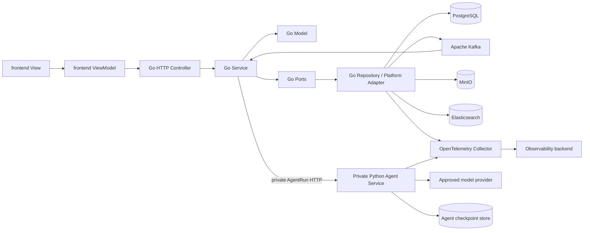
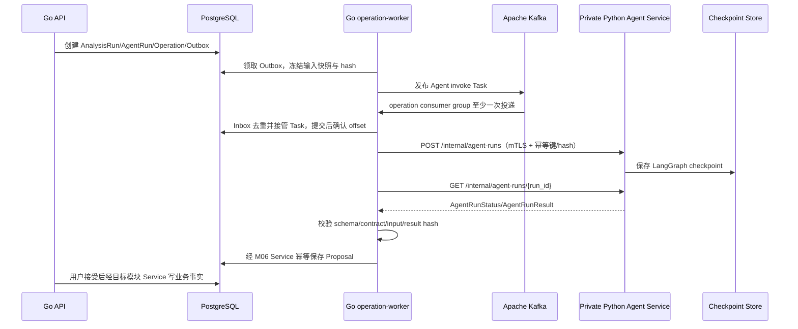

# AI 视频生产平台目标系统架构设计

> 状态：accepted，目标架构冻结 v14；实现必须遵循，变更须先更新 Design 并重新评审
> 日期：2026-08-22
> 需求基线：[000-AI 视频生产平台目标需求总览](../requirement/000-AI视频生产平台目标需求总览.md)
> 产品设计：[002-AI视频生产平台目标产品与功能模块设计](002-AI视频生产平台目标产品与功能模块设计.md)
> 数据与接口：[001-AI视频生产平台核心领域与数据模型设计](001-AI视频生产平台核心领域与数据模型设计.md)、[003-AI视频生产平台接口工作流与功能实现设计](003-AI视频生产平台接口工作流与功能实现设计.md)
> 实施基线：[005-AI视频生产平台服务与模块实施基线](005-AI视频生产平台服务与模块实施基线.md)
> 设计方式：从目标业务重新设计，不继承旧实现、旧目录、旧 Schema 或兼容性要求；技术决策以官方资料和活跃开源实现为证据

## 1. 冻结结论

Lanverse 固定采用三工程、双运行时、单业务事实源架构：

1. `frontend/`：TypeScript、React、Next.js 浏览器应用，负责 MVVC 的 View 与 ViewModel。
2. `backend/`：Go 模块化单体，是唯一业务后端，负责 MVVC 的 Controller、Service、POJO 风格 Model、PostgreSQL 事务、公共 API 和全部非 Agent Worker。
3. `agent/`：Python 内网 Agent 计算微服务，使用 FastAPI/Uvicorn 提供仅 backend 可调用的内部 Run 契约，使用 LangGraph 实现 Harness、Skill、模型与只读 Tool 编排；不连接 Kafka、不提供公共 API，不拥有业务表、业务事务、审批或 current 状态。

以下不再作为候选：Python 业务后端、Go/Python 双写业务事实、按 M01—M15 拆微服务、Agent 直接写 PostgreSQL、Agent 持有通用 MinIO 凭据、URL `v1`/`v2`、数据库 migration 历史链、旧 Schema 兼容层和旧接口转换层。

目标系统是“一套 Go 业务模型、五个 Go 进程角色、一个 Python Agent 微服务、一套 Kafka 消息总线、一个 Elasticsearch 业务检索数据面、一个厂商无关的 OpenTelemetry 观测数据面”。需要消息的 Go backend 角色共用同一个 Kafka 集群并使用具名 consumer group、身份与资源限制；Python Agent 只通过私有 HTTP/JSON Run 契约被 Go operation-worker 调用，不承担消息基础设施职责。Elasticsearch 是面向项目内检索和未来 ToC 大规模内容发现的可重建业务搜索引擎，不是消息队列、业务事实源或审计账本。首期允许搜索索引与 Elastic 观测 data stream 共用一次部署但必须逻辑隔离；ToC 生产 Gate 前必须把业务搜索与观测后端拆为独立故障域，业务代码分别只依赖 `SearchIndexPort` 与 OTLP，不做双写或兼容层。模块边界用于事实所有权和依赖约束，不等于部署边界。

## 2. 架构目标与非目标

### 2.1 目标

1. 每个业务事实只有一个 Go 模块写入所有者。
2. 前端、手工操作、画布和 Agent 提案最终调用同一个 Go Service。
3. 长任务在重启、消息重复、网络超时、回调丢失和人工等待后可恢复。
4. 数据库、消息、HTTP、Agent 和对象存储各只有一套当前契约。
5. 大媒体与业务元数据分离，所有 MinIO 对象可按精确版本与哈希追踪。
6. API、导入、Provider、媒体和 Agent 计算可以独立扩缩并隔离失败。
7. 领域规则不依赖 HTTP、数据库、消息、MinIO、LangGraph 或 Provider SDK 才可测试。
8. 用户命令可追踪到 Operation、Job、Attempt、AgentRun、Artifact 和审计事实。
9. 面向 ToC 的大量检索可独立于业务写入和日志采集扩缩，并在私有项目、已发布公共内容、可见性与权利范围之间保持强制隔离。

### 2.2 非目标

- 首期按领域拆微服务、服务网格或多仓库。
- 在 Python 中复制 Go 领域对象、状态机或权限规则。
- 为 Agent、Provider、媒体或任一模块部署第二套消息队列、独立 Broker 或私有重试队列。
- 将 Python Agent 暴露给浏览器、互联网或第三方直接调用。
- 让 LangGraph checkpoint 取代 Operation、审批或业务 current。
- 用消息队列表示业务完成。
- 在 PostgreSQL、消息或 checkpoint 保存视频、图像和大型来源正文。
- 建立 AWS S3 adapter、多对象存储工厂或运行时存储切换。
- 旧数据库升级、旧消息消费、旧 API 兼容 alias、双读或双写；Elasticsearch 当前索引的原子切换 alias 不属于兼容层。
- 商业计费、套餐、支付、公共市场或自动发布。

## 3. 顶层职责与依赖方向



依赖方向固定为：

- 前端 View 只能消费 ViewModel；ViewModel 只能通过生成客户端访问 Go Controller。
- Go Controller 只做协议、身份与 Command/Query 映射；每个写入口调用一个明确的 Service。
- Go Service 负责鉴权、幂等、乐观并发、短事务、Model 调用与 Outbox。
- Go Model 只使用标准库和本模块类型，不依赖 HTTP、database、Kafka、Redis、MinIO 或 Agent。
- Repository/Platform Adapter 实现 Port；pgx、MinIO 和 Provider SDK 类型不得泄漏到 Model/Service。
- Python Agent 只能接收 Go 冻结的快照引用并输出当前 Agent Contract；不得导入 Go 内部概念的另一套实现。
- frontend 和外部调用方只访问 Go API；Python Agent 没有公共路由、公共负载均衡或面向前端的服务发现，Go operation-worker 通过 `AgentExecutorPort` 的私有 HTTP adapter 启动、查询和取消 AgentRun。
- 跨模块只能调用公开 Application Port、Query Port 或当前事件；禁止跨模块写表和引用其他模块 adapter。

## 4. 固定技术栈

| 层 | 固定选择 | 责任边界 |
| --- | --- | --- |
| Web 前端 | TypeScript strict、React、Next.js App Router、Tailwind、Radix/shadcn | View、ViewModel、交互和页面状态 |
| 前端数据 | `@umijs/openapi` 生成 TypeScript API + `frontend/src/lib/request.ts` | ViewModel 只调用生成函数；统一 base URL、鉴权、超时、取消和错误映射，不手写 URL/DTO 或第二套 endpoint registry |
| 公共 API | Go、`net/http`、oapi-codegen strict server | `/api` Controller、Webhook、SSE、鉴权中间件 |
| 业务应用 | Go Service + 显式 Port | 用例、权限、事务、幂等、Outbox |
| 领域模型 | Go plain struct/value object | POJO 等价的无框架实体、值、命令和结果 |
| 数据访问 | GORM + PostgreSQL driver | Repository 使用 GORM Generics/事务 API 映射 POJO；`current.sql` 是唯一 Schema，禁止 AutoMigrate、ORM migration 历史和手写业务 SQL |
| Agent Runtime | Python + FastAPI/Uvicorn 私有服务 + LangGraph | 仅向 backend 提供无版本内部 Run 契约；执行 Run 内推理、只读 Tool、结构化提案和 checkpoint；不连接 Kafka、不提供公共 API |
| 跨语言契约 | 当前 JSON Schema + canonical JSON + contract hash | Go 生成/校验请求，Python 生成/校验结果 |
| 异步投递 | 单一 Apache Kafka 集群 + Go `segmentio/kafka-go` + PostgreSQL Outbox/Inbox | 全部后台任务只由 Go backend 接入一套消息基础设施；至少一次投递、分区有序、消费者组、重放、背压和死信；Agent 不安装 Kafka 客户端 |
| 对象存储 | 私有 MinIO；Go 使用 MinIO Go SDK | 原件、媒体、Agent 大载荷和交付对象 |
| 媒体处理 | Go 进程监督 FFmpeg/ffprobe | 探测、代理、抽帧、转码、装配和校验 |
| 分布式协调 | Redis + `go-redis/v9` + `bsm/redislock` + `redis_rate/v10` | 会话、一次性验证、GCRA 分布式限流、带 fencing token 的短租约锁、短缓存、SSE fan-out |
| 业务搜索 | Elasticsearch + 官方 Go `go-elasticsearch/v9` + `analysis-smartcn` | Go backend 的可重建项目内容与未来 ToC 发布内容索引、全文/过滤/高亮/排序；经金标 Gate 后可重建为向量/混合检索；frontend/Agent 不直连 |
| 搜索运维 | Kibana | 供集群健康、索引、慢查询和相关性调试；首期可查看逻辑隔离的观测 data stream，ToC 生产拆分后只连接业务搜索；不是产品搜索界面，不承载业务规则 |
| 可观测 | OpenTelemetry SDK/Collector + OTLP | ECS 兼容结构化日志、Metric、Trace 与告警；应用不绑定 Elastic exporter，首期不部署 Logstash；ToC 生产不与业务搜索共用故障域 |
| 密钥 | Secret/KMS | Provider、Webhook 和服务身份的可轮换引用 |

版本由 `backend/go.mod`/`go.sum`、`agent/pyproject.toml`/锁文件、`frontend/package.json`/锁文件和容器 digest 固定。Design 固定技术边界；补丁版本升级不得改变模块职责或契约。

## 5. 统一 Go 启动入口与运行角色

| ID | 入口 | 语言 | 必须承担 | 明确禁止 | 首次切片 |
| --- | --- | --- | --- | --- | --- |
| SVC-01 | `backend/cmd/main.go` + `LANVERSE_ROLE=api` | Go | 公共 `/api`、Webhook、SSE、鉴权、Query、短事务、Operation/Outbox 创建 | 模型调用、文档解析、Provider 长轮询、FFmpeg | A |
| SVC-02 | `backend/cmd/main.go` + `LANVERSE_ROLE=operation-worker` | Go | Outbox Publisher、Scheduler、Reconciler、Inbox、数据库/Elasticsearch 投影、私有 Agent Run 调用与结果接管 | 替用户批准、猜测 unknown 成功、跨模块直接写表 | A |
| SVC-03 | `backend/cmd/main.go` + `LANVERSE_ROLE=import-worker` | Go | DOCX/Markdown/TXT 解包、确定性解析、来源证据与 ParseResult | 默认公网外呼、模型/Provider 凭据、写 current | A |
| SVC-04 | `backend/cmd/main.go` + `LANVERSE_ROLE=provider-worker` | Go | Provider 提交/查询/取消/下载、回调后处理、unknown 对账证据 | 不可信文档解析、自动主选、绕过计划和治理 | C |
| SVC-05 | `agent/src/main.py` | Python | 作为私有 FastAPI 计算微服务幂等启动/查询/取消 AgentRun、执行 Harness/Skill/模型/只读 Tool、返回 AgentResult | Kafka 客户端、公共 HTTP API/Ingress、前端直连、业务数据库、业务 Service、批准、生成执行、通用 MinIO 凭据 | B |
| SVC-06 | `backend/cmd/main.go` + `LANVERSE_ROLE=media-worker` | Go | MinIO 媒体摄取、probe、代理、抽帧、转码、确定性检查、装配与渲染 | 自动选择、关闭问题、批准交付 | A |

Go 只有一个 `backend/cmd/main.go` 启动入口，通过 `LANVERSE_ROLE` 选择 API、worker 或 `schema-init` 角色；不得为每个角色再创建 `cmd/<role>` 目录或二进制。`LANVERSE_ROLE=schema-init` 是空库初始化与 Schema 校验的一次性 Job，不是第七个常驻服务。通知和 Webhook 投递首期作为 SVC-02 的 Outbox consumer，不建设通知微服务。

## 6. 固定仓库与文件结构

以下是目标物理结构。目录仅在对应纵向切片产生首个真实用例时创建，但名称、职责和依赖方向不再变化。

```text
Lanverse/
├── frontend/
│   ├── package.json
│   ├── openapi2ts.config.ts            # 只从 backend/docs/swagger.json 生成
│   ├── src/
│   │   ├── app/                         # Next.js route/layout；不含业务规则
│   │   ├── api/                         # OpenAPI 生成代码；禁止手改
│   │   ├── features/
│   │   │   └── <feature>/
│   │   │       ├── views/
│   │   │       ├── view-models/
│   │   │       ├── components/
│   │   │       └── tests/
│   │   └── lib/
│   │       ├── request.ts               # 唯一 Axios instance/adapter；生成 API 专用
│   │       ├── auth/install-session-refresh.ts # 注册生成的 RefreshSession；不写 URL
│   │       └── observability/            # 仅真实用例所需的前端观测能力
│   └── tests/e2e/
├── backend/
│   ├── go.mod
│   ├── go.sum
│   ├── docs/
│   │   └── swagger.json                 # Swagger 注释生成的公共 HTTP 文档；路径只用 /api
│   ├── api/
│   │   └── oapi-codegen.yaml            # Go strict server 生成配置；首次真实生成 strict 边界时创建
│   ├── contracts/
│   │   └── agent/                       # 唯一 Go↔Python Agent JSON Schema
│   ├── schema/
│   │   └── current.sql                  # 唯一目标数据库结构
│   ├── cmd/
│   │   └── main.go                      # 唯一 Go 启动入口；LANVERSE_ROLE 选择运行角色
│   ├── src/
│   │   ├── identity/                    # POJO、Service、Repository、Controller 直接同包
│   │   ├── scripts/
│   │   ├── agents/
│   │   ├── generationplanning/
│   │   └── platform/                    # 仅按基础设施能力保留一级目录
│   │       ├── database/
│   │       ├── messaging/
│   │       ├── coordination/
│   │       ├── httpapi/                 # 全局 HTTP 状态码、错误、响应和 panic 恢复
│   │       ├── objectstorage/
│   │       ├── search/
│   │       ├── runtime/
│   │       └── observability/
│   └── tests/
│       ├── architecture/
│       ├── contract/
│       ├── integration/
│       └── e2e/
├── agent/
│   ├── pyproject.toml
│   ├── src/
│   │   └── main.py                      # 唯一 FastAPI 私有 Agent 入口；服务文件直接置于 src
│   └── tests/
│       ├── architecture/
│       ├── contract/
│       └── integration/
├── deploy/                              # 各进程部署与基础设施配置
└── docs/
    ├── prd/
    ├── requirement/
    ├── design/
    ├── plan/
    └── acceptance/
```

禁止创建：`migrations/`、全局 `utils/`、全局 `managers/`、第二套 `shared DTO`、空微服务、`backend/python`、`agent/business`、AWS S3 adapter 和兼容性目录。

### 6.1 Go 模块模板与 POJO/Service 规则

每个已实现模块只在 `backend/src/<module>` 下直接放置职责文件，不再创建 `domain/application/adapters/transport` 子目录。模块目录内使用 `model.go`、`service.go`、`repository.go`、`controller.go`、`ports.go` 等职责文件；同一模块使用一个 Go package，plain struct、Service、最小 Store/Port 和 HTTP Controller 显式拆分。只创建真实用例需要的文件。

职责文件名固定，代码符号必须语义化到所属模块和用例，禁止只命名为 `Service`、`Repository`、`Controller` 或 `Model`。例如：`backend/src/scripts/service.go` 定义 `ScriptAnalysisService` 及 `CreateScriptRevision`、`QueueScriptAnalysis` 等输入/输出；`repository.go` 定义 `ScriptRepository`；`controller.go` 定义 `ScriptController`；`ports.go` 按真实用例定义 `ScriptAnalysisPort` 等最小端口；`model.go` 定义 `Workspace`、`Project`、`ScriptRevision`、`Analysis` 等模型。`backend/src/agents` 对应使用 `AgentService`、`AgentRepository`、`AgentController`、`AgentRunStore`。平台能力同样按能力命名，例如 `MinIOObjectStore`、`KafkaPublisher`、`SearchIndex`，不得出现全局 `Repository` 或 `Manager`。

- Model 文件：实体、值对象、不变量、领域行为和领域错误；结构体字段表达业务含义。
- Service 文件：用例输入输出 plain struct，编排鉴权、幂等、版本、事务、Port 和 Outbox；不接收 `http.Request`、pgx transaction、database row 或任意 `map[string]any`。
- Repository 文件：GORM/MinIO 等映射；基础设施行类型不得离开 Repository。
- Controller 文件：Header/Schema/Principal 到 Service 输入的显式映射，只调用同模块 Service。
- `backend/src/platform/<capability>` 仅用于真正共享的数据库、消息、协调、对象存储、搜索和观测 adapter；不承载业务不变量。

Go 没有 JavaBean 规范；本文中的“POJO 风格”固定解释为：无框架基类、无基础设施依赖、单一职责、显式构造、显式值类型和可直接单元测试的 Go plain struct。不得模拟 Java getter/setter 仪式，也不得把所有字段暴露为可任意修改的数据袋。

### 6.2 M01—M15 Go 包名

| 模块 | Go 包目录 | 事实所有权 |
| --- | --- | --- |
| M01 | `identity` | Workspace、Membership、Policy、ServiceIdentity |
| M02 | `projects` | Project、Brief、ContentUnit、OrderRevision |
| M03 | `narrative` | Source、AnalysisRun、Breakdown、Narrative、Mention、Anchor |
| M04 | `productionknowledge` | ProductionEntity、Resolution、Requirement、Coverage、Occurrence |
| M05 | `shots` | Shot、ShotPlan、ShotOrder、Coverage、Animatic |
| M06 | `agents` | AgentRun、AgentProposal、ProposalItem、Decision、CanvasLayout |
| M07 | `generationplanning` | GenerationPlan、InputSnapshot、PromptCompilation、RouteDecision |
| M08 | `execution` | Operation、Job、Attempt、Receipt、ReconciliationCase |
| M09 | `media` | Artifact、Derivative、Candidate、SelectionDecision、UploadSession |
| M10 | `quality` | Evaluation、QualityIssue、IssueDecision、RepairPlan |
| M11 | `usage` | Estimate、Reservation、UsageEntry、Adjustment、Reconciliation |
| M12 | `review` | ReviewPackage、Annotation、Decision、NotificationIntent |
| M13 | `delivery` | Assembly、Build、RenderRun、Output、Snapshot |
| M14 | `governance` | Rights、PolicyEvaluation、Retention、LegalHold、Audit |
| M15 | `extensions` | Template、API Client、Webhook、PrivateCapability |

M06 Go 包拥有 Agent 的业务事实；Python `agent/` 只拥有运行实现。二者名称相近但依赖和数据权限完全分离。

## 7. Go 与 Python Agent 契约

### 7.1 唯一交接流程



固定规则：

1. JSON Schema 源文件只位于 `backend/contracts/agent/`；Go 和 Python 类型都从该源生成，生成代码不得手改。
2. 信封使用 canonical JSON 计算 `contract_hash`、`input_hash` 和 `result_hash`；未知 schema version、hash 不一致、未知枚举或超限 payload 由 Go 记录 DeadLetterCase/隔离 AgentRunResult，不做兼容解析。
3. `AgentRunRequest` 至少包含 run/workspace/project、initiator、stage/generation、冻结 snapshot ref/hash、允许 Skill/Tool/Command Schema、预算、deadline、idempotency key 和 trace。
4. `AgentRunResult` 至少包含 run/stage/generation、sequence、状态、Proposal item、证据 ref、用量、模型/Tool 清单、错误、result hash 和 contract hash。
5. Kafka Task 和内部 HTTP 信封都只传小型不可变引用。来源全文、模型原响应和大型结果写入 MinIO 后只传精确 object version、size 与 SHA-256。
6. Go operation-worker 是 Agent 请求与结果的业务边界；Python 不调用业务数据库，也不通过内部 SQL“补写”结果。
7. 手工命令和接受 AgentProposal 都调用相同 Go Service；Service 对实际 read/write set 重新鉴权、重算基线并执行细粒度 CAS。

### 7.2 Checkpoint 与对象权限

- LangGraph checkpoint 使用独立数据库/Schema、独立凭据和独立生命周期；只对空 checkpoint store 初始化当前结构，非当前结构拒绝启动且可按 AgentRun 恢复策略重建，不建立 migration 或兼容链。Go 产品查询不读取 checkpoint。
- checkpoint 只恢复单个 AgentRun 节点状态，不表示 AnalysisRun、Operation、批准或 current 完成。
- Python Agent 不持有业务 PostgreSQL 凭据、MinIO access key 或 Provider 执行凭据。
- Agent 大输入由 Go 生成 run-scoped 短时 GET capability；大结果由 Go 生成 run/item-scoped 短时 PUT capability。
- capability 绑定 bucket、canonical key、方法、最大 size、content type、过期时间和预期 hash；日志不得记录签名 query。
- Python 仅允许接收 backend 私有网络调用，并访问已批准模型 Provider、checkpoint store、本次 capability URL 和 run-scoped backend Tool/Gate；不持有 Kafka/Redis 地址或凭据。

## 8. 数据库与 Schema 策略

PostgreSQL 是唯一业务事实源。`backend/schema/current.sql` 是唯一目标 Schema：

1. 新环境只初始化空库，不升级旧库。
2. `backend/cmd` 在部署前执行 `current.sql`，写入当前 schema fingerprint 并进行结构校验。
3. API 和 Worker 启动时只读校验 fingerprint、必需 extension、RLS 和权限；不建表、不改表、不修复 drift。
4. 非空库若与当前 Schema 不一致，readiness 失败；不执行兼容、回填、upgrade 或 downgrade。
5. 仓库禁止 `migrations/`、revision、legacy decoder、旧列 alias、双读和双写。
6. 项目首个生产基线冻结前，结构变化直接替换 `current.sql` 并重建开发/测试环境；当前架构不设计已有生产数据的结构演进、导入转换或兼容方案。

Go 通过 `platform/database` 初始化一次 GORM PostgreSQL 连接，Repository 使用 GORM Generics、`Where`、`Scopes`、`Create`、`Updates`、`Find` 和 `db.Transaction` 完成映射；禁止在业务模块中拼接 `SELECT/INSERT/UPDATE/DELETE` 字符串。`pgx/v5` 只保留给健康检查、Schema 初始化和 GORM 官方 PostgreSQL driver 所需的连接底座，不得泄漏到 Model/Service/Controller。跨模块事务只能由拥有用例的 Service 经公开 Port 协调，不允许 Repository 互调。

## 9. HTTP、MVVC 与外部接口

### 9.1 公共 HTTP

- 唯一公共前缀是 `/api`；禁止 `/api/v1`、`/v1` 或版本 Header。
- Go Controller 的 Swagger 注释是唯一 HTTP 文档事实源，`swag init` 生成 `backend/docs/swagger.json`；不再手工维护 `openapi.json`。
- Go API 的 `/api/swagger.json` 返回生成结果，`/api/docs` 使用固定版本 Swagger UI 渲染该文件；两者是开发/运维文档入口，不是第二套业务 API。
- `operationId` 固定为 `<module>_<use_case>`；错误返回稳定 code、recovery action、trace ID 和安全 details。
- 写命令使用 `Idempotency-Key`、workspace context 和 expected revision；重复命令回读原结果。
- 长任务立即返回 `202 + Operation`；SSE 只投影 PostgreSQL 权威状态。
- Next.js Route Handler/Server Action 只能作薄代理，不能形成业务后端。

### 9.2 前端生成与调用链

唯一调用链固定为：

```text
View → ViewModel → frontend/src/api/<tag>.ts（生成）
                 → frontend/src/lib/request.ts（Axios）
                 → Go Controller → Service
```

- 前端 OpenAPI 配置使用绝对解析后的本地 `../backend/docs/swagger.json`；生成前先运行 `make -C backend swagger`，不依赖启动中的 backend。
- `requestLibPath` 直接注入 `import request, { type RequestOptions } from '@/lib/request'`；生成函数统一按 `request<T>(url, { method, params, data, ...options })` 调用，`request.ts` 返回 OpenAPI 响应 body，而不是 AxiosResponse。
- `request.ts` 是 `frontend/src/lib` 下唯一 Axios instance：统一 runtime base URL、10 秒默认超时、cookie/Authorization、W3C request/trace 关联、`AbortSignal`、401 单航班刷新一次和稳定错误信封映射。M01 启动组合层通过 `install-session-refresh.ts` 注册调用生成 `identity_refresh_session` 的 callback，并以 `skipAuthRefresh` 防递归；`request.ts` 不硬编码 refresh/login 路径，也不反向导入生成 API。写命令不自动重试；幂等键和 `If-Match` 由生成签名/ViewModel 显式提供，Workspace 上下文由后端从已验证 JWT 恢复。
- View 不导入 `src/api`；ViewModel 不导入 Axios 或 `request.ts`，不拼 URL、不声明重复 DTO。`src/api` 中不得出现手写文件，Redux 只允许保存纯客户端交互状态，不使用 RTK Query 再登记一套 HTTP endpoint。
- OpenAPI、Go 生成类型、前端生成 API 均提交 Git。CI 在生成后执行 `git diff --exit-code`，任何契约、Swagger UI、Go Controller 签名和前端 API 漂移都阻止合并。

### 9.3 大文件与回调

- 浏览器先向 Go API 申请上传 capability，再直传私有 MinIO，最后提交 exact version/size/hash 完成确认。
- 普通内部预览可使用短时精确版本 GET capability；要求即时撤销的外部审阅和交付经过逐请求鉴权下载网关，Go API 不缓冲媒体正文。
- 外部 Webhook 由 Go API 验签、去重和记录 Receipt；后续处理通过 Outbox/Inbox，不在回调事务中下载媒体。

## 10. MinIO 对象规范

MinIO 是唯一对象存储实现。canonical key 固定为：

```text
workspaces/{workspace_id}/projects/{project_id}/
  sources/{source_revision_id}/{object_id}
  artifacts/{artifact_id}/original/{object_id}
  artifacts/{artifact_id}/derivatives/{derivative_id}/{object_id}
  agent-runs/{agent_run_id}/inputs/{snapshot_id}
  agent-runs/{agent_run_id}/results/{result_id}
  delivery-builds/{delivery_build_id}/{output_id}
  quarantine/{quarantine_id}/{object_id}
  temporary/{operation_id}/{object_id}
```

对象规则：

- bucket 全部 private，生产启用 TLS、versioning 和最小权限；正式对象使用不可覆盖唯一 key。
- PostgreSQL `StorageObjectRef` 保存 bucket、key、version ID、size、media type、SHA-256、owner、retention 与 legal-hold 状态。
- Go MinIO adapter 位于 `backend/src/platform/objectstorage`；业务模块只能依赖 ObjectStorage Port。
- 临时 lifecycle 只处理 temporary、失败 multipart、隔离区和未引用 payload；正式对象删除必须由 M14 `DataLifecycleCase` 枚举精确 version。
- 禁止浏览器/Agent ListBucket、路径充当业务 ID、覆盖正式对象、root access key 和生产 `latest` 镜像。

## 11. Kafka、长任务与分布式协调

### 11.1 权威状态

- `Operation`：唯一用户可见长操作状态。
- `Job`：一个逻辑后台工作。
- `Attempt`：一次追加式执行尝试。
- `Outbox/Inbox`：事务意图和幂等消费证据。
- `ReconciliationCase`：外部结果未知时的对账事实。

Kafka 只负责投递与可重放日志。生产者在业务事务中写 Outbox；Go operation-worker 使用 `franz-go` 幂等 producer、`acks=all`，Broker 确认后记录 Outbox 发布结果。消费者关闭 auto commit，先以 Inbox/event ID 幂等登记并持久化 Task/Attempt 接管事实，再提交 partition offset；崩溃后重复消息由 Inbox 收敛。`unknown` 不等同于 failed，未查明是否创建外部任务前不得盲目重试。

### 11.2 Kafka 固定契约

平台只部署并维护一个 Kafka 集群，并且只有 Go backend 安装 Kafka 客户端。Go backend 是 Topic、Schema、ACL、Outbox/Inbox、重试、DLQ 和消费组配置的唯一治理方；Python Agent 不连接 Kafka、不自建 Broker/队列/重试系统。首期只使用以下无版本后缀 Topic，不为每个模块或事件创建 Topic：

| Topic | key | 生产者 | 消费者组 | 用途 |
| --- | --- | --- | --- | --- |
| `lanverse.domain.events` | `workspace_id + aggregate_id` | Go Outbox Publisher | `lanverse-operation` 及具名投影组 | 小型领域事件与投影触发 |
| `lanverse.tasks.operation` | `operation_id` | Go Outbox Publisher | `lanverse-operation` | 调度、对账、通知、Agent invoke/poll 和通用后台协调 |
| `lanverse.tasks.import` | `import_run_id` | Go Outbox Publisher | `lanverse-import` | 文档解析与来源任务 |
| `lanverse.tasks.provider` | `generation_job_id` | Go Outbox Publisher | `lanverse-provider` | Provider 提交、轮询、取消和下载 |
| `lanverse.tasks.media` | `artifact_or_build_id` | Go Outbox Publisher | `lanverse-media` | probe、代理、转码、装配与渲染 |
| `lanverse.dead-letter` | `message_id` | Go 失败处理器 | `lanverse-dead-letter-ops` | 非当前契约、不可恢复或超重试消息的运维证据 |

Topic 规则固定为：

1. Kafka 只保证 partition 内顺序；任何需要顺序的消息必须使用表中业务 key，不能依赖全局顺序。
2. 生产启用 replication factor 3、`min.insync.replicas=2`、`acks=all`、幂等 producer、TLS/SASL 与服务级 ACL；禁止 unclean leader election。
3. Kafka 客户端唯一使用 Go `franz-go`；消费者固定 `enable.auto.commit=false`、`isolation.level=read_committed`。Python 依赖锁与容器中禁止 Kafka 客户端包。
4. PostgreSQL 与 Kafka 不做伪分布式事务。权威原子边界是“业务事实 + Outbox”和“Inbox + Task 接管”；Kafka transaction 只允许未来纯 Kafka consume-transform-produce 用例，首期不使用。
5. transient failure 写回 PostgreSQL `retry_wait + available_at`；Scheduler 到期后以相同 task ID、新 attempt 和新 Outbox 重新投递原 Topic。Kafka 不承担延迟队列，不建立层叠 retry Topic。
6. 非当前 schema/hash、不可恢复 payload 或超过最大 attempt 的消息创建 PostgreSQL `DeadLetterCase` 并投递 `lanverse.dead-letter`；DLQ 不是业务失败事实，必须有查看、重放和关闭操作。
7. task Topic 初始保留 7 天，domain event 与 dead-letter 初始保留 30 天；保留期只用于故障重放，不替代 PostgreSQL 审计与业务历史。
8. 消息只包含当前 JSON Schema、ID/hash、最小引用和 W3C trace；来源正文、媒体、Prompt、签名 URL 和凭据不得进入 Kafka。
9. Agent invoke/poll 仍是 `lanverse.tasks.operation` 中由 Go 消费的 Task；Go 提交 offset 后依据 PostgreSQL Task lease 调用 Agent。Agent 服务不可见任何 Kafka topic/partition/offset。
10. Kafka Broker、Controller、Schema/ACL 管理、监控和备份按一个平台集群运维；Topic 与 consumer group 是同一集群内的逻辑隔离，不能被实现成第二套消息服务。

### 11.3 私有 Agent Service 契约

`AgentExecutorPort` 是 Go M06 调用 Python 的唯一端口，首期唯一 adapter 为 private HTTP/JSON；不引入 gRPC、Agent callback 或 Agent 私有消息队列。Python 使用 FastAPI/Uvicorn，但生产关闭 Swagger/ReDoc/OpenAPI 路由，仅监听私有网络；入口由 mTLS/服务身份、网络策略和请求签名共同限制为 SVC-02。

| 方法 | 私有路径 | 语义 |
| --- | --- | --- |
| POST | `/internal/agent-runs` | 以 `run_id + request_idempotency_key + request_hash` 幂等接受当前 AgentRunRequest；checkpoint durable accept 后才返回 `accepted` |
| GET | `/internal/agent-runs/{run_id}` | 返回 queued/running/completed/failed/cancelled 与 progress；completed 返回小型 Result 或受控 result ref/hash |
| POST | `/internal/agent-runs/{run_id}:cancel` | 幂等请求取消；不直接改变 Go AgentRun/Operation 事实 |
| GET | `/internal/health/live`、`/internal/health/ready` | 仅供编排探针；不返回 Run、模型或配置内容 |

Go operation-worker 先 Inbox 接管 Kafka Task 并提交 offset，再在事务外调用 Agent。`POST` 超时不得创建新 run ID，只能以同一 key/hash 重试或 `GET` 对账；异 hash 返回冲突。accepted/running 时 Go Task 写 `waiting_external + available_at`，Scheduler 到期重投同一 operation Task 后再查询，不保持长 HTTP 连接、不在 Kafka consumer 内等待。Go 获取 completed Result 后先校验当前 schema/contract/input/result hash，再经 M06 Service 幂等提交。

Python Agent 调用模型前必须以 run-scoped 身份调用 backend 内部 ModelCallGate，Go 同时执行 Redis GCRA 和 M11 UsageGate；未获 allow/capability 时 Python 不具有可用的模型调用授权。Agent 只可访问 checkpoint、批准模型出口和本次 Tool/载荷 capability，不持有 Kafka、Redis、业务数据库或通用 MinIO 凭据。

### 11.4 短事务原则

数据库事务中只允许鉴权、版本校验、领域计算、事实/Outbox 写入。MinIO、Kafka produce/consume、Redis、模型、Provider、文档解析、FFmpeg 和外部网络均在事务外执行，结果经受限 Service 幂等提交。

### 11.5 Redis 协调组件

Go 不复制 Redisson 的大而全 API。`backend/src/platform/coordination` 只暴露两个窄端口：

```text
DistributedLockPort
  Acquire(ctx, resource_key, purpose, ttl, wait_timeout) -> Lease
  Lease = owner_token + fencing_token + expires_at
  Refresh(ctx, lease, ttl)
  Release(ctx, lease)

DistributedRateLimiterPort
  Allow(ctx, subject_key, rule_revision, cost) -> RateLimitDecision
  RateLimitDecision = allowed + remaining + retry_after + reset_at + degraded
```

实现与使用规则：

1. Redis 客户端唯一使用 `go-redis/v9`；锁 adapter 唯一使用 `bsm/redislock`，限流 adapter 唯一使用 `redis_rate/v10` 的原子 GCRA Lua 实现。
2. 锁 key 固定为 `lv:{scope_hash}:lock:{purpose}`，fence key 为同 hash slot 的 `lv:{scope_hash}:fence:{purpose}`；key 不含邮箱、Token、项目名等原始敏感值。
3. 锁必须有短 TTL、随机 owner token、有限 wait timeout；需要续租时每 `ttl/3` Refresh，一次续租失败即取消 work context。Release 只删除 owner token 匹配的锁。
4. 每次成功获取返回单调 fencing token；受保护资源必须在同一原子写入中拒绝旧 token。若操作要求跨 Redis failover 的严格单调性，fence generation 必须由 PostgreSQL 行在短事务中生成和校验，不能只信 Redis 计数器。
5. Redis 锁只用于可恢复协调：同 scope 投影重建、Scheduler leader、相同媒体派生构建和短时重复抑制。业务 current、批准、主选、用量预留、Job 唯一、Outbox/Inbox、对象删除/LegalHold 仍使用 PostgreSQL unique/CAS/row lock/advisory lock/fence；禁止用 Redis 锁代替不变量。
6. 不实现 reentrant、fair、read-write、multi-lock 或可重入事务锁；当前用例没有证据支持这些 Redisson 能力。
7. 分布式限流按动作使用组合 key：认证为 IP/account/action，公共 API 为 workspace/principal/operation，模型为 workspace/model profile，Provider 为 workspace/connection/capability。规则归 M01/M08/M11 的 PolicyRevision，Redis 只保存可过期运行计数。
8. `redis_rate` 决策返回 remaining/retry-after；HTTP 拒绝映射 `429 rate_limited` 与 `Retry-After`，后台任务写 `retry_wait/available_at`，不忙等、不占 Kafka partition。
9. Redis 不可用时，登录、验证码、高成本写入、模型和 Provider 外调 fail closed；低成本已认证读请求只允许使用进程内更严格的短时保底限制并标记 `degraded`。Redis 恢复后不把本地计数回写成权威事实。
10. M11 UsagePolicy/Reservation/Entry 是资源额度权威事实，不能被 Redis rate limit 取代；限流控制速率，M11 控制总量和归因。

### 11.6 Outbox、运行观测与 Elasticsearch 业务检索边界

三者解决不同问题，禁止互相替代：

| 数据面 | 写入链路 | 作用 | 故障时业务语义 |
| --- | --- | --- | --- |
| 事务 Outbox | Go Service 在业务 PostgreSQL 事务内写 `事实 + Outbox`，Go Publisher 事后发唯一 Kafka | 消除“数据库已提交但消息未发出”的双写缺口 | Outbox 可重试；业务事实已经提交且可查询 |
| 运行观测 | Go/Python 输出 ECS 兼容 JSON/OTel，Collector 经 OTLP 写观测后端 | 日志、Metric、Trace、告警和故障定位 | 观测丢失不得改变业务状态；不得从日志补造事件或审批；ToC 生产不得与业务搜索共用故障域 |
| 业务检索 | Go search projector 消费同一 Kafka 的 `lanverse.domain.events`，回读 approved/published PostgreSQL 事实后写 Elasticsearch | 项目内全文/筛选/高亮和未来 ToC 内容发现；经评测启用语义或混合检索 | 搜索显示 unavailable/stale；业务写入、批准、发布和解析继续，索引可全量重建 |

首期不采用 Debezium/Kafka Connect。CDC Outbox Event Router 仍要求在同一业务事务写 Outbox，只是用 PostgreSQL WAL/复制槽和 Connector 替换 Go Publisher；它不能被 ELK 日志替代，并会增加连接器、复制槽和 offset 运维。当前 Go Publisher 已属于 backend、没有第二消息队列，只有当真实压测证明 Publisher 成为瓶颈且具备复制槽监控/恢复能力时，才允许重新评审 CDC。

Elastic 固定规则：

1. 首期一个 Elasticsearch/Kibana 部署，不部署 Logstash；新服务直接输出结构化 JSON/OTel，由 OpenTelemetry Collector 采集，不让应用同步写日志索引，也不把应用日志送入 Kafka。应用从第一天分别配置 Search endpoint 与 OTLP endpoint，不把观测调用混入 `SearchIndexPort`。
2. 观测使用独立 ECS data stream：`logs-lanverse.<service>-<environment>`、`metrics-lanverse.<service>-<environment>`、`traces-lanverse.<service>-<environment>`，按数据类设置 retention/rollover。PostgreSQL `AuditEvent` 仍是业务审计事实，Elastic 日志不是审计账本。
3. 私有制作检索使用物理索引 `lanverse-private-content-<schema_hash>` 与 logical alias `lanverse-private-content`；未来 ToC 发布检索使用独立物理索引 `lanverse-public-content-<schema_hash>` 与 alias `lanverse-public-content`。禁止按用户或工作区创建索引；按文档类别、可见性和容量规划共享索引，必要时以稳定 workspace/project routing 限定私有查询 shard。Search Service 身份只读，projector 身份可 bulk write/alias swap。索引使用显式 mapping、`dynamic=strict`，中文/中英混合正文安装并使用 `analysis-smartcn`，精确 ID/类型/可见性/权利字段使用 `keyword`。日志 data stream 与业务索引的 API key、角色、Kibana Space 和生命周期完全分离。
4. 私有叙事检索文档对应 approved NarrativeRevision 中一个可独立回跳的 Scene/Beat/Dialogue/Action/Narration 节点；公共检索文档只来自 M14 允许检索且已经明确发布的内容/资产元数据。文档固定包含 `document_id`、workspace/project/content-unit/revision/node ID、document class、visibility、publication/right basis、node type、scene ordinal、Mention refs/types、可选 M04 entity/unresolved-subject/location/requirement refs、source anchor ref、approved text/受控摘要、text hash、narrative/knowledge basis hash、projection generation 与 published-at。原始文件和完整媒体仍只在 MinIO/PostgreSQL 引用中，索引不保存未批准草稿、未发布内容、Agent Proposal、checkpoint 或媒体字节。
5. 搜索入口固定为 frontend/Agent → Go Search Controller → 具名 Go Search Service → `SearchIndexPort` → Elasticsearch，不增加公共搜索微服务。Go 每次先鉴权并解析允许的 workspace/project、visibility、publication/right basis 与 exact approved revision set，再强制注入 filter；frontend、Python Agent 和用户均无 Elasticsearch endpoint/API key。Agent 只能调用 run-scoped backend Search Tool；公共 ToC 查询也必须经过 Go 限流、可见性和 M14 权利过滤，不能直接暴露 Elasticsearch DSL。
6. `narrative.revision.approved/archived` 以及 M04 occurrence/inventory rebuilt 等 Outbox 事件只携带 ID/hash/ref；operation-worker 以 Inbox 幂等消费，组合 M03 approved View 与 M04 可选 SearchEnrichmentView 后 bulk index/delete。每次 claim 固定 narrative/knowledge basis hash，写入 checkpoint 前重新读取 current basis；过期结果丢弃并按当前 basis 重排，不依赖跨 aggregate 的 Kafka 全局顺序。知识投影尚不 complete 时全文仍可检索，但 entity/requirement filter 标记 incomplete，不能把未命中解释为不存在。文档 `_id` 由 `workspace + project + narrative_revision + node` 确定性生成；重复事件不重复文档。
7. 索引不是 current 真相。查询响应必须返回 `index_schema_hash`、`indexed_revision_set/hash`、可选 `indexed_knowledge_basis_hash/filter_completeness`、`projection_checkpoint`、`as_of` 与 `stale`；批准、生成预检、人物矩阵和生产清单不得以 Elasticsearch 命中作为业务门禁。
8. 全量重建写新物理索引，校验文档数、revision set/hash、抽样 Anchor 和跨租户负向查询后原子切换 alias；失败保留旧 alias。PostgreSQL 保存投影 checkpoint/重建 Operation，Elasticsearch 内部 sequence 不是产品状态。
9. M14 归档/删除/LegalHold 作用于权威来源后，检索 Reconciler 必须按 exact workspace/project/revision 清除或重建派生文档并保存 receipt；日志与检索各自遵循数据类别保留策略，禁止因日志 retention 删除业务事实。
10. 首期检索固定为 BM25 全文、短语、字段 filter/facet 与高亮，不预建 embedding/vector 字段。ToC 混合检索只在签认查询集、相关性 judgment 和词法基线证明需要后启用；届时用新 `schema_hash` 全量重建 `dense_vector`/语义字段并以 RRF 合并词法与向量排名，不在原索引做兼容双写。embedding 模型、维度、外发治理、成本和删除重建必须同时冻结。
11. 首期同一 Elastic 部署为观测 data stream 与业务 index 设置独立 index template、shard/retention/bulk concurrency/refresh budget。日志洪峰先由 Collector 限流或丢弃低级别观测，不得挤占 Go API 请求线程、Kafka consumer 或搜索重建的数据库连接；任何丢弃必须有计数告警。
12. ToC 生产 Gate 前，业务搜索迁入独立 Elasticsearch 集群/项目，Kibana 只使用搜索运维身份；OTel Collector 输出到独立观测集群或平台。两者不共享节点、磁盘水位、JVM heap、写入队列或管理员凭据。这个拆分只改变 adapter endpoint/部署，不改变 API、事实模型、Kafka 集群或索引文档契约。
13. ToC 扩容以代表性语料、查询集和压测决定 shard、replica、routing、refresh、bulk 与缓存配置；不预设“每租户一索引”，不以增加第二消息队列、Python 直连或复制业务规则换取容量。
14. 查询仍由可水平扩缩的 Go `api` 角色承担，不预拆公共搜索微服务；Search Controller 使用独立超时、并发信号量、熔断与 Redis GCRA 规则，限制 query 长度、filter/facet 数、page size 和总候选数。分页固定使用不透明 cursor + Elasticsearch point-in-time/`search_after`，禁止深分页 `from + size`；搜索过载返回具名 `rate_limited/search_unavailable`，不得耗尽业务写入数据库连接池或 Kafka Worker 资源。
15. Redis 只允许缓存明确公开、无个体权限差异的热门查询结果，cache key 必须包含 canonical query/filter、locale、索引 alias generation 和可见性；短 TTL、缓存丢失或清空只影响命中率。私有搜索默认不缓存；若以后启用，key 还必须绑定 principal/policy/revision basis 且先经过跨租户验收。Redis 结果不能作为发布或权利事实。
16. 搜索发布 Gate 必须观测 query QPS、p50/p95/p99、timeout/reject、零结果率、点击/采用、NDCG/Recall@K、cache hit、shard fan-out、JVM/heap、bulk reject、refresh、projection lag 与 rebuild 时长；没有 query set、judgment 和容量证据时不得通过增加 shard、replica、向量模型或搜索服务数量“预优化”。

## 12. 剧本分析顶层闭环

剧本分析固定为同一个 M03 `AnalysisRun` 下三个顺序 AgentRun，并跨两个必须由用户批准的业务门禁：

```text
SourceRevision
  → Breakdown AgentRun / 手工拆集
  → M03 approved EpisodeBreakdownManifest
  → M02 原子物化 ContentUnit + OrderRevision + temporary-key mapping
  → Narrative AgentRun / 手工结构化
  → M03 NarrativeDraftImport 完整性校验
  → M03 approved NarrativeRevision
  → Knowledge AgentRun / 手工人物与生产要素决议
  → M04 MentionResolution + RequirementRevision
  → 确定性重建人物×剧集、Inventory、Readiness、Occurrence
```

Go M03/M04 拥有 AnalysisRun、Manifest、Narrative、Mention、Entity、Resolution、Requirement 和投影。Python Skill 仅依据冻结快照输出 M03/M04 Command Proposal：

- `breakdown`：只读 SourceRevision，提出 `CreateEpisodeBreakdownDraft`。
- `narrative`：只读 approved Manifest、stable ContentUnit/Order 与 mapping，按 ContentUnit 提出 `ApplyNarrativeContentUnitDraft`。
- `knowledge`：只读 approved Narrative、Order 和 M04 snapshot，提出 `ResolveMentionGroup`/`DecideCoverageWithRequirements`。

人物对应集数必须由 Go 根据 approved Narrative + MentionResolution + current Order 确定性重建，不接受 Agent 自由 JSON、前端拼接或 checkpoint 作为事实源。关闭 Python agent-service 后，用户仍能用相同 Go Command 完成全流程。

## 13. 安全与租户隔离

- Go M01 `AuthorizationPort` 是统一授权入口；API、Worker、SSE、对象 capability 和 Agent Tool 均使用同一 policy result。
- 所有业务表带 `workspace_id` 并启用 RLS；应用 role 不是 table owner，后台角色也按 workspace context 受限。
- 服务身份分离：API、operation、import、provider、media、agent 和 schema-init 不共享凭据。
- Import 无默认公网；Provider 只有 allowlist egress 和连接级 KMS ref；Agent 只有模型 allowlist；Media 无模型/Provider 凭据。
- 外部回调验证签名、时间窗、nonce/event ID、body hash 和连接归属。
- 日志、Trace、checkpoint 和错误不记录来源全文、Prompt、签名 URL、凭据或敏感媒体内容。
- M14 在模型外发、Provider 提交、外部分享和交付前 fail closed 评估权利、地域、保留与例外。

## 14. 部署拓扑

第一阶段固定部署：Next.js frontend、五个 Go 二进制角色、一个仅内网可达的 Python agent-service 微服务，以及 PostgreSQL、Agent checkpoint store、MinIO、**单一 Apache Kafka 集群**、Redis、Elasticsearch/Kibana、OpenTelemetry Collector 和 Secret/KMS。Logstash、Debezium 与 Kafka Connect 不在首期部署中。ToC 生产前按 §11.6 将业务搜索 Elasticsearch 与观测后端拆成独立故障域，但 Kafka 仍只有一套且只有 Go backend 接入。

- 切片 A：启用 Go `api`、`operation-worker`、`import-worker`、`media-worker`。
- 切片 B：启用 Python `agent-service`。
- 切片 C：启用 Go `provider-worker`。
- `schema-init` 在目标环境部署前一次性运行；其他进程只做 readiness 校验。
- 每个角色独立健康检查、连接池/并发、队列 prefetch、服务身份、网络策略和资源限制。
- 可复用 Go 业务镜像，但进程生命周期与身份不能合并；Python Agent 使用独立镜像和依赖锁。
- Python Agent 不配置公共域名、公共 Ingress 或面向 frontend 的 API；其私有 FastAPI 路由和健康检查只允许 operation-worker/编排平台访问，业务调用固定经过 backend 的 `AgentExecutorPort`。Agent 不连接 Kafka 或 Redis。
- 首期不要求 Kubernetes；只有 GPU 调度或既有基础设施要求出现时采用，业务代码不依赖调度平台。

## 15. 测试与架构守卫

| 层级 | 必须验证 |
| --- | --- |
| Go Model 单元测试 | 状态机、不变量、权限决策输入、幂等和版本 |
| Go Service 测试 | Service 事务、Port 调用、Outbox、错误和恢复动作 |
| Go 集成测试 | pgx、PostgreSQL、RLS、并发冲突、Kafka、Redis lock/rate limit、MinIO、Elasticsearch 投影/重建/租户过滤 |
| Python Agent 测试 | 私有 Run API 幂等/鉴权、图路由、Tool allowlist、结构化输出、checkpoint 和预算 |
| 跨语言契约测试 | 同一 JSON Schema 的 Go/Python golden、hash、内部 HTTP 超时对账、拒绝未知版本/字段 |
| 架构测试 | Go Model 不依赖 Repository/Platform Adapter；Python 不连接 Kafka/Redis/Elasticsearch/业务 DB/MinIO；模块无跨 owner 写入；部署只有单一消息集群；日志/搜索索引不成为业务事实 |
| 故障注入 | 重投、乱序、进程重启、unknown、回调重复、结果重复和取消 |
| E2E | 手工与 Agent 两条剧本分析路径得到同一业务事实 |

CI 必须拒绝：`backend/` 中 Python 业务代码、`agent/` 中业务 SQL/Repository/Kafka/Redis 客户端、非生成 API DTO、`/api/v*`、`migrations/`、跨模块 adapter import、Agent 通用业务数据库 DSN 和 MinIO access key。

## 16. 初始服务目标

| 目标 | 初始值 |
| --- | --- |
| 常规查询 API 可用性 | 月度 99.9% |
| 非媒体 API 延迟 | p95 < 500 ms |
| 权威状态到前端可见延迟 | p95 < 5 s |
| 已接受任务无记录丢失 | 0 |
| 重复消息/回调产生重复事实 | 0 |
| PostgreSQL RPO | ≤ 5 min，以上线恢复演练为准 |
| PostgreSQL RTO | ≤ 60 min，以上线恢复演练为准 |
| MinIO RPO/RTO | 容量与部署评审固定，必须覆盖 DB 引用的精确版本 |

容量问题通过查询/索引、连接池、队列背压、并发限制和水平扩容处理；不得以容量优化为理由将业务规则复制到 Python 或新微服务。

## 17. 架构验收清单

- [ ] `frontend/`、`backend/`、`agent/` 三个工程职责与 §6 一致。
- [ ] 所有业务规则、业务事务和业务表写入只存在于 Go `backend/`。
- [ ] Python `agent/` 没有业务数据库、通用 MinIO、Provider 执行或业务 Service 权限。
- [ ] M01—M15 是 Go 模块，不是 15 个微服务；跨模块没有直接写表。
- [ ] View→ViewModel→生成客户端→Go Controller→Go Service→Model/Port 可追踪。
- [ ] Go plain struct 不依赖 HTTP、pgx、Kafka、Redis、MinIO、LangGraph 或 Provider SDK。
- [ ] Controller 每个写入口只调用一个明确 Service；不存在万能 Manager/Service。
- [ ] 公共路径只使用 `/api`，Controller Swagger 注释生成的 `backend/docs/swagger.json` 是 Swagger UI 与前端类型检查的唯一 HTTP 文档源，生成后无 diff。
- [ ] View→ViewModel→`@umijs/openapi` 生成 API→Axios `request.ts` 链路唯一；无 View/ViewModel 直用 Axios、手写 URL/DTO、RTK Query endpoint 或 `ApiV1` 标识。
- [ ] Go↔Python 只使用当前 Agent JSON Schema/hash，不传 ORM/database row/LangGraph State。
- [ ] AgentResult 只能由 Go M06 Service 保存；接受提案由目标 Go 模块重新鉴权和 CAS。
- [ ] LangGraph checkpoint 只恢复单次 Run，不作为产品完成或批准事实。
- [ ] API 不执行模型、解析、Provider 长轮询、FFmpeg 或评估长任务。
- [ ] 五个 Go 角色与一个 Python 角色可独立启动、停止、健康检查和扩缩。
- [ ] PostgreSQL 只有 `schema/current.sql`，仓库没有 migration、兼容、双读或双写链。
- [ ] MinIO 是唯一对象存储，所有正式对象保存 exact version、size 和 SHA-256。
- [ ] Operation 是唯一用户可见长操作状态；Kafka offset/consumer lag/checkpoint 不与其竞争事实。
- [ ] Kafka Topic、partition key、consumer group、offset commit、retry/DLQ 与 ACL 符合 §11.2；仓库和部署中只有一个 Kafka 集群，没有第二消息队列实现。
- [ ] Agent 没有公共 API/Ingress，frontend 和外部调用方不能绕过 backend；Agent 无 Kafka/Redis/Elasticsearch 凭据，只可访问 checkpoint、受限 backend Tool/ModelCallGate/载荷端点和模型 allowlist。
- [ ] `AgentExecutorPort` 私有 HTTP 的 start/get/cancel、同 key/hash 重试、超时对账、结果 hash 校验和网络身份负向测试通过。
- [ ] Redis 锁全部具有 TTL、owner token、续租失败取消和 fencing；业务不变量不依赖 Redis 锁。
- [ ] Redis GCRA 限流覆盖认证、API、模型和 Provider 维度；Redis 故障时高成本动作 fail closed，M11 额度账本不被替代。
- [ ] Outbox 仍与业务事实同一 PostgreSQL 事务；Elastic 日志、Trace 或检索索引不能触发、补造或证明领域事件。
- [ ] Elastic 只有一个首期部署，观测 data stream 与业务索引在名称、API key、角色、生命周期和内容策略上隔离；Logstash、Debezium/Kafka Connect 未被隐式引入；ToC 生产拓扑将业务搜索与观测后端置于独立故障域。
- [ ] 业务搜索只经具名 Go Search Service/`SearchIndexPort`，强制 workspace/project/visibility/publication/right basis/approved revision filter；私有与公共索引隔离，索引丢失可从 PostgreSQL/MinIO 全量重建，跨租户和未发布查询为零结果。
- [ ] 剧本三段 Run 严格经过 Manifest 与 Narrative 人工批准门禁。
- [ ] 人物出场集数、Inventory 和 Readiness 由 Go 根据批准事实确定性重建。
- [ ] 手工与 Agent 入口调用相同 Go Command；关闭 Agent 后业务闭环完整。
- [ ] 新技术/服务/目录在实现前有官方资料、活跃实现、当前用例、owner 和验收证据。

## 18. 技术依据与采用边界

- [Go 数据库文档](https://go.dev/doc/database/) 与 [事务文档](https://go.dev/doc/database/execute-transactions)：使用 `context`、连接池和显式 transaction；事务方法统一通过同一 transaction handle 执行。
- [Go Modules](https://go.dev/doc/modules/managing-dependencies) 与 [Go 项目布局](https://go.dev/doc/modules/layout)：依赖锁定、`internal` 边界和多个 `cmd` 二进制的组织依据。
- [pgx](https://github.com/jackc/pgx)：PostgreSQL 专用 Go 驱动与工具；本项目只在 adapter 使用。
- [oapi-codegen](https://github.com/oapi-codegen/oapi-codegen)：从唯一 OpenAPI 生成 Go server/client boilerplate；业务实现仍位于 Controller/Service。
- [OpenAPI Specification](https://spec.openapis.org/oas/v3.0.3.html) 与 [Swagger UI](https://github.com/swagger-api/swagger-ui)：同一 JSON 契约的机器可读格式与交互式文档渲染依据；Swagger UI 不生成第二份 Schema。
- [`@umijs/openapi`](https://github.com/chenshuai2144/openapi2typescript)：按 tag/operation 生成 TypeScript API；`requestLibPath` 注入项目唯一 request adapter。其本地 schema loader 使用 Node `require()`，所以 canonical 文件固定为 JSON，不增加 YAML 转换步骤。
- [Axios instance、interceptor 与 request config](https://axios-http.com/docs/instance)：`axios.create`、统一配置、interceptor、`AbortSignal` 和响应解包依据；生成 API 之外不得直接创建 HTTP client。
- [Apache Kafka Design](https://kafka.apache.org/41/design/design/)：partition 顺序、offset、至少一次、幂等 producer 和 Kafka transaction 的边界；外部 PostgreSQL 写入仍需 Outbox/Inbox。
- [franz-go](https://github.com/twmb/franz-go)：Go 的纯 Go Kafka producer、consumer group、幂等与事务客户端。
- [FastAPI](https://github.com/FastAPI/FastAPI)：Python 私有 Agent Service 的类型化 JSON/JSON Schema 入口；生产关闭交互文档并由网络策略限制。
- [Uvicorn](https://github.com/Kludex/uvicorn)：私有 Agent Service 的 ASGI server；只作为受控内部进程入口。
- [go-redis](https://github.com/redis/go-redis)：Go 唯一 Redis 客户端与 OpenTelemetry 接入基础。
- [Redis Distributed Locks](https://redis.io/docs/latest/develop/clients/patterns/distributed-locks/)：租约、随机 token、TTL 和 fencing 风险依据；Redis 锁不能替代业务不变量。
- [bsm/redislock](https://github.com/bsm/redislock)：Go 锁的 Obtain/Refresh/Release 与 fencing token 实现；续租 watchdog 由本项目显式控制。
- [redis_rate](https://github.com/go-redis/redis_rate)：基于 Redis Lua/GCRA 的分布式速率限制实现。
- [Debezium Outbox Event Router](https://debezium.io/documentation/reference/stable/transformations/outbox-event-router.html)：CDC 方案仍读取事务 Outbox 表；首期拒绝增加 Kafka Connect/复制槽，保留 Go Publisher。
- [Elastic Go Client](https://www.elastic.co/docs/reference/elasticsearch/clients/go)：Go `SearchIndexPort` 唯一 Elasticsearch adapter，使用 typed API、bulk 和 OpenTelemetry 支持。
- [Elasticsearch GitHub 与许可证](https://github.com/elastic/elasticsearch/blob/main/LICENSE.txt)：主仓库默认代码采用 AGPLv3/SSPLv1/Elastic License 2.0 三重许可，`x-pack` 为 Elastic License 2.0；自托管发行版、插件与付费能力必须在 ToC 上线前经 M14/法务签认，不得误写为 Apache 2.0。
- [OpenSearch GitHub](https://github.com/opensearch-project/OpenSearch)：Apache 2.0、同样支持分布式全文/向量检索；当前拒绝同时维护 OpenSearch 客户端、DSL 和插件兼容矩阵，目标实现只使用 Elasticsearch。若许可证政策要求纯 Apache 2.0，必须在实现 Search adapter 前修改本 Design 并整体替换，不能并行兼容两套引擎。
- [Elastic 数据存储](https://www.elastic.co/docs/manage-data/data-store)：日志采用 data stream，剧本检索采用显式 mapping 的普通 index/alias，两者不是业务事实源。
- [Elastic 日志采集](https://www.elastic.co/docs/solutions/observability/logs)：新应用使用 OpenTelemetry Collector/结构化日志，首期无需 Logstash。
- [Elastic Common Schema](https://www.elastic.co/docs/reference/ecs)：统一 Go/Python 运行日志字段并与 Trace 关联，业务正文不得进入日志。
- [Smart Chinese Analysis](https://www.elastic.co/docs/reference/elasticsearch/plugins/analysis-smartcn)：简体中文与中英混合剧本文本的分词依据；插件在每个 Elasticsearch 节点同版本安装。
- [Elastic Highlighting](https://www.elastic.co/docs/reference/elasticsearch/rest-apis/highlighting)：全文结果返回命中片段，但最终证据回跳仍使用 SourceAnchor。
- [Elastic Hybrid Search](https://www.elastic.co/docs/solutions/search/hybrid-search)：ToC 相关性金标证明需要后，使用 BM25/向量检索与 RRF；首期不预建向量字段。
- [Elastic Search Shard Routing](https://www.elastic.co/docs/reference/elasticsearch/rest-apis/search-shard-routing)：共享索引按稳定 scope routing 限定私有查询 shard，避免按用户/工作区无限建索引。
- [Elastic Monitoring](https://www.elastic.co/docs/deploy-manage/monitor)：生产监控使用独立故障域，避免业务搜索故障导致观测不可用或观测负载影响搜索。
- [LangGraph Persistence](https://docs.langchain.com/oss/python/langgraph/persistence)：checkpoint/thread 是 Agent 运行恢复状态；本设计将其与业务事实数据库隔离。
- [MinIO Go SDK](https://github.com/minio/minio-go) 与 [MinIO Object Versioning](https://docs.min.io/aistor/administration/objects-and-versioning/versioning/)：Go 对象访问、精确版本和生命周期治理依据。
- [PostgreSQL Row Security](https://www.postgresql.org/docs/current/ddl-rowsecurity.html)：RLS 默认拒绝和角色绕过边界依据。
- [Next.js App Router](https://nextjs.org/docs/app) 与 [Project Structure](https://nextjs.org/docs/app/getting-started/project-structure)：前端路由和结构依据；不据此建立第二业务后端。

采用的是这些项目经过验证的最小能力，不复制其完整目录或抽象。未采用 ORM、数据库迁移框架、gRPC/Protobuf、Temporal、服务网格、微服务、通用 Repository、Python Web API 和多对象存储工厂；出现真实需求时必须先修改 Design，不能预建。

## 19. 待产品与容量确认

架构边界已经固定，以下只影响配置和切片范围，不改变语言与职责：

1. 首期 API 峰值、SSE 连接数、并发项目、单剧本/镜头规模、单媒体大小和交付时长。
2. Agent 是否需要多轮长期记忆；默认每个 AgentRun 独立 thread。
3. 必须私有部署、禁止外发或限定地域的素材类型。
4. 首期图像/视频/模型 Provider 的幂等、回调、查询、取消、地域和数据条款。
5. Media Worker 是否需要独立 GPU 镜像；无真实模型或容量证据时固定为 CPU/FFmpeg。
6. ToC 代表性内容规模、公开/私有查询比例、查询集与 judgment、峰值 QPS、p95/p99、索引新鲜度、地域和保留/删除目标；未签认前只影响容量与 ToC 发布 Gate，不改变 Elasticsearch 业务检索数据面。
