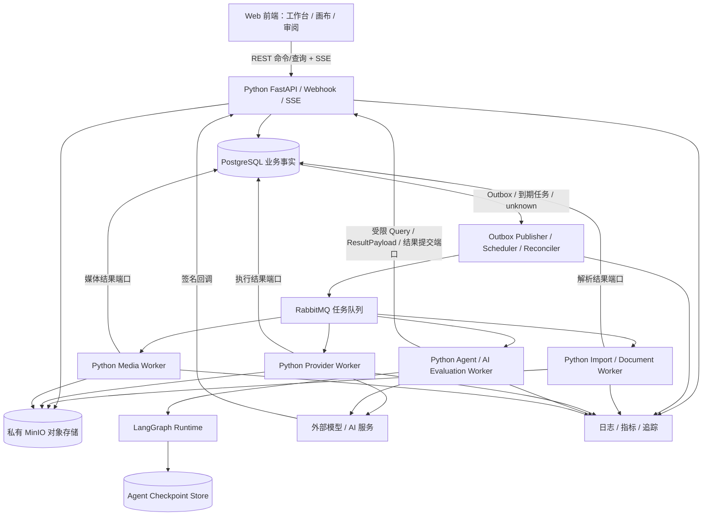
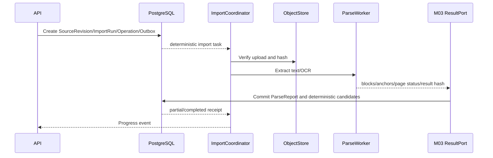

# AI 视频生产平台目标系统架构设计

> 状态：前后端分离、MVVC、Python 主栈、MinIO、最终 Schema 与工程目录目标架构 v9，待容量基线与研发评审
> 日期：2026-08-22
> 需求基线：[000-AI 视频生产平台目标需求总览](../requirement/000-AI视频生产平台目标需求总览.md)
> 对应产品设计：[002-AI视频生产平台目标产品与功能模块设计](002-AI视频生产平台目标产品与功能模块设计.md)
> 数据与实现细化：[001-AI视频生产平台核心领域与数据模型设计](001-AI视频生产平台核心领域与数据模型设计.md)、[003-AI视频生产平台接口工作流与功能实现设计](003-AI视频生产平台接口工作流与功能实现设计.md)
> 服务与模块映射：[005-AI视频生产平台服务与模块实施基线](005-AI视频生产平台服务与模块实施基线.md)
> 设计方式：从目标系统重新设计，不把历史技术架构、代码结构或服务边界当作前提；关键选型先核验官方资料与活跃开源实现
> 范围：系统本身；不包含定价、收费、订阅、支付、增长或其他商业计划

## 1. 评估结论

**已选目标架构采用前后端分离：`frontend/` 使用 TypeScript、Next.js 与 React，`backend/` 使用 Python、FastAPI 与独立 Python Worker，对象存储唯一实现固定为私有 MinIO。Python 应用层拥有唯一领域规则和事务；目标态的 Agent、Provider 和媒体任务不在 API 进程执行。首期不引入 Java/Go 业务服务、AWS S3 adapter 或跨语言领域契约；Go 只在容量证据满足 §3.4 Gate 后重新评估。**

目标系统保持“一套语言、一个业务模型、多个独立进程角色”：API 只做短请求和短事务；调度/对账、不可信文档解析、Agent、外部 Provider 和 FFmpeg 分别在受限 Worker 中运行。进程可以独立扩缩和失败隔离，但首期仍是模块化单体，不按领域拆微服务。

| 候选 | 技术可行性 | 对当前负载的有效收益 | 主要代价 | 当前决策 |
| --- | --- | --- | --- | --- |
| Python 业务 + Python Agent | 高 | I/O 并发、AI 生态、单一契约和快速迭代 | 需要严格进程隔离、类型和容量治理 | **主路径** |
| Go 业务 + Python Agent | 高 | 高并发控制面可获得更低资源占用和清晰二进制部署 | 重写、双工具链、跨语言契约和故障定位 | 延后；指标触发后 PoC |
| Java 业务 + Python Agent | 高 | 适合已有 JVM 平台和大型 Java 团队 | JVM 与双栈成本，当前无组织前提 | 不采用 |

已选目标边界：

- Python 是唯一后端业务主栈：HTTP API、Webhook、鉴权、领域规则、事务、查询、事件和任务协调均复用同一应用端口。
- LangGraph 是受限 Agent Runtime，只编排一次 AgentRun 内部的推理、只读 Tool 和提案节点；不能成为第二套业务工作流或审批事实源。
- API 进程不执行模型调用、长轮询、FFmpeg、文档解析或质量检测；这些工作通过事务 Outbox 和队列交给独立 Worker。
- PostgreSQL 保存业务事实和用户可见 `Operation`；私有 MinIO 保存来源、媒体、Agent 大载荷与交付对象；RabbitMQ 承担至少一次任务投递。MinIO 暴露 S3-compatible API 只是协议事实，不表示支持 AWS S3 或任意对象存储替换。首期用数据库状态机、调度器和对账器恢复长任务。
- Temporal 不作为首期前置依赖。只有数据库状态机出现大量长定时器、复杂信号/人工等待或升级恢复负担，并通过独立 ADR/PoC 后，才可用 Temporal Python SDK 替换某一类流程的调度实现。
- Agent Worker 不直接执行高风险领域命令。它只读取授权上下文并返回版本化 `AgentRunResult`/`AgentProposal`；接受提案时仍由应用命令处理器重新鉴权、校验基线和提交。
- 浏览器端使用 TypeScript/Next.js/React；Next Route Handler 或 Server Action 只能作为薄传输代理，不形成第二套业务后端。
- Redis 承载 M01 登录刷新会话、注册验证码与高成本请求门禁，也可承载限流、短期缓存和 SSE fan-out；它不保存项目、任务、审批或交付等权威业务事实，丢失时必须 fail closed 或要求重新认证。

语言统一不等于权限统一。业务 Worker 可以通过受约束应用端口提交任务结果；Agent/Evaluation Worker 使用独立服务身份，不能任意写业务表。所有进程共享同一当前 Python 契约包，但各自只获得完成职责所需的数据库、队列、对象和网络权限。

## 2. 架构目标与非目标

### 2.1 目标

1. **业务事实明确**：每个对象只有一个权威模块，版本、选择、审批和交付可追溯。
2. **长流程可恢复**：进程重启、网络超时、回调丢失和人工等待后能继续，而不是重新开始。
3. **外部副作用安全**：幂等、对账、限流、熔断和未知状态防止重复调用。
4. **媒体与元数据分离**：大文件不进入数据库和工作流历史。
5. **租户隔离**：认证、授权、查询、对象存储和审计共同执行工作区隔离。
6. **渐进扩缩**：API、提供商调用、媒体处理和质量检测能独立扩缩。
7. **可观测**：一次用户命令可追踪到工作流、外部尝试、媒体和资源消耗。
8. **可测试**：领域规则不依赖 Web 框架、数据库或提供商 SDK 才能运行测试。
9. **单一运行语义**：计划、运行、结果和交付分别建模，不用一个“大状态机”同时表示四种含义。

### 2.2 非目标

- 首期多区域主动—主动部署。
- 首期事件溯源数据库或全局 CQRS。
- 首期 Kubernetes 必选。
- 首期按领域拆微服务、服务网格，或并行维护两套业务后端。
- 在数据库中保存视频、图像或大型提示上下文。
- 用消息队列代替业务状态机。
- 让 LLM 直接访问生产数据库或对象存储凭据。
- 实现客户计费、套餐、发票或支付系统。

### 2.3 单一目标契约原则

系统在每个发布单元内只存在一套权威数据库 Schema、HTTP 契约、消息契约和 canonical MinIO key：

- 空业务库由最终 ORM Metadata 初始化；非空库只有与该 Metadata 严格一致才可启动。
- 公开 HTTP 只使用 `/api`，前端生成客户端与后端 OpenAPI 在同一发布单元内保持一致。
- 消息只接受当前 `schema_version + contract_hash`；不匹配的消息进入 dead-letter 和人工处置。
- 对象只写 canonical key，并以 `StorageObjectRef` 的精确 version、size 和 SHA-256 校验。
- 剧本换版、模板更新、审阅快照和媒体位置恢复属于产品版本行为，必须以不可变 Revision、显式 current pointer 或 lineage 表达。

### 2.4 开源调研 Gate

新增框架、基础设施、生产进程、顶层目录或跨模块抽象前，Design 必须先记录：待解决问题、官方资料、至少一个活跃且相近的开源实现、可直接采用的最小模式、明确拒绝的部分和本项目证据。开源项目只提供事实样本，不自动成为本项目需求；没有当前用例、owner 和验收的能力不得进入目录或依赖。

## 3. 为什么采用 Python 单栈、多进程角色

| 维度 | 权威业务进程 | 专用 Worker | 边界判断 |
| --- | --- | --- | --- |
| 领域规则与事务 | FastAPI/API 与应用命令处理器 | 只能调用公开应用端口提交结果 | 一套领域实现 |
| API、Webhook、SSE | API/Webhook 进程 | 不暴露第二套产品 API | 单一公网入口 |
| 长操作 | PostgreSQL Operation/Job 状态机、Outbox、调度和对账 | 执行幂等任务并报告证据 | 产品状态只在 PostgreSQL |
| Agent 推理与规划 | 创建 AgentRun、准备最小上下文、接受提案 | LangGraph 节点、模型、Tool、checkpoint | Agent 只生成提案 |
| 文档/多模态/评估 | 授权、任务、版本和结果登记 | Python AI/CV/音频生态计算 | 结果经应用端口入库 |
| 托管 Provider | execution 模块拥有 Job/Attempt/unknown | Provider Worker 提交、查询、取消和下载 | 适配器不拥有业务状态 |
| FFmpeg | media/delivery 模块拥有 Artifact/RenderRun | Media Worker 监督隔离外部进程 | FFmpeg 不进入 API |
| 可观测与安全 | 统一身份、审计、Operation 和 Trace 根 | 传播 Trace、使用最小服务身份 | 进程权限不同 |

系统瓶颈预期主要来自数据库、对象存储、外部模型、媒体进程和队列等待。语言切换不能缩短这些外部耗时；应先用异步 I/O、队列背压、独立进程和水平扩容解决。只有性能剖析确认 Python 运行时本身是持续瓶颈，Go 才进入决策。

### 3.1 Python 业务主栈约束

- 选择处于官方支持窗口且关键依赖组合通过验证的 Python 版本；依赖固定并生成可复现锁文件。
- 使用严格类型检查；领域值对象、命令、事件和任务载荷禁止无约束 `dict[str, Any]` 穿透模块。
- 领域包不依赖 FastAPI、SQLAlchemy、RabbitMQ、对象存储或厂商 SDK；入口和适配器依赖应用端口。
- 业务数据库写入只能通过应用端口和短事务；Worker 不直接拼接跨模块 SQL。
- 公共 HTTP 契约以 OpenAPI 为事实源；内部任务契约使用当前 Pydantic/JSON Schema 与固定 hash，禁止 API Schema、队列 Schema 和 Agent State 相互冒充。
- 所有并发必须受队列 prefetch、连接池、提供商限流、进程资源和工作区公平策略约束；`asyncio.create_task` 不能代替容量设计。
- API、调度/对账、Import/Document Worker、Provider Worker、Agent/Evaluation Worker 和 Media Worker 使用独立入口点；生产环境不由同一进程共同监督，避免任一 Worker 故障终止公网 API。Import 与 Provider 可以复用镜像依赖，但必须使用不同入口、队列、服务身份和网络策略。

### 3.2 Python Agent Runtime 约束

- LangGraph State 只包含 AgentRun 所需的小型状态、版本引用和 Tool 结果引用；来源全文和媒体不复制进 checkpoint。
- checkpoint 是 Agent 运行恢复事实，不是镜头、计划、Operation、审批或交付事实；产品查询不从 checkpoint 推断完成或 current。
- 产品级人工审批由业务命令和 Operation 表达。LangGraph `interrupt` 只用于 Agent Run 内部受控暂停，不维护第二套批准状态。
- Agent Worker 通过受限 Query/Tool 端口读取上下文，只能返回 `AgentProgress`、`AgentRunResult` 和 `AgentProposal`；自由文本不能直接执行。
- LLM 输出先通过当前 Pydantic/JSON Schema、对象数量上限和命令白名单校验，再保存为提案。

### 3.3 进程间契约

进程虽同为 Python，也必须通过当前任务契约交接，不能传 ORM 实体、LangGraph State 或内存对象。契约至少包含：

- `AgentRunRequest`：run、workspace/project、统一 initiator principal、可选 actor 与执行 service identity、scope、Skill/stage/stage generation、可选 parent workflow/root Operation、该 Run Operation、只读基线 snapshot ref/hash、允许工具、允许目标 Command Schema descriptor set/hash、资源上限、graph/input/result contract hash、trace 和请求幂等键/hash；request hash 覆盖除 trace/时间外全部不可变语义字段。
- `AgentRunResult`：run/stage generation、sequence、状态、提案项/Advisory、证据引用、用量、模型/工具清单、可恢复错误、result hash 和输出 contract hash；大型 payload 先经 M06 run/item-scoped ResultPort 暂存，只在信封中传不可变 ref/hash。
- `AgentProgress`：`run_id + sequence`、阶段、百分比、摘要和可选 Artifact 引用；应用端按序号幂等接收。
- `TaskEnvelope`：task、attempt、workspace、kind、schema version、idempotency key、payload reference 和 trace context。
- `TaskError`：稳定错误码、retryable、certainty、policy reason 和安全摘要；异常文本不作为状态机输入。

生产者与消费者必须在同一发布单元使用同一个 Contract hash；未知字段、未知枚举和非当前 `schema_version` 均拒绝并进入 dead-letter/人工处置。CI 对生产者与消费者执行同版本 golden contract tests。大型输入输出只传对象或业务引用，不进入消息载荷。

### 3.4 Go 重新评估 Gate

Go 不进入首期目录、CI 和部署。只有同时满足以下条件，才创建一个窄边界纵向 PoC：

1. 在真实目标负载下，Python API 连续无法满足 §13.3 SLO，且已完成查询/索引、连接池、阻塞 I/O、序列化、多进程和水平扩容优化。
2. Trace、CPU 与内存剖析证明主要瓶颈位于 Python 控制面，而不是 PostgreSQL、队列、对象存储、外部模型或 FFmpeg。
3. 选择稳定、无 Agent 依赖的窄切片；Go PoC 在同一数据、同一接口和同一 SLO 下证明显著吞吐或资源收益，并计算双语言长期运维成本。
4. 团队具有明确 Go 长期所有者，并接受两套升级、安全扫描、镜像、告警和故障处理责任。
5. 任一候选边界始终只有一个业务事实所有者，禁止 Python/Go 同时实现同一聚合写入。

任一条件缺失即继续优化 Python，不以“未来可能更大”为依据预建 Go 服务。即使 Gate 通过，也优先评估无状态 Webhook/SSE 网关或资源敏感接入层，不默认重写领域与事务层。

### 3.5 切片 B 必须通过的 Python/Agent 架构 Gate

切片 A 先完成不依赖 Agent 的手工剧本分析主线；启用切片 B 前，再用同一份整本剧本验证三个连续 Run：“Breakdown Run 提出拆集 → M03 批准 Manifest → M02 物化稳定 ContentUnit/Order → Narrative Run 提出场景/Mention → M03 批准 NarrativeRevision → Knowledge Run 提出人物消歧/生产需求 → M04 确定性重建人物出场集数与清单”闭环：

1. FastAPI/M03 Application Service 在短事务中创建根 `AnalysisRun`、root `Operation`、`AnalysisStage(stage_generation=1)` 与 `narrative.analysis_stage.requested` Outbox；API 不直接创建 AgentRun。
2. M06 幂等消费 stage request，创建该 stage 的 `AgentRun` 和挂到 root 的 child Operation，冻结输入/结果契约与允许 Command Schema set，再由 Outbox Publisher 把版本化 `AgentRunRequest` 投递到专用 Agent 队列；`agent.run.created/result_committed` 回到 M03 Inbox。
3. `stage=breakdown` 只读取 SourceRevision，并由 M06 保存一个承载 M03 `CreateEpisodeBreakdownDraft` 的自包含 AgentProposalItem；用户接受后仍需在 M03 批准 `EpisodeBreakdownManifest`，再由 M02 原子物化 ContentUnit/OrderRevision，M03 接收不可变 temporary key→ContentUnit mapping。
4. M03 先执行 `StartNarrativeDraftImport` 创建私有 building revision；新的 `stage=narrative` Run 冻结 Source、approved Manifest、mapping 和 Order，按稳定 ContentUnit 提取场景、节拍与 Mention，并由 M06 为每个 ContentUnit 保存一个承载 M03 `ApplyNarrativeContentUnitDraft` 的自包含 AgentProposalItem。各 item 只 CAS 对应 ContentUnit slot；全部成功应用或人工补齐且整本覆盖校验通过后，M03 执行 `FinalizeNarrativeDraftImport` 切换为可见 draft，用户仍需独立校对和批准 NarrativeRevision。
5. 新的 `stage=knowledge` Run 冻结 approved Narrative、Order 与现有 M04 只读复现快照，只提交承载 M04 `ResolveMentionGroup` 或 `DecideCoverageWithRequirements` 的自包含 AgentProposalItem；每项只携带其实际依赖的 Mention/group/entity 或 coverage subject 基线，目标 Service 重算 read/write set 并做细粒度 CAS，不因同一 Run 中不相交项先被接受而过期。用户接受后由 M04 Service 确定性重建 EntityOccurrence、Inventory 和 Readiness 投影。Agent Worker 不参与业务提交，也不直接提出 current 投影。

验收覆盖：Agent 节点前后进程终止、消息重复、结果重复、模型返回非法 Schema、部分分片失败、同名人物歧义、未知不等于缺席、取消、工作区越权、过期基线、Trace 连贯和不可恢复失败。重复 Proposal/命令副作用必须为 0；没有 Agent 时，用户仍可通过相同 M03/M04 Command 手工完成拆集、人物、出场矩阵与生产需求分析。

## 4. 技术栈

| 层 | 选择 | 责任 |
| --- | --- | --- |
| Web 前端 | Node.js 22、TypeScript 5 strict、Next.js 16 App Router、React 19、Tailwind CSS 4、Radix/shadcn | 工作台、表格、审阅、画布、SSE 状态展示；不保存权威业务事实 |
| 前端数据访问 | OpenAPI 生成客户端、Axios、Redux Toolkit/RTK Query | REST 命令/查询、服务端状态缓存和失效；不手写重复后端类型 |
| HTTP API | Python 3.11 当前验证基线、FastAPI、Uvicorn、OpenAPI | 命令/查询入口、Schema、鉴权、Webhook、SSE |
| 领域与应用层 | Python、Plain Python Object、严格类型、显式 Service/Port | 聚合规则、命令、查询、权限和不变量 |
| 数据访问 | SQLAlchemy Async/显式 SQL + 最终 ORM Metadata | 查询、事务、空库初始化和严格 Schema 校验；领域层不依赖 ORM 类型 |
| 权威数据 | PostgreSQL | 业务事实、版本、任务索引、用量账本、审计 |
| 首期耐久执行 | PostgreSQL 状态机 + Outbox + RabbitMQ + Scheduler/Reconciler | 至少一次投递、定时恢复、外部对账和人工等待投影 |
| Agent Runtime | Python、LangGraph、严格类型 | Agent 内部推理图、工具调用、checkpoint、结构化提案 |
| 进程间契约 | Pydantic + 当前 JSON Schema/hash | API、Outbox、队列与 Worker 的同发布单元契约；不读取旧载荷 |
| 媒体 | Python 进程监督 + FFmpeg/ffprobe 隔离 Worker | 探测、代理、关键帧、转码、装配和校验 |
| 对象存储 | 私有 MinIO + MinIO Python SDK；S3-compatible API 仅作为访问协议 | 原件、代理、候选、Agent 大载荷、导出与隔离区；不建设 AWS S3 adapter 或多存储 Provider 工厂 |
| 可观测 | OpenTelemetry + 指标/日志/追踪后端 | 跨 API、任务、Worker 和提供商关联 |
| 运行态与缓存 | Redis | M01 刷新会话/一次性验证、高成本请求门禁、限流、短期缓存和临时在线状态；非权威业务事实 |
| 可选工作流引擎 | Temporal Python SDK，需 ADR/PoC | 只替换已证明复杂的耐久调度，不替换业务事实 |

FastAPI/asyncio 处理 API、数据库、对象存储和外部模型等 I/O 并发；多进程或多副本利用多核。FFmpeg、OCR、本地模型等 CPU/GPU/内存密集任务在独立 Worker/容器中运行。LangGraph checkpoint 只恢复 Agent 内部图，不替代业务 Operation、Job、审批或对账。

可复现版本由 `backend/pyproject.toml`、`backend/requirements*.txt`、`frontend/package.json`、`frontend/package-lock.json`、Dockerfile 和 CI 锁定，Design 只固定技术边界。生产发布前必须用完整依赖、类型检查、契约、性能和故障恢复测试签认 Python 运行时；运行时升级独立于领域功能切片评审。

## 5. 总体架构



### 5.1 进程职责

| 进程组 | 可以做 | 不可以做 | 扩缩依据 |
| --- | --- | --- | --- |
| API/Webhook/SSE | 鉴权、校验、短事务、查询、回调验签、创建 Operation/Outbox | FFmpeg、长轮询、模型生成、Agent 推理 | 请求率、延迟、连接数 |
| Outbox Publisher | 领取并发布 Outbox、记录发布结果 | 修改业务聚合、执行外部调用 | Outbox 滞后、发布速率 |
| Scheduler/Reconciler | 扫描到期任务、unknown 和缺失回调，提交公开恢复命令 | 猜测外部成功、绕过状态机改表 | 到期量、对账延迟 |
| Import/Document Worker | 解包、DOCX/Markdown/TXT 解析、结构提取和受限 OCR（Gate 后） | 公网外呼、读取 Provider/KMS 凭据、保存任意业务 current | 导入队列、CPU/内存、文档大小 |
| Provider Worker | 能力探测、厂商提交/查询/取消、结果下载并提交证据 | 解析不可信文档、自动重试 unknown、自动批准或选择 | Provider 队列、配额、allowlist 网络 |
| Agent/Evaluation Worker | LangGraph 推理、只读 Tool、结构化提案、受限 ResultPayload 流式提交、AI 评估和 checkpoint | 产品审批、高风险命令、任意业务表写入、通用对象存储凭据 | 模型延迟、Token、Agent 队列、GPU |
| Media Worker | 探测、转码、装配和确定性技术校验 | 自动选择、删除候选、改变审批事实 | CPU、内存、磁盘 |

首期可以让 Outbox Publisher 与 Scheduler/Reconciler 共用一个部署单元；Import、Provider 和 Agent 可以复用基础镜像，但不能共用进程、队列、服务身份或网络策略。API、后台任务与 Media Worker 也不能共用生产生命周期。是否拆镜像由依赖和资源隔离决定，不由领域模块数量决定。

### 5.2 启动依赖顺序

1. PostgreSQL、MinIO、RabbitMQ 和 Redis 先通过健康检查；MinIO 还必须通过私有桶策略、versioning 与 lifecycle 配置校验。M01 会话和注册验证依赖 Redis，Redis 不可用时相关入口 fail closed。
2. 单次 Schema Initialization Job 获取数据库锁：仅空库按最终 ORM Metadata 建表，非空库只做严格一致性校验；普通服务只执行 Schema readiness，不创建、修改或兼容旧结构。
3. 已进入当前切片的 API、Operation、Import、Provider、Agent/Evaluation、Media 入口在依赖健康后可并行启动，不形成“必须先启动 API 才能启动 Worker”的隐式顺序；Provider 到 C、Agent 到 B 才启用。
4. 前端在 API readiness 通过后对外；外部 Webhook 路由在数据库和回调去重表可用后才 ready。

某个 Worker 不健康只暂停对应新任务并暴露队列积压，不应终止 API。数据库不可用时所有写入口失败关闭；RabbitMQ 不可用时 API 仍可提交业务事实和 Outbox，但 Operation 显示排队/基础设施阻塞，恢复后继续发布。

### 5.3 单次任务的权威执行顺序

```text
API 鉴权/预检
  → PostgreSQL 短事务提交业务事实 + Operation + Outbox
  → Outbox Publisher 投递版本化 TaskEnvelope
  → Worker 按 task_id/attempt_id 幂等领取
  → 调用 Agent / Provider / FFmpeg / 对象存储
  → 通过应用结果端口提交证据、Job/Attempt、Candidate/Artifact
  → Outbox 产生状态事件
  → SSE/查询展示 PostgreSQL 权威状态
```

事务提交前禁止调用外部服务；消息投递成功不代表业务成功；Worker 崩溃后允许重复投递但不允许重复副作用。

### 5.4 逻辑模块与运行服务映射

逻辑模块决定事实和规则的所有权；运行服务决定执行位置和故障边界。目标拓扑收敛为六类安全隔离入口，不按 M01—M15 建十五个服务：

| 生产进程角色 | 主要逻辑模块 | 进入方式 | 权威写入与降级 |
| --- | --- | --- | --- |
| `api` | M01—M15 的 HTTP/Webhook/SSE 与应用命令 | 用户、集成或已验签回调 | 只提交短事务、Operation 和 Outbox；Worker 不可用时继续展示已提交事实与阻塞 |
| `operation-worker` | M08 拥有通用 Operation/Task/恢复；M01—M15 按需通过该端口提交长操作、定时、投影或投递意图 | Outbox、到期扫描和公开恢复命令 | 专属 Worker 只提交各自模块结果；统一通过 M08 Operation 端口推进、投影和恢复；unknown 进入 ReconciliationCase，不直接改表或猜测成功 |
| `import-worker` | M03 文档导入/解析 | 版本化 Import TaskEnvelope | 无默认公网外呼、无 Provider/KMS 凭据；解析结果只经受限端口提交 |
| `provider-worker` | M07 编译/能力、M08 Provider、M09 结果下载 | 版本化 Provider TaskEnvelope | 仅 allowlist 外网和按连接读取 KMS；不解析不可信文档；关闭时 A 的 Fixture 链路仍可用 |
| `agent-worker` | M06 AgentRun、M10 AI Evaluation | 受限 Run/Evaluation Task | 只读 Tool + 结构化结果端口；不可接受 Proposal、主选、批准风险或交付 |
| `media-worker` | M05 Animatic 派生/构建、M09 媒体、M10 确定性检查、M13 装配/渲染 | 媒体/Render Task | M05 仍拥有 Animatic 业务事实；Worker 只提交 Artifact/Evaluation/Render 证据，不可替用户选择或批准 |

`operation-worker` 内可以共置 Outbox Publisher、Scheduler 和 Reconciler，但三者仍使用独立 lease、指标和错误语义。通知/Webhook 投递先作为 Outbox 消费适配器，不单独预建通知微服务。是否共用容器镜像由依赖与资源隔离决定，不改变这六类入口的最小权限和故障边界。

详细的基础设施、外部 Provider Gate、模块运行映射和切片启用顺序以 [005](005-AI视频生产平台服务与模块实施基线.md) 为准。

## 6. 前后端工程边界与模块化单体

仓库采用前后端分离，但只保留一个权威业务后端。`frontend/` 负责浏览器交互和视图状态，`backend/` 负责领域事实、事务、异步任务和 Agent 运行。前后端通过 OpenAPI/HTTP 与 SSE 协作；后端进程间通过同一发布单元的当前任务契约协作。前后端不共享源码模型，也不在 Next.js 中复制 Python 业务规则。

### 6.1 仓库根目录责任

```text
Lanverse/
  frontend/                    # TypeScript / Next.js / React 浏览器应用，独立构建与测试
  backend/                     # Python / FastAPI 模块化单体与六类生产入口（1 API + 5 Worker）
  docs/                        # 正式产品与研发文档；只允许以下五类
    README.md                  # 仅导航到五类文档，不承载第六类事实
    prd/
    requirement/
    design/
      modules/                 # M01—M15 模块详细 Design
    plan/
    acceptance/
  docker-compose.yml           # 本地 PostgreSQL/Redis/RabbitMQ/MinIO 与应用编排
  docker-compose.prod.yml      # 生产覆盖；不暴露内部基础设施端口
  .env.example                 # 非敏感本地配置键示例
  .env.production.example      # 非敏感生产配置键示例
  .editorconfig
  .gitignore                   # 统一忽略 secret、依赖、构建、缓存、卷与导出产物
  .dockerignore
  README.md                    # 仓库入口、启动和验证命令；不重复业务设计
  AGENTS.md                    # 长期协作规则；不得写业务需求或架构事实
  LICENSE
```

根目录只放跨工程入口和部署配置，不放业务源码、临时脚本、导出产物或新的文档分类；不得新增第二套 Web、脚本业务后端或通用 `shared/`。`.codex/` 等本地协作配置不是产品架构或运行依赖。前后端共享的事实是已发布的 OpenAPI/JSON Schema，不是复制粘贴的 TypeScript/Python 类。依赖版本由 `frontend/package.json`、`backend/pyproject.toml`、锁文件、Dockerfile 和 CI 共同固定；Design 只规定能力边界，不在正文维护易过期的补丁版本清单。

根目录中的 `.env`、数据库卷、MinIO 数据卷、`node_modules`、`.next`、`.venv`、缓存、覆盖率、日志和导出文件全部属于本地产物，必须被忽略且不得提交。示例配置只能给出键名、用途和安全默认值，不能包含真实凭据。

### 6.2 MVVC 架构风格

本项目中 MVVC 是 **Model–View–ViewModel–Controller** 的固定缩写，不再与 MVC 或 MVVM 混称。MVVC 跨越前后端但不共享源码模型：

| 角色 | 目标位置 | 唯一责任 | 明确禁止 |
| --- | --- | --- | --- |
| Model | `backend/app/modules/<module>/domain` 与所有者的 persistence adapter | Plain Object 领域状态、不变量、Revision/Decision/Projection 事实 | React 状态、FastAPI/Pydantic、SQLAlchemy I/O 混入领域对象 |
| View | `frontend/src/features/<feature>/views\|components` | 渲染 ViewModel，提交用户意图，展示 loading/empty/error/recovery | 拼 API 响应、判断批准规则、直接操作缓存 |
| ViewModel | `frontend/src/features/<feature>/view-models` | 将生成 API Contract 映射为页面状态和用户动作，组合 URL/本地草稿/RTK Query | 复制后端领域 Model、预测服务器完成、越过 Controller |
| Controller | `backend/app/modules/<module>/transport/http/controllers` | 解析 HTTP/Header/身份，转换 Command/Query，调用一个 Application Service，通过 Presenter 返回 | 直接调 Repository/ORM/MinIO/Agent，开业务事务，编写领域规则 |

Application Service 不是 MVVC 的第五种 UI 角色，而是 Controller 和 Model 之间的用例边界。它统一执行鉴权、幂等、CAS、短事务、Outbox 与跨模块端口协调；Controller 只做协议适配。标准调用链为：

```text
View → ViewModel → OpenAPI Client → Controller
     → Application Service → Model/Domain Service → Port → Adapter
     → Result Plain Object → Presenter → ViewModel → View
```

### 6.3 前端目标结构与状态所有权

前端目标栈使用 Next.js App Router、React、严格 TypeScript、Tailwind、Radix/shadcn、RTK Query、OpenAPI 生成客户端、Vitest 和 Playwright，不引入 Python 浏览器框架或第二套服务端状态库。

```text
frontend/
  public/
    brand/                     # 品牌静态资源
    assets/                    # 可公开、无需鉴权的构建期静态资源
  src/
    app/                       # Next.js route/page/layout/loading/error；只做路由与页面组合
      (public)/                # 登录、注册和公开错误页
      (workspace)/             # 登录后的项目、Studio、治理和设置页面
      api/                     # 仅经评审的薄 BFF/流式代理；不得写领域规则
      layout.tsx
      providers.tsx
      globals.css
    api/                       # OpenAPI 生成代码；生成器唯一写入，人工禁止编辑
    features/
      identity/                # 登录、成员与工作区能力
      projects/                # 项目、ContentUnit 与顺序
      script-analysis/         # 来源、拆集、叙事、场景、人物与资产分析
        views/                 # 页面/面板级 View；只消费 ViewModel
        components/            # 本 Feature 的纯展示组件
        view-models/
          use-analysis-overview-view-model.ts
          use-episode-breakdown-view-model.ts
          mappers.ts           # API Contract → ViewModel 纯映射
        model/
          view-types.ts        # 仅前端显示/表单类型；不复制 API 生成类型
          form-schemas.ts      # 用户输入的即时反馈，不充当领域规则
        server-state.ts        # 向 base API 注入本功能 endpoints
        state.ts               # 仅在确需跨面板恢复未提交草稿时创建
      episode-planning/
      production-knowledge/
      storyboards/
      media/
      operations/              # REST + SSE 长操作、错误与恢复动作
      agent-runs/
      generation/
      quality/
      review/
      delivery/
      governance/
      canvas/                  # F：完整关系画布；此前不创建
      integrations/
    components/
      ui/                      # 无业务事实的基础组件
      layout/                  # 导航与页面框架
      system/                  # 全局 loading/error/empty/permission 状态
    hooks/                     # 只放跨 Feature 的技术 Hook
    lib/
      request.ts               # HTTP、错误与 trace 基础设施
      auth-session.ts          # 浏览器会话适配
      server-state/
        base-api.ts            # 唯一 RTK Query baseApi、tag 与通用中间件
        errors.ts              # 稳定错误码 → 展示/恢复动作映射
        operation-stream.ts    # SSE cursor + REST revision 回补
  tests/
    architecture/              # Feature 边界、生成代码只读、循环依赖
    unit/                      # 纯组件、Hook、ViewModel 与 mapper
    integration/               # 页面组合与 API mock contract
    e2e/                       # Playwright 用户闭环
    fixtures/                  # 去敏固定输入/输出
    support/                   # 测试专用构造器，不进入生产 bundle
  package.json
  package-lock.json
  tsconfig.json
  next.config.ts
  openapi2ts.config.ts
  vitest.config.ts
  playwright.config.ts
  Dockerfile
```

该树是实施前冻结的目标边界，不授权一次性搬迁。上面列出的 Feature 名是保留责任名；只有某个纵向切片产生第一个真实页面、逻辑和测试时才创建对应目录，禁止先生成空目录、占位组件或聚合所有实现的 `index.ts` barrel。人工维护的一般前端目录和文件使用 `kebab-case`，React 导出组件使用 `PascalCase`，ViewModel Hook 使用 `use-*-view-model.ts`；`src/api` 生成文件名遵循唯一生成器配置，Next.js `[projectId]` 等动态路由参数遵循框架契约，架构测试不得机械改名或阻断这两类只读/框架路径。跨 Feature 只能依赖 `src/api` 生成契约、`components/ui|layout|system` 和 `lib` 技术基础，不能导入另一个 Feature 的 View、ViewModel、state 或 mapper。

| 状态类型 | 权威位置 | 规则 |
| --- | --- | --- |
| 项目、剧集、人物、资产、AgentRun、Operation | 后端 API + RTK Query 缓存 | 缓存可丢失；刷新后必须从后端恢复，不创建重复 Redux 副本 |
| 可分享的筛选、选中范围和分页 | URL | 前进/后退、刷新和复制链接保持语义 |
| 弹窗、折叠、临时表单交互 | 组件本地状态 | 离开页面可以丢弃，除非产品明确要求恢复 |
| 跨面板且需恢复的未提交草稿 | 命名 Redux slice | 必须有明确 owner、清理时机和版本，不能保存服务器事实镜像 |
| 长操作进度 | SSE 事件 + REST 快照回补 | SSE 断开后按 Operation revision 回源，不从定时器猜测完成 |

`app/` 页面只组合 Feature 和布局。Next Route Handler/Server Action 只有在隐藏同源凭据、聚合浏览器传输或流式代理确有需要时使用，并保持无领域状态的薄 BFF；所有权限、不变量、幂等和数据库写入仍在 Python Service 中完成。

### 6.4 后端目标结构与命名

后端是一套 Python 包和数据库 Schema，可由同一构建产物启动六个独立生产入口；一次性维护命令与生产入口分开，不计为第七类服务：

```text
backend/
  app/
    entrypoints/
      api.py                   # A：HTTP、Webhook、SSE
      operation_worker.py      # A：Outbox、Scheduler、Reconciler
      import_worker.py         # A：不可信来源解析
      media_worker.py          # A：MinIO transfer/probe/FFmpeg/渲染
      agent_worker.py          # B：Agent/Evaluation
      provider_worker.py       # C：外部生成 Provider
      maintenance/
        cache_admin.py         # 受控一次性运维 CLI；非常驻服务、无领域写权限
    bootstrap/
      wiring.py                # composition root；装配端口与 adapter，不做 Service Locator
      model_registry.py        # 显式注册 ORM metadata；不在 import 时隐式建表
    core/
      config.py                # 类型化配置；不读取业务数据
      identity_context.py      # actor/service/workspace 上下文
      transaction.py           # UnitOfWork/事务接口
      errors.py                # 稳定平台错误信封
      observability.py         # trace/log/metric 公共接口
    contracts/
      tasks/                       # TaskEnvelope/TaskError；schema_version 在信封内
      events/                      # 通用事件信封；业务 payload 仍归发布模块
      agent/                       # AgentRunRequest/Result/Progress 进程契约
    modules/
      identity/                # M01
      projects/                # M02
      narrative/               # M03
      production_knowledge/    # M04
      shots/                   # M05
      agents/                  # M06：AgentRun、Proposal 与人工决定业务事实
      generation_planning/     # M07
      execution/               # M08
      media/                   # M09
      quality/                 # M10
      usage/                   # M11
      review/                  # M12
      delivery/                # M13
      governance/              # M14
      extensions/              # M15；与技术 integration adapter 不混同
    agent_runtime/             # 通用 Harness 与具体 Skill；不拥有领域事实
      ports.py                 # Model/Checkpoint/QueryTool/ResultPort Protocol
      harness/
        contracts.py
        runner.py
        policies.py
        checkpoint.py
      tools/                   # 只读 Tool；只能调用 QueryToolPort
        source_snapshot.py
        narrative_analysis_view.py
        knowledge_snapshot.py
      skills/
        script_analysis/
          definition.py
          contracts.py
          state.py
          graph.py
          nodes/
          prompts/
    infrastructure/
      database/                # engine/session/UoW/RLS/Outbox/Inbox/health/final schema
      messaging/               # RabbitMQ publisher/consumer/DLQ
      object_storage/
        minio.py               # 唯一生产对象存储 adapter；MinIO Python SDK
        key_policy.py          # 服务端 key、prefix、大小与签名策略
        provisioning.py        # 私有桶、versioning、lifecycle 与健康校验
        download_gateway.py    # E：逐请求鉴权后的反向代理交接；不生成长效 bearer URL
      cache/                   # Redis session/rate-limit/cache adapter
      secrets/                 # Secret/KMS resolver；业务库只存 ref
      observability/           # OpenTelemetry exporter 与运行 adapter
      agent_runtime/           # Port 技术实现；B 才创建
        checkpoint_store.py
        query_tool_client.py
        result_port_client.py
      providers/
        agent_models/          # B：模型 Provider adapter
        generation/            # C：图像/视频 Provider adapter
        notifications/         # E/F：通知 adapter
  tests/
    unit/                      # 纯内存 Domain/Application 测试
    property/                  # 状态机/值对象性质测试
    integration/              # PostgreSQL/RabbitMQ/MinIO/Redis 真实边界
      database/               # 空库初始化、非空漂移拒绝、RLS
    contract/
      http/
      events/
      tasks/
      agent/                   # B
      providers/               # C
    architecture/             # import、ORM、Agent、生成物和循环依赖
    durability/               # 重复、乱序、lease、unknown、恢复
    journeys/                 # 跨模块用户闭环
    performance/
    fixtures/
    support/
  pyproject.toml
  requirements.txt
  requirements-dev.txt
  Dockerfile
```

Python 包和文件统一 `snake_case`。任一 Worker 退出不应终止公网 API。每个生产入口具有独立健康检查、队列、服务身份、网络策略和资源限制。

该目录表达最终责任边界，但不要求每个逻辑模块成为部署单元。实现按可验收纵向切片进行；只有切片需要且同时交付真实用例、测试和依赖检查的目录才可创建，禁止预建空 Repository、空 Service、转发层或未来微服务目录。

目录责任与依赖必须在首个业务实现前冻结：

| 路径 | 唯一责任 | 禁止内容 |
| --- | --- | --- |
| `app/entrypoints` | 启动一种进程角色、注册健康检查、信号和依赖 | 领域判断、SQL、模型 Prompt、跨模块写入 |
| `app/bootstrap` | 显式装配 Protocol 与实现 | 全局可变 Service Locator、业务分支 |
| `app/core` | 极少量全平台技术原语 | `utils.py`、业务 DTO、万能 BaseService |
| `app/contracts` | 跨进程 Pydantic/JSON Schema 信封 | ORM、领域聚合、Provider SDK 类型 |
| `app/modules/<module>` | 一个逻辑模块的事实、规则和用例 | 其他模块 ORM/Repository、通用 Agent Harness |
| `app/agent_runtime` | 单次 AgentRun 的受限推理内核 | FastAPI Route、数据库 Session、业务 current/批准 |
| `app/infrastructure` | Protocol 的 MinIO/RabbitMQ/Redis/DB/Provider 技术实现；`database/schema.py` 只负责空库初始化和严格校验 | 业务不变量、人工决定、模块事实所有权、旧库升级或数据回填 |
| `tests` | 按风险分层的验证和固定 fixture | 被生产代码导入的 helper、真实凭据和用户数据 |

数据库唯一结构源是已注册 SQLAlchemy ORM Metadata。初始化命令只能在空业务库执行一次；非空库必须与最终 Metadata 完全一致，否则失败并要求重建环境，不自动修改或回填。CI 必须验证空库初始化、重复初始化幂等、非空漂移拒绝、约束/索引和 RLS 跨租户负例。新目录只有在同时存在真实用例、owner、至少一个测试和已接受上游 Design 时才创建。`common/`、`shared/`、`misc/`、`managers/`、根级 `utils.py` 和无具体用例的 `services.py` 均禁止；确有跨模块契约时放在事实所有者的 `contracts.py`，不是移动到全局共享目录。

### 6.5 Plain Object 规则

用户提出的 POJO 在 Python 中落实为 **Plain Python Object（本文统一简称 Plain Object）**，目标是让业务对象不依赖框架，而不是模拟 JavaBean 的 getter/setter。公开 `contracts.py` 不使用 `Bean`、`DTO` 或无领域语义的通用 `Data`/`Info`/`Object` 包装名；这不是全局后缀禁令，`MediaObject` 等已经被领域模型接受的正式名词和 adapter 内技术元数据不应被机械重命名。

| 对象类型 | Python 表达 | 可以依赖 | 明确禁止 |
| --- | --- | --- | --- |
| 不可变值、命令、查询、结果、领域事件 | `@dataclass(frozen=True, slots=True)` | 标准库、同模块 Plain Object | FastAPI、SQLAlchemy、Provider SDK、隐式 I/O |
| 有生命周期的聚合 | 类型完整的普通类；方法执行受控状态迁移 | 自身值对象和纯领域规则 | 公开可变字段、Repository、网络/文件调用 |
| 应用端口 | `typing.Protocol` | Plain Object、稳定 ID | ORM 实体、HTTP Request/Response |
| HTTP、Task、Agent 边界模型 | Pydantic；默认 `extra="forbid"`，输入/结果尽量 `frozen=True` | 边界标量与显式嵌套 Schema | 直接充当领域聚合或跨边界万能模型 |
| 持久化模型 | SQLAlchemy ORM | persistence adapter 内部映射 | 离开 adapter、直接返回前端或传入 Agent |

Plain Object 自身不执行数据库、消息、对象存储、模型或 HTTP 调用。边界层必须显式完成 `HTTP/Task Schema ↔ Command/Result ↔ ORM` 映射；禁止让一个 Pydantic/ORM 类型同时承担传输、领域和持久化三种责任。模块 `contracts.py` 使用不可变 dataclass 和 `Protocol` 表达跨层端口。

### 6.6 POJO 实体拆分、Service 与 Controller 风格

Service 以业务用例命名，不以技术动作或表名命名。复杂模块采用下列结构；小模块可以合并文件，但不能改变依赖方向：

```text
modules/<module>/
  contracts.py                 # 跨模块公开的 Plain Object / Protocol；无框架依赖
  domain/
    entities/                  # 按聚合拆分，不按数据表一表一类
      analysis_run.py
      episode_breakdown.py
    value_objects/             # 不可变值；复杂模块按概念拆文件
      source_range.py
    services/                  # 无自然聚合归属的纯 Domain Service
      validate_source_coverage.py
    events.py
  application/
    commands/                  # 按用例族拆分的 frozen dataclass
    queries/
    ports/                     # Repository、其他模块、Clock、ID 等 Protocol
    services/
      <use_case>.py            # Application Service
  adapters/
    persistence/
      models/                  # SQLAlchemy 按聚合/投影拆分，不对外暴露
      mappers/
      repositories/
    messaging/
      publishers.py
  transport/
    http/
      router.py                # 只注册 URL 与 dependency
      controllers/            # 一个 Controller 方法对应一个用例
        <use_case>.py
      schemas/                # Pydantic Request/Response，extra=forbid
      presenters/             # Result Plain Object → HTTP Response
    tasks/
      handlers.py               # 仅模块真实消费 Task 时创建
    events/
      handlers.py               # Inbox 幂等后调用 Application Service
```

Service 分为三类：

| 类型 | 责任 | 不承担 |
| --- | --- | --- |
| Application Service | 一个用户/系统用例的鉴权、加载、版本检查、幂等、事务、聚合调用、Outbox 与 Result | 框架请求解析、SQL 细节、模型推理、跨事务长等待 |
| Domain Service | 无自然聚合归属、跨多个 Plain Object 的纯业务规则 | Repository、事务、日志、HTTP、队列或 Provider 调用 |
| Adapter Service | 实现端口中的数据库、消息、对象存储、模型或厂商 SDK I/O | 业务审批、不变量、状态归属和跨模块决策 |

标准调用链为：

```text
HTTP Schema
  → Controller / transport mapper
  → Application Service(Command)
  → Domain aggregate / Domain Service
  → Port Protocol
  → Adapter
  → Result Plain Object
  → presenter / event mapper
```

领域 Entity 按聚合而不是按表拆分：`EpisodeBreakdown` 聚合可包含 Candidate/SourceRange，但 SQLAlchemy 仍使用多表持久化。单文件超过一个聚合、导出超过约 15 个业务类型，或频繁因无关用例同时变更时，必须拆文件；不建立每表一个贫血 Entity 或 getter/setter Bean。

一个简单用例允许使用模块级函数；只有存在共享依赖或清晰生命周期时才使用类。Service 文件必须用完整用例命名，例如 `application/services/start_whole_script_analysis.py`、`approve_episode_breakdown.py`，不得使用 `narrative_service.py` 或 `data_service.py` 掩盖多个事务。Controller 文件使用同一用例名，只允许调用对应 Service/Query Handler 与 Presenter。禁止建立只转发一次调用的 `XxxController → XxxService → XxxManager → XxxRepository` 空层。

依赖方向固定为 `view → view-model → generated-api → controller → application → domain`，而 `adapters → application/domain ports`。`domain` 不导入其他层；`application` 只依赖本模块领域、本模块 `contracts.py`，以及目标模块公开 `contracts.py` 中的 Plain Object/Protocol；`adapters` 实现端口。根级 `app/contracts/tasks|agent` 是 Pydantic/JSON Schema 进程边界模型，只允许 entrypoint、runtime 和 adapter 依赖，不能反向进入 Application/Domain。跨模块调用不导入对方 ORM、Repository 或 Service 内部实现。

### 6.7 Agent Harness 与剧本分析 Skill

可以用 `agent_runtime/` 下的 Python 文件实现完整的 **AI 推理编排**，但不能把完整的 **权威业务工作流** 放进 Agent Graph。两条边界如下：

- Harness 负责 Run/graph/contract 版本、Tool 白名单、预算与超时、checkpoint、节点恢复、结构化输出校验和结果提交；它不知道“人物是否已批准”之类的领域事实。
- Skill 负责某一种可复现推理图、Prompt、节点输入输出和候选合并；它只能读取冻结的授权快照并产出带证据的 Proposal。
- Backend Module Service 负责权限、版本、不变量、事务、事实落库、人工接受与拒绝；Agent 不直接写业务表，也不调用 Repository。

目标 Command Schema 只有目标模块一份：M03/M04 等模块通过公开只读 `CommandSchemaRegistry` 发布 versioned JSON Schema/hash、golden fixture 和 Preview 端口；M06 在 Run 创建时冻结允许 descriptor set，Runtime 只接收进程契约中的 Schema，不导入业务内部类型。Skill 自有 `contracts.py` 仅定义候选、中间 State、Advisory 和 Result 映射，禁止复制 `CreateEpisodeBreakdownDraft`、`ResolveMentionGroup` 等目标 Command DTO；CI 比较 registry/hash 并检查重复类型。

整本剧本分析由 M03 `AnalysisRun` 和一个根 `Operation` 表达用户流程；breakdown、narrative、knowledge 是三个 M06 AgentRun，每个关联一个 `parent_operation_id=root_operation_id` 的 child Operation。child 结束后根 Operation 进入 `waiting_user`，业务门禁通过后才创建下一 Run；Agent Worker 不能完成根 Operation。

首个 `script_analysis` Skill 使用同一代码定义、三个独立 AgentRun stage；两个业务批准门禁发生在 Run 之间，不把跨人工等待的全业务流程塞进一个 LangGraph thread：

```text
Breakdown Run → M06 AgentProposal(M03.CreateEpisodeBreakdownDraft)
  → M03 批准 EpisodeBreakdownManifest
  → M02 原子物化 ContentUnit / OrderRevision，M03 接收 mapping
M03.StartNarrativeDraftImport → private building revision
Narrative Run → M06 AgentProposalItems(M03.ApplyNarrativeContentUnitDraft per ContentUnit)
  → M03.FinalizeNarrativeDraftImport → 校对并批准 NarrativeRevision
Knowledge Run → M06 AgentProposal(M04 atomic Commands)
  → M04 确定性重建 EntityOccurrence / Inventory / Readiness
```

具体 stage、节点、Result 和 AgentProposal 契约以 [M06 §3](modules/006-M06-Agent与可视化画布详细设计.md#3-agentrunharnessskill-与提案契约) 为准；拆集、物化、叙事和知识批准顺序分别以 M03、M02、M03、M04 模块 Design 为准。人物出场集数只由 Agent 生成基于 Mention 的 `OccurrenceEvidence` 和覆盖检查；权威 `EntityOccurrenceProjection` 必须由 M04 在 MentionResolution 接受后确定性重建。每个 Agent 输出必须包含来源锚点、适用剧集/场景、逐项置信度/不确定项/冲突、字段级变化、覆盖缺口、Run 级 `based_on_versions` 和 Item 级 `based_on_refs/read-write set`；部分失败必须保留成功范围并列出 `failed_scopes`，不得把缺失范围伪装成“未发现”。

剧本分析的事实所有权保持为：

| 阶段/对象 | 权威模块 | Agent 的角色 |
| --- | --- | --- |
| SourceRevision、AnalysisRun、EpisodeBreakdownManifest、NarrativeDraftImport、NarrativeScene、Beat、ProductionElementMention、Anchor | M03 `narrative` | 通过 M06 信封提出面向 M03 Command 的拆集、按 ContentUnit 落片的结构和 Mention 建议 |
| ProductionEntity（人物/地点/道具等）、UnresolvedSubjectRevision、MentionResolution、ProductionRequirementRevision、EntityOccurrence/Inventory/Readiness Projection | M04 `production_knowledge` | 通过 M06 信封提出聚类、消歧和需求建议；只提供出场证据，不写投影 |
| AgentRun/Result、AgentProposal/Item、ProposalDecision/Execution/Receipt、AgentAdvisoryItem | M06 `agents` | 通过 ResultPort 提交运行结果；不在 M03/M04 双写同义 Proposal；不可执行说明不伪装成 Command |
| ContentUnitMaterialization、ContentUnit、OrderRevision | M02 `projects` | 不生成 M02 Proposal；只消费 M03 approved Manifest 的物化结果 |

完整路径为 `Breakdown Run → M06 AgentProposal/M03 Manifest 批准 → M02 物化/mapping → M03 DraftImport + Narrative Run → 每 ContentUnit 的 M06 AgentProposalItem → M03 Finalize/校对/Narrative 批准 → Knowledge Run → M06 AgentProposal/M04 决议 → M04 确定性投影`。每个 Run 只冻结已经存在的权威基线；后一个 Run 不引用前一个 Run 尚未接受的 Candidate ID，同一 Run 的可执行 item 也不得引用其他 item 的 future ID。Run 级快照用于复现；逐项接受由目标 Service 对实际 read/write set 做 CAS，不用全局 set hash 让不相交项互相失效。手工路径直接调用相同 M03/M04 Command；关闭 Agent Worker 后仍必须完成全部 P0 剧本分析。Agent checkpoint 只用于恢复单个 Run 的推理节点，用户可见长操作仍以 `Operation` 为权威。

Agent Runtime 禁止导入业务 ORM、Repository、内部 Service、通用数据库 Session 或高权限 SDK。它只能依赖 `contracts/agent` 中信封内显式 `schema_version` 的契约、只读 Query Tool、模型 adapter 和受限 ResultPort；架构测试必须阻止越界 import 和写端口调用。

### 6.8 跨模块协作与静态依赖

- 同事务的强一致规则由顶层用例编排器通过显式应用端口调用权威模块；即使共享事务，也只能由表所有者模块执行其写入。
- 非关键衍生更新通过事务 Outbox 事件传播。
- 跨模块只传稳定 ID、版本 ID 和小型 Plain Object，不传 ORM 实体、FastAPI Schema 或 LangGraph State。
- 禁止跨模块直接查询或写入对方表；只读组合查询也通过公开 Query Port 或明确的投影完成。
- 画布、列表、API 和批处理调用相同 Python Application Service；Agent 只输出对应 Command Schema 的提案，接受时仍由权威 Service 执行。

“质量问题批准修复后再次生成”是运行时闭环，不意味着 `quality` 可以导入 `generation_planning` 的领域实现。模块图描述事实流和运行协作，不直接作为 Python import 图。反向流程由用例编排器、事件处理器或调度器提交公开命令；事件消费者不能直接改写订阅模块的表。少数必须跨模块原子完成的用例要在对应模块 Design 中点名，不能把共享数据库视为任意跨表写入许可。

CI 至少检查：领域层框架依赖、模块越界 import、ORM 泄漏、Agent 写端口、循环依赖、公开 Contract 的语义命名 denylist/层级规则和 OpenAPI 生成物是否漂移。命名检查不得使用会误伤正式领域名词的全局后缀正则。

## 7. 数据设计

### 7.1 数据分类

| 类别 | 存储 | 示例 | 规则 |
| --- | --- | --- | --- |
| 业务事实 | PostgreSQL | 项目、镜头、版本、计划、选择、审批 | 事务写入、版本约束 |
| 长操作状态 | PostgreSQL `Operation` | 用户可见进度、阻塞、失败、未知和恢复动作 | 产品状态权威；可由 API 查询和 SSE 订阅 |
| 任务运行事实 | PostgreSQL Job/Attempt/Receipt | 领取、外部 ID、回调、重试、unknown 和对账证据 | 运行恢复权威；与业务对象分表但可查询 |
| 队列投递 | RabbitMQ | 版本化 TaskEnvelope、延迟和死信 | 可重复、非事实源；消息丢失可由 Outbox 重发 |
| Agent 内部 checkpoint | Agent 专用 PostgreSQL schema/database | LangGraph thread、节点状态、待恢复 Tool 结果 | 仅 AgentRun 恢复；产品查询不读取，不得保存业务 current |
| 媒体二进制 | 对象存储 | 原件、候选、代理、交付 | 私有、内容哈希、生命周期 |
| 小型结构化 AI 结果 | PostgreSQL JSONB + 标准列 | 提取提案、评估证据 | Schema 版本化、限制大小 |
| 可观测数据 | 专用后端 | 日志、Trace、指标 | 不保存完整敏感提示或媒体 URL |
| 运行态与短期缓存 | Redis | 刷新会话、一次性验证、限流令牌、短期查询缓存 | 不承载业务 current；按用途 TTL；丢失使会话重认证或请求 fail closed，不伪造通过 |

### 7.2 标识与版本

- 所有外部暴露 ID 使用不可枚举的时间有序 UUID。
- 稳定对象和修订对象分开：如 `shot` 与 `shot_plan_revision`。
- 修订包含 `based_on_revision_id`、`schema_version`、`created_by`、`created_at`。
- 当前指针存于稳定对象，但批准动作通过事务同时完成唯一性校验。
- 对批准修订保存规范化内容哈希，审批和交付引用该哈希。
- API 更新草稿使用 `revision_no` 或 ETag 执行乐观并发。

### 7.3 PostgreSQL 约束

- 所有租户表包含 `workspace_id NOT NULL`，主查询索引以工作区为前缀。
- 业务唯一约束包含工作区，防止全局命名冲突。
- 使用外键保护稳定引用；历史快照引用不可删除对象时采用限制或逻辑归档。
- “一个范围只有一个 current 修订”等不变量尽量用部分唯一索引保护。
- 金额或用量使用定点值和明确单位，禁止二进制浮点。
- 时间统一保存 UTC，展示时使用用户时区。
- RLS 作为纵深防御，不替代应用层授权。PostgreSQL 官方文档指出启用 RLS 且没有策略时默认拒绝，但表所有者通常绕过策略，因此应用运行角色不得拥有表。

### 7.4 MinIO 对象存储规范

MinIO 是唯一生产对象存储实现。领域/Application 层只依赖所有者模块发布的 `ObjectStoragePort`，用于隔离 SDK、事务外 I/O 和测试 Fake；该 Port 不代表支持 AWS S3、多云对象存储或运行时切换 Provider。唯一生产 adapter 位于 `backend/app/infrastructure/object_storage/minio.py`，使用 MinIO Python SDK；不创建 `s3.py`、AWS adapter 或按供应商分支的对象存储工厂。

每个环境使用一个独立私有 bucket，通过 `MINIO_ENDPOINT`、`MINIO_BUCKET`、`MINIO_SECURE` 和 Secret/KMS 注入的 `MINIO_ACCESS_KEY/MINIO_SECRET_KEY` 装配；开发、测试、预发布和生产不得共桶，生产不得使用示例默认凭据或 root 身份。access key/secret 绝不进入业务表、日志或前端；endpoint、bucket 和 object key 不作为独立终端业务字段返回或记录，仅可封装在明确允许的短时上传/内部预览 presigned capability URL 中。bucket 作为 M09 物理 Location 元数据保存。业务数据库保存规范化 `StorageObjectRef(storage_profile, bucket, object_key, object_version_id, size_bytes, content_sha256, nullable etag)`；MinIO ETag 只作为存储观测值，尤其 multipart ETag 绝不能冒充平台 SHA-256。

对象键全部由服务端生成，不包含邮箱、项目标题、原始文件名或其他敏感业务名称，也不得被客户端覆盖：

```text
workspaces/{opaque_workspace_id}/
  staging/uploads/{upload_session_id}/payload
  quarantine/{artifact_id}/{ingest_attempt_id}/payload
  originals/{sha256_prefix}/{artifact_id}
  derivatives/{derivation_manifest_hash}/{artifact_id}
  agent-results/{agent_run_id}/{item_key}/{payload_hash}
  delivery-staging/{delivery_build_id}/{render_run_id}/{purpose}/{output_id}
  temporary/{operation_id}/{attempt_id}/{opaque_object_id}
```

`derivation_manifest_hash` 对排序后的全部 source Artifact refs/hash、处理引擎版本和规范化参数求哈希，可统一承载单输入代理与多输入装配/交付输出；血缘权威事实仍在 PostgreSQL，不从 key 反推。

这是唯一 key policy。所有环境按 canonical key 创建对象和 IAM/lifecycle 规则；Location 变更只服务于同一正式 Artifact 的存储恢复。

Candidate、Selection、SourceRevision、AgentProposal 和 DeliverySnapshot 只引用 M09 管理的逻辑 Artifact/MediaVersion 或 M06 的受限 payload ref，不拥有第二份对象字节，也不把 MinIO key 当业务主键。上传采用 `UploadSession`：API 冻结 workspace、用途、允许 content type、expected/max size、可选 expected SHA-256、expiry 和目标 staging key；需要在上传时强制大小范围时使用 MinIO presigned POST policy，普通 presigned PUT 只能配合事后 `stat + streaming SHA-256` 校验和配额门禁。`staging/quarantine/delivery-staging → originals/derivatives` 是可恢复的 copy→verify→finalize→cleanup，不宣称为原子 rename；响应丢失时按目标 version ID、size 和 SHA-256 对账。DeliverySnapshot 只冻结最终 Artifact/hash，不再复制一份 `published` 对象。

运行与安全规则：

- 生产连接必须使用 TLS；bucket 必须私有并禁用匿名读。应用不得使用 MinIO root 凭据。API 只可签发受限上传 capability；Import Worker 只读写获准来源/staging，Provider Worker 只读写其 Job Manifest 中的 quarantine/staging，Media Worker 只读写任务 Manifest 中的精确对象，下载反向代理只读获准精确 version，M09 存储生命周期执行身份才可执行 M14 已领取 fence 的 Hold/Delete；各身份默认禁止全桶 list、跨 Workspace key 和任意删除。Agent Worker 不持有通用 MinIO 凭据，只能通过 run/item-scoped ResultPort capability 提交受限 payload。
- 浏览器只获得短时、单动作、绑定精确 key/size/type 的上传 capability；普通内部预览可使用短时签名 GET。要求撤销后对下一次请求立即生效的外部审阅/交付必须经过每次重新鉴权的下载网关，由反向代理读取 MinIO，不能直接发放长效 presigned GET；已开始传输的响应无法事后收回。
- bucket 创建后必须启用 versioning；正式对象使用不可覆盖的唯一 key，并持久化返回的 MinIO version ID。MinIO 镜像和 Python SDK 使用受支持的固定版本或 digest，禁止生产 `latest`。
- 生命周期自动规则只处理 `staging`、`delivery-staging`、`temporary`、未引用 payload、失败 multipart 和明确隔离期限；正式 originals、derivatives 必须由数据库 `DataLifecycleCase` 枚举精确 bucket/key/version 后删除，不能仅凭 prefix 到期。
- LegalHold/Retention 通过数据库存储 guard generation 串行化“新 Hold”与“删除意图”，并对精确 MinIO object version 设置 Object Lock/Legal Hold；删除 Worker 必须携带 fencing token，MinIO 拒绝受保护版本是最后一道 fail-closed 门禁。
- 数据库先记录 deletion intent 和每个 object version 的待处理结果，MinIO 删除/删除标记完成后追加结果；失败进入重试和人工接管，不能先抹除引用。孤儿清理同样保留扫描证据和幂等键。
- MinIO 审计不记录签名 URL、access key、secret、用户正文或未经散列的对象 key；跨 Workspace 拒绝、过期签名、hash mismatch、version mismatch 和 lifecycle failure 都进入 Trace/Metric。
- PostgreSQL 与 MinIO 分别备份，但恢复演练必须联合验证 Artifact ref、version ID、SHA-256、SourceRevision 和 DeliverySnapshot 可读性；MinIO HA、副本、对象 RPO/RTO 在上线 Acceptance 中给出真实证据。

## 8. API 与实时状态

### 8.1 协议

- REST/JSON：业务命令和查询。
- SSE：任务、计划、评估和交付的单向状态更新。
- MinIO capability：大文件直传与普通内部短时下载使用精确 key/version 的 presigned capability；需要逐请求撤销的外部下载由 API 只做鉴权并交给受控反向代理传输，API Python 进程不缓冲媒体正文。
- 签名 Webhook：后续外部集成事件。
- WebSocket 仅在多人画布实时协作被验证为必需时引入。

### 8.2 命令契约

所有产生状态变化的 API 包含：

- `Idempotency-Key`：调用方重试去重。
- `If-Match` 或基线修订 ID：并发保护。
- 认证主体和工作区上下文：服务端解析。
- `request_id` 与 `trace_id`：观测关联。
- 明确的目标对象 ID 和目标版本 ID。

典型返回：

```json
{
  "data": {
    "command_id": "...",
    "status": "accepted",
    "resource": {"type": "generation_plan", "id": "...", "revision": 3},
    "operation": {
      "id": "...",
      "status_url": "/api/operations/..."
    }
  },
  "meta": {"request_id": "...", "idempotency_replayed": false},
  "links": {"self": "/api/generation-plans/..."}
}
```

长操作返回 `202 Accepted`；“已接受”不等于“已完成”。前端订阅 SSE 或查询权威资源状态。

每个长命令在同一事务中先创建 Operation、具体 Job/Attempt 和 Outbox 启动意图。Worker 只能通过受约束的应用结果端口推进状态；队列投递与 PostgreSQL 短暂不一致时，Operation 保留权威状态并通过 `status_detail/recovery_actions` 显示排队或恢复中。Scheduler/Reconciler 依据 Outbox、Job、Attempt 和外部 Receipt 对账，客户端不解释 RabbitMQ delivery tag、Worker 进程或 LangGraph checkpoint。

### 8.3 错误模型

统一问题响应包含：`code`、`message`、`retryable`、`field_errors`、`current_revision`、`request_id` 和可选 `recovery_actions`。

错误分为：

- 验证失败：修改输入后重试。
- 并发冲突：刷新、比较并合并。
- 策略阻塞：补权利、换提供商或申请例外。
- 配额阻塞：缩小范围、降规格或获批提高上限。
- 外部暂时故障：系统按批准策略重试。
- 外部确定失败：产生失败记录，需新计划或人工处理。
- 外部未知：进入对账，禁止盲目重试。

## 9. 耐久任务与工作流设计

### 9.1 工作流边界

首期耐久执行由 PostgreSQL 状态机、事务 Outbox、RabbitMQ、Scheduler/Reconciler 和幂等 Worker 共同完成。TaskEnvelope 只保存小型 ID、版本和对象引用；完整 Prompt、来源文档、评估 JSON 和媒体从 PostgreSQL/对象存储按版本读取。

每一步外部副作用都必须先存在稳定 Job/Attempt 与幂等键，执行后保存外部任务 ID、回调 Receipt、结果哈希或“不确定”证据。Producer 与 Worker 只接受当前 `schema_version` 和 Contract hash；非当前消息进入 dead-letter/人工恢复，也不能永久 running。

队列不拥有计划、候选、选择、审批或交付快照。PostgreSQL 模块拥有“业务上已经发生什么”和“下一步允许做什么”；Operation 是唯一面向用户的运行投影，不再额外建立 ProductionRun/StageRun/WorkTask 等竞争状态源。

Agent 使用独立队列和 checkpoint。`agent_run_id` 同时作为任务业务幂等键和 LangGraph `thread_id` 的受控派生来源；重复 TaskEnvelope 先按 run/version 查找 checkpoint 和既有结果，不能创建第二个 AgentRun。队列 heartbeat/可见性、Job lease 和 Reconciler 负责存活与任务重投，LangGraph checkpoint 负责节点级恢复，两者都不能单独决定产品状态。产品级 `waiting_user` 只由业务命令与 Operation 表达。

### 9.2 导入工作流



Import Worker 无默认外网，不调用 LLM，也不创建 M06 AgentProposal。文件不可读是确定失败；单页 OCR 可部分成功；确定性解析仅在相同来源/parser Schema/input hash 下局部重试；人工校对不保持数据库事务打开。需要智能拆集/叙事/知识建议时，由 M03 根 AnalysisRun 另行发布三个 stage request，M06/Agent Worker 执行，不复用 ImportRun 或 ParseWorker 凭据。

### 9.3 生成工作流

1. 批准命令冻结 `GenerationPlan`、资源预留和 `execution_disposition=start_now|hold`。
2. `start_now` 在批准事务中通过 execution 端口创建 Operation 与启动 Outbox；`hold` 只能由后续显式 Submit 命令以同样方式创建，重复启动由业务幂等键拒绝。
3. Generation Coordinator 领取既有 Operation 后读取已批准计划和输入快照，再次检查权利撤销、能力健康和用量预留。
4. 为每个 PlanItem 创建稳定 `GenerationJob` 和业务幂等键。
5. Provider Worker 调用适配器提交外部任务。
6. 获得外部任务 ID 后等待回调信号，同时以长间隔轮询兜底。
7. 提交结果不确定则让 Job 和 Operation 进入 `unknown` 对账子流程，不修改 GenerationPlan 状态，也不立即重提。
8. 确认成功后下载至隔离区、校验、提取元数据并创建 Candidate。
9. 记录实际用量，释放预留，触发质量评估。
10. Operation 汇总为 `succeeded`、`partially_failed`、`unknown` 或 `cancelled`；GenerationPlan 继续保持 approved，作为执行依据。

每个 PlanItem 独立失败；批次不使用“任一失败则回滚所有外部任务”的虚假事务。

### 9.4 人工审批

人工等待不占用数据库事务或 Worker。M12 在 PostgreSQL 中保存 `approved`、`rejected`、`changes_requested` 或过期事实，并通过 Outbox 触发后续公开命令；消费者必须重新读取并校验决定、主体和输入哈希，不能只信任事件载荷。Scheduler 负责到期扫描，重复到期事件不得产生第二个决定。

### 9.5 交付工作流

- 创建 DeliveryBuild，并冻结装配、所有主选决定和输入 Manifest。
- 运行权利、审批、质量、媒体完整性和格式预检。
- 创建渲染计划并按阶段生成中间文件。
- 对确定性中间产物按输入哈希复用。
- 运行技术校验，生成 Manifest 和内容哈希。
- 最终化前重新检查会随时间变化的权利、策略与审批，并确认 Build 输入哈希未变化。
- 只有所有必需产物和校验通过后，才在单一事务中创建不可变 DeliverySnapshot；附属文件失败时 DeliveryBuild 标记不完整，不创建“看似完成”的快照。

## 10. 提供商适配层

### 10.1 统一端口

```python
class ProviderAdapter(Protocol):
    async def validate(self, request: CompiledRequest) -> ValidationResult: ...
    async def submit(
        self, request: CompiledRequest, idempotency_key: str
    ) -> SubmissionResult: ...
    async def status(self, external_job_id: str) -> ProviderStatus: ...
    async def cancel(self, external_job_id: str) -> CancelResult: ...
    async def fetch_outputs(self, external_job_id: str) -> Sequence[RemoteOutput]: ...
    def verify_callback(self, headers: Mapping[str, str], body: bytes) -> VerifiedCallback: ...
```

`SubmissionResult` 必须区分：已创建并有外部 ID、确定未创建、结果未知。适配器不得把未知异常统一映射成可重试失败。

普通托管 Provider 使用同一 Python Adapter 端口；具体 SDK 不能把厂商 DTO 泄漏进领域层。`GenerationJob`、`Attempt`、外部任务登记和 `unknown` 对账始终由 execution 模块拥有，Adapter 只映射厂商协议与证据。

### 10.2 能力目录

能力目录记录而不是硬编码：

- 媒体类型、模型/版本、区域和健康状态。
- 输入/输出格式、分辨率、时长、画幅和参考数量限制。
- 支持的身份/首尾帧/运动/音频/编辑能力。
- 数据保留、训练使用、许可和地域限制。
- 计量单位、并发和速率限制。
- 回调、轮询、取消和幂等支持等级。
- 最近验证时间和来源。

能力变化产生新版本；已批准计划继续引用旧快照，但执行前若能力已不可用则阻塞并请求新计划。

## 11. 幂等、事务与事件

### 11.1 三层幂等

1. **API 幂等**：`workspace_id + actor/service_id + HTTP method + canonical route + Idempotency-Key` 唯一，并保存规范化 `request_hash`；同键异哈希必须冲突而不是再执行。
2. **业务幂等**：批准、选择、创建计划等命令有业务唯一键和当前版本检查。
3. **外部幂等**：`provider_connection + plan_item_id + attempt_purpose` 生成稳定键；若提供商不支持，则依赖外部任务登记和对账。

### 11.2 事务 Outbox

领域状态与 Outbox 事件在同一 PostgreSQL 事务提交。发布器异步投递并记录消费游标；消费者按 `event_id` 去重。事件至少一次投递，因此处理器必须幂等。

不用分布式事务协调 PostgreSQL、RabbitMQ、对象存储和外部模型。通过状态机、Outbox、幂等、对账和补偿达到可恢复的一致性。

### 11.3 补偿原则

- 可取消外部任务：请求取消并跟踪最终结果。
- 已产生媒体：进入未采用/待清理状态，不伪装成从未发生。
- 已产生用量：记账并归因，不回滚事实。
- 已发审批：通过撤回或新审阅包替代，不删除历史。
- 已交付快照：撤销访问或发布新快照，不覆盖原快照。

## 12. 安全与租户隔离

### 12.1 身份与授权

- OIDC/OAuth2 认证；短时访问令牌和可撤销会话。
- API 首先确定工作区，再加载成员和项目角色。
- 权限按命令判断，不只按页面或 HTTP 方法判断。
- 高风险操作支持重新认证和双人批准。
- 服务身份使用最小范围、短期凭据和独立审计主体。
- Agent/Evaluation Worker 使用独立服务身份，只能消费指定队列、读取任务授权的对象/只读 Tool，并通过受限结果端口上报对应 AgentRun；没有通用业务 PostgreSQL 写角色。

### 12.2 数据保护

- 传输和静态加密；敏感提供商凭据进入密钥管理服务，不进数据库明文字段。
- 日志默认不记录 Prompt 全文、来源文档、签名 URL、Token 或回调原文中的敏感字段。
- 上传限制内容长度、解压倍率、媒体时长和格式；Import Worker 与 FFmpeg 子进程使用低权限容器、CPU/内存/时间限制和无默认公网外呼。Provider Worker 使用独立身份、按连接读取 KMS、仅 allowlist egress，不能消费导入队列或解析不可信文件。
- 对象下载签名绑定对象、动作、期限和必要网络条件。
- 提供商调用只使用该计划明确引用的媒体，不授予桶级凭据。
- Agent Tool 使用 API/应用端签发的 `run_id + workspace_id + allowed_tool + scope + expires_at` 能力令牌；Agent Worker 不能自行扩大项目范围或把上一次 Run 的 Tool 授权复用到下一次。

### 12.3 Webhook 安全

- 保存原始请求哈希、签名版本、提供商事件 ID 和接收时间。
- 验证签名、时间窗和重放；重复事件返回成功但不重复处理。
- 回调中的租户或内部对象 ID 不可信，通过外部任务登记反查。
- 未知外部任务的回调进入隔离观察，不自动创建项目数据。

## 13. 可观测与运维

### 13.1 关联标识

`request_id → command_id → operation_id → task_id → agent_run_id/graph_version 或 generation_job_id → attempt_id → external_job_id → artifact_id → candidate_id → delivery_snapshot_id`

日志和 Trace 使用这些 ID，禁止用项目标题、用户名或文件名作为主要关联键。

### 13.2 核心指标

- API 延迟、错误率和并发数。
- Outbox 滞后、队列排队、未确认消息、死信、Task lease 过期和 Reconciler 恢复数。
- Agent 队列延迟、图节点耗时、checkpoint 恢复、模型/Tool 调用、契约拒绝和重复结果去重数。
- 各提供商提交成功率、未知率、回调延迟、轮询次数和限流率。
- 重复回调去重数和对账恢复数。
- 媒体探测/转码/渲染时长、失败率和隔离率。
- 每种任务的估算与实际资源消耗偏差。
- 每个状态停留时间和人工等待时间。
- 对象存储完整性错误、过期签名拒绝和跨租户拒绝。

### 13.3 初始服务目标

| 目标 | 初始值 | 说明 |
| --- | --- | --- |
| 常规查询 API 可用性 | 月度 99.9% | 不代表外部模型可用性 |
| 非媒体 API 延迟 | p95 < 500 ms | 不包含异步任务完成时间 |
| 状态可见延迟 | p95 < 5 s | 从权威状态提交到前端可见 |
| 已接受任务丢失 | 0 | 可失败、可未知，但不能无记录消失 |
| 重复回调产生重复候选 | 0 | 幂等硬指标 |
| PostgreSQL 生产数据 RPO | ≤ 5 min | 上线前通过恢复演练确认 |
| PostgreSQL 生产数据 RTO | ≤ 60 min | 第一阶段单区域目标 |
| MinIO 生产对象 RPO | 待容量/部署评审固定 | 必须覆盖所有已提交 Artifact version，不能默认等于数据库 RPO |
| MinIO 生产对象 RTO | 待容量/部署评审固定 | 恢复后以 DB ref/version/SHA-256 联合校验 |

外部模型成功率和耗时按提供商、模型和输入规格单独展示，不能混入平台 API 可用性。

### 13.4 语言与扩容决策指标

容量测试按真实项目规模、查询组合、SSE 连接、Webhook 突发和 Worker 队列分别执行，不能用单一 Hello World RPS 决定语言。若 SLO 未满足，排查顺序固定为：数据库查询/锁 → 阻塞 I/O → 连接池/队列背压 → 序列化与业务算法 → Python CPU/内存 → 水平扩容成本。只有最后两项在代表性负载中持续占主导，才进入 §3.4 Go Gate。

## 14. 部署拓扑

### 14.1 第一阶段

- 单区域、多可用区托管 PostgreSQL。
- 私有 MinIO，固定镜像/SDK 版本，启用 versioning、最小权限、临时前缀 lifecycle，并按目标 RPO/RTO 配置 HA/副本或备份。
- 托管 RabbitMQ 或具备持久化、死信、监控和备份策略的集群。
- Python API/Webhook/SSE、Operation/Outbox/Scheduler/Reconciler、Import/Document Worker、Provider Worker、Agent/Evaluation Worker 和 Media Worker 使用独立进程入口并按指标扩缩。
- 首期可复用同一应用镜像减少构建面；Media/GPU 依赖或权限明显不同时再拆镜像，不能为了模块图预建多个仓库或服务。
- Media Worker 使用临时加密磁盘，任务结束后清理；GPU Worker 只在实际评估/媒体模型需要时启用。
- LangGraph checkpoint 使用 Agent Runtime 专用 schema/database 与凭据；生命周期、备份和删除策略随 AgentRun，而不是随业务 current 指针。
- 生产、预发布和开发使用不同工作区、业务数据库、Agent checkpoint、MinIO bucket/服务身份、RabbitMQ vhost 和提供商凭据。

### 14.2 生产入口启用顺序

1. 切片 A 启用 `api`、`operation-worker`、`import-worker` 和 `media-worker` 四个独立入口。
2. API 入口只启动 Uvicorn 并执行 Schema readiness；空库初始化由独立单次 Job 完成，Scheduler/Worker 不建表，也不与 API 共生退出。
3. 每个进程具有独立 liveness/readiness、连接池、队列 prefetch、并发上限、资源限制、服务名称和最小凭据。
4. 切片 B 在首个 `script_analysis` Skill 与 AgentRun 验收用例同时就绪时启用 `agent-worker`。
5. 切片 C 在首个 Provider capability 通过安全与对账 Gate 后启用 `provider-worker`，只授予 allowlist egress 与 KMS 引用权限；`import-worker` 始终无该权限。
6. “停止任一 Worker 不影响 API、恢复后积压继续处理”和“API 重启不重复外部任务”故障测试通过后，才可按容量证据增加副本或拆分镜像。

这些入口共享同一 Python 应用端口和任务契约，但拥有独立生产生命周期；它们是模块化单体的进程隔离，不是领域微服务。

### 14.3 不依赖 Kubernetes

进程组可先运行在托管容器平台。只有出现 GPU 调度、复杂媒体资源隔离、多集群策略或现有基础设施要求时再采用 Kubernetes。业务代码不得依赖具体调度平台。

### 14.4 备份与恢复

- PostgreSQL 自动备份、时间点恢复和季度恢复演练。
- MinIO bucket 开启 versioning；正式对象按精确 version 备份/恢复，生命周期删除必须与数据库 `DataLifecycleCase`、Retention 与 LegalHold 一致。
- RabbitMQ 和 LangGraph checkpoint 都不是业务事实备份；关键结果已落 PostgreSQL。
- 提供商外部任务 ID 和输入哈希持久化，用于灾后对账。
- 恢复演练必须验证：工作区隔离、当前修订、任务状态、媒体引用、选择、审批和交付清单。

## 15. 测试策略

### 15.1 测试层级

| 层级 | 重点 | 工具/方法 |
| --- | --- | --- |
| Python 领域单元测试 | 状态机、不变量、权限和影响规则 | 纯 Python，无数据库/网络 |
| 属性/模糊测试 | 版本唯一、用量守恒、幂等、状态转换和解析边界 | 生成边界组合 |
| Python Agent 测试 | 图路由、结构化输出、Tool 白名单、checkpoint 恢复 | Fake Model/Tool + LangGraph checkpointer |
| 进程契约测试 | TaskEnvelope/Agent 契约版本、未知字段/枚举、生产者—消费者 golden | Pydantic/JSON Schema + 固定样本 |
| 应用集成测试 | 事务、Outbox、RLS、并发冲突 | 真实 PostgreSQL |
| 耐久任务测试 | 重复投递、lease 过期、死信、定时恢复、取消和代码升级 | PostgreSQL + RabbitMQ 测试环境 |
| 适配器契约测试 | 厂商状态/错误/回调映射 | 录制响应 + 厂商沙箱 |
| 媒体黄金样本 | 探测、转码、字幕、渲染和校验 | 小型可授权媒体集 |
| 安全测试 | 跨租户、签名 URL、Webhook 重放、恶意文件 | 自动化负向场景 |
| 端到端测试 | 脚本到交付的六个产品验收场景 | 可控假提供商 + 少量真实沙箱 |

### 15.2 必须覆盖的故障注入

- 提交请求在服务端创建任务后客户端超时。
- 同一回调发送两次、乱序到达或签名过期。
- Outbox 已提交但 RabbitMQ 发布前后 Publisher 重启。
- Worker 在外部提交前、获得外部 ID 后和结果入库前分别重启。
- Agent Worker 在 LangGraph 每个节点前后重启，消息重投后从同一 run checkpoint 恢复。
- 生产者/消费者滚动升级时收到旧/新契约版本、未知字段或不支持 graph version。
- Agent 重复返回相同 AgentRunResult，或使用过期/跨工作区 Tool 能力令牌。
- 成功回调到达但媒体下载中断或哈希不一致。
- 计划批准后能力目录或权利状态变化。
- 批量任务部分成功、部分失败、部分未知。
- 用量明细延迟或与估算不一致。
- 交付渲染成功但附属字幕或清单失败。
- 成员在审批等待期间被停用。
- 两个用户同时发布同一实体范围的新 current 修订。

## 16. 实施切片

### 切片 A：运行骨架与手工内容主线

先启用 API、Operation/Outbox/Scheduler、Import/Document Worker 和 Media Worker；完成工作区隔离、项目 Brief、来源直传/保全、叙事校对、修订基类、最小实体/状态、手工镜头方案、Operation、命令幂等、PostgreSQL 最终 Schema 空库初始化与严格校验、Outbox、审计和基础观测。使用确定性解析或固定 Fixture，不依赖 Agent 和真实生成 Provider。

**验收**：用户可从真实来源手工得到带锚点的批准叙事和至少 10 个镜头；跨租户负向测试通过；重复命令无重复事实；Outbox/Worker 任一点重启后 Operation 可恢复。只有手工命令语义稳定后才允许 Agent 复用。

### 切片 B：受限 Agent 提案

新增独立 Agent Worker、LangGraph checkpoint、实体/镜头提案、人工逐项接受和最小关系/影响接管视图；Agent 复用切片 A 已完成的 Query 与命令 Schema，不新增旁路写入口。完整空间画布仍在切片 F。

**验收**：无 Agent 时手工流程仍完整；Agent 输出非法、重复、越权或过期时不改变业务事实；接受提案与手工提交得到相同领域结果；镜头重排不改变已发布有效范围。

### 切片 C：可恢复生成

启用 Provider Worker，完成能力目录、计划冻结、用量预留、耐久 Job/Attempt、一个图像和一个视频提供商、媒体入库、候选选择。

**验收**：进程重启不中断业务；超时进入未知并可对账；回调重复不产生重复候选。

本切片的一个图像能力和一个视频能力只验证真实接入与耐久执行，不宣称多模型路由已经成立。RouteDecision、同类能力比较和故障切换需要后续至少两个可替代视频能力的独立证据 Gate。

### 切片 D：质量与修复

技术检查、人工问题、评估提案、修复计划和局部重做。

**验收**：问题绑定证据和版本；修复只影响选定范围；旧评估在输入变化后过期。

### 切片 E：审阅与交付

冻结审阅包、评论/决定、基础画面/音频/字幕装配、DeliveryBuild、交付预检、RenderRun、Manifest、DeliverySnapshot 和访问撤销。

**验收**：失败或不完整 Build 不产生 Snapshot；成功交付可复现；权利/审批缺失阻止交付；后续修改不改变历史快照。

### 切片 F：画布、团队与组织复用

画布批量命令、外部审片、组织资产/模板和经需求验证的企业能力。

**验收**：画布、Agent、列表和 API 复用同一命令；扩展不能跨模块写表或绕过治理。

## 17. 目标架构验收清单

- [ ] `frontend/` 只拥有浏览器交互和视图状态；`backend/` 拥有唯一权限、领域规则、事务和异步任务语义，Next.js 不形成第二套业务后端。
- [ ] §6 的根目录、前端、后端、模块模板、最终 Schema 和测试目录已在首个实现前通过评审；实际目录只随真实用例和测试创建，不出现 Schema 增量历史链、空层、全局 `shared/utils/managers` 或第二套业务后端。
- [ ] OpenAPI 生成的 `frontend/src/api` 不手工编辑；RTK Query 是唯一服务器状态缓存，业务 Feature 不复制服务器事实到 Redux slice。
- [ ] HTTP 公开路径只使用无版本前缀 `/api`；View 只消费 ViewModel，ViewModel 只经生成客户端调用 Controller，Controller 不直连 Repository/ORM/MinIO/Agent。
- [ ] Python 领域对象是无框架 I/O 的 Plain Object；Pydantic、SQLAlchemy、FastAPI 和 Provider SDK 分别停留在边界、持久化、传输和适配层。
- [ ] Application Service 以用例为单位协调鉴权、版本、幂等、短事务和 Outbox；不存在只转发调用的 Manager/Service/Repository 空层。
- [ ] 六类生产入口可独立启动、停止、健康检查和扩缩，任一 Worker 退出不影响公网 API。
- [ ] 后端业务规则和业务表写入只有一套 Python 应用端口实现；API、Worker 和 Agent 不复制聚合、状态机或权限。
- [ ] API 进程不执行模型调用、解析、FFmpeg、长轮询或评估长任务。
- [ ] API、Operation、Import、Provider、Agent/Evaluation 和 Media 六类入口按切片启用并使用独立生产生命周期、队列、服务身份、网络策略与资源限制。
- [ ] Import Worker 无默认公网外呼和 Provider/KMS 凭据；Provider Worker 不能解析不可信导入文件。
- [ ] Agent/Evaluation Worker 没有通用业务 PostgreSQL 写角色，只能访问指定队列、受限 Tool、对象引用和结果提交端口。
- [ ] 进程间只共享版本化 Pydantic/JSON Schema 契约，不传 ORM 实体或 LangGraph State。
- [ ] LangGraph checkpoint 只恢复 AgentRun，不产生第二套 Operation/HITL 状态。
- [ ] AgentProgress 和 AgentRunResult 使用 run/version/sequence 幂等接收，消息重投不产生第二份提案。
- [ ] 所有外部调用来自已冻结计划并有稳定幂等键。
- [ ] `unknown` 有数据库状态、对账工作流和人工入口。
- [ ] 每个模块拥有明确数据表，禁止跨模块直接写表。
- [ ] Operation 是唯一用户可见长操作状态；RabbitMQ、Task lease 和 checkpoint 不与 Operation 竞争产品事实。
- [ ] GenerationPlan 不包含 submitted/completed/unknown 等运行状态。
- [ ] DeliverySnapshot 只在 DeliveryBuild 完成后创建，输入与输出创建后均不可补写。
- [ ] Agent 只返回可验证领域命令提案；接受时由应用命令处理器重新鉴权、校验版本和执行。
- [ ] `script_analysis` 的 Breakdown/Narrative/Knowledge Run 严格经过 Manifest 批准、M02 物化/mapping 和 Narrative 批准门禁；只产生面向 M03/M04、带来源锚点/覆盖率/失败范围的 M06 AgentProposal，人物出场集数由 M04 接受后确定性重建。
- [ ] Agent Runtime 只依赖版本化 Agent Contract、只读 Query Tool、模型 Adapter 和 ResultPort；架构测试阻止其导入 ORM、Repository、数据库 Session 或业务 Service 内部实现。
- [ ] 媒体不进入 PostgreSQL 大字段、消息载荷或 checkpoint。
- [ ] MinIO 是唯一生产对象存储 adapter；私有 bucket、固定版本、versioning、临时 lifecycle、规范化 object/version ref、SHA-256、最小权限和联合恢复均有契约/故障证据，AWS S3 未作为备选实现进入代码。
- [ ] 工作区隔离同时覆盖 API、查询、对象键、RLS 和审计。
- [ ] 选择、审批、风险接受、用量调整和交付均为追加事实。
- [ ] 业务事件通过事务 Outbox，消费者可安全重复执行。
- [ ] 生产恢复演练包含数据库、对象、Outbox、队列、checkpoint 和外部任务对账。
- [ ] 商业计费、套餐、支付和发票不进入系统模块或数据模型。
- [ ] 数据库、HTTP、消息和 MinIO 分别只有一套当前契约，未出现 alias、转换器、双读或并行写入分支。
- [ ] 每项新增技术选型已经按 §2.4 核验官方资料和相近开源实现，并能说明未采用部分，未因开源项目存在某目录就照搬。

## 18. 官方技术依据

- [Python asyncio](https://docs.python.org/3/library/asyncio.html)：异步 I/O、高层网络、子进程、队列和并发 API 的官方边界。
- [Python multiprocessing](https://docs.python.org/3/library/multiprocessing.html)：使用多进程绕过 GIL 并利用多核的官方机制。
- [Python 版本状态](https://devguide.python.org/versions/)：选择仍处于官方支持窗口的运行时，并以依赖兼容测试决定升级时间。
- [FastAPI Concurrency](https://fastapi.tiangolo.com/async/) 与 [Deployment Workers](https://fastapi.tiangolo.com/deployment/server-workers/)：I/O 并发、CPU 工作和多 Worker/多副本部署依据。
- [FastAPI Bigger Applications](https://fastapi.tiangolo.com/tutorial/bigger-applications/)：按包与 Router 组织大型应用的官方模式；本设计在此基础上增加领域依赖约束。
- [Next.js App Router](https://nextjs.org/docs/app)、[Project Structure](https://nextjs.org/docs/app/getting-started/project-structure) 与 [Server/Client Components](https://nextjs.org/docs/app/getting-started/server-and-client-components)：前端目录、路由和服务端/客户端组件责任依据。
- [Pydantic Models](https://docs.pydantic.dev/latest/concepts/models/) 与 [Pydantic Dataclasses](https://docs.pydantic.dev/latest/concepts/dataclasses/)：外部边界校验、不可变配置和 dataclass 互操作依据；不意味着 Pydantic Model 取代领域对象。
- [OpenAI 官方 SDK 列表](https://github.com/openai/openai-openapi#generated-sdks) 与 [Google GenAI SDK](https://ai.google.dev/gemini-api/docs/libraries)：Python、Go、Java 均有主流托管模型官方 SDK，故 SDK 是否存在不是语言边界依据。
- [LangGraph Overview](https://docs.langchain.com/oss/python/langgraph/overview)：Agent Runtime 的 durable execution、streaming、human-in-the-loop 和 persistence 能力。
- [LangGraph Application Structure](https://docs.langchain.com/oss/python/langgraph/application-structure)：State、Node、Tool、Prompt 和 Graph 的工程组织依据。
- [LangGraph Persistence](https://docs.langchain.com/oss/python/langgraph/persistence)：thread/checkpoint、故障恢复和生产 checkpointer 边界。
- [LangGraph Interrupts](https://docs.langchain.com/oss/python/langgraph/interrupts)：interrupt 的持久化与恢复语义；本设计不把它用作产品审批事实。
- [Temporal Python SDK](https://docs.temporal.io/develop/python)：若首期数据库状态机的复杂度 Gate 触发，Python 可直接承载 Workflow/Activity，不需要先引入 Go。
- [Go Concurrency](https://go.dev/doc/effective_go#concurrency) 与 [Go Diagnostics](https://go.dev/doc/diagnostics)：只用于 §3.4 性能 PoC 的能力与测量依据，不构成当前选型。
- [PostgreSQL：Row Security Policies](https://www.postgresql.org/docs/18/ddl-rowsecurity.html)：RLS 默认拒绝、策略行为和表所有者绕过注意事项。
- [SQLAlchemy MetaData](https://docs.sqlalchemy.org/en/20/core/metadata.html#creating-and-dropping-database-tables)：`MetaData.create_all()` 面向新数据库按依赖创建缺失表；本项目在其外增加非空库严格一致性校验，不把它扩展为旧库升级器。
- [FastAPI Full Stack Template 数据库说明](https://github.com/fastapi/full-stack-fastapi-template/blob/master/backend/README.md#migrations)：该开源模板明确给出不用 migration 工具、直接通过 SQLModel/SQLAlchemy Metadata 建表的运行方式；本项目采用这一最小模式并增加非空库严格 drift 拒绝。
- [MinIO Python Client API](https://docs.min.io/aistor/developers/sdk/python/api/)：对象上传、stat、版本 ID、保留与 presigned URL 的实现接口依据。
- [MinIO Object Versioning](https://docs.min.io/aistor/administration/objects-and-versioning/versioning/)：bucket versioning、version ID 与非当前版本容量治理依据。
- [MinIO Lifecycle Expiration](https://docs.min.io/aistor/administration/object-lifecycle-management/create-lifecycle-management-expiration-rule/)：临时对象、非当前版本和 delete marker 的生命周期规则依据；本设计不允许用自动规则绕过正式业务删除门禁。
- [MinIO Object Locking](https://docs.min.io/aistor/administration/object-locking-and-immutability/)：精确 object version 的 Retention/LegalHold 保护依据。
- [OpenTelemetry Python](https://opentelemetry.io/docs/languages/python/)：API、队列和 Worker 的 Trace、Metric 与日志接入依据。

## 19. 待评审技术问题

1. 首期 API 峰值请求率、SSE 连接数、并发项目数、镜头数、单媒体大小和交付时长是多少？这些数据形成 Python 容量基线和扩缩配置。
2. RabbitMQ/数据库状态机对人工等待、长定时器、代码升级、回调丢失、取消和 unknown 对账的恢复演练是否完整？未出现复杂度证据前不引入 Temporal。
3. Agent 是否需要多轮会话长期记忆？若不需要，默认每个 AgentRun 独立 thread；不能为了想象中的记忆扩大 checkpoint 和隐私范围。
4. 是否有必须私有部署、禁止外发或限定地域的素材类型？这决定本地模型、Worker 网络区和对象授权方式。
5. 首期目标提供商各自是否支持幂等键、回调、查询与取消？需要用真实沙箱建立能力目录，而不是依赖营销文档。
6. 哪些任务需要独立 Media/GPU 镜像，哪些可以使用通用 Python Worker 镜像？以系统依赖、权限和资源隔离决定，不以模块名称决定。
