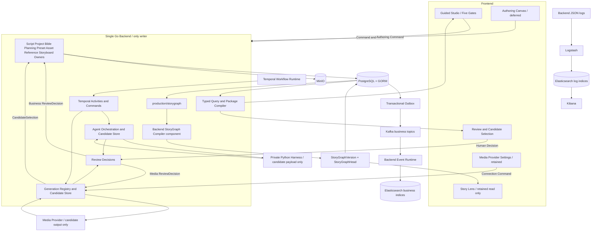

# 系统总体架构

- 目标状态：已接受
- StoryGraph 架构同步：已接受（`SG-D06`，2026-08-27）；通用媒体 Provider 边界已同步（2026-08-29）
- 视觉生产架构同步：已接受（`VP-D04`，2026-08-30）
- 当前已接受上位事实：[完整设计基线](0001-AI短剧制作平台完整设计基线.md) · [领域语言与模块命名规范](0006-领域语言与模块命名规范.md) · [剧本视觉生产工作台与世界观预设设计](0011-剧本视觉生产工作台与世界观预设设计.md)
- 待后续重同步的专项事实：[StoryGraph 内容图与 DAG 创作画布设计](0010-StoryGraph内容图与DAG创作画布设计.md) · [StoryGraph 剧本解析 Harness 与内置 Skill 设计](3003-StoryGraph剧本解析Harness与内置Skill设计.md)

## 结论

Lanverse 只有一套 AI Short Drama Production Core。当前 Visual Production MVP 先由各 Go Backend Owner 发布可追溯、不可变的正式版本，再由 Backend typed Query 组合 `VisualProductionPackageView` 与 `SceneProductionPacket` 供 Guided Studio 和 Storyboard 使用。

`production/storygraph` 不是业务事实中心，也不是 Scene Fact、Identity Resolution、Production World 或 Reference Plan 的前置输入。它只在 Owner Apply 已提交之后，将当前 StoryGraph Schema 明确列入的正式 Owner 版本编译成不可变 `StoryGraphVersion`，并维护线性 `StoryGraphHead`；Story Lens 才以该投影为主要读取面。

Go Backend 是业务事实唯一 Writer；Python Harness、媒体 Provider、Frontend、Temporal、Kafka 和 Elasticsearch 都只能产生候选、驱动执行或保存投影，不能直接发布业务事实。PostgreSQL/GORM 是唯一 SQL 事实源，Temporal 是唯一跨步骤恢复引擎，MinIO 保存对象字节，Kafka 解耦已提交事件，Elasticsearch 保存可重建业务索引，Logstash/Elasticsearch/Kibana 管理已脱敏结构化日志。

## 顶层跨服务架构



图中的 `OWN` 只是各唯一 Owner 的集合，不是泛化业务 Owner。业务 ReviewDecision 按对象路由到 `production/bible`、`production/planning`、`asset`、`preset`、`production/reference` 或 `production/storyboard` Apply；媒体 ReviewDecision 先由 `generation` 固化唯一槽位的 CandidateSelection，再交给对应正式 Owner Apply。`review` 只拥有 Decision，`generation` 只拥有执行、候选与 CandidateSelection 事实。

Temporal 只驱动 Backend Activity/Command，不直连 Python Harness 或媒体 Provider。Backend 必须先持久化 Invocation/Intent，再执行外部调用并收敛 Result/Candidate；任何候选都不能绕过 Backend 校验、人工决议和对应 Owner Apply。

## 正式 Owner 边界

| Owner | 拥有的正式事实 | 不拥有 |
|---|---|---|
| `production/script` | Document/Script Revision、SourceSpanIndexVersion 与规范化原文 | 身份、风格、媒体结果 |
| `production/project` | Project/Episode 身份、顺序与生命周期 | Scene/Beat、Preset、媒体结果 |
| `production/bible` | StructureIdentitySetVersion、Specification、WorldRule、Evidence、跨集 Claim 与 ProductionBinding | Preset、Artifact、Shot |
| `production/planning` | Scene、Dialogue、Beat、Occurrence、Causal/Continuity Claim；`InteractionClaim` 是受约束 `ContinuityClaim` | AssetVersion、Reference Binding、Provider Job |
| `preset` | PresetVersion、EffectiveStyleSnapshot、EffectivePolicySnapshot | 剧本事实、WorldRule、AssetState |
| `asset` | Character/Location/Prop Asset、完整 AssetState、Artifact 谱系与基础 AssetVersion | Scene/Interaction 语义、Reference Binding |
| `production/reference` | ApprovedReferencePlanVersion、SceneReferenceBindingVersion、InteractionReferenceBindingVersion | 基础 AssetVersion、Generation Job |
| `production/storyboard` | Shot Intent/Shot、ShotProductionBindingVersion 与镜头结果 Binding | 基础参考资产、Reference Plan |
| `production/storygraph` | 当前 Schema 明确列入事实的不可变 `StoryGraphVersion` 与线性 `StoryGraphHead` | 任何上游 Owner 事实 |
| `generation` | Generation Intent/Request、Provider Job/Call、Candidate 与 CandidateSelection | 正式 AssetVersion、Reference/Shot Binding |
| `review` | HumanTask、ReviewDecision 与审核历史 | 被审核对象的正式 Apply |

这些 Owner 都位于同一个 Go Backend 内，不为 `preset`、`reference`、StoryGraph Compiler 或 Review 新建微服务。表中只固定架构职责，不提前定义 `VP-D09` 的 Record/Command/Receipt 或 GORM Model。

## 四种图的事实边界

| 事实 | 回答的问题 | 唯一 Owner / Writer | 禁止代替 |
|---|---|---|---|
| `StoryGraphVersion` + `StoryGraphHead` | 当前 Schema 已列入的故事与生产事实如何形成只读内容关系，以及 Project 当前发布版本指向 | `production/storygraph`；Compiler 只是 Backend 写入组件 | 上游 Owner、Authoring Graph、Workflow Definition、Temporal History |
| `AuthoringRevision.Graph` | 用户准备怎样编排生产节点和端口 | Backend Authoring | 内容图和运行历史 |
| `WorkflowDefinitionVersion` | 本次运行按什么依赖执行 | Backend Workflow Compiler | 可编辑 Canvas 和 StoryGraph |
| Temporal History | Activity、Timer、Retry、Signal 实际发生了什么 | Temporal | PostgreSQL 业务事实和查询投影 |

四者可以共享 DAG 术语，但不共享 Record、ID、Schema 或 Writer。Story Lens 只是 `StoryGraphVersion` 的 Query View，不保存第五张图；Guided Studio 在 P0–P2 不把 StoryGraph 当作上游事实源，P3 编译 `SceneProductionPacket` 时才要求绑定与同一 Owner Version Set 一致的精确 `StoryGraphVersion`。

## 当前视觉生产 MVP 主链

北极星指标是 `Production-ready Scene Coverage`。系统依赖顺序固定为：

```text
Project + frozen Preset Selection
  （选择可先冻结，但不得进入事实抽取输入）
→ DocumentRevision / SourceSpanIndexVersion
→ SceneSpanCandidate
→ SceneFactCandidate（style-blind）
→ IdentityResolutionCandidate
→ Gate 1: Structure & Identity
→ production/bible Owner Apply
→ StructureIdentitySetVersion
→ Production World Candidate
  （Specification / AssetState / Scene / Occurrence
   + ContinuityClaim〔含 InteractionClaim〕/ WorldRule）
→ Gate 2: Bible & Continuity
→ production/bible + production/planning + asset Owner Apply
→ Confirmed Production World
→ Preset resolution + ReferencePlanCandidate
→ Gate 3: Visual Foundation & Scope
→ preset Owner Apply: EffectiveStyleSnapshot / EffectivePolicySnapshot
  + production/reference Owner Apply: ApprovedReferencePlanVersion
→ Character identity anchor candidates
→ Human Selection → identity anchor AssetVersion
→ anchor-bound Character appearance variants
  + Location boards + Prop sheets
→ Human Selection → base AssetVersion
→ exact base AssetVersion + Occurrence / InteractionClaim
→ Scene / Interaction Composition Candidate
→ Human Selection
→ SceneReferenceBindingVersion / InteractionReferenceBindingVersion
→ Gate 4: Reference Selection complete
→ production/storygraph 从一致的 schema-listed Owner Version Set
  编译并发布精确 StoryGraphVersion
→ SceneProductionPacket
  （绑定该 StoryGraphVersion，并独立绑定精确 Reference Binding）
→ Storyboard
→ Gate 5: Storyboard
```

五个 Gate 在本 Design 中只表示用户决策里程碑，不提前映射为 Agent Stage/Wire、WorkflowDefinition Node、HumanTask Subject 或恢复状态机。对应精确合同分别留给 `VP-D07`、`VP-D09` 和 `VP-D11`。

视频、配音、字幕、剪辑、渲染、最终 QC 与导出属于 Platform Complete 长期下游，不进入当前 Visual Production MVP 发布门。Story Lens 是保留的平台能力，也不抵扣 P0–P4 的新完成条件。

## StoryGraph 编译顺序与 Schema Gate

StoryGraph 编译的相对时序固定为：

```text
Candidate
→ Backend validation / Human Decision
→ corresponding Owner Apply commits immutable Owner Version
→ production/storygraph reads an exact schema-listed Owner Version Set
→ deterministic projection compile
→ atomic StoryGraphVersion creation + StoryGraphHead CAS
→ committed event / Story Lens / search projection
```

硬边界：

1. Candidate Revision、临时 Key、Evidence 覆盖和业务冲突必须在对应 Gate/Owner Apply 前完成校验；StoryGraph Compiler 不验证或发布 Candidate。
2. 正式 Owner Ref 由各上游 Owner 创建；Compiler 只能保留或引用它，并派生投影内部稳定 `StoryNodeKey`。
3. Compiler 只读取精确、已提交、当前 Schema 明确列入的 Owner Version Set，不读取“最新”可变对象。
4. Owner Apply 是产品主链的提交点；StoryGraph 是其下游投影，不得反向阻塞上游 Owner Apply 或 `VisualProductionPackageView`。进入 P3 时必须先从一致的已确认 Owner Version Set 编译并发布精确 `StoryGraphVersion`，再将它绑定进 `SceneProductionPacket`。
5. Owner 事实更新后可以确定性重编译新的投影版本，不假定整部剧只编译一次。
6. `ApprovedReferencePlanVersion`、`SceneReferenceBindingVersion` 和 `InteractionReferenceBindingVersion` 先由 `production/reference` 正式保存并由 typed Query 消费；只有 `VP-D05` 明确把它们加入新 Schema 后，才允许进入 StoryGraph 投影。当前 `storygraph-narrative` 不因本文命名自动扩展。

精确 Node/Edge/Schema、投影触发/合并策略和幂等 Receipt 留给 `VP-D05/VP-D09`，本步不提前定义。

## Agent、候选与正式事实

Backend Agent Orchestration 拥有并持久化 AgentInvocation、StageCandidateRevision，以及 Stage/Shard/Policy、Bundle/Prompt/Schema 的精确引用。这里的 Stage/Shard 只表示既有执行身份；新 `storygraph-stage-wire-production` 的 DAG 和 Schema 留给 `VP-D07`。

Python Harness 只执行固定 Bundle 并返回严格 Result/Candidate payload：

```text
Backend freezes input + Invocation identity
→ Backend invokes private Python Harness
→ Harness executes fixed Skill Release
→ Pydantic validates Result/Candidate payload
→ Backend persists Candidate Revision
→ deterministic validation / Human Decision
→ corresponding Backend Owner Apply
```

SceneSpan/SceneFact/Identity Candidate 的输入和输出均对 Production Bible、Preset/Style 与视觉设计隔离；Preset 只能进入 Visual Brief、Reference、Vision Review 和 Storyboard 等视觉用途。

当前不开放 Tool Loop。Python Harness 不获得 Shell、Web、浏览器、文件写入、数据库、对象存储或 Backend 业务写工具，不保存跨请求 Checkpoint，也不以 LangGraph 建立第二个持久 Workflow Engine。Temporal 是唯一跨步骤等待、重试与恢复事实源。

成熟外部 Skill 只能按以下吸收链进入固定 Release：

```text
来源与许可证审查
→ 拆分 Reference / Recipe / Rubric / 失败案例
→ 映射 Lanverse typed output
→ 黄金剧本与对抗样本 Eval
→ Shadow run
→ 固定 Bundle Hash 并发布
```

外部 Skill 不在运行时安装，不原样拼接到系统 Prompt，不取得业务写权。

## Authoring 与 Workflow 边界

`AuthoringDraft`、`AuthoringRevision.Graph`、Workflow Compiler 和 `WorkflowDefinitionVersion` 作为既有平台边界继续保留。当前视觉生产里程碑尚未映射为具体 WorkflowDefinition 名称、层级、Node、Gate 或恢复合同；该映射必须等待 `VP-D07/VP-D11`。

当前主产品只有 Guided Studio。只读 Story Lens 作为已实现/保留的平台能力继续存在，但不是新 MVP 完成门；可写 Authoring Canvas、Yjs/Hocuspocus、多人协作、Subflow 和局部执行继续延后。

## 运行单元

| 运行单元 | 当前责任 | 创建门禁 |
|---|---|---|
| Frontend Web | Guided Studio 五 Gate、Review、视觉基底/参考覆盖与运行状态；保留 Story Lens 和 Provider Settings | 在当前应用内渐进交付，不拆第二 Web App |
| `lanverse` Backend | 唯一 `backend/cmd/main.go` 同进程装配 Command/Query、所有 Owner Apply、typed package query、Temporal Activity、Agent orchestration、Generation、Kafka/Search 投影 | 已实现单一 Binary；模块仍保持唯一 Owner 与独立 readiness |
| Python `agent-runtime` | 执行 Backend 冻结的固定 Bundle，校验并返回严格 Candidate payload | Backend 私有，不暴露给 Browser，不拥有 Stage/Candidate 持久化 |

`model-gateway`、`media-worker`、协作服务及第二 Frontend App 都不是预建目录。只有已接受 Design 证明进程隔离能解决真实负载、凭据或故障域问题时才拆分。

## 数据事实与投影

| 系统 | 保存内容 | 事实边界 |
|---|---|---|
| PostgreSQL/GORM | 正式 Owner 版本/Head、Backend-owned Invocation/Candidate、ReviewDecision、CandidateSelection、Artifact 谱系、Provider Connection/Credential/Profile/Binding、Run 业务投影、Cost/Quota、Outbox/Inbox | 唯一 SQL 事实源；Credential 只保存密文；新 Model 等 `VP-D09` 与已接受 Plan |
| Temporal | Workflow History、Timer、Retry、Signal、Activity 状态 | 执行历史，不保存业务聚合或 Python Checkpoint |
| MinIO/ObjectStore | 当前剧本与参考图片字节；长期可保存视频、音频、字幕和导出字节 | 对象内容；Owner、权利、谱系和 Binding 元数据仍属于 Backend |
| Kafka | 已提交业务事件 | 传输边界，不是查询源，也不承载日志 |
| Elasticsearch | 剧本/StoryGraph 业务索引与日志索引 | 可重建 Projection，两类索引逻辑隔离 |
| Redis（按用例） | Cache、Rate Limit 或 Ephemeral Session | 可删除加速，不承担正确性 |

`VisualProductionPackageView` 与 `SceneProductionPacket` 都是 Backend typed Query 组合出的只读、内容定址 View，不新建第二套事实 Owner，也不以读取“最新”代替精确版本引用。前者不等待 StoryGraph；后者必须绑定一个从一致 Owner Version Set 编译的精确 `StoryGraphVersion`，并在 `VP-D05` 接受新 Schema 前独立绑定 Reference Plan/Binding，不据此提前扩展 `storygraph-narrative`。

Backend 继续使用唯一 GORM Model Catalog 在空 PostgreSQL 上创建和校验 Schema；不创建 Migration 文件、不引入 `sqlc`/第二 ORM、不手写业务 SQL。每个新 Model 只在首个真实契约需要时进入 Catalog。

```text
PostgreSQL Transaction
├── Aggregate Change
└── Outbox Event
      ↓ GORM Outbox Publisher
    Kafka Business Topic
      ↓ idempotent consumer + Inbox/business key
    Backend Event Runtime → Elasticsearch Business Index
```

当前不引入 Debezium/CDC。Topic 只在生产者、消费者、幂等键、失败去向和重放契约同时明确后创建。Elasticsearch 业务索引必须能从 PostgreSQL 全量 Reindex。

日志链路固定为 `JSON Log → fail-open TCP → Logstash → Elasticsearch Log Index → Kibana`。日志不经过 Kafka；未脱敏剧本、Secret 与生成内容不进入日志索引，Logstash 故障不阻断业务事实提交。

## 创作 Preset、媒体 Provider 与发布路由

创作 `PresetVersion/EffectiveStyleSnapshot/EffectivePolicySnapshot` 属于 Backend `preset` Owner。`generation` 的无 Secret `MediaProviderPresetDescriptor Catalog` 只描述媒体连接工厂；两者不共享配置、凭据、版本或语义。Codex CLI 是 Agent model adapter，不是媒体 Provider。

旧 `SG-D13`–`SG-D21` 接受的 Seedream、Seedance、GPT Image 与 Nano Banana 多 Provider 广度作为 Platform Complete 目标保留；`SG-I21` 未提交增量暂停扩展。当前 MVP 只要求一条可真实验收人物/地点/道具参考的图片执行路径，精确 GenerationTarget 留给 `VP-D10`。

正式发布路由固定为：

| 候选/决策用途 | `review` 拥有 | `generation` 拥有 | 正式 Apply Owner | 正式结果 |
|---|---|---|---|---|
| Gate 1 结构与身份候选 | ReviewDecision | 不适用 | `production/bible` | StructureIdentitySetVersion |
| Gate 2 制作世界候选 | ReviewDecision | 不适用 | `production/bible` + `production/planning` + `asset` | Specification/WorldRule/Claim、Scene/Occurrence/Continuity 与 AssetState |
| Gate 3 风格与参考范围 | ReviewDecision | 不适用 | `preset` + `production/reference` | EffectiveStyle/Policy Snapshot + ApprovedReferencePlanVersion |
| 人物身份锚点、形象变体、地点板、道具板 | ReviewDecision | GenerationCandidate + CandidateSelection | `asset` | 基础 AssetVersion |
| Scene / Interaction Composition | ReviewDecision | GenerationCandidate + CandidateSelection | `production/reference` | Scene/Interaction Reference Binding Version |
| Storyboard Intent/Shot 结构候选 | ReviewDecision | 不适用 | `production/storyboard` | Shot Intent/Shot 与生产输入 Binding |
| 镜头媒体候选（Platform Complete） | ReviewDecision | GenerationCandidate + CandidateSelection | `production/storyboard` | Shot Result Binding |

CandidateSelection 只用于 `generation` 唯一选择槽位，不是 ReviewDecision，也不强加给普通文本候选。所有跨 Owner Apply 都由 Backend application service 按已接受的精确命令执行；本 Design 不定义这些命令形状。

`generation` 和 `review` 都不能直接创建 StoryGraphVersion。对应 Owner Apply 提交后，`production/storygraph` 才能按当前 Schema 独立编译投影。精确 HumanTask Subject、Decision/Selection/Owner Apply 与恢复合同留给 `VP-D11`。

## P0–P4 架构激活顺序

| 阶段 | 启用的最小跨模块闭环 | 明确不要求 |
|---|---|---|
| P0 Text Production Bible | `script + project + bible + planning + asset + agent + review`，完成前两个 Gate；`asset` 只发布身份/AssetState，不生成图片 | 图片 Provider、基础 AssetVersion、Storyboard |
| P1 Visual Identity | 增加 `preset + production/reference + generation`，启用 `asset` 的 Artifact/基础 AssetVersion 路径，发布 Effective Snapshot、Approved Reference Plan、身份锚点、多形象/地点/道具参考 | Scene/Interaction Composition、多 Provider 广度 |
| P2 Composition | 扩展已存在的 `production/reference`，发布 Scene/Interaction Composition Binding、校验精确基础版本依赖并支持局部恢复 | 视频、声音、成片 |
| P3 Storyboard | 增加精确 `SceneProductionPacket → production/storyboard` 交接 | Storyboard 自行搜索最新资产 |
| P4 Full-script Hardening | 完整剧本分片、恢复、影响闭包、stale 防消费、质量基线与 Guided Studio 收敛 | Platform Complete 媒体广度 |

上表只固定架构依赖方向，不是实施 Checklist。具体可领取任务必须来自重新接受的唯一 Plan 与初始全未通过 Acceptance。

## 核心不变量

1. 每个业务资源、Endpoint、Workflow 类型、Event 和索引文档始终只有一个语义 Owner。
2. Backend 是业务唯一 Writer；Agent、Frontend、Story Lens、Authoring Canvas、Provider、Kafka 和 Elasticsearch 都不能直接改写业务事实。
3. SceneFactCandidate 与 IdentityResolutionCandidate 对 Bible、Preset/Style 和视觉设计隔离；Gate 1 只通过 Owner Apply 发布精确 StructureIdentitySetVersion。
4. 同一 Character/Location/Prop 身份用多个完整 AssetState 表达剧情阶段；人物拿取、使用或交接道具使用 InteractionClaim，不进入 Character AssetState。
5. 人物形象变体必须绑定已选身份锚点，只改变已声明内容；Scene/Interaction Composition 只消费精确已选基础 AssetVersion，并发布独立 Binding。
6. Preset 不改写 Script、Identity、Specification、AssetState 或 WorldRule；切换 Preset 只使精确视觉下游 stale，不覆盖旧版本。
7. StoryGraph 只投影当前 Schema 明确列入的已确认 Owner 事实；Compiler 不验证 Candidate、不分配上游 Owner ID，也不作为产品主链前置依赖。
8. 四种 Graph 不共享 Record、ID、Schema 或 Writer；Temporal 不保存 StoryGraph/Authoring 内容。
9. 每次执行绑定不可变 Revision、Policy、Bundle Hash 与输入版本，运行中不静默读取“最新”；Storyboard 只消费冻结 SceneProductionPacket。
10. 单 Scene/Identity/State/Interaction/参考失败只阻塞影响范围；重试、恢复与人工等待不得重复创建 Owner 事实。
11. Kafka Consumer 幂等，Elasticsearch 可重建，Temporal Workflow 代码确定，跨进程未知结果按稳定 ID 对账。
12. 高成本操作先通过 Cost/Quota 预留与执行授权；未选中 Candidate 不能覆盖当前生产版本。
13. 大文件不经 Public API 中转，Bucket 保持私有，所有绑定使用精确 AssetVersion/Artifact。
14. 测试代码只进入 `frontend/tests`、`backend/tests` 和 `agent/tests`，不与业务代码混放。
15. 未通过当次真实验收的目标能力不得写成已实现，旧 `SG-Ixx` 证据不得抵扣 P0–P4 新完成门。

## 设计完成边界

本文只固定总体系统图、Owner 协作、产品主链、StoryGraph 相对编译时序、运行单元、事实源和 P0–P4 架构激活顺序，不定义 StoryGraph Node/Edge/Schema、Agent Stage/Wire、Owner Record/Command/Receipt、GenerationTarget 或 Human Gate 恢复合同。

本 Design 已通过三路独立评审，并按用户的后续自动实施授权接受。当前只按[文档中心的视觉生产重排队列](../README.md#当前视觉生产重排推进顺序)进入 `VP-D05`；旧 `SG-Dxx/SG-Ixx` 只保留历史事实，旧 Plan 与 Acceptance 不得越过队列领取任务或抵扣新验收。
