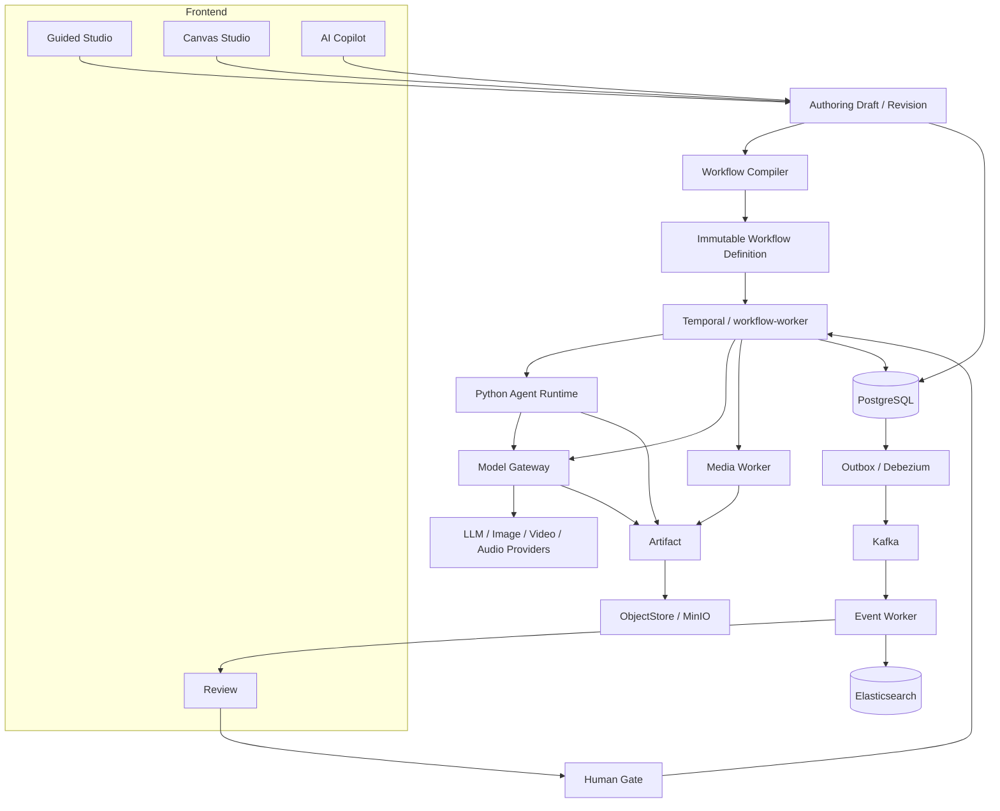

# 系统总体架构

- 目标状态：已接受
- 来源：[完整设计基线](0001-AI短剧制作平台完整设计基线.md) · [采用目标平台架构决策](0002-采用目标平台架构决策.md) · [中文语义化文档与模块命名决策](0005-采用中文语义化文档与模块命名决策.md) · [后端语言与运行边界策略](2003-后端语言与运行边界策略.md)

## 结论

Lanverse 只有一套 AI Short Drama Production Core。Guided Studio 与 Canvas Studio 是两种 Authoring UI；真人短剧、漫剧、写实、国漫或日漫是 Preset/Style/Skill/Policy 的不同组合。所有入口最终发布不可变 Revision，由同一个 Workflow Compiler 编译，并由 Temporal、Agent、Generation Gateway、Media、Artifact 与 Review 系统完成可靠生产。



## 系统范围

V1 生产主链为：

```text
Project → Script → Production / Story Bible
→ Character / Scene → Storyboard → Shot
→ Image → Motion / Video → Voice → Subtitle
→ Render → QC → Review → Export
```

核心质量不是“节点多”，而是：任务可恢复、单 Shot 可重跑、候选可选择、人工审核可暂停、所有输入/输出/版本/成本可追踪。

产品能力以两个发布门验收：`Guided MVP` 完成 Guided Studio 的可恢复生产闭环，`Platform Complete` 再补齐完整事件投影、Search/Cost/Quota/Observability、Canvas、协作与 Copilot。发布门不等同于实施阶段编号；从零交付顺序以[平台 0→1 交付计划](../plan/0007-平台0到1交付计划.md)为准，详细产品边界见[产品范围与验收基线](../prd/0001-产品范围与验收基线.md)。

## 统一 Authoring 模型

本节细化原设计只命名但未定义的数据边界。

`AuthoringDraft` 是可变编辑态，包含：

- `authoring_mode`：`GUIDED` 或 `CANVAS`，仅记录来源与审计信息，不能作为互斥 Schema 的判别字段；两种入口使用同一套 Draft/Revision 结构。
- 业务 Graph：Nodes、Edges、Variables、Bindings；Guided 由系统模板产生，Canvas 可视化编辑。
- Layout：只对 Canvas 有意义，不参与执行 Hash。
- Metadata：Workspace、Project、权限、基线版本和更新时间。

`AuthoringRevision` 是发布后的不可变快照。发布必须冻结 Graph、Preset、Effective Style、Skill、Prompt、Model/QC/Motion/Render Policy、Node Registry 版本和输入 Artifact 引用。Guided 和 Canvas 不能绕过 Revision 直接启动 Workflow。

```text
Guided Form ─┐
             ├→ AuthoringDraft → Validate → AuthoringRevision
Canvas/Yjs ──┘                         ↓
                              Workflow Compiler
                                       ↓
                           WorkflowDefinitionVersion
```

Yjs 是 Canvas 实时协作工作副本，不是发布事实源。V1 Collaboration 要求 `apps/collab` 在专用协作存储中持久化、压缩和清理 Yjs update/snapshot，以支持服务重启和断线恢复；Backend 在发布事务中校验指定 state vector，并把规范化 Graph/Metadata 写入 PostgreSQL 的不可变 Revision。协作日志只是可重建的恢复投影，执行只读取 Revision，不读取活动 Yjs 文档。

## Workflow Compiler

Compiler 是 Authoring 与执行之间的唯一转换边界：

1. 读取不可变 Revision 与对应 Node Catalog。
2. 校验端口类型、必填配置、权限、依赖、Human Gate、成本与模型能力。
3. 排除 Frame/Comment/Group 等纯视觉节点。
4. 把 Guided 模板或 Canvas Graph 规范化为同一种 Authoring IR。
5. 展开 Subflow，拒绝一般环；只允许声明最大迭代次数和预算的 Loop。
6. 生成不可变 Workflow Definition、Node Cache 描述、Temporal Workflow 类型和版本。

局部执行不是任意跳过依赖。`Run Node/To/From/Branch/Selection/Dirty/All` 先计算闭包，复用 Hash 未变化且权限仍有效的 Artifact，其余节点进入新 Run。每次 Run 都绑定原 Revision 和 Definition Version。

## Production Core 配置

```text
Preset
├── Style
├── Skill versions
├── Model Policy
├── QC Policy
├── Motion Strategy
└── Render Policy
```

Style 解析优先级固定为 `Shot Override > Project Override > Preset > System Default`，得到不可变 `EffectiveStyleSnapshot`；它与 Skill/Prompt/Model/QC/Motion/Render Policy 版本共同组成 `EffectivePolicySnapshot`。Workflow 只绑定完整 Policy Snapshot，不在运行中重复解析；它也不允许根据“真人/漫剧”或具体模型名称硬编码分支，而是根据 Requirement、Generation Capability Registry 和 Model Policy 选择 Provider。

## 运行服务

| 服务 | 运行单元 | 责任 |
|---|---|---|
| Web | `frontend/apps/web` | Guided、Canvas 容器、Review、资产、费用与诊断界面 |
| Collaboration | `frontend/apps/collab` | Hocuspocus/Yjs 连接、Presence、Comment 与协作持久化 |
| Public API | `lanverse-api` | REST/SSE、Access、Production、Preset、Authoring、Asset/Rights、Review、Cost、Quota、Audit/Search 查询、命令与 Callback 入口 |
| Workflow | `workflow-worker` | Temporal Episode/Shot/Storage Workflow、Human Gate、重试与恢复 |
| Model | `model-gateway` | Provider/Generation Capability、路由、Job、Callback、限流和 Pricing |
| Media | `media-worker` | FFmpeg/ffprobe/OpenCV、Motion、Subtitle、Mix、Render 和 Export |
| Event | `event-worker` | Kafka 投影、Search、通知、Cost Analytics、Audit、DLQ、Replay/Reindex |
| Agent | `agent-runtime` | Structured/ToolLoop/LangGraph Executor 与领域 Agent |

基础设施闭环除 PostgreSQL、Redis、MinIO、Kafka、Temporal、Elasticsearch/Kibana 外，还需要 Kafka Connect/Debezium、OTel Collector、Prometheus 与 Grafana。它们属于部署依赖，不能因初版 Compose 清单遗漏而由业务进程私自替代。

业务模块使用 `access/production/preset/authoring/workflow/review/generation/agent/asset/media/cost/quota/eventing/search` 作为规范名；详细事实所有权、用例、状态、事件与失败路径见 [后端领域模块功能设计](2002-后端领域模块功能设计.md)。前端用户任务模块见 [前端功能模块设计](1002-前端功能模块设计.md)。

## 数据事实与投影

| 系统 | 保存内容 | 是否事实源 |
|---|---|---|
| PostgreSQL | 业务聚合、Revision、Run 业务投影、Candidate、Artifact/Rights 元数据、Review、Cost/Budget、Quota、Outbox、Audit Projection 等 | 对各 Owner 的业务事实是；Run/Audit 行按所列协议为投影 |
| Temporal | Workflow History、Timer、Retry、Signal、Activity 状态 | 对 Workflow 执行是 |
| MinIO/ObjectStore | 图片、视频、音频、字幕、文档与导出字节 | 对对象内容是 |
| Redis | Cache、Rate Limit、Ephemeral Lock/Session | 否 |
| Kafka | 已提交的领域事件流 | 事件传输事实，不是业务查询源 |
| Elasticsearch | Business Search、日志和可观测投影 | 否，可 Reindex |

业务事务通过 Outbox 与事件保持一致：

```text
PostgreSQL Transaction
├── Aggregate Change
└── Outbox Event
      ↓ Debezium / Kafka Connect
    Kafka
      ↓
Event Worker → Search / Cost Analytics / Notification / Audit Projection
```

Kafka 不执行 Workflow Timer、Retry、Human Wait、Yjs 光标或 LLM Token Stream。

## 生成、候选与 Artifact

所有生成统一为：

```text
GenerationSubmissionIntent
  → AcquireExecutionClaim / ExecutionAuthorization
  → GenerationRequest / ProviderJob
  → Unknown Outcome Reconcile（如提交结果未知）
  → Staging Output Validate
  → Artifact（candidate kind）
  → GenerationCandidate(artifact_id)[]
  → QC Report / Quality Gate / HumanTask
  → ReviewDecision(SELECT)
  → CandidateSelection
  → Shot Result / AssetVersion Binding
```

Candidate Artifact 在选择前登记，才能被预览、QC 和审计；选择不会复制或覆盖对象，只创建指向既有 Artifact 的唯一绑定。ReviewDecision 是人工事实，CandidateSelection 是 Generation 的选择事实，两者通过 `review_decision_id` 幂等关联。

高成本操作遵循 `Estimate → Cost/Quota Reserve + Intent/Outbox → Worker 在线 Acquire Execution Claim → Execute → Receipt → Settle/Consume`；已领取后结果未知进入 `Reconcile`，不能释放后重提。Candidate 没有被选择前不能覆盖当前生产版本；失败 Shot 只使当前 Shot/下游 Dirty，不触发整集无条件重跑。

## 状态模型

Workflow：`DRAFT / RUNNING / PAUSED / WAITING / SUCCEEDED / FAILED / CANCELLED`。

Node：`READY / QUEUED / RUNNING / WAITING_PROVIDER / WAITING_HUMAN / SUCCEEDED / FAILED / CACHED / CANCELLED / STALE`。

Human Task 与 Review Decision 分开保存。Task 负责等待和领取；Decision 记录 `APPROVE / REJECT / SELECT / REGENERATE / EDIT / SKIP`，并通过 Temporal Signal 恢复对应 Workflow。

## 核心不变量

1. PostgreSQL、Temporal、对象存储和 Elasticsearch 的职责不互相冒充。
2. 每个业务资源、表、Endpoint、Workflow 类型始终只有一个写入所有者。
3. 每次执行绑定不可变 Revision、Definition、Policy 与输入 Artifact；运行时配置不能静默漂移。
4. Agent、Frontend、Canvas 和 Provider 都不能直接写业务数据库。
5. Agent 不直接调用 Provider；所有模型经过 Model Gateway、Budget 和审计。
6. 大文件不经过 Public API 中转，所有 Bucket 私有。
7. Elasticsearch 可重建，Kafka Consumer 幂等，Temporal Workflow 代码保持确定性。
8. LangGraph 只管理单个 Agent 的有限复杂推理，不管理 Episode 生命周期。
9. 真人与漫剧不复制核心业务模块、Agent 或 Workflow。
10. 未通过真实验收的目标能力不得写成已实现。

## 设计完成边界

本文定义目标系统的服务、事实源、状态、不变量和失败边界，不记录实现进度。完整交付必须从空环境按[平台 0→1 交付计划](../plan/0007-平台0到1交付计划.md)执行，并由[资源所有权与交付台账](../plan/0008-资源所有权与交付台账.md)和 Acceptance 逐项证明；任何既有代码或目录都不能自动获得完成状态。
