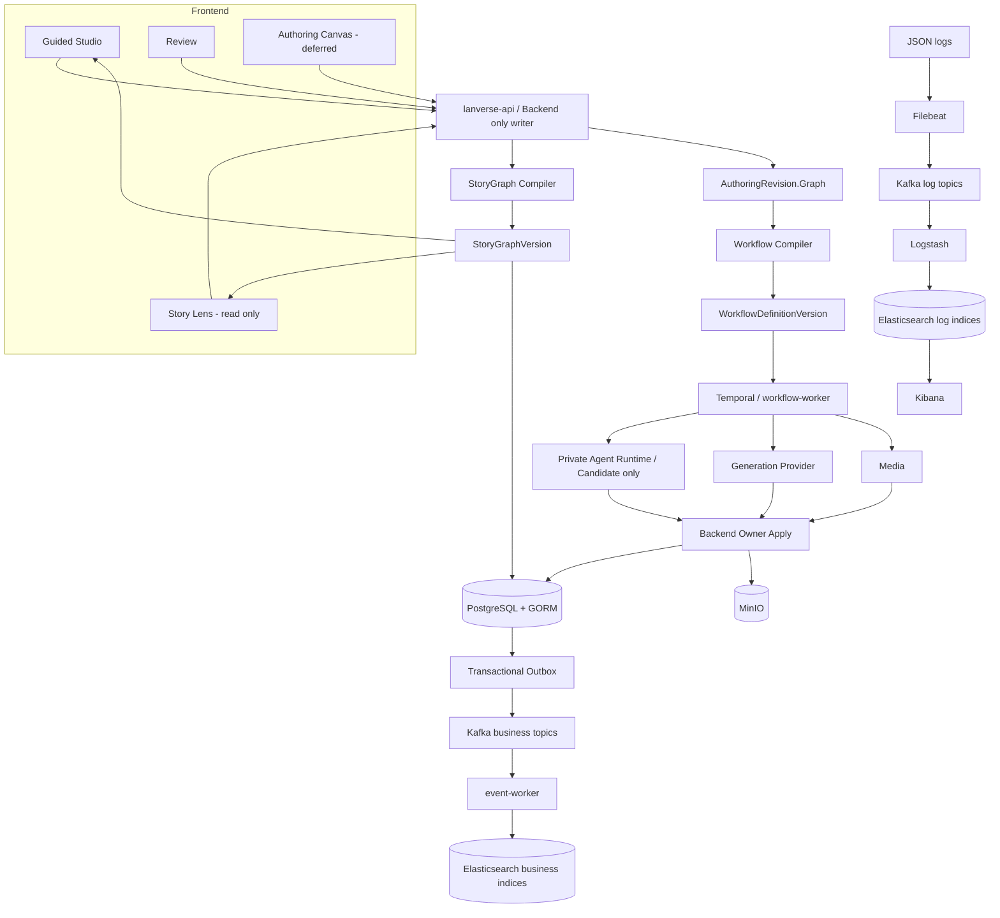

# 系统总体架构

- 目标状态：已接受
- StoryGraph 架构同步：已接受（`SG-D06`，2026-08-27）
- 来源：[完整设计基线](0001-AI短剧制作平台完整设计基线.md) · [领域语言与模块命名规范](0006-领域语言与模块命名规范.md) · [StoryGraph 内容图与 DAG 创作画布设计](0010-StoryGraph内容图与DAG创作画布设计.md) · [后端语言与运行边界策略](2003-后端语言与运行边界策略.md) · [StoryGraph 剧本解析 Harness 与内置 Skill 设计](3003-StoryGraph剧本解析Harness与内置Skill设计.md)

## 结论

Lanverse 只有一套 AI Short Drama Production Core。剧本、生产对象、角色/地点状态、分集、场景、节拍、分镜和资产关系统一进入 `StoryGraphVersion`；Guided Studio 与只读 Story Lens 从它读取不同视图。Authoring Canvas 表达用户的执行编排，不是 StoryGraph 的另一个编辑器。

Go Backend 是业务事实唯一 Writer；Python Agent 只生成 Candidate。PostgreSQL/GORM 是唯一 SQL 事实源，Temporal 保存跨步骤执行历史，MinIO 保存对象字节，Kafka 解耦已提交事件，Elasticsearch 保存可重建剧本/StoryGraph 检索投影，ELK + Kafka 管理已脱敏结构化日志。



## 四种图的事实边界

| 事实 | 回答的问题 | Owner / Writer | 禁止代替 |
|---|---|---|---|
| `StoryGraphVersion` | 剧本、实体、状态、Scene、Beat、Shot 与资产如何关联 | Backend Production / StoryGraph Compiler | Authoring Graph、Workflow Definition、Temporal History |
| `AuthoringRevision.Graph` | 用户准备怎样编排生产节点和端口 | Backend Authoring | 内容图和运行历史 |
| `WorkflowDefinitionVersion` | 本次运行按什么依赖执行 | Backend Workflow Compiler | 可编辑 Canvas 和 StoryGraph |
| Temporal History | Activity、Timer、Retry、Signal 实际发生了什么 | Temporal | PostgreSQL 业务事实和查询投影 |

四者可以共享 DAG 术语，但不共享 Record、ID、Schema 或 Writer。Story Lens 只是 `StoryGraphVersion` 的 Query View，不保存第五张图。

## V1 生产主链

```text
Project
→ DocumentRevision / ScriptVersion
→ ProductionBibleVersion
→ StoryGraphVersion
→ Episode / Scene / NarrativeBeat / Claim / Occurrence
→ Storyboard Draft
→ Human Gate
→ Shot + ShotProductionBindingVersion
→ GenerationCandidate + CandidateSelection
→ ShotImageBindingVersion
→ Motion / Voice / Subtitle / Render
→ QC / Review / Export
```

核心质量是：原稿证据可追溯、剧本可稳定拆分为剧集/场景/节拍/分镜、角色和地点身份/状态可保持一致、任务可恢复、单 Shot 可重跑、人工审核可暂停，所有输入/输出/版本/成本可追踪。

## StoryGraph 编译边界

StoryGraph Compiler 只在 Backend 内运行：

1. 读取精确 `ScriptVersion`、`ProductionBibleVersion` 和已接受 Owner Receipt。
2. 验证 Candidate Revision、Evidence 覆盖、规范临时 Key、严格 Node/Edge Type 和 DAG 不变量。
3. 把可能成环的关系、因果、伏笔与回收表达为 typed `Claim` 节点，不开放任意 Edge Type。
4. 分配正式 Owner Ref 和稳定 `StoryNodeKey`，原子创建不可变 JSONB `StoryGraphVersion` 并 CAS 切换 `StoryGraphHead`。
5. 发布已提交事件，供只读 Query 和 Elasticsearch 检索投影消费。

Agent 只生成带 Evidence 的 Candidate/Patch，不能调用 Compiler、分配正式 ID、切换 Head 或发布业务事件。

## Authoring 与 Workflow Compiler

`AuthoringDraft` 是 Guided/Canvas 共用的可变执行编排编辑态，`AuthoringRevision` 是发布后的不可变快照。Workflow Compiler 是 Authoring 与执行之间的唯一转换边界：

1. 读取不可变 `AuthoringRevision` 和对应 Node Catalog。
2. 校验端口类型、必填配置、权限、依赖、Human Gate、成本与模型能力。
3. 排除 Layout/Comment 等纯视觉信息，拒绝未声明循环。
4. 生成不可变 `WorkflowDefinitionVersion`，每次 Run 绑定精确 Revision、Definition、Policy 和输入版本。

当前 StoryGraph MVP 只交付只读 Story Lens；可写 Authoring Canvas、Yjs/Hocuspocus、多人协作、Subflow 和局部执行都是后续独立 Design，不影响 StoryGraph 主链实施。

## 运行单元

| 运行单元 | MVP 责任 | 创建门禁 |
|---|---|---|
| Frontend Web | Guided、Story Lens、Review、资产与运行状态 | 当前应用内渐进交付，不拆第二 Web App |
| `lanverse-api` | 公共 REST/SSE、所有业务 Command/Query、Owner Apply 和 Callback | 已有唯一公共入口 |
| `workflow-worker` | Temporal Workflow/Activity、Human Gate、重试、恢复和对账 | 只注册已接受 Workflow/Activity |
| `event-worker` | Kafka Outbox Publisher/Consumer、剧本/StoryGraph Search Projection、DLQ/Replay/Reindex | 首个真实 Kafka 消费者实施时创建 |
| `agent-runtime` | `build-storygraph` Bundle、Stage/Shard、严格 Candidate Schema、受控 Provider | Backend 私有，不暴露给 Browser |

`model-gateway`、`media-worker`、协作服务及第二 Frontend App 都不是预建目录。只有已接受 Design 证明进程隔离能解决真实负载、凭据或故障域问题时才拆分。

## 数据事实与投影

| 系统 | 保存内容 | 事实边界 |
|---|---|---|
| PostgreSQL/GORM | 业务聚合、不可变版本/Head、Run 业务投影、Candidate、Artifact 元数据、Review、Cost/Quota、Outbox/Inbox | 唯一 SQL 事实源和业务 Writer 目标 |
| Temporal | Workflow History、Timer、Retry、Signal、Activity 状态 | 执行历史，不保存业务聚合内容 |
| MinIO/ObjectStore | 图片、视频、音频、字幕、剧本与导出字节 | 对象内容，元数据仍属于 Backend |
| Kafka | 已提交业务事件和独立日志 Topic | 传输边界，不是业务查询源 |
| Elasticsearch | 剧本/StoryGraph 业务索引与日志索引 | 可重建 Projection，两类索引逻辑隔离 |
| Redis（按用例） | Cache、Rate Limit 或 Ephemeral Session | 可删除加速，不承担正确性 |

Backend 使用唯一 GORM Model Catalog 在空 PostgreSQL 上创建和校验 Schema；不创建 Migration 文件、不引入 `sqlc`/第二 ORM、不手写业务 SQL。每个新 Model 只在首个真实契约需要时进入 Catalog。

```text
PostgreSQL Transaction
├── Aggregate Change
└── Outbox Event
      ↓ GORM Outbox Publisher
    Kafka Business Topic
      ↓ idempotent consumer + Inbox/business key
    Event Worker → Elasticsearch Business Index
```

当前不引入 Debezium/CDC。Topic 只在生产者、消费者、幂等键、失败去向和重放契约同时明确后创建。Elasticsearch 业务索引必须能从 PostgreSQL 全量 Reindex。

日志链路固定为 `JSON Log → Filebeat → Kafka Log Topic → Logstash → Elasticsearch Log Index → Kibana`。日志 Topic 与业务 Topic 使用独立 Schema、ACL、Retention 和 Consumer Group；Logstash 不消费业务事件，未脱敏剧本、Secret 与生成内容不进入日志索引。

## Agent、候选与正式事实

Agent 运行入口固定为 `agent/skills/build-storygraph/SKILL.md`。`StoryGraphHarness` 根据 Backend-owned Stage/Shard/Policy 只注入当前 Reference，通过 Pydantic 输出严格 Candidate。本地开发可使用 Codex CLI Provider，但它不获得 Shell、Web、浏览器、文件写入、数据库、对象存储或 Backend 业务写权。

WorkflowDefinition/Temporal 只编排稳定宏观节点；Backend 在对应 NodeRun 下保存 ShardManifest、AgentInvocation、Candidate Revision 和 Owner Receipt。Agent 不保存跨请求 Checkpoint，不引入 LangGraph 作为第二个持久 Workflow Engine。

所有生成统一收敛为：

```text
GenerationSubmissionIntent
→ ExecutionAuthorization
→ GenerationRequest / ProviderJob
→ Staging Output Validate
→ Artifact + GenerationCandidate[]
→ Quality Gate / HumanTask / ReviewDecision
→ CandidateSelection
→ Backend Owner Apply
→ AssetVersion / ShotImageBindingVersion / StoryGraphVersion
```

## 核心不变量

1. 每个业务资源、Endpoint、Workflow 类型、Event 和索引文档始终只有一个语义 Owner。
2. Backend 是业务唯一 Writer；Agent、Frontend、Story Lens、Authoring Canvas、Provider、Kafka 和 Elasticsearch 都不能直接改写业务事实。
3. 四种 Graph 不共享 Record、ID、Schema 或 Writer；Temporal 不保存 StoryGraph/Authoring 内容。
4. 每次执行绑定不可变 Revision、Definition、Policy、Bundle Hash 与输入版本，运行中不静默读取“最新”。
5. Kafka Consumer 幂等，Elasticsearch 可重建，Temporal Workflow 代码确定，跨进程未知结果按稳定 ID 对账。
6. 高成本操作先通过 Cost/Quota 预留与执行授权；未选中 Candidate 不能覆盖当前生产版本。
7. 大文件不经 Public API 中转，Bucket 保持私有，所有绑定使用精确 AssetVersion/Artifact。
8. 测试代码只进入 `frontend/tests`、`backend/tests` 和 `agent/tests`，不与业务代码混放。
9. 未通过当次真实验收的目标能力不得写成已实现。

## 设计完成边界

本文只固定总体系统图、编译链、运行单元、事实源和核心不变量，不证明代码已完成。当前 StoryGraph 只按[文档中心的单步队列](../README.md#当前-storygraph-设计文件推进顺序)继续；旧 `0007/0008` Plan 和旧派生文档不能越过队列领取任务或抵扣新验收。
