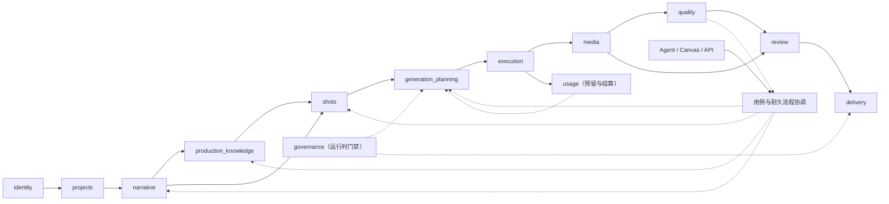

# AI 视频生产平台核心领域与数据模型设计

> 状态：提案 v8，已固定最终 Schema 与无历史数据兼容，待领域与数据评审
> 日期：2026-08-22
> 需求基线：[000-AI 视频生产平台目标需求总览](../requirement/000-AI视频生产平台目标需求总览.md)
> 技术架构：[000-AI 视频生产平台目标系统架构设计](000-AI视频生产平台目标系统架构设计.md)
> 产品边界：[002-AI 视频生产平台目标产品与功能模块设计](002-AI视频生产平台目标产品与功能模块设计.md)
> 范围：领域对象、聚合、表所有权、关系、约束、版本和读模型
> M03/M04 细化：[004-AI 视频生产平台剧本基础分析与人物拆解详细设计](004-AI视频生产平台剧本基础分析与人物拆解详细设计.md)

## 1. 设计结论

平台数据模型必须围绕“可修改的连续内容生产”设计，而不是围绕模型 API 设计。核心链路是：

```text
SourceRevision
  → ImportRun / ParseReport
  → AnalysisRun（根流程；引用三个 M06 AgentRun/child Operation）
  → EpisodeBreakdownRevision / EpisodeBreakdownManifest
  → ContentUnit / ContentUnitOrderRevision
  → NarrativeDraftImport / NarrativeRevision
  → ProductionEntity / ProductionRequirementItem / EntityStateRevision
  → EntityOccurrenceProjection（可重建）
  → Shot / ShotPlanRevision
  → GenerationPlan / GenerationPlanItem
  → Operation / GenerationJob / Attempt
  → MediaArtifact / Candidate / SelectionDecision
  → QualityIssue / RepairPlan
  → ReviewPackage / ReviewDecision
  → AssemblyRevision / DeliveryBuild / DeliverySnapshot
```

其中稳定对象负责身份，Revision 负责内容，Decision 负责人类决定，Plan 负责冻结副作用，Operation 负责可恢复运行，Snapshot 负责交付复现。下列对象不得合并：

- 角色身份不能与角色某次服装状态合并。
- 来源 Mention、稳定 ProductionEntity、ProductionRequirementItem 和 MediaArtifact 不能合并。
- 人物“出现集数”不能写入人物 Profile；它从 approved Scene/Mention/Resolution 重建。
- 镜头身份不能与某版镜头拍法合并。
- 候选输出不能与“当前采用”状态合并。
- 装配草稿不能与正式交付快照合并。
- 生成计划不能与运行任务状态合并。
- 渲染中的交付构建不能与不可变交付快照合并。

## 2. 模块依赖与事实所有权



实线表示主要事实流，虚线表示运行时门禁或公开命令；它们都不是具体语言的 package/import 方向，也不表示可以跨模块直接操作数据表。反向修复由用例/流程协调器提交新命令，不允许 `quality.domain` 直接依赖 `generation_planning.domain`。

| 模块 | 独占写入的表前缀 | 允许引用的外部事实 |
| --- | --- | --- |
| identity | `iam_` | 无 |
| projects | `prj_` | 成员 ID |
| narrative | `nar_` | 项目、内容单元、媒体来源 ID |
| production_knowledge | `pk_` | 叙事锚点、媒体 ID |
| shots | `shot_` | 叙事、实体状态和参考 ID |
| agent | `agent_`、`canvas_` | 任意可读领域对象的 ID/版本 |
| generation_planning | `gen_plan_` | 镜头方案、实体状态、能力、权利和用量版本 |
| execution | `ops_`、`exec_` | 长操作、已批准计划项、提供商连接 |
| media | `media_` | 任务和来源 ID |
| quality | `qa_` | 候选、镜头方案、策略版本 |
| usage | `usage_` | 计划项、任务和尝试 ID |
| review | `review_` | 被审对象的类型、ID、版本和哈希 |
| delivery | `delivery_` | 主选、媒体、审批、权利与质量快照 |
| governance | `gov_`、`audit_` | 主体、媒体、提供商和交付 ID |
| templates_integrations | `tpl_`、`int_` | 已批准版本的不可变引用 |

## 3. 通用数据约定

### 3.1 标识

- 主键统一为时间有序 UUID，不使用自增 ID 对外暴露数量。
- 每个租户数据表包含 `workspace_id`，且所有唯一约束包含工作区。
- 一个对象跨版本保持稳定 ID；修订、决定、任务和快照使用独立 ID。
- 外部提供商 ID 只在 execution 模块中权威保存，其他模块引用内部 Job ID。

### 3.2 通用字段

```text
id                  UUID PK
workspace_id        UUID NOT NULL
created_at          TIMESTAMPTZ NOT NULL
created_by          UUID NOT NULL
updated_at          TIMESTAMPTZ NULL       # 只用于可编辑草稿/运行状态
archived_at         TIMESTAMPTZ NULL
schema_version      SMALLINT NOT NULL
```

修订对象额外包含：

```text
stable_object_id        UUID NOT NULL
revision_no             INTEGER NOT NULL
based_on_revision_id    UUID NULL
status                  revision_status NOT NULL
content_hash            BYTEA NOT NULL
approved_at             TIMESTAMPTZ NULL
approved_by             UUID NULL
```

### 3.3 修订约束

```sql
CREATE UNIQUE INDEX one_revision_number
ON example_revision (workspace_id, stable_object_id, revision_no);

CREATE UNIQUE INDEX one_current_revision
ON example_revision (workspace_id, stable_object_id)
WHERE status = 'current';
```

- `draft` 可编辑，但必须进行乐观并发检查。
- `proposed` 只允许撤回或批准。
- `current` 不允许更新内容字段。
- 新版本批准时，旧 current 与新 current 的切换在同一事务完成。
- `superseded` 和 `archived` 不能重新变为 current。

### 3.4 PostgreSQL 物理类型

| 语义 | 物理类型 | 规则 |
| --- | --- | --- |
| ID | PostgreSQL `UUID` | API 传小写带连字符形式；应用侧生成时间有序 UUID |
| 时间 | `TIMESTAMPTZ` | 以 UTC 写入，API 用 RFC 3339 UTC；不使用无时区时间 |
| 排序/版本/计数 | `INTEGER` 或 `BIGINT` | `ordinal` 从 1 开始，字段级 `CHECK (> 0)` |
| 量值 | `NUMERIC(20, 6)` | 不用浮点保存用量、费用或需要精确比较的数值 |
| 内容哈希 | `BYTEA` | SHA-256 必须 `CHECK (octet_length(field) = 32)`；API 输出 64 位小写十六进制 |
| 状态/类型码 | `TEXT` + `CHECK` | 不使用 PostgreSQL ENUM，避免稳定枚举扩展需要高风险 DDL |
| 扩展负载 | `JSONB` | 只保存有 `schema_version` 和体积上限的值对象/诊断；不存外键数组、current 指针或需约束的业务事实 |
| 源文范围 | `BIGINT` 起止半开区间 | 以 grapheme index 表达 `[start, end)`，不以 UTF-8 byte offset 对外 |

`created_at` 与 `created_by` 是业务事实的必填字段；只追加的 Revision/Decision/Event 不设业务可修改的 `updated_at`。可编辑聚合使用显式 `revision BIGINT NOT NULL` 进行 CAS，不用时间戳充当并发版本。

### 3.5 租户、外键与删除规则

- 每个租户表除主键外都建立 `UNIQUE (workspace_id, id)`；租户内外键必须以 `(workspace_id, target_id)` 引用目标的 `(workspace_id, id)`，数据库层阻止跨工作区关联。
- 带 Project 的子对象同理用 `(workspace_id, project_id)` 或更完整的联合键校验归属；Service 的权限检查不取代数据库约束。
- Revision、Decision、Manifest、Outbox 和审计证据不物理级联删除；稳定对象优先 `archived_at`/状态转移。只有已明确可重建且未被冻结引用的 Projection/lease 允许级联清理。
- API 连接执行 `SET LOCAL app.workspace_id` 并对租户表启用 RLS 作防御线；仅空库 Schema Initialization 使用受控 owner 账号，业务账号不得以 owner 身份绕过 RLS；不配置运行期结构修改账号。
- 每张表只有一个模块拥有写入权。跨模块用例经公开 Service/Command 协调，不通过共享 ORM 模型修改他模块表。

### 3.6 约束与索引命名

| 对象 | 命名 | 建立原则 |
| --- | --- | --- |
| 主键 | `pk_<table>` | 默认 `id` |
| 唯一约束 | `uq_<table>_<semantic>` | 表达业务不变量，不依赖 Service 先查后写 |
| 外键 | `fk_<table>_<target>` | 租户表默认使用 workspace 联合外键 |
| 检查 | `ck_<table>_<rule>` | 状态集、二选一、数值范围和哈希长度必须下沉 |
| 索引 | `ix_<table>_<access_path>` | 从已定义查询和 Worker 扫描反推，避免与 unique/PK 重复 |

每个核心表至少覆盖三类访问路径：`(workspace_id, id)` 定位、所属聚合下的稳定排序查询，以及局部唯一的 active/current 约束。Worker 的 claim 索引将状态与 `available_at` 放在前部，读模型的游标索引必须与公开排序完全一致。新增复合索引要在代表性数据上用 `EXPLAIN (ANALYZE, BUFFERS)` 验证，不预建“可能会用”的索引。

### 3.7 事务、Outbox 与投影切换

- 领域事实、current 指针变更和 Outbox 记录必须在一个 PostgreSQL 事务内提交；不允许先发 RabbitMQ 再补写数据库。
- 投影重建先写 `building` 版本，验证基线与完整度后在短事务中以 partial unique current 切换；失败版本不覆盖旧 current。
- 通用幂等记录只存请求哈希、结果引用和安全摘要；不复制剧本正文、媒体、Prompt 或凭据。

### 3.8 金额与资源单位

平台不实现商业计费，但需要记录外部资源消耗。所有用量记录由 `quantity_decimal + unit_code + rate_revision_id` 表示，例如 `video_second`、`image_generation`、`token`、`gpu_second`。如提供商返回实际费用，可作为运维对账值保存，但不能被复用成客户账单模型。

### 3.9 媒体时间与时间线单位

- 项目 Brief 以 `frame_rate_num/frame_rate_den` 保存有理帧率，例如 30000/1001；不使用浮点 `29.97` 作为权威值。
- Assembly 的画面位置保存整数 `timeline_tick` 和固定 `timeline_timebase`；媒体入出点保存原 Artifact 的整数 PTS 与 `time_base_num/time_base_den`。
- 字幕、音频 Cue、评论和质量证据必须绑定 Artifact/Assembly 修订及其时间基，不能只保存一个无来源的浮点秒数。
- 帧率转换、变速和重采样必须记录舍入规则；最终帧数、时长和音频采样数由 RenderPlan 确定并进入交付 Manifest。

### 3.10 MinIO 对象引用与版本约定

目标部署固定使用私有 MinIO，但领域与应用层只依赖 `ObjectStoragePort`，不得导入 MinIO SDK、保存客户端对象或把对象路径当成业务身份。`MediaArtifact`、Agent payload、SourceRevision 和 DeliverySnapshot 都使用自己的逻辑 ID；物理对象位置统一使用不可变 `StorageObjectRef` 值，至少包含：

```text
storage_profile       TEXT NOT NULL     # 解析到当前环境的 MinIO 集群与服务身份，不是终端用户输入
bucket                TEXT NOT NULL
object_key            TEXT NOT NULL
object_version_id     TEXT NOT NULL     # MinIO object version ID（S3-compatible API versionId）；与 MediaArtifact 版本不是同一概念
size_bytes            BIGINT NOT NULL
content_sha256        BYTEA NOT NULL
etag                  TEXT NULL         # 只作存储观测/对账，绝不是平台内容哈希
```

- 上传尚未完成时可以只冻结 `storage_profile + bucket + object_key`；一旦对象进入 committed/ready、被 Proposal/Manifest 引用或受保留策略保护，`object_version_id + size_bytes + content_sha256` 必须齐全且不可修改。
- 对同一逻辑对象迁移或恢复存储位置时追加新的 Location/StorageObjectRef，并保留旧位置历史；不得把“active location 变化”伪装成媒体内容版本变化。读取只能解析到哈希一致的 verified location，不能在精确 version 缺失时静默读取同 key 的 latest version。
- 对象键由服务端生成，不包含邮箱、项目标题、原文件名或 Candidate/Selection 等业务决定；API、事件和日志只返回逻辑引用，只有受限上传 capability 或下载网关可以短时暴露传输信息。
- MinIO ETag 在 multipart、服务端加密或实现变化时都不等于 SHA-256。完整性验收必须由受信任服务流式计算 SHA-256，或校验等价的受信任 checksum；调用方声明和 HEAD/ETag 不能单独使对象 ready。
- `ObjectStoragePort` 必须支持精确 version 的 stat/read/copy/delete、幂等上传/发布对账和 LegalHold/retention 能力探测。MinIO 特有请求、错误与 receipt 只存在于基础设施适配器；领域只消费稳定错误码、版本化对象引用和追加式结果。

## 4. M01 组织、身份与访问数据

### 4.1 聚合

`Workspace` 是租户根；`Membership` 是用户在工作区内的授权根。用户全局身份与工作区成员关系分离。

### 4.2 表

| 表 | 关键字段 | 约束 |
| --- | --- | --- |
| `iam_workspace` | name、status、policy_revision_id | status 为 active/suspended/archived |
| `iam_user` | identity_subject、display_name、status | identity_subject 全局唯一 |
| `iam_membership` | workspace_id、user_id、role_id、status | 每工作区/用户唯一 |
| `iam_role` | code、scope、is_system | 系统角色不可删除 |
| `iam_role_permission` | role_id、permission_code | 唯一组合 |
| `iam_project_grant` | project_id、membership_id、role_id | 不得扩大工作区角色的禁止项 |
| `iam_policy_revision` | policy_json、status、content_hash | current 唯一 |
| `iam_service_identity` | scopes、expires_at、status | 必须有到期时间和负责人 |

### 4.3 权限检查输入

权限决策至少读取：主体、工作区角色、项目角色、对象工作区、命令、对象状态、策略版本和必要的双人批准条件。API 不接受客户端直接传入“我是管理员”。

## 5. M02 项目与内容单元数据

### 5.1 聚合

- `Project`：制作范围、成员和总体状态。
- `ProjectBriefRevision`：目标、规格、约束和资源上限。
- `ContentUnit`：一集、一个广告变体或可独立交付单元。
- `ContentUnitMaterialization`：把 M03 approved EpisodeBreakdownManifest 私有、幂等地映射为稳定 ContentUnit 与一次 OrderRevision 发布。

### 5.2 表

| 表 | 关键字段 | 约束 |
| --- | --- | --- |
| `prj_project` | kind、status、current_brief_revision_id | archived 后禁止新计划 |
| `prj_brief_revision` | target_platforms、audience、target_duration_ticks、aspect_ratio、width/height、frame_rate_num/den、audio_sample_rate、language、quality_tier、usage_cap | current 唯一 |
| `prj_content_unit` | project_id、kind、title、status | 稳定身份 |
| `prj_content_order_revision` | project_id、status、content_hash | 批准后冻结 |
| `prj_content_order_item` | order_revision_id、content_unit_id、ordinal | 同修订 ordinal/内容单元分别唯一 |
| `prj_content_unit_materialization` | manifest_id/hash、parent_id、base_order_revision_id、status、result_hash、idempotency_key | completed 前不对普通查询可见；同 Manifest 幂等 |
| `prj_content_unit_materialization_item` | materialization_id、temporary_key、content_unit_id、item_status、lineage_ref | key/ContentUnit 在同清单内各唯一；逐项可续做，最后原子发布 order current |
| `prj_milestone` | type、due_at、status | 完成由事实事件驱动 |
| `prj_progress_projection` | counts_json、blockers_json、calculated_at | 仅读模型，可重建 |

项目状态：`draft → active → paused → completed → archived`。暂停阻止新执行，不取消已有外部任务；归档前必须处理进行中任务。

## 6. M03 导入与叙事理解数据

### 6.1 聚合

- `SourceRevision`：上传原件或文本输入的不可变记录。
- `ImportRun`：确定性文件导入、解析与恢复的执行聚合；不表示整本剧本业务分析是否完成。
- `AnalysisRun`：整本剧本分析的根业务流程，持有根 Operation、当前 stage/gate 和跨模块结果引用；不保存 Agent checkpoint。
- `AnalysisStage`：`breakdown`、`narrative`、`knowledge` 中某一代 stage 的业务索引，关联一个可选 M06 AgentRun 与 child Operation；门禁后的下一 stage 必须新建记录。
- `EpisodeBreakdownRevision`：整本来源的剧集边界、临时 key、覆盖和人工决议；不等于 ContentUnit。
- `EpisodeBreakdownManifest`：approved 不可变拆集清单，供 M02 物化。
- `NarrativeDraftImport`：把 narrative stage 的逐 ContentUnit 结果写入私有 building revision 的 staging 聚合；Finalize 后才产生普通查询可见的 NarrativeRevision draft。
- `NarrativeRevision`：一次完整结构化叙事版本。
- Scene、Beat、Dialogue 等属于 NarrativeRevision 的内容节点，不独立成为 current。

### 6.2 表

| 表 | 关键字段 | 约束 |
| --- | --- | --- |
| `nar_source_revision` | project_id、可选 content_unit_id、artifact_id、source_type、hash | artifact_id 指向 M09 不可变 MediaArtifact；原件不可覆盖；整本首次拆集允许只绑定 Project，不能复制 MinIO bucket/key |
| `nar_import_run` | project_id、source_manifest_hash、parser_config_hash、operation_id、status | 只跟踪确定性导入/解析；同来源与解析配置按幂等键复用，不承载三段 Agent 门禁 |
| `nar_import_input` | import_run_id、source_revision_id、ordinal、content_hash | 按序引用不可变来源，不复制正文 |
| `nar_parse_report` | import_run_id、parser_version、page_status_json、warnings、result_hash | 只追加；同 run/sequence/result hash 幂等 |
| `nar_analysis_run` | project_id、source_manifest_hash、root_operation_id、analysis_contract_version、current_stage、current_gate、current_stage_generation、nullable current_child_agent_run_id、status、input_hash | 整本分析唯一根流程；root Operation 只由 M03 Application Service 完成，不由 child AgentRun 完成；取消/重试和迟到回执按 current stage generation 校验 |
| `nar_analysis_input` | analysis_run_id、source_revision_id、ordinal、content_hash、nullable import_run_id | 冻结 ordered SourceRevision 集；ImportRun 仅作为解析来源引用 |
| `nar_analysis_stage` | analysis_run_id、stage、stage_generation、nullable agent_run_id、nullable child_operation_id、basis_refs_json、input_snapshot_hash、result_refs_json、status | `(analysis_run_id, stage, stage_generation)` 唯一；同代 AgentRun/child Operation 各唯一；门禁通过后新建下一 stage，不复活旧 AgentRun |
| `nar_episode_breakdown_revision` | analysis_run_id、origin_ref、status、rule_version、segmentation_hash、coverage_hash | approved 后不可改，current CAS；Agent 来源只保存 M06 ProposalItem 引用，不复制其信封/决定 |
| `nar_episode_candidate` | breakdown_revision_id、temporary_key、ordinal、title、rule_code、confidence、decision | 同修订 key/ordinal 唯一；边界不内嵌外键数组 |
| `nar_episode_source_range` | breakdown_revision_id、nullable candidate_id、source_revision_id、disposition、start/end_grapheme、ordinal、ignore_reason | `candidate` 范围必须归属一个 Candidate，`ignored` 范围必须有原因；同修订/来源不重叠，服务校验完整覆盖 |
| `nar_episode_manifest` | breakdown_revision_id、manifest_hash、approved_by/at | 只由 approved revision 生成 |
| `nar_episode_content_unit_mapping` | manifest_id、materialization_result_hash、order_revision_id、temporary_key、content_unit_id | temporary key/ContentUnit 双向唯一；只接 M02 完整结果 |
| `nar_narrative` | project_id、current_revision_id | 稳定身份；首期一个整本基线可包含多个 ContentUnit，不新增 NarrativeBundle |
| `nar_narrative_draft_import` | analysis_run_id、manifest_id/hash、mapping_id/hash、order_revision_id/hash、building_revision_id、basis_hash、revision、status、expected_item_count、applied_item_count、item_set_hash、failed_scopes_json | building revision 私有；同分析/basis 幂等；Finalize 对 import revision + 完整 item set/hash 做 CAS，所有 ContentUnit 成功应用/人工补齐、无 failed scope 且覆盖校验通过后才切换可见 draft |
| `nar_narrative_draft_import_item` | draft_import_id、content_unit_id、item_generation、slot_revision、origin_ref、command_schema_version、payload_ref/hash、item_status、result_hash、member_mapping_hash | `(draft_import_id, content_unit_id, item_generation)` 与 `(draft_import_id, content_unit_id, result_hash)` 唯一且同 ContentUnit 最多一代 active；Apply 只 CAS 本 slot，不使用整个 building revision；origin_ref 可指 M06 ProposalItem 或人工命令；大型 payload 只保存受限不可变引用 |
| `nar_narrative_revision` | analysis_run_id、nullable draft_import_id、breakdown_revision_id、mapping_id、based_on_id、status、summary、content_hash | draft/proposed/approved/current 显式；current 唯一，正式下游只读 approved/current |
| `nar_narrative_source` | narrative_revision_id、source_revision_id、purpose、ordinal | 组合唯一，可做外键与来源顺序校验 |
| `nar_scene` | narrative_revision_id、content_unit_id、ordinal、purpose、time、location_hint | 同修订/content unit ordinal 唯一；不得跨集 |
| `nar_beat` | scene_id、ordinal、goal、conflict、emotion_before/after | 归属同修订 |
| `nar_dialogue_line` | beat_id、speaker_hint、kind、text、source_anchor_id | 归属同修订；保留原始说话人 hint，不在 Mention 建立前形成循环外键 |
| `nar_dialogue_participant` | dialogue_line_id、mention_id、role | `speaker \| addressee \| referenced`；两个对象落库后建立关系，同对话/role/Mention 唯一 |
| `nar_source_anchor` | source_revision_id、block_id、nullable page/paragraph、start/end_grapheme、exact_hash、context_hash | grapheme 范围合法并能对不可变来源重读验证；offset 仅作内部优化 |
| `nar_extraction_proposal` | target_type、payload、confidence、anchor_ids、decision | 未批准不成为事实 |
| `nar_production_element_mention` | narrative_revision_id、content_unit/scene/beat/dialogue_id、element_type、surface_text、participation_kind、status | Mention 不因实体决议删除；正式 M04 只读 approved/current 修订 |
| `nar_mention_anchor` | mention_id、source_anchor_id、role、ordinal | Mention 至少一个 `primary` 证据；不使用 JSONB/UUID 数组保存外键 |
| `nar_global_occurrence_projection` | basis_revision_id、breakdown_revision_id、status、completeness、failed_scopes、as_of | 可从 Scene/Mention 重建，分页游标绑定投影版本 |

### 6.3 实现规则

- ImportRun 只负责确定性导入和 ParseReport；AnalysisRun 负责 `breakdown → Manifest 批准/M02 物化 → narrative → Narrative 批准 → knowledge/M04 preflight` 根流程。每个 M06 AgentRun 只对应一条 AnalysisStage 和一个 child Operation，child 完成只能让根流程进入相应 `waiting_user` 门禁。
- AnalysisRun/AnalysisStage 只保存业务状态、不可变输入/结果引用和恢复摘要；LangGraph thread/checkpoint 属于 Agent Runtime 存储，不得用 checkpoint 推断 Manifest、Narrative、M04 current 或根流程 completed。
- narrative stage 先创建 NarrativeDraftImport，再按稳定 ContentUnit 独立 Apply；Item 的 CAS 键为 `draft_import_id + content_unit_id + item_generation`，不得用 DraftImport 整体 `updated_at` 让不相交剧集互相冲突。Finalize 在独立短事务中复核全部 Item、整本 coverage、Manifest/mapping/Order basis 后把 building revision 切换为可见 draft，但不自动批准 NarrativeRevision。
- ImportRun 状态只覆盖导入执行：`queued → parsing → analyzing → waiting_user | partial | completed | failed | cancelled | superseded`。AnalysisRun 使用可重复的 stage/gate 状态：`queued → analyzing(breakdown) → waiting_user(breakdown_review) → materializing → analyzing(narrative) → waiting_user(narrative_review) → analyzing(knowledge) → waiting_user(knowledge_review) → preflighting → completed`；任一活动状态可进入 `partial | failed | cancelling → cancelled | superseded`，恢复时追加 AnalysisStage generation，不复活终态 AgentRun。
- AnalysisStage 为 `requested → running → result_committed → waiting_gate → closed`，并允许 `partial | failed | cancelled | superseded`；NarrativeDraftImport 为 `building ↔ partial → ready_to_finalize → finalized`，并允许从非终态进入 `stale | cancelled`。每个 ContentUnit slot 为 `pending → applied | manual_filled | failed`；拒绝/暂缓 Agent item 后 slot 仍 pending，failed scope 必须成功重试或人工补齐。`finalized` 只表示 narrative draft 可见，`closed` 只表示对应业务门禁已处理，二者都不等于 approved/current。
- 一次叙事修订内的 Scene/Beat 使用内部 UUID，方便镜头引用和差异匹配。
- 新来源版本通过确定性锚点、文本相似度和人工确认迁移旧节点，不按数组位置盲目覆盖。
- 提取置信度只用于排序；M03 原生候选的人工决议与 M06 append-only ProposalDecision 分开保存，任何一方都不能推断另一方已批准业务事实。
- EpisodeBreakdown approved 后先由 M02 物化 ContentUnit mapping；M03 不按 ordinal/title 猜稳定 ID，也不跨表创建 ContentUnit。
- 全局 occurrence 草稿索引显示 `complete/incomplete/stale` 和失败范围，零项不等于未分析。
- NarrativeRevision 批准后发布事件，镜头模块只生成新提案，不自动改变已批准镜头。

## 7. M04 生产知识与一致性图谱数据

### 7.1 聚合

- `ProductionEntity`：稳定身份，如角色“林夏”。
- `UnresolvedSubjectRevision`：绑定 approved NarrativeRevision、由不可变 Mention 成员集合定义的未决主体分组；不是 ProductionEntity 或短期模型 Cluster。
- `NameRevision` / `CharacterProfileRevision`：实体名称和人物长期资料的追加式版本。
- `EntityStateRevision`：在某范围生效的具体状态，如“第二场开始穿黑色外套”。
- `EntityRelationRevision` / `CharacterArcRevision`：语义关系和人物弧光版本，不与依赖投影混同。
- `ReferenceBinding`：参考媒体或已发布规则修订对实体状态/镜头的用途和强度，只保存稳定引用。
- `ProductionRequirementItem / Revision`：从 approved Mention/Scene 得出的稳定生产需要及不可变用途、变体、数量、范围、证据和决议修订，不等于媒体且不内嵌 readiness。
- `ProductionCoverageSchemaRevision`：固定 coverage universe 的 Mention/Scene 纳入规则、生产类型与校验规则；发布后不可变。
- `ProductionCoverageDecision`：对 coverage universe 某个 Mention/Scene 的 relevance、处理结果与 RequirementRevision refs 的不可变权威决定。
- `ProductionRequirementInventoryProjection`：绑定叙事/消歧/CoverageSchema/coverage decision/requirement 完整基线，证明每个 coverage subject 已决或列为 unassessed 的可重建全剧清单。
- `RequirementReadinessProjection`：从需求修订、ReferenceBinding 与媒体可用性重建的准备度。
- `EntityOccurrenceProjection`：`entity | unresolved_cluster`↔ContentUnit/Scene/Beat/Mention 双向可重建索引，携带 failed scopes 与 resolution coverage counters，不是人物资料。
- `WorldRuleRevision` / `StyleRuleRevision`：项目级约束。

### 7.2 表

| 表 | 关键字段 | 约束 |
| --- | --- | --- |
| `pk_entity` | project_id、type、status | 项目内稳定身份；名称和资料不在本表原地覆盖 |
| `pk_entity_name_revision` | entity_id、canonical_name、aliases、reason、status | 只追加；同实体 current 唯一，重命名不改实体 ID |
| `pk_unresolved_subject_revision` | project_id、narrative_revision_id、based_on_id、element_type、label、status、member_set_hash、actor/reason | 创建即不可变；split/merge 新建 revision；M03 Cluster 只可作为 proposal ref |
| `pk_unresolved_subject_member` | unresolved_subject_revision_id、mention_id、ordinal | Mention 来自绑定 approved NarrativeRevision；同 revision/member 唯一；集合非空；同一 Mention 不得同时属于多个 active 未决主体 |
| `pk_mention_resolution` | mention_id、narrative_revision_id、action、nullable entity_id、nullable unresolved_subject_revision_id、status、actor/reason | 每个 approved character Mention 恰有一个 current；entity/unresolved subject 严格二选一（explicit reject 可均空）；未决引用必须与 active member 集一致；只引用 approved Mention，不改 M03 Mention |
| `pk_production_requirement_item` | project_id、stable_key、status | 稳定需求身份；不保存媒体或准备度 |
| `pk_production_requirement_revision` | item_id、type、purpose、variant、effective_scope_id、quantity/unit、decision、status | decided 后不可变；不含 readiness；不创建媒体 |
| `pk_production_requirement_subject` | requirement_revision_id、subject_kind、nullable entity_id/unresolved_subject_revision_id/coverage_subject_id、ordinal | 按 subject_kind 三个外键恰有一个非空；不使用 `subject_type/ref` 字符串绕过外键 |
| `pk_production_requirement_evidence` | requirement_revision_id、source_anchor_id、ordinal | 同修订/证据唯一，必须回到该修订绑定 Narrative 的来源 |
| `pk_production_coverage_schema_revision` | project_id、based_on_id、schema_version、mention_inclusion_rules、scene_inclusion_rules、requirement_type_rules、status、content_hash | 项目 current 唯一；published 后不可变；历史 Inventory 始终引用原 revision/hash |
| `pk_production_coverage_subject` | narrative_revision_id、coverage_schema_revision_id、subject_kind、nullable mention_id/scene_id、subject_key_hash | 按 kind 恰有一个目标外键非空；同 Narrative/Schema/target 唯一；决议不引用多态字符串 |
| `pk_production_coverage_decision` | narrative_revision_id、coverage_subject_id、production_relevance、result、status、actor/reason | 创建即不可变；新 decision supersede 旧版；Inventory 不反写此权威事实 |
| `pk_production_coverage_requirement` | coverage_decision_id、requirement_revision_id、ordinal | 用关系表约束 Requirement 引用；`required` 至少一项，`not_required \| rejected` 必须为零项 |
| `pk_requirement_readiness_projection` | requirement_revision_id、nullable reference_revision_set_hash、status、readiness、reasons、as_of、input_hash | required 才检查 Reference/Media；deferred=blocked/decision_deferred；not_required/rejected=not_applicable；媒体变化不改需求修订 |
| `pk_production_requirement_inventory_projection` | project_id、narrative_revision_id、narrative_view_basis_hash、unresolved_subject_set_hash、resolution_set_hash、coverage_schema_revision_id、coverage_schema_hash、coverage_decision_set_hash、requirement_revision_set_hash、status、completeness、failed_scopes、assessed_subjects、unassessed_subjects、as_of、input_hash | 一个投影版本只接受一套完整基线组合；Schema 换版使旧 current stale；current 要求 complete、failed_scopes 为空、unassessed=0；可丢弃重建 |
| `pk_production_requirement_inventory_item` | inventory_projection_id、coverage_subject_id、nullable coverage_decision_id、coverage_status、unassessed_reason | coverage universe 每个成员恰有一行；缺权威决定时 decision_id 为空并具名 unassessed reason |
| `pk_inventory_item_requirement` | inventory_item_id、requirement_revision_id、ordinal | 投影内可链接零到多个 Requirement；投影版本删除时可一同重建 |
| `pk_entity_occurrence_projection` | project_id、narrative_revision_id、narrative_view_basis_hash、order_revision_id、unresolved_subject_set_hash、resolution_set_hash、status、completeness、failed_scopes、resolved_mentions、unresolved_mentions、rejected_mentions、unassigned_mentions、overlap_mentions、as_of、input_hash | 可丢弃重建；同基线组合版本唯一；current 要求 failed_scopes 为空且 approved character Mention 恰有一个 current 结果，缺失/重叠不得投影为零人物 |
| `pk_entity_occurrence_item` | projection_id、subject_type、entity_id、unresolved_subject_revision_id、content_unit/scene/beat/mention_id、participation_kind、source_anchor_id | subject_type=`entity\|unresolved_cluster`；entity_id/unresolved_subject_revision_id 严格二选一；不回写 Profile |
| `pk_character_profile_revision` | entity_id、based_on_narrative_revision_id、summary、status | 人物长期资料版本；同实体 current 唯一 |
| `pk_attribute_fact` | subject_id、predicate、value_json、value_schema_version、assertion、status | accepted AI 事实必须关联证据 |
| `pk_attribute_evidence` | fact_id、source_anchor_id、proposal_id、decision_id | 事实证据可回到固定来源与人工决议 |
| `pk_entity_state_revision` | entity_id、facet_code、attributes_json、effective_scope_id、status | current 按实体/属性面/显式成员唯一 |
| `pk_entity_relation_revision` | from_entity_id、relation_type、to_entity_id、direction、effective_scope_id、status | 语义关系版本化；自引用与循环按关系类型策略校验 |
| `pk_character_arc_revision` | entity_id、narrative_revision_id、effective_scope_id、summary、status | 同实体/叙事范围 current 唯一 |
| `pk_character_arc_beat` | arc_revision_id、beat_id、phase、effect | Beat 必须属于绑定 NarrativeRevision |
| `pk_effective_scope` | content_unit_id、basis_revision_type/id、scope_kind、content_hash | 发布后不可变；显式记录解析范围使用的基线修订 |
| `pk_effective_scope_member` | scope_id、member_type、member_id、member_revision_id | ContentUnit/Shot 可直接引用稳定 ID；Scene/Beat 必须引用所属不可变 NarrativeRevision |
| `pk_reference_binding` | owner_type/id/revision、target_type、artifact_or_rule_revision_id、purpose、weight、effective_scope_id | target 为 M09 媒体/主选或 M04 已发布 RuleRevision；owner 版本和用途必填，只保存引用 |
| `pk_world_rule_revision` | scope_type/id、rules_json、precedence、status | 同范围 current 唯一 |
| `pk_style_rule_revision` | scope_type/id、visual_json、audio_json、negative_rules、precedence | 同范围 current 唯一 |
| `pk_impact_report` | change_set_hash、affected_refs_json、usage_estimate_id | 输入相同可复用 |

### 7.3 属性模型

实体属性分为：

- 身份属性：姓名、外观核心特征；更改需要高强度影响分析。
- 状态属性：服装、妆造、伤痕、持有物、情绪；带生效范围。
- 软提示：可被镜头局部覆盖的表现建议。
- 禁止项：提示编译和质量策略必须读取的负向规则。

不把所有属性塞进自由 JSON。高频查询和约束字段应标准化；长尾可扩展属性保留 Schema 版本。

用户输入“从第三场开始”或“后面五个镜头”时，发布命令必须基于明确的 NarrativeRevision/ShotOrderRevision，将自然范围解析成不可变的 `pk_effective_scope_member` 快照并预览成员。ContentUnit/Shot 使用稳定 ID；NarrativeScene/Beat 使用“所属不可变 NarrativeRevision + 修订内成员 ID”，不得宣称跨叙事版本稳定。之后的叙事替换或镜头重排不会改变历史成员；需要随新结构变化时，用户发布新的 Scope 和 EntityStateRevision。

同一实体、同一 `facet_code`、同一成员不能同时解析出两个同优先级 current 状态。默认优先级固定为 `project < content_unit < narrative_scene < beat < shot`；相同层级、相同成员的互斥 current 状态阻止发布。跨叙事范围和镜头范围无法比较时必须在预检中要求用户选择，不能依赖数组顺序决定覆盖。

### 7.4 影响图

引用边单独存储为 `pk_dependency_edge` 投影：

```text
source_type / source_id / source_revision_id
target_type / target_id / target_revision_id
dependency_kind
strength = hard | soft
created_from_event_id
```

它是可重建读模型，不是各业务模块事实的复制。上游变更先遍历 hard/soft 边形成 ImpactReport，再由用户决定创建哪些新修订或计划。

`pk_entity_relation_revision` 表达人物、场景、道具之间的业务语义，可以出现双向或成环关系；`pk_dependency_edge` 表达版本依赖。只有声明为有向无环的 `dependency_kind` 才执行环检测，不能把人物关系的环误判为依赖错误。

## 8. M05 分镜与镜头数据

### 8.1 聚合

- `Shot`：稳定镜头身份。
- `ShotPlanRevision`：某版拍法。
- `ShotOrderRevision`：内容单元内的播放顺序。
- `AnimaticRevision`：预演引用的镜头方案、帧和时间。
- `AudioCue` / `AudioCueRevision`：对白表演、旁白、环境声、音效或音乐意图及其时间范围。

### 8.2 表

| 表 | 关键字段 | 约束 |
| --- | --- | --- |
| `shot_shot` | content_unit_id、lineage_parent_ids、status | 稳定身份 |
| `shot_plan_revision` | shot_id、purpose、framing、camera、motion、duration、audio_intent、status | current 唯一 |
| `shot_narrative_binding` | shot_plan_revision_id、scene_id、beat_id、coverage_kind | 引用同内容单元批准叙事 |
| `shot_entity_binding` | shot_plan_revision_id、entity_id、state_revision_id、role | 状态范围必须覆盖镜头 |
| `shot_dependency` | from_shot_id、to_shot_id、kind | 时间/连续性依赖禁止非法循环 |
| `shot_order_revision` | content_unit_id、status、content_hash | 批准后冻结 |
| `shot_order_item` | order_revision_id、shot_id、ordinal | 同修订 ordinal/镜头分别唯一 |
| `shot_storyboard_frame_binding` | shot_plan_revision_id、position、selection_decision_id、purpose | 只引用 M09 确定选择，不复制 Candidate/Selection |
| `shot_animatic_revision` | order_revision_id、frame_refs、audio_refs、status | 批准后冻结 |
| `shot_audio_cue` | content_unit_id、shot_id、kind、status | 稳定身份；shot_id 可空但必须与 content_unit 一致 |
| `shot_audio_cue_revision` | audio_cue_id、voice_entity_state_id、text、performance_json、start/end_tick、status | 时间使用项目/装配时间基，current 唯一 |

### 8.3 拆分与合并

- 拆分创建新 Shot，并记录 `lineage = split_from`；旧 Shot 标记 superseded，不删除。
- 合并创建新 Shot，记录多个 `merged_from`；旧镜头的候选不自动成为新镜头候选。
- 叙事覆盖率按 Beat 的 CoverageRequirement 计算；拆分合并后必须保持覆盖守恒或明确记录缺口。

## 9. M06 Agent 与画布数据

| 表 | 关键字段 | 规则 |
| --- | --- | --- |
| `agent_session` | project_id、actor_id、scope、status | 会话不是事实源 |
| `agent_instruction` | session_id、text、attachments、created_at | 敏感输入遵循保留策略 |
| `agent_run` | workspace_id、project_id、nullable session_id、initiator_principal_ref、nullable actor_ref、service_identity_ref、trace_id、request_idempotency_key/request_hash、skill_id/version、stage/stage_generation、nullable parent_workflow_type/id、nullable root_operation_id、operation_id、graph_id/version、input/result_contract_version、scope_refs_json、allowed_tools_json、allowed_command_schema_set_ref/hash、model_profile_revision、input_snapshot_ref/hash、usage_cap、governance_evaluation_id、status、runtime_thread_ref、started/completed_at | workspace/project 使用复合外键并参与 RLS；会话和 parent/root 可空，initiator 统一用户/服务发起者，actor 只在人类发起时存在；`(workspace_id, initiator_principal_ref, request_idempotency_key)` 唯一，同 request hash 回读、异 hash 冲突；request hash 覆盖全部不可变语义字段；operation_id 是该 Run 自身 Operation，parent workflow 存在时才挂 root；不复制 checkpoint，不代表根 AnalysisRun 或 GenerationJob 完成 |
| `agent_run_snapshot_ref` | agent_run_id、sequence、resource_type/id、nullable revision_id、content_hash、scope_role | 规范化保存 Run 启动时的只读 based-on snapshot；同 Run/ref/role 唯一，精确还原模型看到的版本集合 |
| `agent_run_result` | agent_run_id、sequence、result_hash、proposal_count、advisory_count、evidence_refs_json、usage_json、partial_errors_json、checkpoint_ref、committed_at | 只追加；`(agent_run_id, sequence)` 唯一，同 sequence 不同 hash 隔离审计；advisory_count 是该 Result 的 membership 数，不是本次新建 Advisory 行数 |
| `agent_stage_result_payload` | workspace_id、agent_run_id、item_key、request_idempotency_key/request_hash、content_type、max_size/size、expected_hash/content_hash、storage_profile/bucket/object_key/object_version_id、etag、capability_id、status、expires_at、retention_until、committed_at | `(agent_run_id, item_key, request_idempotency_key)` 与 capability_id 唯一；run/item-scoped capability 只允许写服务端分配的 MinIO key，流式校验 hash/size 后才冻结精确 object version 并 committed；同 capability/request + 同 hash 在响应丢失后回读原 payload_ref，异 hash 冲突；Worker 无通用对象存储凭据；未引用对象由孤儿清理，已引用者按保留策略保存 |
| `agent_proposal` | agent_run_id、result_sequence、summary、default_expires_at、proposal_hash | 会话通过可空的 AgentRun 关联，不重复 session_id；同 run/result/proposal hash 幂等唯一；Run 快照只用于来源复现，不作为整批 Item 的共享可变 CAS |
| `agent_proposal_item` | proposal_id、sequence、target_module、command_type、command_schema_version、command_payload_json、command_payload_ref、payload_hash/size、read_set_hash、write_set_hash、conflict_scope_keys_json、evidence_refs_json、change_summary_ref、confidence_json、uncertainty_refs_json、conflict_refs_json、impact_summary_ref、usage_estimate_ref、required_capabilities_json、external_effect、expires_at、item_hash | Item 创建后不可变，item_hash 覆盖全部信封/置信/不确定/diff/read-write 字段；inline payload/ref 严格二选一；canonical read/write set 和字段 diff 由目标模块 Preview 生成，不能信任模型声明；目标模块拥有 Command Schema 与写入语义 |
| `agent_proposal_item_read_ref` | proposal_item_id、sequence、resource_type/id、nullable revision_id、content_hash、read_role | Item 的最小语义依赖；同 Item/ref/role 唯一；接受时逐项重读 |
| `agent_proposal_item_write_ref` | proposal_item_id、sequence、target_module、resource_type、resource_key、write_kind、expected_version、cas_token | 声明目标模块的逻辑冲突槽，不是数据库补丁；同 Item/resource key 唯一 |
| `agent_proposal_decision` | proposal_item_id、decision_generation、actor_id、request_idempotency_key、request_hash、action、expected_item_hash、expected_latest_decision_generation、nullable effective_payload_json/ref/hash、nullable effective_read_set_hash/effective_write_set_hash、reason、decided_at | append-only；`(proposal_item_id, decision_generation)` 与 `(proposal_item_id, actor_id, request_idempotency_key)` 唯一；同请求键同 hash 回读、不同 hash 冲突；expected generation CAS 使并发决定只成功一个；accept 记录原 payload hash，accept_with_changes 的有效 inline/ref 严格二选一，reject/defer/undefer 不得带 payload/read-write set |
| `agent_proposal_execution` | execution_id、decision_id、command_idempotency_key、status、last_attempt_no、nullable terminal_receipt_id、created/completed_at | 每个 accept/accept_with_changes Decision 最多一个逻辑执行；decision_id 与 command_idempotency_key 分别唯一；所有 attempt 复用该稳定 command key，响应丢失时由目标模块回读同一结果；success/terminal_failure 用 CAS 终结，`(execution_id, terminal_receipt_id)` 复合外键只能指向本 Execution 的 Receipt；终局 target result/revision 只从该 Receipt 读取，不在 Execution 复制而产生分叉 |
| `agent_proposal_receipt` | receipt_id、execution_id、attempt_no、status、nullable target_result_ref/target_revision_ref、idempotency_replayed、error_code、recovery_actions_json、executed_at | append-only 的执行尝试回执；receipt_id 为主键，`(execution_id, receipt_id)` 与 `(execution_id, attempt_no)` 唯一，前者供 Execution 的 terminal receipt 复合外键；command key 只从父 Execution 读取且不得在 Receipt 上再设唯一约束；多个 attempt 可复用同一 key，最多一个 success，其余明确为 failed/unknown/replayed |
| `agent_advisory_item` | advisory_id、agent_run_id、logical_key、generation、nullable supersedes_id、kind、code、summary、based_on_refs_json、evidence_refs_json、scope_refs_json、recommended_actions_json、item_hash | 非可执行且内容不可变；advisory_id 为主键，`(agent_run_id, advisory_id)` 与 `(agent_run_id, logical_key, generation)` 唯一，前者供 membership 复合外键约束同 Run；同 logical key/hash 跨 result sequence 回读，内容变化必须显式 supersede active item；没有 target/command/payload，不能 Accept |
| `agent_run_result_advisory` | agent_run_id、result_sequence、advisory_id、ordinal | Result 与复用 Advisory 的 append-only membership；`(agent_run_id, result_sequence, advisory_id)` 与 `(agent_run_id, result_sequence, ordinal)` 唯一，并以复合外键保证 Result/Advisory 属于同一 Run；membership 不冗余保存 hash，提交时按 ordinal 读取不可变 Advisory.item_hash 与数量计算 result_hash，因此跨 sequence 回读旧 Advisory 仍可完整还原信封且不存在双 hash 分叉 |
| `agent_advisory_resolution` | advisory_item_id、generation、actor_id、request_idempotency_key、request_hash、action、expected_latest_generation、external_fact_ref、reason、resolved_at | append-only；`(advisory_item_id, generation)` 与 `(advisory_item_id, actor_id, request_idempotency_key)` 唯一；Resolve/MarkStale 使用 expected generation CAS，同键同 hash 回读；不覆盖 Advisory 原文，gap 再现创建 successor Advisory |
| `canvas_view` | project_id、owner_id、visibility、filter_json | 团队/个人视图 |
| `canvas_layout` | view_id、object_ref、x/y/width/height | 只保存布局，不保存业务关系 |

AgentProposalItem 不能包含数据库补丁，只能包含目标模块公开、版本化的领域命令。`target_module + command_type + command_schema_version` 决定 payload Schema；目标模块通过唯一 CommandSchemaRegistry/Preview 发布 canonical Schema、字段级 diff 和实际 read/write set，Skill 不复制目标 Command DTO。`CommitAgentRunResult` 必须先解析 inline/ref、校验 hash，再调用目标模块 Preview 生成 canonical set/hash 后，才能在同一 M06 事务创建不可变 Item；接受时重算并比较。M06 只验证信封、哈希、证据/风险字段以及 read-set/write-set 的通用结构，目标模块负责 payload 字段、不变量、权限、逻辑冲突槽和写入。`command_payload_json IS NOT NULL` 与 `command_payload_ref IS NOT NULL` 必须严格异或；ref 必须绑定 workspace/run、内容寻址、不可变、受大小与保留策略约束。

### 9.1 Run 快照与逐 Item CAS

AgentRun 在首次模型调用前冻结只读 `input_snapshot_ref/hash`，内容至少包括精确 scope、版本化事实引用、Skill/stage generation/graph/input-result contract、Tool 白名单、允许 Command Schema descriptor set/hash、模型配置、用量上限和治理结论。Run request hash 对这些不可变语义字段做规范化摘要，并以统一 initiator principal 参与幂等。该快照只用于复现、审计和 successor Run 对比，Runtime 或用户不得在同一 Run 中偷换；它不是“整批 Proposal 共用的一把写锁”，也不因某个 ProposalItem 成功执行而原地更新。

每个可执行 Item 必须从 Run 快照中收窄出自己的最小 `read-set`，并声明目标模块可解释的逻辑 `write-set`：

1. read-set 只列命令语义真正读取的权威对象版本/哈希；共享的 approved Manifest、Order、Narrative 等不可变基线可出现在多个 Item 中。
2. write-set 只列目标聚合的逻辑冲突槽与 expected version/CAS token，不暴露表名、SQL 或 JSON Patch。目标模块的 Preview/Command Registry 负责生成和验证这些槽。
3. 接受时先校验 Item/payload/read-set/write-set hash，再由业务后端重新鉴权、逐条重读该 Item 的 read-set，并在目标模块短事务中对该 Item 的 write-set 做 CAS；接受动作追加 ProposalDecision、创建唯一逻辑 Execution，并为每次目标调用追加 Receipt。任何阶段都不跨模型调用持锁。
4. 同一 Proposal 内两个 Item 的 write-set 不相交、且一项写入不改变另一项 read-set 时，先接受一项不得让另一项过期。例如 NarrativeDraftImport 逐集 Item 使用 `(draft_import_id, content_unit_id, item_generation)`，而不是 DraftImport 整体版本。
5. write-set 相交，或一项写入使另一项 read-set 的 expected revision/hash 失配时，只把受影响 Item 的查询有效态计算为 conflict/expired；不更新不可变 Item，也不自动废弃整批 Proposal。Manifest、mapping、Order 或 approved Narrative 等共同语义基线变化时，因为相关 Item 都显式读取它，才会使这些 Item 一并过期。

ProposalItem 保持不可变且不内嵌 `decision`/`target_result_ref`；其 pending/accepted/rejected/deferred/conflict/expired 查询态由期限、在线基线校验、最新 Decision 和逻辑 Execution/Receipt 派生。Decision 与每次执行 Receipt 只追加，Execution 只保存稳定命令身份和终局投影：`accepted_with_changes` 记录有效 payload 及重新计算的 read/write-set hash；重复决定回读同一 Decision，目标重试以同一 command idempotency key 新增 attempt Receipt 并回读同一目标结果。AgentAdvisoryItem 不进入决定状态机，只能查看、消除对应 gap 或打开权威人工工作台。

LangGraph 等 Agent Runtime 的 thread/checkpoint 使用独立运行存储，不属于 `agent_` 业务表；业务查询只读取 AgentRun/Result/Proposal/Decision/Execution/Receipt，不能从 checkpoint 推断 stage、根 AnalysisRun、批准或 current 已完成。

## 10. M07 生成规划数据

### 10.1 聚合

`GenerationPlan` 是批准边界；PlanItem 是最小执行和用量归因单位。批准后所有输入通过 `InputSnapshot` 冻结。

| 表 | 关键字段 | 约束 |
| --- | --- | --- |
| `gen_plan` | project_id、purpose、status、usage_cap、execution_disposition、approved_by | approved 后内容不可更新；不保存运行状态 |
| `gen_plan_item` | plan_id、target_type/id/revision、media_kind、ordinal、status | plan 内 ordinal 唯一；状态逐项表达 preflight/blocked/approved/excluded |
| `gen_plan_input_snapshot` | item_id、input_refs_json、content_hash | 引用精确版本 |
| `gen_plan_input_ref` | snapshot_id、ref_type/id/revision、content_hash、purpose | 对需要保留/删除保护的输入建立规范化引用 |
| `gen_plan_prompt_compilation` | item_id、compiler_version、provider_profile_revision_id、positive/negative、params_json | 随计划冻结 |
| `gen_plan_route_decision` | item_id、primary_capability_id、fallback_ids、reason_codes | fallback 在批准集合内 |
| `gen_plan_preflight_report` | plan_revision_hash、item_id、report_hash、checks_json、blocking_count、expires_at | 每项独立报告；基线变化或到期后失效；批准绑定 selected items 的 report hashes |
| `gen_plan_approval` | plan_id、source_plan_hash、selected_set_hash、approved_by、execution_disposition、usage_reservation_id、approved_at | 首次成功批准即冻结 Plan；同一 Plan 只有一个当前批准快照 |
| `gen_plan_approval_item` | approval_id、item_id、item_hash、execution_key | 只包含显式选中且无 blocker 的项；未选项不进入 M08 执行契约 |
| `gen_capability_revision` | capability_key、provider/model/version、media_kind、constraints_json、input/output_schema_version、reference_limits、usage_unit、provider_profile_revision_id | M07 拥有标准化、不可变能力声明；不保存 M14 治理结果或 M08 运行健康 |

M07 只拥有可用于编译/路由的稳定 `CapabilityRevision`。Provider 地域、保留、训练使用和权利条款由 M14 `ProviderPolicyRevision/PolicyEvaluation` 拥有；连接可用性、限流、Circuit 和运行健康由 M08 `ProviderConnection/CircuitState` 拥有。`RouteDecision` 与 `PreflightReport` 只冻结对应 M14/M08 证据引用和当时 eligibility 结论，不把治理或健康 JSON 复制回 CapabilityRevision。

### 10.2 状态约束

计划状态仅允许：`draft`、`preflight_ready`、`blocked`、`awaiting_approval`、`approved`、`rejected`、`superseded`、`cancelled`。提交、运行、成功、部分失败和未知由 Operation/GenerationJob 表达。

只有 `awaiting_approval` 的计划能发起批准。调用方显式提交全部当前可批准的 `selected_item_ids` 及各自 report hash；守卫只针对该集合，但集合内必须全成或全败。顶层用例事务必须同时：

1. 验证所有输入仍是目标版本。
2. 重新读取权利和能力状态。
3. 通过 usage 模块公开端口创建 UsageReservation；调用方不得直接写 `usage_` 表。
4. 写入 selected items 的 approved 状态、Approval/ApprovalItem 和 Plan approved 状态；未选或 blocked items 转为终态 excluded，不进入批准快照。
5. 写入 Outbox 事件。

`execution_disposition` 必须是 `start_now` 或 `hold`。前者在批准用例同一事务中通过 execution 模块端口创建 Operation 和启动 Outbox；后者只允许后续显式 Submit 命令以相同方式创建。无论哪种方式，批准计划本身始终保持 approved；excluded items 只能复制到 replacement Plan 后重新预检/批准，不得回写原 Plan。

## 11. M08 执行数据

| 表 | 关键字段 | 约束 |
| --- | --- | --- |
| `ops_operation` | kind、subject_type/id、status、progress、result_refs、error_code、recovery_actions、parent_operation_id | 用户可见长操作权威状态；业务幂等键唯一 |
| `ops_idempotency_record` | actor_type/id、method、route_template、idempotency_key、request_hash、command_type、nullable operation_id、resource_type/id、response_status、result_summary_json、status、expires_at | `(workspace, actor, method, route, key)` 唯一；同哈希回放，异哈希冲突；结果摘要不存敏感正文，业务唯一键不因记录到期失效 |
| `ops_operation_step` | operation_id、step_code、status、started/ended_at、summary | 只保存小型进度，不复制领域结果 |
| `ops_task` | operation_id、kind、schema_version、payload_ref、status、available_at、lease_expires_at、attempt_count | 一个逻辑任务稳定 ID；重复投递复用同一行 |
| `ops_task_attempt` | task_id、attempt_no、worker_kind、started/ended_at、status、error_code | 只追加运行证据；不等同业务成功 |
| `ops_outbox_event` | event_id、topic、schema_version、payload_ref、available_at、published_at、attempt_count | 与任一模块的领域事实同事务；发布失败可重试；由 SVC-02 运行基础拥有 |
| `ops_inbox_receipt` | consumer、event_id、payload_hash、received_at、result | `(consumer, event_id)` 唯一，所有消费者以此去重；不是公共 API 收件箱 |
| `ops_dead_letter` | task/event_id、consumer、reason_code、schema_version、first/last_seen_at、resolution | 只保存安全摘要和恢复引用，不复制敏感载荷；恢复经公开命令推进 |
| `exec_provider_connection` | provider_code、credential_ref、region、status、policy_revision_id | 凭据只保存密钥引用 |
| `exec_circuit_state` | connection_id、capability_id、state、opened_at、evidence | 可重建运行状态，变化需审计 |
| `exec_generation_job` | plan_item_id、operation_id、status、current_attempt_id | 每 plan item 一个业务 Job；不依赖具体队列或工作流引擎 ID |
| `exec_attempt` | job_id、purpose、attempt_no、status、started/ended_at | 只追加 |
| `exec_provider_submission` | attempt_id、connection_id、idempotency_key、external_job_id、result_certainty | `(connection_id, external_job_id)` 唯一 |
| `exec_callback_receipt` | provider_event_id、body_hash、verified、received_at | 提供商事件去重 |
| `exec_reconciliation_case` | job_id、reason、evidence_json、resolution | unknown 必须有关联 Case |
| `exec_rate_limit_lease` | connection_id、capability_id、expires_at | 可使用 Redis 实现，PG 留审计索引 |

`result_certainty` 只能是 `created`、`not_created` 或 `unknown`。网络异常不能自动映射成 `not_created`。

Operation 状态统一为：`accepted`、`queued`、`running`、`waiting_external`、`waiting_user`、`unknown`、`succeeded`、`partially_failed`、`failed`、`cancelled`。等待态和 unknown 经新证据可回到 running；终态不可回退，只能创建新的 Operation。Task/Job/Attempt 通过 `operation_id` 关联运行证据，前端只读取 Operation。对账器发现队列投递、Job/Attempt 或外部 Receipt 已推进但 Operation 投影滞后时修复投影并追加审计，不创建第二个 Operation。

## 12. M09 媒体、候选与选择数据

| 表 | 关键字段 | 约束 |
| --- | --- | --- |
| `media_object` | project_id、kind、current_artifact_id、status | 可选的稳定媒体身份；current 指针不改变历史 Artifact |
| `media_upload_session` | project_id、purpose、declared_size/type/sha256、rights_scope_hash、retention_class、storage_profile/bucket/object_key、upload_mode、status、expires_at、idempotency_key/request_hash | `(workspace, idempotency_key)` 唯一；临时 key 由服务端生成；pending/expired 对象不能成为 Artifact；同键异请求哈希冲突 |
| `media_artifact` | nullable media_object_id、version_no、content_hash、size_bytes、media_type、purpose、rights_scope_hash、retention_class、status | Artifact 是不可变字节版本而不是对象路径；仅在同 workspace、purpose、权利与保留范围完全兼容时按内容哈希复用 |
| `media_artifact_location` | artifact_id、storage_profile、bucket、object_key、object_version_id、etag、size_bytes、content_sha256、status、verified_at、retire_after | `(storage_profile, bucket, object_key, object_version_id)` 唯一；同 Artifact 至多一个 active location；迁移/恢复追加 location；ETag 不参与内容相等判断 |
| `media_metadata` | artifact_id、codec、duration、width/height、tracks_json | 探测版本可追踪 |
| `media_derivation_edge` | source_artifact_id、derived_artifact_id、operation、params_hash | 禁止派生循环 |
| `media_candidate` | target_type/id/revision、job_id、artifact_id、status | Job 输出序号唯一；目标版本创建后不可改 |
| `media_candidate_set` | target_ref、purpose、candidate_ids | 读模型或冻结比较集 |
| `media_selection_decision` | context_type/id、target_ref/revision、selection_purpose、assembly_context_id、candidate_id、decision、supersedes_id | `(target revision, purpose, assembly context)` 当前采用部分唯一 |

当前主选不能作为 Candidate 的字段；否则历史交付和并发选择无法正确表达。推荐分数、质量分数和人工选择分别保存。

Candidate 只表示“针对当时目标版本生成且已入库的历史输出”。上游出现新版本时 Candidate 仍保持 ready；查询层返回 `usable_for_context=false` 和原因。若用户希望复用到新版本，必须经过显式 `RebindCandidate`/选择预检并产生新的上下文决定，不能改写 Candidate 的 target_revision。

## 13. M10 质量与修复数据

| 表 | 关键字段 | 约束 |
| --- | --- | --- |
| `qa_policy_revision` | scope、rules_json、status | 评估引用精确版本 |
| `qa_evaluation` | subject_ref/version/hash、policy_revision_id、evaluator_version、status | 同输入可幂等复用 |
| `qa_issue` | evaluation_id、rule_code、severity、confidence、status | 问题身份稳定 |
| `qa_evidence_anchor` | issue_id、artifact_id、time_range、region、explanation | 至少一种可定位证据 |
| `qa_repair_plan` | issue_ids、change_set_json、impact_report_id、usage_estimate_id、status | approved 后冻结 |
| `qa_risk_acceptance` | issue_id、reason、accepted_by、expires_at | QualityRiskAcceptance；不能替代 M14 PolicyException |

修复完成不直接关闭问题。新候选必须经过目标规则复检；只有验证结果或明确 QualityRiskAcceptance 才能把 Issue 置为 resolved/accepted_risk。

## 14. M11 资源配额与用量数据

| 表 | 关键字段 | 约束 |
| --- | --- | --- |
| `usage_envelope` | scope_type/id、soft_limit、hard_limit、unit_policy | 范围可继承但覆盖显式 |
| `usage_estimate` | subject_ref、line_items_json、lower/expected/upper、assumptions | 随计划冻结 |
| `usage_reservation` | plan_id、quantity、unit、status | 批准时原子预留 |
| `usage_entry` | subject_type/id、job_id、agent_run_id、attempt_id、kind、quantity、unit、provider_record_ref | 只追加；AgentRun 与 GenerationJob 分开归因 |
| `usage_rate_revision` | provider/capability、unit、conversion_json、effective_at | 历史不可改 |
| `usage_reconciliation_case` | expected、reported、delta、status | 差异不改写原条目 |

用量守恒：`available = limit - active_reservations - settled_usage + released_or_adjusted`。并发批准必须通过数据库行锁或原子条件更新防止超限。

## 15. M12 审阅数据

| 表 | 关键字段 | 约束 |
| --- | --- | --- |
| `review_package` | project_id、subject_manifest_json、content_hash、status | 发起后冻结 |
| `review_package_item` | package_id、subject_type/id/revision、content_hash、display_artifact_id | 规范化引用，组合唯一 |
| `review_thread` | package_id、subject_ref、status | 绑定冻结对象 |
| `review_comment` | thread_id、body、annotation_id、edited_revision | 编辑保留修订 |
| `review_annotation` | artifact_id、time_range、region、object_ref | 坐标与媒体版本绑定 |
| `review_decision` | package_id、decision、conditions、actor、policy_snapshot | 只追加 |
| `review_assignment` | package_id、reviewer_id、due_at、status | 权限撤销后失效 |
| `review_approval_policy_revision` | scope_type/id、required_roles、min_approvals、separation_rules、status | ReviewDecision 引用精确策略版本 |

审阅包 Manifest 列出每个被审对象的 type、ID、revision、hash 和显示媒体。任何对象变化都必须新建审阅包。

## 16. M13 装配与交付数据

| 表 | 关键字段 | 约束 |
| --- | --- | --- |
| `delivery_assembly` | content_unit_id、current_revision_id | 稳定身份 |
| `delivery_assembly_revision` | track_manifest_json、timeline_timebase_num/den、status、content_hash | current 唯一 |
| `delivery_track_item` | revision_id、track、ordinal、target_ref、selection_decision_id、source_pts、timeline_ticks | 引用可用候选及其正式选择决定 |
| `delivery_caption_revision` | content_unit_id、language、cues_json、status | Cue 使用装配时间基，current 唯一 |
| `delivery_audio_mix_revision` | content_unit_id、track_settings_json、loudness_target、status | current 唯一 |
| `delivery_export_preset_revision` | container、codec、resolution、frame_rate、audio/subtitle | 发布后冻结 |
| `delivery_build` | assembly_revision_id、input_manifest_json、input_hash、status、operation_id | 启动前冻结输入；可失败/取消/重跑 |
| `delivery_build_input` | build_id、ref_type/id/revision、artifact_id、content_hash、role | 规范化输入引用；构建期间阻止源 Artifact 被删除 |
| `delivery_render_run` | build_id、run_no、render_plan_hash、status、diagnostic_refs | 每次运行独立，允许复用确定性中间产物 |
| `delivery_output` | render_run_id、purpose、artifact_id、content_hash、probe/spec、required、validation | staging 不是输出事实；只有 M09 已冻结 exact object version、校验 hash 并登记的不可变 Artifact 才可 valid |
| `delivery_snapshot` | build_id、input_manifest_hash、output_manifest_hash、created_at | build_id 唯一；重复 finalize 回读同一快照 |
| `delivery_manifest` | snapshot_id、artifact_refs、hashes、inputs_json | 与成品一起校验 |
| `delivery_manifest_item` | manifest_id、artifact_id、role、content_hash、required | artifact_id 指向精确不可变 M09 Artifact；为完整性、保留和删除门禁提供规范化外键，不复制 MinIO latest key |
| `delivery_access_grant` | snapshot_id、principal_ref、actions、purpose、expires_at、status、policy_evaluation_id、revision | 撤销只追加状态/修订；不改 Snapshot |
| `delivery_download_ticket` | grant_id、opaque_token_hash、expires_at、max_uses、used_count、status、created_at | 只供鉴权下载网关；不保存或返回 MinIO 长期凭据，撤销 Grant 后下一次请求立即拒绝 |
| `delivery_download_receipt` | ticket/grant/snapshot_id、artifact_id/content_hash、actor_id、range/bytes、result、trace_id、started/ended_at | 只追加；不记录 opaque token、bucket/key 或 MinIO URL |

DeliveryBuild 负责“正在渲染”的可变运行状态，RenderRun 负责每次尝试。所有必需 Artifact 和校验结果齐全，并再次确认权利、策略和审批仍有效后，在单一事务中创建 DeliverySnapshot 与 DeliveryManifest；此后输入、输出和哈希均不可补写。失败或部分成功的 Build 可以保留诊断与中间产物，但绝不能生成 ready Snapshot。

## 17. M14 治理与审计数据

| 表 | 关键字段 | 约束 |
| --- | --- | --- |
| `gov_rights_declaration` | artifact/entity_ref、owner、source、uses、regions、expires_at、external_processing | 当前声明可撤销但历史保留 |
| `gov_consent_record` | person/entity_ref、purpose、regions、valid_from/to、evidence_artifact_id、status | 真人肖像/声音使用依据，撤销保留历史 |
| `gov_provider_policy_revision` | connection/capability、regions、retention、training_use | 计划引用精确版本 |
| `gov_policy_evaluation` | subject_hash、policy_revisions、result、reasons | 可幂等复用 |
| `gov_exception_decision` | evaluation_id、scope、reason、approvers、expires_at | 有限范围和期限 |
| `audit_event` | actor、action、object_ref、before/after_hash、request_id、occurred_at | 追加、防篡改 |
| `gov_retention_policy_revision` | data_class、duration、legal_hold_behavior | current 唯一 |
| `gov_legal_hold` | scope_ref、object_manifest_hash、authority/reason、status、placed/released_by/at、generation | `placing → active → releasing → released` 追加证据；只有全部必需存储项已加 Hold 才能 active |
| `gov_legal_hold_item` | hold_id、artifact/location_ref、storage_profile/bucket/object_key/object_version_id、content_sha256、status、attempt_no、receipt_hash | 精确 version 唯一；失败保持 placing/partial，不能把 DB 行存在当成 MinIO Hold 已生效 |
| `gov_object_lifecycle_fence` | store_kind、storage_profile/bucket/object_key/object_version_id、generation、state、owner_case/hold_id、revision | 每个物理 version 唯一；hold placing/held/releasing 与 delete claimed 互斥，generation 单调 |
| `gov_data_lifecycle_case` | request_type、scope_ref、object_manifest_hash、policy_revision_set_hash、status、fence_set_hash、created/completed_at | planned/executing/partial/blocked/unknown/failed/completed；同一物理 version 的活动删除/加 Hold 通过 Fence generation 互斥 |
| `gov_lifecycle_item_result` | case_id、store_kind、artifact/location_ref、storage_profile/bucket/object_key/object_version_id、action、fence_token、attempt_no、status、receipt_hash/error_code、executed_at | `(case, store, object version, action, attempt)` 唯一且只追加；物理删除必须确认 exact version 已不存在，不能把 delete marker 当成清除完成 |

AuditEvent 不保存媒体正文和完整提示词；保存哈希、引用和经过脱敏的变化摘要。

## 18. M15 模板与集成数据

| 表 | 关键字段 | 约束 |
| --- | --- | --- |
| `tpl_template` | workspace_id、kind、status | 稳定身份 |
| `tpl_template_revision` | manifest_json、dependency_hashes、status | 发布后不可改 |
| `int_api_client` | service_identity_id、scopes、status | 凭据单独存密钥服务 |
| `int_webhook_subscription` | events、endpoint_ref、secret_version、status | endpoint 经安全验证 |
| `int_webhook_delivery` | event_id、subscription_id、attempt、status | 重试幂等 |
| `int_private_capability_registration` | workspace_id、manifest_json、status、policy_evaluation_id、capability_revision_id、provider_connection_id、owner、submitted_at | M15 只拥有注册阶段和跨模块引用；M14 审政策、M07 发布能力、M08 建连接/健康；不保存模型凭据或自有健康状态 |

事务 Outbox、消费者 Inbox receipt 和内部死信属于 §11 的平台执行/消息基础，不属于 M15，也不等同于公共 Webhook。M15 只拥有公共 API/Webhook 的订阅、投递和注册契约；它消费已发布的最小公共事件，但不能改变内部领域事件或任务投递语义。

私有能力注册的主路径为 `draft → submitted → policy_review → capability_review → execution_review → approved`。任一审查阶段可进入 `changes_requested` 或终态 `rejected`；`changes_requested` 补充为新修订后重新 `submitted`。只有 `approved` 可进入 `revoking → revoked`；下游引用失效时可显示 `blocked`，但 M15 不据此改写下游状态。三个引用在对应模块完成时逐步填写；`approved` 只表示 M14/M07/M08 结果均有效，不让 M15 接管 CapabilityRevision、ProviderConnection 或 health current。

## 19. 跨模块引用策略

### 19.1 在线强校验

以下关系必须在命令事务前在线读取权威模块校验：

- 接受 AgentProposalItem 前的逐 Item read-set、write-set CAS token、目标命令权限和 payload Schema；不得用 AgentRun 整体快照或同批其他 Item 的决定状态替代。
- 提交计划前的镜头方案、实体状态、权利和用量上限。
- 选择候选前的候选状态和目标版本。
- 审批前的审阅包哈希和审批权限。
- 交付前的主选、质量 blocker、权利与审批。

### 19.2 快照引用

计划、审批和交付保存 `{type, id, revision_id, content_hash}`。即使原对象后来归档，历史快照仍能证明当时使用的版本。

JSON Manifest 用于规范化哈希和方便整体读取，但任何会影响完整性、权利、保留或删除门禁的引用都必须另有规范化引用行和必要外键，例如 `gen_plan_input_ref`、`review_package_item`、`delivery_build_input`、`delivery_manifest_item`。不得只靠 JSON 中的 UUID 维持不可删除关系。

### 19.3 投影

项目概览、叙事全局 occurrence、人物×剧集矩阵、生产清单摘要、依赖图、镜头进度和用量汇总是可重建读模型。投影更新失败不能阻止权威事务，但必须暴露修订、完整度、失败范围和滞后时间；关键审批不能仅依赖投影。

## 20. 删除、归档与保留

- 草稿且无引用对象可以硬删除，但保留最小审计记录。
- 已批准、被执行、被审阅或被交付的对象只能归档。
- 媒体删除先冻结新访问，再检查交付、法律保全、权利要求和全部规范化引用，创建绑定精确 MinIO object version 的 DataLifecycleCase 后异步执行；业务行和 Location 历史在审计期限内不先抹除。
- 删除 Worker 先以 `(object version, fence_generation)` 领取唯一删除权；`PlaceLegalHold` 对同一 version 使用同一 fence。处于 `placing/active` Hold 的对象不能领取删除，已经领取删除的对象不能把随后到达的 Hold 标为 active。数据库事务提交领取结果后才调用 `ObjectStoragePort`，因此不需要在事务内访问 MinIO。
- 对要求法定保全的数据类，MinIO bucket 必须启用 versioning 与 Object Lock，Hold/retention 必须施加到精确 version 并保存回执；能力不可用时相关 Hold/删除动作失败关闭。仅数据库布尔值不能宣称物理保全成功。
- 对象存储删除失败或结果未知时数据库保持 `deletion_pending/unknown`；重试前按精确 version 对账。版本化 bucket 的 delete marker、non-current version 和未完成 multipart 必须分别枚举，只有策略要求的全部物理 version 清除且 receipt 已追加后才能 completed。
- MinIO Lifecycle 只能自动清理有独立 TTL 且未被引用的 upload/quarantine、未提交 Agent payload、未发布 Build staging 和 incomplete multipart；正式 Artifact、SourceRevision 原件、Proposal/Decision 载荷与 DeliverySnapshot 输出由 DataLifecycleCase 驱动，不能按 prefix 或文件名自动到期。
- 工作区关闭按数据类别生成删除计划，不执行无条件级联删除。

## 21. 最终 Schema 纪律

1. 已注册 SQLAlchemy ORM Metadata 是业务数据库唯一结构源，不建立增量结构历史链或数据回填链。
2. Schema Initialization 只允许对空业务库执行；建表、索引、约束、RLS 和必要 PostgreSQL 对象必须由同一受审计命令一次完成。
3. 非空库只做严格结构校验；表、列、类型、默认值、约束、索引或 RLS 任一不一致即 readiness 失败，不自动增删改，也不识别或清理历史 revision marker。
4. 首个真实生产数据保留需求被接受前，Schema 变化通过重建开发、测试和预发布数据库落实。
5. API、Worker、JSON 和事件只使用同一发布单元的当前 Schema/Contract hash；非当前 `schema_version` 直接拒绝，不保留转换函数、过渡字段或多版本读取分支。
6. Revision、Decision、DeliverySnapshot 等业务历史仍保持不可变；这是产品事实版本，不是技术 Schema 兼容机制。
7. 当真实持久数据必须跨发布保留时，先新增独立 Design 评审停机窗口、备份/恢复和数据演进方案；在该需求出现前不得预建兼容框架。

## 22. 数据模型验收场景

1. 同一角色在不同场景使用不同服装状态，镜头能解析唯一有效状态。
2. 两个用户同时批准同一镜头的新版本时只有一个成功，另一个收到并发冲突。
3. 新角色状态发布后只生成影响报告，不改写已批准计划和历史交付。
4. 同一外部回调重复到达只保存一份 CallbackReceipt 业务结果。
5. 用户更换主选后，旧审阅包和交付仍引用旧选择决定。
6. 未知任务保留用量预留，并可在对账确认后结算或释放。
7. 质量策略升级后旧评估可查，但新交付按新策略重新预检。
8. 归档项目仍能按交付 Manifest 解析所有输入和审批事实。
9. 跨工作区使用任意已知 UUID 均不能读取或关联对象。
10. 删除媒体时，如仍被 DeliverySnapshot 引用，删除请求必须被阻塞。
11. 镜头重排后，已发布实体状态的显式 Scope 成员不发生静默变化。
12. GenerationJob 进入 unknown 时 GenerationPlan 仍为 approved，用户通过 Operation 查看对账。
13. 渲染或附属文件校验失败只产生失败的 DeliveryBuild/RenderRun，不产生 DeliverySnapshot。
14. 29.97/23.976 等分数帧率下，字幕、评论、裁剪和导出帧数经过往返后保持确定。
15. project-scoped 整本 SourceRevision 在没有 ContentUnit 时可形成 approved EpisodeBreakdownManifest；M02 原子物化 10 个稳定 ContentUnit，失败重试不重复或暴露半成品。
16. EpisodeCandidate split/merge/move/rename 后，未受影响 Scene/Anchor 不漂移；已物化拆分/合并必须显式处理身份 lineage。
17. “林夏/小夏/她”跨第 1/3/5 集解析为一个 ProductionEntity，矩阵逐格回跳 Scene/Anchor；两个“王总”不按名称误合。
18. NarrativeScene、LocationEntity、ProductionRequirementItem、MediaArtifact 四层可独立存在并相互引用；接受 Requirement 不产生媒体。
19. 单集分析失败时 occurrence/生产清单标 incomplete 与 failed scope；换版后历史投影不漂移，新投影只重建受影响成员。
20. 同一 AnalysisRun 依次创建 breakdown、narrative、knowledge 三个独立 AgentRun/child Operation；任一 child 完成只进入人工门禁，不能把根 AnalysisRun/Operation 标为 completed。
21. 一个 narrative Proposal 含 10 个按 ContentUnit 隔离的 Item；接受第 1 集后，第 2—10 集的 read/write-set 均未相交时仍可接受，不能因 Proposal 或 DraftImport 整体版本变化被误判过期。
22. 两个 Item 写同一逻辑资源槽，或前一项写入改变后一项 read-set 时，后一项 CAS 失败且零副作用；不相交 Item 保持原状态。
23. ProposalItem 创建后无原地 decision/result 更新；接受、修改后接受产生 append-only ProposalDecision 和唯一逻辑 Execution，失败重试按 attempt 追加 Receipt；所有 attempt 复用稳定 command idempotency key 并只回读同一目标结果。
24. multipart 上传的 MinIO ETag 与 SHA-256 不同；只有服务端流式哈希一致、promotion 目标 exact version 已验证时才能创建 ready MediaArtifact。
25. 同一 MinIO key 后续出现新 version 时，Candidate、SourceRevision 和 DeliverySnapshot 仍只读取其 Artifact 的 verified Location/version；latest 内容不能替换历史字节。
26. 撤销 DeliveryAccessGrant 后，旧 opaque ticket 的下一次请求/Range 立即拒绝，终端从未获得 MinIO URL；Snapshot/Manifest 不变。
27. PlaceLegalHold 与删除并发竞争同一 ObjectLifecycleFence 时只有一个 generation owner；Hold active 后 exact version 不可删除，删除先 claim 时 Hold 不能误报 active。
