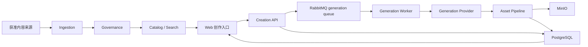

# AI 内容创作平台系统设计

## 1. 产品定义

Thief 是面向 AI 绘画创作者的内容创作平台。产品体验参考即梦的核心路径，但不复制其品牌、界面或内容：

```text
发现灵感 → 选择模板或空白创作 → 编辑提示词与参数
→ 生成图片 → 查看并管理作品
```

通过爬虫和数据适配器获得的提示词、参数及示例文件属于 `catalog` 内容供给，不是产品主体。MVP 必须同时具备模板发现和真实图片生成能力。

## 2. MVP 目标与非目标

目标：

1. 从获准来源采集并展示优质提示词模板、参数和示例图片。
2. 支持公开浏览、搜索、模板详情和“做同款”。
3. 支持登录用户编辑 prompt、negative prompt、模型与基础参数并提交生成。
4. 使用 RabbitMQ 调度生成任务，使用 MinIO 保存用户作品。
5. 支持生成进度、失败重试、取消和个人作品历史。
6. 提供来源、内容审核、生成任务和下架管理能力。

非目标：首版视频/音频生成、模型训练、节点式工作流、社区发布、评论关注、付费订阅、多租户、任意 URL 通用爬虫、微服务或 Kubernetes。

## 3. 内容来源与生成模型

内容来源和生成模型是两套独立适配器：

| 能力 | MVP 决策 |
| --- | --- |
| 模板来源 | 固定 revision 的 DiffusionDB，先导入 1K 条；其他来源通过准入后再接入 |
| 图片生成 | 通过 `GenerationProvider` 对接一个明确支持商用 API 的模型供应商 |
| 兼容提示 | 模板记录原始模型；与当前生成模型不兼容时提示用户效果可能不同 |

来源公开可访问不等于允许采集或再发布。生成供应商、模型版本、价格和区域必须在进入 PRD 前确定，不把供应商字段写入领域核心。

## 4. 总体架构



部署保持四类应用角色：

| 角色 | 职责 |
| --- | --- |
| Web | 公共模板站、创作工作台、任务状态和作品页 |
| API | 目录查询、用户会话、创作、管理和资源签名 |
| Worker | 采集、媒体、索引和生成任务 |
| Scheduler | 只创建到期采集和维护任务 |

Worker 共用代码但按 `crawl`、`media`、`index`、`generation` 队列隔离。生成任务不能被爬虫积压阻塞；只有负载证明需要时才拆为独立服务。

## 5. 核心流程

模板发布：

```text
source → crawl run → normalize → rights/safety → catalog → search
```

图片生成：

```text
template/blank → creation draft → generation job → provider
→ result validation/moderation → generated asset → user work
```

生成任务状态：

```text
draft → queued → running → succeeded | failed | cancelled
```

API 先在 PostgreSQL 创建任务，再投递 RabbitMQ；消息只含任务 ID。Worker 使用幂等键调用供应商并保存 provider job ID，重复消息不能重复扣费或生成多份作品。

## 6. 核心数据

| 领域 | 核心实体 |
| --- | --- |
| 采集 | `sources`、`crawl_runs`、`source_items`、`candidates` |
| 模板 | `prompt_templates`、`generation_examples`、`categories`、`tags` |
| 创作 | `creation_drafts`、`generation_jobs`、`generation_attempts` |
| 作品 | `assets`、`asset_variants`、`user_works` |
| 用户 | `users`、`sessions`、`usage_quotas` |
| 治理 | `access_decisions`、`moderation_records`、`suppressions` |

采集示例与用户生成作品分开保存和授权。用户 prompt、生成结果和失败信息默认只对本人可见，不进入公开模板库。

## 7. 访问与展示

- 模板浏览、搜索和详情公开访问。
- 图片生成、任务状态和个人作品需要登录。
- 管理员接口需要独立权限并记录审计。
- MVP 为每个用户设置可配置的每日生成上限，不实现支付。
- 所有公开模板必须通过来源权利和内容审核；所有生成结果必须通过输出安全检查。

## 8. 可靠性与性能

- 采集、媒体、索引和生成队列独立设置并发、重试和 dead-letter queue。
- 生成任务使用客户端幂等键；未知的供应商结果先 reconcile，不直接重试扣费请求。
- 监控 API 延迟、队列年龄、供应商成功率/耗时、单次生成成本、文件处理失败和下架 SLA。
- MVP 目标：模板查询 P95 < 1 秒；生成请求 2 秒内返回 job ID；任务状态可恢复且终态一致。

## 9. 部署与演进

本地使用 Docker Compose 运行 PostgreSQL、RabbitMQ 和 MinIO，生成供应商使用真实测试账号或可控 fake。首个生产环境采用单区域容器部署。

后续视频生成复用 `GenerationProvider` 和任务模型，但需要独立媒体限制、时长、成本和审核 Design，不在图片 MVP 中预实现。

## 10. Design 接受门禁

进入 PRD 前需要确认：

1. MVP 首个图片生成供应商、模型版本、区域和预算上限。
2. 登录方式及每日免费生成上限。
3. 首个模板来源为 DiffusionDB 1K，其他平台暂不联网。
4. 用户作品默认私有，不自动用于训练或公开模板。
5. 主要运营法域、成人内容策略和内容安全负责人。

四份 Design 一致且以上决策被接受后才能创建 PRD；任何外部采集仍需满足 `DESIGN-002` 的来源准入。

## 11. 参考资料

- [即梦 AI](https://www.jimeng.com/)
- [DiffusionDB Dataset Card](https://huggingface.co/datasets/poloclub/diffusiondb)
- [RabbitMQ Documentation](https://www.rabbitmq.com/docs)
- [MinIO AIStor Documentation](https://docs.min.io/enterprise/aistor-object-store/)

## 12. 变更记录

- 2026-07-22：v2.0.0 将产品主体纠正为 AI 内容创作平台，把模板库降为 catalog 子系统，并将图片生成与作品管理纳入 MVP。
