# AI 绘画提示词知识库系统设计

## 1. 状态与核心决策

本文与 `DESIGN-002/003` 共同构成待用户确认的 Design，任一文档未接受都不能进入 PRD。Design 接受不等于来源获准联网；网络采集还需独立通过数据治理激活门禁。首版采用“模块化单体 API + 持久化采集任务 + 独立 Worker 角色 + 可插拔来源适配器”，先跑通一个明确许可的数据源，不建设通用分布式爬虫平台。

## 2. 来源准入

| 来源 | 截至 2026-07-22 的一手事实 | 当前状态 |
| --- | --- | --- |
| DiffusionDB | 数据集卡声明 CC0；含 14M 图片、提示词与参数，2M/Large 子集约 1.6/6.5TB，提供 NSFW 分数 | P0；固定数据修订，直接流式读取 Parquet，首导 1K；展示仍经过第三方权利与内容门禁 |
| Civitai | Images API 当前可用且使用 `nextCursor`；条款 11.4 允许以有效凭证和适用限速使用公开 API/MCP，但 robots 对 `/api/*` 为 Disallow | `disabled_pending_review`；需形成能解释该差异且覆盖具体动作的审计结论后才可试采 |
| Midjourney | 条款禁止自动化工具访问、交互或生成资产 | `denied`；书面许可或官方授权接口出现后复审 |
| OpenArt | 官方帮助中心称无社区数据公共 API；条款禁止 bot、抓取、爬取和大量复制 | `denied`；官方 MCP 提供创作/模型/任务/项目能力，不是社区图库批量导出接口 |
| Lexica | 有查询 API，但无稳定分页/限速契约，调研时官方示例返回 500，批量再发布授权不清晰 | `denied`；取得批量/商业用途书面确认后复审 |
| PromptHero 等 | 无明确官方数据 API或知识库再发布许可，PromptHero robots 还屏蔽多类 AI bot | `denied`；页面公开或可被普通搜索引擎索引不构成授权 |

准入、内容权利和保存/展示动作的裁决规则由 `DESIGN-002` 定义；来源只有 `active` 才能生成网络任务。

## 3. 目标与非目标

目标：

1. 幂等、增量采集获准的 prompt、negative prompt、生成参数和效果资产。
2. 统一模型、版本、seed、sampler、steps、CFG、尺寸和扩展参数，同时保留原文与完整溯源。
3. 支持精确去重、近似聚类、关键词/语义检索、来源与模型筛选。
4. 提供检索、详情、来源运行、隔离审核四个 MVP 页面，以及下架与防复活能力。

非目标：绕过登录/验证码/付费墙/反爬；开放任意 URL；未经许可复制图片或 prompt；图片生成、模型训练、以图搜图；首版多租户、计费、复杂 RBAC、Kubernetes、Kafka、Airflow、OpenSearch 或独立向量数据库。

## 4. 总体架构

```mermaid
flowchart LR
    A["白名单来源"] --> B["Access Policy Gate"]
    B --> C["Singleton Scheduler"]
    C --> D["PostgreSQL Jobs"]
    D --> E["Fetch Worker"]
    E --> F["临时隔离 / 获准 Raw"]
    F --> G["Parse + Normalize"]
    G --> H["Rights + Text PII/Moderation"]
    H -->|unknown/fail| J["Quarantine / Reject"]
    H -->|no inline media| P["Final Publish Gate"]
    H -->|display media allowed| M["Allowlisted Media Fetch"]
    M --> O["No-egress Decode + Image Moderation"]
    O -->|pass| P
    O -->|unknown/fail| J
    P --> I["Publishable"]
    I --> K["DB Transaction + Outbox"]
    K --> L["Search / Embedding"]
    L --> N["FastAPI + Next.js"]
```



一个仓库包含 `apps/api`、`apps/web`、`apps/worker` 与 `packages/core`。生产进程明确拆为 `web`、`api`、`scheduler(singleton)`、`dispatcher`、`fetch-worker(仅来源 API 域名出网)`、`pipeline-worker`、`media-fetch-worker(仅获准资产域名出网)`、`media-worker(no-egress)`、`review-derive-worker(no-egress)`；它们可共用镜像，但网络、密钥与资源权限不同。

## 5. 适配器与获取契约

```python
class SourceAdapter(Protocol):
    async def discover(self, cursor: str | None, limit: int) -> SourcePage: ...
    async def fetch(self, ref: SourceRef, validators: HttpValidators) -> FetchResult: ...
    def parse(self, artifact: ArtifactRef, parser_version: str) -> ParseResult: ...
```

`FetchResult` 是 `artifact | not_modified | rejected`，并携带状态码、最终 URL、redirect chain、ETag、Last-Modified、headers 与内容 hash。`ArtifactRef` 可指内存/临时隔离对象或获准长期保存的 `RawSnapshotRef`；parser 可在临时 TTL 内消费前两者，`parse_attempt` 记录 artifact hash、可空 snapshot id、parser version 与结果。只有 `store_raw_response` grant 存在时才支持长期离线重解析。

## 6. 持久化任务与一致性

| 层级 | 状态与不变量 |
| --- | --- |
| Run | `scheduled → running → completed|partial|failed|cancelled`，固定来源、adapter 与访问授权版本 |
| Page job | `queued → fetching → persisted → expanded|retry|dead`，`UNIQUE(run_id, cursor_key)`；首游标使用显式 `__start__` |
| Item job | `discovered → parsed → normalized → rights_pending → moderation_pending → media_pending? → publishable|quarantined|rejected|suppressed`，内容幂等键来自来源对象与修订 |
| Lease | 所有 job 的领取、心跳、完成与 outbox 写入均以 `lease_owner + lease_version + lease_until` 条件更新；旧 fencing token 不能提交 |
| Outbox | `pending → publishing(lease) → published|retry|dead`，记录 `available_at/attempt/lease_*`；消费者至少一次执行且按 event id 幂等 |
| Storage object | `uploading(lease) → ready → deleting(lease) → deleted`；仅 ready 可建发布引用，状态变化使用 fencing token |

RabbitMQ 只传递 `job_id/event_id/trace_id` 等唤醒信号，不承载 prompt、图片、凭证或唯一结果；使用持久消息、publisher confirm、manual ack 与 DLX。消费者按“领取 DB lease → 执行 → 以同一 fencing token 提交状态/outbox → DB commit 后 ack”处理；查不到 job、lease 已失效或已终态时 `ack + noop`。dispatcher 领取 outbox lease，收到 broker confirm 后标记 published；confirm 后崩溃可产生重复，因此消费端使用 `inbox_events UNIQUE(consumer,event_id)` 或目标唯一约束去重。DB 副作用与 inbox `processed` 在同一事务提交；MinIO 等外部副作用用确定性 key 幂等执行，再同事务写 receipt 与 processed，崩溃允许重做。

Reconciler 扫描 published 但无 processed/目标 receipt 的事件。DLX/TTL 不改变 DB 状态，due-job sweeper/Reconciler 才能重投或置 dead；notice/delete outbox 的 dead 只表示本轮投递耗尽并告警，`deletion_job` 仍持续调度直至 `succeeded|held`。

临时 Artifact/media-staging 永不被 DB 发布引用。权利和处理通过后，Worker 先以 DB 行锁领取 `storage_object=uploading` lease，再向“权利主体 namespace + SHA-256”的确定性 key 执行带 checksum 的条件 Put（`If-None-Match: *`）；新写成功后以同一 fencing token 在事务中转为 ready、建 `object_ref` 与 outbox。对象已存在时 Writer 不读取，而是创建 verify job，由 no-egress verifier 按精确 key 核对 hash/size 后转 ready 或隔离。

Reconciler 只清理超过 grace 且 lease/fencing 已失效的 uploading，避免与在途提交竞争。最后引用删除在同一行锁事务把 ready 转 deleting，deleting 禁止新增引用；幂等 Delete 成功后写 bucket/key/hash receipt 并转 deleted，失败回 retry。禁止跨权利主体物理去重，也不做非原子的 staging promotion。

429 在存在时遵循 `Retry-After`，否则从约 1 秒退避至约 30 秒；5xx/超时同样退避。401/403、访问政策变化或过期会暂停来源、取消未开始任务，并触发现有内容复审。

## 7. 核心关系

| 实体 | 关键约束 |
| --- | --- |
| `source_sites` / `access_decisions` | 来源状态、访问方式、限速、复审、凭证身份和 kill switch |
| `crawl_runs` / `ingestion_jobs` / `outbox_events` | 持久状态、幂等键、attempt、错误载荷、调度与副作用恢复 |
| `source_resources` / `fetch_observations` | `UNIQUE(source_id, object_type, external_id)` 与双时态观察记录 |
| `raw_snapshots` / `parse_attempts` | parse 记录 artifact hash 与可空 snapshot；持久 snapshot 不绑定 parser version |
| `prompts` / `prompt_versions` | 原文、展示文本、语言、PII 状态与保守规范化 hash |
| `generation_examples` / `generation_recipes` | 连接来源 observation、parse attempt、prompt、模型/参数和当前发布状态 |
| `assets` / `asset_variants` | generation 一对多资产、内容 hash、来源链接、存储与派生删除血缘 |
| `rights_assertions` / `license_grants` / `moderation_events` | 每个可见、缓存或向量化对象引用覆盖对应动作的当前有效证据 |
| `embeddings` / `duplicate_groups` | 模型/版本/维度隔离；近似算法只聚类，不删除溯源 |
| `notice_cases` / `suppression_rules` / `deletion_jobs` | 从来源 observation 向 example、asset、index、cache 与 export 扇出 |

关系主链为 `source → run → job → resource → observation → snapshot → parse_attempt → generation_example → prompt/recipe/assets`。内部 ID 采用应用层 UUIDv7 库并测试单调性；相同 prompt 的不同模型/seed/参数是不同 generation。SHA-256 只精确去重字节，pHash/向量只产生可逆候选。

## 8. API、鉴权与可见性

首版固定为内部系统：所有页面要求登录，管理员额外拥有 `source:manage`、`review:moderation`、`notice:manage` 权限。所有用户查询在 repository/service 层强制满足：

```text
state = publishable
AND current_access_and_rights_permit(audience, action)
AND pii_status = passed
AND moderation_status = passed
AND NOT suppressed
```

用户 API：`POST /v1/search`、`GET /v1/examples`、`GET /v1/examples/{id}`、`GET /v1/sources`。管理 API：来源启停、运行/重试、隔离审核、重复候选和 notice/delete。资产字段只能返回获准对象的短时签名 URL，或不经本站代理的来源详情链接。

## 9. 检索、性能与可观测性

检索使用 PostgreSQL `pg_trgm`、全文索引与 `pgvector`，用 RRF 合并词法和文本向量候选；支持来源、模型、语言、宽高比、标签、许可和时间过滤。只向量化获得 `create_embedding` grant 的展示文本，不生成图片向量。

基准固定为 100K published examples、20 并发、同区域 API/DB、预热缓存，流量为 60% 关键词、30% 带过滤混合检索、10% 详情；不把外部 Embedding 服务延迟排除在结果之外。目标 P95 <1 秒、错误率 <1%。至少维护 30 条人工 gold queries，Top-10 命中率 ≥80%，并记录 NDCG@10 作为回归指标。

结构化日志包含 `trace_id/run_id/job_id/source_id/item_id/adapter_version`。指标至少包含来源最后成功时间、HTTP 失败/429、队列最老年龄、解析产出与必填缺失率、隔离率、零产出、outbox/embedding 积压；连续 3 次来源失败、发现 ≥100 但发布为 0、必填缺失 >5% 触发告警。

## 10. 技术栈与阶段

- Python 3.13、FastAPI、Pydantic 2、SQLAlchemy 2.0、Alembic、httpx、Celery 5.6、pytest、Ruff、mypy。
- Node.js 24 LTS、Next.js 16 App Router、React、TypeScript 6、pnpm 11、TanStack Query、Tailwind；PostgreSQL 17 + `pg_trgm` + `pgvector`、RabbitMQ 4.3、MinIO AIStor Free。
- Docker Compose 开发使用单节点 RabbitMQ/MinIO；首个生产环境为单区域容器、托管 PostgreSQL、RabbitMQ 与 MinIO。Free 版 MinIO 仅支持单节点，生产高可用需升级相应 AIStor 许可与拓扑。
- Stage 0：fixtures-only，无网络；Stage 1：DG-01、DG-02、DG-06 全部有记录后，固定 DiffusionDB Parquet 修订导入 1K；Stage 2：验收后扩至 10K；Civitai 不属于 MVP，访问与内容权利决策均通过后另起阶段试采最多 100 条。

## 11. 待确认与接受门禁

Design 接受需确认：内部系统、首批来源范围、DiffusionDB 图片策略、100K 首年容量、本地或外部 Embedding、主要运营法域，以及 MVP 完全拒绝成人内容。来源激活是独立门禁，还必须满足 `DESIGN-002` 的负责人、处理角色、来源证据和违法内容 SOP，未满足时只能运行本地 fixtures。

转为 `accepted` 前必须：`DESIGN-001/002/003` 均无开放 P0；来源和安全 fixtures 可执行；状态/Outbox/关系与查询不变量可落库；性能和检索基准可复现。之后才能创建 PRD，不倒序写实现或 Acceptance。

## 12. 参考资料

- [DiffusionDB Dataset Card](https://huggingface.co/datasets/poloclub/diffusiondb)
- [Hugging Face Dataset Downloading](https://huggingface.co/docs/hub/main/en/datasets-downloading)
- [Civitai Images API](https://developer.civitai.com/site/reference/images)
- [Civitai API Authentication](https://developer.civitai.com/site/guide/authentication)
- [Civitai API Errors](https://developer.civitai.com/site/guide/errors)
- [Civitai Terms §11.4](https://civitai.com/content/tos) / [robots.txt](https://civitai.com/robots.txt)
- [Midjourney Terms](https://docs.midjourney.com/hc/en-us/articles/32083055291277-Terms-of-Service)
- [OpenArt Terms](https://openart.ai/suite/terms) / [Help](https://openart.ai/help) / [MCP](https://openart.ai/mcp/)
- [Lexica API](https://lexica.art/docs) / [Terms](https://lexica.art/terms) / [License](https://lexica.art/license)
- [PromptHero FAQ](https://prompthero.com/faq) / [robots.txt](https://prompthero.com/robots.txt)

## 13. 变更记录

- 2026-07-22：v0.1.0 创建初稿。
- 2026-07-22：v0.2.0 根据来源、架构与治理复核补齐持久化任务、Outbox、关系、权限和可验收指标。
- 2026-07-22：v0.3.0 对齐技术基线，并拆分 Design 接受与来源联网激活门禁。
- 2026-07-22：v0.4.0 按用户决策改用 RabbitMQ 与 MinIO，并固化消息最小化和恢复边界。
- 2026-07-22：v0.5.0 补齐 fencing lease、Outbox confirm/去重及 MinIO 对象引用一致性契约。
- 2026-07-22：v0.6.0 闭合 inbox/外部副作用原子性、删除持续重试与确定性对象提交协议。
- 2026-07-22：v0.7.0 增加对象上传/删除 fencing 状态机及条件写入验证路径。
- 2026-07-22：v0.8.0 增加独立的审核派生 Worker 角色。
