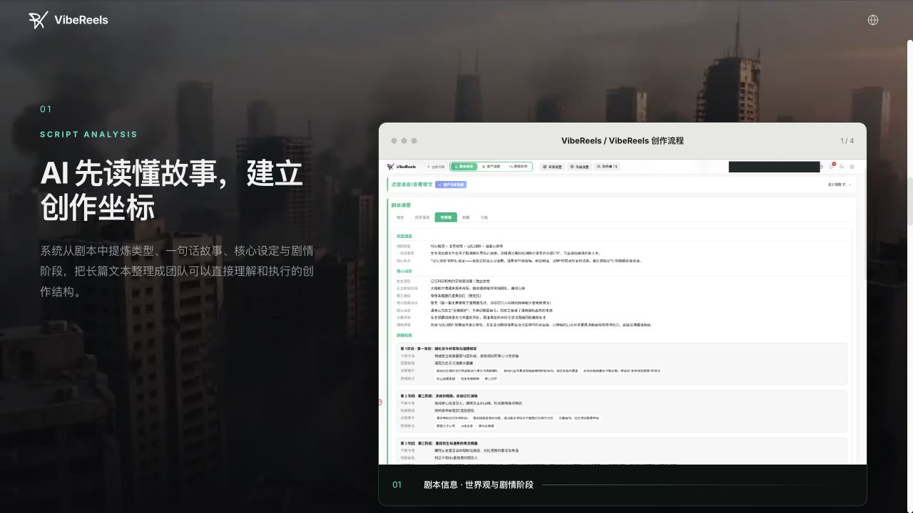
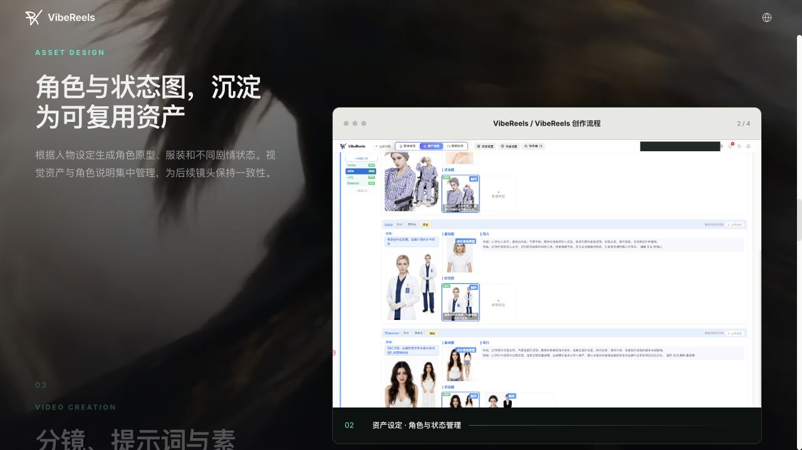
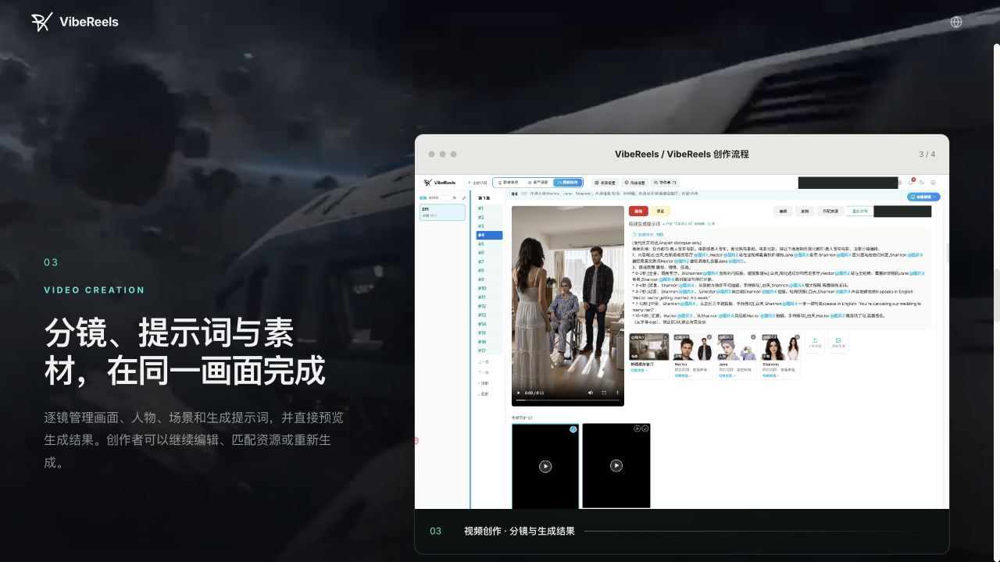
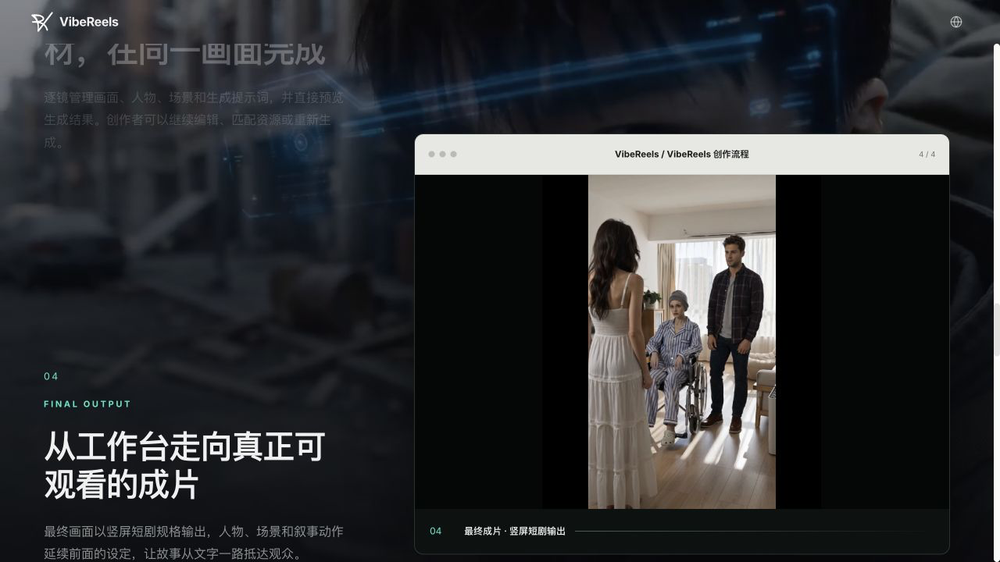

# DES-001 AI 短剧制作平台调研、产品边界与核心能力

- 状态：proposed
- 调研日期：2026-08-12
- 调研对象：GitHub AI 短剧/视频生产项目、墨鱼短剧 VibeReels 公开产品表面、Lanverse 当前实现
- 证据边界：公开页面、公开前端构建产物、公开 GitHub 仓库与本地源码；未登录墨鱼账号、未执行付费生成、未写入第三方系统
- 输出：竞品事实、剧本修订与分镜映射设计、资产治理方案、MVP 可行性与工程 Gate
- 下游：DES-002、DES-003、需求基线与 MVP PRD；本 Design 获得确认前不改变已接受的业务范围

> **当前范围声明：** 本文中的商业化、备案发行、企业协作和公开上线内容仅作为远期风险研究，不属于当前 MVP。当前模块、优先级、工期和验收统一以 [DES-012](./012-AI短剧MVP核心模块拆分与实施范围.md) 为准。

## 1. 结论

Lanverse 可以建设为 AI 短剧制作平台，而且当前代码已经具备剧本不可变版本、候选确认、资产版本、ShotSpec、生成任务和成本预占等关键底座。真正需要补齐的不是另一个“提示词生成器”，而是以下四条可审计链路：

1. 原始剧本 → 改写候选 → 已发布改写版本；
2. 前后剧本修订 → 场景/节拍/动作/对白等叙事单元的保留、拆分、合并、增加和删减关系；
3. 叙事单元 ↔ 一个或多个镜头规格，而不是把段落和镜头误建成严格 1:1；
4. 镜头规格 → 被固定的资产状态/版本 → 提示词快照 → 生成任务 → 候选版本 → 主选结果 → 成片。

墨鱼短剧最值得借鉴的是“三层剧本、资产状态、显式资源引用、影响预览、失效传播和视频版本主选”。公开证据只支持两类确定性对应：

- 剧本集标记与 Episode 的确定性拆分；
- 镜头提示词里的 @图片N / @视频N / @音频N 与该镜头有序资源卡的逐项对应。

公开证据不支持“剧本每一段与一个分镜严格 1:1”。格式改写后的文本区间可通过“导演标注”语义映射到现有镜头，但服务端算法、基数和准确率未公开。因此 Lanverse 应实现稳定身份、多对多引用、覆盖率报告和人工确认，不应以镜头序号或字符位置作为长期外键。

综合可行性判断：

| 范围 | 可行性 | 判断 |
| --- | --- | --- |
| 剧本改写、不可变修订、修订差异与人工发布 | 高 | 主要是领域建模和工作流，当前 ScriptVersion 可扩展 |
| 叙事单元与分镜可追溯、覆盖率和失效传播 | 高 | 技术可控，行业开源项目普遍缺失，能形成产品壁垒 |
| 资产身份/状态/版本、镜头固定引用、候选主选 | 高 | 当前 AssetVersion、ShotSpecVersion 已有良好基础 |
| 导演标注到镜头的自动语义映射 | 中 | 可实现，但必须有置信度、人工确认和回归评测集 |
| 跨镜角色一致性与资产状态自动匹配 | 中 | 受模型、参考图能力和提示词编译质量影响 |
| 图像/视频/TTS 的真实生成闭环 | 中 | 当前供应商合同仍未核实，需要真实账号、价格和权利验证 |
| 可商用的整集合成、音频、字幕、时间线和交付 | 中 | 工程可做，但当前仓库尚无完整渲染闭环 |
| “一句话无人审核直接发布” | 低，不建议承诺 | 质量、版权、合规、成本和供应商稳定性都不支持 |

当前内部工期以 [DES-012 AI 短剧 MVP 核心模块拆分与实施范围](./012-AI短剧MVP核心模块拆分与实施范围.md) 为准：6 人完成可审核分镜包约 16–18 周，增加一个真实图片生成闭环后累计约 21–24 周。该口径不包含 B2B、公开 GA、备案发行、企业协作或完整成片平台；DES-010 只保留为未来完整平台路线研究。

## 2. 调研问题、方法与证据等级

### 2.1 必须回答的问题

1. GitHub 上哪些项目可用于商业代码复用，哪些只能作为产品参考？
2. 一套 AI 短剧平台完整需要哪些产品、领域和基础设施能力？
3. 墨鱼如何组织原始剧本、改写结果、格式化文本、分镜、资产和生成版本？
4. 修改剧本、资产或镜头后，哪些下游对象保留、失效、重映射或重生成？
5. “分镜一一对应”到底对应剧本文本、镜头资源，还是生成版本？
6. Lanverse 已有能力与目标之间还差什么，分几阶段建设才有可验证闭环？

### 2.2 方法

- GitHub：以仓库 README、LICENSE、固定 commit 源码、数据库模型和关键服务实现为主；星标、提交和更新时间只作为活跃度信号。
- 墨鱼：以官网公开工作流、当前公开前端构建和 source map 暴露的数据契约/UI 语义为主；未登录能力只列为待验证。
- Lanverse：直接核对本地领域模型、接口、能力目录和测试，不以旧文档替代代码事实。
- 方案设计：优先复用当前模块化单体、不可变版本、候选决策、任务和成本模型，不引入微服务或自建基础模型。

### 2.3 证据标记

- 公开事实：页面、公开客户端或源码可直接复现。
- 合理推断：由多个公开信号共同支持，但无法验证服务端内部实现。
- 待确认：需要授权账号、付费调用、合同、压测或真实生产样本。

竞品公开客户端能证明界面、字段、调用入口和客户端失效规则，不能证明后端数据库结构、SLA、套餐权限或算法准确率。仓库的 GitHub License 标签也不能替代对 LICENSE 全文和依赖许可证的审阅。

## 3. GitHub 项目全景

以下数据更新至 2026-08-13；星标、release 和活跃度会继续变化。许可证结论只用于技术选型初筛，不构成法律意见。

| 项目 | 活跃度快照 | 主要价值 | 主要缺口 | 商业复用初判 |
| --- | ---: | --- | --- | --- |
| [Huobao Drama](https://github.com/chatfire-AI/huobao-drama) | 13.9k stars，最近更新 2026-08-09 | 从剧本、资产、分镜到视频的完整产品流 | 保存分镜会删除并重建该集镜头关系；缺少稳定修订血缘 | README 写 CC BY-NC-SA，仓库无标准 LICENSE；不可作为商业代码底座 |
| [Toonflow](https://github.com/HBAI-Ltd/Toonflow-app) | 13.8k stars，v1.1.8 | 三层 Agent、事件图、无限画布、资产/分镜体验 | Storyboard 只关联 scriptId；版本与来源映射弱 | LICENSE 在 Apache 文本后追加商业授权和去标限制；不能按标准 Apache 处理 |
| [Jellyfish](https://github.com/Forget-C/Jellyfish) | 6.0k stars，v0.3.2 | FastAPI/Celery/S3、资产候选确认、使用关系、ready 门禁 | Shot 只有 chapter_id 和 script_excerpt；前端仍有 mock/TODO | Apache-2.0，可选择性复用 |
| [ai-fusion-video](https://github.com/Stonewuu/ai-fusion-video) | 1.3k stars，v1.1.2，最近更新 2026-08-06 | 多租户平台结构、RBAC、异步任务、供应商策略、S3、FFmpeg、资产变体 | 分镜最多关联 episode/scene；无剧本修订和源区间血缘 | MIT，优先参考平台架构 |
| [LocalMiniDrama](https://github.com/xuanyustudio/LocalMiniDrama) | 1.2k stars，v1.2.8，最近更新 2026-08-06 | 本地端到端流程、Vue Flow、模型适配、TTS、ZIP/FFmpeg | SQLite/单机；镜头只靠 episode/scene/segment_index；缺团队和权利治理 | MIT，优先参考本地工作流和适配器 |
| [ArcReel](https://github.com/ArcReel/ArcReel) | 4.0k stars，55 个 GitHub release，最近更新 2026-08-13 | 分集账本、原稿指纹、连续 source range、锚点机械校验、批量规划、stale 保留 | 2026 年新项目；以 project.json/物理集文件为 SSOT，不是不可变数据库修订 | AGPL-3.0，只研究行为/测试，不复制进当前平台 |
| [DramaClaw](https://github.com/dramaclaw/dramaclaw) | 3.6k stars，21 个 GitHub release，最近更新 2026-08-12 | 章节误判测试、图谱辅助分集、集级冲突/钩子/关键事件、完整工作台 | 2026 年新项目；章节范围是估计值，未发现同构的 Plan revision/CAS | ELv2 source-available；托管服务受限，只做产品/失败模式参考 |
| [wind-comic](https://github.com/ChrisChen667788/wind-comic) | 423 stars，1 个 GitHub release，最近更新 2026-08-11 | 中文剧本格式、资产影响清单和大量功能测试 | parser 先 trim/删空行；资产台账以名称和镜号关联，破坏长期血缘 | MIT，但关键模型不满足当前不变量，不因许可宽松而复用 |
| [CineGen ShortDrama](https://github.com/UllrAI/CineGen-ShortDrama) | 484 stars，无 release | 首尾帧、候选变化、短剧原型交互 | Shot 仅 sceneId，部分导出入口未实现，提交历史较短 | 自定义限制许可证，只做产品参考 |
| [ViMax](https://github.com/HKUDS/ViMax) | 11.9k stars，v1.2.0 | 长视频编排、连续性、失败恢复和研究实现 | 不是完整资产治理/协作生产平台 | MIT，可参考编排与连续性 |
| [MoneyPrinterTurbo](https://github.com/harry0703/MoneyPrinterTurbo) | 102.7k stars，v1.3.4 | TTS、字幕、BGM、素材搜索、FFmpeg | 面向批量视频，不是剧本—资产—分镜平台 | MIT，只复用后期能力 |
| [NarratoAI](https://github.com/linyqh/NarratoAI) | 10.7k stars，v0.8.7 | 视频理解、文案、时间线与素材处理 | 偏已有视频再创作，不是生成式短剧生产 | MIT，只参考时间线/字幕 |
| [Open AI Micro Drama Generator](https://github.com/Anil-matcha/Open-AI-Micro-Drama-Generator) | 454 stars | 轻量概念验证 | 提交少，仓库虽有 MIT badge 但缺 LICENSE 文件 | 不进入复用清单 |

### 3.1 能力矩阵

符号：● 为源码中有明确实现；◐ 为局部实现、原型或依赖外部能力；— 为未发现。

| 能力 | Huobao | Toonflow | Jellyfish | ai-fusion | LocalMiniDrama | CineGen |
| --- | :---: | :---: | :---: | :---: | :---: | :---: |
| 剧本导入/分集/结构化 | ● | ● | ● | ● | ● | ◐ |
| AI 改写与修订治理 | ◐ | ◐ | — | ◐ | ◐ | ◐ |
| 角色/场景/道具资产 | ● | ● | ● | ● | ● | ● |
| 资产候选、确认或变体 | ● | ● | ● | ● | ● | ● |
| 可编辑分镜/镜头规格 | ● | ● | ● | ● | ● | ● |
| 剧本修订到叙事单元的稳定血缘 | — | — | — | — | — | — |
| 叙事单元到镜头的覆盖证明 | — | — | — | — | — | — |
| 图片/关键帧候选 | ● | ● | ● | ● | ● | ● |
| 视频生成与候选版本 | ● | ● | ◐ | ● | ● | ● |
| TTS/声音 | — | ◐ | — | ◐ | ● | ◐ |
| 时间线/合成/导出 | ◐ | ◐ | — | ● | ● | ◐ |
| 异步任务、恢复和供应商抽象 | ◐ | ◐ | ● | ● | ◐ | — |
| 多用户、权限、审计/权利 | — | ◐ | ◐ | ◐ | — | — |

矩阵暴露出共同空白：主流项目可以把一集“拆成镜头”，却几乎都不能证明剧本改写后每个叙事事实去了哪里、哪些镜头仍有效、哪些被遗漏。这个空白比单纯接入更多模型更适合成为 Lanverse 的核心差异化能力。

还需区分“相关”与“成熟”：Jellyfish、LocalMiniDrama、ai-fusion-video、ArcReel、DramaClaw、wind-comic 均创建于 2026 年。它们适合验证 AI 短剧产品流，却尚无跨年度运行史，不能单独作为基础设施或数据完整性的成熟事实源。Lanverse 的实现证据必须再与 Fountain.js（2012）、OpenTimelineIO（2016）、Kitsu/Zou（2017）、OpenAssetIO（2021）、Unstructured（2022）等跨年度项目交叉验证。

### 3.2 最值得复用的三类项目

#### 3.2.1 ai-fusion-video：平台工程骨架

可参考内容：

- Spring/Next/MySQL/Redis/Flyway/FFmpeg 的多用户平台结构；
- RBAC、Agent、异步任务、模型供应商策略和 S3；
- Asset → AssetItem 变体；
- StoryboardEpisode / StoryboardScene / StoryboardItem 的层级和详细镜头字段。

边界：StoryboardItem 虽有画面、动作、对白、相机、音频等字段，但其来源关联止于 episode/scene，不能解决 script_revision + source span + stable beat identity。

源码证据：

- [README（固定 commit）](https://github.com/Stonewuu/ai-fusion-video/blob/9dc387934d18b53f5b08b6b0c81d09edc315d5ae/README.md)
- [AssetItem](https://github.com/Stonewuu/ai-fusion-video/blob/9dc387934d18b53f5b08b6b0c81d09edc315d5ae/ai-fusion-video/src/main/java/com/stonewu/fusion/entity/asset/AssetItem.java#L31-L59)
- [StoryboardItem](https://github.com/Stonewuu/ai-fusion-video/blob/9dc387934d18b53f5b08b6b0c81d09edc315d5ae/ai-fusion-video/src/main/java/com/stonewu/fusion/entity/storyboard/StoryboardItem.java#L32-L144)

#### 3.2.2 LocalMiniDrama：本地工作流与适配器

可参考内容：

- 剧本、角色、场景、镜头、配音和 FFmpeg/ZIP 的本地最小闭环；
- 列表视图与 Vue Flow 画布共享数据；
- Electron/local-first 的离线创作体验；
- 多供应商配置和失败后局部重试。

边界：SQLite 表把片段关联到 episode、scene 和 segment_index，没有修订身份或源叙事单元；不适合作为团队 SaaS 的权限、权利和审计基础。

源码证据：

- [README（固定 commit）](https://github.com/xuanyustudio/LocalMiniDrama/blob/05f90fb9ec21dea5753e324b673fc8a96bc6b2e0/README.md)
- [初始化迁移中的剧集/片段关系](https://github.com/xuanyustudio/LocalMiniDrama/blob/05f90fb9ec21dea5753e324b673fc8a96bc6b2e0/backend-node/migrations/01_init.sql#L20-L60)

#### 3.2.3 Jellyfish：候选确认、使用关系和 readiness

可参考内容：

- FastAPI、SQLAlchemy、Celery/Redis、S3 兼容存储；
- 角色/场景/道具/服装资产；
- 候选产生、人工确认和可生产门禁；
- FileUsage 统一追踪媒体被何处使用。

边界：Shot 只有 chapter_id 和 script_excerpt；自由文本摘录会在改写后漂移。部分版本历史在前端仍是 TODO，不能把 README 功能表当成已完成事实。

源码证据：

- [README（固定 commit）](https://github.com/Forget-C/Jellyfish/blob/a9678194ddf2d9be3ccbe78d4287d87d5089e123/docs/README.zh.md)
- [资产模型](https://github.com/Forget-C/Jellyfish/blob/a9678194ddf2d9be3ccbe78d4287d87d5089e123/backend/app/models/studio_assets.py)
- [FileUsage](https://github.com/Forget-C/Jellyfish/blob/a9678194ddf2d9be3ccbe78d4287d87d5089e123/backend/app/models/studio_file_usages.py)
- [Shot 来源字段](https://github.com/Forget-C/Jellyfish/blob/a9678194ddf2d9be3ccbe78d4287d87d5089e123/backend/app/models/studio_shots.py#L34-L69)
- [版本历史 TODO](https://github.com/Forget-C/Jellyfish/blob/a9678194ddf2d9be3ccbe78d4287d87d5089e123/front/src/pages/aiStudio/chapter/components/ChapterRawTextEditorModal.tsx#L740-L756)

### 3.3 应只借鉴、不应直接复制的实现

- Huobao：保存 storyboards 时先删除该集旧 storyboard 及角色/道具关系，再重建。短期实现简单，但剧本小改会造成历史链接、人工调整和生成结果难以局部继承。[关键实现](https://github.com/chatfire-AI/huobao-drama/blob/f04d705603bd0257bcec6b8f44fd04ea3ea9b795/backend/src/agents/tools/storyboard-tools.ts#L227-L285)
- Toonflow：GitHub 页面可能显示 Apache，但 LICENSE 追加了“向不少于两名第三方提供需商业授权”和禁止去标等限制，不能按标准 Apache-2.0 直接商用。[附加条款](https://github.com/HBAI-Ltd/Toonflow-app/blob/bc61ec7a1b5df31293b286981a5f4ad4635464ee/LICENSE#L204-L249)
- CineGen：首尾帧/候选思路有价值，但提交、领域血缘和导出实现仍偏原型，且许可证有额外限制。
- DramaClaw：公开文档明确自称 source-available 而非 OSI 开源，ELv2 不允许将实质功能作为第三方托管/管理服务；可以审查其章节误判测试和分集字段，不能把代码合入当前 SaaS。[许可证说明](https://github.com/dramaclaw/dramaclaw/blob/09b04c5a056afa2b7baaf3b4d46995bedede6bc0/docs/zh/license.md)
- wind-comic：MIT 许可本身兼容，但其 parser 在结构化前 `trim` 每行并删除空行，资产台账以 `costume:角色名`、scene name 和 shot number 关联；这正是当前要避免的坐标丢失和弱身份。[parser](https://github.com/ChrisChen667788/wind-comic/blob/c83e1cf5e9b88fa8ac62bb737c79985a95243b8d/lib/script-parser.ts#L109-L166)、[asset ledger](https://github.com/ChrisChen667788/wind-comic/blob/c83e1cf5e9b88fa8ac62bb737c79985a95243b8d/lib/asset-ledger.ts#L1-L116)

### 3.4 跨行业成熟方案补充

AI 短剧仓库能证明产品流程，但其数据血缘、迁移和生产治理普遍不够成熟。实现前还必须对照影视制作、文档锚定和 FastAPI 数据库工程中的成熟方案。以下为 2026-08-13 的 GitHub 一手源码快照；“参考”不等于引入依赖。

| 模块 | 成熟方案与固定证据 | 已证明的做法 | 对 Lanverse 的决定 | 许可证边界 |
| --- | --- | --- | --- | --- |
| PostgreSQL migration | [FastAPI full-stack template prestart](https://github.com/fastapi/full-stack-fastapi-template/blob/c350936d2888ef16ff4f5549684fd8db54935a89/backend/scripts/prestart.sh) 与 [Alembic env](https://github.com/fastapi/full-stack-fastapi-template/blob/c350936d2888ef16ff4f5549684fd8db54935a89/backend/app/alembic/env.py) | 部署前独立执行 `alembic upgrade head`，应用模型 Metadata 是 autogenerate 输入 | 复用“部署升级与 Web 启动分离”；不照搬其同步 SQLModel 环境 | MIT，可复用 |
| Async revision gate | Rubin Observatory 的 [Safir async Alembic helper](https://github.com/lsst-sqre/safir/blob/5d6f3c119c84acbc9dc3b75b7435bf30a9d9afc1/src/safir/database/_alembic.py) | 用 `MigrationContext.get_current_heads()` 对比 `ScriptDirectory.get_heads()`，所有非 migration 入口应在 schema 过期时中止 | 直接采用同一 fail-closed 不变量；旧库 stamp 额外增加 Lanverse 的结构零差异校验 | MIT，可按来源复用 |
| 剧本格式解析 | [Fountain.js tokenizer](https://github.com/mattdaly/Fountain.js/blob/fcfa86abca2a3d57337f901c7727a2fd9b1946b1/fountain.js#L2-L154)、[screenplay-tools Python parser/UTF-8 corpus](https://github.com/wildwinter/screenplay-tools/tree/d0fc871f02a8bdaa66a107bf6005081a0974ef2f/python)、[Unstructured text partition](https://github.com/Unstructured-IO/unstructured/blob/8c4592a136b8abfa2e0ead78a45c3bfcf29479f8/unstructured/partition/text.py#L45-L108) | 场景标题、对白、动作等应使用确定性分类和真实格式 fixture；输入来源互斥、编码失败应显式；三者均会 trim/合段或不保留原位置 | MVP 只做有界严格 UTF-8 txt/md；复用 taxonomy、fixture 和失败契约，不引入 parser/重型 ETL，内部 scanner 必须保留 code-point span | MIT / MIT / Apache-2.0；当前只参考 |
| 分集规划与原稿守恒 | ArcReel 的 [episode ledger](https://github.com/ArcReel/ArcReel/blob/ed71819aadf81015c0af4b3f5db0815607e04fae/docs/adr/0031-episode-ledger-single-source-of-truth.md)、[source range/fingerprint](https://github.com/ArcReel/ArcReel/blob/ed71819aadf81015c0af4b3f5db0815607e04fae/lib/episode_ledger.py#L44-L177) 和 [锚点/并发失败测试](https://github.com/ArcReel/ArcReel/blob/ed71819aadf81015c0af4b3f5db0815607e04fae/tests/test_episode_planner.py#L281-L711) | LLM 只提唯一锚点；服务端验证连续范围、原稿指纹、Unicode、并发和 stale，物化不靠模型自觉 | 独立实现相同不变量到 DocumentRevision/EpisodePlan/ImportCommit；不用 project.json、物理集文件或 AGPL 代码 | AGPL-3.0，只作行为/测试事实源 |
| 修订文本锚定 | Hypothesis 的 [Position/Quote 双锚](https://github.com/hypothesis/client/blob/b4d085a2f893aa6de3b61d8b8bc3ae4d0f24fc1a/src/annotator/anchoring/types.ts) 与 [上下文近似匹配](https://github.com/hypothesis/client/blob/b4d085a2f893aa6de3b61d8b8bc3ae4d0f24fc1a/src/annotator/anchoring/match-quote.ts) | 同时保存字符位置、原文 quote、prefix/suffix 和位置 hint；文本变化后返回匹配分数或明确失败 | NarrativeUnitVersion 同时保存 source range、exact quote 与上下文 hash；MVP 不自动跨修订发布映射，低置信进入人工确认 | BSD-2-Clause，可选择性复用 |
| 资产身份/版本 | Academy Software Foundation 的 [OpenAssetIO entity/trait 模型](https://github.com/OpenAssetIO/OpenAssetIO/blob/3e60be1d4014bfc582c44a1e54c990ee4a695a89/doc/doxygen/src/EntitiesTraitsSpecifications.dox) 与 [版本查询决策](https://github.com/OpenAssetIO/OpenAssetIO/blob/3e60be1d4014bfc582c44a1e54c990ee4a695a89/doc/decisions/DR017-Entity-version-queries.md) | 逻辑 Entity 使用不透明稳定引用，变化形成不可变 Version；关系与可解析 traits 不依赖文件路径 | 保留现有 Asset 稳定 ID + 不可变 AssetVersion；AssetState 是剧情语义层，不用可变 URL/名称当外键 | Apache-2.0，可参考/适配 |
| 影视生产追踪 | Kitsu/Zou 的 [Episode/Sequence/Shot/Asset Entity 与关系](https://github.com/cgwire/zou/blob/eeefd7b557802fa073feb93bd90970dcf514e4b5/zou/app/models/entity.py) 及 [Preview revision 唯一约束](https://github.com/cgwire/zou/blob/eeefd7b557802fa073feb93bd90970dcf514e4b5/zou/app/models/preview_file.py) | 生产对象有层级/多对多关系、任务、状态、预览修订与主预览 | 借鉴制作追踪概念；不复制其通用 Entity/JSONB 模型，Lanverse 继续使用强类型模块事实和复合 FK | AGPL-3.0，只做行为/模型研究 |
| AI 输出校验 | NarratoAI 的 [短剧脚本确定性校验](https://github.com/linyqh/NarratoAI/blob/a9e17d0e36171ab604433abafd127f78eefbf350/app/services/short_drama_narration_validation.py) 与 [按错误修复 Prompt](https://github.com/linyqh/NarratoAI/blob/a9e17d0e36171ab604433abafd127f78eefbf350/app/services/prompts/short_drama_narration/script_repair.py) | LLM 输出先过来源、时间范围、重叠和结构规则校验，再把明确错误交给修复流程 | 分集/改写/分镜均采用“结构化候选→确定性 validator→人工 apply”，模型不得直接写正式事实 | MIT，可选择性复用 |
| 后续时间线互换 | [OpenTimelineIO timeline schema](https://github.com/AcademySoftwareFoundation/OpenTimelineIO/blob/bc5fe2d78dc3f8b2a8feb7e04483d85a12e80072/src/py-opentimelineio/opentimelineio/schema/timeline.py) 与 [镜头增删用例](https://github.com/AcademySoftwareFoundation/OpenTimelineIO/blob/bc5fe2d78dc3f8b2a8feb7e04483d85a12e80072/docs/use-cases/shots-added-removed-from-cut.md) | Timeline/Track/Clip/MediaReference 是成熟互换边界，支持 schema version | MVP-A 只导出稳定 JSON/CSV/HTML Manifest；预留后续 adapter，不把专业时间线塞入当前范围 | Apache-2.0，后续可适配 |

由此形成三层证据策略：领域产品用 AI 短剧仓库验证工作流，核心数据用影视/标注标准验证模型，工程底座用成熟 FastAPI/SQLAlchemy 项目验证运行方式。若三层证据冲突，以 Lanverse 已接受的不变量、数据可追溯性和 fail-closed 为最终裁决，不按 stars 直接选型。

## 4. 墨鱼短剧 / VibeReels 公开产品审计

### 4.1 审计范围和可信度

本次以 [VibeReels 官网](https://drama.moyuai.com.cn/)、官网公开工作流图、公开前端构建和 source map 为一手证据，未登录、未创建项目、未触发任务或付费。公开构建可证明当前客户端所展示的数据层次、字段、接口路径和提示语义，不能证明后端算法、数据库、套餐权限、稳定性和真实生成质量。

当前公开入口要求登录，且未提供公开注册路径。因此以下审计是“公开产品表面审计”，不是完整的账号内体验验收。

### 4.2 公开工作流逐步审计

#### 步骤 1：剧本分析

- 可见能力：项目内有 Script Info、Asset Setup、Video Creation 三大工作区；剧本分析包含角色、场景/道具、世界观、剧情和分集。
- 健康度：良好。它先建立项目事实，再进入生成，不是把整段文本直接发送给视频模型。
- 限制：公开图无法证明分析实体是否有跨剧本修订的稳定 ID。

#### 步骤 2：资产设计

- 可见能力：角色有原型图、描述和不同剧情状态；状态图可单独管理和增加。
- 健康度：良好。角色“身份”和“剧情状态”被拆开，适合处理服装、受伤、年龄或情绪变化。
- 限制：真实跨镜一致性、同名角色、群演和复杂状态迁移仍需样本验证。

#### 步骤 3：逐镜视频制作

- 可见能力：Episode 下是有序 Shot；单镜头展示时长、提示词、场景和角色状态、生成历史及当前主选。
- 健康度：较好。失败和返工被限制在镜头级，提示词中的 @图片1…N 与右侧资源卡同序。
- 限制：Shot 以序号展示；公开证据未证明删插镜头后存在独立于序号的长期稳定身份。

#### 步骤 4：最终输出

- 可见能力：官网展示竖屏短剧结果，项目设置公开语义也包含 16:9、9:16、21:9。
- 健康度：营销路径完整。
- 限制：公开证据可确认浏览器连续预览和逐镜版本批量下载，尚不能确认服务端整集 MP4、EDL/XML 或专业时间线工程文件导出。

### 4.3 三层剧本与改写能力

公开客户端显示每集至少有三层内容：

| 层 | 公开名称 | 作用 | 下游关系 |
| --- | --- | --- | --- |
| 1 | 原文 original | 上传、拆集后的源文本，可直接编辑 | 改写和格式改写的基线 |
| 2 | 剧本改写 normalized | 由可选 Script Skill 逐集改写 | 开启后，后续处理基于该层 |
| 3 | 格式改写 annotated | 为结构化制作和导演标注准备的文本 | 生成分镜、导演区间标注的基线 |

公开事实：

- 上传仅接受 UTF-8 的 md/txt；
- 集标记支持“第X集/话/章、EPX、EPISODE X”等独占一行格式，集号需连续递增；
- 新建项目可选择是否启用“剧本改写 Skill”；逐集文本作为用户输入，系统提示词由 Skill 定义；
- 可选择上传后自动执行“拆分 → 资产分析 → 分镜提示词生成”；
- 原文被修改后，旧剧本改写和格式改写会被标记为可能过期，并提示重跑；
- 支持单集、全剧和失败集重试；
- 公开确认语义表明，重生成已有分镜可能删除该集现有镜头并重建，因此是高风险操作；
- 未发现逐叙事单元 diff、接受/拒绝、任意历史回滚或完整剧本文档版本树。

产品判断：墨鱼把“原文、改写、格式化”分层是正确的，但若派生结果只有过期提示、重跑时整集重建，仍不足以保护用户已完成的镜头调整。Lanverse 应把每次改写先保存为候选修订，只有人工发布后才改变当前事实，并在发布前计算影响。

### 4.4 “分镜一一对应”的准确答案

需要把三个不同关系分开：

#### A. 剧本文本 → Episode：确定性 1:N

集标记决定 Episode 边界，追加剧本返回新增集数和起止索引。这一层适合确定性解析和严格校验。

#### B. 集内叙事文本 ↔ Shot：语义多对多

一个动作节拍常拆成远景、近景、反应镜头；一个蒙太奇镜头也可能合并多个叙事节拍。墨鱼公开的桥接能力是“导演标注”：

- 用户在格式改写后的 baseContent 上选 Unicode code-point 区间；
- 标注保存 start/end、原文 mark、标签和导演备注；
- 区间不可重叠，最多 200 条；
- 工作区有 version 和 baseContentHash，并以 expectedVersion 校验并发；
- 格式文本变化时旧标注失效；
- 当格式文本、标注和镜头都存在时，“导演映射”把标注映射到镜头，镜头展示 directorLabels 和 directorNoteItems。

合理推断：映射可能使用 LLM 根据标注语义、镜头描述和提示词匹配。公开构建出现返回 shotIndex 与 markRefs 的 JSON 规范，但未公开模型、置信度、是否允许一个标注映射多个镜头或人工纠错质量。不能把它描述为数据库外键式 1:1。

#### C. Shot 提示词 token → 资源卡：展示层严格 1:1

镜头保存有序 AssetRef 列表，公开字段包括 imgIndex、type、name、state、imageUrl、allStates、source。提示词中的 @图片N / @视频N / @音频N 与同类型第 N 个资源卡逐项对应：

- 新增/移除资源会重编号，并同步改写提示词；
- 切换角色/场景/道具状态只改变状态和图像，槽位索引不变；
- 人工调整后记录 assetRefsManual；
- “匹配资源”会覆盖整条镜头当前映射并恢复自动来源。

这一设计对创作者清晰，但序号只能作为显示别名，不能作为数据库身份。Lanverse 应以不可变 binding_id 存储引用，@图片N 只在提示词编译和 UI 展示时生成。

### 4.5 资产治理

墨鱼公开表面至少包含以下资产治理能力：

| 能力 | 公开行为 | 对 Lanverse 的要求 |
| --- | --- | --- |
| 分类与身份 | 角色、场景、道具按名称聚合 | Asset 保存稳定身份，不以名称作主键 |
| 剧情状态 | 同一资产有多个状态、描述、出现集和图像 | AssetState 独立于 Asset；状态变化可追踪 |
| 候选与主选 | 生成/上传候选、选择当前图、保留历史 | 候选不覆盖历史，SelectionDecision 可审计 |
| 参考图 | 原型/基础图、最多若干参考图、状态图 | 区分 identity、state、reference、selected rendition |
| 审核门禁 | 缺少或未审核状态图时阻止镜头生成 | readiness 由事实派生，不靠前端按钮判断 |
| 重命名 | 先预览分析行、镜头引用/版本、评论、审核、搜索任务等影响，再确认 | 名称变更不破坏 ID；提示词和索引进入 stale/recompile |
| 禁用 | 展示受影响集/镜头；确认后移除引用并取消任务 | 更安全的方案是先 block affected shots，不静默删除 |
| 声音 | 角色声音上传、提取或替换 | Voice 也是带权利和版本的 Asset |
| 评论/分享 | 资产和镜头评论、解决状态、限时/限次数分享 | 协作、审阅和公开访问必须有审计与撤销 |

公开语义还表明：

- 已审核的当前图被替换后，审核状态会回到未审核；
- 改名会预览当前镜头引用、历史视频版本引用、过期提示词、禁用登记、搜索/风格任务和评论；
- 高级分析或在途图像任务可阻断改名；
- 禁用会显示受影响的 Episode/Shot，并可能移除引用和取消任务；
- 单镜头资源上限和图片/视频/音频分项上限存在，但真实套餐与供应商限制需登录核验。

### 4.6 镜头、生成和版本

公开事实：

- Episode 下的 Shot 是有序列表，可插入、复制、删除；时长 UI 限制为 4–15 秒；
- 复制镜头会复制提示词、资源、时长、描述和备注，但不复制历史生成版本；
- 删除镜头会删除关联资源/版本并重排序号，属于不可逆高风险操作；
- 一条镜头可保存多个 ShotVersion，包含任务状态、时间、提示词/描述/时长快照和视频 URL；
- 可选择一个 selectedVersionId 作为主版本，并星标多个备选；
- 预览优先主版本，否则使用最新成功版本；
- 支持取消任务、单版本下载、擦字幕、提取/替换音色、截帧或截片段回流资产库等入口；
- 批量下载可按集范围获取逐镜头版本，以 .downloaded.json 做增量跳过，并在文件名标记 selected/star。

尚待确认：

- 删除和重生成的恢复窗口、审计日志和保留周期；
- 是否存在整集服务端渲染、音轨/BGM/字幕/转场和工程文件；
- 生成供应商、套餐、并发、积分与实际失败补偿；
- 主选视频是否固定了当时的资产版本，还是继续引用“当前图”。

### 4.7 墨鱼已登录黑盒验证计划

只有在获得合法测试账号、明确预算和授权后执行。测试不得使用真实艺人肖像或无授权素材。

准备一份 2–3 集受控剧本，至少包含：同一角色两种服装状态、同场多人、道具状态变化、反应镜头、蒙太奇、旁白、跨集伏笔和同名/别名边界。记录初次导入后所有可见 ID、集/镜头序号、文本 hash、资源引用、生成版本、任务和积分。

按以下变更逐项验证：

1. 只改措辞，不改语义；
2. 把一个动作节拍拆成两个，把两句对白合并；
3. 插入、删除和重排场景；
4. 角色改名和增加别名；
5. 替换已审核角色状态图；
6. 禁用一个被多个镜头引用的道具；
7. 插入、复制、删除和重排镜头；
8. 重新运行剧本改写、格式改写、资产匹配和分镜生成；
9. 生成两个视频版本，切换主选和备选，再批量下载；
10. 两名协作者同时修改同一集，验证并发冲突和审计。

每项记录：

- 哪些对象 ID 保留或改变；
- 是否先给出影响预览；
- 旧标注、镜头、手工资源绑定和主选版本如何处理；
- 失效是自动传播、静默删除还是人工确认；
- 是否有置信度、纠错和回滚；
- 是否重复计费；
- 导出文件是否能完整追溯输入。

这组实验完成前，墨鱼的算法准确率、完整 RBAC、成片导出和商业稳定性均保持“待确认”。

## 5. Lanverse 当前能力与缺口

### 5.1 已具备的底座

本地代码表明，Lanverse 已不是空白项目：

- scripts：ScriptVersion 保存不可变正文、hash、版本号和发布状态，支持手工编辑、diff、发布以及切换当前版本的影响预检；
- DeepSeek 集成：当前系统提示明确要求“只提取，不改写、补写或猜测”，因此现有 AI 能力是结构提取，不是剧本改写；
- extraction candidates：场景、对白、资产、镜头和连续性候选保存来源范围/修订并经人工决策；
- assets：Asset / AssetVersion 支持角色、地点、道具、服装、风格和声音，媒体引用含用途、ready、权利和 consent；
- storyboards：Shot 固定 ScriptVersion、Scene 和可选候选，ShotSpecVersion 不可变，并引用 AssetVersion；
- ShotSpec：已有对白 ID、叙事目的、相机、动作节拍、音频意图、首尾帧和时长；
- production：生成请求、成本预占、任务、attempt 和持久化状态已有模型；
- 基础设施：FastAPI、异步 SQLAlchemy/Postgres、Redis/RabbitMQ、MinIO 和 OpenTelemetry；前端为 Next.js/React/RTK。

本地证据：

- [ScriptVersion](../../backend/app/modules/scripts/models.py#L69)
- [结构提取提示](../../backend/app/integrations/deepseek.py#L29)
- [ExtractionCandidate](../../backend/app/modules/scripts/models.py#L230)
- [Asset / AssetVersion](../../backend/app/modules/assets/models.py#L28)
- [Shot / ShotSpecVersion / AssetReference](../../backend/app/modules/storyboards/models.py#L28)
- [ShotSpec schema](../../backend/app/modules/storyboards/schemas.py#L112)
- [供应商能力目录](../../backend/app/modules/production/capabilities.py#L33)

### 5.2 当前缺口

| 缺口 | 当前事实 | 影响 |
| --- | --- | --- |
| 整剧导入与分集规划 | 当前只能先人工创建单集，再粘贴不超过 20,000 字的 text；无项目级 ScriptDocument/EpisodePlan | 无法从一份完整剧本判断制作多少集、审核切分边界并批量建集 |
| AI 剧本改写 | DeepSeek 只提取 | 无原文→改写候选→发布工作流 |
| 稳定叙事单元 | Scene 有源范围，ShotSpec 有 dialogue/action beats，但无跨修订 NarrativeUnit identity | 改写后无法证明保留、拆分、合并或遗漏 |
| 修订映射 | 无 original/adapted/format 之间的边 | 下游只能整批失效，难以局部复用 |
| 覆盖报告 | 当前关系合法，但不能证明所有必拍内容被覆盖 | 容易静默漏拍对白、动作或伏笔 |
| 生成候选主选与媒体血缘 | 任务和版本底座存在，实际媒体候选闭环未完成 | 无法形成可审核成片来源链 |
| 真实供应商 | Seedream/Seedance 标记 provider_contract_unverified | 图/视频能力不可承诺 |
| 音频/时间线/渲染 | 有数据入口或预留字段，无完整模块和路由闭环 | 不能交付整集 MP4 |
| 生产数据库迁移和运维 | 仍需正式迁移/部署验证 | 试验成功不等于可运营 |

### 5.3 保留当前架构

不新建微服务。按现有模块职责扩展：

- scripts：原始/改写/格式化修订、叙事单元及跨修订映射；
- storyboards：Shot、ShotSpec、叙事引用、资产固定引用和覆盖报告；
- assets：资产身份、状态、版本、权利、审核和影响预检；
- production：模型调用、PromptRevision、GenerationRun、候选输出、任务和成本；
- media：上传/生成/渲染文件、用途、来源和交付；
- projects：Episode 当前修订和整体生产状态。

整剧导入、分集数量建议、资产状态和分镜安排的模块级目标、接口、验收、工期与可行性详见 [DES-011](./011-AI短剧核心生产模块缺口与目标设计.md)。

## 6. 目标领域模型

~~~mermaid
flowchart LR
    A["ScriptDocument 导入来源"] --> B["ScriptRevision original / adapted / formatted"]
    B --> C["NarrativeUnitVersion 场景 / 节拍 / 动作 / 对白 / 旁白"]
    C --> D["RevisionMappingEdge 保留 / 改写 / 拆分 / 合并 / 新增 / 省略"]
    C --> E["ShotNarrativeReference 多对多、角色与人工决策"]
    E --> F["Shot"]
    F --> G["ShotSpecRevision 不可变制作规格"]
    H["Asset"] --> I["AssetState"]
    I --> J["AssetVersion 权利 / 审核 / 来源"]
    J --> K["ShotAssetBinding 固定版本与稳定槽位"]
    K --> G
    G --> L["PromptRevision 编译产物"]
    L --> M["GenerationRun 供应商任务与成本"]
    M --> N["OutputCandidate / MediaVersion"]
    N --> O["SelectionDecision 主选 / 备选 / 退回"]
    O --> P["TimelineRevision / Delivery"]
    D --> Q["ImpactAssessment"]
    E --> R["CoverageReport"]
~~~

### 6.1 核心实体

| 实体 | 关键字段/约束 | 目的 |
| --- | --- | --- |
| ScriptDocument | project_id、source_type、source_media_id | 保存导入来源，不承载可变正文 |
| ScriptRevision | parent_revision_id、kind、content、content_hash、status、published_by | 每次改写都是候选/不可变修订，不覆盖原文 |
| NarrativeUnit | stable unit_id、episode_id、type | 叙事事实的逻辑身份 |
| NarrativeUnitVersion | unit_id、script_revision_id、source_span、text_hash、payload | 固定某修订中的具体内容 |
| RevisionMappingEdge | from/to unit、relation、confidence、decision | 表达保留、改写、拆分、合并、新增和省略 |
| Shot | stable shot_id、episode_id、order_key | 插入/删除/重排不改变身份 |
| ShotSpecRevision | shot_id、script_revision_id、camera/action/audio/duration | 不可变制作规格 |
| ShotNarrativeReference | shot_spec_revision_id、unit_version_id、role、confidence、decision | 多对多来源和覆盖证明 |
| Asset | stable asset_id、type、canonical_name | 角色/场景/道具/服装/声音身份 |
| AssetState | asset_id、state_key、episode range、description | 剧情状态，如常服/婚纱/受伤 |
| AssetVersion | state_id、media、prompt、rights、review、provenance | 固定可用于生成的视觉/声音版本 |
| ShotAssetBinding | binding_id、shot_spec_revision_id、asset_version_id、role、slot_type、source | 后端稳定引用；@图片N 只是显示别名 |
| PromptRevision | shot_spec_revision_id、compiler_version、text、binding_snapshot | 提示词是可重建的编译产物，不是事实源 |
| GenerationRun | prompt_revision_id、provider/model/params、idempotency、cost | 一次可对账调用 |
| OutputCandidate | run_id、media_version_id、quality/review | 保留全部候选 |
| SelectionDecision | selected/alternate/rejected、actor、reason | 主选/备选/退回可审计 |
| ImpactAssessment | change_set、affected objects、recommended action | 修改前预览影响 |
| CoverageReport | required/covered/omitted/orphan/stale | 进入生成前的派生门禁 |

### 6.2 不变量

1. 已发布 ScriptRevision、ShotSpecRevision、AssetVersion、PromptRevision 和生成输入快照不得原地修改。
2. 每个 ShotSpecRevision 必须固定一个 ScriptRevision。
3. 每个生产镜头至少引用一个 NarrativeUnitVersion；纯创意插入必须有 approved invented-shot waiver。
4. 每个 required NarrativeUnitVersion 必须被至少一个镜头覆盖，或有人工批准的省略原因。
5. 每个 @资源N 必须解析到唯一 ShotAssetBinding；数据库不以 N 作为身份。
6. 每个生成输出都能追溯到模型、参数、提示词、ShotSpec、资产版本、费用和审核人。
7. 名称修改不改变稳定 ID；删除、禁用、拆分和合并不得静默丢失关系。
8. 任何高成本重跑必须有 idempotency key、范围、预计成本和用户确认。

## 7. 剧本改写与分镜映射方案

### 7.1 改写工作流

1. 导入原文并创建 immutable original revision；
2. 确定性拆分 Episode，解析初始 NarrativeUnitVersion；
3. 用户填写 AdaptationBrief：目标受众、每集时长、集数、画幅、节奏、题材边界、必须保留/禁止新增事实；
4. AdaptationRun 逐集生成一个或多个候选，不覆盖当前发布版本；
5. 并排展示原文/候选，按叙事单元接受、拒绝或人工改写；
6. 计算前后单元 mapping edges 和影响预览；
7. 人工发布候选为 adapted revision；
8. 生成 formatted revision，用于场景、对白、动作和导演标注；
9. 只有发布动作改变项目当前修订，失败重跑不影响已发布事实。

### 7.2 映射算法

按以下顺序建立候选映射：

1. 确定性匹配：相同 unit_id、内容 hash、结构位置和显式场景/对白标识；
2. 结构匹配：同一 Scene 内按角色、时间、地点和相邻单元建立候选；
3. 语义匹配：LLM 只返回结构化 edge proposal、证据片段和 confidence，不直接发布；
4. 冲突检测：识别一对多、多对一、孤儿、顺序反转和新增事实；
5. 人工确认：拆分、合并、删除、关键事实变化以及低置信度边必须确认；
6. 保存决定：确认结果进入 Regression fixture，后续模型/提示词升级需回放。

不要用“语义相似度高”直接继承所有镜头。人名、地点、服装状态、关键动作、对白含义、伏笔/反转和时序变化都应进入影响判定。

### 7.3 分镜生成与双向追踪

分镜模型输入：

- 当前已发布 formatted revision；
- NarrativeUnitVersion 列表和稳定 ID；
- 已确认资产/状态；
- 目标时长、节奏、镜头语法和供应商能力；
- 必拍和可省略约束。

结构化输出：

- Shot 草案和 ShotSpec；
- source unit IDs 列表；
- 关系角色：primary、dialogue、reaction、insert、setup、payoff、transition；
- 资产需求和状态；
- 生成理由、风险和置信度。

工作台必须支持双向高亮：

- 点击文本单元，显示所有覆盖镜头；
- 点击镜头，显示来源文本、改写前文本、资产状态和上游决定；
- coverage strip 显示未覆盖、已覆盖、批准省略、孤儿镜头和失效映射；
- 插入/删除/重排镜头只改变 order_key，不改变 shot_id；
- 用户可拆镜、合镜或修改引用，所有变更形成新的 ShotSpecRevision。

### 7.4 变更传播

| 上游变化 | 保留 | 标记/阻断 | 禁止行为 |
| --- | --- | --- | --- |
| 原文只改错字 | 旧发布版本和历史生成 | 新修订待比较；受影响单元待确认 | 原地覆盖旧正文 |
| 改写候选重跑 | 当前发布改写、镜头和生成版本 | 新候选独立比较 | 自动替换当前版本 |
| 单元内容改变 | 未受影响 shot_id/asset_id | 对应 ShotSpec/Prompt stale | 整集静默删除重建 |
| 单元拆分/合并 | 历史边和历史镜头 | 相关镜头需人工重映射 | 仅按字符位置继承 |
| 角色/资产改名 | asset_id、历史版本和生成输出 | Prompt 可重编译 | 用名称级联删除引用 |
| 选择新状态图 | 旧 AssetVersion 和旧生成输出 | 未来镜头可选择升级；受影响镜头预检 | 让历史结果自动漂移 |
| 禁用资产 | 历史关系和审计 | 未替换的镜头 blocked | 静默移除所有镜头引用 |
| 镜头重排 | shot_id、ShotSpec 和映射 | 仅 order_key 变化 | 以 shotIndex 作为长期引用 |
| 视频重生成 | 旧候选、主选和成本记录 | 生成新 OutputCandidate | 覆盖或删除旧视频 |

### 7.5 CoverageReport 门禁

进入付费生成前必须满足：

- required units accounted = 100%，即已覆盖或有批准省略；
- 未解决 orphan shot = 0；
- 未解决 stale mapping = 0；
- 所有需出声 Dialogue 均绑定角色 Voice 或有明确例外；
- 所有镜头的必要角色/场景/道具状态有 ready AssetVersion；
- 所有输出画幅、时长和供应商参数通过能力校验；
- 高风险新增事实、肖像/声音授权和内容合规已人工确认。

这里的 100% 是“全部被说明”，不是要求每个单元都生成独立镜头，更不是要求 1:1。

## 8. 目标产品工作台

### 8.1 剧本实验室

- 原文、改写、格式化三栏或可切换 diff；
- AdaptationBrief 和 Skill 版本；
- 按单元接受/拒绝/编辑；
- preserved / rewritten / split / merged / added / omitted 可视化；
- 发布前影响预览和成本无关的纯文本回放；
- 旧版本 diff、回滚为新修订，不篡改历史。

### 8.2 分镜工作台

- 左侧叙事单元，中间镜头列表/画布，右侧 ShotSpec、资产和候选；
- 文本↔镜头双向高亮；
- coverage strip 和 stale/orphan 过滤；
- 镜头插入、复制、拆分、合并、重排；
- @资源N 编辑体验，但后端绑定稳定 UUID；
- 每次生成前展示引用快照、预计成本和影响范围。

### 8.3 资产圣经

- 角色/场景/道具/服装/风格/声音；
- 身份、剧情状态、版本和媒体 rendition 分层；
- 原型、候选、主选、备选、审核和来源；
- 出现集、使用镜头、影响图和升级预检；
- 名称/别名治理、禁用/替换、权利/consent 和到期提醒；
- 评论、审核、分享水印和撤销。

### 8.4 候选和版本比较

- 图片/视频候选并排播放；
- selected、alternate、rejected 和理由；
- 对比生成输入快照；
- 单镜头局部重做；
- 模型、参数、耗时、失败、重试、费用和质量标签。

### 8.5 基础时间线与交付

MVP 只做窄时间线：

- 镜头顺序、in/out、简单转场；
- 对白/旁白/TTS、BGM、音效和字幕轨；
- 整集预览和审核；
- FFmpeg 确定性渲染；
- MP4、字幕、封面和制作清单；
- AI 生成显式标识、隐式元数据和内容追溯编号。

不在 MVP 复制专业 NLE、实时多人 CRDT 或任意节点无限画布。

## 9. 分阶段实施与验收

本节的“周”是单章工程窗口，用于说明先后关系和验收内容，不得相加后作为总工期。团队产能、并行关系、外部等待与完整日历排期见 DES-010。

### Phase 0：证据和契约，1–2 周

交付：

- 授权墨鱼黑盒测试；
- 2–3 集黄金样本与变更矩阵；
- 供应商合同、价格、输入输出权利和 API 真实性清单；
- DES-001/002/003 和需求基线差异评审。

验收：

- 公开事实/推断/待确认分开；
- 至少一个文本、图像、视频供应商有可执行合同或沙盒；
- 产品、技术、合规共同接受“多对多 + 人工门禁”。

### Phase 1：剧本改写与血缘，4–6 周

交付：

- AdaptationBrief、AdaptationRun、ScriptRevision kind；
- NarrativeUnit/Version、RevisionMappingEdge；
- 候选 diff、接受/拒绝、发布和影响预检；
- 黄金样本回归测试。

验收：

- 重跑不覆盖已发布修订；
- preserved/split/merged/added/omitted 全部可审计；
- 基线文本变化产生明确冲突，不静默迁移。

### Phase 2：叙事—分镜—资产闭环，4–6 周

交付：

- ShotNarrativeReference、CoverageReport；
- AssetState、ShotAssetBinding、PromptRevision；
- 双向高亮、覆盖率、stale/orphan 门禁；
- 镜头插入/复制/删除/重排的稳定 ID。

验收：

- 所有 required unit 被覆盖或批准省略；
- 删除/拆分/合并上游单元只影响相关镜头；
- 资产改名不破坏引用，禁用前有影响预览；
- 每个 @资源N 唯一解析且新增/删除后无悬空 token。

### Phase 3：真实图片候选，3–5 周

交付：

- 一个已核实图像供应商；
- 角色原型/状态、场景和道具候选；
- 主选/备选、审核、权利和 lineage；
- readiness 和局部重生成。

验收：

- 每个候选可追溯输入、模型、参数、费用和决定；
- 替换主选不改变历史生成；
- 跨镜角色一致性在黄金样本上由人工盲评，结果达到团队预先定义的阈值。

### Phase 4：视频、声音、字幕和基础时间线，6–10 周

交付：

- 一个已核实视频供应商和一个 TTS；
- ShotVersion 主选/备选；
- 音色、字幕、BGM/音效轨；
- FFmpeg 整集渲染、取消/重试/对账。

验收：

- 单镜头失败不重跑整集；
- 同一幂等键不会重复产生不可解释扣费；
- 可重复渲染同一 TimelineRevision；
- 成片每个镜头和音轨可回溯来源。

### 后续阶段（不属于当前 MVP）：协作、合规和生产化

交付：

- 角色权限、评论/审核、限时分享；
- 审计、保留/删除策略、监控和迁移；
- AI 内容标识和交付清单；
- 发布前人工审核门禁。

验收：

- 分享可撤销且访问可审计；
- 显式/隐式标识和内容 ID 随成片导出；
- 生产备份、恢复、限流、失败补偿和告警通过演练。

Phase 1–2、Phase 3 的部分 UI/供应商预研可以并行，因此总历时不是各阶段简单相加。Phase 4–5 只有在单独接受后才进入实施计划。

## 10. MVP 工程成本观测

不要在供应商未核实前写死“每集成本”。先用以下模型收集 P50/P90：

EpisodeCost =

- 文本改写/结构化 token；
- 资产原型与状态图的生成次数 × 单次图像成本；
- 关键帧候选次数 × 单次图像成本；
- 镜头视频秒数 × 候选数 × 失败/返工系数；
- TTS 字符或音频秒数；
- 存储、转码、下载流量；
- 人工编剧、分镜、审核和返工工时。

后续进入真实生成验证时，对 3 种样本分别测量：

1. 对话型室内剧：镜头少、角色一致性要求高；
2. 动作/奇幻剧：视频失败率和资产状态多；
3. 漫剧/动态漫画：图片量大、视频运动较轻。

必须记录每个阶段的首次通过率、平均候选数、重试率、人工分钟数、生成秒数、供应商失败和退款结果。当前 MVP 只用这些数据保护额度、识别失败和比较工程方案，不设置毛利或商业 SLA Gate。

## 11. 风险、合规与缓解

| 风险 | 严重度 | 缓解 |
| --- | --- | --- |
| 剧本改写悄悄改变关键事实 | 高 | 必保留事实、结构化 diff、mapping edge、人工发布 |
| 改写后整集镜头被破坏 | 高 | 稳定 ID、局部影响、stale 状态、禁止静默级联删除 |
| 角色/场景跨镜漂移 | 高 | AssetState/Version 固定引用、候选选择、黄金样本评测 |
| 供应商能力/价格变化 | 高 | Capability Registry、合同版本、Prompt/Model 快照、适配器 |
| 重试造成重复扣费 | 高 | 幂等、预占/结算/释放、供应商任务对账 |
| 肖像、声音、剧本和素材权利不清 | 高 | rights/consent/期限/地域/用途进入 AssetVersion 和导出门禁 |
| AI 标识缺失（后续成片/发布） | 高 | 进入 MVP-C 或发布范围时增加显式标识、文件隐式元数据、内容编号和日志 |
| 网络微短剧备案/审核不满足（后续发布） | 高 | 不进入当前 MVP；发布立项时单独确认许可证、备案号和平台要求 |
| 分享链接泄露（后续协作） | 中 | 当前不做外链；后续需有效期、次数、撤销、水印和访问日志 |
| 开源许可证误判 | 高 | 只引入批准清单，固定版本，生成 SBOM，法务复核依赖和素材 |
| 自动映射幻觉 | 中 | confidence、证据片段、人工确认、回归集和模型版本化 |
| 专业后期范围膨胀 | 中 | MVP-A/B 不做时间线；MVP-C 仅做极简顺序拼接 |

中国境内提供生成合成内容服务时，应按 [《人工智能生成合成内容标识办法》](https://www.cac.gov.cn/2025-03/14/c_1743654684782215.htm) 设计显式和隐式标识、内容编号及相关日志；办法自 2025-09-01 起施行。网络微短剧上线还需结合广电主管部门的现行 [网络微短剧管理提示](https://www.nrta.gov.cn/art/2025/2/5/art_113_70148.html) 和平台实际备案/审核要求进行法务确认。本节为产品与工程风险识别，不替代法律意见。

## 12. Go / No-Go 门槛

| Gate | Go 条件 | No-Go / 返回整改 |
| --- | --- | --- |
| G0 设计 | 接受不可变修订、多对多映射和人工门禁 | 仍要求段落↔镜头硬 1:1 或重跑覆盖历史 |
| G1 映射 | 黄金样本全部 required unit 有解释；孤儿和失效为 0 | 存在静默漏拍、错误继承或无法回滚 |
| G2 供应商 | 合同/API/价格/权利/限额/失败补偿已核实 | 仅有营销页或 provider_contract_unverified |
| G3 MVP-A 导出 | 分集、资产、覆盖和分镜包闭环；不存在未解释遗漏 | 只能生成镜头列表但无法证明来源与覆盖 |
| G4 MVP-B 图片 | 真实图片 Candidate、主选和 Lineage 可重放 | 只有 Mock 或供应商 URL，无法固定输入版本 |
| G5 后续范围 | 视频成片、合规、协作或生产化必须另立 Design/PRD | 把商业或公开上线能力静默塞回当前 MVP |

## 13. 决策建议

1. 接受本 Design 的核心方向后，先更新需求基线和 DES-002/003，不立即大规模写生成代码。
2. 第一实施优先级放在 Phase 1–2：改写修订、NarrativeUnit、映射边、ShotNarrativeReference、AssetState 和 CoverageReport。
3. 商业代码只优先评估许可证兼容且通过同构失败测试的局部；当前 MIT 的 ai-fusion-video、LocalMiniDrama、wind-comic 和 Apache-2.0 的 Jellyfish 都不能仅凭许可证进入代码库，必须逐文件证明不破坏稳定身份、原文坐标和现有模块边界。
4. Huobao、Toonflow、CineGen、DramaClaw 只做产品/实现思想参考；ArcReel/Kitsu/Zou 的 AGPL 源码只作公开行为和测试事实源，除非法务另行接受许可证义务。
5. 在采购真实供应商和授权墨鱼账号后执行 Phase 0 黑盒实验；没有 G2 证据时，不把图/视频生成标记为“已具备”。
6. 把“分镜一一对应”产品文案改为“剧本—分镜双向追溯；镜头资源槽位逐项对应”，避免错误承诺。

## 14. 主要资料

### 14.1 墨鱼 / VibeReels

- [VibeReels 官网](https://drama.moyuai.com.cn/)
- [剧本分析工作流图](https://drama.moyuai.com.cn/homepage-workflow-01.png)
- [资产设计工作流图](https://drama.moyuai.com.cn/homepage-workflow-02.png)
- [逐镜视频创作工作流图](https://drama.moyuai.com.cn/homepage-workflow-03.png)
- [竖屏输出工作流图](https://drama.moyuai.com.cn/homepage-workflow-04.png)
- [公开前端构建](https://drama.moyuai.com.cn/static/js/main.78623d5b.js)
- [公开 source map](https://drama.moyuai.com.cn/static/js/main.78623d5b.js.map)

### 14.2 GitHub

- [ai-fusion-video](https://github.com/Stonewuu/ai-fusion-video)
- [LocalMiniDrama](https://github.com/xuanyustudio/LocalMiniDrama)
- [Jellyfish](https://github.com/Forget-C/Jellyfish)
- [ArcReel](https://github.com/ArcReel/ArcReel)
- [DramaClaw](https://github.com/dramaclaw/dramaclaw)
- [wind-comic](https://github.com/ChrisChen667788/wind-comic)
- [Huobao Drama](https://github.com/chatfire-AI/huobao-drama)
- [Toonflow](https://github.com/HBAI-Ltd/Toonflow-app)
- [CineGen ShortDrama](https://github.com/UllrAI/CineGen-ShortDrama)
- [ViMax](https://github.com/HKUDS/ViMax)
- [MoneyPrinterTurbo](https://github.com/harry0703/MoneyPrinterTurbo)
- [NarratoAI](https://github.com/linyqh/NarratoAI)
- [Fountain.js](https://github.com/mattdaly/Fountain.js)
- [screenplay-tools](https://github.com/wildwinter/screenplay-tools)
- [Unstructured](https://github.com/Unstructured-IO/unstructured)
- [OpenAssetIO](https://github.com/OpenAssetIO/OpenAssetIO)
- [OpenTimelineIO](https://github.com/AcademySoftwareFoundation/OpenTimelineIO)
- [Kitsu/Zou](https://github.com/cgwire/zou)

### 14.3 官方规则

- [《人工智能生成合成内容标识办法》](https://www.cac.gov.cn/2025-03/14/c_1743654684782215.htm)
- [国家广播电视总局网络微短剧管理提示](https://www.nrta.gov.cn/art/2025/2/5/art_113_70148.html)
