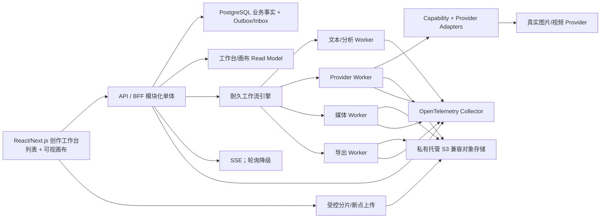

# DES-001 目标技术架构与选型

- 状态：proposed
- 版本：v1.0
- 日期：2026-08-14
- 关联需求：CUR-00、CUR-PLT-FR-001～010、CUR-PLT-NFR-001～010
- 关联验收：AC-CUR-PLT-001-A～AC-CUR-PLT-010-C
- 下游：DES-002～DES-015

## 1. Greenfield 声明

这是 **greenfield 目标架构**。现有 Lanverse 代码、技术栈、数据库表、迁移历史、部署清单和已有目录均不作为技术选择依据，也不构成兼容约束。

本设计只使用以下输入：

1. 用户已经明确的产品范围：无剪辑、无时间线、无成片、无商业运营，终点为每镜唯一主选和有序原始视频素材包；
2. CUR-00、CUR-IAM、CUR-PRJ、CUR-SCR、CUR-AST、CUR-SBD、CUR-KFR、CUR-VID、CUR-EXP、CUR-PLT、CUR-CAN 与 CUR-SEC 的不变式、功能需求、非功能需求、验收条件和开放问题；
3. 固定提交的 GitHub 一手项目/工作流证据，以及候选基础组件的官方一手资料；它们只用于确认可行模式和风险，不授权复制代码或默认架构。

## 2. 问题、范围与非目标

### 2.1 问题

平台必须同时处理强事务的创作事实和不可预测的外部长任务。难点不是发出一次模型调用，而是：

- 上游版本变化后历史结果不漂移；
- Provider 请求超时后无法确认副作用是否已发生；
- 生成结果必须在临时 URL 失效前安全持久化；
- 单镜失败、取消和重试不能破坏其他镜头；
- 导出必须冻结顺序、主选和媒体字节版本；
- 所有后台处理仍须遵守 Workspace、权利和审计约束。

### 2.2 范围

- 应用形态、同步/异步边界和部署拓扑；
- 前后端语言、数据库、工作流、媒体、接口和观测技术提案；
- 架构选项权衡、ADR、PoC 和 Gate；
- 技术组件与业务事实的职责分离。

### 2.3 非目标

- 不设计剪辑/成片渲染技术；
- 不建设自托管 GPU、模型训练或通用 Agent 平台；
- 不建设模型插件市场、支付计费或企业复杂组织；
- 不因 GitHub 项目使用某技术就自动采用；
- 不在 Provider PoC 前宣称具体模型、参数、价格和取消语义可用。

## 3. 一手证据与采用边界

| 证据 | 可确认事实 | 本产品采用 | 明确不照搬 |
| --- | --- | --- | --- |
| [Jellyfish 固定提交](https://github.com/Forget-C/Jellyfish/tree/a9678194ddf2d9be3ccbe78d4287d87d5089e123) | 资产一致性、镜头准备、统一异步任务中心和 OpenAPI 客户端能形成短剧工作台 | 统一任务事实、readiness、类型生成 | 其当前表结构、SQLite/MySQL/Redis/RustFS 组合不是目标架构证据 |
| [LumenX 固定提交的模型接入说明](https://github.com/alibaba/lumenx/blob/f2a02e23171447c939e7d8e1386b24d17049bbf1/docs/2-model-catalog-design/model-onboarding-implementation.md) | 文档证据、Capability Catalog 和运行 Adapter 可分层；认证/Endpoint/轮询变化仍需代码 | Catalog 单一来源、Adapter 协议隔离 | 模型清单、默认 Provider、成片/TTS 范围 |
| [Temporal](https://github.com/temporalio/temporal) | 可耐久执行长业务流程并跨进程故障恢复 | 作为优先编排候选 | 工作流状态直接充当产品 Task；假定第三方副作用 Exactly-once |
| [pg-boss](https://github.com/timgit/pg-boss) | PostgreSQL 可承载事务内任务与后台队列 | 作为较轻故障 PoC 对照 | 把 Job delivery 等同 Provider 调用 Exactly-once |
| [tusd](https://github.com/tus/tusd) | 大文件 HTTP 上传可中断和恢复 | 作为视频断点上传候选 | 让上传完成直接等于媒体 valid |
| [FFmpeg/ffprobe](https://github.com/FFmpeg/FFmpeg) | ffprobe 可读取视频容器和轨道信息 | 只读媒体探测与受控预览派生 | 静默转码、拼接和成片处理 |
| [OpenTelemetry](https://github.com/open-telemetry/opentelemetry-js) | 可统一采集 trace、metric、log | 跨 API/Worker/Provider/媒体/导出关联 | 把高基数业务正文放入指标标签 |
| [waoowaoo 固定提交](https://github.com/waooAI/waoowaoo/tree/ce8edebf7cd2fe32c37a8d628aa3edc67f544586) | AI 制作工作台可用可视节点与流程信息帮助定位制作对象 | 仅采用“同一领域的可视投影”模式假设，由本产品需求和 PoC 验证 | 其代码、UI、领域结构和技术 DAG；根 LICENSE 是 CC BY-NC-SA 4.0 人类可读摘要并含 NonCommercial，不复制代码或资产 |

公开证据只证明模式存在；本产品是否满足功能、故障、安全和成本约束必须由自己的 PoC 与 Acceptance 关闭。

## 4. 目标架构结论

### 4.1 逻辑形态

- 业务采用模块化单体，领域模块与数据库所有权清晰，但初期不通过网络拆分。
- 长任务 Worker 与 API 进程隔离，可按文本、Provider、媒体、导出任务池独立扩缩容。
- PostgreSQL 保存用户可观察业务事实；工作流引擎只负责耐久执行和定时/信号协调。
- 对象存储保存原始和派生字节；数据库保存稳定媒体身份、版本、位置引用、大小、探测规格与 SHA-256。
- 列表与画布使用同一领域查询/命令；画布仅有布局事实和可重建 DomainNode/Edge 投影，不复制镜头、主选、Task、stale 或导出真相。
- Redis 如引入，只用于限流、热点缓存和 SSE fan-out，不保存任务、主选或媒体唯一事实。

### 4.2 技术基线提案

| 层 | 提案 | 选择理由 | 关闭条件 |
| --- | --- | --- | --- |
| Web | TypeScript + React/Next.js | 桌面工作台、路由、类型和生态完整 | ADR-001 前端构建/E2E/可访问性 PoC |
| API | TypeScript 模块化单体；NestJS/Fastify 二选一 | 与 Web/Worker 共享语言和契约，减少第二套 DTO | ADR-002 OpenAPI、SSE、模块边界与基准测试 |
| Worker | 独立 TypeScript 进程 | Provider 多为 HTTP；复用领域契约 | 真实算法/SDK 不足时才允许隔离 Python Worker |
| 数据 | PostgreSQL | 事务、唯一约束、JSON、锁、Outbox 和成熟恢复 | 事务/并发/恢复集成测试 |
| 工作流 | Temporal 优先；PostgreSQL Queue 对照 | 轮询、回调、长定时器、重启恢复 | ADR-003 故障 PoC 后选择 |
| 媒体 | 私有托管 S3 兼容存储 | 大对象、版本、签名 URL、生命周期 | ADR-004 地域/权限/大包/保留 PoC |
| API 契约 | REST/OpenAPI | 命令/查询清晰，可生成前端客户端 | OpenAPI drift 为零 |
| 状态推送 | SSE + 事件游标；轮询降级 | 单向状态更新足够、恢复简单 | 断线/重连/代理兼容 PoC |
| 观测 | OpenTelemetry | 跨请求、Task、Attempt、Provider、媒体和导出关联 | 日志脱敏和低基数验证 |

任何版本号都应在实现 Plan 接受时以官方 LTS/兼容矩阵冻结，不在架构 Design 中追逐临时最新版。

## 5. 事实所有者与技术组件边界

| 事实 | 唯一所有者 | 技术组件不可替代的原因 |
| --- | --- | --- |
| Project/Episode/版本/主选/快照 | 领域模块 PostgreSQL 表 | Cache、页面和工作流状态会丢失或过期 |
| WorkTask/Attempt/Cost | Platform PostgreSQL 表 | Temporal/Broker 的内部 Job 不等于用户任务或真实 Provider 尝试 |
| MediaArtifactVersion | Platform PostgreSQL + 对象存储字节 | 临时 URL、文件名、ETag 不能证明内容身份 |
| Capability | 经证据和 PoC 验证的 Catalog 版本 | API Key 存在不代表地域、额度、参数可用 |
| ExportSnapshot | Export PostgreSQL 表 | 不能在打包时重新读取 current |
| CanvasLayoutRevision/ViewportPreference/Group | Canvas 布局存储 | 仅表示视觉位置和个人视口，不能替代领域关系 |
| AuditRecord/RightsDecision | Governance 追加记录 | 普通日志不能承担合规追溯和最小权限；Platform 只消费门禁结果 |

## 6. 同步与异步边界

### 6.1 同步

- 项目、剧集、资产身份、镜头规格等普通命令；
- 画布位置/分组保存，以及通过画布调用现有应用命令；均必须携带 `expected_revision`、权限和审计上下文；
- current 版本、主选和顺序的乐观并发切换；
- 生成/导出预检的本地事实验证；
- StoryboardBaseline 发布和 ExportSnapshot 原子冻结；
- 权限、权利、输入版本和媒体 ready 的最终重检。

同步命令必须快速返回稳定结果或 Task ID，不等待真实 Provider 完成。依赖外部网络的能力健康检查使用有界超时和近期验证证据；未知时返回 unavailable，不假装通过。

### 6.2 异步

- AI 剧本分析、改写、提取和分镜草案；
- 图片/视频生成、Provider 轮询、回调、取消和对账；
- Provider 结果持久化、hash、探测和缩略图；
- stale/摘要投影更新；
- 画布 DomainNode/Edge 及 readiness/Task/stale/selection/export 状态图层投影更新；
- PackageBuild 和保留清理。

业务事务与异步启动通过 Transactional Outbox 衔接。每个消费者使用 Inbox/业务幂等键接受至少一次投递；不得依赖 Broker 的“只投一次”承诺。

## 7. 一致性策略

- 单个聚合内使用 PostgreSQL 事务和约束保证强一致。
- 跨模块命令优先在同一模块化单体事务中通过公开应用端口完成；只有可接受最终一致的投影/通知才使用事件。
- 对 current 切换、顺序重排、Baseline 发布和 Snapshot 冻结使用 `expected_revision`；冲突零部分写入。
- 上游变化只追加 Impact/Stale 证据，不修改不可变历史。
- 工作台摘要允许最终一致，必须显示来源和更新时间；依赖失败显示 unavailable/partial failure，不能显示 0。

## 8. Provider 外部副作用原则

1. API 事务创建不可变业务请求、WorkTask、Cost reserve 和 StartWorkflow Outbox。
2. Outbox 使用 `workflow_id = task_id` 幂等启动流程。
3. Provider submit 前持久化 Attempt、稳定 submission key 和能力配置版本。
4. Adapter 支持 Provider 幂等键时必须传递；不支持时 submit 调用不得自动重试。
5. 请求超时且可能已外发时进入 unknown，使用外部 ID、submission key、Webhook 或人工证据对账。
6. 回调先验证签名并写 Inbox，再驱动 Workflow/Task；重复和乱序是正常边界。
7. Provider 成功但媒体下载失败只重试下载/登记，不重新生成。

Temporal、pg-boss 或任何消息队列都不能自动解决第 4～7 项。

## 9. Python Worker 例外边界

只有以下条件同时成立才允许引入 Python：

- 被选真实算法或官方 SDK 在 TypeScript 中无法达到功能/质量 Gate；
- PoC 已记录替代方案失败证据；
- Python Worker 通过版本化内部 HTTP/任务契约交接，不导入 TypeScript 数据库实现；
- 不建立第二套 Task、Attempt、Media、Cost 或 Provider Catalog；
- 独立依赖锁、镜像扫描、观测和故障验收已进入 Plan。

“AI 项目通常用 Python”不是充分理由。

## 10. 部署提案

首发可以运行在托管容器平台，不要求 Kubernetes：

| 部署单元 | 最小职责 | 扩缩容信号 |
| --- | --- | --- |
| frontend | SSR/静态资源/工作台 | 请求、构建和缓存命中 |
| api | REST/OpenAPI/SSE、同步事务 | 请求延迟、连接数 |
| text worker | LLM 分析和结构化结果 | 队列年龄、并发限制 |
| provider worker | submit/query/cancel/reconcile | Provider/Capability 在途量 |
| media worker | 下载、hash、探测、派生预览 | 字节量、隔离队列年龄 |
| export worker | ZIP64/Manifest/Container hash | PackageBuild 数和总字节 |

共享托管依赖为 PostgreSQL、耐久工作流服务、对象存储、Secret Manager/KMS 和 OTel Collector。任何单一 Worker 池故障都不应使其他模块只读能力整体不可用。

## 11. 架构选项权衡

| 选项 | 优点 | 主要风险 | 结论 |
| --- | --- | --- | --- |
| 模块化单体 + Temporal | 长流程、定时器、Signal、重启恢复强 | 基础设施和确定性编程门槛；DB/Workflow 双状态治理 | 完整目标优先候选 |
| 模块化单体 + PostgreSQL Queue | 系统少、事务内投递简单 | 对账、长定时器、复杂恢复需自建 | 必须参加故障 PoC |
| 普通 Redis/RabbitMQ Job Queue | 上手快、生态多 | Job 易被误作 Task，外部副作用仍不安全 | 不作为无 PoC 默认 |
| 微服务 + Kafka | 独立扩缩和团队自治 | 分布式事务、契约和运维远超当前需要 | 当前拒绝 |
| 浏览器直连 Provider | 本地工具简单 | 密钥、任务恢复、媒体、成本、权限不可控 | 云平台拒绝 |

## 12. 验证、Gate 与待决策

### 12.1 必做 PoC

1. Provider：一个真实图片和一个真实视频能力，验证地域、输入、计量、取消、轮询/回调、临时 URL、unknown。
2. 故障：在外发前、外发后未响应、取得外部 ID 后、回调前后杀进程，验证不盲目重发。
3. 媒体：伪 MIME、损坏、大文件、断点上传、URL 过期、hash 不符和跨 Workspace。
4. 导出：120 镜/20 GiB proposed 样本的 ZIP64、中断、重建、JSON/CSV/hash。
5. SSE：断线、代理超时、事件游标过期、轮询降级。
6. 画布：120 Shot 与多候选投影的视口虚拟化、分层加载、SSE patch 丢失恢复，并证明列表视图可完整替代 P0 操作。
7. 恢复：PostgreSQL 恢复后 WorkTask/Attempt/Workflow 可继续或进入明确 manual action。

### 12.2 Gate

| Gate | 架构关闭条件 |
| --- | --- |
| G-A | 模块边界、稳定身份、不可变版本、Outbox 和手工路径可验证 |
| G-B | 图片 Provider、任务、媒体、血缘、成本和故障恢复闭环 |
| G-C | 视频 Provider unknown/取消/对账、多候选和唯一主选闭环 |
| G-D | ExportSnapshot、PackageBuild、hash、历史重下和保留闭环 |

### 12.3 待 ADR

- ADR-001：Next.js 部署模式与前端状态/请求库；
- ADR-002：NestJS 或 Fastify；
- ADR-003：Temporal 或 PostgreSQL Queue；
- ADR-004：托管对象存储、地域和版本策略；
- ADR-005：身份提供方和会话机制；
- ADR-006：SSE fan-out 是否需要 Redis；
- ADR-007：包管理、Monorepo 工具和锁文件。

## 13. 禁止形成的技术债

- Queue/Workflow 状态直接成为用户 Task；
- Candidate/Media/Selection 原地覆盖；
- unknown 自动标 failed 后重试；
- 用对象存储 ETag 代替 SHA-256；
- 从 current 构建历史包；
- Redis 保存主选、幂等或成本唯一事实；
- 画布保存镜头顺序、主选、任务或导出的第二份事实；
- 为未来剪辑、成片、支付或模型市场预建服务；
- 把 GitHub 项目目录复制为本产品架构。

## 14. 变更记录

| 版本 | 日期 | 变更 |
| --- | --- | --- |
| v1.0 | 2026-08-14 | 建立从零目标架构、技术提案、证据边界、选项权衡与 PoC Gate |
