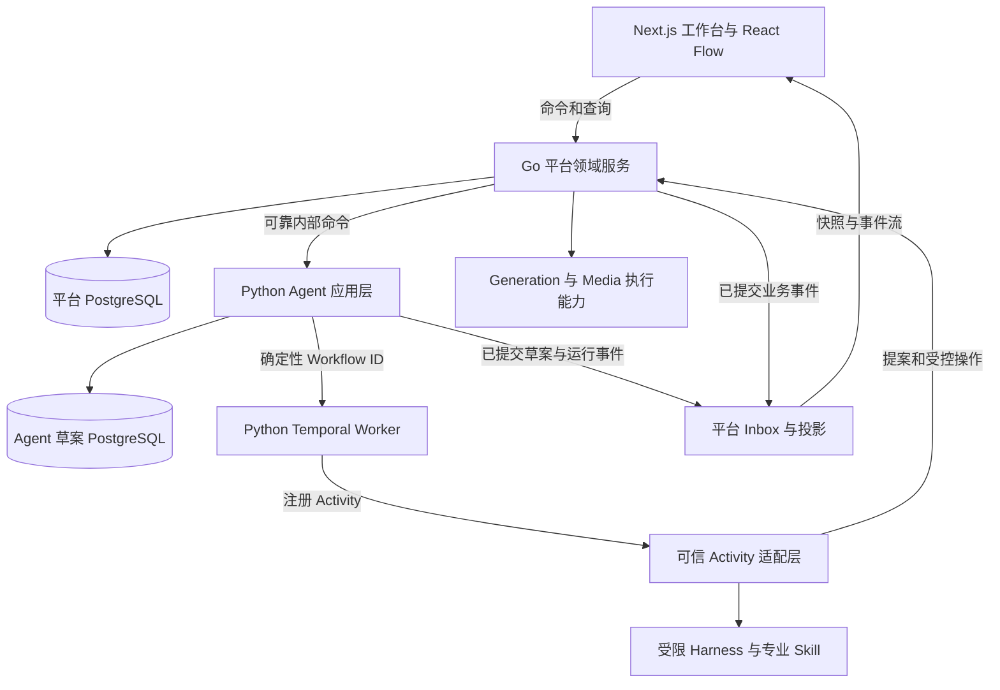

# 创作编排与多媒体画布架构调整设计

- 状态：待评审目标，尚未取代既有已接受设计
- 日期：2026-09-07
- 范围：新创作流程的编排归属、Agent 数据与权限、平台采纳、画布和事件投影、存量迁移
- 设计输入：SD-2026.09 / 1.0 的 Agent Harness、创作画布、ToC 平台三份统一设计稿；当前仓库代码与已接受设计
- 当前边界：[系统总体架构](0003-系统总体架构.md) · [后端语言与运行边界策略](2003-后端语言与运行边界策略.md) · [Agent Harness](3003-StoryGraph剧本解析Harness与内置Skill设计.md) · [前端应用架构](1001-前端应用架构.md)
- 联动专项：[3004 Agent Harness 专业能力与创作流程](3004-AgentHarness专业能力与创作流程设计.md) · [1003 多媒体创作画布与运行可视化](1003-多媒体创作画布与运行可视化设计.md)

## 1. 结论与变更范围

Lanverse 保留 Go 正式业务底座，将新创作流程按流程族逐步交给 Python Temporal Worker；受限 Harness 继续只执行有界专业任务。Go 拥有正式源版本、项目与资产、审阅决定、采纳结果、供应商操作、费用和账本，Python 应用层拥有新流程的分析草案与运行证据。前端以 React Flow 展示资源和执行投影，通过独立 CanvasOperation 编辑布局。

这是职责和协议调整，不以更换 ORM、前端查询库、消息基础设施或重排目录为目标。Go 与 Python 使用同一 Temporal 平台的不同流程类型和任务队列，不各自推进同一创作运行。

本轮由三份联动 Design 表达变更，各自只定义其负责的合同。接受后将决定同步回受影响的既有设计，保留迁移依据；不长期维护互相矛盾的模块规范。当前不派生新 PRD、Requirement、Plan 或完成记录。

| 设计 | 唯一负责的内容 | 引用其他设计的内容 |
| --- | --- | --- |
| 0013 本文 | 所有权、公共身份、可靠交接、采纳回执、运行切流与退役 | Harness 的任务/步骤定义，画布的布局和呈现 |
| [3004 Harness](3004-AgentHarness专业能力与创作流程设计.md) | Task/上下文、Skill、流程职责、预算修复、StepDescriptor 与 OutputBinding | 平台身份/事务，画布节点和坐标 |
| [1003 画布](1003-多媒体创作画布与运行可视化设计.md) | CanvasDocument/Operation、节点/端口/分组、交互、媒体与恢复体验 | 正式资源、执行描述、持久事件传输 |

| 边界 | 当前已接受设计 | 本次目标 |
| --- | --- | --- |
| 创作编排 | 全部 Workflow/Activity 位于 Go | 新流程族由 Python 编排；旧 Go 类型保留存量恢复能力 |
| Agent | Backend 私有、无持久存储的候选执行器 | 区分可信 Agent 应用层、Workflow Worker 和受限推理进程 |
| 草案 | Go 存放 Invocation、Result、Candidate Revision | 新流程草案由 Agent 自有存储负责，通过固定提案版本与平台采纳回执交接 |
| 画布 | 首版只读 Story/Workflow Lens，可写画布延后 | 在只读 typed Query 基础上增加独立布局操作及业务命令入口 |
| 实时状态 | 当前页面部分使用轮询 | 持久项目投影、快照游标和可恢复事件流 |
| Skill | 单个 build-storygraph Release 和 Stage 注册表 | 复用已有能力，按输入输出、评测和发布边界逐步拆专业包 |

不在本次范围：重写所有旧 Workflow、迁移全部历史候选、批量改业务表名、完整支付/社区设计、自由代码节点、第二套调度器、多人 CRDT、安装依赖、创建未来目录或直接实施业务代码。

## 2. 当前实现依据与差距

| 当前事实 | 源码入口 | 对调整的影响 |
| --- | --- | --- |
| Go 已实现 Episode/Shot Temporal 类型与 Activity、人工等待、暂停和外部轮询 | `backend/internal/workflow/adapter/temporal/workflow.go` | 需要真实切流与历史兼容，不按空仓库建新系统 |
| Python 已有严格候选、包 hash、调用次数和 deadline；默认不允许工具 | `agent/app/modules/storygraph/harness.py` | 保留内核控制；新增平台端口不能直接给推理进程写权限 |
| 新 Scene Fact 阶段已有 Go/Python wire 和候选实现 | `agent/app/modules/storygraph/scene_analysis_registry.py`、`backend/internal/agent/contract/scene_analysis.go` | 做字段/来源映射，不能把这些代码误判为整套新流程已完成 |
| 架构测试禁止 Agent 依赖 temporalio、业务存储等 | `agent/tests/architecture/test_runtime_language_boundaries.py` | 接受新边界后重写权限约束测试，不直接删除测试绕过限制 |
| Go 保存正式源、来源索引与 Agent 候选版本 | `backend/internal/production/script/domain/source.go`、`backend/internal/platform/database/model/scene_analysis.go` | 原稿与新解析表示分离，旧候选维持原所有者 |
| Authoring 已分开内容 hash 与执行 hash，但 Draft 统一管理 Graph/Layout revision | `backend/internal/authoring/domain/domain.go`、`backend/internal/authoring/application/service.go` | 复用身份/幂等验证，布局并发需要独立合同 |
| 前端已有 RTK Query，尚无 React Flow 依赖 | `frontend/src/lib/server-state.ts`、`frontend/package.json` | 保留缓存体系，新画布只作为消费者 |
| Review 公共列表、领取、决定和恢复入口已注册 | `backend/internal/review/adapter/httpapi/handler.go` | 新流程接同一决定与正式采纳路径，不再造审批服务 |
| Workflow 组合根中 Media Factory Registry 为空，ProviderService 未注入 gateway | `backend/internal/bootstrap/workflow_process.go` | 真实供应商接入仍是独立缺口，迁到 Python 不会自动解决 |
| 当前媒体上传仅接受受限 document 类型 | `backend/internal/media/application/service.go` | 参考视频画布之前需要视频接管、探测、抽帧和派生物模型 |

这些是静态代码事实，不代表真实部署、在途任务或新目标验收。历史接受/验收记录按原范围保留。

## 3. 数据与权限所有权

图表示职责，不要求每个框一个微服务。平台和 Agent 可以共用受控 PostgreSQL 集群，但数据库、角色、迁移与备份边界分开；Python 不持有平台表写权限。

| 对象 | 唯一写入所有者 | 消费方式 |
| --- | --- | --- |
| 原始文件、正式源版本、正式来源索引 | Go Script/Media | Agent 获得冻结源引用与授权读取，不独立改原稿 |
| 解析表示、专业草案、候选修订、推理使用证据 | 新流程的 Agent 应用层 | Go 通过版本化内部接口读取；平台目录仅保存安全摘要和引用 |
| 正式项目、场次、实体、镜头与资产版本 | 现有各 Go 领域 Owner | 同一领域用例处理人工与 Agent 请求 |
| ReviewDecision | Go Review | 原决定可查询；Signal 只是通知，不能充当批准 |
| 正式采纳及 ID 映射 | 执行采纳的 Go 用例与各具体 Owner | AcceptanceReceipt 引用 Decision 和已提交 Owner Receipt |
| 外部生成、发送权、UNKNOWN、媒体接管、费用 | Go Generation/Media/Cost/Quota | Python 查询或等待平台 operation，不持有供应商凭据 |
| Canvas 布局、便签与视图引用 | Go Authoring | CanvasOperation；不改变业务版本或执行计划 |
| 新创作流程的恢复顺序 | Temporal History 与 Python Workflow | Step/Attempt 表和前端投影不能反向充当调度器 |

`SourceEdition` 在平台集成中映射正式源版本；Agent 的解析表示额外固定 parser revision 与源 hash。WorldBook、ShotBrief 等新术语通过显式模型转换对应既有领域，不能仅为术语一致重命名全部表。

Agent 应用层可保存草案并调用限定平台 API；推理进程仅获得本次输入、固定 Skill、推理能力和已批准的只读工具。两者的凭据、进程目录、挂载和网络权限分开。Workflow 代码无数据库、HTTP、文件或模型 I/O；I/O 只在注册 Activity 内执行。

## 4. 跨系统合同与可靠交接

### 4.1 身份与版本

公共 ResourceRef 固定 owner、type、id、revision；使用现有域内 version ID/hash 的对象保留其身份，不用显示名称或 React 节点 ID 替代。旧 Go 草案继续是旧 Owner，新 Python 草案使用独立 owner/契约版本；不能两边维护同一可变 Head。

RunCommand 固定 command_id、幂等键、payload_hash、项目、源版本、目标范围、Playbook/流程版本和 expected_revision。租户、actor 与服务身份来自已验证的身份上下文；服务端仍核验被代理用户权限。

InputSnapshot 保存源、已采纳上下文、Skill/模型/策略版本、范围及授权引用，不保存可永久使用的令牌。执行副作用前重新检查当前权限、批准有效期、费用上限和对象版本。

业务 run ID、Temporal Workflow ID/run ID、StepInstance ID、StepAttempt ID 和供应商 operation ID 分开。技术重试复用逻辑步骤及原 operation，创意重做或输入变化产生新候选/修订运行。Continue-as-New 不改变业务 run ID。

Go/Python/TS 共同固定 revision 表达、金额精度、null/缺省、规范化 hash、Unicode 字符偏移和错误语义，复用现有 canonical fixtures。内部 Pydantic 模型不直接成为平台数据库模型。

### 4.2 可靠启动

Go 在事务中保存命令、唯一运行路由和 Outbox；Dispatcher 调用受认证 Agent API。Agent 在自有事务中保存接受记录及启动 Outbox，再以确定性 Workflow ID 启动 Temporal。

每段都能按原身份查询和重投。同幂等键不同 payload 返回冲突；启动响应未知先查原 Workflow ID，不创建新 run。启动后的权限撤销阻止后续副作用，但允许受限对账和已在途结果接管。

初始路线沿用平台 Kafka 传递已提交事件；Go → Agent 的内部接受命令使用 Outbox + HTTPS，Agent → 平台的新草案/运行事件使用自有 Outbox → Kafka → 平台 Inbox。两个方向职责不同，同一种业务事件不另建并行 HTTPS 广播。Kafka 适配只在可信 Agent 应用层，不进入推理进程。

### 4.3 草案采纳

Agent 同事务写入 proposal revision、OutputBinding 和 Outbox 后才能发布产物可用事件。平台按固定 revision 读取草案，检查来源、引用、Scope、Decision 和 expected_revision，再执行明确的 Owner Apply。

单事务采纳时，正式版本、ID mapping、AcceptanceReceipt 和 Outbox 一并提交。已有 Gate 包含多个 Owner checkpoint 时继续保持显式 Effect Plan 和逐步 Owner Receipt；只有所有必需 Effect 已提交才发布完整 AcceptanceReceipt，不能用一个通用接口掩盖半完成状态。

回执至少绑定 submission_id、proposal_ref、payload_hash、Decision、Owner receipts、正式引用与 ID mapping。返回丢失时按 submission_id 查询原结果。采纳冲突返回版本差异，不能通过自动重试覆盖用户新修改。

Hash 依赖保持单向：输入/提案 → Decision → Owner Receipt → AcceptanceReceipt → Resume；不得让上游版本反向包含后续回执 hash。

### 4.4 外部生成

Python 的 ProviderCallFlow 只登记/查回平台 operation 并等待结果；Go Generation 唯一负责供应商发送权、请求身份、查询/回调去重、UNKNOWN、接管和费用协调。平台操作不能在返回 accepted 后依赖一次内存调用继续执行，提交与恢复必须持久化。

供应商受理后响应丢失，保留原 operation 和预留，不自动 fallback 或释放额度后重购。文件接管失败只重试接管原结果。用户暂停停止新的提交，在途任务按供应商能力取消或继续对账，不能将取消请求显示为已确认退款。

## 5. 画布与运行投影

工作台由正式资源查询、草案引用目录、布局文档和运行投影组成。StoryGraph 继续是明确 Schema 的内容投影；Canvas、执行 DAG 和内容关系不合并成一个 Graph DTO。

Canvas 的节点身份、版本绑定、布局并发、类型化连线、分镜组与业务操作语义统一由 [1003](1003-多媒体创作画布与运行可视化设计.md) 定义。布局变化不得隐式产生模型请求或费用，正式业务变化仍经过具体领域用例。

Playbook 编译后持久化 ExecutionManifest；专业流程、步骤描述、实例/尝试和输出绑定统一由 [3004](3004-AgentHarness专业能力与创作流程设计.md) 定义。Manifest 是冻结配置与展示依据，不启动第二个数据库调度循环。画布消费持久产物和运行描述，不从日志推断业务事实。

平台 Inbox 去重后在受控项目投影事务内更新资源/步骤、流游标和已提交事件。bootstrap 返回同一展示切面的 as_of_cursor；流从游标补读再持续推送。过期游标、权限变化或不兼容 schema 触发重新 bootstrap，不能重跑生产任务。旧 attempt 或低版本事件不得覆盖新状态。

该一致切面仅覆盖平台持久资源/运行投影；独立布局附自身 revision，不宣称跨平台库、Agent 库与布局的全局事务快照。正式执行使用固定 InputSnapshot。前端快照恢复、鉴权流、RTK Query 与 React Flow 状态分工见 1003。

## 6. 新旧运行切换、退役与失败恢复

流程路由随首次接受命令原子固定 family/version/runtime_owner、Workflow 类型与队列。重试和恢复读原路由，不根据当前默认配置重选执行者。

旧 Go 运行保持原类型、队列和必要版本；新 Python 流程用新类型和独立队列。禁止两种语言消费同一 Workflow Task Queue 来“自动接管”，禁止将 Go History 当作 Python 可直接重放的历史。

首个切换对象是有界的解析流程族，验证完成后扩展全局设定、逐场导演和制作。切流前现场核对在途任务、待审决定、UNKNOWN、候选和外部预留；本设计不预设这些集合为空。

回滚只关闭新的 Python 入口，保留已接受新任务的受控执行/恢复能力及平台接管结算。旧运行须经过执行排空、迟到消息与回执处理、历史保留/回放或明确 reset 策略后，才能移除旧 Worker；运行数量归零不等于可立即删除所有旧处理器和数据。

| 失败点 | 恢复依据 | 不允许发生 |
| --- | --- | --- |
| Go 已提交、Agent 未接收 | 原命令与 Go Outbox | 用户重试创建第二运行 |
| Agent 已接受、Temporal 未启动 | Agent 启动 Outbox 与固定 Workflow ID | 接受后任务永久丢失 |
| 草案已存、Activity 返回丢失 | 原步骤/输入身份和输出绑定 | 重复产物或一次修复覆盖旧候选 |
| 正式 Effect 已提交、回执响应丢失 | submission、Decision、Owner receipts | 重复创建角色、镜头或正式选择 |
| 旧批准迟到、用户已编辑 | 固定 subject revision 与计划 hash | 旧草案覆盖新内容 |
| 供应商操作 UNKNOWN | 原 operation、发送证据、预留 | 再次购买同一请求 |
| 投影或事件流中断 | Inbox、源版本、快照与游标 | 重建展示触发生成或扣费 |

## 7. 保留工具链与模块组织

Go 继续一个 module，保留 `backend/internal/<业务模块>`、显式构造注入和 `adapter → application → domain`。不为新图例创建一组空 cmd 或 Facade；真实隔离需要发生后才拆运行入口。

保留 GORM、Model Catalog、Kafka、现有对象存储适配与 RTK Query。生产 schema 变更、数据回填和回退机制需要单独设计；当前 AutoMigrate 不构成完整生产迁移保证，但解决迁移不要求更换 ORM。

Python 沿用 `agent/app/`，新增职责随实际消费者落入清晰模块。生产 Skill 保留在 `agent/skills/`；先明确现有 Stage 到新能力的映射，再按可独立评测、发布的边界拆包。42 项 Skill 和 11 类 Flow 是覆盖地图，不是一次性建目录指标。

Frontend 沿用 `frontend/src/features/`。只有首个消费者落地时才加入 React Flow；Node Banana 的画廊/分组交互可以选择性移植，其 Store、浏览器执行器与本地供应商设置不进入平台执行权威。

各应用测试继续放独立 `tests/`，不按外部蓝图将测试移入生产代码目录。

## 8. 受影响文档与接受后的同步范围

| 正式文档 | 需要调整的部分 | 继续保留的部分 |
| --- | --- | --- |
| [0003 系统总体架构](0003-系统总体架构.md) | Python 新编排与草案数据边界、跨系统图 | 正式 Owner、投影非事实源、事务与依赖方向 |
| [2003 运行边界](2003-后端语言与运行边界策略.md) | Python 应用/Workflow/Harness 三种权限；旧 Go Workflow 退役条件 | Go 正式 Writer、Provider/财务、模型受限执行 |
| [3003 Agent Harness](3003-StoryGraph剧本解析Harness与内置Skill设计.md) | 新流程、草案持久化、限定端口、能力包演进 | 来源、Schema、范围、预算、调用时限与修复约束 |
| [2002 后端领域](2002-后端领域模块功能设计.md) | 提案/回执桥接、资源目录与运行投影 | 现有各 Owner、明确事务与 CAS |
| [2055 Human Gate](2055-Workflow公共HumanGate命令与恢复设计.md) | Python 通知与恢复路由、AcceptanceReceipt 汇总 | Decision → Effect → Resume 和显式多 Owner checkpoint |
| [2051 Generation](2051-通用媒体Provider与Generation执行器设计.md) | 平台 operation API 与 Python 等待边界 | 唯一发送权、候选、UNKNOWN、预留及 Owner Apply |
| [1001 前端架构](1001-前端应用架构.md)、[1002 前端功能](1002-前端功能模块设计.md) | 可写布局、统一上下文、可恢复事件流 | 单应用、RTK Query、鉴权与 typed Query |
| [0010 内容图与画布](0010-StoryGraph内容图与DAG创作画布设计.md)、[0011 视觉生产](0011-剧本视觉生产工作台与世界观预设设计.md) | 内容关系、布局、执行与投影四者边界；按选定范围生成视觉资产 | 来源到实体/场次/镜头的可追溯性和既有正式身份 |
| [0001 完整基线](0001-AI短剧制作平台完整设计基线.md)、[0006 领域语言](0006-领域语言与模块命名规范.md)、[3001 制作圣经](3001-项目制作圣经生成执行框架设计.md)、[3002 分镜 Harness](3002-本地-Codex-分镜智能体执行框架设计.md) | 同步职责和新旧概念映射，消除重复定义 | 剧本事实与视觉建议分离、Scene Packet 和导演约束 |

同步以变更的职责为单位，不重写全部文档，也不把原来已接受内容全部降级。3004 负责 Harness/专业流程的专项替代范围，1003 负责画布/工作台的专项替代范围；三份设计联动接受并完成上述同步后，再更新涉及新流程的需求与实施计划。现有已接受队列不因提案发布而自动切换或获得新增编码授权。

## 9. 决策依据与待验证条件

采用 Python 编排是为了创作流程与 Python 专业能力、独立实验和评测共同演进，不是 Go 缺乏可靠编排能力。代价是新增草案存储、跨库一致性与部署维护。备选方案是保留 Go 编排、只增加画布和 Harness 能力；如果目标优先级改为最短交付时间，应明确采用备选并相应修订新设计。

公开研究沿用本次会话已核验的一手资料：

- [Temporal Python SDK](https://github.com/temporalio/sdk-python/blob/main/README.md) 与 [版本化说明](https://docs.temporal.io/develop/python/workflows/versioning)：支撑新 Worker、消息与版本化边界；不保证旧 Go 历史可跨语言迁移。
- [Temporal 滑动窗口示例](https://github.com/temporalio/samples-python/blob/main/batch_sliding_window/sliding_window_workflow.py)：参考有界并发与历史分段；取消和 ID reuse 策略必须按平台业务重新选择。
- [React Flow](https://github.com/xyflow/xyflow/blob/main/packages/react/README.md)：用作交互组件，领域数据和执行仍由平台实现。
- [Node Banana 固定版本 Store](https://github.com/shrimbly/node-banana/blob/5c0e0ae6150f29a6de819f8d6f1dedba15151f7c/src/store/workflowStore.ts)：同时包含交互与执行，说明整套移植会产生调度权威冲突。

设计接受前重点确认编排迁移收益与成本、Agent 新存储/凭据边界、平台采纳与旧 Gate 的一致性。进入实施时必须现场验证在途任务、部署与版本兼容、真实供应商可恢复性，以及生产 schema 变更策略；未知不能当作零存量或已通过。

首个可验证产品结果是原稿解析、可审阅草案、正式采纳和重启恢复；之后扩展全局设定、一场分镜、真实单镜头、画布与整集交付。不得用文档接受、页面截图或单元测试代替这些实际结果。
