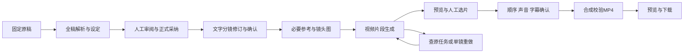

# LibTV 核心闭环能力调研与差距设计

- 日期：2026-09-08。
- 状态：2026-09-08 用户要求“先对我们核心能力进行打通实现”，本轮实施边界 A 及必要前端接线；边界 B 保持调研建议。
- 当前代码基线：`main` / `aca802a7`。本轮期间有并行提交，已刷新持久执行存储和部署文件状态；详见 [0014 评审记录](../acceptance/0014-当前实现评审与闭环核验记录.md)。
- 已接受边界：[0013 架构](0013-创作编排与多媒体画布架构调整设计.md)、[3004 Harness](3004-AgentHarness专业能力与创作流程设计.md)、[1003 画布](1003-多媒体创作画布与运行可视化设计.md)。

## 1. 结论与范围

调研时最需要补齐的是业务接线和交付能力。调研基线下 Lanverse 已有原稿版本、四类专业文本候选、持久执行存储组件、人工审核、正式分镜和图片生产可靠性底座；新生产 Workflow、平台采纳桥与前端尚未贯通，真实媒体 Provider 未接通，视频、声音与成片合成缺失。现阶段不能宣称用户可从剧本完成可播放短片。

保留两个完成边界：

| 边界 | 交付结果 | 当前处理 |
| --- | --- | --- |
| A：已接受的文本 MVP | 固定原稿 → 全稿解析与设定 → 可审阅、可修订的文字分镜 → 正式采纳 → 退出后可查回并恢复 | 继续补齐 [0013 后端计划](../plan/0013-新架构后端实施计划.md) 的 M01–M05；不以单项候选或存储测试替代 |
| B：LibTV 同类最小成片 | A → 必要视觉参考 → 镜头图 → 视频片段 → 人工选片 → 基础声音/字幕 → 顺序合成 → 预览、下载 MP4 | 本次提出的最小产品范围；接受边界后再形成必要的接口与实施合同 |

先闭合 A，再闭合 B。A 完成称“文本分镜闭环”，B 的真实媒体、人工操作、恢复与最终文件都通过后才称“最小成片闭环”。分镜 ZIP、若干视频 URL、健康检查和任务 accepted 都不等于成片完成。

A 的后端目标沿用已接受范围；本次补充 G04 的最小前端接线，让用户可以实际启动、审阅、采纳和查回。

调研阶段新增了本 Design 和评审记录。实施直接更新现有计划和验收记录，不派生成套文档，不修改历史验收结论。长期设计保留，首版不要求把全部规划能力实现完。

### 1.1 本轮实现合同

1. 固定源沿用 Go 已接受的 `NormalizedText/NormalizedHash`：换行为 LF，其他 Unicode 序列保持原样。Python 不再规范化；原始上传文件单独保留。内部读取绑定原 run、payload hash、原调用者当前权限和独立 HMAC audience。
2. 生产 Worker 依次执行分集、逐集解析、全稿 WorldBook、逐场导演。每一阶段都等待 Go 持久化的人工审阅与正式采纳回执，Workflow signal 只能唤醒查询，不能充当批准。
3. 草案通过既有 ExecutionStore 固定输入、release、额度、attempt/fence 和结果；unknown 不自动再次调用模型。可信服务只经 HTTP 调用受限 Harness，不导入推理进程。
4. 首版用主动同步读取可信 Agent 的固定执行快照与草案，Go 校验 run/source/hash 后建立独立 `creation_text_proposal` 审核对象。该读取不是结果事件广播；已有结果 Outbox 保留，Kafka 发布/投影接线不作为本轮完成声明，不新增并行 HTTPS 事件广播。
5. 采纳由各正式 Owner 同事务保存版本、临时标识映射和回执。分集形成 Episode/ScriptVersion，逐集解析形成 Structure；WorldBook 和文本导演意图采用 Owner 的显式文本版本，避免伪造旧候选、旧图或视觉资产。文字意图保持 `needs_asset`，不宣称可生产 Shot。
6. `continuity_mapping_pending` 必须在审阅时明确处置并留存理由；没有处置不能采纳，不能仅删除校验器 blocker。源不符、缺对白/节拍或引用错误仍是不可人工豁免的合同错误。
7. 前端复用 RTK Query，提供项目内固定源启动、阶段状态、完整候选与来源、人工审阅/采纳、回执及刷新恢复。完整无限画布、媒体生成和导出不进入本轮。

首版修订通过重新导入修改后的原稿、发布新源并发起新运行完成；旧运行、草案和回执保持原身份。逐候选原地编辑、局部重算和编辑撤销不在本轮最小接线范围内。

技术中断只有在服务端明确返回 `can_resume=true` 时允许恢复原运行；恢复保留原 source、release、输入和额度，不为 unknown 推理自动追加调用。跨 Owner 读取先释放 Creation 的项目事务锁，再由 Script Owner 独立事务复核当前权限与固定源，禁止在独立连接间嵌套持有同一项目写锁。

新增正式文本版本是业务对象，不是兼容旧 Workflow 的影子状态。旧正式候选保持原身份；新的采纳入口只接受固定的 Python 草案和对应人工决定。

## 2. LibTV 一手公开调研

### 2.1 来源与限制

统一访问日期为 2026-09-08。官网是产品声明，公开客户端是接入实现，均不替代登录后实测。本次没有登录、安装 CLI/Skill、上传原稿或调用生成。

| 来源 | 能证明什么 | 不能证明什么 |
| --- | --- | --- |
| [L1 官网介绍](https://www.liblib.tv/wappro?sourceid=040004) | 展示剧本、角色、世界观、无限画布、Agent，以及从生成到剪辑的定位 | 不能证明内部架构、实际质量或全部交互细节 |
| [L2 官方首页](https://www.liblib.tv/) | 展示视频生成、片段重拍、逐帧拉片和导演台入口 | 不将当前模型名称、数量、价格、时长宣传固化为 Lanverse 需求 |
| [L3 公开 Skill](https://github.com/libtv-labs/libtv-skills/blob/c609246c1eca69f6bc129bcbb5d64c36734e4a4a/skills/libtv-skill/SKILL.md) | 声明剧本/分镜、文生图、图生视频与会话修订任务 | 公开远程客户端不是完整创作后端或开源导演引擎 |
| [L4 上传脚本](https://github.com/libtv-labs/libtv-skills/blob/c609246c1eca69f6bc129bcbb5d64c36734e4a4a/skills/libtv-skill/scripts/upload_file.py) | 可以上传参考素材作为输入 | 不能证明角色一致性算法或一致率 |
| [L5 创建会话](https://github.com/libtv-labs/libtv-skills/blob/c609246c1eca69f6bc129bcbb5d64c36734e4a4a/skills/libtv-skill/scripts/create_session.py)、[查询会话](https://github.com/libtv-labs/libtv-skills/blob/c609246c1eca69f6bc129bcbb5d64c36734e4a4a/skills/libtv-skill/scripts/query_session.py) | 有会话身份、后续请求和查询方式 | 不能由轮询客户端推导服务端幂等、取消、退款或重启保证 |
| [L6 下载脚本](https://github.com/libtv-labs/libtv-skills/blob/c609246c1eca69f6bc129bcbb5d64c36734e4a4a/skills/libtv-skill/scripts/download_results.py) | 提取和下载图片/视频结果 | 结果下载不证明多镜头时间线合成 |
| [L7 CLI 官网](https://www.liblib.tv/cli) | 当前已有 CLI 入口，并保留“原 LibTV Skills”入口 | 旧公开仓库不能代表全部当前能力 |

源码固定在 `c609246c1eca69f6bc129bcbb5d64c36734e4a4a`。L7 链接的[新版指南](https://resonate.feishu.cn/wiki/RjelwT2UoidnTMka2nCc2chGnud)和[旧版指南](https://resonate.feishu.cn/wiki/OwYKwl4xoiywU5kklrrcAyVDn7d)本次要求飞书登录，未读取正文；官网链接的 CLI Skill ZIP 获取返回 404，未取得内容。不能因此推导 CLI 产品整体不可用。

没有采用第三方“LibTV 官网”聚合站作为官方证据。LibTV 的字幕/TTS、音轨编辑、转场、剪辑工程格式和具体导出规格仍待核实；以下声音、合成和恢复合同是 Lanverse 的工程判断，不是对 LibTV 内部实现的断言。

### 2.2 首版能力取舍

| 能力 | 公开参考 | Lanverse 最小范围 |
| --- | --- | --- |
| 剧本与分镜 | L1、L3 | 必需：来源清楚、可编辑和确认的有序镜头列表 |
| 角色与参考素材 | L1、L4 | 必需：本片实际需要的角色/场景/道具参考，人工固定版本后被镜头生成消费 |
| 图像、视频生成 | L2、L3 | 必需：各一个可用能力，跑通一条真实生成链 |
| 修订与重拍 | L2、L3 | 必需：改一个镜头、重新生成、保留历史并选定；精细遮罩和任意片段编辑后置 |
| 异步查询 | L5 | 必需：刷新后能查任务、候选和正式选定结果，技术恢复沿原身份进行 |
| 成片交付 | L1、L6 | 必需：合成可播放文件；有对白的样例有完整声音路径，不能只提供结果列表 |
| 无限画布 | L1 | 后置：阶段导航、镜头卡和详情面板足以承载首版 |
| 外部 Agent/CLI、Skill 生态 | L3、L7 | 后置：内部固定流程先跑通，不新增公共 CLI 或运行时安装外部 Skill |
| 拉片、3D 导演台 | L2 | 后置：不阻塞原创剧本到成片 |

## 3. 当前能力与缺口矩阵

“存在”表示源码和局部合同存在；“部分”表示必要环节未接通；“缺失”表示在相关源码、注册和调用链中未找到实现。局部测试通过不写成用户全链已验收。

| 环节 | 当前证据 | 还缺什么 |
| --- | --- | --- |
| 原稿导入、正式源 | [SourceService](../../backend/internal/production/script/application/source_service.go) 第 104–155 行固定源；[项目页](../../frontend/src/features/project/project-workspace.tsx) 查询当前文档 | 新 Agent 冻结源读取桥；源表示、hash 与偏移口径一致 |
| 新运行接受 | [Go creation](../../backend/internal/production/creation/)、[Python creation](../../agent/app/creation/) 已有命令、Outbox、原身份启动 | 非测试 Python 源码未找到生产 Workflow/Worker 注册；accepted/started 只说明接受/启动 |
| 四类专业任务 | [TextHarness](../../agent/app/modules/text_storyboard/harness.py) 有分集、逐集解析、WorldBook、单场导演；[纯合同](../../agent/app/text_contract/) 独立于推理 | 还需真正的生产 Activity、上游审阅屏障和正式产物桥；单场导演保留 continuity_mapping_pending blocker |
| 持久执行存储 | [ExecutionStore](../../agent/app/creation/execution.py) 已有冻结额度、领取、unknown、草案/OutputBinding/Outbox 同事务保存；并行提交中新增 | 尚未接生产入口、结果事件投递或 Workflow；组件不是完整运行恢复闭环 |
| 审阅与正式采纳 | [Review HTTP](../../backend/internal/review/adapter/httpapi/handler.go)、旧分镜 intent Owner、[审阅台](../../frontend/src/features/review/review-workbench.tsx) 可复用 | Python proposal 固定版本读取、显式转换、ID mapping、Owner Effect 与 AcceptanceReceipt 尚未贯通 |
| 当前前端主链 | [剧集工作台](../../frontend/src/features/episode-production/episode-production-studio.tsx) 第 217–293 行走旧分镜生成、整批采纳和 ZIP | 没有新 creation/runtime 客户端；第 357–362 行主要展示标题/时长/数量，缺完整分镜详情与修订 |
| 视觉参考接管 | [Media Initialize](../../backend/internal/media/application/service.go) 第 98–102 行仅允许 document 与 txt/md/docx MIME；工作台第 331–332 行是资产/媒体占位 | 图片上传/生成、角色与用途绑定、参考预览、真实镜头消费链 |
| 图片 Provider | Generation 已有候选/QC、发送权、UNKNOWN、成本预留、选择和绑定；[组合根](../../backend/internal/bootstrap/workflow_process.go) 第 154–169 行 registry 为空、gateway=nil | 一个真实 Adapter 与请求/查询/结果接管；配置服务存在也不等于公开配置路由已注册 |
| 镜头出图 | [Target](../../backend/internal/generation/domain/target.go) 有 shot_frame；[preparation](../../backend/internal/generation/application/preparation_service.go) 第 214–245 行实际限制 reference_asset/image | 正式 Shot + 已选参考 → ShotFrame 提交 → 图片候选，不能拿 DTO 或预置 job 测试替代 |
| 视频与音频 | 当前 Provider 输出、Asset 注册、候选 QC 主要检查 PNG/JPEG；上传仍仅文档 | 视频生成 Target/Adapter、视频与音频接管、实际流/时长探测、预览与按 Shot 选片 |
| 媒体人工审核 | [候选面板](../../frontend/src/features/review/review-subject-panel.tsx) 第 59–75 行是候选 ID 单选项 | 需图片/视频预览、所属镜头和版本、质量问题与正式选用回执 |
| 声音、剪辑与导出 | [package.go](../../backend/internal/production/storyboard/application/package.go) 第 29–85 行输出 JSON/CSV/HTML/manifest ZIP；未找到媒体合成执行路径 | 一条对白声音路径、基础字幕、冻结剪辑输入、MP4 渲染/校验/预览/下载 |
| 刷新与验收 | Bible/HumanTask 已有局部恢复；[分集页面](../../frontend/src/features/planning/episode-plan-workspace.tsx) 第 37–38 行将 plan/commit 存 useState | 查回未完成计划和新运行；旧 E2E 仍等待被移除的“确认制作圣经”，需更新真实用户旅程 |

### 3.1 先统一源表示

Go `SourceSpanIndex` 使用 `NormalizedText/NormalizedHash`，明确 `NewlineNormalization="lf"`；[新 SourceEdition](../../agent/app/text_contract/source.py) 第 15–34 行对传入文本 UTF-8 字节验 hash，3004 第 11.2 节要求不改原输入序列。CRLF 原稿的 raw/normalized hash 和 code point 偏移不同，接线时不能混配。

最小建议是沿用 Go 已接受的源表示，Harness 精确保留读到的该版本文本，原始文件独立保存；这需要同步 3004 对“原文”的定义。若产品要求直接引用原始上传序列，则补 raw 索引与映射，不替换现有索引的语义。接线合同必须用中文、emoji、组合字符、CRLF/LF、空行和跨段读取验证，不能各端独立规范化后假定等价。

## 4. 最小用户流程

首个真实验收用合成原创短稿，包含 1–2 名主要角色、3–5 个镜头，目标约 15–30 秒。这是控制验收范围的样例，不是产品时长承诺；全稿事实解析不以截取选定场代替。

复用项目页、阶段导航、镜头列表、候选预览、任务/问题区和成片预览。每步给结果、阻断原因与下一步动作；失败不清空已选素材。前端仍经 Go API/RTK Query 操作，不直连私有 Agent 或供应商。

## 5. 必要缺口与依赖

下列编号用于描述设计依赖，不是已接受的新实施计划，也不是评审缺陷严重等级。A/B 对应第 1 节。

| 编号 | 优先级 / 依赖 | 最小补齐范围与 Owner | 必须看到的证据 |
| --- | --- | --- | --- |
| G01 | 必需 A | Go Script/Creation 提供固定源读取桥；当前权限、源表示、版本/hash、范围和上限一致 | 跨语言原文/偏移一致，越界、漂移、跨项目和撤权被拒绝 |
| G02 | 必需 A，G01 | 接通现有 ExecutionStore 与真实 Python Temporal Workflow/Activity；固定输入，逐阶段提交草案并等待人工门；投递结果事件 | 真实 Worker 产出可查草案；提交后重启查回原结果，不重复推理；人工等待不占推理进程 |
| G03 | 必需 A，G02 | proposal → Go Review → 既有正式 Owner → ID mapping/采纳回执；处理本次所需身份披露和跨场状态 | blocker 得到明确处置；重复采纳返回原回执；旧审批/旧 revision 不能覆盖新修改 |
| G04 | 必需 A，G03 | 前端接 creation 创建/当前运行/详情与审核；呈现来源、动作、对白、分镜详情和必要修订；恢复分集计划 | 用户从项目页面完成 A；刷新继续；E2E 改走真实 HumanTask 路径 |
| G05 | 必需 B，G03 | Go Media/Asset 接管本片必要参考图片，保存 hash/版本/预览；角色/场景/道具引用有用途和可披露状态 | 生成请求真实消费已选参考；未 ready、错误项目和版本冲突被阻止 |
| G06 | 必需 B，G05 | Generation 注册一个真实生图/参考图能力，贯通 ShotFrame 提交、原结果接管、图片候选和人工选择 | 请求、账本、实际图片、QC 和选择可追溯；接管失败不再次购买生成 |
| G07 | 必需 B，G06 | 复用 Generation 发送权/预算/UNKNOWN 合同扩展一种图生视频；接管视频、探测流和时长，Production 保存选片 | 每镜可播放、有实际时长且可查选定版本；失败只处理该镜，未知结果查原 operation |
| G08 | 必需 B，G07 | 一条完整对白声音路径与基础字幕；首版可使用授权上传的对白/旁白音轨，不要求建设 TTS/声音克隆 | 有对白样例能完整听见台词；音轨不重复叠加；字幕/声音时码不越界 |
| G09 | 必需 B，G07/G08 | 既有 Go 正式领域/媒体执行边界保存最小 EditPlan：选片版本、顺序、入出点、声音/字幕、输出规格；受控合成与文件接管 | 一个完整 MP4、内容 hash、冻结输入 manifest；改顺序/选片后产生新交付版本 |
| G10 | 必需 A/B，贯穿 | 补真实模型、HTTP/数据库/Worker、浏览器与最终文件验收；分别验证断线、重启、撤权、迟到结果 | A/B 独立证据；组件测试、候选测试和技术预检不能代替产品验收 |

起始快照的部署文件删除已在并行工作中恢复，本次重新运行架构/观测测试通过，因此不再把它们列作当前待补业务能力；保留历史发现见评审记录。

### 5.1 Provider 需要完成的专项接入调查

先选择各一个确实可调用的图片、视频能力，不建多模型市场。沿用 MediaFactoryRegistry、Provider 配置、Generation/Cost/Quota 和 Asset，供应商副作用仍由 Go 承担。

对选定供应商的一手 API，必须核验：参考图输入方式、图生视频输入、时长/比例/分辨率支持、请求身份或幂等方式、查询/回调、结果链接有效期、取消能力、使用量/费用返回。适配器必须覆盖完成、限流、失败、提交响应丢失、原结果不可下载与取消不支持。不支持查询原请求的供应商不能被假定可无损自动重投。

当前没有已接通生产适配器，因此本次不写默认模型、价格和精确费用承诺。真实验收前固定供应商版本、最大调用次数和费用上限。生成授权、预算、预留、UNKNOWN 与账本保留；支付套餐和商业后台后置。

### 5.2 视频、声音和合成

接管先验证文件可读、真实格式、流信息、时长和尺寸，再登记 ready；不只看扩展名或供应商 success。可用官方 [ffprobe](https://ffmpeg.org/ffprobe.html) 输出媒体属性；字节/时长预算和解码 deadline 在实施合同固定。

顺序合成可采用 FFmpeg。官方 [concat 文档](https://ffmpeg.org/ffmpeg-formats.html#concat) 要求输入流结构、编码和时间基等兼容；不同供应商输出不能直接复制拼接后视为合格成片。首版建议固定一个输出比例/编码规格，必要时统一转码，再对完整输出解码检查。本次只做方案核验，未运行合成。

EditPlan 只需选定 Take/asset revision、镜头顺序、裁切入出点、音轨和字幕时码。改变正式顺序/时长提交 EditPlan 修订；拖动画布卡片不改变成片顺序。首版保留一种可完成对白的声音路径；无对白样例可以明确无对白，但不能用静音成片冒充有对白短剧交付。

交付包含 MP4、必要字幕和 manifest。manifest 固定源、正式分镜、选片、声音、剪辑、媒体 hash、输出规格与渲染器版本。重新合成创建新版本；预览/下载按项目权限重新签发地址，不保存过期 URL 作为永久资产身份。

## 6. 数据与失败路径

沿用 0013：Python 可信应用拥有新草案与编排，受限 Harness 只推理；Go Script/Production/Review 拥有正式事实与采纳；Go Generation/Media/Asset/Cost/Quota 拥有副作用、媒体与费用。前端呈现和发显式命令。合成遵循同一边界，不新增第二个调度器或通用微服务。

| 交接 | 固定数据 | 失败行为 |
| --- | --- | --- |
| 源 → 文本任务 | 表示、revision/hash、scope、Skill release、已审阅上游 | 版本/来源不符拒绝；超上下文明示失败，不截断 |
| 草案 → 审阅 → 正式对象 | proposal revision/hash、Decision、expected_revision、Owner Receipt、ID mapping | 半完成保留 checkpoint；查询原 submission；旧审批不套用新草案 |
| 镜头 → 媒体操作 | Shot/参考版本、配方、预算、operation ID、请求身份 | UNKNOWN 保留原操作和预留；不自动换模型重购 |
| 媒体 → 候选 → 选片 | 原结果、接管 hash、技术检查、候选和正式选择版本 | 接管失败只重取原结果；选择冲突拒绝；失败尝试保留成功选片 |
| 选片 → 合成 → 成片 | EditPlan、实际时长、入出点、声音/字幕、输出规范和清单 | 缺镜、素材未 ready、时码越界或版本漂移阻止导出；渲染失败只重试合成 |

界面区分未就绪、排队、运行、等待人工、完成、失败、结果未知和已取消；具体状态映射复用模块合同，不全局替换现有枚举。命令接受、启动、候选生成、采纳、媒体 ready 和成片完成分开展示。

修改一个场/镜头只处理其实际依赖。修改分镜后关联素材待重验，用户明确重做才新增费用；只改剪辑顺序只重新合成。旧候选、旧选片、旧交付保持可查，迟到结果不能覆盖新 revision。

## 7. 明确后置

| 能力 | 为什么后置 |
| --- | --- |
| 无限画布、任意 DAG 编辑、多人 CRDT | 现有工作台即可承载首个闭环；1003 长期设计保留 |
| 完整 42 项 Skill、11 类 Flow | 先接四类专业任务与实际需要的持久边界，不以目录数量衡量完成 |
| 全剧所有角色/造型批量出图 | 全稿先解析，只制作选定镜头实际依赖的参考 |
| 参考片拉片、风格逆向、3D/Blender | 不属于当前原创短稿的必要输入 |
| 多模型市场、自动 fallback、公共 CLI/Skill、社区模板 | 优先一条真实生成与选用链 |
| 声音克隆、自动口型、专业多轨、复杂转场/调色 | 一条完整对白路径、基础字幕和顺序合成足以验收短片 |
| 无限长稿、长剧批量并发 | 当前上下文上限 240,000 bytes，超限须明确失败；后续再做分块归并 |
| 支付套餐与商业后台 | 不阻塞本次闭环；已有费用授权与预算控制仍是必需项 |

## 8. 拟议完成定义

以下均未在本次验收通过：

- A：从项目页固定原稿，真实新 Worker 生成全稿事实、设定与分镜，人工修订/采纳；退出页面或重启 Worker 后沿原身份继续。
- A：对白、身份披露与必拍信息有来源和镜头映射；blocker 有明确处理方式，不靠隐藏问题或自动批准过门。
- B：3–5 个镜头实际使用确认参考并生成图片/视频；至少一次单镜失败和恢复，其他镜头不重做。
- B：缺镜、失效素材、声音缺失、时码或版本冲突阻止完整导出；完整 MP4 在浏览器从头播放到尾，顺序、尺寸、实测时长、对白和字幕符合确认结果。
- B：替换选片或调整顺序后，新导出反映修订；旧成片不覆盖；刷新后仍可预览和下载。
- A/B：跨项目读取拒绝；重复点击、断线与迟到结果不重复写正式对象或重复购买生成。

下一步先完成 G01–G04 的文本接线和验证，再基于本 Design 收敛媒体供应商、源表示、输出规格与声音路径的具体合同。真实供应商质量/费用、浏览器全流程和最终成片验收仍未完成，本次不构成上线声明。
