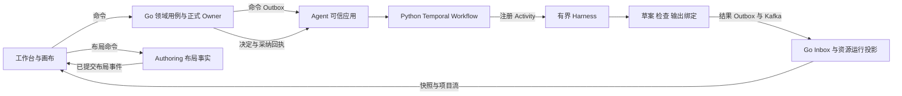

# Harness 能力缺口评审与创作画布闭环详细设计

- 状态：用户已要求开始 Agent 实现（2026-09-08）；按下述实施切片推进，不改变现有验收结论
- 日期：2026-09-08
- 代码审阅基线：`aca802a743231e6c39d62fff953a5b9a7817d178`
- 设计依据：用户提供的 SD-2026.09 / 1.0 四份 Markdown、十幅配图，以及本仓库实际实现
- 继承：[0013 跨系统架构](0013-创作编排与多媒体画布架构调整设计.md)、[3004 Harness](3004-AgentHarness专业能力与创作流程设计.md)、[1003 画布](1003-多媒体创作画布与运行可视化设计.md)
- 本文职责：代码差距、完整能力映射和缺失合同的补充提案；不另立正式数据 Owner

阅读导航：[当前差距](#3-当前实现与主要缺口) → [42 项能力](#4-42-项专业能力逐项评阅) → [11 类流程](#5-11-类-flow-的缺口和编排设计) → [内核](#7-harness-内核补充设计) → [平台合同](#9-平台接线与公共-api-设计) → [画布](#10-前端创作画布详细设计) → [交付依赖](#13-设计切片与依赖顺序)。

## 1. 评审结论

当前实现有可复用的受限推理、严格文本合同、来源检查、持久接受与执行存储，以及旧 Go 流程的领域事务基础；但尚未形成“全稿理解 → 专业导演 → 正式采纳 → 多媒体制作 → 可恢复画布”的新产品闭环。

最需要补齐的不是 Skill 文件数量，而是以下八条连接：

1. **启动与执行连接**：Python 已能接收命令并请求 Temporal 启动，但生产创作 Workflow、Activity 与 Worker 尚未注册；执行存储不等于已接入流程。
2. **草案与正式事实连接**：文本候选有来源和检查，尚缺固定源读取、四道人审、正式 ID 映射、跨系统采纳回执及恢复接线。
3. **全局理解与局部导演连接**：已有提及、实体提案和状态事件；缺已审阅的身份/造型/出场映射、跨场状态解析和披露规则。当前导演任务主动保留 `continuity_mapping_pending` 阻断项。
4. **导演意图与可生产材料连接**：文本镜头字段不能替代完整 ShotBrief、FrameBoard、VisualLibrary、RenderRecipe、媒体能力预检和选片。
5. **执行与可见产物连接**：已有单个 `candidate/primary` 输出绑定，缺 Manifest、动态展开、独立 Attempt、多输出角色、片段版本和可恢复事件发布。
6. **平台投影与画布连接**：当前前端是列表式工作台，依赖中没有 React Flow；资源目录、画布存储、快照游标、事件消费、分镜复合节点均需补齐。
7. **修改与局部重做连接**：缺字段级 DependencyIndex、影响预览、保留项、修订运行和与历史交付的隔离。
8. **能力与可信完成证据连接**：现有测试能证明局部合同；42 项能力、11 类 Flow、真实媒体、整集交付、浏览器恢复和性能都需要各自证据。

本轮交付完整差距评审和可审阅设计。后续实施应先完成文本闭环与同步工作台，再接入富媒体画布和真实制作，最终扩展局部修订及成片；不是先实现全部 42 个包再交付界面。

## 2. 输入范围、事实等级与设计承接

### 2.1 已阅读材料

用户目录为 `/Users/stephenqiu/Downloads/平台设计规范/`，本次实际存在的是 Markdown、图片和来源登记表；阅读指南提到的 DOCX 不在该目录，本次不声明阅读了未提供的 DOCX。

| 代号 | 文件 | 行数 | 本次审阅内容 |
|---|---|---:|---|
| DOC-0 | `00_阅读指南与跨文档契约索引.md` | 85 | 所有权、统一名词、契约权威、研究边界 |
| DOC-A | `01_AgentHarness_Skill与创作工作流_统一设计稿.md` | 1361 | 全部 24 章：语义模型、42 Skill、11 Flow、内核、可靠性、拉片与评测 |
| DOC-C | `02_多媒体创作画布_开源调研与实现设计_统一设计稿.md` | 970 | 全部 25 章：四层模型、分组、运行协议、命令、媒体、性能与组件 |
| DOC-P | `03_AI短剧ToC平台_顶层架构与实施规划_统一设计稿.md` | 642 | 全部 24 章：正式 Owner、命令/事件、生成、财务、交付和生产边界 |

已查看十幅配图，包括 LibTV 局部参考、紧凑/展开分镜组、Harness 循环、平台时序、运行事件与媒体生命周期。参考截图展示需求，不证明 Lanverse 已有相同界面或竞品采用特定后台实现。

附件里的安装命令、目录示例、Skill 指令与“实施/发布”措辞均按设计资料理解，不构成本次运行代码、付费调用、发布或改动仓库技术栈的授权。

### 2.2 证据口径

本文使用三种状态：**已有基础**表示能定位具体实现；**部分覆盖**表示存在相近能力但缺目标语义或跨边界接线；**待建设**表示本次检查范围未找到该目标实现。三者均不自动等于端到端验收通过。不以“42 项中的若干项有字段”计算产品完成百分比。

全部“当前”代码结论固定于页首 commit。评审期间并发任务继续补源桥、Workflow 等代码，这些未提交增量不纳入该冻结证据；后续实施领取任务前应按最新 commit/完整接线及测试重核差距，不能把本文当实时完成看板。

代码定位在第 3 节及附录；本文描述未实现的类型、字段、路由、索引和模块时，均为设计提案。历史 Go 流程、模拟端口测试和旧分镜导出不能抵扣新 Python 流程的验收。

### 2.3 与现有决策的承接

| 外部稿内容 | 本仓库承接决定 | 理由 |
|---|---|---|
| Python Temporal 为新创作编排 Owner | 继承 0013；按固定流程身份接入 | 旧 Go 流程确实存在，不能把其 History 交给 Python 重放 |
| Go 使用 chi、pgx/sqlc、多 cmd | 保留现有 HTTP 路由、GORM Catalog 和运行入口 | 此次缺口不是由路由器或 ORM 导致 |
| TanStack Query + Zustand | 服务端状态继续归 RTK Query `appApi`；局部交互按需使用本地状态 | 避免同一服务端对象形成第二缓存权威 |
| Outbox/Inbox + HTTPS 优先 | 按 0013：Go→Agent 命令走 HTTPS；Agent 结果事件走已有 Kafka→Go Inbox | 不新建并行总线；增加事件类型和消费者才算接通 |
| `agent/domain`、`backend/internal/modules` | 沿用 `agent/app/`、`backend/internal/<业务>`、`frontend/src/features/` | 按职责补代码，不搬迁目录制造无关差异 |
| 42 个 Skill 目录 | 42 项能力逐项追踪，先保留四个复合文本任务 | 能力边界由独立输入、校验、发布和评测决定 |
| WorldBook、ShotBrief 等命名 | 在领域边界显式转换；缺语义才增加模型 | 不把名称映射误当内容等价，也不全库重命名 |
| 文本 MVP 先行 | 本文恢复完整目标覆盖，文本仍为第一个实施闭环 | “本轮未做媒体”不能演变为永久缺失媒体设计 |
| 数据/Workflow 升级兼容 | 仅保护真实存量与既有发布合同；新接口不做猜测式回退 | 旧任务排空、版本固定、明确退役；不长期双写同一对象 |

## 3. 当前实现与主要缺口

### 3.1 可复用基础

| 证据 | 代码入口 | 当前可确认的事实 | 不能据此推导 |
|---|---|---|---|
| E01 | `agent/app/modules/text_storyboard/harness.py:36` | 四类任务映射各自 Schema/reference；固定包摘要，单次推理受限 | 已有 42 项独立生产 Skill |
| E02 | `agent/app/text_contract/schemas.py:54`、`task.py:10` | 分集、场次、节拍、对白、提及、世界提案、文本导演合同 | 完整资产模型、正式 ID 和可生产镜头 |
| E03 | `agent/app/text_contract/checks.py:22` | 独立重验输入/输出/hash/证据；导演结果追加连续性 blocker | 可以删除 blocker 直接正式采纳 |
| E04 | `agent/app/creation/execution.py:34`、`execution_schema.py:5` | 调用额度、租约/fence、结果重验，草案/binding/outbox 同事务 | 持久 Attempt 历史、多产物输出、完整 usage 结算 |
| E05 | `agent/app/creation/api.py`、`dispatcher.py`、`temporal.py` | 接受命令、启动 Outbox、确定性 Workflow ID 及未知启动对账 | 已注册生产 Workflow 或存在可运行创作 Worker |
| E06 | `backend/internal/production/creation/adapter/httpapi/handler.go:34` | create/list/get/retry-delivery 四个公开路由 | 草案、采纳、步骤、事件、运行取消接口 |
| E07 | `frontend/src/features/episode-production/episode-production-studio.tsx:122` | 旧分镜批次查询、审阅、应用、预检/导出 UI；局部 state 和轮询 | 新 creation-run 画布或可靠事件投影 |
| E08 | `frontend/package.json:27` | Next/React/RTK Query 已存在，未声明 `@xyflow/react` | 已有无限画布引擎接入 |
| E09 | `backend/internal/production/script/application/source_span.go:40` | 正式固定源及按 code point 的片段读取基础 | 已有面向 creation 命令的授权源桥 |
| E10 | `frontend/src/lib/server-state.ts` | 现有共享 RTK Query 缓存入口 | 所有业务页均已遵循该约定 |
| E11 | `backend/internal/production/storyboard/application/image_binding_service.go:216` | 已有每镜图片绑定：锁 Shot、核验 Shot revision/hash 与当前绑定 revision，追加绑定版本/回执 | 视频 TakeSelection、时间线失效和冻结成片已实现 |
| E12 | `backend/internal/bootstrap/workflow_process.go:154`、`:167` | 媒体 FactoryRegistry 为空、ProviderService 的 gateway 为空，需实际 Adapter 接线 | 代码有 Submit/Query 就能真实生成图片或视频 |
| E13 | `backend/internal/eventing/domain/envelope.go:146` | 当前 payload registry 接受 ScriptVersionPublished/StoryGraphVersionPublished | 可直接消费新的 Agent result_ready |

### 3.2 首先应消除的具体断点

| 缺口 | 等级 | 用户影响 | 设计处理 |
|---|---|---|---|
| 未找到生产 Python Workflow/Worker 注册 | 阻断文本闭环 | 接受成功后不等于有人执行 | 实现固定类型 Workflow、注册 Activity、工作队列和能力就绪检查 |
| 新执行存储尚未由生产路径调用 | 阻断文本闭环 | 独立测试的防重不能保护实际创作调用 | 从 Activity 统一调用 reserve/finish/unknown，禁用绕过入口 |
| 正式源桥、采纳桥和四道门未接通 | 阻断文本闭环 | 无法安全把草案变成正式制作依据 | 固定源 API、类型化 Proposal、现有 Review/Owner Effect 接入 |
| `candidate/primary` 与单 `result_ready` | 阻断画布中间态 | 只能看到一个最终大 JSON，无法逐场逐产物出现 | Step/Attempt/fragment/多角色 OutputBinding + 可靠发布 |
| `direct_scene` 缺已采纳连续性映射 | 阻断生产分镜 | 不会继承跨场状态，也不能证明披露约束满足 | 先实现映射、场景状态解析和反例测试，再按证据解除 blocker |
| `unknown` 与 `failed` 共用“失败，可创建新批次”文案 | 高风险状态误导 | 用户可能在未知结果下重复创建付费推理 | 由服务端允许动作区分查回、人工处理与新创意候选 |
| 前端 `.slice(source_start, source_end)` 使用 UTF-16 | 来源正确性 | 表情等非 BMP 字符之前/附近的原文片段错位 | 统一 code point 转换工具与原稿版本校验 |
| 尚无 Canvas/RunView/ResourceView 闭环 | 阻断目标体验 | 无步骤先可见、媒体组、版本比较和断线恢复 | 先接真实投影，再让列表和画布共同消费 |
| 现有媒体与网关基础不等于可用视频生产链 | 阻断多媒体 | 视频、音轨、波形、时间基准、接管与成片仍需实现/接线 | 复用平台 Owner，按能力注册与真实合同开放 |

`unknown` 文案证据为 E07 文件第 356 行；这里指当前分镜推理批次的结果未知，不能把它直接说成已经发生供应商重复扣费。源码显示的是误导路径和重复调用风险。

来源偏移反例：原文 `甲😀乙` 的 code point 区间 `[2,3)` 应为 `乙`；JS 直接 `slice(2,3)` 取到代理项。证据为 `frontend/src/features/planning/episode-plan-workspace.tsx:146` 与 `backend/internal/production/planning/application/service.go:325`。该问题属于可由静态代码确定的合同不一致，本次不声称浏览器已复现。

## 4. 42 项专业能力逐项评阅

下表的“部分”只说明四个复合任务或旧实现有相应基础，所有条目都仍需经过本目标的发布与端到端门禁。M=`map_manuscript`，E=`analyze_episode`，W=`build_world`，D=`direct_scene`，其入口与类型见 E01–E03。UI 列同时约束 OutputBinding 的业务角色，避免能力做完却只有日志可看。

### 4.1 剧作解析：8 项

| Skill | 当前 | 必须补充的输出/规则 | 前端落位 |
|---|---|---|---|
| inspect-manuscript | 部分：M 有正文块和标题规则 | ManuscriptReport、文档元素分类、解析器版本、OCR 疑点；原件与解析表示分开 | 原稿结构/异常卡 |
| divide-episodes | 部分：M 支持 preserve/propose | 三模式含 revise；非连续来源映射、删改差异、边界审阅和正式 Episode 映射 | 分集边界、来源范围条 |
| summarize-episode | 部分：E 有摘要/冲突/转折/结尾 | 起止状态、跨集承接、已知/未知伏笔、时长范围与理由 | 集详情与未决清单 |
| segment-scenes | 部分：E 有场次/分支/呈现类型 | PlaceVariant 绑定、continuation/intercut group、场景目的、出入状态 | 场次树、故事时间视图 |
| mark-story-beats | 部分：E 有 action/required/evidence | before/after、执行者/对象、信息与情绪变化、心理外化提案单列 | 节拍表与证据 |
| extract-dialogue-cues | 部分：E 有逐字对白/说话人/声道 | 受话人、重叠组、停顿、发音稿、改写许可及声轨映射 | 对白表、声音类型 |
| verify-text-coverage | 部分：确定性源范围检查 | 独立 CoverageReview、漏关键情节/动作/对白、检查覆盖范围和复核结论 | 源块覆盖矩阵 |
| propose-script-revision | 待建设 | 冻结旧稿、允许修改区间、增删改 patch、逐段来源关系及新稿采纳 | 改编 diff 与影响预览 |

### 4.2 全局设定：8 项

| Skill | 当前 | 必须补充的输出/规则 | 前端落位 |
|---|---|---|---|
| collect-cast | 部分：E 的 cast Mention | 身份字段的逐项证据；出镜/声音/提及与 Appearance/Presence 分离 | 提及区、出场矩阵 |
| collect-places | 部分：E 的 place Mention | 地点层级、邻接证据、子空间、地点与时段状态分离 | 地点/变体卡 |
| collect-props | 部分：E 的 prop Mention | PropKind/Item、持有/交接/破损、文字图层、实例不误合并 | 道具实例和状态链 |
| resolve-entity-aliases | 部分：W EntityProposal | 显式 link/merge/split/uncertain、反证、撤销/拆分映射、正式 ID 回执 | 提及簇对照与审批 |
| map-story-relations | 部分：W 有 relation/basis | 有效故事区间、认知主体、观众披露时点、事实/信念/谎言区别 | 关系层、披露说明 |
| trace-continuity | 部分：W 有 StateEvent | 已采纳事件账、分支部分序、字段化入口状态、未知区间与跨场回溯 | 状态时间线 |
| audit-story-facts | 部分：W 有 Issue 与规则校验 | 证据对、冲突种类、独立审计结果、人工裁定与版本 | 总册审查面板 |
| compile-asset-needs | 部分：W 有 entity+description | 用途/造型/状态版本、出现范围、已有资产、缺口、声音/文字/授权需求 | 资产需求矩阵 |

### 4.3 视觉开发：5 项

| Skill | 当前 | 必须补充的输出/规则 | 前端落位 |
|---|---|---|---|
| design-character-sheet | 待建设；旧视觉设计仅可作输入 | 人物事实与补全分列，年龄/服装/伪装版本，三视图需求与 QC | 人物视觉提案/版本对比 |
| design-location-sheet | 待建设 | 空间拓扑、基准视角、灯光/天气/破损变体与明确推断标识 | 场景视觉页、机位基准 |
| design-prop-sheet | 待建设 | 实例识别面、多状态、手持尺度、接触约束、精确字层 | 道具图册、局部细节 |
| define-visual-style | 待建设专业包 | StyleGuide 的可操作规则/禁用项、风格参考依据、独立版本 | 风格页与约束摘要 |
| bind-reference-material | 待建设新合同；旧绑定可复用 | 参考用途、优先级、禁止继承字段、授权范围、正式 Binding | 类型化参考端口 |

### 4.4 导演分镜：8 项

| Skill | 当前 | 必须补充的输出/规则 | 前端落位 |
|---|---|---|---|
| analyze-scene-intent | 部分：D 有 intent/knows/withhold | 从已审阅场次与披露映射推导，场景目的和证据链接 | 场景目的、必露/禁露信息 |
| arrange-blocking | 部分：D 有文字 position/facing/action | 局部坐标、视线目标、路线、接触/持物、入口出口与动作窗 | 简化调度图 |
| design-shot-coverage | 部分：D 有 beat_keys | 显式 CoverageRow、方案比较、声音承载、批准省略依据 | Beat×Shot 覆盖矩阵 |
| write-shot-briefs | 部分：D 有文本 Shot | 正式人物/造型/地点/道具状态引用，连续性、软硬约束与验收项 | 可编辑镜头卡/详情 |
| time-dialogue-and-action | 部分：D 为时长区间+理由 | 实测音频/样读证据、重叠时间窗、停顿、剪辑余量和整集汇总 | 对白/动作校时条 |
| review-screen-direction | 部分：D 仅文字 screen_direction | 轴线组、视线/运动关系、左右手状态、违规位置与人工复核 | 连续性问题层 |
| plan-frame-board | 部分：D 仅 panel_caption | 独立 panel_id→shot@revision、image_ref、顺序与批注；无图时明确 text_only | 分镜画板 |
| audit-scene-coverage | 部分：确定性必拍/对白检查 | 场景级 CheckReport、精确字层、披露、遗漏/冗余和独立语义复核 | 分镜审查及来源回跳 |

### 4.5 镜头制作：5 项

| Skill | 当前 | 必须补充的输出/规则 | 前端落位 |
|---|---|---|---|
| prepare-image-instructions | 待建设新专业合同 | ImageRecipe：最终提示、引用用途、软硬约束、参数映射；无付费副作用 | 图像配方详情 |
| prepare-video-instructions | 待建设 | VideoRecipe：动作时间、首尾帧、声音策略、模型能力限制 | 视频配方及依赖 |
| assess-shot-feasibility | 待建设语义预检 | feasible/needs_reference/needs_decomposition/unsupported；确定性硬能力检查 | 执行前问题与替代方案 |
| review-generated-take | 待建设；旧图片 QC 不等价 | 技术报告+语义片段检查、时间/区域证据、not_evaluable、人工结论 | 候选并排审片 |
| plan-selective-retake | 待建设 | 允许修改片段、保留边界帧/音轨、模型局部编辑能力、费用与回退候选 | 重拍范围与费用预览 |

### 4.6 声音与交付：4 项

| Skill | 当前 | 必须补充的输出/规则 | 前端落位 |
|---|---|---|---|
| plan-voice-performance | 待建设 | 台词版本、发音稿、情绪/语速、声音授权、实测时长与镜头窗口 | 声音计划、角色声轨 |
| align-caption-script | 待建设 | 对齐工具提供精确时间，Skill 提议断句；原台词不可静默重写 | 字幕稿与波形 |
| propose-edit-assembly | 待建设 | 固定选片/音轨、入出点、转场重叠、J/L-cut、字层和总时长 | EditPlan 时间线草案 |
| review-delivery | 待建设；旧文本导出不等价 | 成片技术/语义/授权问题，冻结 Manifest、缺镜头和版本检查 | 交付预检与问题定位 |

当前媒体初始化仅允许 document（`backend/internal/media/application/service.go:98`），旧分镜包写出 storyboard JSON/CSV/HTML 与 manifest ZIP（`backend/internal/production/storyboard/application/package.go:29`）；这些已有能力不能抵扣声音、字幕对齐和可播放成片。

### 4.7 参考与修订：4 项

| Skill | 当前 | 必须补充的输出/规则 | 前端落位 |
|---|---|---|---|
| analyze-reference-film | 待建设 | 授权参考片、PTS/time_base、镜头区间和代表帧、运动证据与未知项 | 视频→拉片→分镜组 |
| derive-style-playbook | 待建设 | 只生成白名单风格参数提案；模板版本、评测与发布审阅 | 风格方案、模板对照 |
| explain-change-impact | 待建设 | 解释确定性 DependencyIndex 的结果；不改变受影响集合 | 影响图及命中路径 |
| replan-affected-work | 待建设 | 受限修订计划、复用证明、增加范围须审阅、新 run 与旧基线关联 | 修订工作台 |

### 4.8 每项能力共同的完成标准

每项至少具备：可判定输入前置条件、严格输入/输出 Schema、允许工具、来源/范围校验、正例/反例/缺证据例/越权例、上下文与推理/修复预算、稳定产物角色、界面 renderer、评测集版本、包摘要与撤回办法。复合任务也必须记录其覆盖的 capability keys，不能把一条综合调用统计为八次独立验证成功。

## 5. 11 类 Flow 的缺口和编排设计

当前未找到生产 Python `@workflow.defn`、`@activity.defn` 或 `temporalio.worker` 注册。下面所有 Flow 都是目标职责；已有的 Go Episode/Shot Workflow 可贡献规则和失败反例，不能直接计为这些 Python Flow 已实现。

| Flow | 可复用基础 | 需要实现的边界与完成产物 |
|---|---|---|
| CreateSeriesFlow | 创建命令与固定源身份；选集 scope 尚需新合同 | 全稿分析、设定屏障、只制作选定集；汇总子流及正式回执 |
| ReadManuscriptFlow | M/E 文本任务 | 来源接管→分集门→逐集/场提取→覆盖→剧稿门；返回正式 StoryMap 映射 |
| BuildStoryWorldFlow | W 文本任务 | 按场提取后全局归并；关系/状态/资产需求→总册门；返回已采纳 WorldBook |
| DevelopVisualsFlow | 平台参考/生成领域基础 | 按实际出场需求设计/生成/审阅；返回固定 VisualLibrary，不全剧盲目出图 |
| DirectEpisodeFlow | 旧整集分镜用例、D 单场任务 | 有界并行 DirectScene、整集覆盖/时长/硬依赖汇总；整集导演审阅 |
| DirectSceneFlow | D 文本任务 | 场景包→意图/调度/覆盖/设计/校时/方向/画板/复核；局部修订与门禁 |
| ProduceShotFlow | Go 候选、绑定、QC、选片规则 | 批准配方→关键帧门→视频→审片→正式 TakeSelection 回执 |
| ProviderCallFlow | Go Generation Intent/Operation | 只接收/查询平台 operation，等待通知/Timer；不取得供应商凭据或另扣额度 |
| FinishEpisodeFlow | 旧文本导出仅作业务输入 | 冻结采用清单→声音/字幕→EditPlan→预览→交付门；Go ReleaseBundle |
| ReviseProductionFlow | 固定源/hash、旧版本基础 | ChangeSet→确定性影响→批准范围→复用/重做→新回执；保持历史 |
| StudyReferenceFlow | 对象存储基础 | 媒体接管→切点/抽样→研究→分组→审阅；ReferenceAnalysis/AnalyzedShot/StoryboardGroup |

Flow 是长期恢复和取消边界；需要独立等待/取消/批次收敛时才建立 Child Workflow。纯计算步骤可以是 Activity 内的确定性函数。不得为满足目录数量创建返回成功的空 Flow。

共同控制规则：

- Workflow 只操作冻结的小型引用和确定性状态；文件、数据库、模型、HTTP、Kafka 由 Activity/Adapter 执行。
- 首个正式类型沿用 `lanverse.creation.text-storyboard.production`；稳定业务 run ID 不随 Temporal Continue-as-New 改变。
- 对同一个 run 的启动、恢复和重投读取已保存 family/version/runtime_owner/queue，不能按最新配置重新路由。
- 有界 fan-out 固定最大在途数与每租户额度；场次失败不重跑已完成兄弟场。汇总明确 complete/partial/blocked，不把失败当零个输出。
- 审批等待使用持久消息/Timer；消息只唤醒，解除门禁必须重新取得平台回执并核验 subject/plan/scope。
- Continue-as-New 前按 SDK 支持方式处理消息及在途子任务；将业务引用/游标带入新历史，不能让前端以 Temporal run ID 充当业务身份。

## 6. 专业数据模型需要补到什么程度

### 6.1 原稿、范围与证据

平台的正式 `SourceEdition` 映射现有 DocumentRevision/AcceptedSource；Agent 的 SourceEdition 是对该固定输入的解析表示。现有 Script 会规范化换行，新 Harness 保留收到的码点序列，两者必须通过源桥明示 `representation=normalized`、normalizer/parser revision 与 content_hash。Agent 不再二次 trim/NFC/换行，不能把原文件 raw hash 与规范文本 hash 当同一个值。

SourceRef 增加或固定：`source_ref`、`representation`、`block_id`、`start_codepoint`、`end_codepoint`、`quote_hash`、可选文档页/表格单元格/OCR 区域。区间半开，明确索引针对哪一份字符串。DOCX/PDF/OCR 抽取保留原件与转换映射，当前只支持的输入类型先诚实暴露能力限制。

分块算法：保持不可变 source → 按结构创建确定性块 → 大块再切分并保留邻域 → 每块分别提取 → 依据来源区间消除重叠 → 按类型汇总。CoverageLedger 对每个正文块记录 assigned/author_note/non_story/unresolved 与原因；不能通过“处理过全部块”代替语义覆盖复核。上下文不足返回缺失块与可缩小 scope，不丢弃原文后继续宣称完成。

### 6.2 世界设定与连续性

| 对象 | 最少新增语义 | 约束 |
|---|---|---|
| CastRecord | 正式身份、称谓/别名、字段证据、揭示规则 | 代码/Owner 分配 ID；模型只提议身份关系 |
| Appearance | 年龄、服装、伪装、可复用视觉版本 | 不把不同造型复制成不同人物 |
| Presence | scene/beat、画内/声音/提及、appearance、允许披露字段 | 每个场次消费局部允许信息 |
| PlaceRecord/Variant | 物理空间、子空间/邻接、光照/天气/损坏状态 | 叙事场次与可复用地点分开 |
| PropKind/Item/State | 种类、具体物品、字段状态/持有人/位置/左右手 | 两部手机不是一个实例；不知持有人保持 unknown |
| RelationClaim | subject/predicate/object、truth_status、knowledge_owner、有效故事区间 | 角色对白不能直接写成 WorldFact |
| StateChange | 字段、before/after、分支、故事时间区间、场/beat、证据、裁定 | 事件账追加，闪回不能覆盖现实状态 |
| DisclosureRule | 受限身份/属性、观众与角色知情范围、揭示锚点 | 与事实层权限不同；导演镜头消费限制后的视图 |
| AssetNeed | 对象/变体、用途、出现范围、已有资产、缺口、要求和授权引用 | 声音/文字也进入制作需求 |

新 `WorldResolution` 作为 ProjectBridge 返回的只读制作映射，包含 `world_ref`、`acceptance_receipt_ref`、`mention_to_canonical`、`presence_to_appearance`、`scene_state_refs`、`disclosure_policy_ref`。由对应 Go Owner 的已采纳版本产生，不由 Harness 自签。

导演输入使用 `SceneProductionContext`：固定场次、必拍节拍、对白、局部身份标签、已审阅入口状态、可见造型/地点/道具、信息隐藏项和来源。全局实体 key 可能包含提前揭示的姓名时，向推理侧输出局部稳定 key，并在可信层保存可逆映射。

解除 `continuity_mapping_pending` 的条件必须是：正式映射存在且版本匹配，涉及字段的入口状态可判定或显式待审，披露规则通过独立验证。不能只移除提示词限制或将 blocker 改成 warning。

### 6.3 场景包、镜头、画板与配方

`SceneBreakdown` 应成为可保存版本，至少包含戏剧目标、必须传达/隐藏内容、场景空间、人物/道具调度、必拍节拍/对白、声音、入口/出口状态、风险及未决项。

`ShotBrief` 在当前文本 Shot 上补充：正式 scene/episode 引用、显示顺序、人物 Presence/Appearance、PlaceVariant、PropState、TextElement、CoverageRows、轴线/视线/手位、声音路由、动作时间窗、入出点/转场意图、能力要求、不可变约束和验收项。焦段/运镜可为意图，精确硬参数必须有可执行能力支持。

`CoverageRow(required_item_ref, shot_ref, modality, interval, rationale, waiver_ref)` 形成原文→beat/dialogue/detail→shot 的多对多关系；required 缺承载即阻断。批准省略保留 waiver，不能删掉需求使覆盖率变为 100%。

`FrameBoardPanel(panel_id, shot_ref, panel_index, image_ref?, caption, review_ref?)` 保持独立身份；文字画板明确 `visual_state=text_only`，没有图片不构造假 Artifact。多宫格只是一种布局，不能替代独立 panel 资源。

`RenderRecipe` 与 ShotBrief 分开：输入固定引用、ModelProfile/PriceSnapshot、参数、最终提示、参考用途、软硬约束、能力预检、批准计划 hash。变化创建新 revision，不在画布 node.data 中改成一份新生产事实。

### 6.4 媒体、候选和交付

`Take` 引用平台 GenerationOperation 与已接管 Artifact；执行、文件可用、QC、采纳状态各自记录。语义 Issue 必须含镜头、时间区间、可选区域、证据帧、checker revision、severity、evaluability 和人工结果；无法评价不等于通过。

`EditPlan` 固定当前采纳版本、视频/声音轨、入出点、转场重叠、字幕/文字层、输出规格。总时长按时间区间合成，J/L-cut、重叠和静默不能简单相加。`ReleaseBundle` 由 Go 冻结全部资源/配置/回执/校验值；新选片令当前预览 stale，不改历史交付。

## 7. Harness 内核补充设计

### 7.1 组件职责与实际落点

| 职责 | 保留/扩展的位置 | 需要补充 |
|---|---|---|
| 任务与严格合同 | `agent/app/text_contract/` | snapshot/scope/版本引用、typed Issue、能力描述与分离结果状态 |
| 专业执行 | `agent/app/modules/text_storyboard/` 及后续真实专业模块 | 复合任务先可用，按独立校验/发布需要拆分 |
| 执行存储与调用 | `agent/app/creation/` | Attempt 历史、控制/fence、预算、草案版本、输出与 Outbox |
| Workflow/Activity/Worker | `agent/app/creation/` 下按消费者增加职责文件 | 一个编排 Owner，注册表、回放和 readiness；不引入 DB DAG scheduler |
| 推理适配器 | 复用受限 Codex 进程能力 | 明确 ReasoningPort、版本能力、用量观察、隔离和终止确认 |
| 受控读取 | Activity 层端口与 Harness 工具分发器 | 仅 source/snapshot/entity/reference 等只读工具，强制范围/次数/字节预算 |
| 结果检查 | `text_contract` 与各专业领域纯函数 | Source/Reference/Scope/Coverage、状态/披露、媒体可行性 |
| 展示描述 | Agent 发布清单导出 | StepDescriptor、output_roles、renderer 枚举、进度单位 |

当前禁用全部工具是已实现的安全边界。首个文本闭环可继续由可信 ContextBuilder 装配完整输入；只有长稿补读或媒体证据需要时才加入可审计只读工具，不能开放任意 shell、URL 或文件路径。

2026-09-08 实施落点细化：`app/protocol/canonical.py` 保存跨进程摘要编码；`app/text_contract/authorization.py` 保存文本调用签名合同，两者不导入 HTTP、数据库、Workflow 或专业 Harness。`app/reasoning/codex.py` 承接现有 Codex 进程隔离、输出 Schema、超时、取消和字节预算；专业模块只负责任务准备与领域校验。可信镜像只复制 protocol、text_contract、creation，受限镜像额外包含 reasoning、modules、candidate_runtime。全量更新仓库内导入与镜像，不保留旧路径转发层；保持已发布合法输入的字节编码与 Skill 摘要不变。

当前切片补齐受限服务执行边界：并发发送提示词和读取两条输出流，任一流超预算立即终止并等待进程，不能被未消费的 stdin 阻塞；结构化结果拒绝重复键、非有限数字与非普通输出文件。新增 `/readyz` 报告三个已安装专业发布包和本地 Codex 可执行文件的就绪状态，失败返回具体能力与安全错误码；它不声明模型认证、推理质量、可信 Worker 或平台采纳已就绪。实施及验收跟踪见 [Agent 服务实施计划](../plan/0015-Agent服务实施计划.md)。

### 7.2 TaskEnvelope 和 InputSnapshot

以下为待发布合同字段，不直接变更当前 TextTask：

| 对象 | 固定字段 | 生命周期 |
|---|---|---|
| TaskEnvelope | task/invocation、business_run、step_instance、stage/capability、scope、snapshot_ref、skill_release、policy_ref、budget_ref、authorization_ref | 可信应用创建；推理结果必须回绑同一身份 |
| InputSnapshot | source/ref/hash、全部上游固定 revision、已采纳映射、允许字段、用户锁定、工具策略、模型/Skill/config digest | 不可变；授权引用不代表永久授权 |
| ContextManifest | 实际读取的资源/span/hash、原文/摘要分类、缺失范围、字节/token 估算、补读日志引用 | 每个 Attempt 可不同，但不能越过同一 snapshot/scope |
| OutputEnvelope | task/input/release 绑定、结果/检查引用、执行状态、completeness、unresolved、usage_ref | 模型响应先验后存；成功不意味着采纳 |

租户、actor 与服务身份来自现有认证上下文，Task 的项目引用必须与命令记录绑定，不新增由模型控制的 tenant 字段。跨语言沿用已发布 canonical 规则和测试向量；revision 不接受字符串/浮点混淆，TS 端超安全整数必须在合同层拒绝或使用既有可精确表示形式，不能静默舍入。

语义输入与技术派发分开：`DispatchEnvelope` 包装 Task/input_hash、attempt_id、claim_fence、run_control_revision、release_control_revision、grant_hash 和 expires_at，由可信应用签发。Harness 的可信包装器将这些字段回绑输出，不让模型生成授权证明。短期令牌、Attempt/fence 不进入语义 input_hash，避免每次重试变成新输入；输出是否可接受仍须查当前持久控制头，签名不能替代新旧判定。

### 7.3 一次调用与恢复

1. Activity 先核验当前对象权限、RunControl、ReleaseControl 与固定 StepInstance/input，再查询已保存结果。历史只读按访问权限返回；用于继续生产的复用须额外核验使用授权、未撤回的 Release/策略、上游 Receipt 和当前控制版本。
2. 没有可复用结果时，再核验剩余调用预算，事务内创建 Attempt、预留调用、增加 fence；生成绑定此次尝试的 DispatchEnvelope。
3. 构建上下文并执行一次受限 ReasoningPort；模型只获得本次数据与允许工具。
4. 确定性验证结构、来源、引用、范围、覆盖；语义检查输出独立 Issue，不将自评当通过。
5. 对可修复错误根据固定策略补读或修复；修复记录为新子调用，消耗持久预算。
6. 事务核验有效 fence、Attempt 回绑、RunControl/ReleaseControl revision，保存新草案版本、检查、多个 OutputBinding、用量观察与事件；提交后返回引用。
7. 旧 fence 的迟到成功仅进入有权限的审计，不成为当前产物，不更新 UI 的活跃尝试。

### 7.4 重试、修复与预算

| 类别 | 默认动作 | 身份/预算规则 |
|---|---|---|
| 发送前确定失败 | 可按策略重试 | 同逻辑 step/input，创建技术 Attempt；不扩大范围 |
| 推理是否完成未知 | 查原调用证据/已存输出；缺恢复能力则等待明确重调策略 | 保留已占用调用；未知 token/费用显示 unknown |
| Schema 错误 | 默认最多一次结构修复，仍受总额度/时限约束 | 保存原输出摘要和错误路径；修复不改剧情 |
| 引用错误 | 按失效 span 补读，不猜 quote/hash | 只读工具计数/字节受限，复核全部相关引用 |
| 语义歧义 | needs_review，附证据/反证/可选择解释 | 不随机重试直到得到“自信”答案 |
| 创意修订 | 新 candidate revision 或 revision run | 固定父候选、Issue、允许字段和新预算 |
| 供应商 UNKNOWN | 查询 Go 原 operation | 不通过 Harness 或 fallback 二次购买 |

运行预算分开：推理调用次数、可获得的 token/推理费用、媒体供应商 Hold。现有 `reserved_calls` 保留其正确用途；不能将它改名当金额账本。需要追加 UsageObservation(known/unknown/estimated、来源、观测值、时间) 和费用回执引用；unknown 不归零，后续更正追加记录。

失败分类至少包括 invalid_input、context_insufficient、source_mismatch、reference_missing、scope_violation、release_unavailable、deadline_exceeded、execution_unknown、budget_exhausted、revision_conflict、permission_revoked、semantic_review_required。返回安全消息、相关资源/字段、retryable 及 allowed_actions，前端不从错误字符串决定可否重跑。

语义修复使用领域专用 `RepairProposal`：固定 base_candidate_ref/hash、review_revision、issue_ids、allowed_paths、typed operations 和 expected_head_revision。操作白名单按产物定义，例如替换镜头动作、增加已批准节拍的覆盖；禁止任意 JSON Pointer、改原始证据、正式身份、批准记录或直接修改媒体字节。可信代码在副本上应用 patch，重验引用/范围/覆盖/披露，以 Head CAS 追加新 revision；失败保留父候选，审核修复版不得继续引用旧审核决定。

### 7.5 取消和暂停

持久 RunControl 分开 requested/applied：Go 先提交 requested/control revision 和控制 Outbox，立即禁止相应平台新付费操作；Agent 收到后在控制行与 Attempt 提交共用的锁/事务中应用该 revision，停止领取和发送，再返回 applied 回执。Go 收到回执才显示“已停止新提交”；进程终止、在途媒体和费用完成情况另列。跨库传播期间的迟到输出可保留历史，但 Go 不把已取消范围的结果提升为当前正式采纳。

已运行的可中止推理终止并等待退出，在途媒体转查询/接管/结算；取消不能取消已经发生的费用。控制 revision 进入 Attempt 提交围栏。Worker 退出停止领取、取消自有任务、等待进程回收，未确认调用保持 unknown。ReleaseControl 独立于 RunControl；在派发、结果接受、生产复用和正式 Apply 前检查撤回状态，安全撤回不因旧 run 固定该 release 而失效。

恢复不能重置调用数、替换 Skill 或使用最新源；需要新输入就创建修订运行。运行控制 API、Workflow 消息与执行存储共同验证相同 control revision，避免旧 Worker 在取消后发布当前结果。

## 8. 执行清单、步骤与多产物协议

### 8.1 身份模型

| 类型 | 含义 | 稳定性/唯一性 |
|---|---|---|
| PlaybookVersion | 白名单流程和参数配置 | 发布后固定 digest；不含可执行用户代码 |
| ExecutionManifest | 本次运行的阶段、门、描述、动态集合和输出槽 | 固定输入/配置 hash；动态展开追加版本 |
| StepSpec | 专业步骤定义 | stable step_key + version；绑定能力和输出角色 |
| StepInstance | 某 run 在某 scope 的逻辑工作 | run + step_key + scope + generation；系统分配 ID |
| StepAttempt | 对该逻辑工作的技术尝试 | attempt_id、attempt_no、fence、deadline、结果/错误；追加历史 |
| PlanExpansion | 根据已采纳范围展开集合 | parent + source_receipt + expansion_key 唯一；重复不再创建 |
| OutputBinding | 步骤到持久产物的绑定 | 稳定 output_key=step_instance+output_role+item_key；每次变化追加 binding_revision，指向固定产物 revision |
| StepDescriptor | 对用户解释该步骤 | 业务标题、阶段、scope、单位、renderer、检查/门和动作种类 |

InputSnapshot 的输入变化、用户要求新创意候选或改稿产生新 generation/修订 run；技术 retry 只增加 Attempt。Temporal run ID 是执行历史地址，provider operation ID 是付费操作地址，二者都不作为画布节点 ID。

`OutputBindingVersion(output_key, binding_revision)` 不可变，历史审批/比较卡固定具体 binding/proposal revision；只有当前展示指针通过投影 CAS 前进。UI 系统槽按稳定 output_key 去重，不把每个 binding revision 生成新节点，也不能为显示最新结果覆盖历史绑定。

### 8.2 当前单结果存储如何演进

不改写已经发布的 `EXECUTION_SCHEMA` 文本及其 checksum。采用后续显式迁移：

- 将 `creation_steps` 拆清逻辑身份、active attempt、control revision、正交状态；增加 Attempt 表记录每次领取/失效/返回。
- 草案从每 step 唯一一份扩为 `(step, output_role, item_key, revision)` 的不可变版本；保留当前 `candidate/primary` 原始结果。
- 增加输出引用与检查正文之间的关系，允许一个单场分析产出 scene、beat、dialogue、mention、coverage 多组引用。
- Outbox 增加 schema、project/run/step/attempt、aggregate revision、payload/digest、pending/sent/blocked、租约/fence、next_attempt_at 和 last_error；不能只有一条无消费者的 result_ready 行。
- 只有具有原始事实可恢复的历史步骤才回填细粒度产物；不能从一个最终 JSON 伪造过去的 started/partial 事件或耗时。

大产物先写不可变对象并确认可读，再提交数据库引用/Outbox；提交失败的孤儿对象按保留策略回收。不得先发布 ready 再上传媒体。

### 8.3 动态展开与部分结果

运行接受后先展示“分集确认→逐集解析集合→总册→逐场导演集合”等已知阶段。尚不知道集/场数时用动态占位，不预造正式 ID。收到合法采纳回执后，原子追加 StepInstances、集合计数和 PlanExpansion 事件。

部分输出必须是完整可校验片段：`fragment_id`、范围、fragment revision、completeness、resource_ref、check_ref。token 文本只是临时预览，不创建角色或镜头。下游门明确所需 completeness；partial 可以浏览但不能充当完整已采纳上游。

### 8.4 正交状态与进度

| 维度 | 示例 | 负责方 |
|---|---|---|
| delivery_state | queued/delivery_unknown/delivery_blocked/accepted | Go/Agent 命令交接 |
| execution_state | planned/queued/running/waiting/paused/succeeded/failed/cancelled/skipped | Workflow/执行记录 |
| phase | reasoning/validating/persisting/submitting_for_review | 当前真实检查点 |
| review_state | draft/in_review/approved/rejected | 平台审阅 |
| adoption_state | unsubmitted/pending/partially_applied/accepted/conflicted | Owner Effect/AcceptanceReceipt |
| quality | unchecked/passed/warning/blocked/not_evaluable | 检查与复核 |
| freshness | current/stale | 版本/依赖投影 |
| media_state | pending/processing/ready/failed | Media/Artifact |
| external_state | not_submitted/submitting/running/unknown/succeeded/failed | Go Generation |

这些是语义集合，发布时需与各现有 Owner enum 显式映射，不能创建一个新全局状态机替代各领域。`needs_review` 在旧 TextResult 是结果结论，在新投影分别表示执行已产出有效结果和审阅等待。

进度只支持 count、indeterminate、明确标记的 estimated。终态处理率、成功率、审阅通过率分别计算；动态分母显示“已发现/总量仍在识别”。无可靠供应商百分比时展示提交时间、最近查询和 waiting_reason。

### 8.5 确定性编译与局部 StepProposal

编译器在可信应用/Activity 中运行：校验 Playbook/Skill/Schema 注册版本 → 解析目标 scope 与已采纳资源 → 将 FOLLOW_ACCEPTED 固定为版本 → 按真实消费关系计算必要硬依赖 → 校验端口类型/基数/能力 → 检查无环及上下游 completeness → 插入不可删除的审阅/预算门 → 计算输入/配置/计划 hash → 保存 Manifest 和 ExecutionPreview。

排序使用稳定业务 key，不能受数据库返回顺序、节点坐标或墙钟影响。仅 RenderDependency 参与生产拓扑；普通 StoryRelation 可有环，StoryOrder 不自动串行化视频生成。环检测返回具体依赖路径，要求选择锚点或静态参考破环。

模型的 `StepProposal` 只能引用注册步骤、允许 scope、固定资源和白名单参数；不含 Python/shell/SQL、动态类路径或任意 URL。编译器核对它未删除 required gate、扩大修改范围或降低硬约束，失败返回 typed violation。新增参考/范围/费用须重新预览与批准，不直接修改进行中 Manifest。

同一输入、同一发布配置的编译结果必须规范化等价；费用/权限等易变条件在执行时重新核验。旧 Go Compiler 的拓扑/冻结规则可以抽取测试思想，但其 Graph+Layout 同 revision 的 Draft 不能直接作为新 CanvasDocument 的执行输入。

## 9. 平台接线与公共 API 设计

### 9.1 Owner 与事务

| 职责 | Owner | 复用/补充方式 |
|---|---|---|
| 原始源、正式剧集/场次/身份/镜头 | 现有 Go Production 各业务模块 | 新类型化 Apply 用例消费提案；保持 `adapter → application → domain` |
| 草案/输入/专业检查/执行证据 | Agent 可信应用 | 专用库/角色；推理进程不获得数据库与业务凭据 |
| 审阅决定与人审任务 | 现有 Go Review/HumanGate 能力 | 增加创建运行路由、提案 subject、plan hash 与有效期，复用 Decision→Effect→Resume |
| 正式采纳回执 | Go 执行采纳的应用用例 | 单事务正式对象+ID mapping+receipt+Outbox；多 Owner 用显式 Effect Plan |
| 供应商与费用 | Go Generation/Cost/Quota/Media | Python 仅通过窄端口请求/查询；不重复 Reserve/Settle |
| CanvasDocument/Operation | Go Authoring 责任边界 | 独立布局事实；首次消费者落地时建模块 |
| 资源/运行查询和项目流 | Go ResourceView/RunView 责任边界 | 可重建摘要，不复制第二个正式 Head |

没有新业务 Owner 的理由时不增加微服务或空转发层。Go 跨模块事务继续由明确应用协调器装配消费方小接口，不让 Python 导入 Go Repository 或直接写表。

### 9.2 固定源桥与四道人审

固定源桥由 creation 的已存 command 反查 actor/project/source/token version，再调用 Script Owner 读取确切正文、span index、normalizer 及 hash。服务授权绑定方法、原始路径、正文与短时有效期；不接受调用方任意 source URL，不跟随当前 head。

四道文本门分别为分集边界、逐集/场解析、全局设定、文本导演。每道门冻结 subject_ref/revision、snapshot、source hash、plan hash、scope、允许决定、到期、风险提示；逐场导演不强制整剧全部场次同时批准。

| 门 | 固定输入 | 最小正式 Owner Effect 与必需回执 | 后续前置 |
|---|---|---|---|
| 分集边界 | Source@revision、EpisodeMap 提案、全源覆盖账 | Planning 保存批准边界/来源映射；Project/Episode 用例按计划分配正式 Episode；回执含 episode key→ID 与固定范围 | E 任务消费批准范围；尚未解析的场次不预造正式 ID |
| 逐集/场解析 | 批准分集映射、该集完整 EpisodeAnalysis、覆盖检查 | Script/Planning 保存正式场次/节拍/对白/来源关系；回执含 scene/beat/dialogue 映射，累计确认已上传全稿覆盖 | W 汇总所有要求范围；单集部分成功不冒充全局齐备 |
| 全局设定 | 全稿已批准场次、WorldBook 提案、身份/状态问题处理 | Bible/相关 Production Owner 保存身份、Presence/状态/披露与需求；回执含 canonical mapping、WorldResolution 和覆盖范围 | D 使用经审批的局部制作上下文；视觉资产不预先标齐 |
| 文本导演 | 场景包、WorldResolution、Shot/覆盖/文字 Panel 提案 | Storyboard 冻结正式文本意图、镜头 ID/来源/覆盖和画板关系；回执含文本 ready 状态及 unresolved | 可导出/审阅文本；媒体生产另须参考齐备、能力/预算及生成门 |

表中同一门涉及多个现有模块时由显式 Effect Plan 调用；当前缺失的领域语义先补所属 Owner 合同，不能借统一 Proposal API 保存一团 JSON 就声明正式完成。

跨 Owner 完成关系：`Proposal → Decision → OwnerEffect(s) → AcceptanceReceipt → Resume`。Hash 只能沿该方向依赖。Decision 已写但部分 Effect 失败时显示“批准已记录，采纳处理中”，不能发送完成回执。

Receipt 最少包含 submission_id、proposal_ref/revision、payload_hash、decision_ref、effect_plan_hash、required_effect_ids、owner_receipts、canonical_refs、id_mapping、accepted_at。`submission_id` 同 payload 找回原结果，异 payload 冲突；命令接受的 receipt_id 不能复用为该采纳回执。

Apply 前在事务外读取固定提案并验证 hash/schema/证据，编译不可变 EffectPlan；每个 effect 以 `(submission_id, owner, effect_key)` 稳定去重，锁定正式 heads 后重验权限、批准有效期、expected owner revision 及计划。每个 Owner 的正式写入、OwnerReceipt、Outbox 原子提交。重试先查该 effect 的原回执，冲突只停止剩余 effect，不重做已提交步骤；只有 required_effect_ids 全部匹配同一 plan hash 才产生完整 AcceptanceReceipt。Review 领取租约与批准有效期是两个期限，不互相代替。

### 9.3 路由提案

下表“新增”均未声明已实现；实际 OpenAPI operation 名在实施时与现有路由注册统一。公共前缀沿用 `/api`，内部前缀沿用 `/internal`。

| 路径/用途 | 状态 | 输入→输出与失败语义 |
|---|---|---|
| `POST /api/projects/{project_id}/creation-runs` | 已有基础 | 固定 source + 幂等键→202 接受；新增预览引用须显式版本化，不静默改变旧 hash |
| `GET /api/creation-runs/{run_id}` | 已有基础 | 保留交接状态；以版本化查询增加 execution/manifest 摘要 |
| `POST /api/creation-runs/{run_id}/retry-delivery` | 已有 | 仅重投原命令；不创建创意新运行 |
| `POST /internal/creation/runs/{run_id}/source-snapshot` | 新增 | command payload hash + 服务身份→固定源；权限撤销/源不符则拒绝 |
| Agent 固定 draft revision 查询 | 新增内部查询 | command/run + draft@revision→完整已存提案；不能任意跨运行读 ID |
| `POST /api/creation-proposals/{proposal_id}/review-requests` | 新增门禁接入 | 固定提案→现有 Review task；重复查原请求 |
| `POST /api/reviews/{review_id}/decisions` | 复用语义/统一路由待映射 | expected subject revision/plan hash/决定→Decision；403/409/过期错误明确 |
| `POST /internal/creation/proposals/{proposal_id}/accept` | 新增采纳入口 | submission/decision/expected owner revisions→Receipt 或处理中状态 |
| `GET /internal/creation/acceptance-receipts/{submission_id}` | 新增 | 固定身份查询原采纳/Effect 进度；不重复创建实体 |
| `GET /api/projects/{project_id}/workbench` | 新增 | scope/board/run→资源摘要、Manifest、投影、水位与独立 layout revision |
| `GET /api/creation-runs/{run_id}/steps` | 新增 | parent/scope/page→步骤、Attempt 摘要、输出角色；明确分页完整性 |
| `GET /api/resources/{resource_key}/revisions/{revision}` | 新增只读目录入口 | 固定 owner 引用→安全详情/来源；实时对象级授权 |
| `GET /api/projects/{project_id}/events` | 新增 | opaque cursor + auth→持久 SSE、next_cursor/reset |
| `GET /api/canvases/{canvas_id}/subgraph` | 新增 | scope/parent/layers/page→布局子图；不默认拉整剧 |
| `POST /api/canvases/{canvas_id}/operations` | 新增 | op_id + 节点 revision + 受限批操作→新布局/冲突详情 |
| `POST /api/execution-previews` | 新增 | 目标固定资源/动作→依赖闭包、报价、门禁、snapshot、preview_hash/expiry |
| `POST /api/execution-requests` | 新增 | 原 preview_hash+幂等键→领域命令；过期/价格/版本变化重新预览 |
| `POST /api/creation-runs/{run_id}/controls` | 新增 | pause/resume/cancel + control revision→requested/applied 回执 |
| `POST /api/changes/preview`、`POST /api/revision-runs` | 新增 | 固定基线/typed diff→影响集合→批准的修订运行 |

前端必须通过 Go API；不直连 Agent、Temporal、Kafka、数据库或模型供应商。全部写入口检查现有项目权限、对象归属、幂等及 revision，服务端计算 canonical payload hash。同 key 异输入返回明确冲突，超时后查询同 key，不能换 key 当重试。

### 9.4 事件发布与恢复

Agent：草案/Binding/Step 状态/Outbox 同事务 → 有租约 Publisher → 已有 Kafka。Go：校验生产者、Schema、项目/引用 → Inbox 去重 → Projector。需要扩充现有事件 registry 和消费者；Kafka 可连接不等于接受了新 result 事件。

每个事件包含 `event_id, producer, schema_version, project_ref, run_id?, aggregate_ref, aggregate_revision, step_instance_id?, attempt_id?, type, data, occurred_at`。事件类型的专属 Schema 约束所需身份：运行/步骤事件必填 `run_id`；纯画布/资源事件可缺省，不能伪造运行标识。`aggregate_revision` 属于明确对象及 Owner，不能比较两个不同生产者各自的 revision。时间戳用于展示，不用于裁定新旧。

Projector 在同一数据库事务锁定项目 stream 行、校验对象版本、更新投影、增加 stream_seq、保存 ProjectEvent 与处理水位。Kafka offset 确认只发生在该事务提交后。重复忽略；缺基线 patch 补读；未知 Schema 隔离报警，不把它算成业务成功。

事件目录至少覆盖 accepted、plan.expanded、step.started/progressed/waiting/failed、artifact.fragment.available、output.ready、review.decided、resource.accepted/superseded、control.changed、run.completed。只发已持久事实；输出引用不可读时不发送 ready。

首屏读取同一平台投影切面的资源/步骤和 `as_of_cursor`，布局附独立 revision；其后从游标补读，再 live。游标绑定项目/权限范围/投影 epoch；客户端不要求连续数字。落后或不兼容 reset 后重新 bootstrap，仅重建展示。

每次补读和 live 发送都按当前项目及对象权限过滤；游标不是授权。撤权中止订阅并要求清缓存/reset，重连重新鉴权，不能因为旧事件曾有读取权就继续发送。安全摘要也须执行资源级披露过滤。

重建使用 shadow projection/新 epoch，追平事件水位后切换；不得删 Authoring 布局、重置用户节点位置或调用任何执行命令。先到正式采纳、后到草案事件时通过 Receipt 保留正式映射并补取草案，不回退为未采纳。

## 10. 前端创作画布详细设计

### 10.1 一个工作台、四个视图

项目页负责源与集场入口；保留 `/studio/[episodeId]/storyboard` 的导航语义，将其逐步接到同一 workbench 查询。选中上下文为 project、source revision、episode/scene、resource@revision、run/step；用可分享的 URL 参数保存语义选择，viewport/hover/拖动不放 URL。

| 视图 | 默认内容 | 下钻内容 |
|---|---|---|
| 创作步骤 | 阶段树、动态集合、进度、待审、产物槽 | 输入、检查、Attempt、恢复动作 |
| 故事与设定 | 分集/场次、人物/地点/道具、出现矩阵 | 原文、实体簇、状态链、披露、视觉版本 |
| 导演分镜 | 场景包、覆盖矩阵、FrameBoard/ShotGroup | 调度、校时、参考、Take、QC、选片 |
| 运行诊断 | 当前阻塞、原操作、控制与预算摘要 | 脱敏 Attempt/工具/对账信息 |

顶部始终显示当前源/运行、数据截至水位及控制状态；右侧为详情/来源/差异抽屉。列表/树与画布消费相同查询，窄屏和键盘可完成查看、审阅、选片、控制；不是只有画布模式才能操作。

### 10.2 前端状态 Owner

`src/lib/server-state.ts` 的 `appApi` 继续拥有服务器资源、run/step、review、layout 快照。新增 feature 使用 `injectEndpoints` 和 OpenAPI 生成 DTO。清理相应范围的局部 `useState` 服务器数据副本与手写 transport DTO，而不是再加一个查询库。

React Flow nodes/edges 是 `resource summaries + persisted layout + execution projection` 的派生值。临时拖动、选择、hover、未提交布局 patch 是交互状态；event reducer 不得修改这些字段。每个 project/scope 共享一个流，在缓存生命周期结束时关闭；不得每个节点打开 SSE。

共享键还须包含 actor/workspace、授权作用域和 session generation/projection epoch。退出登录、切换 workspace、撤权时中止旧流，并通过 generation 丢弃迟到 bootstrap/流响应；重新鉴权 bootstrap 后再重校未保存布局。token 刷新复用现有认证机制，不放入 URL，不因 token 字符串变化重复建立同权限下的多个消费者。

项目采用 Bearer 认证时使用受控 fetch stream，处理 UTF-8 分片、SSE 多行 data、空行分帧、心跳、断连及 reset。流事件按受影响 ID 更新 RTK 缓存，成功应用后才推进游标；失败则保留原 cursor 并补快照。

RTK Query 提供缓存生命周期与 `updateCachedData`，可承接持续更新；具体 SSE/授权/重放需要应用实现。[官方缓存流式更新说明](https://redux-toolkit.js.org/rtk-query/usage/streaming-updates)

### 10.3 模型与节点注册

`CanvasDocument`：id、project、board_kind、scope、schema_version、layout_revision、layout_policy、visibility。`CanvasNode`：独立 view ID、结构 kind、resource/step/slot binding、parent、局部坐标/尺寸、user/system layout ownership、presentation。`CanvasLink`：两端 view/port、关系种类、只读 relation_ref 或 annotation。

结构 kind 仅为 resource_card、step_card、group_frame、note、output_slot；业务 renderer 是另一层受控枚举，如 source、video、reference_study、entity、shot、storyboard_group、take_gallery。不能混用两套节点类型造成导入/序列化歧义。

resource_card 必须绑定资源，step_card 必须绑定步骤，output_slot 必须绑定稳定输出键但允许暂缺资源；group_frame 可为纯视觉组或显式绑定业务集合，note 仅保存便签。便签不自动进入模型上下文，需用户明确选择后由输入快照登记其来源和用途。

NodeRegistry 为每个 renderer 固定允许资源类型、端口描述、尺寸、详情、错误态和布局策略；`nodeTypes/edgeTypes` 保持模块级稳定。服务端 Descriptor 只返回 renderer key，不返回组件代码或动态 import 路径。

业务端口使用 `resource_ref + port_key` 或 `step_instance + output_role + item_key`；React 节点 ID 只用于显示。端口声明 direction/data_type/cardinality/reference_purpose/required/capability_constraint。拖线先形成 ConnectionProposal，后端核验同项目、权限、版本、用途、基数、循环和影响范围。

前一种是已存在资源的业务端点，后一种是展示槽/已发布 Playbook 的预期依赖标识。运行预览必须将所有可消费端点解析为已持久 ResourceRef@revision 并检查 completeness；空槽和 partial 不能通过拖线绕过门禁。尚未完成的合法上游依赖显示 waiting，不伪装成 ready 输入。

### 10.4 分镜组紧凑与展开

同一 StoryboardGroup 固定成员 `item_key + resource_ref`、业务顺序与摘要；紧凑模式渲染 2×2/分页卡片，展开模式渲染父组下各独立 ShotCard。维护两个布局偏好，不创建第二套镜头/候选。

折叠后的跨组连线只是汇总显示；真实端口仍指向成员资源。连入特定镜头时通过展开或成员选择器明确目标。父组移动只改变组坐标；改变组内网格不会改 ShotOrder/EditPlan。

共享 parent/geometry 与节点默认模式归 CanvasDocument；个人 viewport/filter/collapse 和双模式偏好归 `(user, canvas)` 的 ViewPreference，个人值优先于文档默认值。个人展开不改变其他用户的展开状态。CanvasGroup 的视觉包含、ReferenceAnalysis 的叙事组成员、FrameBoard 的 panel/shot 关系分别保存，拖入视觉组不改后两者。

系统输出槽唯一键为 canvas+step+output_role+item_key；新产物填原槽。用户复制视图产生新 view ID，仍指向同一资源；复制为新镜头必须独立 DomainCommand。删除系统卡写 tombstone，重放不复活，用户可显式“重新显示产物”。

### 10.5 资源版本与布局并发

PINNED 引用固定版本；FOLLOW_ACCEPTED 只适用于有 canonical mapping 的编辑画板。查看历史、审批、运行、对比与交付必须固定 revision。草案采纳通过 Receipt 更新映射，不按名称合并卡片。

CanvasOperation 包含 op_id、base_layout_revision、目标 node revisions、操作列表；批量移动/分组原子提交。同节点并发冲突返回最新节点和被拒操作；不同节点在结构不冲突时可按节点 revision 合并，不能仅因全局 layout revision 变化一律拒绝。

服务端校验父子无环、同画布、有限坐标/尺寸、批次上限和删除围栏。拖动即时本地呈现、松手保存；运行/资源事件只更新业务绑定和状态，手动布局节点不被全量 fitView/自动排列搬走。Authoring 将布局、node revision、op receipt 与布局 Outbox 同事务提交，经项目流发送独立 `canvas.operation.applied`；前端更新 confirmed layout 后叠加本地尚未确认的意图，冲突/删除进入显式处理。Undo 仅处理可逆布局，业务撤销创建新领域版本。

### 10.6 媒体与详情

画布默认 poster/thumbnail；点击才加载 video/audio，离屏暂停并释放播放器资源。签名 URL 只在授权解析缓存中短存，不进入 CanvasDocument；过期按资源 ID 再授权，撤权立即清理该范围的缓存和未提交敏感草稿。

原片帧/片段证据标 EXTRACTED；分析字段按证据分别标 EXTRACTED/INFERRED，叙事归组与改编建议标 PROPOSED，生成媒体标 GENERATED。origin 来自产物类型化合同，批准不改变其来源。AnalyzedShot 与待制作 ShotBrief 用显式 adaptation_link 连接，不能仅凭图像推定来源。原片位置使用 PTS/time_base 及转码映射，显示层可换算毫秒。

原文高亮统一采用 code point 转换，先校验版本与 quote_hash。单镜详情串起 source→beat/dialogue→shot→panel→recipe→operation→take→selection，缺任何环节展示明确缺失原因。

局部蒙版在该功能落地时再加载编辑器；保存原图 revision、原始尺寸、EXIF/裁剪变换、归一化选区、mask Artifact。主画布与蒙版各自管理坐标，不能用缩放后的屏幕像素直接生成 mask。

### 10.7 操作与反馈

| 操作 | 反馈与约束 |
|---|---|
| 运行/框选重算 | 先出资源、依赖、费用和门禁预览；确认同一个 hash；显示接收中/已接收 |
| 审阅批准 | 先显示 Decision 已记录；Owner Effect 完成后才显示已采纳 |
| 技术重试 | 仅出现服务端允许的动作；更新 Attempt，不增加创意候选卡 |
| UNKNOWN | “结果待核对”，显示原调用/操作与最近查询；禁止暗示失败后无成本重做 |
| 新创意候选 | 保留旧采用，显示新预算/候选和独立操作 |
| 离线 | 显示数据截至时间；可保存本地布局草稿，执行/审批不自动离线补交 |
| 空结果/跳过 | 保存 EmptyResult/skip reason，显示无对白等真实原因 |
| 权限失效 | 中止流并清理缓存；重新鉴权失败时不展示旧私密详情 |

### 10.8 性能与可访问性

从 100 张富媒体摘要卡基线、500 节点混合边、2000 逻辑资源按集场展开三组测试逐步验证。初始目标为活动视口 100–300 摘要卡、同时至多 2 个主动视频播放器、普通已提交事件到 UI P95≤2 秒；这些是拟验收目标，不是已测数据或上游保证。

节点细粒度订阅/记忆化、紧凑集合、分层查询、增量事件、懒加载播放器；简单分镜用确定性网格，复杂依赖布局才考虑 Worker 内 ELK。React Flow 官方建议减少全节点数组订阅、折叠大树和稳定组件，但实际容量需固定硬件/浏览器/边数/素材大小后测量。[官方性能说明](https://reactflow.dev/learn/advanced-use/performance)

键盘可定位、展开、进入详情、审阅和运行控制；状态使用文本/图标/颜色，支持 reduced motion，拖动后暂停自动跟随。记录长任务、拖动响应、首屏可用、内存长稳和解码器数量，不仅截图对齐。

### 10.9 前端模块和复用范围

| 路径责任边界（按首个消费者建立） | 实现职责 | 主要依赖 |
|---|---|---|
| `frontend/src/features/workbench/` | 四视图壳、阶段/集场导航、统一选择、同步条 | appApi bootstrap、URL 状态 |
| `frontend/src/features/canvas/` | CreativeCanvas、结构/renderer 注册、纯 Adapter、端口、布局命令 | 只读资源/步骤摘要、Authoring API、React Flow |
| `frontend/src/features/run-view/` | Step/Attempt/Output、待审/阻塞/用量、控制回执 | Manifest/Descriptor、项目流 |
| `frontend/src/features/evidence/` | 精确源定位、谱系、字段证据/冲突对照 | 固定版本资源、code point 索引 |
| 现有分镜/episode-production 范围 | 迁移 typed Query、Shot/FrameBoard、覆盖/调度/校时 | Storyboard Owner 与新投影，不保留同对象双查询缓存 |
| 现有 media/review 范围 | 媒体授权/播放器、固定 Subject 审阅、Owner Effect 恢复 | 既有领域命令与新增类型化合同 |
| 整集编辑消费者 | TakeGallery/声音字幕/EditPlanTimeline | 固定选片、clip/track/source in/out、时间基准 |

TakeGallery 按 take_id/revision 分页、并排比较；筛选/排序不改正式采用。EditPlanTimeline 明确 clip/track ID、source in/out、timeline start/duration、转场重叠与音轨关联；首版只允许固定播放速率和明确的间隙/重叠规则，后续扩展必须修改合同。导演校时与成片时间线不是同一个 DTO。

Node Banana 只选择性借鉴分组、缩略画廊和局部错误态，不复制 Store/runner/本地 BYOK 设置。每个实际迁入文件记录上游 commit、来源路径、许可证/依赖、修改及回归证据；首个消费者前不安装完整依赖或建立外部 SDK。图片/媒体原件和第三方字体等不因源码可用自动获得使用权。

## 11. 参考片与真实媒体生产的补齐范围

### 11.1 拉片闭环

媒体接管先形成可探测、可授权的 Artifact → probe(time_base/PTS/VFR/音轨) → 镜头边界候选 → 代表帧/片段 → 有界 ReferenceStudy → 分组提案 → 审阅。切点与运镜判断分开，单帧不能证明完整运动。

ReferenceAnalysis 固定 source@revision、区间、方法/边界版本；AnalyzedShot 固定起止时间和帧证据；StoryboardGroup 固定成员顺序和摘要。修正边界创建新分析 revision，重抽受影响邻域，保留未变区间与原片证据。

“视频→拉片工具→两个各四镜头分组”作为可视交付样本；原视频需有授权或为合成素材。不得将前端 mock 的八张图片算作拉片或语义分析已实现。

### 11.2 单镜头生成与平台职责

平台 ModelProfile 必须暴露已接线能力：支持模态、时长、画幅、参考数量/用途、首尾帧、原生声音、取消/查询/回调/幂等、地区及价格版本。不存在对应 Adapter 或 gateway 时返回 capability_unavailable，前端禁用执行并说明缺条件。

Python 请求已批准的 Recipe，由 Go 唯一完成 Estimate/Reserve/Submit/Query/Ingest/QC/Settle。operation ID 在付费发送前持久化，技术重试沿用，创意重做新建；成功生成但接管失败只重新接管原结果。UNKNOWN 保留 Hold 并查询原操作，不自动 fallback。

现有图片候选/发送权/费用/选片规则及每镜 `ShotImageBindingVersion` 双重 CAS/追加回执应复用；缺的是视频 TakeSelection、时间线失效与冻结交付。视频和声音需明确扩展 Artifact 变体、技术检查、回调对账、预留策略和候选接受条件。并发 TakeSelection 由 Shot Owner 的 revision/唯一约束保证一个当前采用。

### 11.3 声音、时间线与交付

声音计划先固定台词/授权声音/发音稿，再生成/对齐，记录原生音轨与独立配音策略；变声、台词改动或授权变化影响对应音轨与口型，不能自动改原稿。字幕精确时间来自对齐工具，模型只参与断句与阅读节奏建议。

渲染前冻结 EditPlan 和各素材可用 revision；生成预览→技术/QC/人工交付门→ReleaseBundle。导出 JSON/分镜文字包与可播放成片分别验收。公开发布使用独立脱敏 PublicationSnapshot，不能直接公开 Canvas JSON、原稿或 Prompt。

支付订阅、社区、搜索运营和具体地区法规不在此次 Harness/画布的详细实现范围；保留 DOC-P 作为平台完整目标。此次必须设计其接入点：权益/并发/存储授权、媒体费用、声音/素材权利、发布预检和审计，不能让模型自行判定批准或财务规则。

## 12. 字段级修改与局部重做

`DependencyEdge` 记录 producer resource@revision、field_paths、dependency_type、consumer resource/step、消费用途、输入 digest。区分 source_text、identity、appearance、place_geometry、prop_state、dialogue、audio、edit、layout；StoryOrder/StoryRelation/Continuity/RenderDependency/Lineage/CanvasLink 不能混成一种边。

变更流程：Owner 接收 typed ChangeSet → 确定性计算依赖闭包 → 分类 affected/stale/reusable/needs_review → Skill 解释原因 → 用户批准范围/费用 → 冻结新 snapshot/revision run → 重算 → 新候选审阅与采纳。

| 变更 | 必须影响 | 必须检查后保留 |
|---|---|---|
| 钥匙颜色 | 确实消费该外观字段的参考/关键帧/视频/当前组装 | 纯声音、不出现钥匙的镜头、旧 Release |
| 台词原文 | 配音、字幕、相关口型/时长与组装 | 无嘴部/对白/时长依赖的画面 |
| 老陈与陈伯拆分 | Mention/Dialogue/Presence 重绑定、状态、资产需求、相关镜头 | 其他实体与冻结旧版 |
| 显示名变化 | 展示；若文字出现在提示/字幕/画面则命中相关消费者 | 不消费该名称的媒体 |
| TakeSelection 切换 | 当前 EditPlan/预览 stale | 原候选、旧回执与旧 Release |
| 画布坐标/折叠 | 仅 Authoring/ViewPreference | 所有生产、媒体、预算与正式版本 |

依赖登记不完整时返回 `impact_incomplete` 和未知范围，要求补齐或显式扩大审阅；不能默认为“无影响”。Skill 无权缩小确定性集合，新增建议范围作为 scope_change_proposal。复用必须核验租户/项目、固定输入、模型/Skill、授权、Artifact 可用性和目标用途，不能仅命中内容 hash。

## 13. 设计切片与依赖顺序

以下是设计建议的交付边界，不是已接受 Plan，不填完成勾选或虚构工期。接受后归入既有 0013 执行入口，并同步需求/验收，避免把 DOC-A/C/P 三份工作包机械相加。

| 切片 | 前置 | 同时交付的内容 | 用户可验证结果 |
|---|---|---|---|
| S1 文本生产接线 | 当前基础 | 固定源桥、真实 Workflow/Activity/Worker、执行存储接入、四门/Owner Receipt 及可靠通知/补查，以及解除导演 blocker 必需的最小已审阅身份/状态/披露映射 | 一份合成三集稿→可采纳文本结果，重启可继续 |
| S2 运行契约与工作台 | S1 合同可并行 | Manifest/Step/Attempt、多输出、结果 Publisher/Inbox、ResourceView/RunView、RTK 步骤列表 | 运行前有阶段，运行中有产物，刷新查回 |
| S3 全局到单场语义扩展 | S1 | 扩展 WorldResolution、复杂时间/跨场状态、完整 SceneBreakdown/ShotBrief、独立导演中间版本及覆盖矩阵 | 更广黄金集的身份、状态、导演质量可复核；不是 S1 四门所需基本映射的后置前提 |
| S4 可编辑画布 | S2 | Canvas 持久化/CAS、React Flow、选择联动、组模式、来源/审阅详情 | 同一资源列表/画布一致；布局不触发生产 |
| S5 参考片链路 | S2/S4、Media 接管 | 视频上传/探测/抽样、StudyReference、八镜头分组和边界局修 | 视频→拉片→两组，重试/刷新不重复卡 |
| S6 真实单镜头 | S3、平台网关与媒体 | VisualLibrary、Recipe/能力预检、关键帧/视频、QC、选片、费用恢复 | 原操作 UNKNOWN 可查回、媒体接管成功、唯一采用 |
| S7 局部修订与整集 | S6、依赖索引自 S2 持续登记 | 字段影响、RevisionFlow、声音/字幕/EditPlan/Release | 改钥匙色只重做受影响产物，一集可播放且可反查 |
| S8 生产准入 | 全程积累 | 黄金集、历史回放、故障/性能/权限/恢复、Skill 灰度/撤回 | 发布有证据，停止新提交仍能接管/结算在途 |

S4 可在真实事件合同固定后与 S3 并行，S6 可先通过受控测试客户端验证单镜头，不必等待全部界面。任何切片不得只交一个 API、一个页面或一个大 Prompt 就宣称完成。

## 14. 验证设计与不可替代的证据

### 14.1 合同与故障矩阵

下列均为拟实施验收条件，未在本次评审中执行。

| 场景 | 预期结果 | 主要验证层 |
|---|---|---|
| Go 接受后退出，Agent 未收到 | 原 Outbox 恢复一个命令/运行 | 集成/进程故障 |
| Agent 接受后、Temporal start 前退出 | 原 workflow ID 启动或查回，无新 ID | 真实 Temporal |
| 仅接收服务 ready，Worker/门桥未就绪 | 不开放生产能力，历史仍可查询 | 能力 readiness |
| Activity 存结果后返回丢失 | 查回同草案/binding，不多占调用 | DB + Workflow |
| 旧 Attempt 在新 fence 后迟到 | 留审计，不覆盖当前结果 | 并发/故障 |
| 预算耗尽后重启/恢复 | 调用额度不重置；unknown 不归零 | DB/状态机 |
| 取消与输出提交竞争 | control/fence 决定合法接受，后续不新提交 | Race/Workflow |
| 分集缺号、目录重复标题 | 缺失待审，不编造正文；覆盖账完整 | 确定性+黄金集 |
| 中文/表情/CRLF/NFC 差异 | 引用绑定精确表示，前端高亮匹配 | Go/Python/TS 共用向量 |
| 同短句重复、跨块引用 | occurrence 精确；重叠 Mention 不重复计数 | 单元/合同 |
| 双胞胎/多人手机/别名误合并 | 不跨类型合并；拆分可追溯 | 语义+人工复核 |
| 蒙面身份后揭示与闪回 | 早期不泄露；手表历史状态不覆盖现实 | 独立黄金集 |
| required beat/台词/字层漏拍 | 定位缺口并阻断，不能删除 required | 规则+导演复核 |
| 台词时长超过镜头 | 明确拆镜/声音/时长方案，不能伪通过 | 音频实测+规则 |
| 过期批准、修改后迟到批准 | 409/expired，新审阅，不覆盖新版本 | Owner 事务 |
| 部分 Owner Effect 已提交后失败 | 只恢复未完成 Effect，完整 Receipt 后才 Resume | 故障/幂等 |
| 草案事件迟于采纳事件 | 正式映射不回退，按 Receipt 补读 | 投影合同 |
| 重复/乱序事件与缺基线 patch | 不重复卡、不倒退，补读正确基线 | Projector/前端 |
| Bootstrap 后断线/游标过期 | 补读或 reset，零执行命令 | 服务端+浏览器 |
| 分镜组展开/折叠/拖动/复制 | 八个业务资源不变，候选/预算不变 | 浏览器+API 断言 |
| 同节点并发/删除后迟到移动 | 冲突可见，tombstone 不复活 | CAS/浏览器 |
| 两用户布局广播且一方正在拖动 | 更新 confirmed layout，保留本地未确认意图并显式处理冲突 | 项目流/浏览器 |
| 仅个人展开分镜组 | 另一用户模式不变，业务成员/顺序不变 | ViewPreference |
| 空槽/partial 连到生成输入 | 预览报告等待/不完整，不绕过 required gate | 编译器/前端 |
| 切换 workspace 后旧流迟到 | generation 拒收旧响应，缓存与选择不串范围 | 认证/前端 |
| 新输出到达时用户已拖动节点 | 原位置保留，仅新槽安排位置 | 浏览器 |
| 模型硬能力不支持 | unsupported，不能删参数后发送 | Generation 合同 |
| 供应商受理后响应丢失 | 原 operation/Hold 查询，无自动新购买 | 真实供应商+故障 |
| 生成成功、文件接管失败 | 复用原结果接管，生成数不增加 | Media 集成 |
| 两人并发选片 | 一个当前 TakeSelection，冲突可见 | Owner 事务 |
| 改道具色/台词/纯布局 | 命中不同依赖；历史 Release 不变 | 依赖+端到端 |
| VFR/转码时间变化 | 原片 PTS 可反查，代表帧与区间一致 | 真实媒体 |
| 权限撤销/跨项目引用 | API、流、媒体、草案、缓存同时拒绝/清除 | 安全合同/E2E |
| Schema/Skill 撤回与旧流 | 新派发/生产复用/Apply 检查 release fence；历史按权限可读，旧流按中止或批准迁移策略处理 | 发布/回放 |
| 公开预览 | 只含允许资源，无原稿/私密 Prompt/隐藏身份 | 发布投影 |
| 大图长稳及无鼠标操作 | 按固定环境报告指标；等价视图完成主要操作 | 性能/人工辅助测试 |

### 14.2 专业评测

以 DOC-A 三集“钥匙、蒙面人、闪回”合成稿为贯穿样本，再增加规范/无集号长稿、缺集、OCR、多人手机、双胞胎、电话/群声、交叉剪辑、角色谎言、精确文字、跨块代词和恶意附件。

机械门：样本内零无效引用、零越权、零静默源块丢弃、零绕过审批。语义门分别报告边界 precision/recall、关键实体召回/误合并、状态证据、必拍覆盖、身份披露错误、导演接受率；采用独立标注和未参与调参的验证集，不写一个笼统“99%准确”。

Skill/Prompt/模型发布固定 digest 与评测版本，影子运行只做比较，不真实采纳/付费。需要真实推理的评测单独记录模型/配置、样本、费用未知项与失败案例；mock 只能证明协议。

### 14.3 适用工程门禁

实施时先写风险对应的失败测试再实现。Go 代码按项目执行格式、imports、vet、lint、race、govulncheck；Python 执行 strict Schema/领域/合同/Workflow replay；前端执行 lint/typecheck、组件/投影 reducer 和关键旅程测试。真实 Temporal、Kafka、DB、供应商、浏览器、性能与恢复分别记录条件和结果，缺条件写未执行。

本次是静态评审与设计，不进行供应商调用、迁移、部署或完整浏览器验收；文档检查通过不能替代以上门禁。

## 15. 发布、迁移与文档归并

### 15.1 数据与运行迁移

保留旧 Go-owned Candidate 和新 Agent-owned Proposal 身份，不通过兼容名称双写同一个 Head。先补完整新公开/内部合同和能力 gate，再启用新创建；已接受命令固定 owner/flow/queue，恢复不切路由。

Agent 数据库追加迁移：Schema checksum 校验→新表/字段→历史结果最小回填→约束验证→启用写入口；任何删字段/收缩必须在实际消费者退役后单独审阅。当前没有历史细节的字段保留 unknown，不伪造技术尝试或费用。

切流前核对旧运行、审批、UNKNOWN、Hold、回调和产物引用。回滚关闭新提交，保留在途执行/查询/接管/结算及用户历史访问。旧 Worker 排空、迟到回执处理和历史恢复策略具备证据后才能退役；不为新需求继续扩充旧 Go 创作编排。

### 15.2 能力发布门

生产开放按能力而非单一 `/readyz`：command_acceptance、workflow_worker、source_bridge、proposal_store、review_apply、event_projection、media_gateway 分别报告 ready/blocked 及原因。运行前服务端确定所选 Playbook 必需项全部满足；只读历史不因某模型停用而不可用。

SkillRelease、Playbook、Workflow、公共 Schema、renderer registry、模型能力/价格是发布组合。未注册输出 renderer、找不到 Skill digest、硬能力不支持、缺采纳桥均阻止相关新执行，不找相近版本代替。

### 15.3 文档唯一来源

接受本补充设计后，将批准的细则按 Owner 归并回 0013/3004/1003，并同步受影响的 2002/2051/2055/1001/1002 等设计。本文件保留代码缺口快照和追踪关系；已经归并的合同改为引用，避免四份文件长期重复维护。

需求、实施计划和验收条件沿既有文档体系更新；不新建平行 PRD/Plan/Acceptance 全套。本轮不修改旧“已接受”状态，也不把此次设计提案自动标成用户已批准。

## 16. 待确认事项与默认设计

| 事项 | 本设计默认 | 真正影响的后续门 |
|---|---|---|
| 首个交付范围 | 三集合成稿、正式文本采纳、可恢复步骤工作台 | S1/S2；完整蓝图不裁掉媒体 |
| 场次规模/长稿容量 | 有界分块、全部来源覆盖，超限明确失败 | 需要真实目标样本确定每批/上下文限制 |
| 自动审阅阈值 | 高风险合并/改编/资产替换/额外付费/正式选片保留平台门 | 自动模式开放前依据独立评测批准 |
| 图片/视频/TTS 供应商 | 平台能力注册+实际 Adapter 准入 | S6 真实合同/费用恢复，不阻止文本设计 |
| 声音/素材和部署地区 | 消费已有授权引用和地区策略，不由模型自判 | 媒体/公开发布准入 |
| 性能/恢复目标 | 第 10.8 节候选指标、按故障域演练 | 真实压测、SLO/RPO/RTO 决策 |
| 多人实时协作 | 先 CAS 布局；同一可靠项目流发布变更，暂不引入 CRDT | 有离线共编需求后单独设计字段 Owner |

这些事项不阻止完成当前设计，也不授权本轮购买模型服务或发布平台。

## 附录 A：来源固定与章节追踪

| 文档 | SHA-256 |
|---|---|
| DOC-0 | `90c1e53d1f12907919bff8b1009ec30931f77329d8d63b2a4bbc6df3e5fd7621` |
| DOC-A | `0c4f0f81032b05e8d65256b6fe8a1ecd73a33e6921555f0b233eae66c58de8e9` |
| DOC-C | `26de63df6310729a01d82953988a13602c29556561362d12046e0347ac2f0179` |
| DOC-P | `efee8f8c05a3934c3e4cd1cb8082b2d94c056a478857ec686547d4b9f1c97945` |

| 来源章节 | 本文落点 |
|---|---|
| DOC-A 1–4、15–16、20 | 2、5、7、9、15：项目实际边界/落点与所有权 |
| DOC-A 5–10、18、21 | 4、6、12、14：剧作/全局/导演语义及反例 |
| DOC-A 11、14 | 4、7、15：42 项能力、发布与运行约束 |
| DOC-A 12–13、17、22 | 5、7–9：11 Flow、执行/预算/产物/事件 |
| DOC-A 19、23–24 | 11、13–14：拉片、评测与交付依赖 |
| DOC-C 1–4 | 2、10 与附录：组件采用与四层边界 |
| DOC-C 5–10、16–18、24 | 6、10–12：分组、资源、命令、媒体、修订、性能 |
| DOC-C 11–15、19 | 7–10：Manifest/动态展开/输出/同步/接口 |
| DOC-C 20–23、25 | 4、13–14：逐 Skill 展示、贯穿场景及验收 |
| DOC-P 1–10、16 | 2、5、9：范围、正式 Owner、技术栈适配与桥接 |
| DOC-P 11–15、19 | 9、11：生成/媒体/财务/授权/公开发布接入点 |
| DOC-P 17–18、20–24 | 13–16：部署/测试/运营/迁移/待决门 |

## 附录 B：一手技术资料复核与使用范围

- [Temporal Activity 定义](https://docs.temporal.io/activity-definition)：Activity 可能重试，业务副作用需自行幂等；本设计因此分别固定草案、操作和采纳身份，不声称外部供应商天然 exactly-once。
- [Temporal Python Workflow](https://docs.temporal.io/develop/python/workflows)：用于核对 Workflow/Activity 的持久执行边界；具体 SDK 调用以仓库锁定版本及回放测试为准。
- [SSE 标准](https://html.spec.whatwg.org/dev/server-sent-events.html)：定义事件分帧、ID 与 Last-Event-ID；平台持久表、授权游标和重放窗口仍是本项目职责。
- [Node Banana 固定提交依赖](https://github.com/shrimbly/node-banana/blob/5c0e0ae6150f29a6de819f8d6f1dedba15151f7c/package.json) 与 [Store](https://github.com/shrimbly/node-banana/blob/5c0e0ae6150f29a6de819f8d6f1dedba15151f7c/src/store/workflowStore.ts)：仅支持应用层借鉴及执行/交互耦合观察，不证明可直接移植或通过生产准入。

技术资料于 2026-09-08 复核上述范围；没有重新审计附件列出的全部开源项目、全部许可证或全部供应商。React Flow、RTK Query 的具体使用依据紧邻第 10 节相应设计，性能数值均为待验证目标。
