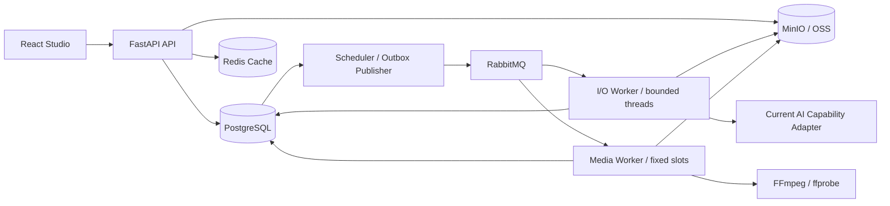

# DES-002 AI 短剧平台架构与技术选型

- 状态：proposed
- 日期：2026-07-27
- 输入：`000-项目顶层结构与工程规范.md`、`001-人工智能短剧平台产品调研与核心能力.md`
- 输出：目标架构、模块边界、目录、数据与技术选择
- 下游：`003-业务闭环与模块协作设计.md`、MVP PRD、实施 Plan、架构约束测试

## 1. 架构结论

采用“前后端分离 + 领域模块化单体 + 受监督后台角色”。FastAPI API、Scheduler 与 Worker 共用一个 Python 代码库和领域模型；容器部署时由同一 `server` 服务并行运行，本地仍可分别调试。PostgreSQL 保存业务、任务与调度事实，Redis 缓存可重建数据，MinIO/已选 OSS 保存媒体，RabbitMQ 分发到期工作。

第一阶段不拆微服务。模块边界先在代码、数据库访问和测试中成立，只有团队规模、独立扩缩容或故障隔离出现可量化需求时才拆服务。

## 2. “MVVC”解释与选择

MVVC 不是服务端主流、也没有统一定义。若目标是获得 Spring Boot 式清晰分层和模块化，本项目采用以下对应关系：

- 前端：View（React 组件）+ ViewModel（页面状态/查询与命令）。
- 后端：Controller（FastAPI Router）→ Application Service（用例）→ Domain Model（规则）→ Repository/Provider Port（持久化与外部能力）。
- 整体：按业务能力分包，而不是建立全局 `controllers/services/repositories` 大目录。

这保留 MVC/MVVM 的关注点分离，但不会为了缩写创建重复对象或空转层。

## 3. 模块化原则

1. 一个模块拥有自己的业务规则、表访问、公开用例和事件。
2. Router 只处理 HTTP、鉴权、输入输出映射，不写 SQL 或编排生成流程。
3. Application Service 负责事务边界和用例编排；Domain 不依赖 FastAPI、SQLAlchemy 或供应商 SDK。
4. Repository 只服务所属模块；跨模块调用公开用例或事件，不直接导入对方 ORM Model。
5. Provider 适配器把供应商请求/响应转换为内部稳定契约，供应商枚举不进入核心业务表。
6. 共享代码仅限配置、数据库、鉴权、时钟、ID、日志和错误基类；禁止万能 `utils`。
7. 目录按实际 MVP 切片逐步创建，不一次生成所有空模块。

### 3.1 设计模式使用边界

设计模式只用于已经出现的变化点和一致性问题，不按名称堆叠类：

| 问题 | 采用方式 | 禁止的过度实现 |
| --- | --- | --- |
| 多模型供应商 | Port + Adapter 隔离协议；同能力的适配器作为 Strategy | 一个接收任意字典的万能 AI Service |
| 运行时选择能力 | composition root 中用小型 Registry/Factory 按 capability_id 解析已注册适配器 | 全局 Service Locator、反射扫描或动态插件平台 |
| Task/Attempt 生命周期 | 纯领域转换函数实现显式 State Machine | 每个状态一个类、允许 Router/Worker 直接改状态字符串 |
| 同库原子命令 | Application Service 持有 SQLAlchemy Session，承担 Unit of Work；业务事实与 Outbox 同事务 | 再包装一层无行为 UoW/Repository 基类或分布式事务框架 |
| 异步跨边界一致性 | Transactional Outbox + 幂等 Consumer | 把 RabbitMQ 当事实源或声称 broker exactly-once |
| 已验收的多步骤 AI 判断 | 先验证直接实现是否足够，确有恢复、分支或人工中断时再评估图编排 | 预装框架或用编排运行时接管普通 CRUD、消息、调度和业务 Task |
| 权限/readiness/审核规则 | 小型纯函数 Policy/Specification，可组合并返回证据 | 抽象规则引擎、可视化 DSL 或任意脚本执行 |

FastAPI `Depends` 只负责 HTTP 入口依赖，Worker/Scheduler 在组合根显式构造依赖。优先组合而非继承；只有第二个真实实现出现且行为差异已由契约测试描述时，才提取 Strategy/Factory。现有简单 CRUD 继续使用函数式 Application Service，不为“使用模式”重写成类层级。

## 4. 运行时结构



API 不在请求生命周期内等待媒体生成。创建命令返回业务 Task；前端通过查询状态获取进度，后续可在同一契约上增加 SSE，而不改变事实来源。

## 5. 业务模块

| 模块 | 拥有的事实 | 对外能力 |
| --- | --- | --- |
| identity | UserAccount、Workspace、Membership | 身份上下文、个人资料、空间与权限检查 |
| projects | Project、Episode、项目设置 | 项目生命周期与生产概览 |
| scripts | Source、ScriptVersion、Scene、提取候选 | 版本编辑、拆解、候选确认 |
| assets | Character、Location、Prop、Costume、Voice、授权 | 资产版本、引用与一致性输入 |
| storyboards | Shot、ShotSpec、镜头顺序与 readiness | 镜头编辑、校验、准备状态 |
| production | ModelCapability、GenerationRequest、Candidate、Task、Attempt、CostEntry | 生成、任务恢复、候选选择与成本结算 |
| media | MediaObject、MediaVersion、Lineage | 上传、签名访问、元数据与血缘 |
| editing | Timeline、TimelineVersion、Render、DeliveryManifest | 音画编排、字幕、渲染与导出 |
| governance | Review、Issue、Consent、Moderation、Label、AuditEvent | 审核、授权、内容检查、标识与审计 |

`production` 内部仍区分“要生成什么”“执行到哪里”“如何计费”，`media` 独立描述“产生了什么文件”；它们不得合并成一个万能任务表。只有某一内部职责出现独立团队、规模或安全边界时才提升为新模块。

## 6. 后端目录

仓库顶层、完整前后端/部署树、命名和工程门禁以 [DES-000 项目顶层结构与工程规范](./000-项目顶层结构与工程规范.md) 为唯一事实源；本节只保留后端模块形态摘要。

```text
backend/
├── app/
│   ├── main.py
│   ├── scheduler.py
│   ├── io_worker.py
│   ├── core/
│   ├── modules/<business_module>/
│   └── integrations/
└── tests/{architecture,unit,integration,contract}/
```

选择 `backend/app/`，不使用 `backend/src/lanverse/` 双层包装。`app` 本身是必要的 Python 包和组合根；业务代码继续按模块分区。模块简单时允许合并 `domain.py` 或 `repository.py`，不为满足目录图创建空文件。所有 Pytest 测试与夹具只进入 `backend/tests/`，禁止在 `backend/app/` 中放置 `test_*.py` 或 `*_test.py`。

模块内部从扁平文件开始；当同一模块出现两个独立资源生命周期、事务边界或调用方时，按业务能力纵向拆包，并通过显式公开契约完成跨模块调用。当前代码的审计、目标形态和迁移顺序以 [DES-006 后端模块工程化重构设计](./arrived/006-后端模块工程化重构设计.md) 为准。

## 7. 前端结构

前端根文件、测试、生成物和命名规则同样以 DES-000 为准；本节只说明页面、ViewModel 与业务组件的结构取舍。

```text
frontend/
├── src/
│   ├── app/<route>/
│   ├── api/
│   ├── components/{ui,<feature>}/
│   └── lib/
└── tests/{architecture,unit,integration,e2e}/
```

路由页面与只服务该页面的 ViewModel/Controller hook 直接放在 `app/<route>/`（Next.js App Router），例如 `projects/[projectId]/page.tsx`、`studio/[episodeId]/script/page.tsx`；不得增加会形成 `/pages` URL 的 `pages` 中间层。当前不建立无独立 layout 的 `(main)` Route Group。可复用业务组件放在 `components/<feature>/`；shadcn/ui 基础件放在 `components/ui/`。服务端状态由 RTK Query 管理（缓存键、tag 失效、按需重新获取与必要轮询），客户端本地草稿、选择和布局由 Redux Toolkit slice 保存。服务端业务状态不得复制到全局前端 Store 形成第二事实源。Vitest 与 Playwright 测试只进入 `frontend/tests/`，禁止在 `frontend/src/` 中放置 `*.test.ts(x)`、`*.spec.ts(x)` 或测试夹具。

`@umijs/openapi` 在开发或构建时从 `OPENAPI_SCHEMA_URL` 读取 FastAPI 的 `/openapi.json`，以 `serversPath: './src/api'` 直接生成请求函数和类型。业务代码直接使用 `src/api/`；只保留 `src/lib/request.ts` 作为基于 axios 的统一请求适配，不增加 `generated/services/client` 等重复目录。

`request.ts` 使用独立 Axios 实例统一 `baseURL` 和 10 秒默认超时；发送时读取最新浏览器会话并注入 Bearer Header，401 清理会话，后端错误信封收敛为 `ApiClientError`。保留原生 `AxiosRequestConfig`，使调用方按需覆盖超时或传入 `AbortController.signal`，不再增加额外 HTTP 抽象或自动重试。

UI 组件源码由 shadcn/ui CLI 写入仓库，初始化时必须显式选择 Radix 基础（`--base radix`），避免随 CLI 默认项变化切换到其他 primitives。Tailwind CSS v4 与 CSS 变量承载语义化设计令牌；业务组件按场景进入 `components/<feature>`，只有可跨业务复用的无业务基础组件进入 `components/ui`。不并用 Ant Design、MUI 等第二套通用组件库，也不为了复刻即梦页面建立额外 UI 架构。

## 8. 数据与一致性

- PostgreSQL 是业务事实源；使用 UUIDv7、UTC 时间、显式外键和唯一约束。
- SQLAlchemy ORM 处理常规事务和关系；复杂报表/锁查询允许使用 SQLAlchemy Core 或审阅过的参数化 SQL。
- SQLAlchemy Model/单一 Metadata 是结构设计来源，Alembic revision 是数据库部署与升级事实源。全新和已有环境均由独立受控命令执行 `alembic upgrade head`，Web/Worker 启动只比较 database heads 与 script heads 并在过期时 fail-closed，不自动升级。
- 2026-08-13 前由 `metadata.create_all()` 建立、且尚无 `alembic_version` 的已有库，必须先备份，再做表、列、类型、默认值、约束和索引零差异校验。接管只允许两个固定签名：当前 42 表 Metadata 直接采用 head；固定提交 `ce360d25^` 的 38 表历史结构采用 revision `95c0d24572c5` 后原子升级 `8d9f2a6c4b71`，补齐 4 张 Provider 表与 Capability 复合唯一约束。部分 Provider、未知、缺索引/约束或多余结构一律拒绝。`create_all()` 只可保留在隔离测试 fixture，不是部署或升级路径。
- 媒体字节只进已选对象存储；不可变 MediaVersion 保存 sha256/规格/来源，可追加 MediaLocation 隔离 storage profile 和 bucket/key。
- Redis 只用 cache-aside 保存可重建副本和限流计数；幂等、授权、Task、Schedule 和账本仍以 PostgreSQL 为准。
- ScriptVersion、ShotSpec 和 MediaVersion 不原地覆盖；当前选择使用指针表达。
- 事务内写业务事实与 Outbox；RabbitMQ 发布失败可重放 Outbox，避免“数据库成功但任务丢失”。

## 9. 异步工作流契约

任务主状态：`queued → running → waiting_provider → succeeded | failed | cancelled | unknown`。

每次外部调用保存稳定的内部请求键、供应商任务 ID、输入 hash、模型版本、尝试次数和费用。超时不等于失败；无法确认供应商是否受理时进入 `unknown` 并先查询/对账，禁止盲目重发。

RabbitMQ 是 MVP 唯一消息队列，使用 `aio-pika` 长连接。Outbox Publisher 发送持久消息并等待 publisher confirm；消费者在任务结果写入 PostgreSQL 后手动 ack。断线造成的重复投递必须按 Task/Attempt 幂等处理，数据库状态始终是事实来源。

一次性/周期 Schedule 持久化到 PostgreSQL；独立 Scheduler 运行角色使用 lease、`SKIP LOCKED` 和唯一 Fire 约束创建 Task + Outbox，不直接执行业务。RabbitMQ 不保存未来计划，Redis 不承担调度锁或 JobStore。

只建立 `lanverse.io` 与 `lanverse.media` 两个 durable queue。I/O Worker 使用自己的有界 `ThreadPoolExecutor`，RabbitMQ `prefetch_count` 不得超过 `max_workers`；FFmpeg 由媒体 Worker 启动独立子进程并使用更小的 prefetch。FastAPI 只在调用同步存储 SDK 时使用有界 thread limiter，不能复用 Worker 池或在线程中执行 CPU 密集媒体计算。

### 9.1 AI 编排与多供应商边界

AI 能力按首个真实业务用例直接接入。S2 已选择 `langchain-deepseek==1.1.0`，只用 `ChatDeepSeek` 的异步调用与结构化输出把固定 ScriptVersion 转换为内部 Pydantic 候选；不引入顶层 LangChain agent 抽象或 LangGraph。只有后续真实流程存在多步骤恢复、条件分支或人工中断时才重新评估 LangGraph；图节点只能接收可序列化的内部 DTO 并调用应用端口，不直接访问 Router、ORM 或供应商 SDK。

若使用 LangGraph，checkpoint 只保存一次 AI 推理流程的节点进度，`thread_id` 固定使用平台 `task_id`；PostgreSQL 的 Task/Attempt 仍是业务状态和对外查询的唯一事实，RabbitMQ 仍是唯一工作通知。不得把 LangGraph 当成第二消息队列、通用后台任务平台或费用/候选事实源。节点中的外部调用必须使用稳定 `provider_request_key` 并具备幂等恢复，图重放不得重复产生付费调用。

供应商接入按当前已实现能力建立窄接口，不设计一个接受任意字典的万能 AI Service，也不提前创建尚无调用方的 Port。S2 文本固定为 DeepSeek `deepseek-v4-pro` 非思考模式；S4 图片/视频的唯一候选为火山方舟 `doubao-seedream-5-0-lite-260128`/`doubao-seedance-2-0-260128`、`cn-beijing` 和官方 Ark Runtime SDK。只有进入 S4 并确认真实账号、额度、参数、查询/取消/回调和计价后才实现该适配器。AI 语音/音效不在当前 MVP 供应商接入范围。

## 10. 固定技术选型

| 领域 | 选择 | 原因 |
| --- | --- | --- |
| Python | Python 3.11.15 + 标准 venv + pip 26.1.2 + pip-tools 7.6.0 | PyCharm Project venv 与 CI/Docker 使用同一 requirements 锁；不使用 uv 生成环境 |
| HTTP | FastAPI + Uvicorn + Pydantic v2 | 类型化 API、OpenAPI 和异步 I/O 成熟 |
| 数据 | PostgreSQL 18.4 + SQLAlchemy 2 async + asyncpg | 与本机服务端一致；事务、关系、JSONB、锁与成熟 ORM |
| 缓存 | Redis 8.8.1 + redis-py asyncio | 与本机服务端一致；cache-aside、有限 TTL、限流与异步连接池 |
| 任务状态 | PostgreSQL Task/Attempt 状态机 | 进度、重试、取消和恢复以数据库事实为准 |
| 任务调度 | PostgreSQL Schedule/Fire + 独立 Scheduler | 持久到期时间、并发防重、misfire 和重启恢复 |
| 消息队列 | RabbitMQ 4.3.4 + aio-pika | 当前受支持版本；持久投递、确认、prefetch 和异步 Python 客户端 |
| Worker 并发 | 有界 ThreadPoolExecutor + RabbitMQ prefetch | 限制在途任务，隔离 I/O 与媒体资源 |
| 对象存储 | 本机开发使用已安装的原生 MinIO；完整 Compose 使用 `minio/minio:latest`；生产可选 OSS | 两个本地入口保持相同 S3 契约但数据隔离；ObjectStoragePort 隔离 SDK 差异，私有对象、直传、hash 和迁移契约不变 |
| 媒体 | FFmpeg + ffprobe 8.1.2 | 与本机工具一致；完成合成、转码、探测、字幕和音频处理 |
| AI 文本 | `langchain-deepseek` 1.1.0 + DeepSeek `deepseek-v4-pro` 非思考模式 | S2 只用异步结构化输出；Pydantic 再校验；不使用旧模型别名或 LangGraph |
| AI 图像/视频 | S4 候选 `volcengine-python-sdk[ark]==5.0.43` + Seedream 5.0 Lite/Seedance 2.0 | 仅在 D-004 真实账号门禁通过后加入锁文件；同一 `AsyncArk` 客户端承载图像同步调用与视频异步任务 |
| 前端 | Vercel create-next-app 16.2.12 + React 19 + TypeScript + Next.js App Router | 官方 CLI 固化 TypeScript、ESLint、Tailwind、App Router、src 与别名基线；SSR 用于营销页面，业务页面使用客户端渲染 |
| 前端包管理 | Node.js 22.23.1 + npm 10.9.8 + package-lock.json | 与本机运行时一致；使用 `npm ci`，避免多个 lockfile 与额外包管理器 |
| 前端 UI | Tailwind CSS v4 + shadcn/ui + Radix UI + 本地 `geist@1.7.2` | 源码可控、样式可定制，复用 Radix 的键盘、焦点和 ARIA 行为；Geist 字体随构建产物自托管，不依赖构建时外网下载 |
| 前端数据 | Redux Toolkit + RTK Query + axios | RTK Query 管理服务端缓存与失效，Redux slice 管理本地编辑器草稿/选择/布局；axios 作为 HTTP 传输层 |
| API 客户端 | `@umijs/openapi` 1.13.15 | 从 FastAPI OpenAPI URL 生成到 `frontend/src/api/`；固定仍指向原项目仓库的版本，升级前审查 npm provenance/repository/integrity，消除手写 URL/DTO 漂移 |
| 质量 | Ruff、Pyright、Pytest、Testcontainers、Vitest、Playwright | 静态检查、真实数据库和关键流程覆盖 |
| 可观测性 | OpenTelemetry + JSON 日志 + Prometheus 指标 | 统一 trace/task/provider 关联与基础告警 |
| 交付 | Docker CLI/daemon 29.6.2 + Compose 5.3.1；GitHub Actions | 与本机工具一致；可重复环境，暂不引入 Kubernetes |

开发环境遵循 local-first。PyCharm 使用 Python 3.11.15 创建 `backend/.venv`，依赖由 pip 按提交的 requirements 锁安装；日常直接复用 Homebrew 安装并运行的 PostgreSQL、Redis、RabbitMQ 和 `127.0.0.1:9000` 的 MinIO，仓库不提供这些服务的启停封装。Docker 不会被本地安装步骤隐式使用；需要完整开发环境时，基础 Compose 使用 `.env` 一键构建并启动全部依赖、server 与 web，其中 MinIO 来自 `minio/minio:latest` 并发布到 `9100/9101`，可与本机实例并存。生产在同一服务事实源上叠加薄覆盖层，使用 `.env.production`、隐藏基础设施端口、禁止现场构建并拉取已发布镜像。两套入口共享 S3 接口契约，但不共享运行状态。依赖安装只创建项目内 `.venv`、安装锁定依赖和执行 `npm ci`，不修改系统环境。

固定技术选型表只记录当前必须安装和维护的工程依赖。S2 只加入 `langchain-deepseek==1.1.0` 和锁定的传递依赖，不额外安装顶层 `langchain`、LangGraph 或火山 SDK。D-004 关闭并进入 S4 首个真实生成用例时，才把候选 `volcengine-python-sdk[ark]==5.0.43` 加入 `pyproject.toml` 与锁文件；不同时安装 `openai`、控制面 SDK 或维护手写 HTTP 调用。不得提交未使用依赖、空 Port 或 `agents/chains/graphs` 目录；每次接入只新增当次需要的适配器、配置和契约测试，不复制 Task、消息或费用状态机。

## 11. 认证、安全与合规

- 使用 FastAPI + PyJWT 签发短期访问令牌，`pwdlib` Argon2 保存密码摘要；业务库保存账号、token_version、Workspace 和 Role。注销/改密通过递增 token_version 撤销旧令牌，不引入 Keycloak、OAuth2 Server、刷新令牌表或 Redis 登录态。
- 所有对象默认私有，通过短期预签名 URL 访问；上传校验类型、大小、hash，并隔离未审核素材。
- Provider 密钥仅从 secret 管理注入，不返回前端、不写数据库明文或日志。
- 所有写操作带 actor、workspace、trace 和审计事件；高成本生成需要权限与额度检查。
- 中国境内发布需要实现生成内容显式标识、文件元数据隐式标识、内容编号和必要日志；真人资产保存授权状态并限制使用范围。
- 具体法律适用范围和留存周期需在上线地区确定后由合规人员确认，本设计不替代法律意见。

## 12. 不采用的方案

- 手写 SQL 作为唯一数据层：关系和事务样板过多，复杂查询才定点使用 SQL。
- 全局三层目录：业务增长后会形成巨大 services/repositories，模块归属不清。
- 每模块完整 Clean Architecture 五层：MVP 文件数量和映射成本高，按复杂度增量拆分。
- 微服务：当前没有独立团队、吞吐和故障域证据。
- Temporal/Celery Beat/APScheduler JobStore，以及把 LangGraph 当通用任务系统：PostgreSQL Schedule/Fire + RabbitMQ 已覆盖 MVP 持久调度和执行投递，不建第二事实。
- 自托管生成模型：GPU 运维和模型训练不是 MVP 差异化能力。

## 13. 架构验证门槛

外部事实按切片关闭，不一次性冻结全部未来设计：S0 前只接受 MVP/S0 工程边界并确定基础设施提供方式；本地 JWT 认证契约在 S1 前；S2 已确认 LangChain + DeepSeek 文本能力与合规基线；S4 前继续冻结 Seedream/Seedance 的真实账号契约，当前不扩展 AI 语音/音效供应商；交付合规在 S5 前，性能/恢复环境在 S6 前。未到当前切片的决定保持 open，不阻塞已有 Plan 评审，也不得由实现者猜默认值。

实现时按首个真实用例逐步验证：S0 验证目录、空库增量初始化、当前基础设施连接和存储契约；后续切片再验证缓存故障回源、Schedule 并发防重、消息重投、供应商 unknown 对账、费用不变量、FFmpeg 样片和浏览器端到端流程。尚未启用的能力不得用空实现制造“已验证”。

## 14. 主要资料

- [FastAPI 多文件应用](https://fastapi.tiangolo.com/tutorial/bigger-applications/)、[OpenAPI URL](https://fastapi.tiangolo.com/tutorial/metadata/#openapi-url)
- [FastAPI 官方全栈模板](https://github.com/fastapi/full-stack-fastapi-template)
- [Spring Boot 代码组织](https://docs.spring.io/spring-boot/reference/using/structuring-your-code.html)
- [Spring Modulith](https://docs.spring.io/spring-modulith/reference/index.html)
- [SQLAlchemy 2.0](https://docs.sqlalchemy.org/en/20/)
- [RabbitMQ 确认与 prefetch](https://www.rabbitmq.com/docs/confirms)、[aio-pika](https://docs.aio-pika.com/)
- [LangGraph 概览](https://docs.langchain.com/oss/python/langgraph/overview)、[持久化](https://docs.langchain.com/oss/python/langgraph/persistence)、[中断与人工确认](https://docs.langchain.com/oss/python/langgraph/interrupts)
- [火山方舟快速入门](https://www.volcengine.com/docs/82379/1795150)、[图片生成 API](https://api.volcengine.com/api-docs/view?action=ImageGenerations&serviceCode=ark&version=2024-01-01)、[视频生成任务 API](https://api.volcengine.com/api-docs/view?action=CreateContentsGenerationsTasks&serviceCode=ark&version=2024-01-01)、[Ark Python SDK](https://pypi.org/project/volcengine-python-sdk/)
- [Redis](https://redis.io/docs/latest/)、[MinIO Python SDK](https://docs.min.io/aistor/developers/sdk/python/)、[OSS S3 兼容差异](https://help.aliyun.com/zh/oss/developer-reference/compatibility-with-amazon-s3)、[@umijs/openapi](https://github.com/chenshuai2144/openapi2typescript)
- [Python venv](https://docs.python.org/3.11/library/venv.html)、[PyCharm FastAPI Project](https://www.jetbrains.com/help/pycharm/fastapi-project.html)、[pip-tools](https://pypi.org/project/pip-tools/)
- [Next.js create-next-app CLI](https://nextjs.org/docs/app/api-reference/cli/create-next-app)、[Next.js App Router 安装](https://nextjs.org/docs/app/getting-started/installation)
- [shadcn/ui Next.js 安装](https://ui.shadcn.com/docs/installation/next)、[shadcn CLI](https://ui.shadcn.com/docs/cli)
- [Next.js App Router](https://nextjs.org/docs/app)、[Next.js 项目结构](https://nextjs.org/docs/getting-started/project-structure)
- [Redux Toolkit](https://redux-toolkit.js.org/)、[RTK Query](https://redux-toolkit.js.org/rtk-query/overview)、[React Redux](https://react-redux.js.org/)
- [axios](https://axios-http.com/)、[@umijs/openapi](https://github.com/chenshuai2144/openapi2typescript)
- [Radix Primitives](https://www.radix-ui.com/primitives/docs/overview/introduction)、[无障碍说明](https://www.radix-ui.com/primitives/docs/overview/accessibility)
- [生成式人工智能服务管理暂行办法](https://www.cac.gov.cn/2023-07/13/c_1690898327029107.htm)、[GB 45438-2025](https://openstd.samr.gov.cn/bzgk/std/newGbInfo?hcno=F32EA2A561F1886CD8D606513512D547)
