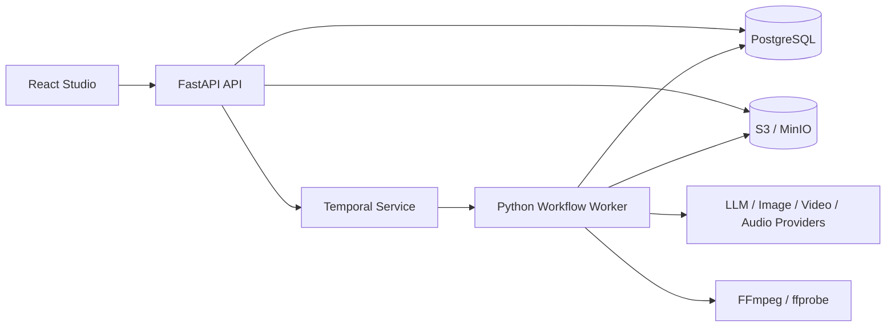

# 002 AI 短剧平台架构与技术选型

- 状态：proposed
- 日期：2026-07-26
- 输入：`001-人工智能短剧平台产品调研与核心能力.md`
- 输出：目标架构、模块边界、目录、数据与技术选择
- 下游：`003-业务闭环与模块协作设计.md`、MVP PRD、实施 Plan、架构约束测试

## 1. 架构结论

采用“前后端分离 + 领域模块化单体 + 独立工作流 Worker”。FastAPI API 与 Worker 共用一个 Python 代码库和领域模型，分别运行；PostgreSQL 保存业务事实，S3 兼容对象存储保存媒体，Temporal 承担跨分钟/小时、可重试和可恢复的生成流程。

第一阶段不拆微服务。模块边界先在代码、数据库访问和测试中成立，只有团队规模、独立扩缩容或故障隔离出现可量化需求时才拆服务。

## 2. “MVVC”解释与选择

MVVC 不是服务端主流、也没有统一定义。若目标是获得 Spring Boot 式清晰分层和模块化，本项目采用以下对应关系：

- 前端：View（React 组件）+ ViewModel（页面状态/查询与命令）。
- 后端：Controller（FastAPI Router）→ Application Service（用例）→ Domain Model（规则）→ Repository/Provider Port（持久化与外部能力）。
- 整体：按业务能力分包，而不是建立全局 `controllers/services/repositories` 大目录。

这保留 MVC/MVVM 的关注点分离，但不会为了缩写创建重复对象或空转层。

## 3. 模块化原则

1. 一个模块拥有自己的业务规则、表访问、公开用例和事件。
2. Router 只处理 HTTP、鉴权、输入输出映射，不写 SQL 或编排生成流程。
3. Application Service 负责事务边界和用例编排；Domain 不依赖 FastAPI、SQLAlchemy 或供应商 SDK。
4. Repository 只服务所属模块；跨模块调用公开用例或事件，不直接导入对方 ORM Model。
5. Provider 适配器把供应商请求/响应转换为内部稳定契约，供应商枚举不进入核心业务表。
6. 共享代码仅限配置、数据库、鉴权、时钟、ID、日志和错误基类；禁止万能 `utils`。
7. 目录按实际 MVP 切片逐步创建，不一次生成所有空模块。

## 4. 运行时结构



API 不在请求生命周期内等待媒体生成。创建命令返回业务 Task；前端通过查询状态获取进度，后续可在同一契约上增加 SSE，而不改变事实来源。

## 5. 业务模块

| 模块 | 拥有的事实 | 对外能力 |
| --- | --- | --- |
| identity | Workspace、Member、Role | 身份上下文、成员与权限检查 |
| projects | Project、Episode、项目设置 | 项目生命周期与生产概览 |
| scripts | Source、ScriptVersion、Scene、提取候选 | 版本编辑、拆解、候选确认 |
| assets | Character、Location、Prop、Costume、Voice、授权 | 资产版本、引用与一致性输入 |
| storyboards | Shot、ShotSpec、镜头顺序与 readiness | 镜头编辑、校验、准备状态 |
| generation | ModelCapability、GenerationRequest、Candidate | 生成命令、候选选择与供应商端口 |
| workflows | Task、Attempt、步骤与恢复信息 | 状态、取消、重试、对账与下一动作 |
| media | MediaObject、MediaVersion、Lineage | 上传、签名访问、元数据与血缘 |
| audio | DialogueTrack、VoiceAssignment、SubtitleCue | TTS、声音、字幕与同步 |
| timelines | Timeline、Track、Clip、Render | 编排、预览清单、渲染与导出 |
| reviews | Review、Issue、Approval | 镜头/整集审核和退回 |
| usage | Reservation、LedgerEntry、ProviderCost | 预占、结算、释放和用量查询 |
| compliance | Consent、Moderation、Label、AuditEvent | 授权、内容检查、标识与审计 |

`generation` 描述“要生成什么”，`workflows` 描述“执行到哪里”，`media` 描述“产生了什么文件”；三者不得合并成一个万能任务表。

## 6. 后端目录

```text
backend/
├── pyproject.toml
├── app/
│   ├── main.py
│   ├── core/                 # config/db/auth/logging/errors
│   ├── modules/
│   │   └── <business_module>/
│   │       ├── api.py        # HTTP controller
│   │       ├── schemas.py    # HTTP/application DTO
│   │       ├── service.py    # use cases + transaction boundary
│   │       ├── domain.py     # rules/value objects when needed
│   │       ├── models.py     # SQLAlchemy persistence model
│   │       └── repository.py
│   ├── integrations/         # provider/S3/FFmpeg adapters
│   └── worker.py             # Temporal worker composition root
├── migrations/
└── tests/
    ├── unit/
    ├── integration/
    └── contract/
```

选择 `backend/app/`，不使用 `backend/src/lanverse/` 双层包装。`app` 本身是必要的 Python 包和组合根；业务代码继续按模块分区。模块简单时允许合并 `domain.py` 或 `repository.py`，不为满足目录图创建空文件。

## 7. 前端结构

```text
frontend/src/
├── app/                      # router/providers/layout
├── components/ui/            # shadcn/ui 源码组件；底层固定 Radix UI
├── features/<feature>/       # 业务页面、组件、view-model 与测试
├── entities/                 # shared typed business representations
├── api/generated/            # generated from OpenAPI; never hand-edited
└── lib/                      # cn、格式化等无业务状态的框架辅助
```

ViewModel 由 TanStack Query 管理服务端状态，Zustand 只保存编辑器本地草稿、选择和临时布局。服务端业务状态不得复制到全局前端 Store 形成第二事实源。

UI 组件源码由 shadcn/ui CLI 写入仓库，初始化时必须显式选择 Radix 基础（`--base radix`），避免随 CLI 默认项变化切换到其他 primitives。Tailwind CSS v4 与 CSS 变量承载语义化设计令牌；业务组件留在所属 `features`，只有可跨业务复用的无状态基础组件进入 `components/ui`。不并用 Ant Design、MUI 等第二套通用组件库，也不为了复刻即梦页面建立额外 UI 架构。

## 8. 数据与一致性

- PostgreSQL 是业务事实源；使用 UUIDv7、UTC 时间、显式外键和唯一约束。
- SQLAlchemy ORM 处理常规事务和关系；复杂报表/锁查询允许使用 SQLAlchemy Core 或审阅过的参数化 SQL。
- Alembic 迁移是唯一 DDL 演进路径；自动生成结果必须人工审阅，不在启动时自动建表。
- 媒体字节只进对象存储，数据库保存不可变版本、hash、尺寸、时长、来源和对象 key。
- ScriptVersion、ShotSpec 和 MediaVersion 不原地覆盖；当前选择使用指针表达。
- 事务内写业务事实与 Outbox；工作流启动失败可重放 Outbox，避免“数据库成功但任务丢失”。

## 9. 异步工作流契约

任务主状态：`queued → running → waiting_provider → succeeded | failed | cancelled | unknown`。

每次外部调用保存稳定的内部请求键、供应商任务 ID、输入 hash、模型版本、尝试次数和费用。超时不等于失败；无法确认供应商是否受理时进入 `unknown` 并先查询/对账，禁止盲目重发。

选择 Temporal 而非在 Celery 上自建 Saga 状态机，原因是核心链路包含多步骤、长等待、重试、取消、人工确认和故障恢复。Celery 可用于独立短任务，但其文档仍要求任务自身幂等；MVP 不同时维护两套任务系统，也不额外引入 Redis/Kafka。

## 10. 固定技术选型

| 领域 | 选择 | 原因 |
| --- | --- | --- |
| Python | Python 3.13 + uv | 稳定维护版本；锁依赖与运行命令简单 |
| HTTP | FastAPI + Uvicorn + Pydantic v2 | 类型化 API、OpenAPI 和异步 I/O 成熟 |
| 数据 | PostgreSQL 17 + SQLAlchemy 2 async + asyncpg | 事务、关系、JSONB、锁与成熟 ORM |
| 迁移 | Alembic | 与 SQLAlchemy 同生态、迁移历史可审查 |
| 工作流 | Temporal Python SDK | 长流程持久化、恢复、取消、重试和可见性 |
| 对象存储 | S3 API；本地 MinIO | 媒体与数据库分离，可使用预签名上传下载 |
| 媒体 | FFmpeg + ffprobe | 合成、转码、探测、字幕和音频处理标准工具 |
| 前端 | React 19 + TypeScript + Vite | 适合登录后的复杂工作台，无 SSR 必要成本 |
| 前端 UI | Tailwind CSS v4 + shadcn/ui + Radix UI | 源码可控、样式可定制，复用 Radix 的键盘、焦点和 ARIA 行为；固定 Radix 基础 |
| 前端数据 | TanStack Query + Zustand | 分离服务端状态与本地编辑状态 |
| API 客户端 | OpenAPI 生成 TypeScript 类型与 client | 消除手写 URL/DTO 漂移 |
| 质量 | Ruff、Pyright、Pytest、Testcontainers、Vitest、Playwright | 静态检查、真实数据库和关键流程覆盖 |
| 可观测性 | OpenTelemetry + JSON 日志 + Prometheus 指标 | 统一 trace/task/provider 关联与基础告警 |
| 交付 | Docker；本地 Docker Compose；GitHub Actions | 可重复环境，暂不引入 Kubernetes |

依赖只锁主/次版本策略和具体 lockfile，Design 不绑定可能快速淘汰的模型版本。默认模型供应商在 PRD/采购验证后确定；内部端口先固定为 Text、Image、Video、Speech 四类能力。

## 11. 认证、安全与合规

- 使用标准 OIDC，后端验证短期访问令牌；业务库只保存用户映射、Workspace 和 Role，不自建身份协议。
- 所有对象默认私有，通过短期预签名 URL 访问；上传校验类型、大小、hash，并隔离未审核素材。
- Provider 密钥仅从 secret 管理注入，不返回前端、不写数据库明文或日志。
- 所有写操作带 actor、workspace、trace 和审计事件；高成本生成需要权限与额度检查。
- 中国境内发布需要实现生成内容显式标识、文件元数据隐式标识、内容编号和必要日志；真人资产保存授权状态并限制使用范围。
- 具体法律适用范围和留存周期需在上线地区确定后由合规人员确认，本设计不替代法律意见。

## 12. 不采用的方案

- 手写 SQL 作为唯一数据层：关系、迁移和事务样板过多，复杂查询才定点使用 SQL。
- 全局三层目录：业务增长后会形成巨大 services/repositories，模块归属不清。
- 每模块完整 Clean Architecture 五层：MVP 文件数量和映射成本高，按复杂度增量拆分。
- 微服务：当前没有独立团队、吞吐和故障域证据。
- Next.js：工作台无需 SSR/SEO；营销站需要时可单独决定。
- 自托管生成模型：GPU 运维和模型训练不是 MVP 差异化能力。

## 13. 架构验证门槛

进入实现 Plan 前必须补齐并接受：MVP 用户与业务范围、默认模型/API 可用性、目标地区、认证提供方、预算口径、单集目标镜头数/时长、恢复时限和导出规格。

实现时至少验证：模块依赖规则、迁移升级/回滚、真实 PostgreSQL 集成、任务重放与幂等、供应商超时对账、对象权限、费用不变量、FFmpeg 样片渲染和浏览器端到端流程。

## 14. 主要资料

- [FastAPI 多文件应用](https://fastapi.tiangolo.com/tutorial/bigger-applications/)
- [FastAPI 官方全栈模板](https://github.com/fastapi/full-stack-fastapi-template)
- [Spring Boot 代码组织](https://docs.spring.io/spring-boot/reference/using/structuring-your-code.html)
- [Spring Modulith](https://docs.spring.io/spring-modulith/reference/index.html)
- [SQLAlchemy 2.0](https://docs.sqlalchemy.org/en/20/)、[Alembic](https://alembic.sqlalchemy.org/en/latest/)
- [Temporal Workflow Execution](https://docs.temporal.io/workflow-execution)、[Python SDK](https://docs.temporal.io/develop/python)
- [Python 版本状态](https://devguide.python.org/versions/)
- [shadcn/ui Vite 安装](https://ui.shadcn.com/docs/installation/vite)、[shadcn CLI](https://ui.shadcn.com/docs/cli)
- [Radix Primitives](https://www.radix-ui.com/primitives/docs/overview/introduction)、[无障碍说明](https://www.radix-ui.com/primitives/docs/overview/accessibility)
- [生成式人工智能服务管理暂行办法](https://www.cac.gov.cn/2023-07/13/c_1690898327029107.htm)、[GB 45438-2025](https://openstd.samr.gov.cn/bzgk/std/newGbInfo?hcno=F32EA2A561F1886CD8D606513512D547)
