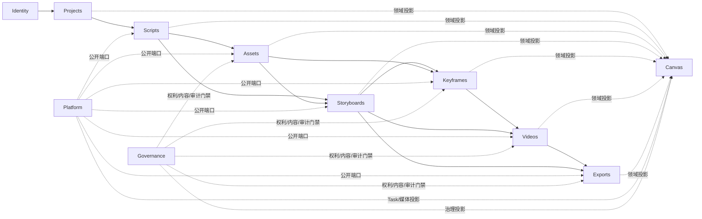
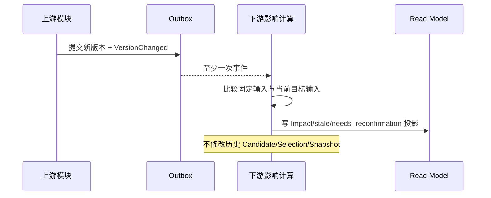

# DES-002 领域模块边界与跨模块契约

- 状态：proposed
- 版本：v1.0
- 日期：2026-08-14
- 关联需求：CUR-00 第 4～10 节，以及 CUR-IAM、CUR-PRJ、CUR-SCR、CUR-AST、CUR-SBD、CUR-KFR、CUR-VID、CUR-EXP、CUR-PLT、CUR-CAN、CUR-SEC 的跨模块交接要求
- 关联验收：各模块 AC 中的版本、影响、幂等、失败恢复和导出不漂移场景
- 上游：[DES-001](./001-目标技术架构与选型.md)

## 1. 问题、范围与非目标

### 1.1 问题

从剧本到镜头素材包是一条长价值流，但不应实现为一个可随意改写全部数据的“大流程服务”。每个模块必须拥有明确事实，跨模块只能读取固定版本或提交公开命令，否则会形成第二套任务、重复媒体、隐式主选和历史漂移。

### 1.2 范围

- Bounded Context、事实所有者和依赖方向；
- 同步 Command/Query、异步 Event、Outbox/Inbox；
- 跨模块版本、幂等、错误和 partial failure 契约；
- stale 传播、Read Model 和 Saga/Workflow 边界；
- 模块级安全、观测和契约验证。

### 1.3 非目标

- 不规定 HTTP URL 或数据库物理 Schema 名；
- 不将逻辑模块等同独立微服务；
- 不建立通用 BPMN、低代码工作流或 Event Sourcing；
- 不引入 Timeline、Render、Publishing、Billing 上下文。

## 2. 上下文与事实所有权

| 上下文 | 唯一事实 | 公开交接 | 不得拥有 |
| --- | --- | --- | --- |
| Identity | UserAccount、Workspace、Membership、ActorContext | 授权结果、成员变更事件 | 项目内容和 Provider 凭据明文 |
| Projects | Project、Episode、顺序、ProductionSnapshot 投影 | Project/Episode Snapshot、下一动作 | 下游正文、候选、Task 终态 |
| Scripts | 原稿、分集、ScriptVersion、Scene、NarrativeUnit、提取决议 | 固定剧本/叙事 Snapshot、版本变更事件 | Asset/Shot 正式身份 |
| Assets | Asset、AssetState、AssetVersion、资产图片候选/选择 | 固定资产 Snapshot、readiness、影响 | Shot 顺序、视频主选 |
| Storyboards | Shot、ShotSpecVersion、OrderRevision、Coverage、Baseline | 固定 Baseline 和有序 Shot Snapshot | 关键帧/视频 Candidate |
| Keyframes | Slot、BriefVersion、图片 Candidate、Selection、VisualReferenceRevision | VideoGenerationInput Snapshot | Video Task/Selection |
| Videos | VideoGenerationRequest、VideoCandidate、Decision、VideoSelection、Readiness | ExportShot Snapshot | WorkTask/Attempt/Media 通用事实 |
| Exports | Inspection、Preflight、ExportSnapshot、PackageBuild、Manifest | 历史包、下载能力 | 生成/重选 Candidate、媒体转码 |
| Canvas | CanvasView、LayoutRevision、Group、ViewportPreference、DomainNode/Edge Projection、AgentProposal/CommandPlan | 可视导航、布局、分层状态投影与已确认领域命令调用 | 镜头/主选/Task/stale/导出事实、任意 Provider DAG |
| Platform | Capability、ProviderProfile 技术配置、WorkTask、Attempt、Media、Lineage、Cost | 能力/任务/媒体/诊断关联端口 | 创作正文、Shot 业务状态、权利/内容决定 |
| Governance | DataClassification、RightsEvidence/Decision、ContentDecision、ReviewCase、DataProcessingProfile、Retention/Deletion/SecurityCase、AuditRecord | 生成/媒体/主选/导出/下载门禁与脱敏审计 | 业务 current、Provider 技术任务、法律结论 |

## 3. 依赖方向



- 箭头表示业务输入方向，不授权下游写上游表。
- Platform 是支撑端口，不是位于所有业务模块之上的“万能业务层”。
- Projects 的 ProductionSnapshot 可以订阅所有下游摘要事件，但只保存来源、口径、更新时间和派生值。
- Exports 只能读取明确 Baseline 和显式 VideoSelection；不得向 Videos 发出“自动补主选”命令。
- Canvas 只能按稳定 ID/版本投影各模块事实；坐标、视口和分组不改变业务关系，画布上的业务动作必须调用原模块 Command。

## 4. 公开契约类型

| 类型 | 是否同步 | 语义 | 例子 |
| --- | --- | --- | --- |
| Command | 是 | 请求唯一所有者执行状态变化 | `PublishStoryboardBaselineCommand` |
| Query | 是 | 无副作用读取，允许 partial failure | `GetVideoReadinessQuery` |
| Snapshot | 是/事件引用 | 固定时点、不可变、含版本与摘要 | `StoryboardBaselineSnapshot` |
| Result | 是 | 命令/查询结果、冲突和 next action | `FreezeExportResult` |
| Domain Event | 否 | 已提交事实发生，过去式 | `CurrentScriptVersionChanged` |
| Integration Event | 否 | 最小跨模块通知，版本化 Schema | `MediaArtifactReadyV1` |

所有公开契约至少包含：

```text
contract_version
workspace_id
correlation_id
causation_id
occurred_at / requested_at
actor_id（系统事件可为受控 service actor）
stable target IDs
expected_revision 或 fixed version IDs
idempotency_key（写命令）
```

正文、完整 Prompt、媒体字节、签名 URL、Provider Secret 和完整 Provider 原响应不得进入 Integration Event。

## 5. 同步跨模块契约

### 5.1 Query

- 调用者必须传入 Workspace 和稳定 ID；目标模块重新验证归属。
- 返回 `available | partial | unavailable`，并为每个缺失分区提供来源、时间、错误码和 next action。
- unavailable 不能转为 0、空数组、ready 或“无问题”。
- Snapshot 必须包含固定版本 ID 和 `content_hash/input_hash`，不能只返回 current 页面字段。

### 5.2 Command

- 由事实所有者完成权限、期望版本、唯一约束和事务。
- 同一 `idempotency_key + canonical input hash` 返回原结果；同键异输入返回冲突。
- 跨多个聚合的原子业务动作必须由拥有该一致性边界的模块编排；调用方不得逐表写入。
- 冲突返回最新 revision、差异摘要和可执行下一动作，不进行 last-write-wins。

### 5.3 关键同步交接

| 提供者 → 使用者 | 契约 | 一致性要求 |
| --- | --- | --- |
| Scripts → Storyboards | 当前/指定 ScriptVersion、NarrativeUnitVersion Snapshot | 固定版本，不传可变 current 文本 |
| Assets → Storyboards/Keyframes | Asset/State/Version、用途 readiness | 下游固定版本；current 切换不改旧引用 |
| Storyboards → Keyframes/Videos/Exports | StoryboardBaseline + OrderRevision + ShotSpecVersion 列表 | Baseline 不可变 |
| Keyframes → Videos | Slot Selection、MediaVersion、有序 VisualReferenceRevision | 必需槽位唯一显式选择 |
| Videos → Exports | VideoSelection + Candidate + MediaVersion + reconfirmation | 禁止最新成功兜底 |
| Platform → 所有生成模块 | Capability/ProviderPreflight/WorkTask/Media | fail-closed、唯一任务和媒体事实 |
| Governance → 业务模块/Platform/Exports | Rights/Content/DataProcessing/Retention/Security 决定与 Audit 接口 | 固定资源版本、用途、政策版本；门禁未知时不得产生新外部副作用 |
| 各领域/Platform → Canvas | 稳定 ID/版本、类型化 Node/Edge、readiness/Task/stale/selection/export 图层 | Canvas 只存布局和可重建 Projection；不接收技术 Provider DAG |
| Canvas → 领域所有者 | 原公开 Command + `expected_revision` + actor/audit context | 不直写领域表，不设置隐式主选，不绕过预检 |

## 6. 异步事件、Outbox 与 Inbox

1. 业务事实与 Outbox 同一 PostgreSQL 事务提交。
2. Publisher 至少一次发送，不对投递次数作 Exactly-once 假设。
3. 消费者以 `event_id` 写 Inbox，再以业务幂等键执行投影或影响计算。
4. 重复、乱序和延迟事件必须被测试；消费者不得依赖“上一条一定先到”。
5. 消费失败不反向让已经成功的用户命令显示失败。
6. Dead-letter 只保存受控错误和引用，不复制敏感 payload；恢复必须重放原事件 ID。

事件按兼容策略演进：

- 新增可选字段可保持版本；
- 删除、重命名、类型或语义变化必须发布新版本；
- 生产者在迁移窗口内可双发不同 Schema 版本，但消费者不得因此双执行业务副作用；
- 过期版本移除必须有使用扫描和回滚策略。

## 7. 事务与最终一致性

| 场景 | 策略 | 原因 |
| --- | --- | --- |
| Episode 重排 | 单模块强事务 | 顺序重复不可接受 |
| Storyboard 拆合/重排/发布 | 单模块强事务 | 来源守恒和完整 Baseline |
| 主选切换 | 单模块强事务 + 唯一约束 | 同时最多一个 current |
| ExportSnapshot 冻结 | Export 事务读取版本摘要并零部分创建 | 历史不漂移 |
| 工作台摘要 | 事件驱动 Read Model + 手动强制刷新 | 可接受数秒延迟但要可解释 |
| 上游影响 | 事件触发 Impact 计算 | 不阻塞上游已成功命令 |
| Provider/媒体/导出 | 耐久 Workflow/Saga | 外部系统无法参与 DB 事务 |

不使用分布式事务。外部 Saga 的补偿只补偿可逆内部步骤，例如释放预占、清理孤立对象；不得用“重新生成”补偿媒体下载或登记失败。

## 8. 版本与 stale 传播

### 8.1 输入摘要

每个下游正式结果固定类型化输入引用，并计算 canonical JSON SHA-256。输入摘要的 Schema 自身有版本，排序、空值和数值格式必须确定。

### 8.2 影响流程



- stale 是相对当前目标的派生判断，不改写 Candidate 媒体事实。
- 当前 Selection 受影响时进入 `needs_reconfirmation`；人工重选或追加绑定新输入摘要的重新确认后恢复。
- 已冻结 ExportSnapshot 和 PackageBuild 永不被 stale 传播修改。
- 影响计算不可用时返回 unavailable，正式生成/导出 fail-closed。

## 9. 批量语义

批量操作不得伪装为一个全局原子任务：

- 分镜草案“原子应用”是单 Episode 的一个明确业务事务；
- 多 Shot 图片/视频生成是多个独立单镜请求和 WorkTask 的集合；
- 批量预检逐 Shot 返回 ready/warning/blocked；
- 已成功提交的 Shot 不因同批其他 Shot 创建失败而回滚；
- 重试只针对创建失败或已确认可安全重试的 Task；unknown 不进入批量重试。

## 10. 权限与安全

- 所有 Command/Query 在事实所有者边界重新检查 Workspace 和 action，不信任调用方已经检查。
- Service actor 只能完成已授权 Task 固定范围，不能扩大 Shot 集合或读取其他 Workspace。
- Integration Event 中的 `workspace_id` 是路由上下文，不是授权证明。
- 跨空间对象 ID 统一返回不可用，避免泄露存在性。
- 敏感字段按 [DES-013](./013-安全隐私权利与内容治理设计.md) 分类和脱敏。

## 11. 可观测性

跨模块关联链：

```text
request_id → command_id → outbox_event_id → inbox_event_id
→ task_id → attempt_id → provider_job_id → media_id
→ selection_id → export_snapshot_id → package_build_id
```

- Trace 记录边界和稳定关联，不记录完整业务正文。
- Metric 按模块、命令/事件类型、结果、错误码聚合；对象 ID 不作标签。
- 每个 Read Model 提供来源最大事件时间、构建时间和 partial/unavailable 分区。
- Outbox age、Inbox 重复率、Dead-letter age 和投影延迟必须告警。

## 12. 验证

- 架构测试拒绝跨模块 persistence/ORM 导入和写表；
- Contract 测试覆盖 OpenAPI 和每个 Integration Event Schema；
- 重复、乱序、延迟和 Dead-letter 重放测试不产生重复正式事实；
- 同键同输入回读、同键异输入冲突；
- stale 传播不修改 Candidate、历史 Selection、Baseline 或 ExportSnapshot；
- 一个下游摘要不可用时其他模块仍可读，且 unavailable 不显示为 0；
- 所有跨空间 Command、Query、Event 和 Worker 恶意 payload 均拒绝。

## 13. 待决策

| 决策 | 建议 | 关闭点 |
| --- | --- | --- |
| 是否需要独立 Schema/数据库用户隔离模块表 | 初期同库、逻辑所有权 + 架构测试；高风险 Platform/Identity 可单独 Schema | 数据库威胁模型和迁移 PoC |
| 事件 Schema 工具 | 使用可代码生成和兼容检查的 JSON Schema/OpenAPI 体系 | ADR 与 CI PoC |
| Read Model 推送 | PostgreSQL Outbox + SSE；Redis 只作 fan-out 可选 | SSE 多实例 PoC |
| 跨模块强事务边界 | 仅当前模块化单体内少数明确用例；拆服务前必须重做 Design | 每个用例评审 |

## 14. 追踪摘要

本设计承接 CUR-00 的全部跨模块不变式，并由 DES-003～DES-014 分别实现事实所有权、可重建投影和跨切质量边界；画布交接详见 [DES-011](./011-可视化制作画布与工作流投影设计.md)，详细 Requirement→Design 映射见 [DES-015](./015-Requirement到Design追踪矩阵.md)。

## 15. 变更记录

| 版本 | 日期 | 变更 |
| --- | --- | --- |
| v1.0 | 2026-08-14 | 建立领域上下文、Canvas 投影边界、公开契约、Outbox/Inbox、版本影响和批量失败边界 |
