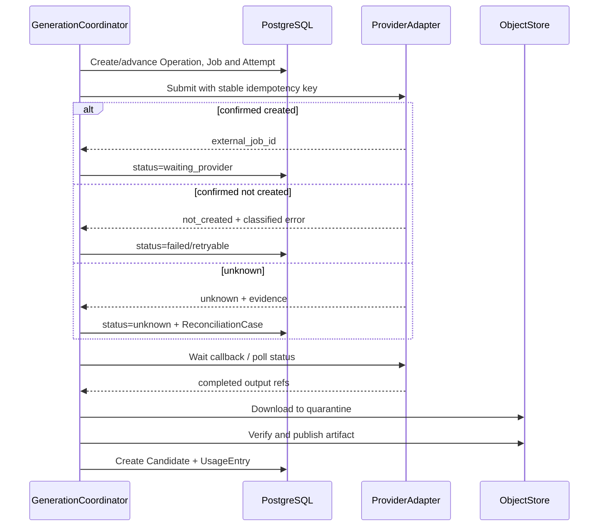

# AI 视频生产平台接口、工作流与功能实现设计

> 状态：提案 v11，已固定无路径版本 HTTP、单一目标契约、Go MVVC Controller/Service 与 Python Agent 边界，待 API、数据与研发评审
> 日期：2026-08-22
> 需求基线：[000-AI 视频生产平台目标需求总览](../requirement/000-AI视频生产平台目标需求总览.md)
> 系统架构：[000-AI 视频生产平台目标系统架构设计](000-AI视频生产平台目标系统架构设计.md)
> 数据模型：[001-AI 视频生产平台核心领域与数据模型设计](001-AI视频生产平台核心领域与数据模型设计.md)
> 产品边界：[002-AI 视频生产平台目标产品与功能模块设计](002-AI视频生产平台目标产品与功能模块设计.md)
> 基础分析细化：[004-AI 视频生产平台剧本基础分析与人物拆解详细设计](004-AI视频生产平台剧本基础分析与人物拆解详细设计.md)

## 1. 实现结论

功能实现采用四层闭环：

1. 用户、画布或 API 提交同一种领域命令；Agent 先生成同一命令 Schema 的提案，用户接受后再进入相同命令处理器。
2. 应用层在 PostgreSQL 短事务中完成鉴权、版本校验和事实写入。
3. 需要长时间或外部副作用的命令在同一事务创建 Operation/Job 与 Outbox 启动意图。
4. Outbox 投递当前 TaskEnvelope；非 Agent 任务由独立 Go Worker 执行，Agent 任务由 Python agent-worker 执行并返回结果，最终都经 Go Application Service 幂等写回权威模块。

对 HTTP 入口使用 000 定义的 MVVC：View/ViewModel 在前端，Controller 在 Go `transport/http/controllers`，Model 是无框架依赖的 Go plain struct/value object。Controller 只执行 Header/Schema/身份到 Command/Query 的显式映射，每个方法只调用一个 Application Service 或 Query Handler；不直接使用 pgx/sqlc、MinIO、RabbitMQ 或 Agent Harness。

任何界面都不能直接拼接数据库更新；任何 Worker 都不能绕过已批准计划修改镜头、选择或审批。

000 已固定 Go 为唯一业务后端：公共 API、领域命令、事务、Outbox、调度/对账和非 Agent Worker 共享同一套 Go Application Service；Python 仅消费受限 AgentRun 契约并返回结构化结果。本文中的 `*Workflow` 表示可恢复的应用流程，不等于默认采用 Temporal；首期由 PostgreSQL 状态机、RabbitMQ、Go Scheduler/Reconciler 和幂等 Worker 实现。

`GenerationPlan`、`Operation`、`GenerationJob`、`Candidate`、`DeliveryBuild` 和 `DeliverySnapshot` 分别表达计划、用户可见运行、单项外部执行、历史输出、交付构建和最终交付。它们不能合并成一个跨全流程的大状态机。

整本剧本分析是上述通用模型上的专门耐久流程：M03 `AnalysisRun` 关联一个 root Operation，`breakdown`、`narrative`、`knowledge` 分别使用独立的 M06 AgentRun 和 child Operation。M03 通过 `narrative.analysis_stage.requested` 请求阶段运行，M06 创建 AgentRun/child 后以 `agent.run.created` 和 `agent.run.result_committed` 回执；任何 child 完成都不能替代 M03 Manifest/Narrative 批准、M02 物化或 M04 知识完整性门禁，也不能完成 root Operation。

## 2. HTTP 契约

### 2.1 公开前缀、路径与方法

目标公开 HTTP API 的唯一前缀固定为 `/api`，路径不携带版本号，也不通过 Header 协商另一套接口版本。后端 OpenAPI 与前端生成客户端在同一发布单元更新；只存在一套路由、响应信封和字段语义。内部 Worker Task、领域事件和 Agent Contract 的 `schema_version` 只校验当前契约，非当前值拒绝并进入人工处置。

```text
POST   /api/{resources}                 创建稳定对象或提交命令
GET    /api/{resources}/{id}            读取权威对象
GET    /api/{resources}                 分页查询
PATCH  /api/{resources}/{id}/draft      修改草稿，要求 If-Match
POST   /api/{resources}/{id}:propose    提交为待批准
POST   /api/{resources}/{id}:approve    批准并冻结
POST   /api/{resources}/{id}:archive    归档
GET    /api/events/stream               SSE 状态事件
```

路径使用复数 `kebab-case` 资源名；ID 是不带业务含义的 UUID 字符串。冒号动作只用于 `approve`、`finalize`、`retry-stage` 等无法由资源创建自然表达的业务命令，不使用通用 `/action`、`/execute` 或动词堆叠。父资源只用于表达所有权/创建范围；已有稳定 ID 的对象从自身资源路径读取，不无限嵌套。

Workspace 从 `X-Workspace-Id` 和认证主体解析，Project/AnalysisRun 等资源仍在路径中表达业务范围。服务端不得信任请求体中的 `workspace_id`，也不得仅因路径 ID 存在就跳过 Workspace 复合外键/RLS 校验；跨 Workspace 一律返回统一 `404 not_found`。

### 2.2 JSON、资源与响应信封

- 请求和响应使用 UTF-8 JSON、`snake_case` 字段名和显式当前 Schema；写入字段默认 `extra="forbid"`，前端客户端必须从同一提交的 OpenAPI 重新生成。
- UUID 使用规范小写带连字符字符串；时间使用 UTC RFC 3339，例如 `2026-08-22T10:30:00Z`；时长、帧、Token、用量均使用带单位的整数或十进制定点值。
- 对外 SHA-256 使用 64 位小写十六进制；数据库内部使用 32-byte `BYTEA`。ETag 是 HTTP 并发令牌，不得当成内容哈希。
- 字段未返回表示当前视图不包含；`null` 表示已知为空；`[]/{}` 表示已评估且为空。`unknown`、`not_analyzed`、`explicit_empty` 和 `not_applicable` 必须用状态字段表达，不能都编码为 `null`。

单资源成功响应：

```json
{
  "data": {
    "id": "0198...",
    "status": "draft",
    "revision_no": 3
  },
  "meta": {
    "request_id": "0198...",
    "etag": "\"3:8f0d...\""
  },
  "links": {
    "self": "/api/example-resources/0198..."
  }
}
```

`data` 永远是业务表示；`meta` 只保存请求、分页、基线和并发元数据；`links` 只给同一 API 的受控链接。不得把 RabbitMQ delivery tag、MinIO key、数据库行号、LangGraph checkpoint 或 Provider 原始响应放入公共信封。所有接口直接使用这一种响应包装；旧的仅 `data` 包装不在目标实现中读取或返回。

### 2.3 请求头、ETag 与幂等

| 请求头 | 适用范围 | 作用 |
| --- | --- | --- |
| `Authorization: Bearer …` | 除登录、健康检查外 | 确定用户或服务主体；Token 正文不进入日志 |
| `X-Workspace-Id` | 所有租户请求 | 显式选择工作区，服务端验证成员关系 |
| `Idempotency-Key` | 所有产生副作用的 POST；高风险 PUT/PATCH 同样要求 | 16—128 字符不透明键，用于网络安全重试 |
| `If-Match` | 草稿更新、批准、current pointer 和基线敏感命令 | 必须原样回传最近响应的强 ETag；缺失返回 428，失配返回 412 |
| `X-Request-Id` | 可选 | 调用方关联；缺失时服务端生成 |
| `Last-Event-ID` | SSE 重连 | 从已确认的 Operation event sequence 继续；过旧时回源 REST 快照 |

服务端 ETag 使用带引号的不透明强验证值，内部至少覆盖 `resource_id + revision_no/generation + canonical content hash`。客户端不能解析 ETag，也不能在 body 中再提交一个含义相同的 `expected_revision`；Application Command 从 `If-Match` 解析单资源 CAS。一次命令同时比较多个资源时，body 只携带其他资源的 `id + expected_revision/hash`，主资源仍用 `If-Match`。

Idempotency scope 固定为 `(workspace_id, actor/service_id, HTTP method, canonical route, idempotency_key)`，`request_hash` 覆盖规范化 body、路径参数和会改变语义的 Header。相同 scope/key/hash 回放最初的 HTTP 状态、resource/Operation 引用和结果摘要；相同 key 不同 hash 返回 `409 idempotency_conflict`，绝不能重新执行。HTTP replay 记录至少保留到命令终态后 7 天；创建出来的稳定业务对象仍由模块自身永久唯一键防重，不能仅依赖 TTL 记录。

### 2.4 HTTP 结果与异步返回

| 场景 | HTTP | 要求 |
| --- | --- | --- |
| 权威查询或幂等回放 | `200` | 返回当前/原结果与 ETag；回放在 `meta.idempotency_replayed=true` 标识 |
| 同步创建稳定资源/修订 | `201` | 返回资源与 `Location`；所有数据库事实已提交 |
| 已持久化的长操作 | `202` | 返回同一个 Command/Operation，不表示业务成功 |
| 成功且确实无表示 | `204` | 不用于创建/批准等需要审计结果的命令 |
| 条件/并发/业务失败 | `4xx` | 不创建半成品 current；错误信封给出稳定恢复动作 |
| 基础设施暂不可用 | `503` | 仅在命令未持久化时返回；已持久化流程转为 Operation 状态 |

```json
{
  "data": {
    "command_id": "0198...",
    "status": "accepted",
    "resource": {
      "type": "analysis_run",
      "id": "0198...",
      "revision_no": 1
    },
    "operation": {
      "id": "0198...",
      "status": "accepted",
      "status_url": "/api/operations/0198..."
    }
  },
  "meta": {
    "request_id": "0198...",
    "idempotency_replayed": false
  }
}
```

`202` 只表示命令已持久化；完成、失败、部分失败和未知通过 Operation 资源表达。

Operation 状态统一为：`accepted`、`queued`、`running`、`waiting_external`、`waiting_user`、`unknown`、`succeeded`、`partially_failed`、`failed`、`cancelled`。前端不读取 RabbitMQ、Task lease、Worker 进程或 LangGraph checkpoint 状态；`GET /api/operations/{id}` 和 SSE 都来自 PostgreSQL Operation。Operation 的 `result_refs` 只引用业务结果，不复制候选、报告或快照正文。

Task、Job 和 Attempt 通过 `operation_id` 形成受限运维关联；普通客户端不把消息 ID、delivery tag 或 checkpoint ID 当作资源 ID 或恢复依据。

### 2.5 游标分页、排序与投影基线

高变更或可超过 100 行的列表使用 `limit + cursor`，不以 offset 作为目标契约。`limit` 默认 20、最小 1、最大 100；`cursor` 是服务端签名的 base64url 不透明值，至少绑定 Workspace、过滤器 hash、排序键、最后一行稳定键、projection/basis hash 和过期时间。客户端不得构造或修改 cursor。

```json
{
  "data": {
    "items": [],
    "page": {
      "limit": 20,
      "next_cursor": null,
      "has_more": false
    }
  },
  "meta": {
    "request_id": "0198...",
    "basis": {
      "projection_id": "0198...",
      "input_hash": "8f0d...",
      "as_of": "2026-08-22T10:30:00Z"
    }
  }
}
```

默认排序必须稳定，例如 `(created_at DESC, id DESC)` 或 `(ordinal ASC, id ASC)`；只按时间或名称排序不合格。cursor 与过滤器不匹配返回 `400 cursor_invalid`，绑定的 current projection 已变化返回 `409 cursor_stale` 并给出重新从第一页读取的动作，过期返回 `410 cursor_expired`。剧本 Inventory、人物矩阵、Scene/Mention 等分页必须在每一页回显完全相同的 basis，而不是边翻页边读取新的 current。

集合查询统一使用 cursor 契约；OpenAPI、生成客户端、ViewModel 和测试只实现这一种分页与权威排序语义。

### 2.6 错误信封与稳定代码

```json
{
  "error": {
    "code": "revision_conflict",
    "message": "资源基线已变化",
    "request_id": "0198...",
    "details": {
      "resource_type": "episode_breakdown_revision",
      "resource_id": "0198...",
      "current_etag": "\"4:91ab...\""
    },
    "recovery_actions": [
      {"code": "reload_and_compare", "href": "/api/episode-breakdowns/0198..."}
    ]
  }
}
```

| code | HTTP | 含义 | 客户端动作 |
| --- | --- | --- | --- |
| `invalid_request` / `validation_failed` | 400 / 422 | JSON、字段或 Schema 不合法 | 定位字段并修正；不盲重试 |
| `unauthenticated` / `forbidden` | 401 / 403 | 身份无效或动作不允许 | 登录或请求有权主体；不暴露策略正文 |
| `not_found` | 404 | 不存在或跨 Workspace 不可见 | 返回资源列表；不能判断其他租户是否存在 |
| `idempotency_conflict` | 409 | 同一幂等键对应不同请求 | 生成新键或回读原命令，不能覆盖 |
| `revision_conflict` | 409 | 基线版本已变化 | 获取差异后重新提交 |
| `precondition_required` | 428 | 缺少必需 If-Match | 先读取资源和 ETag |
| `precondition_failed` | 412 | ETag 不匹配 | 刷新草稿 |
| `policy_blocked` | 422 | 权利或内容策略阻塞 | 按 recovery_actions 处理 |
| `usage_cap_exceeded` | 422 | 超过资源硬上限 | 缩小范围或申请批准 |
| `capability_unavailable` | 409 | 能力不可用或已失效 | 重新路由并创建新计划 |
| `operation_already_active` | 409 | 同一业务幂等范围已有运行或 unknown Operation | 读取现有 Operation，禁止重复提交 |
| `episode_breakdown_invalid` | 422 | 剧集边界重叠、缺口、冲突或 Scene 跨集 | 打开拆集工作台修正具体来源范围 |
| `analysis_incomplete` | 422 | 全局清单含未分析或失败范围，当前批准策略不允许发布 | 局部重试、补录或具名延期允许项 |
| `cross_workspace_reference` | 404 | 引用不属于当前工作区 | 不暴露对象是否存在 |
| `cursor_invalid` / `cursor_stale` / `cursor_expired` | 400 / 409 / 410 | 游标损坏、基线变化或过期 | 从第一页按服务器给出的 current basis 重读 |
| `rate_limited` | 429 | 主体/Workspace/Provider 门禁触发 | 遵循 `Retry-After`，复用同幂等键 |
| `dependency_unavailable` | 503 | 命令尚未持久化且必需依赖不可用 | 有界退避并复用同幂等键 |

`unknown` 是 Operation/GenerationJob 的正常可恢复状态，不伪装成 HTTP 错误。进入 unknown 的原请求仍返回/保留同一个 Operation URL。

错误 `message` 用于人读，不作为程序分支；客户端只按稳定 `code` 和 `recovery_actions[].code` 分支。`details` 只包含安全的字段/版本/阻塞摘要，不返回 SQL、堆栈、MinIO/Provider SDK 错误、原始模型输出或其他 Workspace 标识。

### 2.7 OpenAPI 与单一当前契约

- `backend/api/openapi.yaml` 是 HTTP Schema 的唯一源；oapi-codegen 生成 Go strict server 类型，前端从同一文件生成客户端。`operationId` 使用稳定 `<module>_<use_case>`，不得按函数重命名自动漂移。
- 每个写接口必须在 OpenAPI 中声明请求、成功响应、所有稳定业务错误、Header、权限 Scope 和幂等要求；流式/SSE 另有事件 Schema。
- `frontend/src/api` 只能由已提交的 OpenAPI 生成；CI 比较生成结果，禁止前端手写第二套 API 类型。
- `/api` 只存在一套当前契约。字段、状态或同步/异步语义发生变化时，后端、OpenAPI、生成客户端、ViewModel、Contract 测试和 E2E 在同一发布单元更新；不新增 URL 版本、alias 或双 Schema。
- Contract 测试至少覆盖：同键同 hash 回放、同键异 hash 冲突、缺/错 If-Match、跨 Workspace 404、未知字段拒绝、cursor 与 basis、202 Operation 回源和稳定错误信封。

## 3. 模块 API

### 3.1 项目、导入和叙事

| API | 命令/查询 | 结果 |
| --- | --- | --- |
| `POST /api/projects` | `CreateProject` | Project + Brief 草稿 |
| `POST /api/projects/{id}/sources:initiate-upload` | `InitiateSourceUpload` | UploadSession、Artifact 占位和 MinIO staging capability；需在上传时强制大小时返回 presigned POST policy |
| `POST /api/source-revisions/{id}:complete-upload` | `CompleteSourceUpload` | 对精确 MinIO version 执行 stat/hash 校验并启动 ImportWorkflow |
| `GET /api/import-runs/{id}` | `GetImportRun` | 仅确定性导入/解析状态、ParseReport、缺口和恢复动作；不承载 Agent 门禁 |
| `POST /api/projects/{id}/whole-script-analysis-runs` | `StartWholeScriptAnalysis` | M03 AnalysisRun + root Operation；首次拆集不要求 ContentUnit |
| `GET /api/analysis-runs/{id}` | `GetAnalysisRun` | root/active child Operation refs、current stage/gate、`stage_generation`、各阶段 basis/result、blockers/recovery actions |
| `POST /api/analysis-runs/{id}:retry-stage` | `RetryAnalysisStage` | 相同 basis/input hash 下仅为失败范围创建新 `stage_generation` 和 child；输入变化时要求 successor AnalysisRun |
| `POST /api/analysis-runs/{id}:cancel` | `CancelAnalysisRun` | 传播取消当前 child/未提交物化或 DraftImport；已批准/已提交事实不回滚 |
| `GET /api/analysis-runs/{id}/episode-breakdowns/current` | 查询拆集草稿 | Candidate、边界 Anchor、覆盖、规则和完整度 |
| `POST /api/episode-breakdowns/{id}/revisions` | `ReviseEpisodeBreakdown` | split/merge/move/rename/reorder/ignore 后的新 revision |
| `POST /api/episode-breakdowns/{id}:approve` | `ApproveEpisodeBreakdown` | approved Manifest/hash |
| `POST /api/episode-breakdown-manifests/{id}/content-unit-materializations` | `ApplyContentUnitMaterialization` | M02 stable ContentUnit mapping + OrderRevision；原子可见 |
| `GET /api/content-unit-materializations/{id}` | 查询物化 | item 状态、mapping、result hash 和恢复动作 |
| `POST /api/analysis-runs/{id}/narrative-draft-imports` | `StartNarrativeDraftImport` | 绑定 approved Manifest、完整 mapping/Order 的私有 building revision 和逐 ContentUnit slots |
| `GET /api/narrative-draft-imports/{id}` | `GetNarrativeDraftImport` | basis、slot 状态/修订/result hash、failed scopes、coverage 和可恢复动作；building 正文不进入普通叙事查询 |
| `PUT /api/narrative-draft-imports/{id}/content-units/{content_unit_id}` | `ApplyNarrativeContentUnitDraft` | 把 ContentUnit slot 作为可 CAS 的稳定子资源，返回 local key→稳定 member ID mapping；支持人工 bundle 或已接受 M06 payload ref |
| `POST /api/narrative-draft-imports/{id}:finalize` | `FinalizeNarrativeDraftImport` | 全部 slot applied/manual_filled、无 failed scope、整本 coverage 和 basis 复核通过后原子发布可见 NarrativeRevision draft；不自动批准 |
| `GET /api/projects/{id}/script-production-inventory` | `GetScriptProductionInventory` | 绑定 narrative view basis、unresolved-subject/resolution、coverage schema/decision、requirement revision set hashes 的 envelope（status/completeness/failed scopes/assessed/unassessed/as_of/input hash）+ 同 projection version 的分页 coverage rows；每行含 coverage subject/decision、零到多个 RequirementRevision refs 与 readiness summaries |
| `GET /api/projects/{id}/character-episode-matrix` | `GetCharacterEpisodeMatrix` | 绑定 narrative view/order/unresolved-subject/resolution 基线与 projection version 的 envelope（status/completeness/failed_scopes、resolved/unresolved/rejected/unassigned/overlap mention 数、as_of/input hash）+ `(entity \| unresolved_cluster)×ContentUnit` occurrence、Anchor、resolved/unresolved/conflict/confirmed_absent/not_analyzed |
| `GET /api/projects/{id}/script-character-subjects` | `GetScriptCharacterSubjects` | 与矩阵相同 projection envelope 的正式 ProductionEntity 与 revision-bound unresolved cluster 分页清单、Mention/Anchor 数及矩阵行键；explicit reject 只进入 coverage 计数/审计，不伪造人物行 |
| `POST /api/projects/{id}/script-analysis-preflights` | `GetScriptAnalysisApprovalPreflight` | source/manifest/order/narrative、coverage schema 与 M04 全量 refs/hash、Inventory/Occurrence/Readiness 完整度、blocker/warning 和 stale hash；只读聚合快照；resolution 缺失/重叠或 failed scope 直接阻止 |
| `GET /api/narrative-revisions/{id}` | 查询结构 | Scene/Beat/Dialogue 与来源锚点 |
| `GET /api/narrative-revisions/{id}/analysis-view` | `GetApprovedNarrativeAnalysisView` | source/breakdown/mapping/order/narrative refs/hash、completeness、failed scopes、scenes/occurrences query refs 与 basis hash |
| `GET /api/narrative-revisions/{id}/scenes` | `ListApprovedScenes` | approved/current 每集 Scene 分页、三类修订基线、完整度与失败范围 |
| `GET /api/narrative-revisions/{id}/global-occurrences` | `GetGlobalOccurrenceIndex` | approved/current Mention 分页、三类修订基线、完整度与失败范围 |
| `PATCH /api/narrative-revisions/{id}/draft` | `EditNarrativeDraft` | 新草稿版本号 |
| `POST /api/narrative-drafts/{id}/production-element-mentions` | `CreateProductionElementMention` | 不依赖 Agent 的新 draft/Mention/Anchor；不接受 target entity |
| `PATCH /api/production-element-mentions/{id}` | `EditProductionElementMention` | 新 draft revision、Mention diff；不创建正式 Resolution |
| `DELETE /api/production-element-mentions/{id}` | `DeleteProductionElementMention` | 新 draft revision；历史 Mention 仍可审计 |
| `POST /api/narrative-revisions/{id}:approve` | `ApproveNarrativeRevision` | current 修订和影响提案 |

### 3.2 生产知识与镜头

| API | 命令/查询 | 关键检查 |
| --- | --- | --- |
| `POST /api/entities` | `CreateProductionEntity` | 项目、类型、规范名称 |
| `POST /api/projects/{id}/unresolved-subject-revisions` | `CreateUnresolvedSubjectRevision` | approved Narrative、不可变 Mention 成员集、类型/标签、幂等键 |
| `POST /api/unresolved-subject-revisions/{id}:split` | `SplitUnresolvedSubject` | current revision、完备且不重复的 Mention 分组、expected revision |
| `POST /api/unresolved-subject-revisions/{id}:merge` | `MergeUnresolvedSubjects` | 同项目/叙事修订、影响预览、expected revisions |
| `POST /api/production-element-mentions/{id}:resolve` | `ResolveMention` | approved Narrative、create/link/merge/split/defer、expected revision |
| `POST /api/projects/{id}/mention-resolution-groups` | `ResolveMentionGroup` | 自包含 create_entity/link_entity/defer/reject 与 Mention 成员；同一事务创建所需实体或未决主体并写 Resolution，不引用 future ID |
| `POST /api/projects/{id}/production-requirements` | `CreateProductionRequirement` | coverage subject、entity/unresolved subject、type/purpose/variant/scope/quantity/decision；原子创建 Item/Revision/CoverageDecision，不创建媒体 |
| `POST /api/production-requirements/{id}:decide` | `DecideProductionRequirement` | purpose/variant/scope/quantity、decision；不创建媒体 |
| `POST /api/projects/{id}/production-coverage-schema-revisions` | `CreateProductionCoverageSchemaRevision` | 基于 current schema 创建 draft；固定 Mention/Scene inclusion 与 requirement type rules，发布后不可变 |
| `POST /api/production-coverage-schema-revisions/{id}:publish` | `PublishProductionCoverageSchemaRevision` | expected current、规则校验与影响预览；新 current 使旧 Inventory stale |
| `POST /api/projects/{id}/production-coverage-decisions` | `DecideProductionCoverage` | approved coverage subject、relevance/result、RequirementRevision refs、actor/reason |
| `POST /api/projects/{id}/production-coverage-decisions:with-requirements` | `DecideCoverageWithRequirements` | 对已存在 Mention/Scene coverage subject 自包含创建所需 Requirement Item/Revision 与 CoverageDecision；不引用另一 ProposalItem 的结果 |
| `GET /api/production-requirement-revisions/{id}/readiness` | `GetRequirementReadiness` | required 读取 reference/media revision set；deferred=blocked/decision_deferred；not_required/rejected=not_applicable；返回 reasons/as_of/input hash |
| `POST /api/entities/{id}/state-revisions` | `CreateEntityStateRevision` | 生效范围与属性 Schema |
| `POST /api/entity-state-revisions/{id}:preview-scope` | `PreviewEffectiveScope` | 将自然范围解析为稳定 ContentUnit/Shot ID 成员 |
| `POST /api/entity-state-revisions/{id}:publish` | `PublishEntityStateRevision` | 显式 Scope、冲突、影响报告和权限 |
| `POST /api/reference-bindings` | `BindReference` | M09 媒体/主选或 M04 已发布 RuleRevision、用途、所有者版本；只存引用 |
| `POST /api/content-units/{id}/shots:propose` | `ProposeShots` | 叙事 current、目标范围 |
| `PATCH /api/shot-plan-revisions/{id}/draft` | `EditShotPlanDraft` | ETag、绑定范围 |
| `POST /api/shot-plan-revisions/{id}:approve` | `ApproveShotPlanRevision` | 覆盖、状态和参考完整性 |
| `POST /api/shot-order-revisions` | `ReorderShots` | 所有镜头同内容单元、不重复 |
| `POST /api/audio-cues` | `CreateAudioCue` | 类型、镜头/内容单元、权威时间基 |
| `POST /api/audio-cues/{id}/revisions` | `CreateAudioCueRevision` | 声音实体、文本/表演、整数时间位置 |

### 3.3 生成、任务与候选

| API | 命令/查询 | 关键检查 |
| --- | --- | --- |
| `POST /api/generation-plans` | `CreateGenerationPlan` | 目标版本、规格、允许能力 |
| `POST /api/generation-plans/{id}:preflight` | `PreflightGenerationPlan` | 输入、能力、权利和用量 |
| `POST /api/generation-plans/{id}:approve` | `ApproveGenerationPlan` | 显式全部当前可批准的 `selected_item_ids` 与 report hashes；集合全成/全败；其余项 excluded；`execution_disposition=start_now\|hold` |
| `POST /api/generation-plans/{id}:submit` | `SubmitGenerationPlan` | **M08 权威命令**；M07 只提供 approved/hold 计划与动态门禁读取；业务幂等；返回既有或新 Operation |
| `GET /api/generation-jobs/{id}` | 查询 Job | 状态、进度、尝试和对账证据 |
| `POST /api/generation-jobs/{id}:cancel` | `RequestJobCancellation` | 当前状态与提供商能力 |
| `POST /api/reconciliation-cases/{id}:resolve` | `ResolveUnknownJob` | 具名证据与权限 |
| `GET /api/candidate-sets/{id}` | 查询比较集 | 候选、代理、评分和问题 |
| `POST /api/selection-decisions` | `SelectCandidate` | 候选 ready、目标上下文匹配或已通过显式复用预检 |

### 3.4 质量、审阅和交付

| API | 命令/查询 | 关键检查 |
| --- | --- | --- |
| `POST /api/evaluations` | `RequestEvaluation` | subject hash、策略版本 |
| `POST /api/quality-issues/{id}:acknowledge` | `AcknowledgeIssue` | 状态转换 |
| `POST /api/repair-plans` | `CreateRepairPlan` | 问题、影响、预计用量 |
| `POST /api/repair-plans/{id}:approve` | `ApproveRepairPlan` | 目标版本和门禁 |
| `POST /api/review-packages` | `CreateReviewPackage` | Manifest 完整、媒体可读 |
| `POST /api/review-packages/{id}:start` | `StartReview` | 冻结范围、审片权限 |
| `POST /api/review-decisions` | `RecordReviewDecision` | 策略、哈希、审批人 |
| `POST /api/delivery-builds` | `StartDeliveryBuild` | 冻结装配、主选决定、质量、审批、权利和输出规格 |
| `GET /api/delivery-builds/{id}` | 查询构建 | 预检、RenderRun、校验和恢复动作 |
| `GET /api/delivery-snapshots/{id}` | 查询最终快照 | 只返回已成功构建的不可变输入/输出 Manifest |

### 3.5 M06 Agent 运行与提案

`script_analysis` 的 `StartAgentRun` 不是浏览器可任意调用的旁路：它只由 M06 消费 M03 stage request 后执行。以下 HTTP 入口用于读取运行、取消/恢复单个 Run 和进行人工提案决定；它们不推进 M03 root gate。

| API | M06 Command/Query | 结果或目标命令映射 |
| --- | --- | --- |
| `GET /api/agent-runs` | `ListAgentRuns` | 按 project/skill/stage/status/parent workflow 分页；只返回运行摘要和 Operation refs |
| `GET /api/agent-runs/{id}` | `GetAgentRun` | AgentRun、自身 Operation（`script_analysis` 时为 root 的 child）、stage/`stage_generation`、进度、result/failed scopes、checkpoint 可恢复摘要；不返回 checkpoint 正文 |
| `POST /api/agent-runs/{id}:cancel` | `CancelAgentRun` | 取消单个 Run/Operation；M03 仍按 current stage/`stage_generation` 及回执决定 root 状态 |
| `POST /api/agent-runs/{id}:resume` | `ResumeAgentRun` | 仅恢复非终态 Run 的安全 checkpoint；终态或无安全 checkpoint 时返回创建新 AgentRun/`stage_generation` 的恢复动作 |
| `GET /api/agent-runs/{id}/proposal-items` | `ListProposalItems` | M06 可执行 Item、目标模块 Preview、证据/置信/不确定/影响/资源、逐项有效状态 |
| `GET /api/agent-runs/{id}/advisory-items` | `ListAdvisoryItems` | explanation/suggestion/validation gap/schema change/deferred dependency；没有 Accept 动作 |
| `POST /api/agent-proposal-items/{id}:preview` | `PreviewProposalItem` | 目标模块按 canonical Command Schema 重算字段 diff、实际 read/write set 和当前冲突 |
| `POST /api/agent-proposal-items/{id}:accept` | `AcceptProposalItem` | 重新鉴权并调用 Item 的目标命令；breakdown→M03 `CreateEpisodeBreakdownDraft`，narrative→M03 `ApplyNarrativeContentUnitDraft`，knowledge→M04 `ResolveMentionGroup` 或 `DecideCoverageWithRequirements` |
| `POST /api/agent-proposal-items/{id}:accept-with-changes` | `AcceptWithChangesProposalItem` | 修改后 payload 仍按同一目标 Command Schema Preview/校验，形成追加 Decision、唯一逻辑 Execution 与逐 attempt Receipt |
| `POST /api/agent-proposal-items/{id}:reject` | `RejectProposalItem` | 只追加 M06 Decision；narrative 对应 slot 仍 pending，不能据此 finalize |
| `POST /api/agent-proposal-items/{id}:defer` | `DeferProposalItem` | 只追加 M06 Decision；基线/期限仍有效时可重新审阅，不代表目标事实已决 |
| `POST /api/agent-proposal-items/{id}:undefer` | `UndeferProposalItem` | expected latest decision generation CAS 后回到可审阅 pending；不携带 payload/read-write set，不执行目标命令 |
| `POST /api/agent-advisory-items/{id}:resolve` | `ResolveAdvisoryItem` | 绑定消除 gap 的外部事实、理由和 expected resolution generation；只追加 Resolution，不能 Accept |
| `POST /api/agent-advisory-items/{id}:mark-stale` | `MarkAdvisoryStale` | 绑定已变化基线并只追加 stale Resolution；gap 再现时创建 successor Advisory，不覆盖原文 |

M06 最小内部 Command/Port 映射为：

| 触发或端口 | M06 Command/Port | 同一短事务内提交的事实 |
| --- | --- | --- |
| M06 Inbox 消费 `narrative.analysis_stage.requested` | `StartAgentRun` | 按 `analysis_run_id + stage + stage_generation + input_hash` 幂等创建 AgentRun、自身 child Operation、Agent Task Outbox 和 `agent.run.created` Outbox；Publisher 事后投递回执 |
| Agent Worker 大载荷 ResultPort | `CreateStageResultPayloadCapability` → `CommitStageResultPayload` / `GetStageResultPayloadByCapability` | 按 run/item/request key/hash 幂等；校验 scope、size/hash 后登记不可变 payload ref；提交成功但响应丢失可回读原 ref，同 key 异 hash 冲突；未被有效 Result 引用的对象进入具名清理流程 |
| Agent Worker ResultPort | `CommitAgentRunResult` | payload 与目标 Preview 校验通过后，按 run/sequence/result hash 追加 Result、AgentProposal/Item、Result-Advisory membership 和 `agent.run.result_committed` Outbox；Advisory 本体按 logical key/hash 创建或回读，Publisher 事后投递回执 |
| Proposal 决定用例 | `ExecuteProposedCommand` | 重新鉴权并转交目标 M03/M04 Command；M06 追加 Decision，创建唯一 ProposalExecution，并按调用 attempt 追加 Receipt/target result ref |

这些端口使用服务身份和进程边界 Schema，不暴露为浏览器上传任意 Command 的通用 API。M03 自有的 `NarrativeProposal/DecideProposalItem` 只服务确定性解析或模块原生候选，使用 `origin=module_native`；M06 Agent 结果只创建 `origin=agent` 的 M06 AgentProposalItem，目标 M03/M04 只在执行结果上保存只读 `origin_ref`，不得双写同义 Proposal 或互相推断决定状态。

所有 Proposal/Advisory 决定请求都携带 `request_idempotency_key + request_hash + expected_latest_generation`：同键同 hash 回读、异 hash 冲突，并发不同决定只有一个 CAS 成功。accept 使用原 payload，accept-with-changes 才提交二选一的 inline/ref 有效 payload；reject/defer/undefer 和 Advisory Resolution 禁止携带目标 Command payload。每个接受 Decision 只有一个以 decision/稳定 command key 唯一的 ProposalExecution；Receipt 仅以 `(execution_id, attempt_no)` 唯一，所有重试复用父 Execution 的 command key，避免响应丢失后的第二次 attempt 被唯一约束拒绝。

## 4. 领域事件契约

### 4.1 事件信封

```json
{
  "event_id": "01H...",
  "event_type": "shot.plan.approved",
  "schema_version": 1,
  "occurred_at": "2026-08-19T12:00:00Z",
  "workspace_id": "01H...",
  "aggregate": {"type": "shot", "id": "01H...", "version": 7},
  "actor": {"type": "user", "id": "01H..."},
  "trace_id": "...",
  "payload": {"shot_plan_revision_id": "01H...", "content_hash": "..."}
}
```

- 事件 topic/type 使用不带版本后缀的稳定语义名；信封 `schema_version` 必须等于当前发布值。消费者遇到任一非当前值即进入 dead-letter/人工处置，不猜测 payload。
- Payload 只包含订阅者做决定所需的小型事实。
- 媒体 URL、Prompt 全文和访问 Token 不进入事件。
- 订阅者先按 `event_id` 去重，再读取权威对象。

### 4.2 关键事件与处理器

| 事件 | 同步事实 | 异步处理 |
| --- | --- | --- |
| `narrative.analysis_stage.requested` | M03 已以 `analysis_run_id + stage + stage_generation + input_hash` 冻结该代 basis、failed scope filter 和 root Operation | M06 Inbox 幂等创建一个 AgentRun 与一个挂到 root 的 child Operation；消息不含剧本正文 |
| `agent.run.created` | M06 AgentRun/child Operation 已提交，且 parent workflow/stage/`stage_generation`/input hash 固定 | M03 校验 current stage/`stage_generation` 后执行 `RecordAnalysisStageRun`；迟到旧代只审计 |
| `agent.run.result_committed` | M06 已追加提交该 Run 的结构化 Result、Proposal/Advisory、`stage_generation` 与 failed scopes；不表示任何业务批准 | M03 按 event ID 与 run/sequence 幂等执行 `AdvanceAnalysisStage`，将 root 投影到相应 `waiting_user`；旧代、取消后或 input hash 不符的回执不推进 root |
| `narrative.episode_breakdown.approved` | M03 Manifest/hash 已冻结 | M02 准备 ContentUnit 物化；不复制正文 |
| `project.content_units.materialized` | ContentUnit mapping/OrderRevision 已原子发布 | M03 校验 Manifest/result hash、保存不可变 mapping、创建 NarrativeDraftImport；切片 B 请求新的 narrative stage，切片 A 开放同 Command 的手工落片 |
| `narrative.revision.approved` | 叙事 current 已切换 | M03 发布 ApprovedNarrativeAnalysisView；切片 B 请求新的 knowledge stage，切片 A 开放 M04 手工门禁；M05 等下游只读取 approved/current |
| `knowledge.unresolved_subject.revised` | 未决主体成员修订已追加 | 使旧 occurrence/inventory stale，按权威成员集重建 |
| `knowledge.production_requirement.decided` | 不可变需求决议已追加 | 重建 Inventory/Readiness；不得触发未批准生成 |
| `knowledge.production_coverage.decided` | coverage 决定已追加 | 重建 Inventory、更新 unassessed；不得创建媒体 |
| `knowledge.production_requirement_inventory.rebuilt` | 新清单投影版本已原子切换 | 更新 completeness/failed scopes/unassessed 和批准预检 |
| `knowledge.requirement_readiness.rebuilt` | 新准备度投影版本已原子切换 | 更新缺口/项目摘要；不得改写需求决议 |
| `knowledge.entity_occurrence.rebuilt` | 新矩阵投影版本已原子切换 | 更新人物页、项目概览和批准预检 |
| `narrative.analysis_run.completed` | M03 已对同一 approved view basis 聚合 M02 mapping 与 M04 occurrence/inventory/readiness 完整性并完成 root AnalysisRun/Operation | 下游读取完成引用与影响摘要；不得由任一 AgentRun 或单个投影事件单独发布 |
| `entity.state.published` | 状态版本已发布 | 计算影响、使草稿 PreflightReport 过期并提示已批准计划上下文漂移 |
| `shot.plan.approved` | 镜头方案 current 已切换 | 更新覆盖率、允许生成规划 |
| `generation.plan.approved` | 计划、用量预留及 start_now Operation 已按处置冻结 | Outbox 投递与既有 Operation 绑定的 Generation Task；hold 等待显式提交 |
| `generation.job.changed` | Job 状态已提交 | 推送进度、汇总批次、记录用量 |
| `candidate.ready` | 媒体已校验入库 | 技术质检、候选集投影 |
| `selection.recorded` | 新选择决定已追加 | 装配风险、质量复检 |
| `quality.issue.opened` | 问题及证据已保存 | 通知、阻塞投影 |
| `review.decision.recorded` | 审阅决定已追加 | 修复或交付资格投影 |
| `delivery.build.changed` | DeliveryBuild/RenderRun 状态已提交 | 更新 Operation、异常和恢复入口 |
| `delivery.ready` | 不可变快照和 Manifest 已创建 | 通知、项目进度更新 |

## 5. ImportWorkflow（确定性导入）

### 5.1 步骤

1. 校验 SourceRevision、project scope 和 UploadSession；通过 `ObjectStoragePort.stat` 读取精确 MinIO object version 的大小/类型/存储元数据，底层 S3-compatible HEAD/stat 细节不进入业务 Service；大型原件不进入消息正文。
2. 计算/确认内容哈希，拒绝上传未完成、大小不一致、损坏、加密或不支持的格式。
3. 在无默认公网和 Provider/KMS 凭据的 Import Worker 中执行文档安全检查、解包和受控中间格式转换。
4. 确定性提取文本块、页/段信息并建立可复核的 SourceAnchor，分层保存 ParseReport、FormatIssue、coverage 和 failed scopes。
5. 可证明的标题/结构提示可以保存为 `origin=module_native` 的 M03 候选或 AnalysisRun 的确定性输入，但 ImportRun 不批准 EpisodeBreakdownManifest，不创建 ContentUnit，不运行 LLM，也不创建 M06 AgentProposal。
6. ImportRun 以 `completed | partial | failed | cancelled | superseded` 结束；相同输入/parser/schema 只重跑失败范围，输入变化创建 successor ImportRun。后续整本业务门禁由 §6 的 M03 AnalysisRun 承担。

### 5.2 任务步骤策略

| 任务步骤 | 超时 | 重试 | 幂等键 |
| --- | --- | --- | --- |
| `verify_upload` | 1 min | 3 次传输重试 | artifact_id + hash |
| `extract_document` | 10 min | 确定失败不重试 | source_revision + extractor_version |
| `build_source_anchors` | 按签认文件基线 | 输入未变时只重跑失败 block/page | source_revision + extractor/schema version + block hash |
| `detect_deterministic_structure_hints` | 5 min | 确定规则失败不重试 | source_revision + rule/schema version |
| `commit_parse_report` | 1 min | 数据库事务重试 | import_run_id + stage + sequence + result hash |

部分页/块失败时 ImportRun 返回 `partial` 并列出失败范围；成功文本和 Anchor 保持可用，但不得据此声称整本剧本分析完成。Import Worker 不加载模型 Adapter、不生成 AgentRun checkpoint，也不负责 Agent Proposal 的持久化或幂等。

## 6. ScriptAnalysisWorkflow

### 6.1 根流程与三个 stage

1. `StartWholeScriptAnalysis` 在 M03 短事务中创建 AnalysisRun、root Operation 和 `stage=breakdown, stage_generation=1` 的 AnalysisStage。`execution_profile=agent_assisted` 时在同一事务写 `narrative.analysis_stage.requested` Outbox；`manual` 时不创建 M06 请求，而是开放相同 M03 Command 的人工工作台。ordered source manifest 只要求 project scope；整本首次拆集不要求 ContentUnit。
2. 在 agent-assisted 路径中，M06 按 `analysis_run_id + stage + stage_generation + input_hash` Inbox 幂等消费请求，创建一个 AgentRun 和一个 `parent_operation_id=root_operation_id` 的 child Operation，并发布 `agent.run.created`。M03 只记录回执引用，不跨表创建 M06 事实。
3. breakdown Run 只读取 SourceRevision，提交一个承载 M03 `CreateEpisodeBreakdownDraft` 的自包含 M06 AgentProposalItem。`agent.run.result_committed` 只使 M03 root 进入 `waiting_user(breakdown_review)`；接受 Item 只创建 breakdown draft，用户仍须独立执行 `ApproveEpisodeBreakdown`。
4. Manifest 批准后，M03 通过 M02 公开端口创建/续做 ContentUnitMaterialization。M02 原子发布稳定 ContentUnit、OrderRevision 和 temporary key→ContentUnit mapping；M03 只接受与 Manifest/hash 完全匹配的 `project.content_units.materialized` 结果，不按序号或标题猜 ID。
5. M03 执行 `StartNarrativeDraftImport`，按完整 mapping 预建私有 building revision 和每个 ContentUnit 的唯一 slot，再创建新的 narrative AnalysisStage；agent-assisted 路径同时提交 stage request Outbox，manual 路径开放人工落片。M06 narrative Run 冻结 Source、approved Manifest、mapping、Order 和 DraftImport basis，按稳定 ContentUnit 提交承载 M03 `ApplyNarrativeContentUnitDraft` 的独立 Item。
6. 用户逐项接受、修改、拒绝或暂缓；接受的 Item 只 CAS 对应 ContentUnit slot，手工路径调用相同 Apply Command。拒绝/暂缓后 slot 仍为 pending。只有所有 slot 为 `applied | manual_filled`、failed scopes 为空、整本 coverage 与 basis 校验通过时，M03 才执行 `FinalizeNarrativeDraftImport` 形成普通查询可见的 NarrativeRevision draft；用户仍须独立校对并批准该 NarrativeRevision。
7. Narrative 批准后，M03 创建新的 knowledge AnalysisStage；agent-assisted 路径提交 stage request Outbox，manual 路径开放 M04 手工门禁。M06 knowledge Run 只读取 approved Narrative、Order 与 M04 可复现快照，提交承载 M04 `ResolveMentionGroup` 或 `DecideCoverageWithRequirements` 的自包含 Item；不得引用另一 Item 的 future ID，也不得提交 EntityOccurrence/Inventory/Readiness current。
8. 人工决定后，M04 从 approved Scene/Mention、UnresolvedSubjectRevision、MentionResolution、CoverageSchema/Decision、Requirement、Reference/Media 确定性重建 EntityOccurrence、Inventory 和 Readiness。M03 固定同一 approved view basis 调用 `GetKnowledgeCompletenessSnapshot`，由 `GetScriptAnalysisApprovalPreflight` 聚合 M03/M02/M04 门禁；只有三投影 current/complete、failed scopes 为空且 unassigned/overlap/unassessed 为 0 时，`CompleteAnalysisRun` 才完成 root AnalysisRun/Operation。

切片 A 跳过 M06 child，但必须经过同一个 AnalysisRun、Manifest、M02 mapping、NarrativeDraftImport、Narrative 批准和 M04 preflight。关闭 Agent Worker 后，人工表单仍调用相同 M03/M04 Command 并产生同样的领域结果、错误码和完整度语义。

### 6.2 stage、回执与恢复

| stage | 冻结输入 | M06 可执行目标 | stage 完成后的业务门禁 |
| --- | --- | --- | --- |
| `breakdown` | SourceRevision set/hash、规则/contract、治理结论 | 一个 M03 `CreateEpisodeBreakdownDraft` aggregate Item | M03 拆集校对和 `ApproveEpisodeBreakdown` |
| `narrative` | Source、approved Manifest、M02 mapping/Order、NarrativeDraftImport basis | 每 ContentUnit 一个 M03 `ApplyNarrativeContentUnitDraft` Item | DraftImport 全 slot 完整、Finalize、M03 Narrative 校对和批准 |
| `knowledge` | approved Narrative/view basis、Order、M04 current snapshot、CoverageSchema | M04 `ResolveMentionGroup` / `DecideCoverageWithRequirements` Item | M04 人工决议、三投影重建和 M03 综合 preflight |

`stage_generation` 是同一 AnalysisRun/stage 的单调代号，并同时出现在 M03 stage request、M06 AgentRun parent context、created/result 回执和 M03 Inbox 校验中。相同 basis/input hash 的失败范围重试递增 `stage_generation`，并创建新的 AgentRun/child Operation；输入变化必须创建 successor AnalysisRun。旧 `stage_generation`、已取消 root 或 input hash 不匹配的迟到回执只追加审计，不能完成 slot、推进 gate 或切换 current。

单个 child Operation 可以终态为 `partially_failed | failed | cancelled`；若仍可恢复，root Operation 保持 `waiting_user` 并列出失败范围和重试/人工补齐动作，不能先终态再回退 running。`CancelAnalysisRun` 传播取消当前 child、未提交的 M02 物化和未 finalize DraftImport，但不回滚 approved Manifest/Narrative、已物化 ContentUnit/mapping 或已执行 ProposalItem。产品级人工等待只在 AnalysisRun/root Operation 中表达，不停留在 LangGraph `interrupt`。

M03 的确定性/模块原生 NarrativeProposal 与 M06 AgentProposal 使用不同 ID、状态机和决定记录。两者可以在 UI 聚合展示，但必须携带 `origin=module_native | agent` 并回到各自权威命令；同一个 Agent 结果不得同时写两类 Proposal。

## 7. InitialShotDraftWorkflow（后续受限 Skill）

本流程不属于 §6 的 `script_analysis` 三段 Run，也不推进其 root AnalysisRun。只有剧本分析 P0 Skill 已验收且 M05/M07 Command Schema 独立评审后，才允许建立新的镜头规划 Skill：

1. 读取已批准 NarrativeRevision、项目 Brief 和已决 M04 生产知识，不创建或合并人物身份。
2. 提出 M05 Shot、ShotPlanRevision 和 ShotOrderRevision 草稿命令。
3. 运行节拍覆盖、时长、实体状态和参考缺口检查。
4. 提出 M07 低消耗分镜计划草稿及 UsageEstimate，但不创建 M08 Job。
5. 形成 M06 AgentProposal，用户逐项接受后仍由 M05/M07 目标 Service 执行。

若用户在 AgentRun 期间批准了新的 NarrativeRevision 或知识基线，Run 仍可完成并保留审计，但实际受影响 Item 标记 `expired`，不能执行。不得把此流程与 knowledge stage 合并成一个跨人工门禁 LangGraph。

## 8. GenerationPlanWorkflow

GenerationPlan 的预检可由异步 Coordinator 执行，但批准必须是 PostgreSQL 中的短事务。批准命令接收 `execution_disposition`：

- `start_now`：批准事务通过 execution 端口同时创建 Operation、Job 和 Outbox；Dispatcher 投递与该 Operation 绑定的 Generation Task，失败时重投同一意图。
- `hold`：只冻结授权边界，直到显式 Submit 在短事务中创建 Operation 和启动 Outbox；重复 Submit 返回同一个活动 Operation。

计划批准后始终保持 `approved`。运行成功、部分失败、未知或取消只改变 Operation/GenerationJob。

### 8.1 预检顺序

1. **版本门禁**：镜头方案、实体状态、参考和规则仍为计划基线。
2. **完整性门禁**：必需实体、参考、输出规格和声音需求齐全。
3. **能力门禁**：至少一个能力满足格式、时长、参考数量和地区。
4. **治理门禁**：素材权利、提供商数据条款和内容策略兼容。
5. **编译门禁**：Prompt/参数通过提供商限制，负向规则未丢失。
6. **用量门禁**：计算 lower/expected/upper 并验证硬上限。

PreflightReport 保存所有检查及输入哈希。任何输入哈希变化都使报告过期。

### 8.2 提示编译

提示编译器输入为结构化对象：

```text
ShotIntent
EntityStateSnapshot[]
ReferenceBindingSnapshot[]
WorldAndStyleRules
ContinuityConstraints
OutputSpecification
CapabilityRevision
```

编译器输出为：正向提示、负向提示、参考及权重、参数、被省略字段和告警。编译结果必须可见、可锁定和可追踪；用户手工修改形成 Override，不回写上游事实。

## 9. ProviderGenerationWorkflow



### 9.1 重试规则

- DNS、连接重置、429：只重试传输或状态查询；提交是否重试取决于是否确认未创建。
- 4xx 输入错误：不重试，返回需修改输入。
- 模型安全拒绝：不换模型偷偷绕过；回到治理或新计划。
- 回调缺失：轮询恢复，不创建第二个任务。
- 下载失败：复用 external_job_id 重下，不重新生成。
- 文件损坏：隔离输出并按提供商证据决定重新下载或新计划。
- 取消未知：保持 unknown，继续对账。

### 9.2 回调处理

Webhook 端点只做：读取原始字节、验证签名/时间窗、按 ProviderEvent ID 去重、由 ExternalJob ID 反查内部 Job、保存 CallbackReceipt 并写 Outbox。Provider Coordinator/Reconciler 重新读取 Receipt 和 Job 后推进状态；Webhook 不直接把 Job 标记成功。

## 10. ImpactAnalysisWorkflow

上游变化可能来自叙事、实体状态、参考、风格、镜头顺序或质量策略。

1. 保存 ChangeSet，计算稳定哈希。
2. 从依赖投影查找直接引用，再按 hard/soft 边向下展开。
3. 对每个对象分类：`must_revise`、`needs_review`、`unaffected`。
4. 标识尚未执行计划、运行中任务、候选、审阅包和交付快照。
5. 估算选中范围的新计划用量。
6. 生成 ImpactReport，等待用户选择传播范围。

系统只自动使未执行草稿的 PreflightReport 过期，并把无法继续的计划草稿置为 blocked；已批准计划、候选和交付不被删除或改写。运行中任务默认继续，除非用户明确取消且提供商支持。

## 11. QualityAndRepairWorkflow

### 11.1 评估流水线

1. 技术质量：只对 M09 已接纳为 ready 的媒体检查目标用途所需的编码、时长、帧、音轨、黑帧、响度和字幕；M09 的恶意文件/解码隔离不复制成 QualityIssue。
2. 镜头符合性：主体、动作、构图、场景和时长与 ShotIntent 对比。
3. 连续性：与相邻已选候选和 EntityStateSnapshot 比较。
4. 治理关联：M14 独立检查禁用元素、权利、安全、地域、Provider 条款和交付政策，产出 `PolicyEvaluation/PolicyException`；非政策性的品牌呈现质量才可进入 M10。
5. M10 只对技术质量、镜头符合性、连续性和非政策品牌质量去重/合并证据并创建 QualityIssue；统一问题页只关联展示 M14 结果，不复制为 Issue 或 QualityRiskAcceptance。

评估器只输出结构化提案：rule_code、severity、confidence、time/region、evidence、suggested_actions。应用层校验后才保存 Issue。

### 11.2 修复

RepairPlan 明确动作属于哪一层：

- `deterministic_media`：裁剪、转码等派生媒体通过 M09 正式媒体端口；音量、字幕时序等装配变化通过 M13 正式命令，不伪装成 Provider 生成。
- `provider_regeneration`：重新编译、换参考或换能力都必须创建新的 M07 GenerationPlan，再由 M08 执行；批准 RepairPlan 本身不直接提交 Provider。
- `domain_revision`：修改镜头方案先走 M05 ShotPlanRevision，修改生产知识先走 M04 EntityStateRevision，再重新计算影响；若后续需要新媒体，仍另建 M07 GenerationPlan。

RepairPlan 的批准只批准固定动作和影响范围；实际领域命令、确定性媒体任务或 GenerationPlan 仍各自执行权限、并发、资源与治理门禁。M10 不跨表写 M04/M05/M07/M09/M13 对象，也不直接调用 M08。

执行完成后定向复检原规则；不以“新文件已生成”作为问题解决证据。

## 12. ReviewWorkflow

1. 根据对象版本生成 ReviewPackage Manifest 和审阅代理媒体。
2. 校验审片人访问范围并启动审阅。
3. 评论绑定包、对象、媒体版本、时间范围或画面区域。
4. 评论可转换为 QualityIssue，但保留双向引用。
5. ReviewDecision 与 Outbox 同事务写入；Review Coordinator 重新读取决定后推进流程。
6. `changes_requested` 产生待处理项；`approved` 只批准当前 Package。
7. 任一对象变化后原 Package 标记 superseded，但决定保留。

切片 E 只允许经 M01 身份验证的内部审阅会话。外部审片链接只在切片 F Gate 通过后启用；链接 token 必须短时、可撤销、防重放，且 URL 不包含工作区或 MinIO 长期凭据。要求撤销后对下一次请求立即生效时，每个下载请求必须经过 M01/M12/M14 重新鉴权的受控下载网关，再由反向代理读取 MinIO；不得把可独立使用到到期时间的 presigned GET 当作可即时撤销链接。已开始的字节传输只能中止后续连接，不能事后收回客户端已收到内容。

## 13. DeliveryWorkflow

### 13.1 预检

- 每个 TrackItem 有 ready 主选及可读原件。
- 当前装配没有缺口、重叠或非法时间范围。
- 阻塞级质量问题已解决或有有效 QualityRiskAcceptance；权利/安全门禁另行要求 M14 PolicyException，二者不能互换。
- ReviewPolicy 所需审批已满足且绑定当前内容哈希。
- 所有素材的 RightsDeclaration 覆盖目标用途、地区和期限。
- ExportPreset 与媒体规格兼容。

### 13.2 渲染阶段

1. 创建 DeliveryBuild，冻结装配、SelectionDecision、审批、权利、质量、时间基、预设和输入哈希。
2. 生成确定性 RenderPlan，并创建独立 RenderRun。
3. 下载/准备原件，验证哈希。
4. 按项目有理帧率和装配时间基生成中间轨：画面、对白、配音、音乐、字幕。
5. 执行 FFmpeg 装配；每阶段有独立 Artifact 和日志摘要。
6. 校验容器、编码、轨道、帧数、时长、黑帧、响度和字幕。
7. 生成完整输入/输出 Manifest、校验和与附属文件。
8. 重新检查会随时间变化的权利、策略和审批有效性，并确认 Build 输入哈希未变化。
9. 仅在所有必需产物通过后，一次性创建 DeliverySnapshot；失败保留 DeliveryBuild/RenderRun 和阶段产物用于诊断，不创建快照。

相同输入哈希可复用中间产物，但每次 RenderRun 仍保存独立运行记录。

## 14. Agent 功能实现

Agent 不直接拥有“自动操作系统”的旁路权限，而是领域命令的规划器。M06 Application Service 是 AgentRun/Proposal/Decision 信封的唯一写入者；HTTP、业务 Workflow 或事件消费者只能通过它的公开端口请求运行。

普通独立 Agent 用例可以由 HTTP Command 映射到 M06 `StartAgentRun`。`script_analysis` 必须走 §6 的专用路径：M03 先提交 AnalysisStage 与 `narrative.analysis_stage.requested` Outbox，M06 消费后在短事务中创建 `AgentRun`、child Operation 和 Agent Task Outbox，再由 Publisher 投递当前 `AgentRunRequest`。Request 至少固定 parent AnalysisRun、root/child Operation、`stage`、`stage_generation`、input snapshot ref/hash、input/result contract hash、Command Schema descriptor/hash、Tool allowlist、模型/治理/用量上限和 trace。Agent Worker 的 LangGraph 只执行一次 Run 内部的分析、只读 Tool 和提案图；checkpoint 不成为产品状态，Run 结果通过受限 ResultPort 提交。

| Tool | 只读/写入 | 输出/命令 |
| --- | --- | --- |
| `get_project_context` | 只读 | 精简项目、版本、阻塞和用量上下文 |
| `get_source_snapshot` | 只读 | breakdown/narrative 所需的授权 SourceRevision、Anchor 与内容引用；不返回跨范围正文 |
| `get_narrative_analysis_view` | 只读 | approved Manifest/mapping/Order/Narrative basis、分页 Scene/Mention 与完整度 |
| `get_knowledge_snapshot` | 只读 | M04 entity/unresolved/resolution/coverage schema/requirement 的精确只读基线 |
| `get_allowed_command_schemas` | 只读 | Run 已冻结的目标 Command descriptor/hash；Skill 不复制 M03/M04 DTO |
| `propose_script_analysis_commands` | 提案 | 只构造 §6 对应 stage 允许的 M03/M04 Command payload，不执行写 API |
| `propose_shots` | 提案 | CreateShot/ShotPlan/Reorder 命令列表 |
| `prepare_generation_plan` | 提案 | GenerationPlan 草稿和 Preflight |
| `explain_quality_issue` | 只读 | 证据、规则和候选修复动作 |
| `prepare_repair_plan` | 提案 | RepairPlan 草稿 |
| `get_operation_status` | 只读 | 权威 Operation 状态 |

Tool 输出有 JSON Schema、最大对象数量和版本引用。大型 Proposal payload 先经 M06 run/item-scoped 一次性 capability 暂存为不可变、内容寻址引用；Worker 不获得通用对象存储凭据，payload 不进入 RabbitMQ 或 checkpoint。高消耗调用、选择、风险接受、审批和交付没有自动执行 Tool。

Agent Tool 分为两类：只读 Tool 通过受限内部 Query 端口获取最小上下文；提案 Tool 只构造命令载荷，不能调用写 API。M06 在持久化 Item 前调用目标模块 `ValidateAndPreviewProposedCommand` 生成 canonical 字段 diff 与实际 read/write set；接受时目标模块重新鉴权、重算这些集合并做逐 Item CAS。Run 快照用于复现，不是整批 Item 的共享写锁；不相交 ContentUnit slot、Mention/group 或 coverage subject 不因同批另一项成功而过期。产品级人工等待由业务命令/root Operation 表达，不在 LangGraph `interrupt` 中维护第二套批准状态。

M03 `NarrativeProposal`、M04 模块原生候选和 M06 AgentProposal 是不同事实。ResultPort 不得先在目标模块写一份同义 Proposal；接受 M06 Item 后，目标模块只写该 Command 产生的 Revision/Decision，并以 `origin_ref=agent_proposal_item_id` 保留来源。`AcceptProposalItem` 也不等于 `ApproveEpisodeBreakdown`、`ApproveNarrativeRevision` 或完成 AnalysisRun。

## 15. 画布与列表实现

- 画布节点键为 `{object_type, object_id, revision_id?}`。
- 节点内容通过批量 Query API 读取，布局通过 CanvasLayout 单独保存。
- 创建连线只产生“建议的领域命令”；例如镜头连到参考图对应 `BindReference`，不能保存任意业务边。
- 框选批量操作先调用 `:preview-command` 返回目标、跳过、冲突、影响和用量，再正式提交。
- 列表与画布调用同一命令；使用事件流刷新，断线后按 SSE cursor 补齐。
- 删除画布节点默认只移出当前视图；领域归档使用单独菜单和确认。

## 16. 媒体实现

### 16.1 上传

1. API 创建 `UploadSession` 与 Artifact 占位，冻结 workspace、purpose、允许 content type、expected/max size、可选 expected SHA-256、expiry、staging key 和幂等键；对象键只能由服务端生成。
2. 需要上传时硬性限制大小时，API 返回 MinIO presigned POST policy 并包含 `content-length-range`/key/type 条件；普通 presigned PUT 只用于允许完成后校验的受控路径，仍受工作区配额、短 TTL 和精确 key 限制。
3. 客户端直传私有 MinIO staging prefix，不获得 access key、secret、bucket list 或跨 prefix 权限。
4. 完成命令调用 `ObjectStoragePort.stat`，Media Worker 流式计算平台 SHA-256，并验证精确 MinIO version、大小、MIME/魔数、恶意文件、ffprobe 和资源限制；multipart ETag 不作为内容哈希。
5. 通过后执行可恢复的 `copy → verify target version/size/SHA-256 → finalize Artifact → cleanup staging/quarantine`，不宣称 MinIO prefix 间是原子 rename；响应丢失按目标 version/hash 对账，任一步失败保留 Operation 和恢复动作。

### 16.2 FFmpeg 隔离

- 每任务独立临时目录、非 root、只读输入、限定输出目录。
- 禁用不需要的网络协议和设备访问。
- 设置 CPU、内存、磁盘、进程数和墙钟超时。
- 参数由受控结构编译，不拼接用户提供的 shell 字符串。
- 保存工具版本、参数哈希和截断后的标准错误摘要。

## 17. 权限和策略执行点

| 执行点 | 必须校验 |
| --- | --- |
| API 命令入口 | 身份、工作区、项目权限、对象状态 |
| Agent Proposal 接受 | 重新鉴权、版本、风险等级 |
| 计划预检 | 能力、权利、内容、资源上限 |
| 计划提交前 | 计划仍 approved、策略未撤销、连接健康 |
| 候选访问 | 对象工作区、项目访问、媒体用途 |
| 审阅启动/决定 | Package 访问、审批角色、哈希 |
| 交付创建 | 主选、质量、审批、权利、保留策略 |
| 内部短时签名下载 | 主体、对象、精确 MinIO version、用途和最短必要期限；URL 不记录日志 |
| 外部可撤销下载网关 | 每次请求重新校验主体、Grant、Package/Snapshot、用途、撤销与 Retention/LegalHold；网关不签发长效 bearer URL |

策略服务不可用时，高风险外发和正式交付失败关闭；普通只读可按短期缓存策略降级。

## 18. 事务与并发实现

- 每个命令使用一个短 PostgreSQL 事务。
- 命令表先按幂等键查找；相同键不同请求哈希返回冲突。
- 聚合更新包含 `WHERE revision_no = expected`；受影响行数为零即并发冲突。
- 领域状态与 Outbox 事件同事务写入。
- Worker 结果由权威应用端口使用业务唯一键提交，消息重复投递或 Worker 重启不会重复写事实；Agent/ML Worker 不直接写业务表。
- 资源预留使用条件更新或锁定 Scope 行，防止并发超限。
- 不在事务中调用 LLM、对象存储、RabbitMQ 或提供商。
- MinIO 删除和 LegalHold 不跨数据库事务伪装原子：M14 先以 storage guard generation 对 exact bucket/key/version 串行化 hold intent 与 delete intent并提交 Outbox，M09 存储生命周期执行器再携带 fencing token 调 MinIO Object Lock/删除 API并把 receipt 返回 M14；M14 逐 version 追加 LifecycleItemResult。token 过期、出现新 Hold 或 MinIO 拒绝时 fail closed，M09 不自行决定保留策略。
- “批准计划 + 资源预留”等跨模块原子用例由顶层用例编排器调用各模块写端口；编排器不能绕过端口直接写对方表。
- 需要 Job 的外部执行在同一事务提交 Operation、Job 与启动意图；ImportRun、AnalysisRun、AgentRun 等非 Generation 流程使用自身业务聚合、Operation/Task 与 Outbox，不为统一外观伪造 GenerationJob。
- M03 创建 AnalysisStage 与 `narrative.analysis_stage.requested` Outbox 是一个事务；M06 以 Inbox 去重后创建 AgentRun、child Operation 与 Agent Task Outbox 是另一个事务，再以 `agent.run.created`/`agent.run.result_committed` 让 M03 收敛引用。跨这两个事务不持锁，也不靠跨模块直接写表制造伪原子性。
- `stage_generation`、Agent result sequence、Proposal decision generation 分别单调；重复消息复用既有 AnalysisStage/AgentRun/Result/Decision，旧 `stage_generation` 或迟到 callback 不推进 root。

## 19. 观测实现

每次操作传播 W3C Trace Context，并把以下属性作为低基数字段：

```text
workspace_id_hash
module
command_type
workflow_type
provider_code
capability_code
job_status
error_class
```

项目名、文件名、Prompt、评论内容和签名 URL 不进入标签。日志事件包含 request/command/operation/task/job/attempt ID，支持从用户错误追到外部证据。

关键告警：unknown 任务积压、回调验签失败突增、Outbox 滞后、队列/死信积压、Task lease 过期、媒体隔离率、跨租户拒绝、用量估算偏差和交付校验失败。

## 20. 测试到功能的映射

| 功能 | 最低测试 |
| --- | --- |
| 整本拆集与物化 | 无标题/冲突、split/merge/move/rename、来源唯一覆盖、Manifest stale、物化中断原子回滚、重试不重复、重排不换 ID |
| 全剧场景/生产元素 | Scene 不跨集、各类 Mention 绑定集/场/Anchor、NarrativeDraftImport 每 ContentUnit slot 隔离、拒绝/失败不能 finalize、长篇分块/Reduce、partial 不冒充完整、未受影响锚点稳定 |
| 人物矩阵/生产需求 | 跨集别名、同名反证、mentioned_only、confirmed_absent/not_analyzed、换版局部重建、Requirement/Media 分离 |
| 修订批准 | 并发批准、旧基线、唯一 current、审计 |
| Agent 提案 | breakdown/narrative/knowledge 三个独立 Run、`stage_generation`/回执、Command Schema、逐项决定与细粒度 CAS、过期、越权 Tool、M03 原生 Proposal 不双写 |
| 生成计划 | 输入变化、能力变化、权利阻塞、资源上限 |
| 外部执行 | 提交超时、重复回调、乱序回调、取消未知 |
| Operation | Outbox 投递失败、Job 已推进但投影滞后、重复任务、AnalysisRun root/三个 Agent child 关联；child partial 后 root 保持可恢复 waiting_user，任一 child 不得完成 root |
| 媒体 | 伪造类型、损坏文件、超长媒体、派生谱系 |
| 选择 | 并发选择、目标上下文不匹配、显式复用、历史审阅不变化 |
| 质量修复 | 旧评估过期、局部范围、复检失败 |
| 审阅 | 内容哈希变化、链接撤销、权限变化 |
| 交付 | 缺素材、权利到期、部分附属失败、重复渲染、失败不产生 Snapshot、分数帧率时间基 |
| 租户隔离 | 已知 UUID 越权、签名 URL、RLS、服务身份 |

## 21. 研发切片与完成定义

| 切片 | 垂直功能 | 完成定义 |
| --- | --- | --- |
| A | Go 业务运行骨架、项目、整本来源导入/拆集物化、叙事校对、全剧清单/人物矩阵、最小实体和手工镜头、Operation/Outbox | 无 Agent/真实 Provider 时可从真实多集文档确认剧集、稳定 ContentUnit、每集 Scene、人物/地点/道具/服装需求和人物×剧集矩阵，得到带锚点的批准叙事及至少 10 个镜头；Go Worker 重启后任务可恢复 |
| B | 独立 Agent Worker、M06 Run/Proposal/Advisory/Decision、`script_analysis` 三段 Run、checkpoint、逐项接受、最小关系/影响接管视图 | 先以唯一 P0 Skill 验证 `Breakdown Run → Manifest 批准/M02 mapping → Narrative Run/DraftImport → Narrative 批准 → Knowledge Run/M04 决议与确定性投影`；root/child、`stage_generation`、partial、future-ID 禁止和细粒度 CAS 均通过；关闭 Agent 后 A 的手工流程完整；完整画布和其他 Skill 不作为前置 |
| C | 计划、一个图像/视频适配器、候选选择 | 故障注入下无重复任务或候选；只证明真实接入和耐久执行，不宣称多模型路由完成 |
| D | 质量问题、修复计划、局部重做 | 问题有证据并通过复检关闭 |
| E | 审阅、基础画面/音频/字幕装配、DeliveryBuild/Snapshot | 失败构建不产生快照；成功交付可复现，审批/权利缺失被阻止 |
| F | 外部审片、完整画布、团队职责、模板与受控集成 | 与 Agent/列表使用同一命令；外部访问最小授权、可撤销；任何高风险动作需确认 |

每个切片必须同时完成：领域测试、真实 PostgreSQL 集成测试、Outbox/队列/Worker 故障测试、OpenAPI 与任务契约、权限负向测试、指标和运维恢复说明。页面可用但这些条件未满足时，不算完成。

## 22. 开发前仍需确定的配置

以下是实现配置，不改变本设计的模块边界：

1. 首期支持的来源格式和单文件上限。
2. 首期一个图像与一个视频能力的真实沙箱行为。
3. 首期项目最大镜头数、并发任务数和单媒体大小。
4. 正式交付需要的编码、字幕和工程交换格式。
5. 是否存在禁止外发、限定地域或必须私有部署的数据类别。
6. 切片 F 外部审片的下载权限、默认期限、地域、通知渠道和撤销时限；切片 E 固定只支持工作区成员内部审阅。
