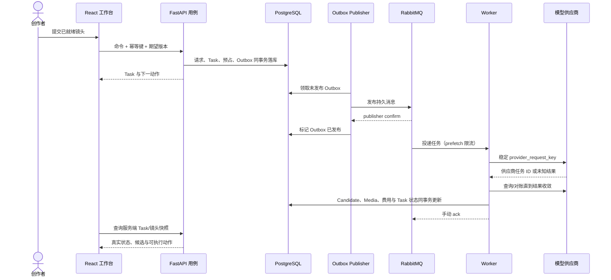

# DES-003 AI 短剧平台业务闭环与模块协作设计

- 状态：proposed
- 日期：2026-07-27
- 输入：`001-人工智能短剧平台产品调研与核心能力.md`、`002-人工智能短剧平台架构与技术选型.md`
- 输出：端到端业务阶段、事实所有权、模块交接、失败恢复与前后端协作边界
- 下游：MVP PRD、实施 Plan、业务契约与集成测试

## 1. 结论

当前阶段首先要打通“剧本成为可交付成片”的业务闭环，而不是复刻即梦的页面。即梦只提供三项交互启示：入口应聚焦创作意图、生成能力应集中呈现、媒体候选应便于浏览和选择；Lanverse 的页面、接口和数据必须围绕短剧生产阶段组织。

MVP 采用一个可纵向完成的生产管线。每个阶段必须有明确输入、业务事实、完成条件和失败后的下一动作；任何页面刷新、任务重试或 Worker 重启都不能改变事实归属。

## 2. MVP 业务结果

首个闭环服务一名可以兼任编剧、导演、生成操作员和审核人的创作者。团队角色和精细权限保留在模型中，但不阻塞单人完成以下结果：

1. 导入一集剧本并确认结构化结果。
2. 建立本集使用的角色、场景和声音资产。
3. 确认每个镜头的 ShotSpec 与生成准备状态。
4. 逐镜头生成、选择、重做图片、视频和音频候选。
5. 合成时间线，完成审核并导出带追溯信息的 MP4。

## 3. 端到端生产阶段

| 阶段 | 入口 | 主要操作 | 完成事实 | 事实模块 |
| --- | --- | --- | --- | --- |
| B0 项目立项 | 新建制作任务 | 建立 Project/Episode，设置画幅、语言、目标时长与预算 | Episode 进入 `draft` | projects |
| B1 剧本入库 | 原文或分集剧本 | 保存不可变 ScriptVersion，记录来源与使用权 | 当前剧本版本已指定 | scripts、governance |
| B2 结构确认 | 当前 ScriptVersion | AI 提取场景、镜头、对白和实体候选；人工合并、忽略或确认 | 提取批次已决议，不留未处理候选 | scripts |
| B3 资产准备 | 已确认实体 | 建立角色、场景、服装、道具、声音及参考版本 | 本集必要资产均 `ready` 且授权可用 | assets、media、governance |
| B4 分镜准备 | 场景、对白、资产 | 编辑 Shot 顺序和 ShotSpec，校验引用、时长和生成意图 | 每个待生成镜头通过 readiness | storyboards |
| B5 镜头生产 | ready ShotSpec | 创建关键帧、视频、配音任务，对比并选用候选 | 镜头具有被选中的媒体版本 | production、media |
| B6 时间线合成 | 已选镜头媒体 | 排列 Clip、字幕、配音、音效与转场，生成预览 | 当前 TimelineVersion 可渲染 | editing |
| B7 审核返工 | 可播放预览 | 通过、标记问题或退回到具体镜头/资产/时间线 | 所有阻塞问题关闭且版本获批 | governance |
| B8 渲染交付 | 已批准版本 | 渲染、写入生成标识和追溯编号、生成交付清单 | Delivery 成功且文件可验证 | editing、governance、media |

`B0～B8` 只表示产品内的业务阶段；`S0～S6` 专用于 PRD/Plan 纵向交付切片，两者不得混用。业务阶段不是前端自行维护的进度条。服务端根据完成事实计算 `current_stage`、`blocking_reasons` 和 `next_actions`；允许退回，但不得跳过授权、readiness、费用或审核门禁。

## 4. 核心事实与交接规则

| 事实 | 唯一所有者 | 上游输入 | 下游只能如何使用 |
| --- | --- | --- | --- |
| ScriptVersion | scripts | 用户原文 | 通过版本 ID 读取，不复制正文到 Shot |
| AssetVersion | assets | 已确认实体、媒体、授权 | ShotSpec 引用固定版本，不读取“最新版本”猜测 |
| ShotSpecVersion | storyboards | 场景、对白、资产版本 | GenerationRequest 保存其 ID 与输入快照 |
| GenerationRequest/Candidate | production | ShotSpec、能力参数 | Task 执行；用户显式选用后才进入生产版本 |
| Task/Attempt | production | 一次业务命令 | 页面展示真实状态，不把轮询次数当尝试次数 |
| MediaVersion/Lineage | media | 上传或供应商输出 | 通过不可变 ID 引用，选用不覆盖原文件 |
| Reservation/CostEntry | production | 可计费命令、供应商结算 | 其他模块只能查询，不自行计算余额 |
| TimelineVersion | editing | 被选中的镜头与音频 | Review 和 Delivery 引用固定版本 |
| ReviewDecision/Issue | governance | 待审版本 | 通过或退回均保留记录，不用布尔字段覆盖历史 |
| DeliveryManifest | editing | 已批准时间线与合规结果 | 记录文件、hash、字幕、标识和来源链 |

跨模块只传稳定 ID、版本与公开 DTO。禁止一个“项目 JSON”承载全部阶段，禁止页面直接拼接多个模块的数据库表，禁止复制另一模块的状态字段形成双事实源。

## 5. 关键业务命令

### 5.1 确认剧本提取

- 输入：ScriptVersion、提取批次、逐候选决议。
- 同一事务：写入决议，创建或关联资产草稿与 Shot 草稿，更新提取批次状态。
- 结果：返回仍未决议项和下一动作；重复提交同一决议不得重复创建实体。

### 5.2 提交镜头生成

- 前置：ShotSpecVersion 已 ready、授权有效、模型参数合法、额度足够。
- 同一事务：创建 GenerationRequest、Task、费用预占和 Outbox，保存输入 hash 与幂等键。
- 异步执行：Outbox Publisher 将任务投递到 RabbitMQ，Worker 消费后调用供应商；超时进入查询/对账，不把未知结果直接当失败重发。
- 结果：候选和媒体血缘持久化，实际费用结算；失败或取消释放未使用预占。

### 5.3 选用候选

- 输入：Candidate、目标 Shot、用户期望的当前 ShotSpecVersion。
- 同一事务：校验候选归属和版本未过期，写入选择记录并更新镜头的当前媒体指针。
- 结果：旧候选继续可追溯；下游时间线收到“镜头生产版本变化”而不是直接改文件。

### 5.4 批准并交付剧集

- 前置：TimelineVersion 可播放、阻塞问题为零、授权与生成标识检查通过。
- 同一事务：固定待交付版本并创建 Render/Delivery Task，避免审核后内容继续漂移。
- 结果：DeliveryManifest 指向渲染文件、hash、字幕、内容编号及完整来源链。

## 6. 生成与恢复时序

前端断线后只凭 Task ID 重新查询。客户端不得猜测成功、自动补发生成命令或在本地维护“看起来完成”的状态。

## 7. 前后端整合方式

写入接口按业务命令设计，如“确认提取”“提交镜头生成”“选用候选”“批准时间线”，而不是暴露任意表字段 CRUD。每个命令返回受影响实体的版本、Task（如有）、阻塞原因和下一动作。

读取端不引入完整 CQRS 或事件溯源。FastAPI 在应用层提供四类面向工作台的查询模型：项目生产概览、剧集阶段快照、镜头生产详情、统一任务中心；它们可组合所属模块的公开查询，但不得绕过模块仓储修改事实。

前端路由和功能区对应业务阶段，不对应供应商工具：项目概览、剧本与资产、分镜与生成、时间线与审核、任务与费用。`src/api/` 由 `@umijs/openapi` 从服务端契约生成，业务功能不手写 URL/DTO；shadcn/ui + Radix UI 只负责呈现，业务门禁、状态和下一动作全部来自 API。

## 8. 实施切片

1. 立项与准备：Project/Episode、ScriptVersion、提取决议、核心资产和 ShotSpec readiness。
2. 镜头生产：GenerationRequest、Task/Attempt、费用预占、供应商适配、候选选择和媒体血缘。
3. 成片交付：基础 TTS/字幕、TimelineVersion、审核返工、FFmpeg 渲染和 DeliveryManifest。
4. 闭环加固：未知任务对账、重放、取消、权限、授权、生成标识、审计和端到端恢复验证。

每个切片都必须从一个真实用户命令走到可观察结果，并包含数据库集成测试；不得先建立全部模块空壳，再等待未来串联。

## 9. 明确不做

- 不以页面列表代替业务模型，不为复刻即梦建立同名路由或视觉组件。
- 不建立万能 Workflow、万能 Asset 或万能 JSON 表吞并模块事实。
- 不引入低代码节点引擎、事件溯源、微服务或第二套任务系统。
- 不让前端直接调用模型供应商、计算余额、判定任务终态或拼装交付清单。
- 不在 MVP 同时实现无限画布、专业剪辑器、社区与自动发布。

## 10. 进入 PRD 前的确认项

- 单集基准：目标成片时长、镜头数、画幅和允许的最大返工次数。
- 文本结构提取已固定为 LangChain DeepSeek（`deepseek-v4-pro` 非思考结构化输出）；S4 再冻结火山方舟 Seedream/Seedance 的精确模型、地域、额度和计费口径。
- 资产授权、生成标识、审核责任与目标上线地区。
- 各阶段的可量化完成条件、允许退回路径和失败收敛时限。
- 首个实施切片的用户故事、API 契约与可执行验收样例。
