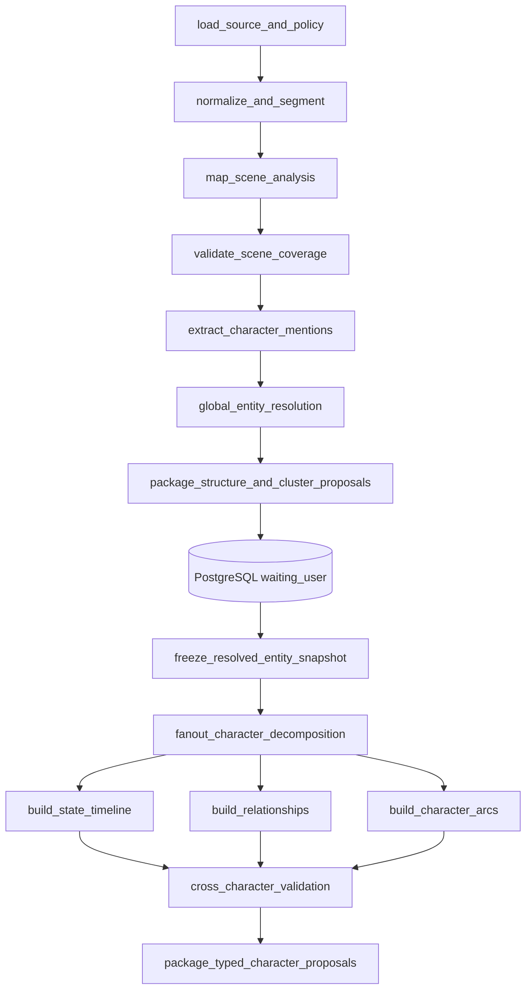

# AI 视频生产平台剧本基础分析与人物拆解详细设计

> 状态：提案 v1，待产品、编剧、制片与研发联合评审
> 日期：2026-08-20
> 上游需求：[M03 导入与叙事理解](../requirement/003-M03-导入与叙事理解需求.md)、[M04 生产知识与一致性图谱](../requirement/004-M04-生产知识与一致性图谱需求.md)
> 系统架构：[000-AI 视频生产平台目标系统架构设计](000-AI视频生产平台目标系统架构设计.md)
> 数据边界：[001-AI 视频生产平台核心领域与数据模型设计](001-AI视频生产平台核心领域与数据模型设计.md)
> 产品边界：[002-AI 视频生产平台目标产品与功能模块设计](002-AI视频生产平台目标产品与功能模块设计.md)
> 实现边界：[003-AI 视频生产平台接口工作流与功能实现设计](003-AI视频生产平台接口工作流与功能实现设计.md)
> 模块 Design：[M03 导入与叙事理解](./modules/003-M03-导入与叙事理解详细设计.md)、[M04 生产知识与一致性图谱](./modules/004-M04-生产知识与一致性图谱详细设计.md)
> 范围：M03/M04 的算法、证据、交互和迁移专题；模块边界与接口以上述模块 Design 为准

## 1. 设计结论

剧本基础分析与人物拆解应当成为平台第一条智能生产主线，但它不能被实现为“把整份剧本交给一次 LLM 调用，然后直接创建人物资产”。目标实现分为四层：

1. 确定性来源层保留原件、标准化文本、章节/集/场边界和可复核锚点。
2. 语义分析层生成场次、节拍、对白、人物提及和连续性提案，不直接发布业务事实。
3. 人物解析层解决同名不同人、别名同一人、称谓变化和跨场指代，再生成资料、状态、关系和弧线提案。
4. 人工决议层逐项接受、修改、合并、拆分、关联或暂缓；批准后才形成 NarrativeRevision 和 ProductionEntity 事实。

当前技术路径继续使用 Python。FastAPI 负责命令、查询和短事务；Outbox、RabbitMQ 和独立 Agent Worker 运行 LangGraph 分析图；PostgreSQL 保存业务事实、提案和决议证据。LangGraph checkpoint 只恢复一次 AnalysisRun，不成为人物资料或审批状态源。

基础分析必须先于人物拆解，人物解析必须先于分镜提案。首期权威顺序为：

```text
SourceRevision
  → 确定性标准化与场次边界
  → Scene / Beat / Dialogue 提案
  → CharacterMention 提取
  → 人物聚类、消歧与人工决议
  → 人物资料、状态、关系与弧线提案
  → 连续性校验
  → NarrativeRevision / ProductionEntity 草稿批准
  → 分镜与生成规划
```

## 2. 问题定义

“识别出人物姓名”不是人物拆解完成。生产系统必须回答以下问题：

- 原文中的“林夏”“小夏”“她”和“队长”是否是同一个人？
- 两个都叫“王总”的提及是否属于不同人物？
- 某项人物信息是原文明示、可靠推断、模型猜测，还是用户补充？
- 人物的长期身份特征和某一场临时状态如何分开？
- 服装、伤痕、持有物、情绪、知识和阵营从何时开始生效？
- 人物关系是单向还是双向，在什么场次发生变化？
- 人物目标、阻力和转折如何关联到具体场次与节拍？
- 修改剧本或合并人物后，哪些分镜、提示、参考和候选需要复核？

如果这些问题没有显式模型，后续的参考绑定、提示编译、跨镜头一致性和局部重做都会依赖不可验证的自由文本。

## 3. 范围与非目标

### 3.1 本设计范围

- 剧本、小说改编稿、故事梗概和结构化脚本的文本基础分析。
- 集、场次、节拍、动作、对白和旁白识别。
- 人物提及、别名、称谓、代词和说话人的解析。
- 人物身份建立、合并、拆分、关联已有身份和暂缓决议。
- 人物资料、人物目标、动机、性格、能力、秘密、说话方式和人物弧线。
- 人物状态时间线，包括服装、妆造、伤痕、情绪、持有物、位置、知识和阵营。
- 人物关系及其方向、强度、状态和生效范围。
- 来源证据、置信度、冲突、缺口和人工校对。
- 新来源版本的差异迁移和下游影响分析。

### 3.2 非目标

- 自动改写原稿或替用户做最终编剧决定。
- 在人物尚未消歧前直接生成正式分镜。
- 在接受人物提案时自动生成形象、声音、LoRA 或视频。
- 用一张自由文本“人物卡”替代结构化事实、状态和关系。
- 将商业订阅、计费、投放或发行纳入分析模块。
- 首期建设通用知识图谱平台、图数据库或独立微服务。

## 4. 术语与对象边界

| 术语 | 定义 | 不是 |
| --- | --- | --- |
| SourceRevision | 不可变的原始来源版本 | AI 清洗后的可覆盖文本 |
| SourceAnchor | 来源页码、段落和字符范围组成的证据位置 | 只在日志中出现的 offset |
| NarrativeRevision | 一次经过校对的完整叙事结构 | 单个模型响应 |
| NarrativeScene | 某个 NarrativeRevision 内的场次 | 跨版本稳定人物身份 |
| Beat | 场次内一个最小叙事变化单元 | 自动等同一个镜头 |
| CharacterMention | 原文中一次人物出现或指代 | 已经确认的人物身份 |
| EntityCluster | AnalysisRun 内若干可能属于同一人物的提及集合 | 可供下游长期引用的业务对象 |
| ProductionEntity | 项目内稳定人物身份 | 一张立绘或一个提示词 |
| CharacterProfileRevision | 相对稳定的人物叙事资料版本 | 某场临时服装和情绪 |
| EntityStateRevision | 在明确范围内生效的人物状态 | 新人物身份 |
| EntityRelationRevision | 两个人物之间带方向和范围的关系版本 | `relationships: string[]` |
| CharacterArcRevision | 基于某个叙事版本的人物弧线解释 | 无证据的剧情预测 |
| ReferenceBinding | 身份、服装、声音等生产参考的绑定 | 人物叙事事实本身 |

必须区分“这个人是谁”“这个人长期是什么样”“这个人在当前场次处于什么状态”和“生产上如何表现这个人”。人物身份、资料、状态和视觉/声音参考不能合并成一个可随意覆盖的 JSON 对象。

## 5. 用户与权限

| 能力 | 典型使用者 | 权限要求 |
| --- | --- | --- |
| 启动基础分析 | 编剧、制片人、内容编辑 | 来源可读、内容写入、模型外发策略允许 |
| 校对场次和节拍 | 编剧、内容编辑 | Narrative 草稿写入 |
| 合并或拆分人物 | 编剧、制片人 | 人物身份写入；必须查看影响预览 |
| 发布人物资料 | 制片人、人物设定负责人 | ProductionEntity 发布权限 |
| 发布形象和声音参考 | 美术、声音负责人 | 对应生产资料写入与授权检查 |
| 批准整版叙事 | 制片人或组织指定批准者 | 内容批准权限 |
| 查看来源证据 | 项目成员、审阅者 | 来源与项目读取权限 |

模型、Agent Worker 和解析 Worker 没有批准权限。它们只能写 AnalysisRun 结果区，不能直接更新 current NarrativeRevision、ProductionEntity current 指针或已批准状态。

## 6. 输入与输出契约

### 6.1 AnalysisRun 输入

| 字段 | 说明 |
| --- | --- |
| `source_revision_id` | 唯一输入来源版本，内容不可变 |
| `content_unit_id` | 所属剧集、广告或其他内容单元 |
| `analysis_profile` | 如 `screenplay_zh_v1`、`novel_adaptation_zh_v1` |
| `scope` | 全文、指定集、指定场次或变更范围 |
| `baseline_narrative_revision_id` | 可选；用于增量分析和差异迁移 |
| `entity_catalog_revision` | 启动时可见的项目人物身份快照 |
| `analyzer_contract_version` | 输出契约版本 |
| `policy_revision_id` | 模型外发、保留、内容安全和地域策略 |
| `idempotency_key` | 同输入同配置重复提交返回同一活动 Operation |

分析输入只传对象引用和小型配置。大型正文通过受控读取端口加载，不进入 RabbitMQ 消息正文或 LangGraph 事件历史。

### 6.2 AnalysisRun 输出

- AnalysisReport：覆盖率、失败页/段、冲突、歧义和质量摘要。
- NarrativeDraft：Scene、Beat、DialogueLine、Action 和 SourceAnchor。
- EntityResolutionSet：Mention、Cluster、候选身份和消歧冲突。
- CharacterProposalSet：资料、状态、关系、弧线和连续性提案。
- ProposalDecisionSet：用户逐项决议和修改证据。
- ImpactPreview：接受某项决议将新增、合并、替代或使哪些下游内容过期。

输出中的 `null` 表示未知；空数组表示已检查但没有项目；字段缺失表示该契约版本不提供。三种含义不得混用。

## 7. 基础分析功能设计

### 7.1 来源标准化

系统先完成确定性处理：

1. 校验原件哈希、媒体类型和安全扫描结果。
2. 提取文本并保留页码、段落、表格单元或原始字符位置。
3. 统一换行和 Unicode 规范，但保留原始文本到规范文本的双向映射。
4. 识别集标题、场次标题、角色台词前缀和显式格式标记。
5. 记录无法解析、被截断、OCR 低可信或格式不明的范围。

标准化文本不能替换 SourceRevision。任何 Scene、Beat、Mention 和人物事实都必须能回到 SourceAnchor。

### 7.2 场次拆解

每个 NarrativeScene 至少包含：

| 维度 | 必需性 | 说明 |
| --- | --- | --- |
| 场次序号 | 必需 | 仅在当前 NarrativeRevision 内排序 |
| 内外景 | 可选 | `interior`、`exterior`、`mixed`、`unknown` |
| 地点提示 | 必需 | 原文地点；不自动等同 ProductionEntity |
| 时间提示 | 可选 | 白天、夜晚、清晨、连续、闪回等 |
| 摘要 | 必需 | 只总结当前场次已有内容 |
| 戏剧目的 | 可选 | 信息揭示、冲突升级、转折、过渡等 |
| 场次目标 | 可选 | 本场需要达成的叙事目标 |
| 核心冲突 | 可选 | 人物、环境或信息冲突 |
| 转折与结果 | 可选 | 场次前后状态变化 |
| 参与提及 | 必需 | 指向 CharacterMention，不直接保存姓名数组 |
| 道具/地点提及 | 可选 | 指向对应 Mention |
| 来源锚点 | 必需 | 可包含多个连续或非连续锚点 |

场次边界不确定时生成边界冲突提案，不能将两个可疑场次静默拼接。

### 7.3 节拍拆解

Beat 是叙事变化而非镜头。建议类型包括：

- `setup`：建立人物、地点或初始条件。
- `goal`：人物表达或采取目标。
- `action`：产生可观察动作。
- `reaction`：人物对信息或动作作出反应。
- `conflict`：阻力或对抗升级。
- `reveal`：新信息被揭示。
- `decision`：人物作出会影响后续的决定。
- `turn`：场次方向发生变化。
- `transition`：时间、地点或叙事焦点转换。

每个 Beat 可记录主体、目标、阻力、情绪前后、状态变化、涉及道具和来源锚点。一个 Beat 可以被多个镜头覆盖，一个镜头也可覆盖多个相邻 Beat；两者不能提前一对一绑定。

### 7.4 对白与动作

DialogueLine 需要保留：

- 原文、对白类型、说话人 Mention 和可选受话人 Mention。
- 所属 Scene/Beat、说话前后动作、表演提示和原文格式。
- 情绪和潜台词提案；没有直接证据时必须标记为推断。
- 无法确认说话人时的 `unresolved` 状态。

动作行不能只保存整行文本。与人物状态、持有物变化或关系变化相关的动作应形成带证据的 AttributeFact 提案，但不自动发布。

### 7.5 结构完整性检查

- 全部非空来源内容必须被 Scene/Beat/Dialogue/Action 覆盖或明确标记忽略原因。
- 每条 DialogueLine 必须属于一个 Scene，并有说话人、旁白类型或未决原因。
- Scene 和 Beat 的来源范围不能非法交叉。
- 章节/集标记与内容单元归属冲突时阻止整版批准。
- 缺失场次标题、超长场次、空场、未闭合对白和时间跳跃生成可定位问题。

## 8. 人物提及、聚类与消歧

### 8.1 CharacterMention

每一次人物出现都创建独立 Mention，字段至少包括：

- `surface_text`：原文，如“林夏”“小夏”“她”“队长”。
- `mention_type`：姓名、别名、称谓、代词、群体、隐含说话人。
- `scene_id`、`beat_id`、可选 `dialogue_line_id`。
- `source_anchor_ids`：一个或多个来源证据。
- `grammatical_role`：说话人、动作主体、动作客体、被提及对象等。
- `resolution_status`：未解析、自动建议、已人工确认、冲突。
- `resolved_entity_id`：批准后才存在。

Mention 是来源事实，ProductionEntity 是业务身份。删除或合并人物身份不能删除原始 Mention。

### 8.2 聚类候选

模型和确定性规则可综合以下证据生成 EntityCluster：

- 规范化姓名和别名，但不能只按名字。
- 同一场次的说话顺序、称谓和代词上下文。
- 人物自称、他称、职业、阵营和关系描述。
- 与同场其他人物同时出现是否造成身份冲突。
- 跨场连续的状态、持有物和事件因果。
- 项目中已有 ProductionEntity 的别名和已批准 Mention。

每个聚类建议都必须给出支持证据和反证。系统不得仅因为规范化名称相同就自动合并人物。

### 8.3 人工决议

| 决议 | 结果 |
| --- | --- |
| `create_new` | 创建新的 ProductionEntity 草稿并绑定所选 Mention |
| `link_existing` | 绑定项目内已有实体，不创建第二个身份 |
| `merge_clusters` | 合并两个分析期 Cluster，保留各自 Mention 和决议证据 |
| `split_cluster` | 按 Mention 集合拆分；未分配 Mention 保持待处理 |
| `move_mentions` | 将指定 Mention 移到另一个 Cluster |
| `defer` | 暂不确定；相关下游场次显示阻塞或警告 |
| `reject_non_character` | 标记为非人物、群体或解析错误 |

拆分、合并和关联已有实体都必须预览受影响的资料、关系、状态和下游引用。名称修改只创建 NameRevision，不改变 ProductionEntity ID。

## 9. 人物详细拆解

### 9.1 人物身份

身份层只保存跨叙事版本需要稳定引用的内容：

- 规范名称、别名、称谓和项目内唯一策略。
- 人物类别：个人、群体、匿名角色、待揭示身份。
- 首次出现和最后出现的 Narrative 证据。
- 身份公开状态：草稿、已发布、已归档。

“蒙面人”和“林夏”在剧情揭示前可以是两个身份候选；揭示后通过合并决议建立同一身份，并保留历史上当时未知的叙事视角。

### 9.2 人物资料 CharacterProfileRevision

| 分组 | 字段示例 | 规则 |
| --- | --- | --- |
| 叙事职能 | 主角、对手、盟友、导师、触发者 | 分类必须带证据，可多选并带范围 |
| 外在目标 | 想要获得、阻止或完成的事情 | 可随篇章变化，不覆盖历史 |
| 内在需要 | 人物真正需要完成的认知或情感变化 | 推断必须标记 assertion level |
| 动机与代价 | 为什么行动、失败会失去什么 | 分别保存，不拼成一句提示词 |
| 性格与价值观 | 稳定倾向、原则、禁区 | 每项独立事实和证据 |
| 能力与限制 | 技能、资源、身体或规则限制 | 不能把模型常识当作原文事实 |
| 背景与秘密 | 已知历史、对谁可见 | 支持信息可见性和揭示时间 |
| 语言特征 | 口头禅、语速、词汇、礼貌层级 | 与 Voice Reference 分离 |
| 外观身份特征 | 原文明确的稳定外观 | 生产形象另建 ReferenceBinding |

资料不是强制填满的表格。首期完成标准是：所有必需字段要么有带证据的值，要么明确为 `unknown`，不能用模型猜测填空制造虚假完整度。

### 9.3 人物状态 EntityStateRevision

人物状态按 facet 分开版本化：

| facet | 示例 | 常见冲突 |
| --- | --- | --- |
| `appearance` | 年龄感、发型、明显伤痕 | 稳定特征被临时状态覆盖 |
| `costume` | 校服、黑色外套、战斗服 | 同范围出现互斥服装 |
| `makeup` | 妆容、血迹、污渍 | 清理后仍错误继承 |
| `emotion` | 恐惧、克制、愤怒 | 情绪转折未关联 Beat |
| `injury` | 左臂受伤、失明 | 受伤发生前提前生效 |
| `possession` | 持有钥匙、失去手机 | 同一道具同时被两人独占 |
| `location` | 被关在仓库 | 与 Scene 地点冲突 |
| `knowledge` | 已知道真相 | 信息揭示前提前用于表演或对白 |
| `allegiance` | 属于某阵营、叛变 | 阵营转变缺少转折证据 |
| `life_status` | 存活、失踪、死亡 | 终态被无依据恢复 |

状态发布时必须把自然语言范围解析为不可变成员快照。ContentUnit/Shot 使用稳定 ID；NarrativeScene/Beat 使用“不可变 NarrativeRevision + 修订内成员 ID”。`从第三场开始` 不能永久保存为字符串；场次重排或叙事换版后历史范围不随序号漂移。

### 9.4 人物关系 EntityRelationRevision

关系至少包含：

- `from_entity_id`、`to_entity_id` 和是否对称。
- 类型，如亲属、同事、上下级、盟友、对手、情感、债务、控制、知情。
- 方向、强度、表面状态、真实状态和信息可见性。
- 生效范围、开始原因、结束原因和来源锚点。
- `explicit`、`strong_inference`、`weak_inference` 或 `user_supplied`。

“A 信任 B”不能自动推出“B 信任 A”。关系变化创建新 Revision，不覆盖旧值；互斥关系和循环依赖只在具体关系类型要求时阻止发布。

### 9.5 人物弧线 CharacterArcRevision

人物弧线绑定 NarrativeRevision，并由 ArcBeat 连接具体 Beat：

1. 起始状态：人物最初的目标、信念和限制。
2. 欲望与需要：外在追求和内在变化。
3. 阻力：人物、环境、制度或自身缺陷。
4. 触发事件：迫使人物进入行动的 Beat。
5. 关键选择：改变后续路径的 Decision/Turn Beat。
6. 低谷或代价：目标受阻或付出代价。
7. 高潮选择：决定弧线结果的行为。
8. 结束状态：改变、失败、循环或开放状态。

长篇内容允许篇章级和整季级多个 ArcRevision。弧线摘要不能替代 ArcBeat 证据；没有足够内容时返回“尚未形成可判断弧线”。

## 10. 事实、推断与证据

### 10.1 四类信息层

| 层 | 示例 | 是否可直接被下游使用 |
| --- | --- | --- |
| SourceObservation | “林夏把钥匙交给陈默” | 可作为证据，不等于已批准状态 |
| AnalysisProposal | “钥匙持有人变为陈默” | 不可，必须决议 |
| ApprovedFact | 用户接受该持有物变化 | 可，由状态范围决定 |
| ProductionDecision | 使用哪张角色图、哪种声音表现 | 可，但不得反写原文事实 |

生成候选只证明“模型生成了什么”，不能反向证明人物设定是什么。

### 10.2 原子事实

人物资料、状态和关系中的关键值保存为 AttributeFact：

```text
subject_entity_id
predicate
value_json + value_schema_version
effective_scope_id
assertion_level
confidence
source_anchor_ids[]
analysis_run_id / proposal_id / decision_id
status = proposed | accepted | rejected | superseded
```

置信度针对单个事实，而不是整张人物卡。每个 accepted AI 事实必须至少有一个有效 SourceAnchor；用户直接补充的事实使用 `user_supplied` 并记录输入者和原因。

### 10.3 冲突分类

- `identity_collision`：同名提及可能属于不同人物。
- `alias_ambiguity`：同一称谓可能指向多个实体。
- `fact_conflict`：相同范围内同一谓词有互斥值。
- `timeline_conflict`：状态发生顺序不可能或缺少起点。
- `relation_conflict`：关系方向、范围或状态不一致。
- `missing_evidence`：结论没有来源锚点。
- `scope_gap`：自然语言范围无法解析成稳定成员。
- `stale_baseline`：分析基线已被新的 NarrativeRevision 替代。

阻塞级冲突必须解决后才能发布相关人物或场次；非阻塞缺口允许保留为 unknown，并在分镜准备度中显示警告。

## 11. 端到端工作流

### 11.1 创建与执行

1. API 在 PostgreSQL 短事务中校验权限、来源状态和外发策略。
2. 创建 AnalysisRun、Operation、结构分析 Task 和 OutboxEvent；提交后返回 `202`。
3. Outbox Publisher 发布版本化 `NarrativeStructureAnalysisRequested`。
4. Agent Worker 读取 SourceRevision 和基线快照，运行结构、Mention 与聚类 LangGraph。
5. 各阶段结果先写 Analysis 结果区，不修改 current 业务事实。
6. 完成来源覆盖和跨引用校验后，提交 AnalysisReport、NarrativeDraft 和 EntityCluster，Operation 进入 `waiting_user`。
7. 用户先修正结构，再对人物 Cluster 执行 create、link、merge、split、move 或 defer；任一结构变化会使受影响聚类过期。
8. 阻塞身份冲突解决后，应用事务创建人物拆解 Task 和 OutboxEvent，并冻结已解析 Mention/Entity 快照。
9. Agent Worker 运行人物资料、状态、关系和弧线 LangGraph，幂等提交类型化 Proposal，Operation 再次进入 `waiting_user`。
10. 用户逐项决议；发布命令重新鉴权、检查基线、运行冲突与影响预检。
11. 成功发布 NarrativeRevision 和人物事实，并通过 Outbox 通知分镜、质量和投影更新。

用户等待不能停在 LangGraph `interrupt` 中。每个 LangGraph Task 在到达人工门禁前结束，产品等待状态只保存在 AnalysisRun/Operation；用户决议后由新的 Outbox 事件启动下一 Task。

### 11.2 LangGraph 分析图



`map_scene_analysis` 可按集和完整场次并行；`global_entity_resolution` 必须读取全局 Mention 摘要，不能在每个 Chunk 内独立按名称定案。图中的 PostgreSQL 人工门禁是两个 LangGraph Task 的边界，不是一个持续运行的图节点。人物拆解只对用户已解析的实体快照执行，分镜提案不属于本图。

### 11.3 分块规则

- 优先按内容单元和完整场次分块，避免在场次中间截断。
- 单场过长时按 Beat 候选或段落拆分，并保留前后上下文摘要和重叠证据。
- 每个分块输出局部 Mention，不直接输出最终人物身份。
- Reduce 阶段保留每个 Mention 的全部 SourceAnchor，不能只保留第一次出现。
- 同名聚合只形成待确认建议；别名、代词和称谓必须经过全局消歧。

### 11.4 部分失败

单个场次分析失败不应丢弃其他成功场次：

- AnalysisRun 进入 `partial`，报告失败范围和可重试阶段。
- 成功提案可校对，但整版发布门禁根据失败范围判断。
- 重试复用已通过且输入哈希未变化的阶段结果。
- 结果不确定时 Operation 进入 `unknown`，先对账 checkpoint/result receipt，不能直接再次产生模型费用。

## 12. 校对与交互设计

### 12.1 分析总览

总览需要显示：

- 来源覆盖率、场次数、Beat 数、人物 Mention 数和候选人物数。
- 待解决身份冲突、无说话人对白、状态冲突和无证据事实。
- AnalysisRun 各阶段进度、部分失败范围和恢复动作。
- “可批准”“可部分使用”“阻塞”三类准备度，不用单一百分比分数掩盖问题。

### 12.2 结构校对台

界面左侧显示 Scene/Beat 树，中央显示结构化字段，右侧固定显示来源原文和高亮锚点。用户操作是：

- 拆分/合并场次或 Beat。
- 重新分类对白、动作、旁白和标题。
- 修改戏剧目的、目标、冲突、转折和结果。
- 标记某段不进入生产或必须被分镜覆盖。

字符 offset 只用于诊断，不能要求普通用户手工输入起止数字。系统根据选区和结构操作维护 SourceAnchor。

### 12.3 人物消歧台

人物候选按冲突优先展示：

- 左侧为候选 Cluster 和项目已有角色。
- 中央为按时间排序的 Mention、称谓和说话上下文。
- 右侧为合并支持证据、反证和将受影响的资料/关系。
- 支持框选 Mention 后拆分、拖到已有角色、批量确认无歧义提及。

系统必须允许“暂时不知道”，不能强迫用户在证据不足时错误合并。

### 12.4 人物圣经

人物详情按以下页签组织：

1. 概览：稳定身份、别名、叙事职能和准备度。
2. 证据：全部 Mention、来源位置和决议历史。
3. 资料：目标、动机、性格、能力、秘密和语言特征。
4. 状态时间线：按 Scene/Beat 展示服装、情绪、伤痕、持有物、知识等变化。
5. 关系：方向化关系图和时间变化。
6. 人物弧线：ArcBeat 与场次/Beat 证据。
7. 生产表现：形象、服装、声音和参考绑定。
8. 影响：被哪些镜头、计划、候选和交付引用。

资料页和生产表现页必须分开，避免修改故事事实时意外替换形象版本。

## 13. 领域命令与事件

### 13.1 关键命令

| 命令 | 关键输入 | 主要门禁 |
| --- | --- | --- |
| `StartNarrativeAnalysis` | SourceRevision、profile、baseline | 权限、策略、输入哈希 |
| `ReviseNarrativeStructure` | Scene/Beat 操作和 expected revision | 来源覆盖守恒、基线未变 |
| `ResolveCharacterMentions` | Mention IDs、目标实体或新身份 | Mention 同源、无并发决议 |
| `SplitEntityCluster` | Cluster、Mention 分组 | 每个 Mention 只能进入一个结果组 |
| `MergeEntityClusters` | 来源与目标 Cluster | 显示反证和影响 |
| `ReviseCharacterProfile` | 原子事实与证据 | 值 Schema、证据、版本 |
| `PublishEntityState` | facet、值、effective scope | 范围快照、互斥冲突 |
| `PublishEntityRelation` | from/to/type/scope | 方向、范围和证据 |
| `PublishCharacterArc` | Arc 与 ArcBeat | Narrative 基线和证据完整 |
| `ApproveNarrativeRevision` | draft、expected baseline | 阻塞问题清零、权限 |

### 13.2 关键事件

| 事件 | 下游用途 |
| --- | --- |
| `narrative.analysis.completed.v1` | 通知校对投影，不自动批准 |
| `narrative.revision.approved.v1` | 允许分镜提案并刷新依赖投影 |
| `character.mentions.resolved.v1` | 刷新人物圣经和场次参与者 |
| `entity.profile.published.v1` | 更新人物查询与提示编译输入 |
| `entity.state.published.v1` | 计算影响、使相关预检过期 |
| `entity.relation.published.v1` | 更新关系图和连续性规则 |
| `character.arc.published.v1` | 更新叙事质量与分镜意图建议 |

事件只携带 ID、版本、变更摘要和 trace 信息；来源正文、人物秘密、完整提示和媒体不进入消息载荷。

## 14. 数据模型细化

### 14.1 M03 分析事实和提案

| 表 | 关键字段 | 约束 |
| --- | --- | --- |
| `nar_analysis_run` | source_revision_id、baseline_revision_id、profile、contract_version、status、operation_id、input_hash | 同输入与配置活动 Run 唯一 |
| `nar_analysis_stage` | run_id、stage_code、input_hash、status、result_ref、attempt_count | 阶段结果可幂等复用 |
| `nar_scene` | narrative_revision_id、ordinal、purpose、goal、conflict、turn、outcome | 同修订 ordinal 唯一 |
| `nar_beat` | scene_id、ordinal、kind、goal、conflict、emotion_before/after | 必须属于同修订 Scene |
| `nar_dialogue_line` | beat_id、speaker_mention_id、addressee_mention_id、kind、text | speaker 可 unresolved，但必须有状态 |
| `nar_source_anchor` | source_revision_id、page/paragraph、start/end、exact_hash | 范围合法且能重读验证 |
| `nar_entity_mention` | narrative_revision_id、scene/beat/dialogue_id、surface_text、type、anchor_ids、status | Mention 不因实体合并删除 |
| `nar_entity_cluster` | run_id、cluster_key、suggested_name、status、evidence_summary | 只属于 AnalysisRun，不供下游长期引用 |
| `nar_cluster_member` | cluster_id、mention_id、score、reasons | 同 Run 的 Mention 只能有一个活动归属 |
| `nar_resolution_decision` | mention/cluster、action、target_entity_id、payload、actor_id | 追加事实，幂等键唯一 |
| `nar_analysis_proposal` | run_id、kind、payload_ref、confidence、assertion_level、status | 大型结果走 payload_ref |
| `nar_proposal_evidence` | proposal_id、anchor_id、support_kind | 同提案证据去重 |

### 14.2 M04 人物知识

| 表 | 关键字段 | 约束 |
| --- | --- | --- |
| `pk_entity` | project_id、type、canonical_name、status | 稳定身份；项目内名称策略可配置 |
| `pk_entity_name_revision` | entity_id、canonical_name、aliases、reason | 只追加，重命名不改 ID |
| `pk_character_profile_revision` | entity_id、based_on_narrative_revision_id、status、summary | 同实体 current 唯一 |
| `pk_attribute_fact` | subject_id、predicate、value_json、scope_id、assertion、confidence、status | accepted AI 事实必须有证据 |
| `pk_attribute_evidence` | fact_id、source_anchor_id、analysis_run_id、proposal_id、decision_id | 证据链完整 |
| `pk_entity_state_revision` | entity_id、facet_code、attributes_json、effective_scope_id、status | 同 facet/成员/优先级不可冲突 |
| `pk_entity_relation_revision` | from_id、type、to_id、direction、attributes、effective_scope_id、status | from/to 不能非法自引用 |
| `pk_character_arc_revision` | entity_id、narrative_revision_id、scope_id、status、summary | 同范围 current 唯一 |
| `pk_character_arc_beat` | arc_revision_id、beat_id、phase、effect | Beat 必须来自绑定 NarrativeRevision |
| `pk_effective_scope` | content_unit_id、basis_revision_id、kind、content_hash | 发布后不可变 |
| `pk_effective_scope_member` | scope_id、member_type、member_id | 使用稳定成员快照 |

高频谓词如叙事职能、外在目标、动机、持有物和知识状态应登记 Schema；长尾谓词允许扩展，但必须带 `value_schema_version`，不能形成无法验证的任意 JSON 垃圾场。

## 15. 状态机

### 15.1 AnalysisRun

```text
accepted → queued → analyzing_structure → needs_structure_review
                                      → needs_identity_review
needs_identity_review → decomposing_characters → needs_character_review → reviewed
任一执行阶段 → partial | failed | cancelled
任一非终态 → superseded
```

AnalysisRun 状态表示分析产物生命周期；`reviewed` 只表示必需提案已完成决议，不替代 NarrativeRevision、CharacterProfile 或 EntityState 各自的发布状态。用户可见长任务进度仍以 Operation 为准。外部模型调用结果不确定时由 Task/Operation 进入 `unknown`，对账完成后再推进 Run。

### 15.2 Proposal

```text
pending → accepted | accepted_with_changes | linked | merged | split
        → rejected | deferred
任一非终局提案 → superseded
```

`deferred` 不是拒绝；后续补充来源或其他人物决议后可生成替代提案。已接受提案的原始模型输出不可覆盖。

### 15.3 人物资料、状态和关系

```text
draft → published → superseded
                  ↘ archived
```

发布版本不可编辑。纠错创建新 Revision，并通过 ImpactReport 决定是否产生新的分镜或生成计划。

## 16. HTTP API

### 16.1 分析任务

```text
POST /v1/source-revisions/{source_revision_id}/analysis-runs
GET  /v1/analysis-runs/{analysis_run_id}
GET  /v1/analysis-runs/{analysis_run_id}/report
GET  /v1/analysis-runs/{analysis_run_id}/proposals
GET  /v1/analysis-runs/{analysis_run_id}/conflicts
POST /v1/analysis-runs/{analysis_run_id}/cancel
POST /v1/analysis-runs/{analysis_run_id}/retry-stage
```

创建返回 `202`、Operation ID 和 AnalysisRun ID。`retry-stage` 只接受可重试失败阶段，并校验输入哈希和当前 Run 状态。

### 16.2 结构与人物消歧

```text
GET  /v1/narrative-drafts/{draft_id}
POST /v1/narrative-drafts/{draft_id}/structure-revisions
GET  /v1/analysis-runs/{analysis_run_id}/entity-clusters
POST /v1/entity-clusters/{cluster_id}/merge
POST /v1/entity-clusters/{cluster_id}/split
POST /v1/entity-clusters/{cluster_id}/link-existing
POST /v1/entity-mentions/{mention_id}/move
POST /v1/entity-mentions/{mention_id}/defer
```

拆分请求必须显式提交每组 Mention ID；服务端拒绝遗漏、重复或跨 Run Mention。

### 16.3 人物资料

```text
GET  /v1/projects/{project_id}/characters
GET  /v1/characters/{entity_id}/bible
POST /v1/characters/{entity_id}/profile-revisions
POST /v1/characters/{entity_id}/state-revisions
POST /v1/characters/{entity_id}/relation-revisions
POST /v1/characters/{entity_id}/arc-revisions
POST /v1/character-revisions/{revision_id}/publish
GET  /v1/characters/{entity_id}/impact
```

所有写命令包含 `expected_revision` 和 `idempotency_key`。发布命令接收预检生成的 `impact_hash`，防止用户批准后影响范围已变化。

## 17. 下游消费契约

### 17.1 分镜模块

分镜提案输入只包含：

- 已批准 NarrativeRevision 的 Scene、Beat 和 DialogueLine。
- 已解析的 ProductionEntity ID 和对应范围内 EntityStateRevision。
- 已发布 ReferenceBinding 和 Style/World Rule。
- 尚未解决但与当前场次相关的阻塞或警告。

分镜模块不读取原始 AnalysisProposal，也不根据姓名字符串重新猜人物。

### 17.2 提示编译

提示编译从结构化事实生成模型输入：

- 身份特征来自 CharacterProfile/AttributeFact。
- 当前服装、伤痕、情绪和持有物来自有效 EntityStateRevision。
- 形象与声音来自明确用途的 ReferenceBinding。
- 镜头局部表现来自 ShotPlanRevision。

人物 `arc_summary` 或关系自由文本不能直接整段拼进提示词；编译器只读取该镜头需要的字段和允许外发的数据。

### 17.3 质量与影响

- 质量规则比较候选画面与冻结的人物状态快照。
- 上游人物状态变化通过依赖边形成 ImpactReport。
- 已执行 GenerationPlan 保留旧输入快照，不随人物 current 改写。
- 新计划必须使用最新批准事实，除非用户明确按旧快照继续。

## 18. 幂等、并发与恢复

- `analysis_run_key = source_hash + profile + analyzer_version + config_hash`。
- 每个阶段使用 `run_id + stage_code + stage_input_hash` 幂等。
- 模型结果使用 `run_id + stage_code + result_hash` 幂等提交。
- 决议使用 `proposal/cluster/mention_id + decision_key` 幂等。
- current 指针更新使用 expected revision 或数据库条件更新。
- 人物合并、拆分和发布必须锁定涉及的 Entity/Cluster，并重新计算冲突。
- Outbox 与 Run/Task/决议事实同事务提交。
- Worker 重投只复用同一 Task；不得创建第二个 AnalysisRun 或第二套人物身份。

## 19. 安全与治理

- 剧本文本视为不可信数据。来源中的“忽略系统指令”等内容只能作为剧情文本，不能改变 Agent System Prompt 或 Tool 权限。
- Agent Worker 只获得当前 SourceRevision、项目人物目录快照和受限结果提交端口。
- 项目名、人物秘密、原文、Prompt 和签名 URL 不进入指标标签或普通日志。
- 模型外发记录提供商、模型、地域、策略版本、输入对象引用和内容哈希。
- 未成年人、真人肖像、声音克隆和敏感身份需要治理模块单独检查；分析出某个人物不代表获得生成授权。
- 删除来源时遵循保留、法律保全和已交付快照规则；不能只删除 SourceRevision 而留下不可解释事实。

## 20. 当前实现审计

### 20.1 可保留部分

| 当前能力 | 判断 | 目标处理 |
| --- | --- | --- |
| 不可变 ScriptVersion 与来源哈希 | 合理 | 保留并映射为 SourceRevision/Narrative 输入 |
| Unicode 字符锚点和原文高亮 | 合理 | 保留底层机制，UI 改为选区和结构操作 |
| Task、Operation、Outbox 与 Worker | 合理且必要 | 作为新 AnalysisRun 的可靠执行骨架 |
| ExtractionCandidate 决议证据 | 思路合理 | 升级为类型化 Proposal、Mention/Cluster 决议 |
| Asset 稳定 ID、状态和不可变版本 | 部分合理 | 迁移到 ProductionEntity，但拆开叙事资料与生产表现 |
| 影响预检和 expected revision | 合理 | 扩展到人物合并、状态、关系和弧线 |

### 20.2 主要设计缺陷

1. 当前确定性解析器只把每行分为 `scene_heading/action/dialogue/narration`，没有 Scene—Beat—Dialogue 层级，也无法表达场次目的、冲突和状态变化。
2. 当前 `ScriptExtractionResult` 把 Scene、Dialogue、Asset、Shot 和 Continuity 放在一个扁平候选数组中，基础事实尚未确认就同时产生镜头建议，顺序过早。
3. 长文本聚合按 `asset_kind + normalized name` 合并角色。它无法可靠处理同名不同人、别名同一人、代词和称谓，也没有反证模型。
4. 聚合角色时保留首个候选的单一 `source_range`，后续出现位置没有形成完整 Mention 证据集合。
5. `goals`、`relationships`、`arc_summary` 和多数连续性字段仍是字符串或字符串数组，无法表达关系方向、生效范围、事实证据和版本冲突。
6. 接受人物候选会立即创建 `Asset + base state + AssetVersion`，把“故事里这个人是谁”和“生产上如何表现这个人”过早合并。
7. 当前候选修改界面只暴露标题和说明；人物目标、别名、关系、弧线和证据即使由模型返回，也无法逐字段校对。
8. 当前叙事结构修正要求稳定单元集合守恒，不能增加、删除、拆分或改变类型；真实校对无法只靠调整字符范围完成。
9. 当前 UI 要求用户查看并编辑字符起止位置，适合诊断但不适合编剧和制片日常操作。
10. 当前角色资料缺少 `unknown`、推断等级和多证据语义，容易把模型填空误当作已确认事实。

这些问题属于领域模型和执行顺序缺陷，不应通过继续扩充单个 Pydantic Candidate Schema 或增加更多自由 JSON 字段解决。

## 21. 迁移策略

### 21.1 复用与替换

- 保留现有来源导入、ScriptVersion、Operation、Task、Outbox、RabbitMQ 和基础权限能力。
- 新增 `scripts/analysis` 或后续命名的纵向模块，不在旧 `extractions` 中继续叠加人物关系和弧线逻辑。
- 旧 ExtractionBatch 对既有项目保持只读；新项目通过 `analysis_profile` 使用新流程。
- 不做旧、新人物模型双向写入。切换内容单元后只写新模型，旧数据通过迁移投影读取。
- 模块名是否从 `scripts` 调整为 `narrative` 在行为稳定后另行决策，不作为首个切片前置条件。

### 21.2 既有人物数据

1. `Asset(kind=character)` 迁移为 ProductionEntity 身份，保留原 ID 或建立不可变映射。
2. base CharacterSpec 转为 `legacy_import` Profile 提案，不直接标记为已批准事实。
3. 原始 `relationships: string[]` 转为待校对关系提案，不能猜测目标实体和方向。
4. AssetOccurrenceDecision 仅在 Narrative 锚点仍有效时迁移为 Mention binding；否则进入待复核。
5. 原 AssetVersion 中的形象和声音字段进入生产表现/ReferenceBinding，不写入人物叙事资料。
6. 迁移报告列出无来源、同名冲突、失效引用和需要人工确认的人物。

## 22. M03/M04 内部研发子切片

本节使用 `K1—K5` 表示 M03/M04 内部依赖，不复用平台级 A—F 纵向切片编号。它们需要被嵌入平台切片 A/B/D，而不是单独形成另一套路线图。

### K1：确定性结构和证据底座

- SourceAnchor 双向映射、Scene/Beat/Dialogue 草稿和覆盖校验。
- 结构校对台支持拆分、合并、重分类和来源高亮。
- 使用固定 Fixture，不依赖模型即可完成手工结构批准。

**退出标准**：真实中文短剧脚本可以形成可校对的 Scene/Beat 结构；所有生产内容均有来源锚点；用户不需要编辑字符 offset。

### K2：人物 Mention 与消歧

- 每场人物 Mention、说话人解析、Cluster 建议和项目人物目录匹配。
- 支持 create、link、merge、split、move 和 defer。
- 同名不同人、别名同一人和跨场代词进入自动化验收。

**退出标准**：所有 DialogueLine 有已解析说话人或明确未决原因；跨 Chunk 不按名称直接发布身份；Mention 不因合并丢失。

### K3：人物资料、状态与关系

- CharacterProfileRevision、AttributeFact、EntityStateRevision 和 EntityRelationRevision。
- 逐字段证据、推断等级、范围快照和冲突预检。
- 人物圣经支持资料、状态时间线和关系页签。

**退出标准**：换装、受伤、持有物和关系变化可定位到 Beat 并只影响正确范围；自由字符串关系不进入新事实模型。

### K4：人物弧线与跨集连续性

- CharacterArcRevision、ArcBeat、篇章级状态和跨集影响。
- 增量分析、新来源差异和人工修订迁移。

**退出标准**：人物弧线可追溯到场次和 Beat；剧本局部修改不会强制重做未受影响人物资料。

### K5：Agent 优化与生产下游

- LangGraph 分阶段模型路由、阶段缓存、质量评估和故障恢复。
- 分镜、提示编译和质量模块只消费批准事实。

**退出标准**：关闭 Agent 后手工结构、人物和下游流程仍完整；重复投递和 Run 恢复不创建重复身份或事实。

## 23. 测试与验收场景

### 23.1 基础结构

- DOCX、纯文本和 Markdown 来源得到一致的规范文本锚点；PDF/OCR 只有在输入能力 Gate 启用后才进入同一验收集。
- 中文、英文和混合格式场次标题不会吞掉正文。
- 一场跨页、同页多场、无场次标题和超长场次均能校对。
- 拆分、合并和重分类后来源覆盖守恒，旧版本仍可读取。

### 23.2 人物消歧

- “林夏/小夏/她”被建议为同一人，并保留三处 Mention。
- 同一场两个“王总”不会仅按名字自动合并。
- “蒙面人”后续揭示为已有角色时可合并且保留揭示前视角。
- 群众、同学们等群体提及不会自动生成多个虚构个人。
- 分块边界两侧的别名可以在全局 Reduce 阶段关联。

### 23.3 人物资料与状态

- 无证据的年龄、性格和动机保持 unknown，不被模型补全。
- 换装只创建 costume facet 状态，不创建新人物。
- 受伤前镜头不读取受伤状态，受伤后正确继承。
- 钥匙转交后持有人变化，不能同时被两人独占。
- “A 信任 B”不自动生成反向关系。
- 人物知道秘密的时间晚于揭示 Beat，之前镜头不能使用该知识。

### 23.4 版本和恢复

- Analysis Worker 在每个图节点前后终止，恢复后不重复创建 Run 或提案。
- RabbitMQ 重复投递只提交一次阶段结果。
- 新 SourceRevision 只重算变化场次和相关人物，未变化证据可重新锚定并标记 carried forward。
- 人物合并预览和执行之间有其他修改时返回版本冲突。
- 模型超时结果未知时先对账，不自动再次产生费用。

### 23.5 下游隔离

- 未批准人物提案不能进入正式分镜输入。
- 已批准人物状态变化只使相关 Shot/Plan 过期。
- 旧 GenerationPlan 和 DeliverySnapshot 保留原人物输入快照。
- 删除形象参考不会删除人物叙事身份；缺失参考只阻塞新的生产计划。

## 24. 指标与完成定义

### 24.1 产品质量指标

- 来源内容结构覆盖率。
- Scene/Beat 人工拆分、合并和重分类率。
- CharacterMention 已解析率和人工修改率。
- 自动聚类的 merge/split 修正率。
- DialogueLine 说话人解析率。
- accepted 人物事实的证据覆盖率。
- 人物状态冲突数、关系冲突数和平均解决时间。
- 新来源版本中可安全迁移的人工决议比例。
- 从导入到首个可审阅人物圣经的时间。

### 24.2 工程指标

- 各 LangGraph 节点延迟、错误、重试和 checkpoint 恢复数。
- 每千字模型调用、Token、成本和缓存命中。
- Analysis Task 队列时间、Outbox 滞后和死信。
- 无效结构输出、越界锚点和跨 Run 引用拒绝数。
- 重复消息去重和重复事实阻止数。

不能只用“模型返回成功率”表示模块完成。只有用户能校对、发布、追溯、增量重算并安全供分镜消费，才算完成闭环。

## 25. 已签认边界与开发前配置

### 25.1 当前签认边界

1. 首期正式输入为 DOCX、Markdown、纯文本和签认的结构化脚本；PDF/OCR 通过独立能力 Gate 后启用。
2. ProductionEntity 默认项目级跨集共享；跨项目复用通过工作区已发布实体和显式 ProjectEntityBinding，不直接共享另一项目草稿。
3. 首期阻塞项包括身份冲突、必要对白说话人缺失、稳定外观缺失、关键状态冲突和被下游引用的高影响关系冲突；人物弧线为 P1，不阻塞基础分镜。
4. Scene/Beat 生效范围绑定不可变 NarrativeRevision 内成员，不作为跨版本稳定身份。

### 25.2 仍需在实施前配置

1. 可使用的模型提供商、地域、最长输入和数据保留策略。
2. 人物弧线首期是否只做到单集，还是同时支持篇章/整季；默认先单集、后篇章。
3. 既有 Asset 角色数据的数量、来源完整度和允许的迁移窗口。
4. 代表性验收脚本集合及其人工金标准，包括同名、别名、隐藏身份、换装、伤痕和关系反转案例。

## 26. Requirement 追踪

| Requirement | 主要设计落点 | 验证落点 |
| --- | --- | --- |
| NAR-FR-001～003 来源、完整性与锚点 | §6、§7.1、§11、§14.1、§18 | §23.1、§23.4 |
| NAR-FR-004～008 结构、Mention 与提案校对 | §7、§8、§12.2、§13、§16.2 | §23.1、§23.2 |
| NAR-FR-009～012 发布、差异与恢复 | §11、§13～18 | §23.4、§23.5 |
| KNO-FR-001～003 人物身份、别名与资料 | §8、§9、§12.3～12.4、§14.2 | §23.2、§23.3 |
| KNO-FR-006～008 人物状态、关系与弧光 | §9～11、§13、§14.2、§16.3 | §23.3～23.5 |
| KNO-FR-010～013 范围、参考、冲突与影响 | §9～17 | §23.3～23.5 |
| NAR/KNO 非功能需求 | §7.1、§10、§15、§18、§19、§24 | §23、§24 |
| AC-NAR-001～009、AC-KNO 人物相关场景 | §7～19 的相应契约 | §23 的场景集和 Requirement 验收数据集 |

本专题不覆盖 KNO-FR-004/005 的地点与道具实现、KNO-FR-009 的完整世界/风格规则、KNO-FR-014/015 的组织发布和批量传播；这些边界已归入 [M04 模块详细 Design](./modules/004-M04-生产知识与一致性图谱详细设计.md)，并在对应切片进入实施前继续细化交互与验收数据。本表只表示专题覆盖关系，不表示 Requirement 已被产品负责人接受或验收已经执行。
