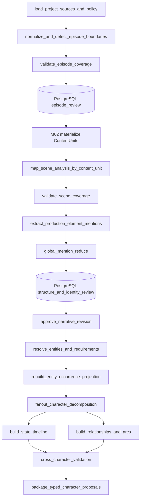

# AI 视频生产平台剧本基础分析与人物拆解详细设计

> 状态：提案 v2，待产品、编剧、制片与研发联合评审
> 日期：2026-08-22
> 上游需求：[M02 项目组合与内容单元](../requirement/002-M02-项目组合与内容单元需求.md)、[M03 导入与叙事理解](../requirement/003-M03-导入与叙事理解需求.md)、[M04 生产知识与一致性图谱](../requirement/004-M04-生产知识与一致性图谱需求.md)
> 系统架构：[000-AI 视频生产平台目标系统架构设计](000-AI视频生产平台目标系统架构设计.md)
> 数据边界：[001-AI 视频生产平台核心领域与数据模型设计](001-AI视频生产平台核心领域与数据模型设计.md)
> 产品边界：[002-AI 视频生产平台目标产品与功能模块设计](002-AI视频生产平台目标产品与功能模块设计.md)
> 实现边界：[003-AI 视频生产平台接口工作流与功能实现设计](003-AI视频生产平台接口工作流与功能实现设计.md)
> 模块 Design：[M02 项目组合与内容单元](./modules/002-M02-项目组合与内容单元详细设计.md)、[M03 导入与叙事理解](./modules/003-M03-导入与叙事理解详细设计.md)、[M04 生产知识与一致性图谱](./modules/004-M04-生产知识与一致性图谱详细设计.md)
> 范围：M02/M03/M04 的整本剧本分析、剧集物化、全剧生产清单与人物拆解专题；模块边界与接口以上述模块 Design 为准

## 1. 设计结论

剧本基础分析与人物拆解应当成为平台第一条智能生产主线，但它不能被实现为“把整份剧本交给一次 LLM 调用，然后直接创建人物资产”。本轮第一步必须交付五个可审阅结果：剧集拆解、每集场景清单、全剧人物清单、全剧生产需求清单，以及人物×剧集的证据化覆盖矩阵。目标实现分为五层：

1. 确定性来源层保留原件、标准化文本、章节/集/场边界和可复核锚点。
2. 剧集拆解层先形成 M03 EpisodeBreakdownRevision；人工确认后由 M02 原子物化稳定 ContentUnit 与 OrderRevision。
3. 语义分析层生成每集场次、节拍、对白和人物/地点/道具/服装等 ProductionElementMention，不直接发布业务事实。
4. 实体与需求层解决同名不同人、别名同一人、称谓变化和跨集指代，形成 ProductionEntity/未决主体、不可变 ProductionRequirementRevision 及可重建 inventory/readiness/occurrence。
5. 人工决议层逐项接受、修改、合并、拆分、关联、暂缓或标记不需要；批准后才形成 NarrativeRevision 和 M04 current 事实。

当前技术路径继续使用 Python。FastAPI 负责命令、查询和短事务；PostgreSQL 保存业务事实、提案和决议证据；Outbox 与 RabbitMQ 承载可靠异步任务。切片 A 关闭 Agent/LangGraph 时仍可通过确定性解析和人工命令完成全部五项输出；切片 B 才由独立 Agent Worker 运行 LangGraph 分析图。LangGraph checkpoint 只恢复一次 AnalysisRun，不成为人物资料或审批状态源。

基础分析必须先于人物拆解，人物解析必须先于分镜提案。首期权威顺序为：

```text
SourceRevision
  → ParseReport / SourceAnchor
  → EpisodeBreakdownRevision 校对与批准
  → M02 ContentUnit / OrderRevision 原子物化
  → NarrativeRevision(draft) / Scene / Beat / Dialogue
  → 全剧 ProductionElementMention Reduce 与结构校对
  → NarrativeRevision 批准
  → M04 实体消歧 / ProductionRequirementRevision 决议
  → Inventory / Readiness / EntityOccurrenceProjection
  → 全剧清单 / 正式与未决人物×剧集矩阵
  → 人物资料、状态、关系与弧线发布
  → 分镜与生成规划
```

这是一条跨模块用例，不新增 M16、独立知识微服务或第四套“剧本分析结果”业务事实。应用层可以提供统一工作台和批准预检，但权威对象仍分别归 M02、M03、M04。

## 2. 问题定义

“识别出人物姓名”不是人物拆解完成。生产系统必须回答以下问题：

- 整本剧本应该拆成多少集，每一集覆盖哪段原文，缺标题或标题冲突如何校对？
- 每一集有哪些 NarrativeScene，它们分别发生在哪里、什么时间、涉及哪些人物与生产元素？
- 全剧需要准备哪些人物、地点、道具、服装、妆造、载具、声音、风格或 VFX，哪些只是被提及而不需要生产？
- 每个人物出现在哪些集、哪些场，以何种方式出现，结果是否完整且能回到原文？
- 原文中的“林夏”“小夏”“她”和“队长”是否是同一个人？
- 两个都叫“王总”的提及是否属于不同人物？
- 某项人物信息是原文明示、可靠推断、模型猜测，还是用户补充？
- 人物的长期身份特征和某一场临时状态如何分开？
- 服装、伤痕、持有物、情绪、知识和阵营从何时开始生效？
- 人物关系是单向还是双向，在什么场次发生变化？
- 人物目标、阻力和转折如何关联到具体场次与节拍？
- 修改剧本或合并人物后，哪些分镜、提示、参考和候选需要复核？

如果这些问题没有显式模型，后续的参考绑定、提示编译、跨镜头一致性和局部重做都会依赖不可验证的自由文本。

## 3. 范围与非目标

### 3.1 本设计范围

- 剧本、小说改编稿、故事梗概和结构化脚本的文本基础分析。
- 集、场次、节拍、动作、对白和旁白识别。
- 整本/整季来源的剧集边界提案、split/merge/reorder/rename、覆盖校验与 M02 ContentUnit 物化。
- 人物提及、别名、称谓、代词和说话人的解析。
- 地点、道具、服装、妆造、载具、声音、风格、品牌和 VFX 等 ProductionElementMention 与生产需求决议。
- 每集场景清单、全剧生产清单和人物×剧集 occurrence 矩阵。
- 人物身份建立、合并、拆分、关联已有身份和暂缓决议。
- 人物资料、人物目标、动机、性格、能力、秘密、说话方式和人物弧线。
- 人物状态时间线，包括服装、妆造、伤痕、情绪、持有物、位置、知识和阵营。
- 人物关系及其方向、强度、状态和生效范围。
- 来源证据、置信度、冲突、缺口和人工校对。
- 新来源版本的差异迁移和下游影响分析。

### 3.2 非目标

- 自动改写原稿或替用户做最终编剧决定。
- 在人物尚未消歧前直接生成正式分镜。
- 在接受人物提案时自动生成形象、声音、LoRA 或视频。
- 用一张自由文本“人物卡”替代结构化事实、状态和关系。
- 将商业订阅、计费、投放或发行纳入分析模块。
- 首期建设通用知识图谱平台、图数据库或独立微服务。
- 把 ProductionRequirementItem 当作已生成媒体，或在剧本分析阶段直接创建图片、声音、LoRA 或视频。

## 4. 术语与对象边界

| 术语 | 定义 | 不是 |
| --- | --- | --- |
| SourceRevision | 不可变的原始来源版本 | AI 清洗后的可覆盖文本 |
| SourceAnchor | 来源页码、段落和字符范围组成的证据位置 | 只在日志中出现的 offset |
| EpisodeBreakdownRevision | M03 中整本来源的可版本化剧集拆解草稿 | M02 的稳定 ContentUnit |
| EpisodeCandidate | 拆集审核期的临时 key、标题、顺序和来源边界 | 可供下游长期引用的剧集 ID |
| EpisodeBreakdownManifest | approved 不可变拆集清单和覆盖哈希 | 已创建的 ContentUnit 集合 |
| ContentUnitMaterialization | M02 将 Manifest 原子映射为稳定 ContentUnit/OrderRevision 的私有过程 | M03 改写项目层级 |
| NarrativeRevision | 一次经过校对的完整叙事结构 | 单个模型响应 |
| NarrativeScene | 某个 NarrativeRevision 内的场次 | 跨版本稳定人物身份 |
| Beat | 场次内一个最小叙事变化单元 | 自动等同一个镜头 |
| ProductionElementMention | 原文中一次人物、地点、道具、服装等出现或指代；CharacterMention 是其中一种 | 已经确认的实体或生产需求 |
| EntityCluster | AnalysisRun 内若干可能属于同一人物的提及集合 | 可供下游长期引用的业务对象 |
| ProductionEntity | 项目内稳定人物身份 | 一张立绘或一个提示词 |
| UnresolvedSubjectRevision | M04 中绑定 approved NarrativeRevision、由不可变 Mention 成员集合定义的未决人物/地点/道具等主体 | ProductionEntity、短期 M03 EntityCluster 或投影内哈希 |
| ProductionRequirementItem / Revision | 某实体、未决主体或叙事范围在生产上要准备的用途、变体、数量、证据和不可变决议 | ProductionEntity、MediaArtifact、readiness 或“出现过”本身 |
| ProductionCoverageSchemaRevision | 固定 coverage universe 的 Mention/Scene 纳入规则、生产类型与校验规则的不可变项目修订 | 隐含在代码里的“当前类型 Schema”或可变配置 |
| ProductionCoverageDecision | 对 coverage universe 某个 Mention/Scene 的 relevance、处理结果与 RequirementRevision refs 的不可变人工决定 | InventoryItem 或模型判断 |
| RequirementReadinessProjection | 基于需求修订、参考绑定与媒体可用性重建的准备度 | 可被媒体变化改写的需求决议字段 |
| ProductionRequirementInventoryProjection | 绑定叙事/消歧基线、覆盖集合和完整度的全剧生产清单 | 若干无基线需求项或“零项即完整” |
| EntityOccurrenceProjection | 正式实体或 revision-bound 未决聚类与 ContentUnit/Scene/Mention 的双向可重建索引 | 人物 Profile 中手工维护的集数字符串 |
| CharacterProfileRevision | 相对稳定的人物叙事资料版本 | 某场临时服装和情绪 |
| EntityStateRevision | 在明确范围内生效的人物状态 | 新人物身份 |
| EntityRelationRevision | 两个人物之间带方向和范围的关系版本 | `relationships: string[]` |
| CharacterArcRevision | 基于某个叙事版本的人物弧线解释 | 无证据的剧情预测 |
| ReferenceBinding | 身份、服装、声音等生产参考的绑定 | 人物叙事事实本身 |

必须区分“原文提到了什么”“这个对象是谁”“生产上需要准备什么”“实际准备了什么媒体”。同时必须区分“这个人长期是什么样”和“这个人在当前场次处于什么状态”。Mention、身份、需求、资料、状态和视觉/声音参考不能合并成一个可随意覆盖的 JSON 对象。

## 5. 用户与权限

| 能力 | 典型使用者 | 权限要求 |
| --- | --- | --- |
| 启动基础分析 | 编剧、制片人、内容编辑 | 来源可读、内容写入、模型外发策略允许 |
| 校对场次和节拍 | 编剧、内容编辑 | Narrative 草稿写入 |
| 合并或拆分人物 | 编剧、制片人 | 人物身份写入；必须查看影响预览 |
| 发布人物资料 | 制片人、人物设定负责人 | ProductionEntity 发布权限 |
| 发布形象和声音参考 | 美术、声音负责人 | 对应生产资料写入与授权检查 |
| 批准整版叙事 | 制片人或组织指定批准者 | 内容批准权限 |
| 查看来源证据 | 项目成员、审阅者 | 来源与项目读取权限 |

模型、Agent Worker 和解析 Worker 没有批准权限。它们只能写 AnalysisRun 结果区，不能直接更新 current NarrativeRevision、ProductionEntity current 指针或已批准状态。

## 6. 输入与输出契约

### 6.1 AnalysisRun 输入

| 字段 | 说明 |
| --- | --- |
| `project_id` | 整本分析的稳定项目范围；启动时必需 |
| `source_manifest` | 一个或多个按顺序排列的 SourceRevision 引用及内容哈希；首期允许一个整本文件，不新建 ScriptPackage 聚合 |
| `content_unit_id` | 可选；仅用于已拆分单集的局部分析，整本首次拆集时必须为空 |
| `analysis_profile` | 如 `screenplay_zh_v1`、`novel_adaptation_zh_v1` |
| `scope` | `whole_script`、指定 ContentUnit、指定场次或变更范围 |
| `baseline_narrative_revision_id` | 可选；用于增量分析和差异迁移 |
| `production_entity_catalog_revision` | 启动时可见的人物、地点、道具等全类型 ProductionEntity 目录快照 |
| `analyzer_contract_version` | 输出契约版本 |
| `policy_revision_id` | 模型外发、保留、内容安全和地域策略 |
| `idempotency_key` | 同输入同配置重复提交返回同一活动 Operation |

分析输入只传对象引用和小型配置。大型正文通过受控读取端口加载，不进入 RabbitMQ 消息正文或 LangGraph 事件历史。

### 6.2 AnalysisRun 输出

- AnalysisReport：覆盖率、失败页/段、冲突、歧义和质量摘要。
- EpisodeBreakdownRevision/Manifest：候选临时 key、标题、顺序、来源边界、证据、覆盖和决议；approved Manifest 供 M02 物化。
- NarrativeDraft：Scene、Beat、DialogueLine、Action 和 SourceAnchor。
- GlobalOccurrenceIndex：每集 Scene 与全部 ProductionElementMention 的集/场/Anchor/状态索引，并显式返回完整度和失败范围。
- ApprovedNarrativeAnalysisView：approved/current Narrative 的 source/breakdown/mapping/order/narrative refs/hash、completeness、failed scopes、scenes/global-occurrences query refs 和 basis hash；分页结果必须回显相同 basis hash。
- EntityClusterProposalSet：Mention、Cluster、候选身份、支持/反证和待决冲突；不是 M04 正式 Resolution。
- ProposalDecisionSet：用户对拆解、结构、Mention 和 Cluster 的逐项决议及修改证据。

### 6.3 M04 后续知识输出

- UnresolvedSubjectRevisionSet：只引用 approved Mention，保存 M04 未决主体 revision、不可变成员集合、split/merge lineage 和 current set hash；M03 Cluster 只可作为创建建议。
- MentionResolutionSet：只引用 approved NarrativeRevision 的 Mention，记录 M04 create/link/merge/split/defer/explicit reject 决议；每个 approved character Mention 恰有一个 current 结果，create/link 生效项带正式实体 ID，defer 引用一个 active UnresolvedSubjectRevision。
- ProductionRequirementSet：character identity、costume、makeup、location、prop、vehicle、voice、style、VFX 等不可变需求修订，包含 purpose、variant、scope、quantity、evidence 与 decision，但不内嵌 readiness。
- ProductionCoverageSchemaRevision：项目创建时具备默认 published revision；固定 Mention/Scene inclusion、需求类型和校验规则，发布后不可变，换版使旧 Inventory stale。
- ProductionCoverageDecisionSet：对每个 coverage subject 保存 relevance、`required | deferred | not_required | rejected` 结果、RequirementRevision refs、actor/reason 和版本。
- ProductionRequirementInventoryProjection：绑定 narrative view basis、UnresolvedSubject/MentionResolution、CoverageSchema/CoverageDecision、Requirement revision set 的完整基线，返回 `building | current | incomplete | stale | failed`、completeness、failed scopes、assessed/unassessed coverage subject 数、as_of、input hash 和分页 coverage rows；每行包含 subject/decision、零到多个 Requirement refs/readiness summaries，缺 Decision 时 nullable ref + unassessed reason。
- RequirementReadinessProjection：绑定 requirement revision 与 Reference/Media revision set，返回 `unknown | missing | partial | ready | blocked | not_applicable`、reasons、as_of 和 input hash；not_required/rejected 只产生 `not_applicable`，不检查媒体。
- CharacterEpisodeCoverage：人物×ContentUnit 矩阵，行主体为 `entity | unresolved_cluster`；envelope 含 narrative view/order/unresolved-subject/resolution 基线、projection version/status/completeness/failed scopes、resolved/unresolved/rejected/unassigned/overlap mention 数、as_of/input hash，单元格含 participation kind、Scene/Dialogue/Mention 数、首末 Anchor、resolved/unresolved/conflict/confirmed_absent/not_analyzed。
- CharacterProposalSet：资料、状态、关系、弧线和连续性提案。
- ImpactPreview：接受某项决议将新增、合并、替代或使哪些下游内容过期。

输出中的 `null` 表示未知；空数组表示已检查但没有项目；字段缺失表示该契约版本不提供。三种含义不得混用。

## 7. 基础分析功能设计

### 7.1 来源标准化

系统先完成确定性处理：

1. 校验原件哈希、媒体类型和安全扫描结果。
2. 提取文本并保留页码、段落、表格单元或原始字符位置。
3. 统一换行和 Unicode 规范，但保留原始文本到规范文本的双向映射。
4. 识别集标题、场次标题、角色台词前缀和显式格式标记。
5. 记录无法解析、被截断、OCR 低可信或格式不明的范围。

标准化文本不能替换 SourceRevision。任何 Scene、Beat、Mention 和人物事实都必须能回到 SourceAnchor。

### 7.2 剧集拆解与 ContentUnit 物化

整本来源首先形成 EpisodeBreakdownRevision。每个 EpisodeCandidate 至少包含：`temporary_key`、建议 ordinal/title、起止 SourceAnchor、boundary rule/version、segmentation hash、confidence、decision status 和 coverage summary。自动建议只允许来自签认结构化 episode 标识、明确“第 N 集/EPISODE N”标题或签认文件分段元数据；无标题、重复集号、冲突标题和跨文件续集必须进入人工校对，不能按长度平均切分后自动发布。

拆集不变量：

1. 全部非空来源连续且恰好归属一个 EpisodeCandidate，或带具名忽略原因；不得重叠或静默缺口。
2. 前言、片头、片尾和附注必须显式归属或忽略；NarrativeScene 不跨 EpisodeCandidate。
3. `split`、`merge`、`move_boundary`、`rename`、`reorder` 每次创建新 EpisodeBreakdownRevision，保留旧版和决议审计。
4. approved Manifest 只含临时 key、顺序、标题、边界锚点引用和哈希；M02 原子物化后返回 temporary key→stable ContentUnit ID mapping 及 OrderRevision。
5. 改名/重排不换 ContentUnit ID；已物化后的拆分/合并必须预览保留/新建/归档身份与下游影响，不能按显示集数静默重绑。

### 7.3 场次拆解

每个 NarrativeScene 至少包含：

| 维度 | 必需性 | 说明 |
| --- | --- | --- |
| 场次序号 | 必需 | 仅在当前 NarrativeRevision 内排序 |
| 内外景 | 可选 | `interior`、`exterior`、`mixed`、`unknown` |
| 地点提示 | 必需 | 原文地点；不自动等同 ProductionEntity |
| 时间提示 | 可选 | 白天、夜晚、清晨、连续、闪回等 |
| 摘要 | 必需 | 只总结当前场次已有内容 |
| 戏剧目的 | 可选 | 信息揭示、冲突升级、转折、过渡等 |
| 场次目标 | 可选 | 本场需要达成的叙事目标 |
| 核心冲突 | 可选 | 人物、环境或信息冲突 |
| 转折与结果 | 可选 | 场次前后状态变化 |
| 参与提及 | 必需 | 指向 CharacterMention，不直接保存姓名数组 |
| 道具/地点提及 | 可选 | 指向对应 Mention |
| 来源锚点 | 必需 | 可包含多个连续或非连续锚点 |
| 剧集归属 | 必需 | 审核期指向 EpisodeCandidate，物化后指向 stable ContentUnit；不得只存显示集数 |

场次边界不确定时生成边界冲突提案，不能将两个可疑场次静默拼接。

### 7.4 节拍拆解

Beat 是叙事变化而非镜头。建议类型包括：

- `setup`：建立人物、地点或初始条件。
- `goal`：人物表达或采取目标。
- `action`：产生可观察动作。
- `reaction`：人物对信息或动作作出反应。
- `conflict`：阻力或对抗升级。
- `reveal`：新信息被揭示。
- `decision`：人物作出会影响后续的决定。
- `turn`：场次方向发生变化。
- `transition`：时间、地点或叙事焦点转换。

每个 Beat 可记录主体、目标、阻力、情绪前后、状态变化、涉及道具和来源锚点。一个 Beat 可以被多个镜头覆盖，一个镜头也可覆盖多个相邻 Beat；两者不能提前一对一绑定。

### 7.5 对白与动作

DialogueLine 需要保留：

- 原文、对白类型、说话人 Mention 和可选受话人 Mention。
- 所属 Scene/Beat、说话前后动作、表演提示和原文格式。
- 情绪和潜台词提案；没有直接证据时必须标记为推断。
- 无法确认说话人时的 `unresolved` 状态。

动作行不能只保存整行文本。与人物状态、持有物变化或关系变化相关的动作应形成带证据的 AttributeFact 提案，但不自动发布。

### 7.6 结构完整性检查

- 全部非空来源内容必须被 Scene/Beat/Dialogue/Action 覆盖或明确标记忽略原因。
- 每条 DialogueLine 必须属于一个 Scene，并有说话人、旁白类型或未决原因。
- Scene 和 Beat 的来源范围不能非法交叉。
- 章节/集标记与内容单元归属冲突时阻止整版批准。
- 缺失场次标题、超长场次、空场、未闭合对白和时间跳跃生成可定位问题。

## 8. 生产元素提及、人物聚类与消歧

### 8.1 ProductionElementMention

人物、地点、道具、服装、妆造、载具、动物/群体、品牌、声音、风格和 VFX 等每一次来源提及都保存为独立 ProductionElementMention。通用字段包括 `element_type`、`surface_text`、EpisodeCandidate/ContentUnit、Scene/Beat、SourceAnchor、语法/剧情作用、提取状态和完整度；人物提及再扩展说话人、动作主体、代词和身份消歧字段。

Mention 只回答“原文提到了什么”。M04 决议后才能回答“它是谁/是什么”和“生产上是否需要准备”。同一地点实体可对应多场 NarrativeScene；同一人物 `mentioned_only` occurrence 也不自动产生形象生产需求。

### 8.2 CharacterMention

每一次人物出现都创建独立 Mention，字段至少包括：

- `surface_text`：原文，如“林夏”“小夏”“她”“队长”。
- `mention_type`：姓名、别名、称谓、代词、群体、隐含说话人。
- `scene_id`、`beat_id`、可选 `dialogue_line_id`。
- `source_anchor_ids`：一个或多个来源证据。
- `grammatical_role`：说话人、动作主体、动作客体、被提及对象等。
- `resolution_status`：未解析、自动建议、已人工确认、冲突。
- `resolved_entity_id`：批准后才存在。

Mention 是来源事实，ProductionEntity 是业务身份。删除或合并人物身份不能删除原始 Mention。

### 8.3 聚类候选

模型和确定性规则可综合以下证据生成 EntityCluster：

- 规范化姓名和别名，但不能只按名字。
- 同一场次的说话顺序、称谓和代词上下文。
- 人物自称、他称、职业、阵营和关系描述。
- 与同场其他人物同时出现是否造成身份冲突。
- 跨场连续的状态、持有物和事件因果。
- 项目中已有 ProductionEntity 的别名和已批准 Mention。

每个聚类建议都必须给出支持证据和反证。系统不得仅因为规范化名称相同就自动合并人物。

### 8.4 人工决议

| 决议 | 结果 |
| --- | --- |
| `create_new` | 仅记录“建议新建实体”的候选决议，不在 M03 创建或保存目标实体；NarrativeRevision 批准后，用户须在 M04 显式确认并执行创建/绑定命令 |
| `link_existing` | 仅记录“建议关联已有实体”的候选决议，不在 M03 保存 `target_entity_id`；用户须在 M04 针对 approved Mention 重新选择并确认目标实体 |
| `merge_clusters` | 合并两个分析期 Cluster，保留各自 Mention 和决议证据 |
| `split_cluster` | 按 Mention 集合拆分；未分配 Mention 保持待处理 |
| `move_mentions` | 将指定 Mention 移到另一个 Cluster |
| `defer` | 暂不确定；相关下游场次显示阻塞或警告 |
| `reject_non_character` | 标记为非人物、群体或解析错误 |

M03 分析期的 Cluster 拆分/合并只预览 Mention 成员和叙事提案差异；M04 对未决主体或正式实体执行拆分、合并、创建、关联前，必须预览受影响的资料、关系、状态和下游引用。名称修改只创建 NameRevision，不改变 ProductionEntity ID。

M03 在 NarrativeRevision 批准前只保存不含 `target_entity_id` 的 Cluster/Mention 候选决议；M04 可以显示草稿预览，但只有批准叙事中的 Mention，且用户在 M04 显式选择/确认目标后，才能创建或发布正式 MentionResolution、ProductionEntity 和 ProductionRequirementItem。

### 8.5 生产需求与 occurrence

ProductionRequirementItem 是稳定需求身份；每个 ProductionRequirementRevision 至少保存类型、目标实体/未决主体/叙事范围、`purpose`、`variant`、数量/单位、EffectiveScope、SourceAnchor 和 `required | deferred | not_required | rejected` 决议，decided 后不可变。`on_screen`、`dialogue_speaker`、`off_screen_voice` 等可以按已签认规则生成待决需求提案，但不能直接判为 required；`mentioned_only` 默认不产生形象需求。RequirementReadinessProjection 独立保存 `unknown | missing | partial | ready | blocked | not_applicable`、reasons、as_of 和输入哈希；required 依据 Reference/Media 计算，deferred 为 blocked/decision_deferred，not_required/rejected 为 not_applicable 且不检查媒体。ReferenceBinding 或 MediaArtifact 变化只重建相关投影，不能修改需求修订。创建或接受需求不会直接创建 M09 MediaArtifact。

ProductionCoverageDecision 是 coverage 的权威事实。coverage universe 至少包含全部 approved ProductionElementMention，以及投影绑定的不可变 ProductionCoverageSchemaRevision 要求地点/布景判断的全部 approved NarrativeScene；每个成员必须有不可变 CoverageDecision，显式保存 production relevance、`required | deferred | not_required | rejected` 结果和零个或多个 RequirementRevision refs。`CreateProductionRequirement` 可在同一 M04 事务内创建 stable Item、decided Revision 和 CoverageDecision，也可随后用 `LinkCoverageSubjectToRequirement` 关联聚合需求。缺决定或引用不完整都计入 `unassessed`；对应 Inventory row 的 `coverage_decision_id` 可以为空，但必须保存具名 `unassessed_reason`。ProductionRequirementInventoryProjection 只从绑定 Schema 与这些权威事实重建；只有分析 completeness=complete、failed scopes 为空且 unassessed=0 时才能成为 `current` 并通过正式下游批准预检。Schema 换版使旧 current stale，历史投影始终按原 revision/hash 可重复重建。

UnresolvedSubjectRevision 是未决分组的 M04 权威事实：绑定 approved NarrativeRevision，成员为不可变 Mention ID 集合；split/merge 创建新 revision 和 lineage，旧版可读。MentionResolution 的 defer/group 动作引用该 revision，create/link 动作引用 ProductionEntity，explicit reject 保存具名理由且不产生人物行。每个 approved character Mention 必须恰有一个 current 结果；同一 Mention 不得属于多个 active 未决主体，Resolution 的未决引用必须与成员集一致。缺失、重叠或不一致均计入 resolution coverage 缺口，使新 EntityOccurrenceProjection 为 `incomplete`、显示 unassigned/overlap 数并阻止预检，不能静默从人物清单/矩阵消失。EntityOccurrenceProjection 从 approved NarrativeRevision 的 Scene→ContentUnit、ProductionElementMention、UnresolvedSubjectRevision 和 MentionResolution 重建。矩阵行严格使用 `subject_type=entity | unresolved_cluster` 与 `subject_ref`；存储上 `entity_id`、`unresolved_subject_revision_id` 二选一，不依赖短期 M03 EntityCluster。人物参与类型至少包括 `on_screen`、`dialogue_speaker`、`off_screen_voice`、`action_subject`、`mentioned_only` 和 `unresolved`。矩阵 envelope 返回完整基线、status/completeness/failed scopes、resolution coverage counters 与 as_of/input hash；单元格返回 Scene/Dialogue/Mention 数、首末 Anchor 及 `resolved | unresolved | conflict | confirmed_absent | not_analyzed`。只有该集分析 complete 且没有已决/未决 Mention 时才可计算 confirmed_absent，空值不得同时表示“没有出现”和“尚未分析”。

## 9. 人物详细拆解

### 9.1 人物身份

身份层只保存跨叙事版本需要稳定引用的内容：

- 规范名称、别名、称谓和项目内唯一策略。
- 人物类别：个人、群体、匿名角色、待揭示身份。
- 首次出现和最后出现的 Narrative 证据。
- 身份公开状态：草稿、已发布、已归档。

“蒙面人”和“林夏”在剧情揭示前可以是两个身份候选；揭示后通过合并决议建立同一身份，并保留历史上当时未知的叙事视角。

### 9.2 人物资料 CharacterProfileRevision

| 分组 | 字段示例 | 规则 |
| --- | --- | --- |
| 叙事职能 | 主角、对手、盟友、导师、触发者 | 分类必须带证据，可多选并带范围 |
| 外在目标 | 想要获得、阻止或完成的事情 | 可随篇章变化，不覆盖历史 |
| 内在需要 | 人物真正需要完成的认知或情感变化 | 推断必须标记 assertion level |
| 动机与代价 | 为什么行动、失败会失去什么 | 分别保存，不拼成一句提示词 |
| 性格与价值观 | 稳定倾向、原则、禁区 | 每项独立事实和证据 |
| 能力与限制 | 技能、资源、身体或规则限制 | 不能把模型常识当作原文事实 |
| 背景与秘密 | 已知历史、对谁可见 | 支持信息可见性和揭示时间 |
| 语言特征 | 口头禅、语速、词汇、礼貌层级 | 与 Voice Reference 分离 |
| 外观身份特征 | 原文明确的稳定外观 | 生产形象另建 ReferenceBinding |

资料不是强制填满的表格。首期完成标准是：所有必需字段要么有带证据的值，要么明确为 `unknown`，不能用模型猜测填空制造虚假完整度。

### 9.3 人物状态 EntityStateRevision

人物状态按 facet 分开版本化：

| facet | 示例 | 常见冲突 |
| --- | --- | --- |
| `appearance` | 年龄感、发型、明显伤痕 | 稳定特征被临时状态覆盖 |
| `costume` | 校服、黑色外套、战斗服 | 同范围出现互斥服装 |
| `makeup` | 妆容、血迹、污渍 | 清理后仍错误继承 |
| `emotion` | 恐惧、克制、愤怒 | 情绪转折未关联 Beat |
| `injury` | 左臂受伤、失明 | 受伤发生前提前生效 |
| `possession` | 持有钥匙、失去手机 | 同一道具同时被两人独占 |
| `location` | 被关在仓库 | 与 Scene 地点冲突 |
| `knowledge` | 已知道真相 | 信息揭示前提前用于表演或对白 |
| `allegiance` | 属于某阵营、叛变 | 阵营转变缺少转折证据 |
| `life_status` | 存活、失踪、死亡 | 终态被无依据恢复 |

状态发布时必须把自然语言范围解析为不可变成员快照。ContentUnit/Shot 使用稳定 ID；NarrativeScene/Beat 使用“不可变 NarrativeRevision + 修订内成员 ID”。`从第三场开始` 不能永久保存为字符串；场次重排或叙事换版后历史范围不随序号漂移。

### 9.4 人物关系 EntityRelationRevision

关系至少包含：

- `from_entity_id`、`to_entity_id` 和是否对称。
- 类型，如亲属、同事、上下级、盟友、对手、情感、债务、控制、知情。
- 方向、强度、表面状态、真实状态和信息可见性。
- 生效范围、开始原因、结束原因和来源锚点。
- `explicit`、`strong_inference`、`weak_inference` 或 `user_supplied`。

“A 信任 B”不能自动推出“B 信任 A”。关系变化创建新 Revision，不覆盖旧值；互斥关系和循环依赖只在具体关系类型要求时阻止发布。

### 9.5 人物弧线 CharacterArcRevision

人物弧线绑定 NarrativeRevision，并由 ArcBeat 连接具体 Beat：

1. 起始状态：人物最初的目标、信念和限制。
2. 欲望与需要：外在追求和内在变化。
3. 阻力：人物、环境、制度或自身缺陷。
4. 触发事件：迫使人物进入行动的 Beat。
5. 关键选择：改变后续路径的 Decision/Turn Beat。
6. 低谷或代价：目标受阻或付出代价。
7. 高潮选择：决定弧线结果的行为。
8. 结束状态：改变、失败、循环或开放状态。

长篇内容允许篇章级和整季级多个 ArcRevision。弧线摘要不能替代 ArcBeat 证据；没有足够内容时返回“尚未形成可判断弧线”。

## 10. 事实、推断与证据

### 10.1 四类信息层

| 层 | 示例 | 是否可直接被下游使用 |
| --- | --- | --- |
| SourceObservation | “林夏把钥匙交给陈默” | 可作为证据，不等于已批准状态 |
| AnalysisProposal | “钥匙持有人变为陈默” | 不可，必须决议 |
| ApprovedFact | 用户接受该持有物变化 | 可，由状态范围决定 |
| ProductionDecision | 使用哪张角色图、哪种声音表现 | 可，但不得反写原文事实 |

生成候选只证明“模型生成了什么”，不能反向证明人物设定是什么。

### 10.2 原子事实

人物资料、状态和关系中的关键值保存为 AttributeFact：

```text
subject_entity_id
predicate
value_json + value_schema_version
effective_scope_id
assertion_level
confidence
source_anchor_ids[]
analysis_run_id / proposal_id / decision_id
status = proposed | accepted | rejected | superseded
```

置信度针对单个事实，而不是整张人物卡。每个 accepted AI 事实必须至少有一个有效 SourceAnchor；用户直接补充的事实使用 `user_supplied` 并记录输入者和原因。

### 10.3 冲突分类

- `identity_collision`：同名提及可能属于不同人物。
- `alias_ambiguity`：同一称谓可能指向多个实体。
- `fact_conflict`：相同范围内同一谓词有互斥值。
- `timeline_conflict`：状态发生顺序不可能或缺少起点。
- `relation_conflict`：关系方向、范围或状态不一致。
- `missing_evidence`：结论没有来源锚点。
- `scope_gap`：自然语言范围无法解析成稳定成员。
- `stale_baseline`：分析基线已被新的 NarrativeRevision 替代。

阻塞级冲突必须解决后才能发布相关人物或场次；非阻塞缺口允许保留为 unknown，并在分镜准备度中显示警告。

## 11. 端到端工作流

### 11.1 创建与执行

1. API 在 PostgreSQL 短事务中校验权限、来源状态和外发策略。
2. 创建整本 AnalysisRun、Operation、拆集 Task 和 OutboxEvent；`source_manifest` 只要求 project scope，不要求已有 ContentUnit，提交后返回 `202`。
3. Worker 完成确定性标准化、集标题/边界识别和覆盖报告，各阶段结果先写 M03 分析区，不修改 M02/M04 current。
4. 用户在拆集工作台执行 split/merge/move/rename/reorder/ignore；覆盖与并发校验通过后批准 EpisodeBreakdownManifest。
5. 应用层调用 M02 `Prepare/ApplyContentUnitMaterialization`；M02 原子发布稳定 ContentUnit、OrderRevision 和 mapping，M03 校验 manifest/result hash 后绑定。
6. 切片 A 用确定性解析和 M03 人工命令创建/编辑/删除 Scene、Beat、Dialogue、Action、Narration 与 ProductionElementMention；切片 B 才允许 Agent Worker 按集/完整场次 Map、跨全剧 Reduce，提交同契约 Proposal、EntityCluster、GlobalOccurrenceIndex 和完整度。
7. 用户先修正 Scene/Beat/Dialogue/Action/Narration/Mention，再处理 M03 Cluster Proposal；任一边界或结构变化只使受影响索引/聚类 stale。M03 只决定 Mention 是否进入叙事，不保存正式 target entity。
8. M03 批准不可变 NarrativeRevision。M04 可以在此前显示预览，但只有 approved Mention 才能形成正式 MentionResolution、ProductionEntity 或 ProductionRequirementItem。
9. 项目已有默认 published ProductionCoverageSchemaRevision；用户在 M04 全局实体/需求台建立或修订 UnresolvedSubjectRevision，确保每个 approved character Mention 恰有 create/link/defer/explicit reject 一个 current 结果，再执行 Requirement/Coverage 决议；M04 按固定 Schema 与事实集合重建 EntityOccurrenceProjection、ProductionRequirementInventoryProjection、RequirementReadinessProjection 和人物×剧集矩阵。
10. 阻塞身份、关键生产需求和矩阵基线问题解决后，Agent Worker 可运行人物资料、状态、关系与弧线提案；用户逐项决议并发布 M04 revisions。
11. 统一批准预检重新鉴权并核对 source hash、manifest hash、order revision、NarrativeRevision/view basis、M04 unresolved/resolution、coverage schema/decision、requirement/readiness revision set，以及 occurrence/inventory projection version、完整度、failed scopes 与 coverage counters；成功后通过 Outbox 通知分镜、质量和投影更新。

用户等待不能停在 LangGraph `interrupt` 中。每个 LangGraph Task 在到达人工门禁前结束，产品等待状态只保存在 AnalysisRun/Operation；用户决议后由新的 Outbox 事件启动下一 Task。

### 11.2 LangGraph 分析图



`map_scene_analysis_by_content_unit` 可按集和完整场次并行；`global_mention_reduce` 必须读取全剧 Mention 摘要，不能在每个 Chunk 内独立按名称定案。图中的 PostgreSQL 人工门禁是多个独立 Task 的边界，不是一个持续运行的图节点；M02 物化和 M04 发布通过类型化应用端口完成，不是 LangGraph 直接写表。人物拆解只对已批准 NarrativeRevision 和已解析实体快照执行，分镜提案不属于本图。

### 11.3 分块规则

- 首次拆集前只按可证明 episode boundary/完整场次分块；确认后优先按 stable ContentUnit 和完整场次分块，避免在场次中间截断。
- 单场过长时按 Beat 候选或段落拆分，并保留前后上下文摘要和重叠证据。
- 每个分块输出局部 Mention，不直接输出最终人物身份。
- Reduce 阶段保留每个 Mention 的全部 SourceAnchor，不能只保留第一次出现。
- 同名聚合只形成待确认建议；别名、代词和称谓必须经过全局消歧。
- 所有分页清单携带 source/breakdown/narrative revision、projection version、完整度和 failed scopes；局部零结果不能代表全剧没有对象。

### 11.4 部分失败

单个剧集或场次分析失败不应丢弃其他成功范围：

- AnalysisRun 进入 `partial`，报告失败范围和可重试阶段。
- 成功提案可继续校对，但不可供正式下游使用；整版发布门禁根据失败范围判断。
- GlobalOccurrenceIndex、ProductionRequirementInventoryProjection 和人物矩阵进入 `incomplete`，返回 failed scopes，不得显示 complete 或把失败范围统计成零；未覆盖生产相关 Mention/Scene 计入 unassessed，人物消歧缺失/重叠计入 unassigned/overlap。
- 重试复用已通过且输入哈希未变化的阶段结果。
- 结果不确定时 Operation 进入 `unknown`，先对账 checkpoint/result receipt，不能直接再次产生模型费用。

## 12. 校对与交互设计

### 12.1 分析总览

总览需要显示：

- 来源/剧集覆盖率、候选/已物化剧集数、场次数、Beat 数、各类 ProductionElementMention 数和候选人物数。
- 待解决身份冲突、无说话人对白、状态冲突和无证据事实。
- 人物×剧集矩阵版本、生产需求 required/missing/ready 数、not_analyzed/failed scopes。
- AnalysisRun 各阶段进度、部分失败范围和恢复动作。
- “可批准”“可继续校对（不可供正式下游使用）”“阻塞”三类状态，不用单一百分比分数掩盖问题。

### 12.2 整本拆集工作台

左侧显示规范化原文与集标题高亮，中间显示 EpisodeCandidate 边界，右侧显示 ParseReport、规则/置信、覆盖缺口和物化状态。支持键盘完成 split、merge、move boundary、rename、reorder 和具名忽略。批准前显示 Manifest hash；M02 物化后显示 temporary key→stable ContentUnit ID 与 OrderRevision。无标题、重复集号、重叠或缺口时批准按钮必须展示具体阻塞范围。

### 12.3 结构校对台

界面左侧显示 Scene/Beat 树，中央显示结构化字段，右侧固定显示来源原文和高亮锚点。用户操作是：

- 拆分/合并场次或 Beat。
- 重新分类对白、动作、旁白和标题。
- 修改戏剧目的、目标、冲突、转折和结果。
- 标记某段不进入生产或必须被分镜覆盖。

字符 offset 只用于诊断，不能要求普通用户手工输入起止数字。系统根据选区和结构操作维护 SourceAnchor。

### 12.4 全局生产元素与人物消歧台

清单先按人物、地点、道具、服装、妆造、载具、声音、风格和 VFX 分类，再将人物候选按冲突优先展示：

- 左侧为候选 Cluster 和项目已有角色。
- 中央为按时间排序的 Mention、称谓和说话上下文。
- 右侧为合并支持证据、反证和将受影响的资料/关系。
- 支持框选 Mention 后拆分、拖到已有角色、批量确认无歧义提及。

系统必须允许“暂时不知道”，不能强迫用户在证据不足时错误合并。

### 12.5 人物×剧集矩阵

行为 `ProductionEntity | UnresolvedSubjectRevision`，列为指定 OrderRevision 的 stable ContentUnit。页头与人物清单共享同一个 occurrence envelope：narrative view/order/unresolved-subject/resolution 基线、projection version/status/completeness/failed scopes、resolved/unresolved/rejected/unassigned/overlap 数、as_of/input hash。未决行必须显示未决组 revision、名称、Mention 数和“尚未形成正式实体”，不得因缺少 entity ID 消失；explicit reject 只进入覆盖计数与审计，不伪造人物行。单元格显示 participation kind、Scene/Dialogue/Mention 数、首末 Anchor，以及 `resolved/unresolved/conflict/confirmed_absent/not_analyzed`。点击必须下钻到场次和原文；unassigned/overlap 或成员/Resolution 不一致时投影只能 incomplete；重排只改变列顺序，任何 narrative/order/unresolved-subject/resolution revision 变化均使矩阵标 stale，完成重建后原子切换投影版本。

### 12.6 全剧生产需求清单

按类型、剧集、主体、决议和 readiness 筛选 coverage rows，展示 `Mention/Scene → CoverageDecision → Entity/UnresolvedSubject → 0..N RequirementRevision → Reference/Media` 完整链。页头必须显示 Inventory 的 narrative view、unresolved-subject/resolution、coverage schema/decision、requirement revision set 完整基线、status、completeness、failed scopes、assessed/unassessed、as_of 和 input hash，支持直接筛出未评估 Mention/Scene。缺权威决定的行显示 nullable decision 与具名 unassessed reason；not_required/rejected 即使没有 RequirementRevision 也必须保留在清单中。用户可用手工命令修订 CoverageSchema、创建需求、分类/关联 coverage，并标记 required、deferred、not_required 或 rejected；readiness 由独立投影显示 unknown、missing、partial、ready、blocked、not_applicable。不存在媒体不删除需求，接受需求也不触发媒体生成。

### 12.7 人物圣经

人物详情按以下页签组织：

1. 概览：稳定身份、别名、叙事职能和准备度。
2. 证据：全部 Mention、来源位置和决议历史。
3. 资料：目标、动机、性格、能力、秘密和语言特征。
4. 状态时间线：按 Scene/Beat 展示服装、情绪、伤痕、持有物、知识等变化。
5. 关系：方向化关系图和时间变化。
6. 人物弧线：ArcBeat 与场次/Beat 证据。
7. 生产表现：形象、服装、声音和参考绑定。
8. 影响：被哪些镜头、计划、候选和交付引用。

资料页和生产表现页必须分开，避免修改故事事实时意外替换形象版本。

### 12.8 批准预检

预检页聚合但不拥有各模块事实，必须显示 source manifest hash、EpisodeBreakdown/Manifest hash、ContentUnit mapping 与 OrderRevision、NarrativeRevision/view basis hash、M04 UnresolvedSubject/MentionResolution revision set、ProductionCoverageSchema revision/hash、CoverageDecision/Requirement revision set、ProductionRequirementInventoryProjection version/completeness/failed scopes/unassessed、RequirementReadinessProjection revision set，以及 EntityOccurrenceProjection 的完整基线、version/status/completeness/failed scopes、resolved/unresolved/rejected/unassigned/overlap 数和 as_of/input hash，并列出全部 blocker、warning 和下游影响。Inventory 非 current/complete、unassessed>0、任一 failed scope，或 Occurrence 非 current/complete、unassigned>0、overlap>0、成员/Resolution 不一致，均阻止正式批准。任一引用变化使预检 stale；用户只能回到拥有模块修正，不能在预检页跨表覆盖结果。

## 13. 领域命令与事件

### 13.1 关键命令

| 命令 | 关键输入 | 主要门禁 |
| --- | --- | --- |
| `StartWholeScriptAnalysis` | project、ordered SourceRevision manifest、profile、baseline | 权限、策略、输入 manifest 哈希；首次拆集不要求 ContentUnit |
| `ReviseEpisodeBreakdown` | breakdown revision、split/merge/move/rename/reorder 操作 | 来源唯一覆盖、Scene 不跨集、expected revision |
| `ApproveEpisodeBreakdown` | breakdown revision、coverage report/hash | 无 gap/overlap/冲突；输入未变 |
| `Prepare/ApplyContentUnitMaterialization` | approved Manifest、base OrderRevision、幂等键 | M02 权限、Manifest/hash 未过期、原子可见 |
| `ApplyContentUnitMaterializationResult` | manifest、temporary key→ContentUnit、order/result hash | mapping 完整唯一且与当前 Manifest 匹配 |
| `StartNarrativeAnalysis` | approved Manifest/mapping、profile、baseline | 权限、策略、输入哈希 |
| `ReviseNarrativeStructure` | Scene/Beat 操作和 expected revision | 来源覆盖守恒、基线未变 |
| `Create/Edit/DeleteProductionElementMention` | draft、Scene/Beat/Anchor、类型/属性、expected revision | M03 人工编辑来源提及；不接受 target entity，不写正式 MentionResolution |
| `Create/ReviseUnresolvedSubject`（M04） | approved Narrative、Mention IDs、类型/标签、base revision | 成员非空、同 revision、不可重复；产生不可变 revision/member set，不改 M03 Cluster Proposal |
| `ResolveMention`（M04） | approved Mention IDs、目标实体、active UnresolvedSubjectRevision 或 explicit reject reason | M04 独占正式 create/link/defer/reject；每个 approved character Mention 恰有一个 current；Mention 同源、无并发决议，未决引用与成员集一致 |
| `Split/MergeUnresolvedSubject`（M04） | current UnresolvedSubjectRevision、目标 Mention 分组 | 每个 Mention 只能进入一个结果组；创建新 revision/lineage 并 supersede 旧组 |
| `MergeEntities`（M04） | 来源与目标 ProductionEntity | 显示反证和影响；保留全部 MentionResolution 历史 |
| `CreateProductionRequirement` | coverage subject、entity/unresolved subject、type/purpose/variant/scope/quantity、decision | approved Narrative、证据、expected revision、idempotency key；原子创建 Item/Revision/CoverageDecision，不创建媒体 |
| `DecideProductionRequirement` | requirement/base revision、decision/reason | decided revision 不可改；变化创建新 revision |
| `Create/PublishProductionCoverageSchemaRevision` | project、base schema、Mention/Scene inclusion、requirement type rules、expected current | 项目有默认 published Schema；新 revision 发布后不可变并使旧 Inventory stale；历史仍按原 hash 重建 |
| `DecideProductionCoverage` / `LinkCoverageSubjectToRequirement` | coverage subject、relevance/result、RequirementRevision refs、reason | subject 属于 coverage universe；决定不可变，引用必须同项目/叙事基线 |
| `RebuildEntityOccurrenceProjection` | narrative view/order/unresolved-subject/resolution revision set | 全部输入可读且版本固定；计算 failed scopes 与 resolved/unresolved/rejected/unassigned/overlap counters；缺失/重叠只生成 incomplete，不切换为 current |
| `RebuildProductionRequirementInventory` | narrative view/unresolved-subject/resolution/coverage-schema/coverage-decision/requirement revision set | coverage universe 由 Schema revision/hash 固定；每项恰有一行，有权威 CoverageDecision 或 nullable decision + unassessed reason |
| `RebuildRequirementReadiness` | requirement revision、reference/media revision set | 只更新可重建准备度，不改需求决议 |
| `GetScriptAnalysisApprovalPreflight` | project、source/breakdown/order/narrative/M04 revision refs（含 coverage schema） | 全部引用未过期且 hash 一致；Inventory/Occurrence/Readiness 完整度与 blocker 可解释；resolution 缺失/重叠直接阻止；只读聚合 |
| `ReviseCharacterProfile` | 原子事实与证据 | 值 Schema、证据、版本 |
| `PublishEntityState` | facet、值、effective scope | 范围快照、互斥冲突 |
| `PublishEntityRelation` | from/to/type/scope | 方向、范围和证据 |
| `PublishCharacterArc` | Arc 与 ArcBeat | Narrative 基线和证据完整 |
| `ApproveNarrativeRevision` | draft、expected baseline | 阻塞问题清零、权限 |

### 13.2 关键事件

| 事件 | 下游用途 |
| --- | --- |
| `narrative.episode_breakdown.approved.v1` | 请求 M02 准备 ContentUnit 物化；不携带正文 |
| `project.content_units.materialized.v1` | M03 保存 temporary key→stable ID mapping 并启动结构分析 |
| `narrative.analysis.completed.v1` | 通知校对投影，不自动批准 |
| `narrative.revision.approved.v1` | 允许分镜提案并刷新依赖投影 |
| `character.mentions.resolved.v1` | 刷新人物圣经和场次参与者 |
| `knowledge.unresolved_subject.revised.v1` | 使旧人物矩阵/清单 stale，并按权威成员集重建 |
| `knowledge.production_requirement.decided.v1` | 刷新全剧生产清单/readiness，不自动生成媒体 |
| `knowledge.production_coverage.decided.v1` | 刷新 Inventory 覆盖与 unassessed，不创建媒体 |
| `knowledge.production_requirement_inventory.rebuilt.v1` | 发布清单基线、完整度、failed scopes 与 unassessed 数 |
| `knowledge.requirement_readiness.rebuilt.v1` | 发布需求准备度投影；不改写需求决议 |
| `knowledge.entity_occurrence.rebuilt.v1` | 发布人物×剧集矩阵投影版本和完整度 |
| `entity.profile.published.v1` | 更新人物查询与提示编译输入 |
| `entity.state.published.v1` | 计算影响、使相关预检过期 |
| `entity.relation.published.v1` | 更新关系图和连续性规则 |
| `character.arc.published.v1` | 更新叙事质量与分镜意图建议 |

事件只携带 ID、版本、变更摘要和 trace 信息；来源正文、人物秘密、完整提示和媒体不进入消息载荷。

## 14. 数据模型细化

### 14.1 M03 分析事实和提案

| 表 | 关键字段 | 约束 |
| --- | --- | --- |
| `nar_analysis_run` | project_id、source_manifest_hash、baseline_revision_id、profile、contract_version、status、operation_id、input_hash | 同输入与配置活动 Run 唯一；整本首次分析不要求 content_unit_id |
| `nar_analysis_input` | run_id、source_revision_id、ordinal、content_hash | 同 Run ordinal/source 唯一；引用不可变来源，不复制正文 |
| `nar_analysis_stage` | run_id、stage_code、input_hash、status、result_ref、attempt_count | 阶段结果可幂等复用 |
| `nar_episode_breakdown_revision` | run_id、based_on_id、status、rule_version、segmentation_hash、coverage_hash | approved 后不可变，同一 Run current 指针 CAS |
| `nar_episode_candidate` | breakdown_revision_id、temporary_key、ordinal、title、anchor_start/end、rule_code、confidence、decision | 同 revision temporary key/ordinal 唯一；范围不重叠且覆盖守恒 |
| `nar_episode_manifest` | breakdown_revision_id、manifest_hash、approved_by/at | 只由 approved revision 生成；内容不可变 |
| `nar_episode_content_unit_mapping` | manifest_id、materialization_result_hash、order_revision_id、temporary_key、content_unit_id | key/ContentUnit 双向唯一；只接受 M02 完整结果 |
| `nar_narrative_revision` | run_id、breakdown_revision_id、mapping_id、based_on_id、status、content_hash | `draft/proposed/approved/current` 显式；approved 后内容不可变，下游查询只开放 approved/current |
| `nar_scene` | narrative_revision_id、content_unit_id、ordinal、purpose、goal、conflict、turn、outcome | 同修订/content unit ordinal 唯一；不得跨集 |
| `nar_beat` | scene_id、ordinal、kind、goal、conflict、emotion_before/after | 必须属于同修订 Scene |
| `nar_dialogue_line` | beat_id、speaker_mention_id、addressee_mention_id、kind、text | speaker 可 unresolved，但必须有状态 |
| `nar_source_anchor` | source_revision_id、page/paragraph、start/end、exact_hash | 范围合法且能重读验证 |
| `nar_production_element_mention` | narrative_revision_id、content_unit/scene/beat/dialogue_id、surface_text、element_type、participation_kind、anchor_ids、status | Mention 不因实体合并删除；正式 M04 只读取 approved/current 修订 |
| `nar_entity_cluster` | run_id、cluster_key、suggested_name、status、evidence_summary | 只属于 AnalysisRun，不供下游长期引用 |
| `nar_cluster_member` | cluster_id、mention_id、score、reasons | 同 Run 的 Mention 只能有一个活动归属 |
| `nar_proposal_decision` | proposal/mention/cluster、action、edited_payload、actor_id/reason | 只决定 M03 提案/来源 Mention 是否进入叙事；不得保存 target_entity_id；追加且幂等 |
| `nar_analysis_proposal` | run_id、kind、payload_ref、confidence、assertion_level、status | 大型结果走 payload_ref |
| `nar_proposal_evidence` | proposal_id、anchor_id、support_kind | 同提案证据去重 |

### 14.2 M04 人物知识

| 表 | 关键字段 | 约束 |
| --- | --- | --- |
| `pk_entity` | project_id、type、canonical_name、status | 稳定身份；项目内名称策略可配置 |
| `pk_entity_name_revision` | entity_id、canonical_name、aliases、reason | 只追加，重命名不改 ID |
| `pk_unresolved_subject_revision` | project_id、narrative_revision_id、based_on_id、element_type、label、status、member_set_hash、actor/reason | 创建即不可变；split/merge 建新 revision；M03 Cluster 仅可作为 proposal ref |
| `pk_unresolved_subject_member` | unresolved_subject_revision_id、mention_id、ordinal | Mention 必须来自绑定 approved NarrativeRevision；同 revision/member 唯一；成员集合非空；同一 Mention 不得同时属于多个 active 未决主体 |
| `pk_mention_resolution` | mention_id、narrative_revision_id、action、nullable entity_id、nullable unresolved_subject_revision_id、status、actor/reason | 每个 approved character Mention 恰有一个 current；entity/unresolved subject 严格二选一（explicit reject 可均空）；未决引用与 active member 集一致；决议追加且幂等，不改 M03 Mention |
| `pk_production_requirement_item` | project_id、stable_key、status | 稳定需求身份；不保存媒体或准备度 |
| `pk_production_requirement_revision` | item_id、subject_type/ref、type、purpose、variant、scope_id、quantity/unit、evidence_refs、decision、status | decided 后不可变；不含 readiness；发布需求不创建媒体 |
| `pk_production_coverage_schema_revision` | project_id、based_on_id、schema_version、mention_inclusion_rules、scene_inclusion_rules、requirement_type_rules、status、content_hash | 项目 current 唯一；默认 published revision 随项目建立；published 后不可变；历史 Inventory 保存原 revision/hash |
| `pk_production_coverage_decision` | narrative_revision_id、coverage_subject_type/ref、production_relevance、result、requirement_revision_ids、status、actor/reason | 创建即不可变；current 由新 decision supersede；result/refs 按 Schema 校验；Inventory 只读此事实 |
| `pk_requirement_readiness_projection` | requirement_revision_id、nullable reference_revision_set_hash、status、readiness、reasons、as_of、input_hash | required 从 Reference/Media 重建；deferred=blocked/decision_deferred；not_required/rejected=not_applicable；基线变化标 stale，原子切换 |
| `pk_production_requirement_inventory_projection` | project_id、narrative_revision_id、narrative_view_basis_hash、unresolved_subject_set_hash、resolution_set_hash、coverage_schema_revision_id、coverage_schema_hash、coverage_decision_set_hash、requirement_revision_set_hash、status、completeness、failed_scopes、assessed_subjects、unassessed_subjects、as_of、input_hash | 一个投影版本只接受一套完整基线组合；Schema 换版使旧 current stale；current 要求 complete、failed_scopes 为空、unassessed=0；可丢弃重建 |
| `pk_production_requirement_inventory_item` | inventory_projection_id、coverage_subject_type/ref、nullable coverage_decision_id、requirement_revision_ids、coverage_status、unassessed_reason | coverage universe 每个成员恰有一行；缺权威决定时 decision_id 为空并具名 unassessed reason；无效引用也为 unassessed；一个主体可链接零到多个需求修订；分页游标绑定 projection version |
| `pk_entity_occurrence_projection` | project_id、narrative_revision_id、narrative_view_basis_hash、order_revision_id、unresolved_subject_set_hash、resolution_set_hash、status、completeness、failed_scopes、resolved_mentions、unresolved_mentions、rejected_mentions、unassigned_mentions、overlap_mentions、as_of、input_hash | 可丢弃重建；一个完整基线组合一个 projection version；current 要求 failed_scopes 为空、unassigned/overlap 为零且成员/Resolution 一致 |
| `pk_entity_occurrence_item` | projection_id、subject_type、entity_id、unresolved_subject_revision_id、content_unit/scene/beat/mention_id、participation_kind、anchor_id | subject_type=`entity\|unresolved_cluster`；entity_id/unresolved_subject_revision_id 严格二选一；分页索引，不是人物 Profile |
| `pk_character_profile_revision` | entity_id、based_on_narrative_revision_id、status、summary | 同实体 current 唯一 |
| `pk_attribute_fact` | subject_id、predicate、value_json、scope_id、assertion、confidence、status | accepted AI 事实必须有证据 |
| `pk_attribute_evidence` | fact_id、source_anchor_id、analysis_run_id、proposal_id、decision_id | 证据链完整 |
| `pk_entity_state_revision` | entity_id、facet_code、attributes_json、effective_scope_id、status | 同 facet/成员/优先级不可冲突 |
| `pk_entity_relation_revision` | from_id、type、to_id、direction、attributes、effective_scope_id、status | from/to 不能非法自引用 |
| `pk_character_arc_revision` | entity_id、narrative_revision_id、scope_id、status、summary | 同范围 current 唯一 |
| `pk_character_arc_beat` | arc_revision_id、beat_id、phase、effect | Beat 必须来自绑定 NarrativeRevision |
| `pk_effective_scope` | content_unit_id、basis_revision_id、kind、content_hash | 发布后不可变 |
| `pk_effective_scope_member` | scope_id、member_type、member_id | 使用稳定成员快照 |

高频谓词如叙事职能、外在目标、动机、持有物和知识状态应登记 Schema；长尾谓词允许扩展，但必须带 `value_schema_version`，不能形成无法验证的任意 JSON 垃圾场。

## 15. 状态机

### 15.1 AnalysisRun

```text
queued → parsing → analyzing → waiting_user → completed
任一执行阶段 → partial | failed | cancelled
任一非终态 → superseded
```

相同 stage input hash 的 `RetryImportStage` 允许 `partial → analyzing → waiting_user | completed | partial | failed` 并复用成功范围；输入、解析规则或 Schema 变化时创建 successor Run，并将旧 Run 标 superseded。AnalysisRun 只表示执行生命周期，不混入 `episode_review`、`identity_review` 等人工审核阶段。统一工作台可计算 `source_pending → parsing → episode_review → structure_review → entity_review → approval_ready → approved` 页面投影，但它不是新权威事实。用户可见长任务进度以 Operation 为准；外部模型调用结果不确定时由 Task/Operation 进入 `unknown`，对账完成后再推进 Run。

### 15.2 EpisodeBreakdown、Narrative 与 Proposal

```text
EpisodeBreakdownRevision: draft → proposed → approved → superseded
NarrativeRevision: draft → proposed → approved/current → superseded | archived
```

approved 拆解和叙事不可原地编辑；修改 draft 也创建新的 NarrativeRevision 并保留 base。边界或结构修改使受影响 mapping/index/projection stale。

Proposal 状态：

```text
pending → accepted | accepted_with_changes | linked | merged | split
        → rejected | deferred
任一非终局提案 → superseded
```

`deferred` 不是拒绝；后续补充来源或其他人物决议后可生成替代提案。已接受提案的原始模型输出不可覆盖。

### 15.3 生产需求、occurrence 与人物知识

```text
ProductionRequirementRevision: draft → decided → superseded
RequirementDecision: required | deferred | not_required | rejected
UnresolvedSubjectRevision: active → superseded | resolved
MentionResolution: appended current → superseded
ProductionCoverageSchemaRevision: draft → published/current → superseded
ProductionCoverageDecision: current → superseded
RequirementReadinessProjection: building → current | incomplete | stale | failed
  readiness: unknown | missing | partial | ready | blocked | not_applicable
ProductionRequirementInventoryProjection: building → current | incomplete | stale | failed
EntityOccurrenceProjection: building → current | incomplete | stale | failed
Profile/State/RelationRevision:
draft → published → superseded
                  ↘ archived
```

UnresolvedSubjectRevision、MentionResolution、ProductionCoverageSchemaRevision、ProductionCoverageDecision 与 RequirementRevision 是权威追加事实；inventory/readiness/occurrence 都是可重建投影。每个 approved character Mention 恰有一个 current resolution outcome，缺失/重叠使 occurrence incomplete。required 才检查 Reference/Media，deferred 返回 blocked/decision_deferred，not_required/rejected 返回 not_applicable。CoverageSchema 换版只使 Inventory stale；Reference/Media 变化只使相关 readiness stale，均不能修改 decided requirement revision。发布知识版本不可编辑，纠错创建新 Revision，并通过 ImpactReport 决定是否产生新的分镜或生成计划。

## 16. HTTP API

### 16.1 分析任务

```text
POST /v1/projects/{project_id}/whole-script-analysis-runs
POST /v1/source-revisions/{source_revision_id}/analysis-runs
GET  /v1/analysis-runs/{analysis_run_id}
GET  /v1/analysis-runs/{analysis_run_id}/report
GET  /v1/analysis-runs/{analysis_run_id}/proposals
GET  /v1/analysis-runs/{analysis_run_id}/conflicts
POST /v1/analysis-runs/{analysis_run_id}/cancel
POST /v1/analysis-runs/{analysis_run_id}/retry-stage
```

项目级入口接收 ordered source manifest，整本首次分析不接受/要求 `content_unit_id`。创建返回 `202`、Operation ID 和 AnalysisRun ID。`retry-stage` 只接受可重试失败阶段，并校验输入哈希和当前 Run 状态。

### 16.2 剧集拆解与物化

```text
GET  /v1/analysis-runs/{analysis_run_id}/episode-breakdowns/current
POST /v1/episode-breakdowns/{revision_id}/revisions
POST /v1/episode-breakdowns/{revision_id}/approve
POST /v1/episode-breakdown-manifests/{manifest_id}/content-unit-materializations
GET  /v1/content-unit-materializations/{materialization_id}
```

revision 请求使用类型化 `split | merge | move_boundary | rename | reorder | ignore_range` 操作和 expected revision。M02 物化接口返回 mapping/order/result hash；失败时半成品不进入普通 ContentUnit 查询。

### 16.3 结构、Mention 与聚类提案

```text
GET  /v1/narrative-drafts/{draft_id}
POST /v1/narrative-drafts/{draft_id}/structure-revisions
POST /v1/narrative-drafts/{draft_id}/production-element-mentions
PATCH /v1/production-element-mentions/{mention_id}
DELETE /v1/production-element-mentions/{mention_id}
GET  /v1/narrative-revisions/{revision_id}/scenes
GET  /v1/narrative-revisions/{revision_id}/global-occurrences
GET  /v1/narrative-revisions/{revision_id}/analysis-view
GET  /v1/analysis-runs/{analysis_run_id}/entity-clusters
POST /v1/entity-cluster-proposals/{cluster_id}/merge
POST /v1/entity-cluster-proposals/{cluster_id}/split
POST /v1/entity-cluster-proposals/{cluster_id}/decisions
```

切片 A 的 Mention 创建/编辑/删除不依赖 Agent，并且每次都产生新 draft revision。`analysis-view` 返回 source/breakdown/mapping/order/narrative refs、completeness、failed scopes、分页 query refs 和 basis hash；Scene/occurrence 每页必须回显同一 basis hash。M03 聚类提案拆分请求必须显式提交每组 Mention ID；服务端拒绝遗漏、重复或跨 Run Mention。该组接口不接受 target entity，只校对来源 Mention/Cluster Proposal。

### 16.4 全剧清单、人物矩阵与人物资料

```text
GET  /v1/projects/{project_id}/script-production-inventory
GET  /v1/projects/{project_id}/character-episode-matrix
GET  /v1/projects/{project_id}/script-character-subjects
POST /v1/projects/{project_id}/script-analysis-preflights
POST /v1/projects/{project_id}/unresolved-subject-revisions
POST /v1/unresolved-subject-revisions/{revision_id}:split
POST /v1/unresolved-subject-revisions/{revision_id}:merge
POST /v1/production-element-mentions/{mention_id}:resolve
GET  /v1/entities/{entity_id}/occurrences
POST /v1/projects/{project_id}/production-requirements
POST /v1/production-requirements/{requirement_id}:decide
POST /v1/projects/{project_id}/production-coverage-schema-revisions
POST /v1/production-coverage-schema-revisions/{revision_id}:publish
POST /v1/projects/{project_id}/production-coverage-decisions
GET  /v1/production-requirement-revisions/{revision_id}/readiness
GET  /v1/projects/{project_id}/characters
GET  /v1/characters/{entity_id}/bible
POST /v1/characters/{entity_id}/profile-revisions
POST /v1/characters/{entity_id}/state-revisions
POST /v1/characters/{entity_id}/relation-revisions
POST /v1/characters/{entity_id}/arc-revisions
POST /v1/character-revisions/{revision_id}/publish
GET  /v1/characters/{entity_id}/impact
```

正式 UnresolvedSubjectRevision、MentionResolution、ProductionRequirementRevision、ProductionCoverageSchemaRevision 和 ProductionCoverageDecision 只由本节 M04 接口创建；项目建立时创建默认 published CoverageSchema，因此切片 A 无 Agent 也有完整写路径。场景与全局 occurrence 端点只对 approved/current NarrativeRevision 开放，并返回 source revision set、EpisodeBreakdownRevision、NarrativeRevision、projection version、completeness、failed scopes 与分页游标。Inventory 查询返回绑定 narrative view、unresolved/resolution、coverage schema/decision 和 requirement 全量基线的同一 projection version envelope，以及 coverage rows；每行可有零到多个 Requirement refs/readiness summaries，缺 Decision 时返回 nullable ref 与 unassessed reason。人物清单与矩阵返回同一 occurrence envelope（完整基线、status/completeness/failed scopes、resolution coverage counters、as_of/input hash），同时包含正式 entity 行与未决 subject revision 行；unassigned/overlap 不得被渲染为零人物。所有写命令包含 `expected_revision` 和 `idempotency_key`。发布命令接收预检生成的 `impact_hash`，防止用户批准后影响范围已变化。

## 17. 下游消费契约

### 17.1 分镜模块

分镜提案输入只包含：

- 已批准 NarrativeRevision 的 Scene、Beat 和 DialogueLine。
- 已解析的 ProductionEntity ID 和对应范围内 EntityStateRevision。
- 已发布 ReferenceBinding 和 Style/World Rule。
- 尚未解决但与当前场次相关的阻塞或警告。

分镜模块不读取原始 AnalysisProposal，也不根据姓名字符串重新猜人物。

### 17.2 提示编译

提示编译从结构化事实生成模型输入：

- 身份特征来自 CharacterProfile/AttributeFact。
- 当前服装、伤痕、情绪和持有物来自有效 EntityStateRevision。
- 形象与声音来自明确用途的 ReferenceBinding。
- 镜头局部表现来自 ShotPlanRevision。

人物 `arc_summary` 或关系自由文本不能直接整段拼进提示词；编译器只读取该镜头需要的字段和允许外发的数据。

### 17.3 质量与影响

- 质量规则比较候选画面与冻结的人物状态快照。
- 上游人物状态变化通过依赖边形成 ImpactReport。
- 已执行 GenerationPlan 保留旧输入快照，不随人物 current 改写。
- 新计划必须使用最新批准事实，除非用户明确按旧快照继续。

## 18. 幂等、并发与恢复

- `analysis_run_key = source_manifest_hash + profile + analyzer_version + config_hash`；单集来源也是 cardinality=1 的 manifest，拆解 revision 另含 rule/segmentation hash。
- ContentUnit 物化以 `manifest_id + manifest_hash + parent + idempotency_key` 幂等；completed 结果重复提交回读同一 mapping/order revision。
- 每个阶段使用 `run_id + stage_code + stage_input_hash` 幂等。
- 模型结果使用 `run_id + stage_code + result_hash` 幂等提交。
- 决议使用 `proposal/cluster/mention_id + decision_key` 幂等。
- occurrence projection 以 `narrative_view_basis_hash + narrative_revision + order_revision + unresolved_subject_set_hash + resolution_set_hash` 的完整组合唯一；旧重建不能覆盖新基线。
- inventory projection 以 `narrative_view_basis_hash + unresolved_subject_set_hash + resolution_set_hash + coverage_schema_hash + coverage_decision_set_hash + requirement_revision_set_hash` 的完整组合唯一；Schema 或任一事实集合换版都不得覆盖旧投影。
- current 指针更新使用 expected revision 或数据库条件更新。
- 人物合并、拆分和发布必须锁定涉及的 Entity/Cluster，并重新计算冲突。
- Outbox 与 Run/Task/决议事实同事务提交。
- Worker 重投只复用同一 Task；不得创建第二个 AnalysisRun 或第二套人物身份。

## 19. 安全与治理

- 剧本文本视为不可信数据。来源中的“忽略系统指令”等内容只能作为剧情文本，不能改变 Agent System Prompt 或 Tool 权限。
- Agent Worker 只获得当前 source manifest、项目人物目录快照和受限结果提交端口。
- 项目名、人物秘密、原文、Prompt 和签名 URL 不进入指标标签或普通日志。
- 模型外发记录提供商、模型、地域、策略版本、输入对象引用和内容哈希。
- 未成年人、真人肖像、声音克隆和敏感身份需要治理模块单独检查；分析出某个人物不代表获得生成授权。
- 删除来源时遵循保留、法律保全和已交付快照规则；不能只删除 SourceRevision 而留下不可解释事实。

## 20. 当前实现审计

### 20.1 可保留部分

| 当前能力 | 判断 | 目标处理 |
| --- | --- | --- |
| ScriptDocument/DocumentRevision/NarrativeBlock/FormatIssue | 已实现且合理 | 保留整本文档、不可变修订、结构块和格式问题，映射为 project-scoped SourceRevision/ParseReport 输入 |
| EpisodePlan/Proposal 编辑、确认与原子 materialize | 已实现且已测试 | 复用候选—审核—物化骨架，校准为 EpisodeBreakdownManifest↔M02 ContentUnit/OrderRevision 契约，不重建第二套拆集流程 |
| EpisodeSegmentOrigin | 已实现且合理 | 作为边界 Proposal/来源范围到正式 Episode/ScriptVersion 的 lineage 基础，补 stable ContentUnit mapping/hash |
| Unicode 字符锚点和原文高亮 | 合理 | 保留底层机制，UI 改为选区和结构操作 |
| Task、Operation、Outbox 与 Worker | 合理且必要 | 作为新 AnalysisRun 的可靠执行骨架 |
| ScriptStructureExtractionWorkflow | 算法可复用 | 已能按集/场 Map-Reduce 人物/地点/道具、别名和 episode_numbers；接入 DocumentRevision 级生产入口并分离 identity candidate 与 occurrence candidate |
| ExtractionCandidate / AssetOccurrenceDecision | 思路合理 | 升级为类型化 ProductionElementMention、MentionResolution、ProductionRequirementItem；真正支持 script_candidate origin |
| Asset 稳定 ID、状态和不可变版本 | 部分合理 | 迁移到 ProductionEntity，但拆开叙事资料与生产表现 |
| 影响预检和 expected revision | 合理 | 扩展到人物合并、状态、关系和弧线 |

### 20.2 主要设计缺陷

1. 整本文档→EpisodePlan→Episode 已实现，但正式结构提取 API 仍绑定单集 `ScriptVersion`；内部长剧本 Workflow 未与 DocumentRevision 接通，`scope=full` 实际只是当前单集全文。
2. 当前确定性解析器仍缺完整 Scene—Beat—Dialogue 层级、场次目的、冲突和状态变化；`ScriptExtractionResult` 还把 Scene、Dialogue、Asset、Shot 和 Continuity 放在一个扁平候选数组中，基础事实未确认就产生镜头建议。
3. 长文本 Workflow 虽可跨 chunk 合并别名和 `episode_numbers`，但结果只保存在通用 Candidate JSON；缺少独立 Mention、反证、Scene/Anchor occurrence 和 approved revision 绑定，不能作为正式人物×剧集事实。
4. Scene.location、Scene.characters/props 和 Dialogue.speaker 仍是字符串/JSON，没有链接 canonical ProductionEntity；接受候选也不会自动形成 script_candidate occurrence。
5. `goals`、`relationships`、`arc_summary` 和多数连续性字段仍是字符串或字符串数组，无法表达关系方向、生效范围、事实证据和版本冲突。
6. 接受人物候选会立即创建 `Asset + base state + AssetVersion`，把“故事里这个人是谁”和“生产上如何表现这个人”过早合并。
7. 当前候选修改界面只暴露标题和说明；人物目标、别名、关系、弧线和证据即使由模型返回，也无法逐字段校对。
8. 当前只有按资产状态读取 occurrence 的查询，没有项目级人物×剧集矩阵、revision/as_of/completeness、证据下钻或 confirmed_absent/not_analyzed 区分。
9. 当前没有 ProductionRequirementItem；“剧本需要准备什么”和“已经有哪个 Asset/Media”仍混在资产接受/readiness 中。
10. 当前 UI 已有整本导入与分集工作台，但后续结构界面仍偏字符范围和单集工作流，缺全局实体/需求台与矩阵；人物资料也缺 `unknown`、推断等级和多证据语义。

这些问题属于领域模型和执行顺序缺陷，不应通过继续扩充单个 Pydantic Candidate Schema 或增加更多自由 JSON 字段解决。

## 21. 迁移策略

### 21.1 复用与替换

- 保留现有 ScriptDocument/DocumentRevision、EpisodePlan/Proposal/materialize、EpisodeSegmentOrigin、ScriptVersion、Operation、Task、Outbox、RabbitMQ 和基础权限能力。
- 新增 `scripts/analysis` 或后续命名的纵向模块，不在旧 `extractions` 中继续叠加人物关系和弧线逻辑。
- 旧 ExtractionBatch 对既有项目保持只读；新项目通过 `analysis_profile` 使用新流程。
- 不做旧、新人物模型双向写入。切换内容单元后只写新模型，旧数据通过迁移投影读取。
- 模块名是否从 `scripts` 调整为 `narrative` 在行为稳定后另行决策，不作为首个切片前置条件。

### 21.2 既有人物数据

1. `Asset(kind=character)` 迁移为 ProductionEntity 身份，保留原 ID 或建立不可变映射。
2. base CharacterSpec 转为 `legacy_import` Profile 提案，不直接标记为已批准事实。
3. 原始 `relationships: string[]` 转为待校对关系提案，不能猜测目标实体和方向。
4. AssetOccurrenceDecision 仅在 Narrative 锚点仍有效时迁移为 Mention binding；否则进入待复核。
5. 原 AssetVersion 中的形象和声音字段进入生产表现/ReferenceBinding，不写入人物叙事资料。
6. 迁移报告列出无来源、同名冲突、失效引用和需要人工确认的人物。

## 22. M02/M03/M04 内部研发子切片

本节使用 `K1—K5` 表示 M02/M03/M04 的剧本分析内部依赖，不复用平台级 A—F 纵向切片编号。它们需要被嵌入平台切片 A/B/D，而不是单独形成另一套路线图。

### K1：确定性结构和证据底座

- project-scoped SourceRevision、EpisodeBreakdownRevision/Manifest、拆集校对和 M02 原子 ContentUnit mapping。
- SourceAnchor 双向映射、Scene/Beat/Dialogue 草稿和覆盖校验。
- 结构校对台支持拆分、合并、重分类和来源高亮。
- 使用固定 Fixture，不依赖模型即可完成手工结构批准。

**退出标准**：真实多集中文短剧脚本可先形成可校对的剧集边界并原子物化稳定 ContentUnit，再形成 Scene/Beat 结构；所有生产内容均有来源锚点；用户不需要编辑字符 offset。

### K2：全类型 Mention 与消歧

- 每场人物/地点/道具/服装等 ProductionElementMention、说话人解析、Cluster 建议和项目实体目录匹配。
- 支持 create、link、merge、split、move 和 defer。
- 同名不同人、别名同一人、跨集代词和 GlobalOccurrenceIndex 进入自动化验收。

**退出标准**：所有 DialogueLine 有已解析说话人或明确未决原因；跨 Chunk 不按名称直接发布身份；每个 Mention 绑定集/场/Anchor 且不因合并丢失；partial 范围不冒充全剧完整。

### K3：生产清单、人物矩阵与基础知识

- ProductionRequirementRevision、零遗漏 Inventory、独立 ReadinessProjection、支持未决聚类行的 EntityOccurrenceProjection 和人物×剧集矩阵。
- CharacterProfileRevision、AttributeFact、EntityStateRevision 和 EntityRelationRevision。
- 逐字段证据、推断等级、范围快照和冲突预检。
- 人物圣经支持资料、状态时间线和关系页签。

**退出标准**：全剧人物/地点/道具/服装需求可追到集/场/原文且不等同媒体；Inventory 能证明所有生产相关 Mention/Scene 已决且 unassessed=0；媒体变化只重建 readiness；人物矩阵保留未决人物行并区分出现、未决、冲突和未分析；换装、受伤、持有物和关系变化可定位到 Beat 并只影响正确范围。

### K4：人物弧线与高级跨集连续性

- CharacterArcRevision、ArcBeat、篇章级状态和跨集影响。
- 增量分析、新来源差异和人工修订迁移。

**退出标准**：人物弧线可追溯到场次和 Beat；剧本局部修改不会强制重做未受影响人物资料。

### K5：Agent 优化与生产下游

- LangGraph 分阶段模型路由、阶段缓存、质量评估和故障恢复。
- 分镜、提示编译和质量模块只消费批准事实。

**退出标准**：关闭 Agent 后手工结构、人物和下游流程仍完整；重复投递和 Run 恢复不创建重复身份或事实。

## 23. 测试与验收场景

### 23.1 基础结构

- DOCX、纯文本和 Markdown 来源得到一致的规范文本锚点；PDF/OCR 只有在输入能力 Gate 启用后才进入同一验收集。
- 含明确 10 集标题的整本来源形成 10 个 Candidate 和 10 个稳定 ContentUnit；全部非空来源唯一归属或具名忽略，失败重试不重复建集。
- 无集标题、重复集号、误合或误拆进入人工 split/merge/move/rename；未受影响集的 Scene/Anchor 不漂移。
- 中文、英文和混合格式场次标题不会吞掉正文。
- 一场跨页、同页多场、无场次标题和超长场次均能校对。
- 拆分、合并和重分类后来源覆盖守恒，旧版本仍可读取。

### 23.2 人物消歧

- “林夏/小夏/她”跨第 1/3/5 集被解析为同一人，矩阵只列 1/3/5 集并保留全部 Mention/Anchor。
- 不同集两个“王总”未决时显示两个 revision-bound cluster 行；有反证并决议后保持两个实体，不仅按名字合并。
- “蒙面人”后续揭示为已有角色时可合并且保留揭示前视角。
- 群众、同学们等群体提及不会自动生成多个虚构个人。
- 分块边界两侧的别名可以在全局 Reduce 阶段关联。

### 23.3 人物资料与状态

- NarrativeScene、LocationEntity、ProductionRequirementItem 和 MediaArtifact 明确分层；同一地点多场复用身份但各场状态/需求范围独立。
- `mentioned_only` 不自动创建形象需求；required/not_required 决议与 missing/ready readiness 分开。
- 人物、地点、道具、服装需求在没有媒体时仍存在并可回源；接受需求不触发生成；Reference/Media 改变只重建 readiness，不改决议。
- 人为漏掉一个生产相关 Mention/Scene 时 Inventory 返回 unassessed>0 且批准预检 blocked；补齐决议后才能成为 current/complete。
- 无证据的年龄、性格和动机保持 unknown，不被模型补全。
- 换装只创建 costume facet 状态，不创建新人物。
- 受伤前镜头不读取受伤状态，受伤后正确继承。
- 钥匙转交后持有人变化，不能同时被两人独占。
- “A 信任 B”不自动生成反向关系。
- 人物知道秘密的时间晚于揭示 Beat，之前镜头不能使用该知识。

### 23.4 版本和恢复

- 一集分析失败时全局清单/矩阵显示 incomplete 和失败范围；恢复只补失败项，不把失败统计为零。
- 剧集边界、OrderRevision、NarrativeRevision 或 MentionResolution 改变后历史矩阵不漂移，新投影只重建受影响 occurrence。
- Analysis Worker 在每个图节点前后终止，恢复后不重复创建 Run 或提案。
- RabbitMQ 重复投递只提交一次阶段结果。
- 新 SourceRevision 只重算变化场次和相关人物，未变化证据可重新锚定并标记 carried forward。
- 人物合并预览和执行之间有其他修改时返回版本冲突。
- 模型超时结果未知时先对账，不自动再次产生费用。

### 23.5 下游隔离

- 未批准人物提案不能进入正式分镜输入。
- 已批准人物状态变化只使相关 Shot/Plan 过期。
- 旧 GenerationPlan 和 DeliverySnapshot 保留原人物输入快照。
- 删除形象参考不会删除人物叙事身份；缺失参考只阻塞新的生产计划。

## 24. 指标与完成定义

### 24.1 产品质量指标

- 来源内容结构覆盖率。
- 剧集来源唯一覆盖率、自动边界人工 split/merge/move 修正率、Manifest 物化成功/恢复率。
- Scene/Beat 人工拆分、合并和重分类率。
- 各类型 ProductionElementMention 覆盖率、Inventory unassessed/failed scope 数和达到 current/complete 的时间。
- CharacterMention 已解析率和人工修改率。
- 人物×剧集矩阵已解析/冲突/not_analyzed 比例及 Anchor 回跳成功率。
- ProductionRequirement required/deferred/not_required/rejected 分布、Reference/Media 变化后的 readiness 重建延迟与 missing→ready 时间。
- 自动聚类的 merge/split 修正率。
- DialogueLine 说话人解析率。
- accepted 人物事实的证据覆盖率。
- 人物状态冲突数、关系冲突数和平均解决时间。
- 新来源版本中可安全迁移的人工决议比例。
- 从导入到首个可审阅人物圣经的时间。

### 24.2 工程指标

- 各 LangGraph 节点延迟、错误、重试和 checkpoint 恢复数。
- 每千字模型调用、Token、成本和缓存命中。
- Analysis Task 队列时间、Outbox 滞后和死信。
- 无效结构输出、越界锚点和跨 Run 引用拒绝数。
- 重复消息去重和重复事实阻止数。

不能只用“模型返回成功率”表示模块完成。只有用户能校对、发布、追溯、增量重算并安全供分镜消费，才算完成闭环。

## 25. 已签认边界与开发前配置

### 25.1 当前签认边界

1. 首期正式输入为 DOCX、Markdown、纯文本和签认的结构化脚本；PDF/OCR 通过独立能力 Gate 后启用。
2. 整本首次分析允许 SourceRevision 只绑定 Project；P0 自动拆集只接受签认结构、明确集标题或签认分段元数据，不按篇幅平均切分。
3. 首期以整本一致基线作为可发布单位，不做按集独立发布造成的全局身份分叉；整本可局部校对/重算。M03 与 M04 各自在自己的短事务中原子切换 current；应用层只在 M03 approved view 与 M04 current Inventory/Occurrence/Readiness 的完整 revision refs/hash 一致后，计算非权威 `approval_ready` 预检投影，不新增 `approved readiness` 状态，也不使用跨模块分布式事务。
4. ProductionEntity 默认项目级跨集共享；跨项目复用通过工作区已发布实体和显式 ProjectEntityBinding，不直接共享另一项目草稿。
5. 基础人物出场集数/场次矩阵和生产清单为 P0；人物弧线与高级跨集连续性为 P1，不阻塞基础分镜。
6. 首期阻塞项包括剧集覆盖缺口、分析 incomplete、身份冲突、必要对白说话人缺失、关键生产需求未决、稳定外观缺失和关键状态冲突。
7. Scene/Beat 生效范围绑定不可变 NarrativeRevision 内成员，不作为跨版本稳定身份。

### 25.2 仍需在实施前配置

1. 可使用的模型提供商、地域、最长输入和数据保留策略。
2. 人物弧线首期是否只做到单集，还是同时支持篇章/整季；默认先单集、后篇章。
3. 既有 Asset 角色数据的数量、来源完整度和允许的迁移窗口。
4. 代表性验收脚本集合及其人工金标准，包括同名、别名、隐藏身份、换装、伤痕和关系反转案例。

## 26. Requirement 追踪

| Requirement | 主要设计落点 | 验证落点 |
| --- | --- | --- |
| PRJ-FR-011 / AC-PRJ-009 拆集物化 | §7.2、§11、§13、§16、§18 | §23.1、§23.4 |
| NAR-FR-001～003 来源、完整性与锚点 | §6、§7.1、§11、§14.1、§18 | §23.1、§23.4 |
| NAR-FR-004～008 结构、Mention 与提案校对 | §7、§8、§12.3～12.4、§13、§16.3 | §23.1、§23.2 |
| NAR-FR-009～012 发布、差异与恢复 | §11、§13～18 | §23.4、§23.5 |
| NAR-FR-013～014 剧集拆解与全局 occurrence | §6～8、§11～16、§18 | §23.1、§23.2、§23.4 |
| KNO-FR-001～003 人物身份、别名与资料 | §8、§9、§12.4、§12.7、§14.2 | §23.2、§23.3 |
| KNO-FR-006～008 人物状态、关系与弧光 | §9～11、§13、§14.2、§16.4 | §23.3～23.5 |
| KNO-FR-010～013 范围、参考、冲突与影响 | §9～17 | §23.3～23.5 |
| KNO-FR-016～017 occurrence 与生产需求 | §4、§6、§8.5、§11～18 | §23.2～23.4 |
| NAR/KNO 非功能需求 | §7.1、§10、§15、§18、§19、§24 | §23、§24 |
| AC-NAR-001～012、AC-KNO-001～016 | §7～19 的相应契约 | §23 的场景集和 Requirement 验收数据集 |

本专题覆盖 KNO-FR-004/005 在“全剧地点/道具识别、身份、需求和 occurrence”上的首期闭环，但地点/道具的完整连续性规则仍以 [M04 模块详细 Design](./modules/004-M04-生产知识与一致性图谱详细设计.md) 为准。KNO-FR-009 的完整世界/风格规则、KNO-FR-014/015 的组织发布和批量传播不在本专题首步实现范围。本表只表示专题覆盖关系，不表示 Requirement 已被产品负责人接受或验收已经执行。
