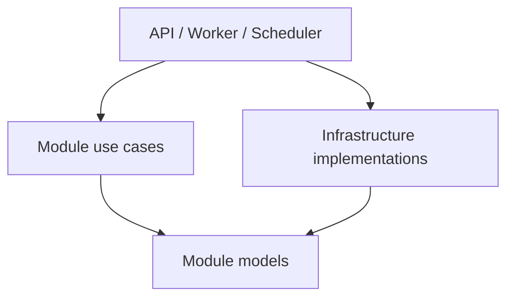

# AI 内容创作平台模块边界与解耦设计

## 1. 问题与决策

当前后端提前创建了 8 个业务模块、8 条 Alembic 分支和完整的
`domain/application/ports` 目录模板，但真正有代码和数据的只有 identity 与
catalog。审计时存在 26 个仅含 docstring 的占位文件、6 个 Python source root
和 8 个 migration head。它们没有增加隔离能力，只增加了导航、导入和迁移成本。

MVP 改为一个模块化单体、一个 Python 包、一条数据库迁移历史。企业级在这里指：
职责清楚、依赖可检查、数据库可重复演进、测试和运行门禁稳定；不以目录数量衡量。

## 2. 运行角色不是业务模块

仍保留 Web、API、Worker、Scheduler 四类进程：Web 提供页面，API 提供同步接口，
Worker 执行耗时任务，Scheduler 只创建到期任务。它们共享同一个后端代码包，
不是四套业务实现，也不为每个进程复制 domain 或 repository。

## 3. MVP 业务模块

| 模块 | 唯一职责 | 拥有的数据 | 当前状态 |
| --- | --- | --- | --- |
| `identity` | 邀请、用户、密码、会话和角色 | users、invitations、sessions | 已实现 |
| `catalog` | 来源导入、溯源、模板/示例、分类和目录查询 | sources、imports、templates、examples、categories | 实施中 |
| `creation` | 草稿、生成任务、供应商尝试、额度、对象和本人作品 | drafts、jobs、attempts、usage、assets、works | S4 创建 |
| `operations` | 来源启停、审核、下架、删除、预算开关和审计 | decisions、moderation、suppressions、audit | S6 创建 |

原 ingestion/search 合并进 catalog；原 generation/asset 合并进 creation；原
governance 收敛为 operations。只有当某个边界出现独立团队、独立扩容、故障隔离或
发布节奏需求时才再次拆分。尚未实施的模块不得创建空目录、空表或空 migration。

## 4. 目标代码结构

```text
frontend/                         # 标准 Next.js App Router
backend/
  src/thief/
    api/                          # FastAPI composition 与 routes
    identity/                     # model、use case、repository、password
    catalog/                      # model、import/query、repository、source adapter
    creation/                     # 到 S4 才创建
    operations/                   # 到 S6 才创建
    infrastructure/              # database、RabbitMQ、MinIO、provider clients
    worker.py
    scheduler.py
    settings.py
  migrations/
    env.py
    versions/                     # 单一线性 Alembic 历史
  tests/{unit,integration,architecture}/
```

一个模块不套固定目录模板。文件按真实职责命名；只有出现两个独立变化原因或接近
200 行时才继续拆分。删除 `apps/`、`packages/core`、`packages/adapters`、空
`contracts` 以及所有未实现模块占位目录。

## 5. 依赖方向



- model 只依赖 Python 标准库。
- use case 依赖本模块 model 和小型 Protocol，不依赖 FastAPI、Celery、SQLAlchemy。
- repository/source/provider 实现可以依赖外部库，但不向 use case 泄漏框架类型。
- API/Worker/Scheduler 是 composition root，负责组装依赖。
- 跨模块只调用对方公开 use case/DTO；MVP 不为只有一个实现的内部协作预建事件总线。
- 只有已经需要异步重试的采集和生成流程才使用 RabbitMQ，消息只携带 ID/trace。

## 6. Migration 的含义与规则

Migration 是数据库结构的版本记录，不是业务模块。每个文件描述一次可审计变更：
`upgrade()` 把旧结构升级到新结构，`downgrade()` 在安全时回滚。开发、CI 和生产按
同一顺序执行，避免手工改表造成环境漂移。

本项目只有一个 PostgreSQL 和一个发布单元，因此只保留一条 Alembic 历史：

```text
0001_initial.py → 0002_catalog_imports.py → 0003_creation_jobs.py → ...
```

- 一个需求可包含多个 schema/table，但只能有一个直接前驱和一个 head。
- 只为当前实现创建表；不得为未来模块创建空 schema。
- identity/catalog 可保留 PostgreSQL schema 表达数据所有权，但不拥有独立迁移树。
- 当前尚未发布且无生产数据，结构重构时将多 head 历史压成一个 `0001_initial`；
  重建本地开发数据库后验证。首次保留数据的环境建立后禁止重写历史。
- 每次 migration 必须在空库 upgrade、目标 downgrade/restore 和 CI 中验证。

## 7. 模块协作

目录导入由 catalog 在一个事务内完成来源快照、模板事实和搜索字段更新；搜索是
catalog 的读模型，不再建立独立模块。图片生成由 creation 维护唯一 job、provider
attempt、资产与本人作品；operations 只返回准入/审核/下架决定，不改写 creation
状态。跨模块引用只保存稳定 UUID，不建立跨 schema ORM relationship。

## 8. 架构门禁

1. 后端只有一个 `backend/src` source root，Make/CI 不拼接多套 `PYTHONPATH`。
2. 未实现模块的占位文件、空 schema 和空 migration 会使架构测试失败。
3. model/use case 导入 FastAPI、Celery、SQLAlchemy、MinIO 或供应商 SDK 时失败。
4. Alembic 必须只有一个 head，空库 upgrade 和完整 downgrade/restore 必须通过。
5. Repository 只能写所属 schema；跨模块 ORM/FK 和万能 repository 被拒绝。
6. 单文件长期目标不超过 200 行，新增层级必须对应真实职责。
7. API、Worker、Scheduler 必须从同一包启动并通过四进程运行测试。

## 9. 重构与回滚

先以测试固定目标目录、单 source root、单 migration head 和现有会话/catalog 行为；
再移动代码、压缩迁移、更新 Make/CI，最后在空数据库执行完整验证。重构前创建
annotated tag；如失败可回到 tag，并恢复重构前命名卷。重构不改变 HTTP 会话契约、
业务字段或用户页面，不顺带实现目录导入、生成或管理功能。

## 10. 接受结论

该结构在当前规模下同时满足模块边界和最小复杂度：四个稳定业务能力边界、两个
实际模块、一个发布单元、一条迁移历史。未来扩展以测试和真实负载触发，不以预留
目录触发。

## 11. 变更记录

- 2026-07-23：v3.0.0 基于代码审计将八个预建模块收敛为四个 MVP 边界，采用单 Python 包和单线性 migration，禁止空模块/空 schema。
- 2026-07-22：v2.0.0-v2.2.0 建立初始八模块、Port/Adapter 和 frontend/backend 边界；v3.0.0 已替代其目录方案。
