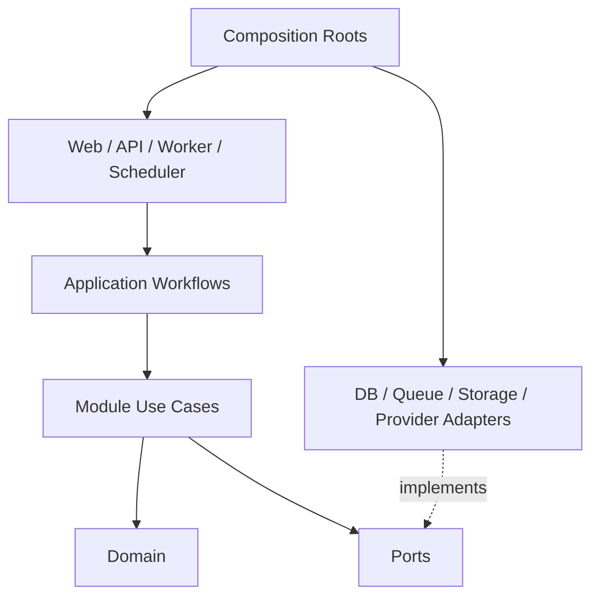
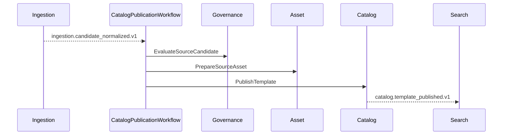
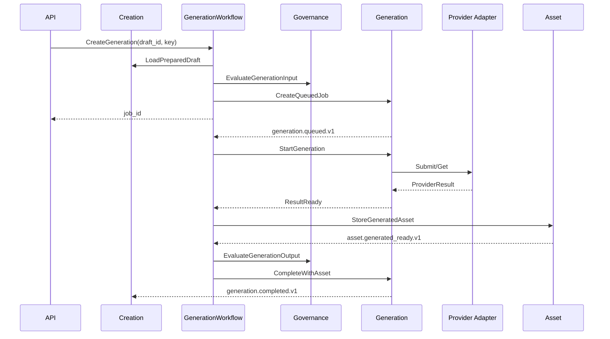

# AI 内容创作平台模块边界与解耦设计

## 1. 原则

MVP 使用模块化单体，不提前拆微服务。模块按业务能力分离，运行时仍复用 Web、API、Worker、Scheduler 四类进程。

1. 模块只暴露 application use case、Port 和版本化契约，不暴露 ORM Model。
2. 模块不得直接写入其他模块的数据表，也不得导入其内部 domain。
3. 同步协作通过公开 Port，耗时或可重试流程通过事件。
4. 跨模块流程由 Workflow 编排，领域模块之间不循环调用。
5. 外部框架与供应商 SDK 都属于 Adapter；`shared` 只放 ID、Clock、Result、分页和基础错误。

## 2. 依赖方向



依赖只能由外向内。Adapter 可以依赖 Port 和 domain type，但供应商响应、SQLAlchemy Model、Celery Task 或 MinIO 类型不能进入领域契约。

## 3. 模块职责与数据所有权

| 模块 | 负责 | 拥有的数据 |
| --- | --- | --- |
| `ingestion` | 来源、采集运行、游标、解析和规范化候选 | sources、crawl_runs、jobs、candidates |
| `catalog` | 提示词模板、示例、分类、标签和发布状态 | templates、examples、categories、tags |
| `search` | 模板搜索投影、过滤和排序 | search_documents、index_versions |
| `creation` | 用户草稿、模板预填、参数编辑和能力校验 | creation_drafts、template_prefills |
| `generation` | 模型能力、生成任务、供应商尝试、状态、配额消耗 | model_profiles、generation_jobs、attempts、usage_ledger |
| `asset` | 来源文件、用户作品、衍生文件和对象生命周期 | assets、variants、user_works、receipts |
| `governance` | 来源准入、输入/输出审核、下架和删除决定 | access_decisions、moderation、suppressions |
| `identity` | 用户、会话和角色 | users、sessions、roles |

`catalog` 是灵感与模板子系统；`generation` 和 `asset` 才构成内容创作结果主链。`search` 是可重建读模型，不是事实源。

## 4. 代码结构

```text
apps/{api,worker,scheduler,web}/
packages/
  contracts/                  # OpenAPI、Command、Event schema
  core/
    shared/
    identity/{domain,application,ports}/
    ingestion/{domain,application,ports}/
    catalog/{domain,application,ports}/
    search/{domain,application,ports}/
    creation/{domain,application,ports}/
    generation/{domain,application,ports}/
    asset/{domain,application,ports}/
    governance/{domain,application,ports}/
    workflows/                # 跨模块编排，不包含领域规则
  adapters/
    postgres/
    rabbitmq/
    minio/
    http/
    sources/diffusiondb/
    generation/{provider_name}/
```

每个模块的公开入口只导出 command、result、use case 和 Port。模块内部 repository、ORM、聚合和值对象不允许被其他模块导入。

## 5. 模板发布 Workflow



Workflow 只保存流程 ID、当前步骤和关联实体 ID。准入规则属于 governance，文件规则属于 asset，模板发布规则属于 catalog。

## 6. 图片生成 Workflow



Creation 不导入供应商 SDK，Generation 不直接写用户作品，Asset 不判断内容政策，Governance 不改变生成任务状态。Workflow 负责顺序和补偿，不复制各模块规则。

## 7. 必要事件

| 事件 | 生产者 | 消费者 |
| --- | --- | --- |
| `ingestion.candidate_normalized.v1` | ingestion | CatalogPublicationWorkflow |
| `catalog.template_published.v1` | catalog | search |
| `generation.queued/completed/failed.v1` | generation | GenerationWorkflow、creation |
| `asset.generated_ready.v1` | asset | GenerationWorkflow |
| `governance.suppression_requested.v1` | governance | catalog、search、asset、generation |

事件只携带 `event_id`、版本、实体 ID、时间和 `trace_id`。大文本、图片、凭证和供应商对象不进入 RabbitMQ。消费者按 `event_id` 幂等；破坏性契约变更发布新版本。

事务通过 `EventOutboxPort` 写待发布事件，由 Worker 转发到 RabbitMQ，不增加独立 Dispatcher 服务。重复投递由 inbox/event ID 去重。

## 8. 数据隔离

MVP 共用一个 PostgreSQL 实例，每个模块拥有独立 schema 和迁移目录。模块只能通过自己的 Repository 写数据，不建立跨模块 ORM relationship 或跨 schema 更新。

模块关联使用稳定 UUID。API 通过 query service 或批量 Port 组合数据，禁止在请求路径直接跨模块 join。搜索投影可随时从 catalog 事件重建。

## 9. 基础设施端口

| Port | 默认 Adapter |
| --- | --- |
| `SourceConnector` | DiffusionDB adapter |
| `GenerationProvider` | 待选图片模型供应商 adapter |
| `ObjectStore` | MinIO S3 adapter |
| `TaskBus` / `EventBus` | RabbitMQ adapter |
| `SearchRepository` | PostgreSQL FTS/pg_trgm adapter |
| `ModerationProvider` | 本地规则与待选审核 adapter |
| `Clock` / `IdGenerator` | 系统时钟 / UUIDv7 |

测试提供内存或 fake Adapter，领域单元测试不得启动外部服务。

## 10. 架构测试

1. 禁止 core 导入 FastAPI、Celery、SQLAlchemy、MinIO 或供应商 SDK。
2. 禁止模块导入其他模块的 `domain`、repository 或 ORM。
3. Command、Event、OpenAPI 和 GenerationProvider 运行契约测试。
4. Adapter 分别运行 PostgreSQL、RabbitMQ、MinIO、来源和生成供应商集成测试。
5. 端到端测试只通过公开 API/Port 验证模板发布、图片生成、作品读取和删除。

## 11. 演进与接受门禁

只有独立扩容、故障隔离或部署节奏出现真实需求时才拆服务；拆分保留现有 Port、事件和数据所有权。Design 接受需要证明：职责无重叠或循环依赖；供应商、RabbitMQ、MinIO 和搜索可替换；重复事件幂等；架构测试能阻止越界导入；S0-S3 不要求提前实现视频、社区或支付。

## 12. 变更记录

- 2026-07-22：v2.0.0 将 creation、generation、asset、identity 纳入核心模块，明确模板发布与图片生成两个独立 Workflow。
