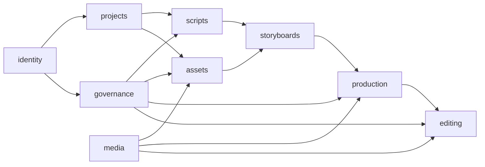

# DES-004 核心业务模块与通用增删改查设计

- 状态：proposed
- 日期：2026-07-27
- 输入：`001-人工智能短剧平台产品调研与核心能力.md`、`002-人工智能短剧平台架构与技术选型.md`、`003-业务闭环与模块协作设计.md`
- 输出：模块职责、业务对象、必要 CRUD、业务命令、权限和删除规则
- 下游：MVP PRD、API 契约、数据模型与纵向实施 Plan

## 1. 设计结论

MVP 采用 9 个业务模块：用户与空间、项目、剧本、资产、分镜、生产、媒体、剪辑交付、审核治理。原先 generation/workflows/usage、audio/timelines、reviews/compliance 分别先作为一个模块内的明确子职责，不为每个名词创建独立目录、Repository 或 Service。

通用化只覆盖 HTTP 语义、分页、权限上下文、错误格式和少量持久化辅助。业务对象保留显式用例；不建立万能 `BaseCRUD`、动态过滤语言、通用业务表或 `/actions/{name}` 解释器。

## 2. 调研事实与取舍

- 公开事实：Spring Modulith 把模块定义为公开接口、内部实现和外部依赖，并明确支持从简单模块开始、按需要增加复杂度；本设计借用边界思想，不引入 Java 组件。
- 公开事实：Jellyfish 已验证 `提取候选 → 人工决议 → readiness → 生成` 的短剧流程；其当前 Shot 路由又拆出详情、对白、帧、资产关联等多套 CRUD，说明按子表暴露接口会快速膨胀。
- 公开事实：LumenX 的复合 StoryboardFrame 包含镜头、动作、角色、场景、机位和媒体信息，验证 ShotSpec 应整体表达；同一大模型文件长期保留大量 legacy 字段，也说明不能把全部生产事实塞进单个对象。
- 公开事实：Runway 建议按 5–10 秒镜头规划，并记录机位、灯光、角色位置等；可灵多图参考证明人物、物体、服装和场景参考需要作为结构化输入。
- 公开事实：OIDC 只有 `issuer + subject` 可作为稳定用户标识，邮箱可能变化或复用。
- 设计取舍：吸收上述业务事实，但不复制竞品页面、Jellyfish 的路由数量或 LumenX 的兼容字段。

## 3. 统一 CRUD 规则

| 操作 | 适用范围 | 统一语义 |
| --- | --- | --- |
| Create | 用户可建立的聚合或草稿 | `POST` 创建，服务端分配 ID、Workspace 和初始状态 |
| Read/List | 用户有权访问的资源 | `GET`；列表只提供显式筛选、排序、`page/page_size` |
| Update | 可变元数据或草稿 | `PATCH` 只接收允许字段；不借 PATCH 绕过状态机 |
| Archive/Restore | 已产生引用或历史的聚合 | 显式命令，默认列表不返回归档项，历史引用仍可读取 |
| Delete | 未被引用、未产生费用的草稿 | `DELETE` 硬删除；不满足条件返回冲突和阻塞原因 |
| Business Command | 生成、确认、选择、重排、审核等 | 使用有业务名称的端点，校验状态、权限、幂等和事务 |

三类对象使用不同持久化规则：可变草稿允许 PATCH；ScriptVersion、ShotSpecVersion、TimelineVersion 等版本对象只追加不覆盖；Task、Attempt、Candidate、CostEntry、Decision、AuditEvent 等证据对象只读或追加，用户不能删除。

每个业务表只增加真实需要的字段，不强制继承万能 BaseEntity。通常需要 `id`、`workspace_id`、`created_at`、`updated_at`；`created_by`、`archived_at`、`revision` 仅在审计、归档或并发确有需要时加入。

## 4. 用户与空间模块 `identity`

### 4.1 拥有的事实

- UserAccount：本地用户映射、显示名称、头像、状态；身份键为 OIDC `issuer + subject`，不保存密码，不以邮箱作为主键。
- Workspace：数据、成员和额度隔离边界；首次登录自动创建个人 Workspace。
- Membership：UserAccount 与 Workspace 的唯一关系，MVP 固定 `owner / editor / viewer` 三种角色，不做自定义权限编辑器。

### 4.2 必要能力

| 对象 | 必要 CRUD | 业务规则 |
| --- | --- | --- |
| 当前用户 | 读取、修改显示资料、停用账户 | 登录时按 OIDC 身份幂等建立；停用不删除创作历史 |
| Workspace | 创建、列表、详情、修改、归档/恢复 | 至少保留一个 owner；归档后禁止新建生产任务 |
| Membership | 列表、修改角色、移除 | MVP 个人空间只自动建立 owner；邀请成员进入 P1 |

用户模块不管理项目细节、任务或账本，只提供 `ActorContext(user_id, workspace_id, role)` 和权限检查。管理员批量用户 CRUD、组织层级、部门、SCIM 和自定义角色不进入 MVP。

## 5. 项目模块 `projects`

### 5.1 拥有的事实

- Project：短剧/系列的名称、简介、默认画幅、语言、视觉风格、目标时长和预算上限。
- Episode：单集名称、序号、生产阶段和当前剧本/时间线引用；阶段由完成事实计算，不能由前端随意 PATCH。

### 5.2 必要能力

Project 支持创建、列表、详情、修改元数据、归档/恢复；只有完全空白且无 Episode 的草稿可硬删除。Episode 支持创建、列表、详情、修改元数据、重排和归档；已有生成、审核或交付记录后不得硬删除。

项目详情返回生产概览和阻塞摘要，但不复制其他模块的完整实体。复制项目、模板市场、多集排期和项目级精细成员权限属于 P1。

## 6. 剧本模块 `scripts`

### 6.1 拥有的事实

- ScriptSource：导入文本、文件来源、权利声明和基础元数据。
- ScriptVersion：不可变正文与结构化场景/对白；Episode 只保存当前版本 ID。
- ExtractionBatch/Candidate：一次 AI 拆解及角色、场景、道具、服装、镜头候选的决议记录。

### 6.2 必要能力

允许创建/读取 ScriptSource、追加/列表/读取 ScriptVersion、设置当前版本、启动提取、重新提取和逐批确认/合并/忽略候选。修改正文等价于创建新版本；已被 ShotSpec 引用的版本不能删除。候选不是通用 CRUD 资源，只能通过决议命令改变状态，重复提交同一决议不得重复创建下游对象。

## 7. 资产模块 `assets`

### 7.1 拥有的事实

- Asset：角色、场景、道具、服装、风格或声音的稳定身份、类型、名称和标签。
- AssetVersion：不可变设定、类型化属性、提示描述、参考媒体版本和来源。
- 资产使用关系由 ShotSpec 等引用方拥有；assets 只提供反向只读查询，不建立需要双写的 AssetUsage 事实。

### 7.2 必要能力

Asset 支持创建、列表、详情、修改名称/标签、归档/恢复；AssetVersion 支持追加、列表、详情和设为当前版本。不同资产类型复用身份与版本流程，但用判别联合分别校验角色外观、场景环境、服装、道具或声音字段，不使用任意 JSON 接受未知结构。

只有没有版本和引用的资产草稿可硬删除。改变当前版本不会偷偷更新既有 ShotSpec；用户必须显式升级引用，才能保证旧镜头可重现。

## 8. 分镜模块 `storyboards`

### 8.1 拥有的事实

- Shot：Episode 内稳定镜头身份、顺序、标题、所属叙事 Scene 和归档状态。
- ShotSpecVersion：不可变镜头规格，包含景别/机位/运镜、构图与站位、动作节拍、对白/旁白、时长、情绪/光照、固定资产版本和生成意图。
- Readiness：根据当前 ShotSpecVersion、固定资产引用、授权和必填规格实时计算的结果，不单独存一个可编辑布尔值；模型能力与供应商参数由 production 在提交前校验。

不为 ShotDetail、DialogueLine、Frame、AssetLink 分别提供全套 CRUD。它们是 ShotSpec 草稿中的类型化组成部分，一次保存形成一个新 ShotSpecVersion；关键帧和视频候选属于 production/media，不回填覆盖规格。

### 8.2 必要能力

| 能力 | 类型 | 关键规则 |
| --- | --- | --- |
| 创建、列表、详情、修改 Shot 元数据 | CRUD | 创建时带 Episode；序号由服务端维护 |
| 保存规格、查看版本、切换当前版本 | 版本命令 | 保存新版本，不原地覆盖历史 |
| 重排、复制、拆分、合并镜头 | 业务命令 | 单事务更新顺序；返回受影响镜头 |
| 查看 readiness 和阻塞原因 | 查询 | 缺规格、资产、授权或时长时返回明确下一动作 |
| 归档/恢复或删除镜头 | 生命周期 | 有生成/审核引用则只能归档；空白草稿可删除 |

拆分/合并只复制或重组规格草稿，不自动复制已生成媒体和费用；批量修改必须是明确字段的批处理，不提供任意表达式更新。

## 9. 生产模块 `production`

拥有 ModelCapability、GenerationRequest、Candidate、Task、Attempt、Reservation/CostEntry。它统一处理图片、视频、TTS 和音效生成，但每种能力使用类型化请求和供应商适配器。

用户侧没有任意 CRUD：只能提交生成、查询请求/任务/候选、取消、对账后重试、选择/取消选择候选。请求、尝试、候选和成本记录不可 PATCH/DELETE；“清理失败任务”只影响列表可见性，不抹除审计与结算证据。

同一生成命令必须保存 ShotSpecVersion、资产版本、输入 hash、幂等键和费用预占。批量生成只是多个可独立恢复的镜头请求集合，不建立第二套批任务状态机。

## 10. 媒体模块 `media`

拥有 MediaObject、不可变 MediaVersion 和 Lineage。必要能力是初始化上传、完成校验、列表/详情、短期签名访问、读取探测元数据、归档和解除业务引用；文件内容不可 PATCH，替换文件会产生新版本。

media 不知道 Character、Shot 或 Timeline 的内部模型，业务模块只保存 MediaVersion ID。已进入血缘、审核或交付清单的媒体不可硬删除；无引用且过期的临时上传可由清理任务删除。

## 11. 剪辑交付模块 `editing`

拥有 Timeline 草稿、不可变 TimelineVersion、Render 和 DeliveryManifest。Track、Clip、字幕 Cue、转场和音量是 Timeline 聚合内的类型化子项，不分别建立 Repository 和顶层 CRUD；声音身份仍属于 assets。

必要能力是读取/修改 Timeline 草稿、批量增删改 Clip、发布 TimelineVersion、生成预览、提交渲染、查询 Render 和导出交付。已发布版本与交付清单不可修改或删除；修改后发布新版本。MVP 不实现专业 NLE、实时多人编辑或任意滤镜插件系统。

## 12. 审核治理模块 `governance`

拥有 Review、Issue、Decision、Consent、ModerationResult、Label 和 AuditEvent。Issue 支持创建、列表、详情、修改描述/指派、关闭/重开；Consent 支持登记、读取、更新有效范围和撤销。Review 提交、批准、退回以及内容检查使用显式命令。

Decision、ModerationResult、Label 和 AuditEvent 只追加不覆盖；撤销授权产生新状态与审计记录，并阻止新的生成/交付。治理模块通过受控资源类型与版本 ID 审核，不复制剧本、资产或时间线正文。

## 13. 权限最小集

| 能力 | viewer | editor | owner |
| --- | --- | --- | --- |
| 查看项目、镜头、任务与成片 | 是 | 是 | 是 |
| 编辑剧本、资产、分镜和时间线 | 否 | 是 | 是 |
| 发起生成、选择候选、提交审核 | 否 | 是 | 是 |
| 批准审核与导出 | 否 | 是 | 是 |
| 管理 Workspace、成员和预算上限 | 否 | 否 | 是 |

所有查询和命令先校验 Workspace，再校验角色与资源归属。MVP 不增加项目级 ACL；需要外部审片时再增加只读分享或 reviewer 角色。

## 14. 模块依赖方向

箭头表示“基础事实被后续模块使用”，依赖必须保持单向；跨模块只能调用公开用例或读取 DTO。

## 15. API 形态与防过度设计门槛

- 资源 CRUD 示例：`GET/POST /api/v1/projects`、`GET/PATCH /api/v1/projects/{project_id}`、`GET/POST /api/v1/episodes/{episode_id}/shots`。
- 业务命令示例：`POST /shots/{id}/spec-versions`、`POST /episodes/{id}/shots/reorder`、`POST /shots/{id}/generation-requests`、`POST /candidates/{id}/select`。
- 聚合查询示例：`GET /episodes/{id}/production-snapshot`、`GET /shots/{id}/readiness`；聚合查询只读，不成为第二事实源。
- 只有出现至少两个真实重复用例，才提取共享函数；共享函数只处理机械动作，事务和业务校验仍留在模块 Service。
- 新建模块必须同时证明独立事实、独立业务规则和独立变化原因；仅有一张表或一组路由不足以拆模块。

## 16. MVP 实施顺序与验收

1. identity + projects：登录后创建个人空间、项目和单集。
2. scripts + media + assets + storyboards + 最小 governance：导入剧本、登记授权、确认资产、保存 ShotSpec 并得到 readiness。
3. production：提交单镜头生成、恢复任务并选中候选。
4. editing + governance 审核能力：形成时间线、审核、渲染并导出交付清单。

每个切片只创建实际使用的模块文件。验收必须覆盖 Workspace 越权、版本不可变、删除阻塞、镜头重排、readiness、幂等生成、候选选择、任务恢复和交付追溯；不以“所有表都有 CRUD”作为完成标准。

## 17. 主要资料

- [Spring Modulith 模块基础](https://docs.spring.io/spring-modulith/reference/fundamentals.html)、[模块结构验证](https://docs.spring.io/spring-modulith/reference/verification.html)
- [FastAPI 多文件应用](https://fastapi.tiangolo.com/tutorial/bigger-applications/)、[FastAPI 官方全栈模板用户路由](https://github.com/fastapi/full-stack-fastapi-template/blob/5b358ea6f422a09cc0d6f75c4164cf8a36005c4c/backend/app/api/routes/users.py)
- [OpenID Connect Core 1.0](https://openid.net/specs/openid-connect-core-1_0-18.html#ClaimStability)
- [Jellyfish 产品与源码](https://github.com/Forget-C/Jellyfish)、[Jellyfish Shot 路由](https://github.com/Forget-C/Jellyfish/blob/a9678194ddf2d9be3ccbe78d4287d87d5089e123/backend/app/api/v1/routes/studio/shots.py)
- [LumenX](https://github.com/alibaba/lumenx)、[LumenX 分镜数据模型](https://github.com/alibaba/lumenx/blob/7a1213a0db73ab90ca976f5c4b4ca680e1ae1d2d/src/apps/comic_gen/models.py)
- [Runway 长视频与分镜说明](https://help.runwayml.com/hc/en-us/articles/26871350018835-How-to-create-longer-videos-and-films)、[可灵多图参考公告](https://ir.kuaishou.com/zh-hans/news-releases/news-release-details/kuaishoukelingaituichuduotucankaogongneng)
