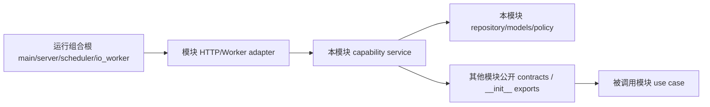

# DES-006 后端模块工程化重构设计

- 状态：accepted（2026-07-30 用户确认开始执行）
- 日期：2026-07-30
- 覆盖需求：SYS-ENT-005、SYS-IF-001/005/007、SYS-NFR-002/003/004/008/009
- 输入：[REQ-001 平台总体需求概述](../requirement/001-平台总体需求概述.md)、[DES-000 项目顶层结构与工程规范](./000-项目顶层结构与工程规范.md)、当前 `backend/app` 与 `backend/tests`
- 输出：后端模块边界、模块内拆分规则、公开契约、依赖方向、测试结构和渐进迁移门禁
- 下游：PLAN-000 `DEV-ARCH-01`；在继续 DEV-S2-02 业务增量前执行工程化重构

## 1. 结论

后端继续使用 FastAPI 模块化单体、同一 PostgreSQL 事务边界和同一部署镜像，不拆微服务、不引入第二任务系统。当前问题来自“按技术层单文件”的起步结构已经跨过拆分阈值，却没有同步建立可执行的模块公开边界。

目标结构采用两级规则：简单模块保持 `api.py + schemas.py + service.py + models.py + repository.py`；出现两个以上独立变化职责的模块，改为“模块根拥有事实与公开契约，模块内按业务能力纵向拆包”。跨模块调用只能经过公开契约，不能导入另一模块的 ORM、Repository、内部 Service 或内部异常。

本设计是无行为变化的工程重构设计：第一阶段不改 URL、OpenAPI 字段、数据库表、消息格式和用户可观察结果。先建立架构守卫和稳定 seam，再继续 Scene/Dialogue 等新功能。

## 2. 当前审计证据

2026-07-30 对当前工作树的只读审计得到：

| 证据 | 当前结果 | 说明 |
| --- | --- | --- |
| 最大生产文件 | `scripts/service.py` 1007 行、`projects/service.py` 706 行、`identity/service.py` 383 行 | 行数不是违规条件，但已提示多个独立用例簇集中在单文件。 |
| 最大接口/DTO 文件 | `projects/api.py` 301 行、`scripts/api.py` 297 行、`scripts/schemas.py` 303 行 | 版本、提取、候选决议和后续结构确认会继续并行增长。 |
| 测试体量 | `test_script_extractions_api.py` 850 行、`test_scripts_api.py` 685 行、`test_projects_api.py` 546 行 | 测试也按模块堆叠，难以定位能力边界和复用基础设施 fixture。 |
| 跨模块内部依赖 | production 直接导入 messaging ORM 与 identity service/policy；scripts 直接导入 production repository/service/schema、projects service 与 identity service/policy；projects/scripts repository 直接导入 identity ORM；messaging consumer 直接导入 production ORM/service | 已违反 DES-000 的“跨模块只使用公开接口”规则。 |
| 公开模块面 | 各模块 `__init__.py` 基本只有 docstring 或为空 | 文档声明了公开接口，代码没有可识别的公开 API。 |
| 架构门禁 | `test_import_direction.py` 只检查 `core` 不导入业务模块 | 没有自动阻止上述跨模块泄漏。 |
| 测试基础设施 | 8 个集成测试文件重复声明数据库 `session_factory`，多个文件重复 HTTP client/身份准备 | fixture 重复会让事务隔离或初始化规则产生多套语义。 |

因此需要解决的是职责、边界和可验证性，而不是机械把文件切到固定行数。

## 3. 目标与非目标

### 3.1 目标

1. 每个业务事实只有一个模块拥有，ORM 与参数化查询不越过模块边界。
2. 跨模块依赖通过可搜索、可类型检查、可契约测试的公开接口完成。
3. 大模块按用户用例和事务边界拆分，使改动、测试和评审范围局部化。
4. HTTP、Scheduler、Worker 只在组合根装配能力；业务用例不反向依赖运行入口。
5. 测试共享真实基础设施 fixture，但每个业务能力保留独立的成功、权限、冲突、幂等和恢复场景。
6. 重构期间保持数据库、OpenAPI、消息和现有验收行为不漂移。

### 3.2 非目标

- 不拆微服务，不建立 `domain/application/infrastructure/interface` 四层模板。
- 不为每张表生成 CRUD、Repository interface 或空 Facade。
- 不引入全局 `common`、`shared`、`utils`、服务定位器或依赖注入框架。
- 不在本轮引入 Alembic、事件溯源、CQRS、Celery、Temporal 或新消息队列。
- 不借重构实现 Scene/Dialogue、资产、分镜或供应商新功能。

## 4. 目标目录形态

### 4.1 简单模块

只有一个主要资源生命周期、一个事务边界和一组调用者时，维持扁平结构：

```text
modules/<module>/
├── __init__.py        # 显式导出公开命令、查询、DTO/Protocol
├── api.py             # HTTP router 与异常/响应映射
├── schemas.py         # HTTP/Application DTO
├── service.py         # 用例、权限、事务编排
├── models.py          # 本模块 ORM
├── repository.py      # 本模块查询与锁
└── policy.py          # 仅存在独立、可单测规则时创建
```

### 4.2 复杂模块

满足拆分条件后，模块根保留所有权与组合，能力包承载各自 HTTP、DTO 和用例：

```text
modules/<module>/
├── __init__.py        # 唯一推荐的跨模块导入入口
├── api.py             # 只 include 子能力 router
├── contracts.py       # 有真实跨模块调用者时才创建；不得导入 FastAPI/ORM
├── models.py          # 模块事实所有权；达到独立实体簇条件后再拆 models/
├── repository.py      # 跨本模块能力复用的基础查询/锁
├── <capability_a>/
│   ├── api.py
│   ├── schemas.py
│   └── service.py
└── <capability_b>/
    ├── api.py
    ├── schemas.py
    └── service.py
```

能力名必须来自用户任务或稳定业务语言，例如 `authentication`、`workspaces`、`episodes`、`snapshots`、`versions`、`extractions`、`structure`、`tasks`。禁止使用 `handlers2`、`helpers`、`managers`、`misc` 等无归属名称。

并非每个能力包都必须同时拥有三个文件：没有独立 HTTP 面就不建 `api.py`，没有专属 DTO 就复用本模块公开 DTO；但不得把 ORM 查询写进 `api.py`，也不得为了少一个文件让一个能力直接修改另一模块事实。

### 4.3 当前模块的建议落位

| 模块 | 能力边界 | 继续留在模块根的事实 |
| --- | --- | --- |
| identity | `authentication`、`workspaces`；`policy.py` 保留纯权限规则 | UserAccount、Workspace、Membership ORM 与共享授权查询 |
| projects | `projects`、`episodes`、`snapshots` | Project、Episode ORM、顺序/锁查询；对 scripts 提供 Episode 写入协调命令 |
| scripts | `versions`、`extractions`、`structure`；候选决议归入 `extractions` | ScriptSource/Version、ExtractionBatch/Candidate/Decision、Scene/Dialogue ORM 与模块级锁 |
| production | 当前先保留简单模块或仅建 `tasks`；GenerationRequest/Attempt/Cost 真正进入时再拆 | Task 及后续生产事实 |
| messaging | outbox 发布、inbox 消费属于同一消息交付能力，当前保持扁平 | OutboxEvent、InboxDelivery；公开 enqueue/claim/ack 契约 |

## 5. 依赖和公开契约

### 5.1 允许的依赖



- `main.py`、`server.py`、`scheduler.py`、`io_worker.py` 可以导入各模块公开的 router、runner 或 handler 进行装配。
- 模块内能力可以导入本模块 `models.py`、`repository.py`、`policy.py` 和 `contracts.py`。
- 跨模块只能从目标模块 `__init__.py` 或 `contracts.py` 导入公开符号。
- `contracts.py` 只包含不可变 Command/Result/Event DTO、`Protocol` 和稳定枚举；不得导入 FastAPI、SQLAlchemy Model、Repository 或运行时 adapter。
- `__init__.py` 只做显式 re-export，无注册、I/O、数据库和全局实例化副作用。

### 5.2 禁止的依赖

- `from app.modules.<other>.models ...`
- `from app.modules.<other>.repository ...`
- `from app.modules.<other>.service ...` 或导入另一模块的能力包内部文件
- 以另一模块 HTTP response schema 充当内部应用契约
- 通过对象导航修改另一模块 ORM，或用跨模块 join 代替公开查询

SQLAlchemy Metadata 的模型发现属于组合根职责，可以由一个显式的 `app/model_registry.py` 导入已启用模块的 `models`；这是建表注册，不授权业务代码跨模块使用 ORM。

### 5.3 当前跨模块 seam

| 提供方 | 第一批公开能力 | 调用方 |
| --- | --- | --- |
| identity | `ActorContext` 装配、Workspace capability 校验、最小 Membership/Workspace 只读结果 | projects、scripts、production |
| projects | 锁定 Episode 内容写入、比较并设置 current ScriptVersion、读取项目/单集归属摘要 | scripts、后续聚合查询 |
| production | 创建/查询脚本提取 Task、记录完成/失败；返回公开 `TaskResult` | scripts、messaging worker |
| messaging | 在调用方现有 Session 中追加 Outbox、生成/读取公开 MessageEnvelope | production、scheduler、worker |
| scripts | 记录提取结果、读取确认结构；返回公开结构/决议结果 | worker、后续 assets/storyboards |

这些函数必须完成真实业务动作，不增加只转发一次调用的 Facade 层。

## 6. 事务、模型和查询规则

1. HTTP 或 Worker adapter 取得 `AsyncSession`，最外层用例决定 commit/rollback；Repository 不自行 commit。
2. 跨模块命令需要原子性时，公开用例接收同一个 Session，并在同一事务中追加业务事实与 Outbox；不得用内部 HTTP 回调模拟本地事务。
3. 一个模块只能修改自己拥有的 ORM。若 A 需要改变 B 的事实，A 调用 B 的公开命令；B 负责锁、校验和写入。
4. 跨模块引用保存稳定 UUID/版本 ID 和必要不可变快照。关系完整性由显式外键、公开预检与事务测试共同保证。
5. 聚合读取可以在 projects 的 snapshot 能力组合各模块公开只读结果；在出现经验证的 N+1 或性能问题前，不建立绕过所有模块的全局读库层。
6. `models.py` 不按表数量机械拆分。只有出现独立实体簇、独立迁移/加载需求或持续冲突时才改为 `models/<capability>.py`，并由模块自己的 `models/__init__.py` 汇总。

## 7. 测试工程化

目标测试结构：

```text
backend/tests/
├── conftest.py                  # 跨 integration/contract 真实共享的数据库与 app fixture
├── support/                     # 测试专用 builder/helper；不得被 app 导入
├── architecture/
│   ├── test_directory_structure.py
│   ├── test_import_direction.py
│   └── test_module_boundaries.py
├── unit/<module>/<capability>/
├── integration/<module>/<capability>/
└── contract/
```

- 把重复的专用测试库校验、事务回滚、`session_factory`、FastAPI dependency override 和 client 生命周期提升到 `tests/conftest.py`。
- 身份、Workspace、Project/Episode 等数据准备使用 `tests/support/builders.py` 或按模块命名的 builder，不把业务默认值藏进 fixture。
- 测试按能力拆分，而不是继续扩展单个 `test_<module>_api.py`；现有公开行为在搬迁前后必须逐条保留。
- 架构测试自动拒绝所有未经过目标模块根或 `contracts.py` 的跨模块导入，也拒绝通过模块根取得 `service`/`repository` 模块对象；Router/runner 导入只对白名单组合根开放，模型导入只对白名单模型注册开放。
- `tests` 可以为数据库断言导入 ORM，但优先通过公开 API 验证行为；直接 ORM 断言只用于事务、Outbox、不可变性和持久化不变量。

## 8. 渐进迁移顺序

| 阶段 | 变更 | 完成证据 |
| --- | --- | --- |
| R0 守卫 | 增加模块边界架构测试、OpenAPI 快照/生成 client 漂移检查；先记录当前违规为精确 allowlist | 新违规会失败；现有行为测试保持绿色。 |
| R1 公开 seam | 为 identity、projects、production、messaging、scripts 建立真实调用所需的最小公开契约，替换跨模块 ORM/Repository 导入 | 生产代码跨模块内部导入归零，allowlist 清空。 |
| R2 scripts | 将版本、提取/决议拆为能力包；随后在 `structure` 中继续 DEV-S2-02 | 原 scripts 接口、幂等、并发和恢复测试无漂移；新增结构确认按 Red→Green。 |
| R3 projects/identity | 分别拆 project/episode/snapshot 与 authentication/workspaces；共用测试基础设施 | OpenAPI 无漂移；S1 Acceptance 回归通过。 |
| R4 production/messaging | 在 GenerationRequest/Attempt 进入前固定 Task 与 Outbox/Inbox 边界 | RabbitMQ contract、重复投递、崩溃恢复与事务测试通过。 |
| R5 收敛 | 删除临时 re-export/allowlist，更新生成 client 与架构文档 | `make check`、文档追踪、`git diff --check` 全部通过。 |

每个阶段单独提交且可回滚。禁止一次移动全部模块后再集中修测试，也禁止通过长期兼容 import 维持两套目录。

## 9. 实施验收条件

本设计实施完成的判定：

1. PLAN-000 已登记独立工程重构任务，并明确它阻塞 DEV-S2-02 的新增结构用例，而不把已完成业务倒退为未完成。
2. 实施后生产代码中不存在跨模块 `models.py`、`repository.py`、内部 `service.py` 或能力内部包导入。
3. 当前 OpenAPI 与生成 client 除格式/operationId 的明确修订外无行为漂移；数据库 metadata 和消息 envelope 不变。
4. S0/S1、Task、Outbox/Inbox、scripts 已有集成/契约测试以及新增架构测试全部通过。
5. `scripts`、`projects`、`identity` 的独立能力不再集中在单一 service/schema/api 文件；测试按相同能力边界可定位。

## 10. 风险与处理

| 风险 | 处理 |
| --- | --- |
| 循环导入 | contracts 不导 ORM/Service；模块根只 re-export；组合根负责装配。出现循环即说明所有权或调用方向仍未明确，不用延迟导入掩盖。 |
| 大规模移动导致回归难定位 | 按 R0–R5 小步迁移，每步先跑定向测试再跑完整门禁。 |
| 为“工程化”制造过多文件 | 只有达到拆分条件且已有调用者才建能力包/contracts；简单模块继续扁平。 |
| 跨模块事务被错误拆成 HTTP | 模块化单体继续共享 Session，通过公开应用命令保持单事务。 |
| 测试 fixture 过度抽象 | 只共享环境生命周期和稳定 builder；业务断言、权限和失败场景留在能力测试。 |

## 11. 接受记录

- 2026-07-30 用户确认先提交需求与设计文档，再开始任务计划执行。
- DES-006 成为继续 DEV-S2-02 新增业务用例前的工程门禁。
- 执行顺序固定为：架构守卫 → 公开 seam → 大模块拆分 → 全量回归；重构阶段不并行加入新产品功能。
- 2026-07-30 R0/R1 已完成：架构守卫的跨模块内部导入 allowlist 从 12 项收敛为 0，OpenAPI 生成结果无漂移，进入 R2 scripts 能力拆分。
