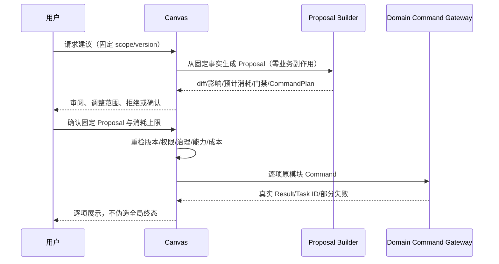

# DES-011 可视化制作画布与工作流投影设计

- 状态：proposed
- 版本：v1.0
- 日期：2026-08-14
- 关联需求：CUR-CAN-FR-001～012、CUR-CAN-NFR-001～012；CUR-IAM-FR-006；CUR-PRJ-FR-006/007；CUR-SCR-FR-010/011；CUR-SBD-FR-007～009；CUR-VID-FR-004/008～010；CUR-EXP-FR-001～005；CUR-PLT-FR-001～010
- 关联验收：AC-CUR-CAN-001～022
- 上游：[CUR-CAN](../requirement/011-可视化制作画布与工作流信息需求.md)、[DES-002](./002-领域模块边界与跨模块契约.md)

## 1. 问题、范围与非目标

### 1.1 问题

列表能精确编辑单个对象，却不易同时理解一个 Episode 中的叙事、资产、Shot、关键帧、视频候选、任务与导出之间的依赖。自由画布又容易把坐标、拖线或动画误当业务真相。因此本设计的关键不是新建一套“可视工作流”，而是将现有领域事实做成可恢复、可分层、可定位的 Read Model。

### 1.2 范围

- Project/Episode 范围的类型化 DomainNode/DomainEdge 投影；
- 共享 CanvasLayoutRevision、个人 ViewportPreference、Group、FilterPreset；
- readiness、WorkTask、blocking、stale、selection、governance、export 独立状态图层；
- 视口虚拟化、分层加载、聚合、搜索、小地图和深链定位；
- SSE patch、游标缺口恢复与轮询降级；
- 复用原模块命令的画布侧栏和 Agent Proposal/CommandPlan 确认边界；
- 完整列表替代路径、键盘及辅助技术。

### 1.3 非目标

- 不是 Timeline、Track、Clip、帧级编辑、拼接、转码或成片渲染；
- 不允许拖拽、自由连线或删节点直接修改领域事实；
- 不暴露 Provider 的任意技术 DAG、SDK 步骤、轮询节点或内部队列；
- 不建通用低代码工作流、Agent 执行平台、实时多人白板或评论系统；
- 不以画布作为任何 P0 功能的唯一入口。

## 2. 证据边界与实现原则

[waoowaoo 固定提交 `ce8edebf7cd2fe32c37a8d628aa3edc67f544586`](https://github.com/waooAI/waoowaoo/tree/ce8edebf7cd2fe32c37a8d628aa3edc67f544586) 只用来证明“AI 制作信息可以通过可视节点帮助用户定位”这一候选模式。其根 LICENSE 是 CC BY-NC-SA 4.0 人类可读摘要，包含非商业和相同方式共享限制；本项目不复制其代码、界面、资产、领域模型或技术选型。

本设计的实现原则：

1. Canvas 是同一领域的 Read Model/Projection，不是第二事实源。
2. 共享布局是服务端事实；业务节点和边可从领域快照/事件重建。
3. 画布命令与列表命令使用同一 Application Port、`expected_revision`、幂等、权限、治理和审计。
4. 状态不压成单个颜色/百分比；每个图层指向自己的事实所有者和更新时间。
5. Agent 不直接执行 Provider 或数据库动作，只产生可审阅 Proposal/CommandPlan。

## 3. 事实所有者与数据模型

### 3.1 Canvas 拥有的事实

| 实体 | 关键内容 | 版本语义 |
| --- | --- | --- |
| CanvasView | Workspace、Project/Episode scope、名称、状态、current layout | 稳定 ID；active/archived 用 revision |
| CanvasLayoutRevision | 基线修订、NodeRef 位置/尺寸、Group、折叠/可见性、hash | 创建即不可变；current 指针乐观切换 |
| CanvasGroupRevision | 组名、父组、成员 NodeKey、视图样式 | 仅视图组织，不表达包含/顺序 |
| ViewportPreference | User、Canvas、焦点、缩放、筛选/图层偏好 | 每用户乐观更新；不影响共享布局 |
| AgentActionProposal | 固定输入摘要、目标、依据、diff、影响、预计消耗/上限、风险、有效期 | 创建即不可变 |
| CommandPlan | 有序/可独立命令、目标版本、幂等键、门禁和失败策略 | Proposal 的不可变部分；不含任意代码 |
| ProposalDecision | actor、Proposal 版本、confirm/reject、时间、理由 | 追加决定；确认不等于命令成功 |

### 3.2 可重建投影

| 投影 | 内容 | 不得变成 |
| --- | --- | --- |
| CanvasProjectionRevision | scope、source event cursor、built_at、各分区新鲜度 | 业务修订 |
| DomainNodeProjection | `node_type`、稳定 `domain_id`、完整 `version_id/revision`、脱敏摘要、owner module | 复制的业务实体 |
| DomainEdgeProjection | 类型、from/to NodeRef、来源模块/版本、解释 | 用户任意连线或 Provider DAG |
| StatusLayerProjection | readiness/task/blocking/freshness/selection/governance/export 独立值、来源和更新时间 | 单一“流程状态” |
| PlanExecutionProjection | 每条原命令/Task 的真实 Result 引用 | 第二套 Task 状态 |

`NodeRef` 至少为 `{node_type, workspace_id, stable_id, version_id?}`。布局的 `NodeKey` 默认使用 `node_type:stable_id`，使 current 版本更换时可保留位置；不可变版本本身作为节点时，其 stable ID 就是 version ID。投影始终携带实际读取的版本，不用布局引用决定 current。

## 4. 节点、边与状态图层契约

### 4.1 类型注册表

P0 只开放 Requirement 要求的类型：`episode`、`narrative_scene/unit`、`asset/state/version`、`shot/spec`、`keyframe_slot/candidate`、`video_candidate/selection`、`work_task`、`export_snapshot/package_build`。每种类型注册所有模块、摘要 Schema、允许图层、列表/详情路由和允许的 Application Action ID。

未注册类型 fail closed；前端不得根据 Provider 返回动态生成可执行节点。

### 4.2 边类型

| 边 | 事实所有者 | 语义 |
| --- | --- | --- |
| `dependency` | 下游输入所有模块 | 固定结果使用哪个稳定输入/版本 |
| `coverage` | Scripts/Storyboards | NarrativeUnit 被 Shot 覆盖/允许省略的正式关系 |
| `input_lineage` | Platform + 输出所有模块 | Candidate/Selection/Snapshot 到固定输入、Task/Attempt/Media 的血缘 |

拖线只能触发“此关系应到哪个拥有模块编辑”的导航，不会创建业务边。Group 内部边和布局对齐线必须用不同 Schema/视觉语义，不进入 DomainEdgeProjection。

### 4.3 独立图层

- readiness：由各业务模块计算 `ready/incomplete/blocked/unavailable`；
- task：只读 DES-012 WorkTask 主状态、真实 stage、时间和 next action；
- blocking：展示来源 blocker/error code，不由 Canvas 猜测；
- freshness：展示 stale/needs_reconfirmation/投影延迟，三者不合并；
- selection：starred/rejected/selected/needs_reselection 分开；
- governance：只读 DES-013 当前用途决定；
- export：展示 Inspection、Snapshot 和 PackageBuild 引用，不计算新导出就绪度。

某图层不可用时，只标记该图层 `unavailable` 和最后确认时间，其他节点/图层仍可读。

## 5. 同步 Query 与 Command

| 端口 | 输入 | 输出/并发语义 |
| --- | --- | --- |
| GetCanvasBootstrap | actor、View/scope、viewport、filter、LOD | Canvas/View/Layout 修订、投影游标、可见节点/边/图层、分区新鲜度 |
| QueryCanvasRegion | Canvas、矩形/分区、缩放级别、类型/图层 | 分页节点、边界聚合数、可见边和 partial failure |
| LocateDomainNode | 稳定 ID、scope、actor | 安全定位、一跳上下文或统一不可用 |
| SaveLayoutRevision | View、base revision、canonical layout patch、幂等键 | 新不可变 revision；冲突零写入并返回差异 |
| SaveViewportPreference | actor、Canvas、viewport/filter、expected revision | 个人偏好，不更改共享 layout |
| GetNodeActionCatalog | actor、NodeRef/version | 拥有模块动作、影响、预检要求、路由 |
| InvokeDomainCommand | 原 Command、`expected_revision`、幂等键、确认 | 原模块 Result/冲突/部分失败；Canvas 不包装新终态 |
| ProposeCommandPlan | 用户目标、固定 scope/version、允许 action | 本地类型化 Proposal Builder 形成 `AgentActionProposal` 或 unavailable；不创建 WorkTask、不外发 Provider、不预占消耗 |
| ConfirmCommandPlan | AgentActionProposal/version、actor、确认范围/消耗上限 | 过期/门禁阻断或 Decision + 逐项原 Command 关联 |

列表与画布对同一动作必须使用同一 Command Schema 和幂等命名空间。画布组件不能直接调用 Provider Adapter、Worker、对象存储或其他模块的 persistence。

## 6. 投影、SSE patch 与恢复

### 6.1 投影构建

1. 各领域事实与 Outbox 同事务提交。
2. Canvas Projection Builder 以 Inbox 去重，按模块 revision/事件时间拒绝旧值覆盖新值。
3. Builder 只更新受影响的 Node/Edge/图层分区，推进 `projection_revision` 与 source cursor。
4. 消费失败写 CanvasProjectionIssue，不反向改写原业务命令成功状态。
5. 投影丢失可从领域 Query/Snapshot + 事件重建；布局修订不参与重建。

### 6.2 SSE 契约

SSE 事件携带 `canvas_id`、`sequence`、`base_projection_revision`、`projection_revision`、`changed_node_keys/edge_keys/layers`、`emitted_at`。小 patch 可携带脱敏更新值；大 patch 只发 invalidation 并要求按视口重查。

- 重复 sequence：幂等忽略；
- 乱序：缓冲有界小窗口，超窗口重查；
- 检测到 sequence 缺口、base revision 不匹配或游标过期：停止应用 patch，显示“正在刷新事实”，获取新 bootstrap；
- SSE 不可用：以 ETag/projection revision 定时轮询，页面不伪造进度；
- 任何通知都不触发重复写命令。

## 7. 大规模画布策略

### 7.1 服务端分层

- 按 Workspace/Project/Episode 进行强制 scope，再按节点类型、Scene/Shot 范围和视口分区加载；
- 返回总数、可见数、聚合数和未加载数，不用空画布表示“无对象”；
- 缩放级别低时返回 Scene/类型/问题聚合节点；展开后返回真实 NodeRef；
- 边只返回已加载端点之间的完整边和指向视口外的汇总边；
- 节点摘要不携带大文本、原图/视频或签名 URL，预览在聚焦后按权限懒加载。

### 7.2 客户端渲染

- 仅渲染视口与预取边界内节点，移出视口的复杂卡片卸载；
- 使用简略层级：聚合摘要 → 类型/状态 → 完整卡片；
- 移动/缩放与领域 Query 解耦，带 debounce/取消和旧响应修订检查；
- 初始无布局节点使用可确定自动布局；自动布局只产生草稿，不自动发布；
- 渲染库不在本 Design 提前固定；以 DOM/SVG 图库与 Canvas/WebGL 图库完成 ADR-CAN-001 性能/可访问性 PoC，业务契约不依赖其类型。

CUR-CAN-NFR-003/004 的 120 Shot、600 同时可见节点和 900 边是 proposed PoC 样本，不是商业限额或安全硬上限。

## 8. Agent Proposal 与 CommandPlan



Proposal 必须展示：

- 固定目标、输入版本与 canonical hash；
- 现状 → 建议状态的字段/对象级 diff；
- 受影响的上下游、可逆性和 partial failure 策略；
- 逐项命令、执行顺序、前置条件、幂等键和停止策略；
- 预计 Provider 消耗/上限、容量、权利和内容门禁；
- 有效期和导致过期的字段。

确认前先对全部高风险命令做零副作用预检。确认后若执行期发生并发变更，每个原 Command 仍以 `expected_revision` 失败；已成功命令不回滚，未执行项根据 Plan 的 `stop_on_conflict | continue_independent` 策略处理。只重试已明确幂等且无重复外部副作用风险的项；`unknown` 先对账。

## 9. 状态、不变式与失败恢复

```text
CanvasView: draft → active ↔ archived
LayoutDraft: clean → dirty → saving → saved | save_failed | conflict
Projection: current | catching_up | stale | partial | unavailable
Proposal: draft → proposed → confirmed | rejected | expired
Plan projection: waiting_confirmation → executing → completed | partially_failed | failed | unknown
```

不变式：

1. 布局、分组、折叠、筛选和视口不改变 Episode/Shot/导出顺序。
2. 删除/归档 CanvasView 不删除任何业务对象、Task、Media、Selection 或 Snapshot。
3. 投影节点和列表对同一稳定 ID/版本的事实差异必须为 0。
4. Task succeeded ≠ readiness ready；starred ≠ selected；stale ≠ failed。
5. 任何图层不可用都不得被折叠成 0/完成/通过。
6. Agent 未经确认时 WorkTask、Cost reserve 和 Provider 副作用均为 0。
7. 业务命令的最终结果只由拥有模块和 DES-012 WorkTask 提供。

| 失败 | 用户可见行为 | 恢复 |
| --- | --- | --- |
| 投影分区失败 | 具体类型/图层 unavailable，其他可读 | 重读失败分区或转列表 |
| SSE 丢消息 | 显示刷新而非伪最新 | 游标缺口后全量 bootstrap；轮询降级 |
| 布局保存超时 | 保留本地草稿/基线修订 | 原幂等键查询；不新建 current |
| 布局并发 | 展示最新 revision 与 diff | 放弃、保存个人草稿或在新基线重应用 |
| 领域命令冲突 | 不乐观显示成功 | 返回原模块最新修订和 next action |
| Proposal 过期 | 列出变化和旧/新影响 | 重新生成并确认，旧确认不沿用 |
| Plan 部分失败 | 逐项真实结果 | 只对可安全重试项建新计划 |
| 画布整体不可用 | 不阻断业务 | 相同 scope/filter 的完整列表入口 + 诊断 ID |

## 10. 权限、安全与审计

- viewer 可读领域投影并保存个人视口；owner/editor 按 CUR-CAN 修改共享布局；原领域 action 永远按 DES-003 再授权。
- Canvas scope 必须由 Project/Episode 父关系解析 Workspace；直接 Node ID、深链、SSE channel、布局 patch 和 Proposal 都重新检查。
- 跨 Workspace 节点/边/布局/提议统一不可用，不泄露名称、类型、媒体规格或是否存在。
- Proposal 生成只可获取当前用户可读的脱敏快照；不传完整权利证明、签名 URL、密钥或 Provider 原响应。
- 共享布局发布/归档、Proposal 生成/决定、所有原业务命令和越权拒绝写追加 AuditRecord。
- 日志仅记录 Canvas/Node 类型、稳定关联、revision、结果和诊断 ID，不记完整剧本、Prompt、媒体和临时 URL。

## 11. 可访问性与列表等价

每个 Canvas scope 必须提供同一 Query 输出的结构化列表/表格，支持按类型、图层、blocker、叙事/镜头顺序筛选、定位和执行相同 Action。

- 节点、边、图层、焦点、折叠和错误有稳定文本名称；
- 搜索、节点遍历、邻居展开、图层开关、打开详情与确认命令可仅键盘完成；
- 不仅用颜色、位置、线形、动画或缩略图表达事实；
- 支持高对比、减少动效、焦点不丢失和屏幕阅读器摘要；
- 渲染库无法达到 WCAG 2.2 AA 时，列表仍是完整 P0 产品路径，画布不得阻断发布。

## 12. 可观测性

- Trace：`request_id → canvas_id → projection_revision → node_ref → domain_query/command → task_id`；
- Metric：bootstrap/region query 延迟、可见节点/边桶、投影延迟、SSE gap/reconnect、轮询降级、布局冲突、客户端长任务、Proposal 过期/部分失败；
- 客户端性能：首个可操作时间、完整摘要时间、交互输入到反馈、>100 ms 主线程冻结，按设备/数据规模桶聚合；
- 不使用 Canvas/Project/Node/User ID、Prompt 或名称作为 Metric label；
- 每个 partial/unavailable 分区返回来源、最后事件时间、投影时间和脱敏诊断 ID。

## 13. 验证与 Gate

| 验证组 | 覆盖 |
| --- | --- |
| 事实同源 | AC-CUR-CAN-001～006；抽样全部 Node/Edge/图层与列表/拥有模块逐项比对，差异 0 |
| 布局/定位 | AC-CUR-CAN-007～009、021～022；100 次并发/超时无静默覆盖或重复 current |
| 命令等价 | AC-CUR-CAN-010～012；列表/画布同命令回读同一事实、Task 和 Audit |
| Agent 门禁 | AC-CUR-CAN-013～016；未确认零 Task/预占/外发，过期确认零执行，partial failure 不扩大范围 |
| 可访问性 | AC-CUR-CAN-017～018；WCAG 2.2 AA，仅键盘/屏幕阅读器完成 P0，画布不可用时列表完整 |
| 容量/性能 | AC-CUR-CAN-019～020；120 Shot、600 节点/900 边的加载、交互、定位、降级和内存测试 |
| 通知恢复 | 重复/乱序/丢失 SSE、游标过期、轮询降级和 Projection rebuild 不重放业务命令 |
| 安全 | 跨 Workspace Node/Edge/View/Proposal/深链读写成功数 0；日志/错误敏感值 0 |

Gate：在 ADR-CAN-001 签认渲染技术、真实样本容量、列表等价和丢消息恢复之前，本 Design 保持 proposed，不得把概念图当作 P0 验收。

## 14. 待决策

| 问题 | 当前建议 | 关闭点 |
| --- | --- | --- |
| 渲染库 | 比较 DOM/SVG 与 Canvas/WebGL，业务契约与库解耦 | ADR-CAN-001，NFR-003～006 + WCAG PoC |
| 共享布局粒度 | 首发按 Episode，Project 只做聚合导航 | CUR-CAN-OQ-001/真实项目样本 |
| 自动布局 | 确定性算法先预览，用户发布后共享 | CUR-CAN-OQ-002 |
| Agent 提议引擎 | P0 用类型化本地规则产生 Plan；未确认的提议生成不得外发 LLM。未来如需 LLM，先独立设计并确认该次数据外发与消耗 | 恶意提示/幻觉/成本 Gate |
| SSE patch 粒度 | 小更新发值，大更新发 invalidation | 代理、多实例与大投影 PoC |
| CanvasView 归档/硬删 | 只归档共享视图；空白个人 draft 才可硬删 | CUR-CAN-OQ-005/审计评审 |

## 15. 变更记录

| 版本 | 日期 | 变更 |
| --- | --- | --- |
| v1.0 | 2026-08-14 | 建立“同域投影而非第二事实源”的 Canvas、分层状态、可恢复 patch、大规模渲染、列表等价与 Agent 确认边界 |
