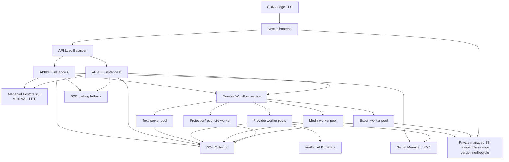

# DES-014 非功能、服务目标、容量、观测、备份与灾备设计

- 状态：proposed
- 版本：v1.0
- 日期：2026-08-14
- 关联需求：CUR-IAM/PRJ/SCR/AST/SBD/KFR/VID/EXP/PLT/CAN/SEC 全部 NFR 和性能/恢复/容量类 AC
- 关联验收：详见 [DES-015](./015-Requirement到Design追踪矩阵.md)
- 上游：[DES-001](./001-目标技术架构与选型.md)、[DES-002](./002-领域模块边界与跨模块契约.md)、DES-003～013

## 1. 问题、范围与非目标

### 1.1 问题

业务 Design 定义了每个模块的性能、完整性、恢复和容量要求，但实现仍需要统一的 SLI 口径、分层降级、部署拓扑、诊断关联、备份/恢复和发布 Gate。否则“页面有响应”可能遮盖事实陈旧，“任务队列可用”可能遮盖 Provider unknown，“备份存在”也可能从未证明能恢复一致业务。

### 1.2 范围

- API/页面/投影/长任务/媒体/导出的 SLI/SLO 和发布 Gate；
- 产品容量、UI 预警、安全硬上限和扩容信号的分离；
- 前端、API、Worker、PostgreSQL、Workflow、对象存储和 OTel 部署拓扑；
- log/metric/trace/audit 边界、告警、诊断 ID 和敏感数据约束；
- 过载保护、partial failure、可恢复故障注入；
- PostgreSQL/对象存储/Workflow/配置的备份、PITR、恢复顺序和灾备演练。

### 1.3 非目标

- 不把 proposed SLO/容量写成对客商业 SLA、套餐限额或赔付承诺；
- 不因可能增长而预建 Kubernetes、多地活、全球分布式数据库或 Kafka；
- 不以加机器解决 Provider 限额、unknown、媒体损坏或业务冲突；
- 不备份 Redis/前端缓存/可重建投影作为业务恢复依据；
- 不将剪辑、成片、商业运营的性能或容量引入当前基线。

## 2. 质量模型与口径

### 2.1 术语

- **SLI**：从真实请求/事件/任务证据计算的指标；
- **SLO**：内部产品目标，proposed 值在基线 PoC 和产品签认前不是 SLA；
- **依赖处理时间**：本平台可控 API/Worker/存储时间；
- **Provider 处理时间**：外部提交到可靠结果，单独统计，不用来粉饰平台延迟；
- **事实可见延迟**：业务事实提交到列表/画布可观察的时间；
- **完整性 SLI**：不是百分位，而是必须 100% 满足的安全/数据不变式。

### 2.2 测量原则

1. 只统计具有明确开始/结束事件的样本，超时/失败不从延迟分母中剔除。
2. 按命令/查询类型、结果、数据规模桶、设备/网络基线统计；不使用对象/用户 ID 作 label。
3. partial/unavailable 是失败/降级结果，不作成功或 0。
4. 原始数据时间、投影时间、页面观测时间分开，以找出真实延迟段。
5. 安全/隔离/完整性成功数必须为 100%，不使用错误预算冲消。

## 3. SLI/SLO 目标表

Requirement 中已给出的阈值为上游事实；本表只统一测量与 Gate。无上游数字的可用性/RPO/RTO 值标记为 proposed，必须经 ADR/NFR 评审接受。

| 路径 | SLI | 目标 | 来源/Gate |
| --- | --- | --- | --- |
| 核心已登录读取 | 非计划维护的有效请求成功率 | 月度 ≥99.5% proposed；降级结果单独统计 | 可用性 ADR，不是外部 SLA |
| Workspace/成员 | 列表/授权/成员列表 P95 | ≤1s / ≤1s / ≤1.5s；权限失效 P95 ≤5s、max ≤15s | CUR-IAM-NFR-002/005 |
| Project 工作台 | 详情/概览、blocker 筛选 P95 | ≤1.5s / ≤1s；95% 投影 ≤5s | CUR-PRJ-NFR-004/005 |
| Scripts | 本地体检/确定性分集、结构首屏 | 100k code points ≤5s；20k 字单集 ≤1.5s；状态 ≤5s | CUR-SCR-NFR-005/011 |
| Assets | 列表、120 Shot 影响预览、24 候选首屏 | ≤1s / ≤2s / ≤2.5s | CUR-AST-NFR-005/006 |
| Storyboards | 36/120 Shot 工作区；保存/重排 | ≤800ms / ≤2s；命令 ≤1s；刷新恢复 ≤5s | CUR-SBD-NFR-002/003/005 |
| Keyframes | 20 候选元数据、4 项已缓存比较、选择命令 | ≤1s / ≤200ms / ≤1s；Task 返回 ≤2s；状态 ≤5s | CUR-KFR-NFR-002～005 |
| Videos | 120 镜就绪摘要、20 候选、选择命令 | ≤2s / ≤1s / ≤1s；批量 Task 返回 ≤2s；状态 ≤5s | CUR-VID-NFR-002～005 |
| Export | 120 镜检查/预检/冻结 | proposed ≤2s / ≤3s / ≤2s；Build ID ≤2s；状态 ≤5s；心跳 ≤10s | CUR-EXP-NFR-002～005 |
| Platform Task | 提交返 Task、列表/详情、状态可见 | ≤2s；列表/详情 P95 目标 ≤500ms；可见 ≤5s | CUR-PLT-NFR-002/003 |
| Canvas | 首个可操作/完整摘要/定位/交互反馈 | ≤2s / ≤5s / ≤1s / ≤100ms；95% 帧无 >100ms 冻结；状态 ≤5s | CUR-CAN-NFR-002/005/006 |
| 安全治理 | 页面决定可见/正式门禁 | 页面 P95 ≤5s；正式边界同步强检 | CUR-SEC-NFR-001/005 |
| 数据请求 | 导出处理状态、删除/匿名化 | 无 blocker 时 ≤24h 形成状态；≤30 日完成或显示新 blocker/日期 | CUR-SEC-NFR-006 |
| 完整性/隔离 | 媒体/Package/hash/Manifest、跨空间、敏感泄露 | 符合率 100%；跨空间和敏感泄露成功数 0 | 各模块 Integrity/Security NFR |
| 无障碍 | WCAG/P0 键盘/列表等价 | WCAG 2.2 AA；不仅靠颜色/动画；画布不可用时 P0 完整 | 各模块 Accessibility NFR |

容量基线、测试设备、网络、冷/热缓存和数据生成器版本必须随测试报告固定，否则不可比较。

## 4. 容量模型与资源保护

### 4.1 三种边界

| 边界 | 事实所有者 | 用途 |
| --- | --- | --- |
| 产品签认容量 | 模块 Requirement + 真实样本 PoC | 保证完整交互/性能的范围；不是套餐 |
| UI 预警阈值 | 模块产品设计 | 低于签认容量，提示折叠/缩小范围/等待；不是安全拒绝 |
| 安全硬上限 | DES-013 威胁模型/组件限制 | 防止 DoS、解析器/存储异常；超出时安全拒绝，不冒充产品容量 |

### 4.2 proposed 容量数据集

| 范围 | proposed 样本 | UI 预警 |
| --- | --- | --- |
| Project | 10 Episode，每集 120 active Shot | 8 Episode 或任一集 100 Shot |
| Scripts | 整剧 100,000 code points；单集 20,000 字；单集 500 NarrativeUnit | 以真实分布固定 |
| Assets | 300 Asset/项目；10 State/Asset；20 图片候选/State | 待真实项目 PoC |
| Storyboards | 120 active Shot/集；500 NarrativeUnit；20 AssetRef/Shot | 画面只加载当前区域 |
| Keyframes | 20 Candidate/Shot；2 Slot/Shot；20 VisualReference | 16 Candidate/Reference |
| Videos | 120 Shot/集；20 Candidate/Shot | 100 Shot 或 16 Candidate |
| Canvas | 上述 120 Shot 全链；600 同时可见 Node/900 Edge | 真实 PoC 签认；超出主动聚合/折叠 |
| Export | 120 原始视频/20 GiB 单包 | 100 Shot 或 16 GiB；超签认容量明确阻断，不静默拆包 |

上述样本在开放问题关闭前只是验证输入。每次增加容量先定位约束在查询、渲染、Provider 限额、Worker、字节吞吐或存储，不盲目统一调大上限。

### 4.3 扩缩容与 backpressure

| 单元 | 主信号 | 保护 |
| --- | --- | --- |
| frontend | 请求、SSR/静态缓存、客户端错误 | 静态资产 CDN；画布数据不嵌入大媒体 |
| api | P95/P99、CPU/内存、DB pool、SSE 连接 | 有界超时/分页、每请求并发限制、连接泄漏监测 |
| text worker | queue age、能力在途、Provider 限额 | 按 Capability 隔离并发；无限额时不无限扩容 |
| provider worker | waiting/submitting/unknown age、rate limit | 按 Provider/Capability 独立并发/熔断窗口；unknown 不进重试队列 |
| media worker | 待下载字节、吞吐、probe 延迟、quarantine | 字节/文件并发限制、流式 hash、解析器资源上限 |
| export worker | PackageBuild age、在途字节、存储带宽 | 每 Workspace/全局大包并发；ZIP64 流式；不加内存拼包 |
| projection worker | Outbox/Inbox age、投影延迟 | 分区更新、重建限流；不阻塞同步业务事务 |

过载在外部提交前返回 `capacity_limited`/waiting 和 current/limit/next action；不创建孤立预占，不用无限队列延后失败。

## 5. 目标部署拓扑



- 首发使用托管容器/应用平台，不需 Kubernetes；计算实例无业务本地持久状态。
- API 至少两实例、多可用区托管 PostgreSQL 和私有对象存储为目标生产拓扑；非生产可单实例但不用于可用性验收。
- Worker 使用同一 TypeScript 代码/镜像的不同启动角色，按真实任务类型扩容；不拆业务微服务。
- Redis 如在 SSE fan-out/限流/热点缓存 PoC 后引入，不参与 Task/主选/媒体/导出/幂等的恢复。
- 单 Worker 池故障不使其他模块历史只读整体不可用；新外发、媒体或导出只降级相应能力。

## 6. 可观测性设计

### 6.1 OpenTelemetry 关联

API、Worker、Workflow Activity、Provider Adapter、媒体、投影和导出统一使用 OTel SDK/Collector。每个跨边界契约传递 W3C trace context、`request_id`、`correlation_id`、`causation_id`；耐久事实另保存稳定业务关联，不依赖 Trace 保留周期。

```text
actor/workspace → request/command → outbox/inbox
→ task/workflow/attempt/provider job → media/lineage/cost
→ candidate/selection → canvas projection
→ export snapshot/package build → governance/audit/diagnostic
```

### 6.2 信号边界

| 信号 | 用途 | 禁止 |
| --- | --- | --- |
| Trace | 跨服务/任务延迟和错误路径 | 完整剧本/Prompt、签名 URL、Provider 原响应、媒体字节 |
| Metric | SLI、容量、延迟、错误、age/backlog、完整性计数 | User/Workspace/Project/Task/Media ID 或名称、Prompt 作 label |
| Structured log | 受控事件、错误码、revision、stage、脱敏诊断 | 凭据、授权头、临时 URL、正文/证明原文、完整 Provider payload |
| Audit | 高风险业务/安全决定的长期追溯 | 代替 Debug log 或记录敏感原文 |

日志经 SDK 构造而非字符串拼接，对已知 Secret/授权头/URL 模式做输出端二次清洗；敏感日志测试使用 canary value 验证全信号链出现数为 0。

### 6.3 核心指标和告警

- API：request rate/error/duration、DB pool wait、transaction conflict、SSE active/reconnect/gap；
- 可靠交接：Outbox age/publish error、Inbox duplicate/error、dead-letter age、projection lag/rebuild；
- Task/Provider：queue/stage age、submit/poll/callback、unknown age、cancel outcome、rate limit、reserve not converged；
- Media/Export：inbound bytes、download/probe/quarantine、hash mismatch、PackageBuild age/throughput/heartbeat、download range/error；
- Governance/IAM：auth failure/revocation lag、gate result/unavailable、Profile/review age、cross-workspace deny/success、audit missing；
- DR：backup/PITR lag、object versioning/replication lag、restore drill age/result、deletion tombstone replay failure。

告警分为：用户影响页（核心错误/新鲜度持续超阈值）、自动工作票/日间处理（近阈值/backlog）和仅 Dashboard 容量趋势。“一个 Task 失败”不默认叫醒；系统性 unknown/Media integrity/跨空间成功/审计缺失必须立即升级。

## 7. 错误预算、发布 Gate 与降级

### 7.1 错误预算提案

只对经评审的 availability/latency SLO 计算滚动 28 日错误预算。如果预算在 1h/6h 窗口高速消耗，暂停无关发布并优先修复；完整性、隔离、越权和敏感泄露没有可消耗预算，任一成功绕过均阻断发布/升级。

### 7.2 发布必需证据

- Requirement→Design→Test 追踪无缺口，OpenAPI/事件 Schema 无漂移；
- 本变更所影响 SLO/Integrity/Security 契约测试通过；
- 数据库迁移在空库/上一版本可演练，回滚/前滚策略明确；
- 长任务/媒体/导出变更通过关键 kill point 和幂等故障测试；
- Secret/SBOM/漏洞/镜像/日志隐私扫描无未处置 blocker；
- 任一外部条件缺失/测试跳过标记为未验证，不报告通过。

### 7.3 降级矩阵

| 依赖故障 | 仍可用 | 禁止/显示 |
| --- | --- | --- |
| 某 AI Provider | 历史项目/任务/候选/媒体只读 | 该 Capability 新提交 unavailable；不切未验证 Provider |
| Workflow/Worker | 同步只读与不依赖长任务的编辑 | 新长任务阻断/明确等待；旧 Task 不伪 failed |
| 投影/SSE | 拥有模块 Query、列表/详情 | 项目/Canvas 分区 stale/partial；轮询恢复 |
| 对象存储 | 结构化事实/媒体摘要可读 | 上传/预览/下载/导出 unavailable；不标媒体丢失直到证据确认 |
| Governance/KMS/Secret | 不涉及新敏感副作用的历史只读 | 新外发/主选/Freeze/下载 fail closed |
| PostgreSQL primary | 已加载的非敏感本地 UI 状态 | 所有服务端事实读写不可用；不以 Redis/页面缓存继续写 |

## 8. 备份、保留与灾备分级

### 8.1 数据耐久性类别

| 类别 | 数据 | 恢复策略 |
| --- | --- | --- |
| A 不可替代事实 | PostgreSQL 业务版本/决定/Task/Selection/Snapshot/Audit；原始 MediaVersion 字节 | 持续 PITR + 加密备份；对象版本/删除保护；恢复后一致性校验 |
| B 可重建但昂贵 | 缩略图/预览、Canvas/Production 投影、过期前包字节 | 可备份或从 A 类固定输入重建；明确恢复时间 |
| C 可丢失 | Redis/cache、SSE fan-out、临时草稿副本、本地工作目录 | 不备份为事实；清空后从 A/B 恢复 |

### 8.2 RPO/RTO 提案

| 类别 | proposed RPO | proposed RTO | 关闭条件 |
| --- | --- | --- | --- |
| PostgreSQL A 类事实 | ≤15 分钟 | ≤4 小时 | 托管 PITR、跨可用区故障切换与一致性演练 |
| 原始媒体 A 类 | 对已确认 ready 对象目标 ≤15 分钟 | ≤8 小时 | 对象版本/跨故障域或独立备份的成本与地域 PoC |
| B 类派生/包字节 | ≤24 小时或可重建 | ≤24 小时 | 重建吞吐、固定输入存在和保留策略 |
| Secret/配置/迁移产物 | ≤24 小时 | ≤4 小时 | KMS/Secret Manager 恢复、轮换和审计演练 |

这些数字是工程提案，不是已接受承诺。必须在媒体规模/地域、成本、对象存储版本/复制能力和业务丢失可接受度评审后用 ADR-DR-001 签认。

### 8.3 备份设计

- PostgreSQL：托管多可用区、连续 WAL/PITR、每日自动快照；备份密钥/账号与主应用权限隔离；
- 对象存储：object versioning、延迟删除/生命周期、存储级加密、inventory；是否跨区复制由 ADR-DR-001；
- Workflow：管理服务的 persistence/retention 恢复策略必须验证；即使 workflow history 丢失，PostgreSQL Task/Attempt 仍能导出 reconcile/manual action；
- 配置：经评审的 IaC/应用配置/迁移/能力 Catalog 版本保存于 Git/Artifact Registry；Secret 只由 Secret Manager 版本恢复；
- Audit/Deletion：Audit、deletion tombstone 和高风险 access restriction 除常规备份外，还进入权限隔离的追加恢复日志；恢复库在开放访问前从该日志重放恢复时点后已删/限制事实；
- Redis/cache、本地日志、临时 URL、Provider 临时输出不作备份真相。

## 9. 恢复顺序与一致性审计

### 9.1 恢复顺序

1. 隔离故障环境，冻结新 Provider 副作用/导出/删除，保存事件时间线。
2. 恢复 KMS/Secret/config 最小读权限，不用旧明文备用值。
3. 在隔离网络恢复 PostgreSQL 到目标 PITR，执行 schema/约束/引用/审计一致性检查。
4. 恢复/校验对象存储 inventory，逐个 ready MediaVersion/PackageBuild 对比 object version、size、SHA-256；不用 current 替换缺失版本。
5. 从权限隔离的追加恢复日志、权威身份源和受控安全证据中，重放恢复时点之后的 Membership removed、rights/security restriction、deletion tombstone/legal hold 等必需事实。
6. 重建 Outbox/Inbox/Production/Canvas 投影，可重建缓存置空；检查重放不产生副作用。
7. 对 queued/running/waiting_external/unknown Task 与 Provider 对账，不因 Workflow 内部状态丢失盲发。
8. 先开只读，验证 Workspace 隔离、主选/快照/媒体完整性、治理门禁，再分步开写和外部副作用。

### 9.2 恢复后不变式

- active Workspace 仍恰有有效 owner；跨 Workspace 引用为 0；
- current Script/Asset/ShotSpec/Selection 唯一约束成立；
- StoryboardBaseline、Candidate、ExportSnapshot 的不可变 hash/引用不漂移；
- ready MediaVersion 有可读固定 object version、size/hash/probe；缺失项进明确 unavailable/quarantine；
- WorkTask/Attempt/Cost 无重复外发/重复结算；unknown 保留；
- GovernanceDecision/Audit/LegalHold/Deletion 恢复且高风险新动作 fail closed；
- Export Build 只读固定 Snapshot，不从恢复后 current 补齐。

## 10. 恢复、容量与可靠性验证

### 10.1 持续测试

- 每个 PR：单元/集成/契约/架构/安全、重复命令/事件、数据库约束、日志敏感 canary；
- 定时：容量数据集的查询/前端/画布/打包压测，备份成功/新鲜度和依赖漏洞扫描；
- 真实 Provider Gate：经费受控、明确地域/账号、记录样片和用量，不在普通 CI 默认消耗。

### 10.2 故障注入矩阵

| 故障点 | 期望 |
| --- | --- |
| API 在 DB commit 前/后退出 | 前者零事实，后者原幂等键回读 |
| Outbox 重复/乱序/延迟 | 不重复 Task/Candidate/Selection/Cost；投影最新修订不被覆盖 |
| Worker 在 Provider submit 前/中/后退出 | 已可能外发进 unknown/对账，不盲发 |
| Webhook 重复/乱序/伪造 | Inbox 幂等；伪造拒绝；无矛盾终态 |
| 媒体下载/探测/登记中断 | 恢复同 output slot，不重新生成；未验证不 ready |
| SSE/Canvas patch 丢失 | 检测游标缺口后重读；列表完整可用 |
| Export 第 N 文件中断 | 同 Snapshot 恢复/重建；无残缺 ready 包 |
| Governance/KMS 中断 | 新高风险副作用 fail closed；历史只读降级 |
| PITR + 对象存储恢复 | 达到已签认 RPO/RTO；所有 9.2 不变式通过 |

### 10.3 演练频率提案

- 每月自动恢复最新 PostgreSQL 备份到隔离环境并跑一致性审计；
- 每季度完成 PostgreSQL + 对象存储 + Workflow + deletion tombstone 的全链恢复演练；
- 每次重大存储/工作流/加密/保留变更后增加专项演练；
- 频率、负责人和成本在运行 Plan 中签认；未实际演练不得报告 DR ready。

## 11. 权限、安全与运行分离

- 应用、迁移、备份、恢复、审计查询和 KMS 使用不同最小权限身份；应用不能删备份/改恢复证据。
- 生产诊断和恢复访问必须按工作需要、时限、审计和最小字段；不复制生产敏感数据到普通测试环境。
- 备份与对象复制保持数据地域/权利约束；跨地域前重做 DataProcessing/Rights 评审。
- 运行文档不记录凭据、完整剧本/Prompt/媒体或可长期访问 URL；演练使用脱敏/合成 fixture。

## 12. 验证 Gate 与待决策

### 12.1 Gate

| Gate | 必须证据 |
| --- | --- |
| NFR-baseline | 各 Requirement NFR 有测试口径、数据集、设备/网络、结果和负责人 |
| Observability | 一次真实生成与导出能跨 API→Task→Provider→Media→Selection→Snapshot 追溯；敏感 canary 为 0 |
| Capacity | 模块 proposed 数据集通过，超出时显式聚合/降级/阻断，无假死/静默丢数据 |
| Recovery | 故障注入矩阵无重复副作用/残缺 ready 事实，自动或 manual action 明确 |
| Backup/DR | 隔离恢复完成，达到已接受 RPO/RTO，9.2 不变式全部通过 |
| Accessibility | 所有 P0 列表/画布/播放/下载路径 WCAG 2.2 AA 和仅键盘验收 |

### 12.2 待决策

| 问题 | 当前建议 | 关闭点 |
| --- | --- | --- |
| 月度可用性 SLO | 99.5% proposed，先建立真实基线/错误预算 | NFR 评审 + 试运行数据 |
| PostgreSQL/媒体 RPO/RTO | 按 A/B/C 类别分层，不用一个数 | ADR-DR-001/全链恢复 PoC |
| 对象跨区复制 | 不默认开启；以地域、权利、成本和媒体 RPO 决策 | ADR-004/DR-001 |
| Redis | 只在 SSE fan-out/限流 PoC 证明必需时引入 | ADR-006 |
| 是否 Kubernetes | 当前拒绝；托管容器平台无法达到已签认扩容/可用性时再评估 | 真实运行证据 |
| 观测后端/保留 | OTel 契约先固定；托管产品/保留按成本、隐私和诊断窗口选择 | Observability ADR |

## 13. 变更记录

| 版本 | 日期 | 变更 |
| --- | --- | --- |
| v1.0 | 2026-08-14 | 统一模块 NFR 口径、proposed SLO/容量、模块化单体部署、OTel、降级、备份/灾备、RPO/RTO 与恢复不变式 |
