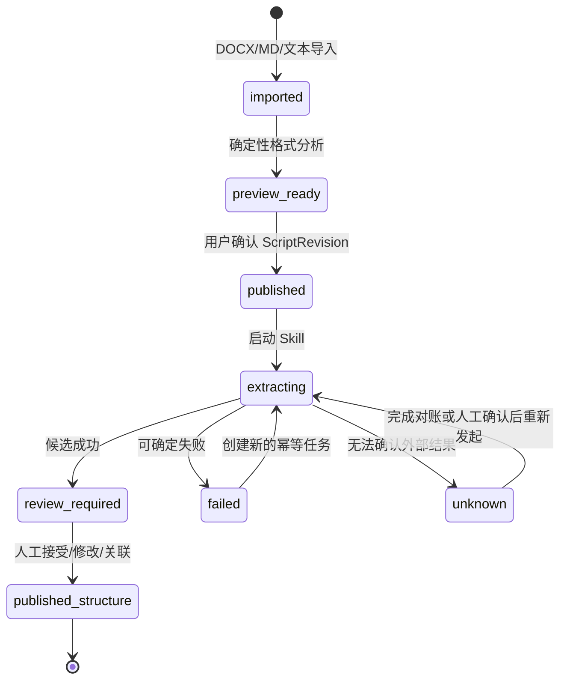

# Agent Harness 与 MVP 业务闭环设计

- 文档 ID：DES-017
- 状态：proposed
- 适用阶段：MVP
- 上游：CUR-00、CUR-SCR、CUR-AST、CUR-PLT、CUR-SEC
- 目标：在不建设画布和通用工作流编排器的前提下，先跑通剧本导入、深度解析、剧集/场景/资产候选审核和后续生产任务的可恢复闭环

## 1. 结论

MVP 采用“领域业务流 + LangGraph Agent Harness”的模式，不采用画布驱动业务，也不把 LangGraph 当作第二套产品任务系统。

现有 `WorkTask + Outbox/Inbox + RabbitMQ + PostgreSQL` 继续负责长任务持久化、消息投递、重复消费、失败和未知状态。LangGraph 负责一次 Skill 内部的状态图编排：输入校验、模型调用、结构化校验、候选门禁和后续可扩展的人工中断。Agent Harness 负责把这些图运行约束统一封装起来。

```text
项目
  → 导入 DOCX/MD/纯文本
  → 文档格式校验与预览
  → 发布 ScriptRevision
  → 确定性分集规划与剧集预览
  → 用户确认后创建项目剧集
  → 启动 script-structure-extraction Skill
  → 生成剧集摘要/场景/对白/人物/世界观/资产/镜头候选
  → 人工接受、修改、关联或忽略
  → 形成正式叙事/资产/分镜对象
  → 进入已有生成任务和候选选择流程
```

## 2. 当前范围

### 2.1 MVP 必须完成

- DOCX、Markdown 和纯文本进入同一文档导入入口；
- 导入后先完成确定性格式分析并可预览，不自动创建正式业务对象；
- ScriptRevision 作为 AI Skill 的固定输入版本；
- `script-structure-extraction` 作为第一个受控 Skill；
- 深度解析结果必须覆盖剧集摘要、场景、对白、人物档案、世界观规则、可复用资产、镜头和场景级生产任务建议；
- 剧集边界以原文显式分集标记和确定性文档分析为事实来源，模型只补充摘要和语义，不决定或改写正文边界；
- Skill 输出只能进入候选表，不得直接覆盖正式资产、分镜或当前选择；
- 复用已有 Task、Outbox、Inbox、RabbitMQ 和 Worker 完成异步执行；
- 结构化输出必须通过 Pydantic 契约和业务范围校验；
- 记录 Skill 名称、版本、输入 hash、trace_id、错误码和下一动作；
- 本地开发默认通过 Codex Python SDK 启动 `codex app-server`，使用只读沙箱、拒绝工具审批和临时线程；DeepSeek 仅作为显式备用 provider；
- 超时、响应未知、结构化输出非法、服务拒绝和限流均能映射到可观察任务状态；
- 现有项目页面可以按照业务状态继续推进，不依赖画布。

### 2.2 MVP 非目标

- 无限画布、节点、连线、自动布局和画布状态；
- 任意技术节点或用户自定义工作流编排；
- Agent 直接读写数据库、文件系统、密钥或任意项目资源；
- 自动接受 AI 候选、自动主选、自动导出或自动覆盖正式对象；
- 独立 Durable Workflow 服务、Agent 社区、Skill 市场和工作流分享；
- 以 Agent Harness 取代领域模块、任务状态机或治理门禁。

## 3. 分层边界

| 层 | MVP 责任 | 不承担 |
| --- | --- | --- |
| 业务模块 | 文档、脚本版本、候选、资产、分镜和人工决定 | Provider 调用细节 |
| Platform Task | Task、Attempt、Outbox、Inbox、重试/未知状态和任务查询 | Prompt 和候选业务语义 |
| Agent Harness（LangGraph） | Skill 版本、状态图、输入边界、结构化输出、超时和统一错误 | 数据库提交、正式对象创建、任意工具权限 |
| Provider Adapter | DeepSeek 等模型调用、供应商错误映射 | Task、资产、主选和成本事实 |
| UI | 导入预览、启动 Skill、查看候选和人工审核 | 直接修改任务终态或绕过后端校验 |

## 4. Agent Harness 契约

每一次 Skill 执行必须绑定：

- `skill_name`：稳定的能力标识；
- `skill_version`：提示词、输出 schema 和实现共同组成的版本；
- `input_hash`：固定输入正文或规范化 payload 的 SHA-256；
- `trace_id`：贯穿 API、Outbox、Worker 和 Provider；
- `output_schema`：Pydantic 结构化输出类型；
- `allowed_tools`：本次 Skill 可使用的工具集合，MVP 默认为空；
- `timeout_seconds` 和单次模型调用的 Chunk 长度上限；整稿不以模型上下文上限拒绝，长稿由 Harness 分块调度；
- `candidate_only`：MVP 所有剧本解析 Skill 必须为 true。

Harness 的成功条件是“返回符合契约且通过领域边界校验的候选结果”，不等于正式业务对象已创建。

### 4.1 LangGraph 图结构

MVP 的每个 Skill 使用显式 `StateGraph`，而不是在 Provider 类中手写隐式顺序。短文本仍可走单块图；达到长剧本阈值时，剧本结构 Skill 使用可恢复的 fan-out / 聚合图：

```text
START
  → validate_input
  → segment_script
  → fan_out_chunks
  → extract_chunk × N
  → aggregate_candidates
  → validate_output
  → candidate_gate
  → END
```

`segment_script` 依据确定性文档块和分集/场景边界生成有全局字符范围的 Chunk；`extract_chunk` 只接收一个 Chunk，输出局部范围候选；`aggregate_candidates` 将范围映射回整稿、限定候选 key、去重跨集资产、合并同集摘要和世界观事实，并保留场景/对白/镜头/连续性候选。剧集摘要使用 `continuity(scope=episode)`，世界观使用 `continuity(scope=world)`，人物和其他可复用身份使用 `asset`，因此不增加新的数据库候选枚举。这样长稿不会因为单次上下文或响应上限而被截断，也不会把整稿一次调用失败误判为局部成功。当前没有 `MAX_SCRIPT_CHUNKS`、整稿字符数、集数或单集字符数这类业务上限，只有单 Chunk 的 provider 保护阈值；媒体上传仍受统一对象存储字节保护，DOCX 解压仍有压缩炸弹防护，这些是基础设施安全边界而不是剧本业务上限。图支持注入 LangGraph checkpointer；MVP 默认不把它作为第二套业务事实，仍由领域 Task 持有运行结果。

本地 Codex 适配器不连接当前桌面聊天窗口，而是由 I/O Worker 通过官方 Python SDK 管理一个本机 `codex app-server` stdio 进程。每个 Chunk 使用临时线程，`Sandbox.read_only`、`ApprovalMode.deny_all` 和严格 JSON Schema；适配器自身以并发信号量保护 app-server 队列。这样后端可直接复用本机 Codex 登录态，同时保持 Skill 无数据库写入和无文件写入权限。

图中的状态只保存当前执行所需的结构化数据；业务任务、候选、正式资产和人工决定仍由 Lanverse 模块持有。`scene` 候选必须包含分集号、场景序号、叙事目的、出场角色、道具/环境、连续性提示和建议的制作任务；确认正式场景时，这些内容保存到 `semantic_context`，不因候选确认而丢失。`asset` 候选负责跨 Chunk 的角色、地点、道具、服装、声音与风格身份，其中角色可携带目标、关系、外观、声音和角色弧光；`continuity(scope=episode)` 负责分集标题、logline、摘要和场景引用；`continuity(scope=world)` 负责世界观事实、规则、实体和主题。`shot` 候选负责后续分镜草案所需的镜头目的、构图/运动、视觉提示和资产绑定建议。制作任务建议只作为候选事实，审核后再由领域 Task 命令创建真实任务。

需要人工确认的高成本动作后续使用 LangGraph `interrupt()`，并通过可注入的 checkpointer 恢复；当前剧本候选审核仍由既有业务 API 完成，不在 Worker 内等待用户。

### 4.2 真实剧本验收样本

当前验收样本为 `He Left Our Kids to Drown—He Didn’t Know I Was the Empress.docx`，提取后为 139,723 个字符（140,565 UTF-8 字节），包含 60 个显式分集标记、131 个场景头和 3,981 个确定性文档块。解析 Skill 至少必须满足：

1. 文档预览不因旧的整稿字符数、单集字符数或集数上限被拒绝；
2. 确定性分段保留 60 个分集边界和 131 个场景边界的全局 source range（包括 `I/E.` 场景头）；
3. Skill 以 Chunk 执行并聚合；该样本实际生成 121 个 Chunk，最大 Chunk 为 3,837 个字符，不向模型发送超过单 Chunk 上限的整稿；
4. 聚合结果中每个显式分集都有 `continuity(scope=episode)` 摘要；场景、对白、资产、镜头、世界观和连续性候选均可追溯到原文范围；
5. 跨集重复角色/地点/道具不会生成无限重复的资产候选，角色资产保留跨集出现信息和人物档案；
6. 任一 Chunk 失败时整体任务进入明确的 failed/unknown，不提交部分成功的正式候选。

### 4.3 错误分类

| Harness 错误 | 任务结果 | 用户下一动作 |
| --- | --- | --- |
| `agent_output_invalid` | failed | 修复输入或重新发起解析 |
| `agent_input_invalid` | failed | 修复输入版本 |
| `agent_timeout` | unknown | 等待对账或人工重新发起 |
| `agent_provider_unavailable` | unknown/failed | 检查服务后重试 |
| `agent_provider_rejected` | failed | 配置或更换已验证能力 |
| `agent_tool_denied` | failed | 修改 Skill 配置，不允许绕过 |

未知状态不自动生成第二次外部请求；安全重试必须由现有 Task 命令创建新任务。

## 5. 业务闭环状态



解析候选与正式对象之间必须存在明确的人工决定。解析成功只代表候选完整可审阅，不代表角色、场景、镜头已经正式生效。

## 6. 现有代码的复用和调整

- 复用 `backend/app/modules/production` 的 Task 状态与命令；
- 复用 `backend/app/modules/messaging` 的 Outbox/Inbox 和 Worker 交接；
- 复用 `backend/app/modules/scripts/documents` 的文档 revision 与确定性分析；
- 复用 `backend/app/modules/scripts/extractions` 的候选、决定和结果入库；
- 将 `backend/app/integrations/deepseek.py` 的剧本解析调用接入 LangGraph Harness；
- 当前不新增 AgentRun 数据表，Skill 执行事实由现有 Task、Attempt、审计和固定输入 hash 组合表达；
- Episode Planning 继续作为剧集创建门禁；显式分集直接由确定性分析生成预览，确认后批量创建正式 Episode。旧的 10 集、整稿字符数和单集字符数业务上限已从最终 ORM/契约中移除；单 Chunk 和底层媒体安全边界仍保留。

## 7. 验收门禁

1. 同一个 Skill、同一个输入 hash 和同一个幂等键不会生成第二个业务任务。
2. 模型返回非法 JSON 或不符合 schema 时，不产生正式候选，不进入成功状态。
3. 模型超时或连接结果未知时，任务进入 `unknown`，不会自动重复外发。
4. 解析结果中越界的 source range、无效候选引用和重复 candidate key 必须失败。
5. 候选审核可以接受新对象、带修改接受、关联已有对象或忽略，且并发 revision 冲突不会覆盖他人决定。
6. Worker 重启、重复消息和重复回调不产生第二批候选、第二个 Task 或第二次审计事实。
7. DOCX、Markdown 和纯文本经过预览后使用同一个 ScriptRevision/Extraction 流程。
8. 本机 Codex 可用时，默认使用 `codex_local` 完成结构解析；关闭本机 Codex 后可显式选择 DeepSeek 或 disabled，服务仍能完成导入预览，只有启动 AI Skill 时明确提示能力不可用。
9. 用户确认结构后，正式场景仍保留故事节拍、人物、道具、环境、连续性和场景级生产任务建议；这些建议不会被误报为已经创建的生产任务。

## 8. 后续演进

当 MVP 通过真实项目和故障测试后，再评估：

1. 将脚本适配、分镜草案和关键帧 Skill 统一迁移到 Harness；
2. 增加有限的领域工具白名单和人工确认提议；
3. 为需要跨多次用户交互的 Skill 接入生产级 LangGraph checkpointer，并评估是否需要独立 Durable Workflow；
4. 最后再评估 LibTV 风格的项目画布作为同一领域事实的只读/操作投影。
