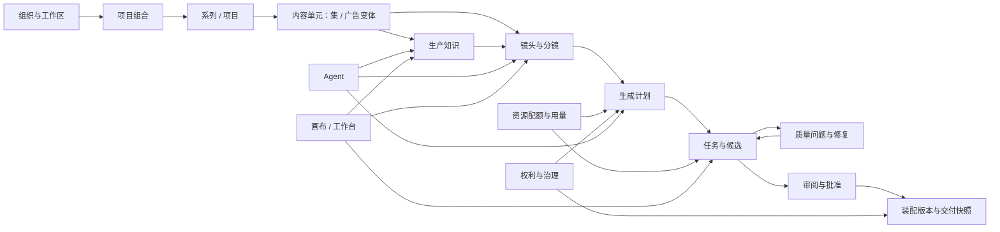
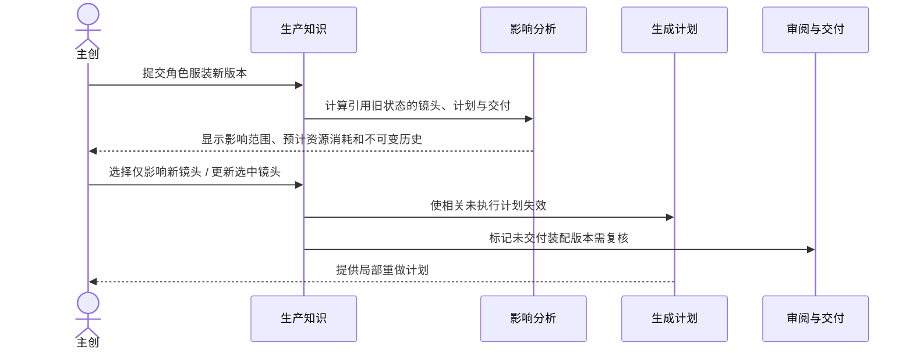
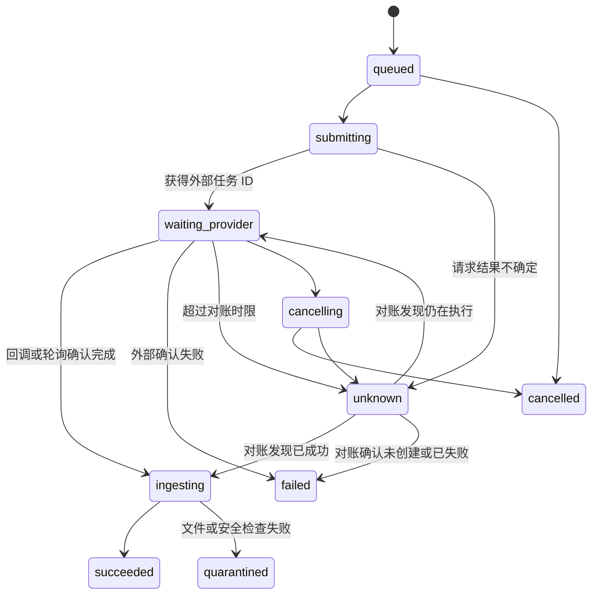

# AI 视频生产平台目标产品与功能模块设计

> 状态：提案 v4，待产品评审
> 日期：2026-08-20
> 设计方式：从目标出发重新设计（绿地方法）
> 重要声明：本文不继承现有项目中的需求、模块边界、对象模型、接口或路线图

## 1. 设计结论

产品应被设计成“连续短内容的 AI 原生生产操作系统”，而不是模型聚合站或全自动成片黑盒。

系统以结构化生产知识为底座：Agent 负责从目标或脚本生成第一版可审阅方案，工作台和画布负责精确检查、覆盖与局部重做。任何一次生成都必须属于明确的项目、镜头、输入版本和资源计划；任何一次交付都必须能复现其素材、选择、审核和权利依据。

第一阶段的最小闭环是：

> 导入创意或脚本 → 校对结构与设定 → 生成镜头方案与低消耗预演 → 审批批量生成计划 → 生成和比较候选 → 定位质量问题并局部修复 → 审阅批准 → 装配与导出。

v2 进一步明确：`GenerationPlan` 只表达被批准的执行意图，`Operation/GenerationJob` 才表达运行状态；`DeliverySnapshot` 只在渲染和校验全部结束后创建。产品不能用一套对象同时表达“计划内容、执行进度和最终交付”。

## 2. 产品定义

### 2.1 目标用户

| 用户 | 核心任务 | 当前主要痛点 | 平台提供的结果 |
| --- | --- | --- | --- |
| AI 导演/主创 | 把创意变成连贯的镜头内容 | 在多个工具间复制设定、提示词和素材 | 一套可控制、可局部修改的项目方案 |
| 分镜/视觉设计师 | 设计镜头并维护角色、场景和风格 | 参考关系隐式、变化难传播、版本混乱 | 显式实体状态、参考绑定和影响分析 |
| AI 制作操作员 | 批量生成、筛选并重做素材 | 模型能力、失败和资源消耗不可预测 | 可预检计划、统一任务状态和局部修复 |
| 制片人 | 控制进度、资源上限、版本和交付 | 看不到返工消耗和项目真实状态 | 镜头级进度、用量归因和审批门禁 |
| 审片人/客户 | 在正确版本上提出可执行反馈 | 评论脱离时间点、版本和责任对象 | 绑定镜头、时间码与版本的审阅决定 |
| 组织管理员 | 管理成员、权利、模型和数据范围 | 权限、外部模型条款和审计分散 | 组织策略、能力准入与完整审计记录 |

### 2.2 北极星指标

**每周完成审阅或导出的多镜头项目数。**

该指标要求平台同时解决结构化、生成、修改、协作和交付，避免被“生成次数”这样的虚荣指标误导。

### 2.3 关键结果指标

| 指标 | 定义 | 目的 |
| --- | --- | --- |
| 首个可审阅初稿时间 | 从完成导入到首个覆盖目标范围的预演版本 | 衡量 Agent 与流程效率 |
| 首轮候选采用率 | 未进行额外生成即被选中的镜头候选占比 | 衡量计划与提示质量 |
| 连续性一次通过率 | 首轮审片中无高严重度连续性问题的镜头占比 | 衡量知识与参考绑定质量 |
| 局部返工比例 | 返工时只重做受影响镜头或区段的次数占比 | 衡量可控性 |
| 每交付分钟外部资源消耗 | 交付所用模型秒数、额度或实际调用消耗除以交付时长 | 衡量系统资源效率 |
| 失败与未知消耗率 | 失败、重复或未知结果产生的资源消耗占比 | 衡量执行治理 |
| 资产/模板复用率 | 使用已批准资产状态或模板的项目占比 | 衡量组织知识积累 |
| 审批周转时间 | 发起审阅到得到决定的中位时长 | 衡量协作闭环 |

### 2.4 产品原则

1. **结构先于生成**：先校对人物、场景、节拍和镜头，再执行高消耗任务。
2. **提案不等于事实**：AI 输出默认为提案；只有明确批准后才成为当前版本。
3. **选择不等于排序**：模型评分和系统推荐不能替代用户的采用决定。
4. **所有变更可追踪**：不原地覆盖已批准版本或已交付快照。
5. **高消耗动作先计划**：预计用量、输入、模型、参考、风险和降级路径必须可见。
6. **未知是一等状态**：外部请求超时后不伪装成失败，也不盲目重试。
7. **变更影响可计算**：更改上游设定前先显示受影响镜头、计划和交付。
8. **权利先于调用**：外发素材与交付前都必须通过权利和组织策略检查。

## 3. 范围与非目标

### 3.1 系统范围

- 连续短剧、广告系列、品牌内容和栏目化短视频。
- 从创意/脚本到可审阅初稿、候选生成、局部修复和交付包。
- 图像、视频、语音、音乐和字幕的统一生产记录。
- 组织内协作、资源用量、权利、审计和模板复用。
- 可替换的多模型执行能力，但不追求接入数量。

### 3.2 非目标

- 替代 Premiere、DaVinci Resolve 等完整专业非线性编辑系统。
- 自动发布到所有内容平台。
- 建设公开模板或模型交易市场。
- 训练通用基础模型。
- 提供任意代码节点或无限制自动化脚本。
- 以“一句话无审阅生成并发布整季内容”为承诺。
- 制定定价、收费、订阅、营收、渠道增长或融资计划。
- 建设客户账单、发票、支付和套餐销售系统。

本文出现的“用量、估算、上限和消耗”只用于控制昂贵的模型与媒体任务、防止失控重试并支持系统运维，不代表商业计费设计。

## 4. 产品信息架构

### 4.1 一级导航

| 导航 | 主要内容 | 不包含 |
| --- | --- | --- |
| 首页 | 待处理审批、异常、项目进度、用量风险 | 纯粹的生成作品瀑布流 |
| 项目 | 系列、分集/变体、成员、目标和交付 | 脱离项目的长期事实 |
| 资产库 | 组织和项目资产、实体状态、参考与来源 | 未经归档的临时候选 |
| 模板 | 已批准的项目、风格、镜头和规则模板 | 公共市场内容 |
| 资源用量 | 配额、估算、预留、实际消耗和异常 | 定价、订阅、发票或支付 |
| 管理 | 成员、角色、模型准入、权利和审计 | 日常创作操作 |

### 4.2 项目内工作区

项目内提供五种互补视图，它们读取同一批领域对象：

1. **概览**：目标、范围、进度、风险、资源消耗和待决定事项。
2. **结构**：脚本、场景、人物、道具、世界规则和版本差异。
3. **画布**：实体、镜头、参考、候选和问题的空间化关系视图。
4. **镜头表**：适合批量检查、筛选、分配、生成和修改。
5. **审阅/装配**：按播放顺序审片、评论、批准并生成交付快照。

画布是投影和操作界面，不拥有第二份业务数据；删除画布节点不等于删除领域对象，除非用户执行明确的领域删除命令。

## 5. 端到端生产流程

### 5.1 首稿流程

| 阶段 | 用户动作 | 系统动作 | 必须产生的可审查结果 |
| --- | --- | --- | --- |
| 1. 建项 | 选择目标、格式、时长、语言和资源上限 | 初始化项目约束 | 项目简报版本 |
| 2. 导入 | 上传脚本/故事/品牌简报或输入创意 | 解析文件并提取结构 | 来源版本、解析报告、结构化提案 |
| 3. 校对设定 | 合并实体、补充角色/场景/风格 | 检查冲突和缺失 | 已批准生产知识版本 |
| 4. 规划镜头 | 接受 Agent 拆解或手工编辑 | 生成节拍、镜头和依赖 | 镜头方案版本、覆盖率和风险 |
| 5. 低消耗预演 | 选择分镜草图或低清预览 | 编译提示并执行低消耗计划 | 可播放、可批注的预演版本 |
| 6. 批量计划 | 选择目标镜头、质量和截止时间 | 路由模型、估算用量、检查权利 | 可批准的生成计划 |
| 7. 生成筛选 | 批准计划并比较候选 | 执行、入库、技术检查和辅助评分 | 候选、尝试记录、用量和问题 |
| 8. 局部修复 | 接受/修改修复建议 | 只重做被影响镜头或区段 | 修复计划与新候选 |
| 9. 审阅批准 | 按版本批注、请求修改或批准 | 冻结审阅范围与决定 | 可审计的审批决定 |
| 10. 交付 | 选择格式、字幕和素材包 | 复核权利、装配、渲染并校验 | 不可变交付快照与清单 |

### 5.2 上游设定变更流程

### 5.3 外部任务超时流程

## 6. 核心对象与所有权

| 对象 | 含义 | 权威模块 | 版本策略 |
| --- | --- | --- | --- |
| Workspace | 数据、成员和策略的隔离边界 | M01 | 身份稳定，策略版本化 |
| Project | 单个制作目标和资源边界 | M02 | 元数据可编辑，关键简报版本化 |
| ContentUnit | 一集、广告变体或其他可独立交付单元 | M02 | 身份稳定，顺序可修订 |
| SourceRevision | 原始脚本、故事或简报的不可变输入 | M03 | 只新增，不覆盖 |
| NarrativeRevision | 场景、节拍、对白等结构化叙事 | M03 | 草稿—批准—替代 |
| ProductionEntity | 角色、地点、道具、服装、风格或规则 | M04 | 稳定身份 |
| EntityStateRevision | 实体在特定时期/镜头范围内的状态 | M04 | 只新增，明确生效范围 |
| ReferenceBinding | 实体/镜头对参考素材的绑定和用途 | M04 | 随引用关系版本化 |
| Shot | 连续内容中的稳定镜头身份 | M05 | 身份稳定 |
| ShotPlanRevision | 构图、动作、机位、时长、音画意图 | M05 | 草稿—批准—替代 |
| AgentProposal | Agent 提议的一组可逐项接受的操作 | M06 | 不可变提案，记录处理结果 |
| GenerationPlan | 一次或一批生成的冻结执行意图 | M07 | 批准后不可修改 |
| PromptCompilation | 由结构化输入编译出的提供商请求 | M07 | 随计划冻结 |
| Operation | 用户可见的长操作状态与恢复入口 | M08 | 状态推进；不复制领域结果 |
| GenerationJob | 对一个计划项的耐久执行记录 | M08 | 状态推进，不删除 |
| Attempt | 一次外部提交、查询或下载尝试 | M08 | 追加记录 |
| MediaArtifact | 原件、代理、预览、音频或交付文件 | M09 | 内容寻址，元数据可补充 |
| Candidate | 某个目标的可比较输出候选 | M09 | 稳定身份，状态推进 |
| SelectionDecision | 人或明确策略对候选的采用决定 | M09 | 追加决定，可被新决定替代 |
| QualityEvaluation | 针对冻结输入和候选的评估结果 | M10 | 只新增，可标记过期 |
| QualityIssue | 有证据和严重度的可处理问题 | M10 | 工作流状态推进 |
| RepairPlan | 修改对象、范围、资源消耗和预期结果 | M10 | 批准后冻结 |
| UsageEstimate | 计划时的用量区间与假设 | M11 | 随计划冻结 |
| UsageEntry | 预留、实际、释放或调整记录 | M11 | 仅追加账本 |
| ReviewPackage | 一次冻结的审阅范围 | M12 | 不可变 |
| ReviewDecision | 批准、请求修改或接受风险 | M12 | 只追加 |
| AssemblyRevision | 时间顺序、裁剪、字幕、音频和过渡 | M13 | 草稿—批准—替代 |
| DeliveryBuild | 一次冻结输入的渲染与校验过程 | M13 | 状态推进，可失败或重跑 |
| DeliverySnapshot | 交付文件、清单和依据的不可变快照 | M13 | 永不原地覆盖 |
| RightsDeclaration | 素材权利、用途、地域、期限与限制 | M14 | 只新增，允许撤销/到期状态 |
| TemplateRevision | 可复用的已批准结构和默认值 | M15 | 发布后不可修改 |

## 7. 功能模块总览

| 编号 | 模块 | 最早进入切片 | 核心职责 |
| --- | --- | --- | --- |
| M01 | 组织、身份与访问 | A 最小；E 完整 | 租户边界、成员、角色、邀请和策略 |
| M02 | 项目组合与内容单元 | A | 项目目标、系列/分集/变体、进度和归档 |
| M03 | 导入与叙事理解 | A | 来源保全、解析、结构化叙事提案和差异 |
| M04 | 生产知识与一致性图谱 | A 最小；C 影响闭环 | 实体、状态、参考、规则和影响关系 |
| M05 | 分镜与镜头规划 | A | 节拍到镜头、镜头方案、预演和覆盖率 |
| M06 | Agent 与可视化画布 | A 受限 Agent；E 画布 | 自然语言规划、可解释提案和统一操作面 |
| M07 | 生成规划、提示编译与路由 | B | 冻结输入、能力匹配、预检、资源用量和策略 |
| M08 | 提供商与耐久执行 | A Operation；B 外部执行 | 提交、回调、轮询、取消、对账和限流 |
| M09 | 媒体、候选与选择 | A 假提供商；B 真实媒体 | 文件、代理、候选比较、采用和派生关系 |
| M10 | 质量、连续性与修复 | C | 技术/语义检查、问题证据和局部修复计划 |
| M11 | 资源配额与用量治理 | B | 配额、估算、预留、实际消耗、异常和归因 |
| M12 | 审阅、协作与批准 | D | 评论、时间码、版本审阅、决定和通知 |
| M13 | 装配与交付 | A 预演；D 正式交付 | 基础时间线、字幕音频、渲染、清单和导出 |
| M14 | 权利、安全与治理 | A 来源；B 外发门禁；E 企业治理 | 权利声明、内容策略、外发门禁和审计 |
| M15 | 模板与集成接口 | E | 组织复用、开放 API、私有能力和受控扩展 |

## 8. 详细功能模块设计

### M01 组织、身份与访问

**目标**：建立稳定的数据隔离、责任主体和策略边界。

**拥有对象**：Workspace、User、Membership、Role、Invitation、WorkspacePolicy、ServiceIdentity。

**关键功能**：

- 创建和切换工作区，管理成员、邀请、停用和恢复。
- 内置角色：所有者、管理员、制片人、创作者、操作员、审片人、访客。
- 支持项目级角色覆盖，但拒绝跨工作区继承。
- 设置模型准入、单次/每日资源用量阈值、允许的数据地域和默认保留期。
- 为自动化和 API 创建有范围、可撤销、可轮换的服务身份。
- 企业阶段增加 SSO、SCIM 和条件访问。

**关键规则**：

- 每个领域对象必须带 `workspace_id`，服务端从认证上下文确定，不接受客户端任意覆盖。
- “能查看项目”不自动包含“能调用外部模型”或“能批准交付”。
- 删除成员只终止访问，不删除其历史决定和审计主体。
- 权限变化立即影响新操作，不改写历史审批的权限快照。

**失败与恢复**：邀请过期可重新签发；最后一个所有者不能离开；身份提供商不可用时仅允许已有受信会话按策略短期续用；跨租户对象 ID 一律返回不可枚举结果。

**验收**：审片人无法提交生成或修改设定；制片人能批准常规资源用量但不能修改组织安全策略；停用成员的历史评论仍可追溯。

### M02 项目组合与内容单元

**目标**：以可交付结果组织范围、成员、进度和依赖。

**拥有对象**：Project、ProjectBriefRevision、ContentUnit、ContentOrderRevision、Milestone、ProgressProjection。

**关键功能**：

- 创建短剧系列、单条广告或内容栏目，并选择内容单元类型。
- 定义目标平台、画幅、分辨率、帧率、音频采样率、语言、时长、受众、截止日期、质量档和资源用量上限。
- 为内容单元排序、复制结构、暂停和归档。
- 显示镜头覆盖率、生成完成率、未解决问题、审阅状态和资源消耗偏差。
- 支持从已批准模板创建，但创建后形成独立项目身份。

**关键规则**：项目简报批准后只通过新版本修改；归档不删除数据；跨项目复用必须引用已发布资产或复制为新对象，不能直接读写另一个项目的草稿。

**失败与恢复**：创建中断可保持草稿；复制项目若部分失败则整体不发布，并提供重试；包含执行中任务的项目不能直接归档，需先选择等待、取消或保留后台执行。

**验收**：制片人可从项目列表识别阻塞原因和资源用量风险；项目简报变化会触发影响分析，而不是静默改变计划。

### M03 导入与叙事理解

**目标**：保留原始意图，并把非结构化输入转成可人工校对的叙事结构。

**拥有对象**：SourceRevision、ImportJob、ParseReport、NarrativeRevision、NarrativeScene、Beat、DialogueLine、ExtractionProposal、SourceAnchor。

**关键功能**：

- 导入 DOCX、PDF、纯文本、Markdown 和结构化脚本；保留原件哈希和来源信息。
- OCR/文本提取后展示页码、段落或字符范围锚点。
- 提取场景、节拍、人物、对白、动作、时间、地点、道具和未决歧义。
- 逐项接受、拒绝、合并或编辑提取结果；支持同名实体消歧。
- 对新来源版本显示结构差异，并选择性迁移人工修订。
- 检查空场景、无出处实体、时长估算异常和设定冲突。

**状态**：`uploaded → parsing → needs_review → approved`；解析可进入 `failed` 或 `partial`，批准后由新版本替代。

**关键规则**：原始来源永不被解析结果覆盖；低置信度提取必须带证据锚点；AI 不得自动合并已有批准实体；来源变化不自动修改已批准镜头。

**失败与恢复**：密码保护或损坏文件进入可解释失败；部分页解析失败时保留已成功结果并标记缺口；重新解析形成新提案，不覆盖人工修订。

**验收**：用户能从每个提取场景回到来源位置；可在生成前纠正人物合并错误；重新导入后能看到变更而非得到一份无关系的新脚本。

### M04 生产知识与一致性图谱

**目标**：把跨镜头一致性和组织生产规范变成显式、可版本化、可引用的数据。

**拥有对象**：ProductionEntity、EntityStateRevision、AttributeFact、WorldRuleRevision、StyleRuleRevision、ReferenceBinding、EntityRelation、EffectiveRange、ImpactReport。

**实体类型**：角色、地点、道具、服装、妆造、载具、品牌元素、视觉风格、声音风格和世界规则。

**关键功能**：

- 为实体维护稳定身份、别名、描述、禁用特征和来源。
- 为角色的年龄、服装、伤痕、情绪或持有物创建有生效范围的状态版本。
- 将用户输入的“场景范围/镜头范围”解析成 ContentUnit/Shot 稳定 ID 的显式成员快照；重排镜头或替换叙事版本不会悄悄改变状态的生效对象。
- 将图像、视频片段、色板、音色或文本规则绑定到实体、状态或镜头。
- 定义连续性规则：必须一致、允许渐变、只在指定范围有效、明确禁止。
- 查看“实体 → 状态 → 镜头 → 生成计划 → 候选 → 交付”的引用图。
- 在修改前生成影响报告，给出失效计划、待复核镜头和预计重做资源消耗。
- 将批准状态发布到组织资产库；草稿默认只在项目内可见。

**关键规则**：

- 实体身份和实体状态分离；同一角色换装不创建另一个角色。
- 一个时间范围内互斥属性不能同时生效，冲突必须人工解决。
- 参考绑定必须声明用途，如身份、服装、构图、动作、风格或排除项。
- 更换参考只影响新计划；已执行计划保留原始绑定快照。
- 批量传播必须展示目标列表并可撤销为一次新的修订操作。

**失败与恢复**：循环关系被拒绝或降级为非依赖说明；被删除引用的素材进入阻塞而非静默丢失；影响计算超时可异步完成，期间禁止高风险批量传播。

**验收**：用户能回答“这个镜头为什么使用这套服装和这张参考”；修改角色状态前能看到影响镜头和预计资源消耗；已交付版本不因后续修改而变化。

### M05 分镜与镜头规划

**目标**：把叙事意图转成可执行、可预演、可局部调整的镜头集合。

**拥有对象**：Shot、ShotPlanRevision、ShotOrderRevision、CoverageRequirement、StoryboardFrame、AnimaticRevision、AudioCue、AudioCueRevision、ShotDependency。

**关键功能**：

- 从场景和节拍生成镜头提案，或手工创建、拆分、合并、重排镜头。
- 描述构图、景别、机位、镜头运动、动作、表演、时长、转场和声音意图。
- 规划对白表演、旁白、环境声、音效和音乐提示；音频生成与视频生成一样进入计划、候选、选择和质量流程。
- 绑定叙事节拍、实体状态、参考和前后镜头连续性。
- 生成低消耗分镜帧和可播放预演；比较不同时长与节奏方案。
- 检查节拍覆盖、对白覆盖、时长、轴线、角色状态和必要素材缺失。
- 锁定已批准镜头，修改时创建新方案并标记下游影响。

**关键规则**：镜头 `Shot` 保留稳定身份；具体拍法属于 `ShotPlanRevision`；拆分/合并需记录谱系；顺序变化不改写镜头身份；预演候选不能自动成为高质量视频主选。

**失败与恢复**：Agent 只能生成部分镜头时保留覆盖报告；预演失败不阻塞手工规划；删除有下游计划的镜头需要确认并使计划失效，而不是级联删除历史。

**验收**：每个叙事节拍能追踪到覆盖镜头；制片人能看到未覆盖范围；单镜头修改不会要求重做整集。

### M06 Agent 与可视化画布

**目标**：用自然语言和空间视图降低操作成本，同时保持所有动作可解释、可预览和可撤回。

**拥有对象**：AgentSession、AgentRun、AgentProposal、ProposalItem、UserInstruction、CanvasView、CanvasLayout。

**关键功能**：

- Agent 支持“分析脚本、补全缺失设定、提出镜头方案、准备低消耗预演、定位问题、起草修复计划”等限定技能。
- 每次回复区分说明、建议和待执行操作；操作列表显示目标对象、影响范围、预计资源消耗和所需权限。
- 用户可逐项接受、编辑或拒绝，不要求整包执行。
- 低风险草稿操作可按组织策略自动应用；外部调用、资源上限突破、权利例外、选择和交付始终需要明确授权。
- 画布可展示实体、镜头、参考、候选、质量问题和依赖；支持框选后执行领域命令。
- 保存个人布局和团队视图，但布局不改变领域关系。

**关键规则**：AgentRun 只读取授权上下文并生成公开领域命令 Schema 的提案；Agent Runtime 不直接写数据库或执行提案；会话文本和运行 checkpoint 不是业务事实；提案引用对象版本，版本变化后自动过期；接受时由业务后端再次鉴权、校验基线和预检。

**失败与恢复**：长任务转为后台提案生成；工具调用部分失败时逐项报告，不把整包显示为成功；上下文过期时要求重新计算影响；模型不可用时保留手工工作台完整能力。

**验收**：用户能知道 Agent 将修改什么；拒绝一项不会阻止接受其他项；相同操作从 Agent、画布或表格发起得到相同规则与结果。

### M07 生成规划、提示编译与路由

**目标**：在消耗外部资源或产生其他副作用前，把生成意图转成冻结、可审查、可复现的计划。

**拥有对象**：CapabilityRevision、GenerationPlan、GenerationPlanItem、PromptCompilation、RouteDecision、PreflightReport、InputSnapshot。

**关键功能**：

- 将结构化镜头方案、实体状态、参考和组织规则编译成模型请求。
- 根据媒体类型、时长、画幅、参考能力、地区、许可、质量、延迟和资源上限筛选模型。
- 展示首选路由、备选路由和选择理由；允许有权限用户覆盖。
- 运行预检：输入完整性、模型能力、提示限制、参考数量、权利、内容政策、额度和资源上限。
- 对批量计划显示镜头清单、预计用量区间、最大用量、并发策略和失败处理。
- 批准后冻结输入快照、编译结果、路由、用量假设和幂等键。

**计划状态**：`draft → preflight_ready | blocked → awaiting_approval → approved | rejected → superseded | cancelled`。`submitted/completed/partially_failed/unknown` 属于 Operation 或 GenerationJob，不能写回计划状态。

**关键规则**：

- 提示词是编译产物，不是唯一事实来源。
- 批准后的计划不可编辑；任何变化创建新计划并关联被替代计划。
- 批准命令必须声明 `start_now` 或 `hold`；批准负责冻结授权边界，启动负责产生外部副作用，两者不会被一个含糊的“自动执行”设置连接。
- 降级只能发生在批准范围内，如允许的模型、质量下限和资源上限。
- 计划审批不代表候选采用，也不代表交付批准。
- 同一计划项重复提交必须复用业务幂等键。

**失败与恢复**：能力目录过期时阻塞而非猜测；用量无法估算时必须显示不确定性并要求上限；参考超限提供压缩/拆分建议；草稿输入变化会让 PreflightReport 过期。已批准计划继续冻结旧输入，新 current 版本只产生上下文漂移提示；除非权利、策略或能力已撤销，否则系统不得静默取消原批准，用户可选择按旧快照启动或创建替代计划。

**验收**：用户在提交前能看到最大可能资源消耗和外发数据；执行后能还原模型、提示、参考、参数和路由理由；超出资源上限的降级不能越过批准边界。

### M08 提供商与耐久执行

**目标**：可靠管理外部模型调用、异步回调、限流、重试、取消和未知结果。

**拥有对象**：Operation、ProviderConnection、GenerationJob、Attempt、ProviderSubmission、CallbackReceipt、ReconciliationCase、RateLimitLease、CircuitState。

**关键功能**：

- 按提供商适配提交、状态查询、回调验证、结果下载和取消。
- 区分业务重试、传输重试和外部任务重用，防止重复扣费。
- 对回调签名、时间窗、来源和重复事件进行验证。
- 统一进度，但保留提供商原始状态和原始错误码。
- 对长时间无响应任务进行对账；对重复回调保持幂等。
- 为不同模型维护并发、速率、账户余额和熔断状态。
- 用 Operation 向用户统一展示导入、生成、评估、修复和交付的进度、阻塞、错误与恢复动作；Task、Job、Attempt、队列投递和 Agent checkpoint 只是运行证据，不直接成为产品状态。
- 支持人工接管未知任务：查询、绑定已有外部任务、确认失败或记录损失。

**关键规则**：没有证据表明未创建外部任务时，不得对超时提交自动重试；错误分类为可重试、不可重试、需修改输入、需等待配额和未知；任务历史只追加。

**失败与恢复**：回调丢失由轮询对账恢复；下载中断从安全范围重试；提供商返回成功但文件损坏时进入隔离；取消结果未知时保持 `unknown` 直至对账；账户故障只影响对应连接并触发路由重评估。

**验收**：重复回调不会产生两个候选或两次重复资源消耗；提交超时不会盲目创建第二个昂贵任务；支持人员能从一次任务看到所有尝试和外部凭据。

### M09 媒体、候选与选择

**目标**：安全保存媒体、建立派生关系，并让候选比较和人工采用成为一等流程。

**拥有对象**：MediaArtifact、TechnicalMetadata、DerivationEdge、Candidate、CandidateSet、SelectionDecision。

**关键功能**：

- 保存原件、缩略图、代理、波形、字幕、关键帧和交付派生物。
- 进行格式、时长、尺寸、编码、音轨、哈希和恶意内容检查。
- 按镜头或目标组织候选集，支持同步播放、A/B、盲评和差异备注。
- 明确记录采用、备选、拒绝及原因；新选择替代旧决定但保留历史。
- 追踪裁剪、转码、插帧、抠像、配音、字幕和合成的派生链。
- 对过期、隔离或权利受限媒体阻止新的外部分享和交付。

**状态**：媒体 `uploading → scanning → ready | quarantined | failed`；候选 `ingesting → ready | quarantined | failed → archived`。候选绑定其生成时的目标版本，因此不会因为新版本出现而变成“坏文件”；它对新上下文是否仍可采用由查询/影响分析计算，不能修改候选历史状态为 `stale`。

**关键规则**：质量评分只能排序或提示，不能自动成为主选；删除采用素材前需解除所有活动装配引用；对象存储键不暴露业务命名或租户信息；签名访问短时有效且限定用途。

**失败与恢复**：元数据提取失败可重跑而不重新上传；对象丢失进入完整性事故并阻止交付；候选入库中断可从外部结果重新摄取；隔离解除必须有权限和审计依据。

**验收**：任一采用候选可追踪到计划和尝试；比较界面不混淆不同镜头方案版本；原件不可用时交付会明确失败而非静默使用低清代理。

### M10 质量、连续性与修复

**目标**：把质量发现转成有证据、可分派、可局部执行的修复闭环。

**拥有对象**：QualityPolicyRevision、QualityEvaluation、QualityIssue、EvidenceAnchor、ContinuityCheck、RepairPlan、RepairAction、RiskAcceptance。

**检查层级**：

- 技术：文件可读性、编码、尺寸、时长、黑帧、音量和字幕覆盖。
- 语义：主体、动作、场景、对白或画面是否符合镜头意图。
- 连续性：人物身份、服装、道具、时空、视线、色彩和声音跨镜一致。
- 安全与品牌：内容政策、禁用元素、Logo、品牌色和必需免责声明。

**关键功能**：

- 在候选、镜头、装配版本和交付层运行不同策略的检查。
- 每个问题包含对象版本、时间码/画面区域、证据、规则、严重度和置信度。
- 人工可确认、降级、标记误报或接受风险。
- 为问题生成修复选项：改镜头方案、改实体状态、换参考、改提示、换模型、裁剪/后处理或不处理。
- 计算修复影响、预计资源消耗、可能失效项和验证方式；批准后转为生成或媒体处理计划。
- 新候选到达后定向复检，并关闭或重新打开问题。

**关键规则**：评估绑定冻结对象版本；输入变化后旧评估标记过期；自动检测不能删除、采用或交付；严重问题的风险接受需要理由和相应角色。

**失败与恢复**：检测模型不可用时保留人工质检；置信度不足时显示为待复核而非失败；修复执行部分成功时逐镜头更新，未成功项保留原问题；规则变化不回写历史结果。

**验收**：用户从问题可直接定位画面并看到证据；接受修复前能看到资源消耗和影响；问题关闭后可追踪到验证结果或风险接受人。

### M11 资源配额与用量治理

**目标**：在制作决策发生时约束昂贵外部资源，并把实际消耗归因到项目、镜头、计划和交付。该模块不负责商业定价、客户账单、发票或支付。

**拥有对象**：UsageEnvelope、UsageEstimate、UsageReservation、UsageEntry、ProviderRateRevision、VarianceAlert、UsageAllocationRule。

**关键功能**：

- 在工作区、项目、内容单元和批次设置软/硬资源配额。
- 根据模型计量单位、数量、时长、分辨率、重试策略和不确定性计算用量区间。
- 批准计划时预留用量，任务完成后记录实际消耗并释放差额。
- 区分成功、失败、取消、重复、未知和人工调整消耗。
- 显示单镜头、每采用候选、每交付分钟和各失败类型的资源消耗。
- 对提供商计量规则变化、配额利用率、异常重试和未知消耗发出告警。

**关键规则**：用量账本只服务系统运行治理；记录计量单位、规则版本和换算依据，必要时可同时保存提供商实际费用用于运维对账；账本仅追加，调整通过反向条目；硬配额越界必须由有权限角色明确覆盖。

**失败与恢复**：提供商用量明细延迟时标记暂估；未知任务保留用量预留；计量规则缺失时显示不可精确估算并使用批准上限；对账差异进入异常队列，不改写原记录。

**验收**：批准人能在执行前看到用量区间和最坏情况；任务结束能解释实际与预计差异；失败重试消耗能归因到具体任务和原因。

### M12 审阅、协作与批准

**目标**：让反馈绑定正确对象和版本，并形成可执行、可审计的决定。

**拥有对象**：ReviewPackage、ReviewThread、Comment、Annotation、ReviewDecision、ApprovalPolicyRevision、Assignment、NotificationPreference。

**关键功能**：

- 创建冻结审阅包，可包含镜头方案、候选、预演、装配或交付清单。
- 在画面区域、时间码、镜头、角色状态或规则上评论和标注。
- 将评论转为质量问题、任务或修改请求，并指定负责人和截止时间。
- 支持批准、附条件批准、请求修改、接受风险和撤回未完成审阅。
- 对比前后审阅包，只展示变化镜头和已解决/新增问题。
- 通过站内和可配置渠道通知；通知只承载摘要，敏感内容需回到平台查看。

**关键规则**：评论不可因对象新版本而移动到错误内容；编辑评论保留历史；审批人不能批准自己无权查看的完整范围；审批决定绑定策略快照和审阅包哈希。

**失败与恢复**：审阅包素材缺失时阻止启动；链接过期可重新签发；外部审片人访问被撤销后立即失效；并发决定冲突时要求刷新并重新确认。

**验收**：审片人打开链接看到的版本与发起人一致；修改请求能追踪到后续修复和复核；批准不会被后续素材替换静默继承。

### M13 装配与交付

**目标**：完成早期生产闭环，同时与专业编辑工具保持清晰边界。

**拥有对象**：AssemblyRevision、TrackItem、CaptionRevision、AudioMixRevision、ExportPresetRevision、DeliveryBuild、RenderRun、DeliverySnapshot、DeliveryManifest。

**关键功能**：

- 基础时间线：镜头排序、入出点、简单转场、画面比例、字幕、配音、音乐和音量。
- 对缺失主选、过期评估、未解决阻塞问题、权利过期和格式不符进行交付预检。
- 生成审阅视频、母版、字幕、音频分轨、封面、素材清单和标准工程交换包。
- 启动 DeliveryBuild 时冻结装配、主选决定、媒体哈希、规则、审批、权利和导出参数；渲染与校验成功后一次性创建 DeliverySnapshot。
- 最终创建快照前重新检查会随时间变化的权利、策略和审批有效性，避免长时间渲染跨过授权到期点。
- 校验成品时长、音画轨、编码、黑帧、字幕和清单完整性。
- 支持有到期时间的下载与撤销；外部推送作为后续受控连接器。

**关键规则**：DeliveryBuild 可以失败、取消或重跑，DeliverySnapshot 不存在 `preparing` 状态且不可原地覆盖；相同输入的 RenderRun 可复用确定性派生物；基础时间线不承担高级调色、复杂特效和完整 NLE 工程管理。

**失败与恢复**：渲染失败可从阶段检查点重试；个别必需附属文件失败时 DeliveryBuild 标记不完整且不创建快照；目标存储不可用时保留受控中间 Artifact 和重推任务；下载撤销不删除审计与清单。

**验收**：任一交付能列出采用素材和批准人；输入缺失时不会输出“看似成功”的残缺包；相同输入哈希的重建结果一致或差异可由工具/参数版本解释。

### M14 权利、安全与治理

**目标**：在输入、外部模型调用、团队分享和交付各阶段控制权利与数据风险。

**拥有对象**：RightsDeclaration、ConsentRecord、UsageRestriction、ContentPolicyRevision、PolicyEvaluation、ExceptionDecision、AuditEvent、RetentionPolicyRevision。

**关键功能**：

- 为上传素材记录所有者、授权来源、人物同意、用途、地域、期限、模型训练限制和可外发范围。
- 在模型调用前检查提供商、地域、数据保留和训练条款是否与声明兼容。
- 对人物、商标、品牌、敏感内容和组织禁用类别执行策略检查。
- 对权利缺失或冲突提供阻塞、替换素材、改用本地能力或例外审批路径。
- 记录查看、下载、外发、生成、审批、策略覆盖和交付审计。
- 按保留策略冻结、归档或删除派生物；受法律保全对象不执行普通删除。

**关键规则**：权利未知默认阻止外发和正式交付；例外决定必须限对象、限用途、限时间并记录理由；审计事件追加且防篡改；客户内容默认不用于平台模型训练。

**失败与恢复**：策略服务不可用时高风险操作失败关闭；权利到期使未来调用和交付失效但不篡改历史；误报可申请复核；删除任务先计算引用和法律保全状态。

**验收**：平台能回答某交付中每个外部素材的授权依据；禁止训练的素材不会发送给不兼容提供商；策略覆盖有明确批准人与过期时间。

### M15 模板与集成接口

**目标**：在核心模型稳定后扩大组织复用和系统集成，而不绕过治理规则。

**拥有对象**：TemplateRevision、TemplateRelease、ApiClient、WebhookSubscription、IntegrationConnection、ExtensionManifest、PrivateCapabilityRegistration。

**关键功能**：

- 从已批准项目发布组织内部模板：简报、实体结构、风格、镜头模式、质量规则、交付预设。
- 创建项目时预览模板内容和兼容要求；实例与模板发布版本保持来源关系。
- 提供项目、镜头、计划、任务、候选、审阅和交付 API。
- Webhook 使用签名、重放保护、事件版本和投递日志。
- 企业阶段注册私有模型或 LoRA 能力，并声明能力、数据范围、资源计量规则和健康状态。
- 第三方扩展只能调用受权限和策略保护的领域命令。

**关键规则**：模板发布后不可修改；模板升级不自动改写项目；API 与界面使用同一授权和业务规则；扩展不可获得数据库直连；公共市场在权利、审核和分成机制成熟前不开放。

**失败与恢复**：Webhook 失败指数退避并进入死信查看；模板依赖缺失时阻止实例化；私有能力健康异常时停止新路由但保留对账；外部连接撤销立即停止新操作。

**验收**：同一个操作通过 API 和界面具有一致结果；模板升级不会改变已运行项目；Webhook 重放不产生重复业务动作。

## 9. 跨模块契约

### 9.1 领域命令

| 命令 | 发起入口 | 权威处理模块 | 主要前置条件 |
| --- | --- | --- | --- |
| `ApproveNarrativeRevision` | 结构工作台、Agent 提案 | M03 | 来源可追溯、冲突已处理、具备批准权限 |
| `PublishEntityStateRevision` | 资产库、画布 | M04 | 影响报告已生成、互斥规则通过 |
| `ApproveShotPlanRevision` | 镜头表、画布 | M05 | 节拍覆盖和必要绑定已检查 |
| `ApproveGenerationPlan` | 生成计划页、Agent | M07 | 预检通过、资源上限与权利批准 |
| `SubmitGenerationPlan` | 人工或批准后自动 | M08 | 计划冻结、幂等键可用、能力健康 |
| `SelectCandidate` | 候选比较、审阅 | M09 | 候选可用、用户有选择权限 |
| `ApproveRepairPlan` | 问题详情、Agent | M10 | 影响和资源消耗可见、目标版本未过期 |
| `RecordReviewDecision` | 审阅页 | M12 | 审阅包未变、审批策略满足 |
| `StartDeliveryBuild` | 装配页 | M13 | 装配冻结、主选完整、权利/质量/审批门禁通过 |
| `FinalizeDeliverySnapshot` | DeliveryBuild Coordinator | M13 | 渲染产物与校验结果完整，输入 Manifest 未变化 |

### 9.2 领域事件

| 事件 | 订阅者 | 用途 |
| --- | --- | --- |
| `NarrativeRevisionApproved` | M04、M05、M06 | 更新实体/镜头待处理提案 |
| `EntityStatePublished` | M05、M07、M10 | 标记影响镜头、计划和评估 |
| `ShotPlanApproved` | M07、M10、M13 | 允许规划并刷新装配风险 |
| `GenerationPlanApproved` | M08、M11、M14 | 预留资源用量并执行最终门禁 |
| `GenerationJobStateChanged` | M09、M11、通知 | 入库结果、结算和展示进度 |
| `CandidateReady` | M10、M12 | 触发检查并更新审阅可用性 |
| `QualityIssueOpened` | M12、通知 | 分派、评论和阻塞状态 |
| `SelectionDecisionRecorded` | M10、M13 | 复检与装配更新 |
| `ReviewDecisionRecorded` | M10、M13 | 触发修复或允许交付 |
| `DeliveryReady` | M02、M11、通知 | 更新里程碑与单位资源消耗 |

事件传递只用于通知已发生的事实；任何订阅者都不能绕过权威模块直接修改其对象。

## 10. 核心状态与不变量

### 10.1 修订状态

`draft → proposed → approved/current → superseded | archived`

- 同一生效范围最多一个 current 修订。
- 批准后的内容不可编辑。
- 新修订必须声明基于哪个版本，避免丢失并发修改。

### 10.2 选择状态

- Candidate 的可用状态与 SelectionDecision 分离。
- 一个目标在一个装配上下文中最多一个当前主选。
- 新主选通过新增决定替代旧决定，不改变旧交付。

### 10.3 审阅状态

`draft → in_review → changes_requested | approved | withdrawn → superseded`

- 审阅范围创建后冻结。
- 任一被审对象变更都需要新审阅包。
- “已批准”不自动传递到新版本。

### 10.4 全局不变量

1. 每个对象必须属于一个工作区。
2. 跨模块引用使用稳定 ID 与明确版本，不复制权威事实。
3. 人工选择、批准、风险接受和策略例外必须记录主体、时间与依据。
4. AI 输出、质量评分或排序不能直接成为批准事实。
5. 已批准生成计划和交付快照不可编辑。
6. 外部任务状态不确定时保持 `unknown`，不得推断为失败。
7. 重试不得突破原计划资源上限和模型范围。
8. 用量条目和审计事件只追加，不原地改写。
9. 权利或策略检查必须基于调用时的输入和提供商快照。
10. 自动级联只允许标记“过期/需复核”，不得静默删除历史或替换主选。
11. 时间线使用项目明确的帧率和音频时间基；镜头、字幕、批注和裁剪不得混用浮点秒作为权威时间。
12. DeliverySnapshot 只能由已完成且校验通过的 DeliveryBuild 创建，创建后输入与输出均不可补写。

## 11. 权限与批准矩阵

| 动作 | 创作者 | 操作员 | 制片人 | 审片人 | 管理员 |
| --- | --- | --- | --- | --- | --- |
| 编辑脚本/设定/镜头草稿 | 是 | 受分配范围限制 | 是 | 否 | 可配置 |
| 发布生产知识版本 | 可配置 | 否 | 是 | 否 | 是 |
| 准备生成计划 | 是 | 是 | 是 | 否 | 可配置 |
| 批准配额内常规计划 | 可配置 | 可配置 | 是 | 否 | 是 |
| 突破硬配额或策略例外 | 否 | 否 | 按策略 | 否 | 是/双人批准 |
| 选择候选 | 是 | 是 | 是 | 建议/可配置 | 可配置 |
| 批准审阅包 | 否 | 否 | 按策略 | 是 | 可配置 |
| 创建正式交付 | 否 | 否 | 是 | 否 | 是 |
| 修改组织模型/数据策略 | 否 | 否 | 否 | 否 | 是 |

实际权限由工作区策略和项目角色共同决定，表格只给出默认建议。

## 12. 版本、并发与撤销体验

- 编辑草稿使用乐观并发；提交时若基线已变化，显示字段级冲突。
- 已批准对象通过“创建修订”修改，禁止原地编辑。
- 批量操作先生成预览：目标数、跳过项、冲突项、影响和资源消耗。
- 撤销是新的领域操作，不删除已发生的外部调用、用量记录或审批。
- UI 所有长任务显示“已接受、排队、执行、等待外部、入库、完成、部分失败、未知、已取消”。
- 对 `unknown` 提供对账进度、最近证据和人工处理入口，避免只显示无限转圈。

## 13. Agent 自动化边界

| 动作 | 默认自动化等级 | 原因 |
| --- | --- | --- |
| 解析来源并提出实体/场景 | 自动产生草稿 | 可逆、无外部高消耗副作用 |
| 提出镜头方案与预演计划 | 自动产生草稿 | 需要人工校对创作意图 |
| 批量生成低消耗分镜 | 可按阈值自动 | 消耗低，但仍受资源上限和权利门禁 |
| 执行高质量视频生成 | 明确批准 | 资源消耗高、外发数据、可能不可取消 |
| 修改已批准实体状态 | 逐项批准 | 可能影响大量镜头和交付 |
| 自动选择主候选 | 禁止；只允许推荐 | 选择是创作和责任决定 |
| 接受高严重度风险 | 禁止 | 需要具名责任主体 |
| 创建正式交付/外部发布 | 明确批准 | 不可逆或影响外部系统 |

## 14. 验收切片，不按月份承诺

逻辑模块描述最终责任边界，不代表首期同时实现十五个完整后台。研发只按可演示、可故障验证的纵向切片推进；前一切片未达到退出标准，不开启后一切片，也不使用未经验证的工期制造“已完成”状态。

### 切片 A：运行骨架与手工内容主线

- 一个工作区、一个项目、一种文本来源和一个内容单元。
- 项目 Brief、来源保全、结构校对、角色/场景最小知识和手工镜头表。
- 使用固定 Fixture/假提供商生成占位候选，贯通 Operation、媒体入库、人工选择和顺序预演；不依赖 Agent 或真实生成模型。

**退出标准**：用户可从真实来源手工得到至少 10 个可追溯镜头和可播放预演；进程重启后 Operation 可恢复；无 Agent 时核心业务闭环仍完整。

### 切片 B：受限 Agent 首稿提案

- Agent 只复用切片 A 已验证的项目查询、镜头命令和版本约束。
- 支持结构分析、角色/场景草稿和拆镜提案，逐项展示证据、影响并由用户接受或拒绝。
- LangGraph checkpoint 只恢复 AgentRun；提案过期、重复、越权或模型不可用不破坏手工流程。

**退出标准**：接受提案与手工提交产生相同领域结果；非法、重复和过期输出的业务副作用为 0；关闭 Agent 后所有已完成业务数据仍可正常使用。

### 切片 C：一次真实、可恢复的生成

- 接入一个真实图像能力和一个真实视频能力。
- 完成预检、冻结计划、`start_now/hold`、用量上限、权利门禁、unknown 对账和候选比较。
- 故障注入覆盖提交超时、重复回调、下载中断和部分失败。

**退出标准**：重复命令和回调不产生重复外部任务或候选；未知结果不会盲目重试；任一候选可还原输入与资源消耗。

### 切片 D：局部质量与修复

- 显式有效范围、依赖投影和影响报告。
- 技术质检、人工问题、一个结构化语义检查器和 RepairPlan。
- 只对选定镜头创建新计划并定向复检。

**退出标准**：角色状态变化能定位受影响镜头；修复不要求整批重做；问题只能由复检或风险接受关闭。

### 切片 E：审阅、装配与不可变交付

- 冻结 ReviewPackage、时间码评论、修改请求和批准。
- 基础画面/音频/字幕时间线、DeliveryBuild、RenderRun、Manifest 和最终 DeliverySnapshot。

**退出标准**：审批绑定正确版本；渲染失败不会产生快照；完成快照可复现且后续修改不改变历史。

### 切片 F：团队、画布与组织治理

- 项目角色、外部审片、细粒度通知、画布批量操作和组织资产/模板。
- SSO/SCIM、法律保全、私有能力和公开集成按明确需求逐项进入，不作为前序闭环前置条件。

**退出标准**：画布、Agent、列表和 API 对同一命令产生相同结果；组织级能力不复制项目事实或绕过治理门禁。

## 15. 第一阶段页面清单

| 页面 | 核心任务 | 关键决定 |
| --- | --- | --- |
| 工作区首页 | 处理阻塞、审批、用量和异常 | 今天先处理什么 |
| 项目创建 | 定义目标、格式、时长、资源上限和截止时间 | 项目成功标准是什么 |
| 导入与结构校对 | 对照来源检查场景、人物和节拍 | AI 理解是否正确 |
| 生产知识 | 管理角色、场景、风格和参考 | 哪个状态是当前批准状态 |
| 镜头表/画布 | 拆镜、重排、绑定、批量规划 | 每个镜头要表达什么 |
| 预演审阅 | 播放低消耗首稿并批注 | 是否值得进入高消耗生成 |
| 生成计划 | 检查模型、输入、资源用量、权利和降级 | 是否授权外部调用 |
| 任务与异常 | 查看执行、失败、未知和对账 | 重试、修改还是接管 |
| 候选比较 | A/B 播放、标问题、采用或拒绝 | 采用哪个候选 |
| 质量与修复 | 查看证据、影响和修复选项 | 修什么、怎么修、花多少 |
| 审阅 | 按冻结版本评论和批准 | 批准还是请求修改 |
| 装配与交付 | 排序、字幕音频、预检和导出 | 哪个版本可以正式交付 |

## 16. 产品级验收场景

### 场景 1：从脚本到首稿

给定一份包含 3 个场景和多个人物的脚本，用户可以校对提取结果、批准角色与场景设定、生成不少于 10 个镜头的方案，并得到可播放预演。每个镜头能回到叙事节拍和来源位置。

### 场景 2：配额内批量生成

用户为选中镜头创建生成计划，系统显示输入、参考、模型、用量区间和最大用量。批准后任务可跨进程恢复；重复回调不产生重复候选和资源消耗；部分失败不影响成功候选入库。

### 场景 3：角色换装的局部修改

用户发布角色新服装状态时，系统显示受影响镜头、未执行计划、装配和预计重做资源消耗。用户只选择其中一段更新，其他镜头和历史交付保持不变。

### 场景 4：超时与未知结果

外部提交在获得响应前超时，任务进入未知状态。系统先对账外部任务，不自动再次扣费；用户能看到证据，并在确认未创建后才允许新提交。

### 场景 5：审阅和修复

审片人在冻结版本的特定时间码提出人物外观不一致问题。制作人员由评论创建质量问题和修复计划，批准后只生成相关镜头，新候选通过复检并进入新审阅包，原审批历史保留。

### 场景 6：正式交付

系统在正式导出前发现一个采用素材权利已过期，阻止交付并显示替换或续期路径。问题处理后生成交付快照、成品和素材清单；之后的项目修改不改变该快照。

## 17. 明确延期的决策

| 决策 | 当前处理 | 触发重新设计的证据 |
| --- | --- | --- |
| 是否建设完整时间线 | 只做基础装配与交换包 | 大量用户因往返外部 NLE 无法完成闭环 |
| 是否开放节点编程 | 不开放，只提供领域操作 | 专业团队重复提出无法由模板覆盖的编排需求 |
| 是否自动选择候选 | 不自动选择 | 有可审计策略、明确授权且场景为低风险批量变体 |
| 是否开放模板市场 | 先做组织内部模板 | 内部供需、审核、权利与分成机制均被验证 |
| 是否自动发布 | 只生成交付包 | 渠道连接、审批、回滚和合规路径成熟 |
| 是否接入更多模型 | 以失败类型和用户需求决定 | 当前能力无法满足明确规格或显著降低单位资源消耗 |

## 18. 评审问题

1. 首批目标用户更偏独立主创、小型制作团队还是品牌内容团队？这将改变默认权限与审批强度，但不改变核心对象模型。
2. 第一阶段最关键的交付格式是什么：审阅 MP4、正式母版、剪辑工程包，还是三者都要？
3. 目标内容是否涉及真人肖像、品牌客户素材或未公开 IP？如果是，M14 必须与首个上传功能同步上线。
4. 第一阶段允许调用的模型与地区范围是什么？需要据此建立能力和权利目录，而非只填提供商名称。
5. 首个可验证试点项目的镜头数、交付时长、质量档和外部资源上限是什么？

本文的领域对象与表级约束在 [020-AI 视频生产平台核心领域与数据模型设计](020-AI视频生产平台核心领域与数据模型设计.md) 中细化；API、事件、耐久工作流和研发切片在 [021-AI 视频生产平台接口、工作流与功能实现设计](021-AI视频生产平台接口工作流与功能实现设计.md) 中细化。四份设计整体接受后，再为首个垂直切片形成任务级需求、交互原型和验收数据集。
