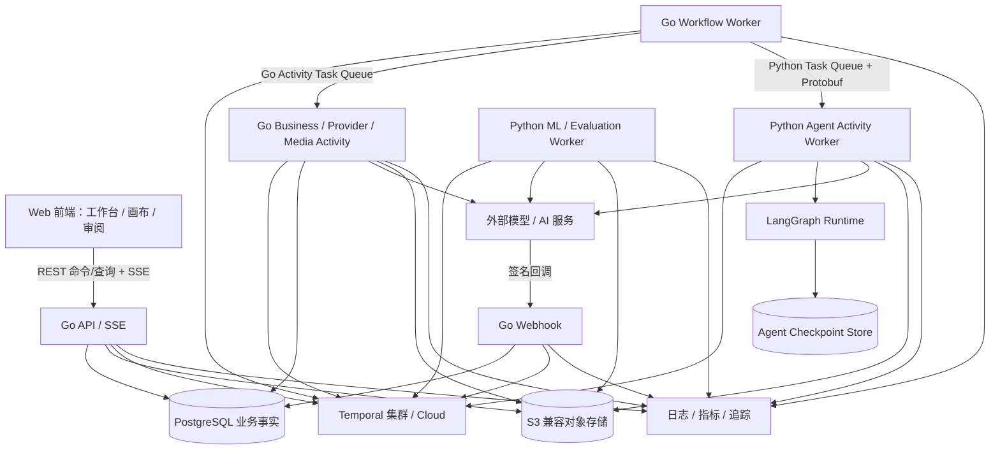
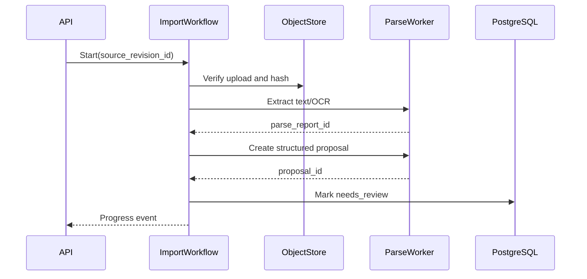

# AI 视频生产平台绿地系统架构设计

> 状态：候选架构评估 v3，待纵向 PoC 与团队能力评审；未接受技术选型
> 日期：2026-08-20
> 对应产品设计：[018-AI视频生产平台绿地产品与功能模块设计](018-AI视频生产平台绿地产品与功能模块设计.md)
> 数据与实现细化：[020-AI视频生产平台核心领域与数据模型设计](020-AI视频生产平台核心领域与数据模型设计.md)、[021-AI视频生产平台接口工作流与功能实现设计](021-AI视频生产平台接口工作流与功能实现设计.md)
> 设计方式：绿地设计，不继承现有项目的技术架构、代码结构或服务边界
> 范围：系统本身；不包含定价、收费、订阅、支付、增长或其他商业计划

## 1. 评估结论

**Go 业务控制面 + Python Agent/智能处理面 + Temporal 跨语言耐久执行在技术上可行，且服务边界合理；当前结论是“有条件推荐进入 PoC”，不是已经接受的技术选型。**

不计现有代码时，这个候选方案适合希望长期把稳定业务规则与快速变化的 Agent 生态分离、且团队能持续维护 Go 与 Python 的平台。若目标是最短时间完成 MVP、团队主要是 Python 能力，或希望最大化复用当前服务，则 Python 单栈仍有更低的交付风险。Java + Python 同样可行，但只有在已有 JVM 平台和 Java 团队优势时才优于 Go + Python。

| 候选 | 绿地可行性 | 主要收益 | 主要代价 | 当前判断 |
| --- | --- | --- | --- | --- |
| Python 业务 + Python Agent | 高 | 一套语言、交付快、AI 生态直接 | 类型/资源效率和运行隔离更依赖工程纪律 | MVP 风险最低 |
| Go 业务 + Python Agent | 高 | 业务控制面稳定高效，Agent 生态完整，扩缩边界清楚 | 双工具链、跨语言契约、联调和当前服务迁移成本 | **有条件推荐 PoC** |
| Java 业务 + Python Agent | 高 | JVM 企业生态、类型与大型团队治理强 | JVM 平台成本和双栈仍存在 | 仅 Java 组织优先 |

以下内容定义 Go + Python 候选方案在通过 PoC 后应采用的边界，不表示这些组件已经获准实施。

候选边界：

- Go 是业务主栈：HTTP API、Webhook、鉴权、领域规则、事务、业务查询、业务事件和顶层 Temporal Workflow 都由 Go 实现。
- Python 是受限智能处理栈：LangGraph Agent、LLM 推理、文档/多模态理解及确需 Python 生态的评估节点由 Python Worker 实现。
- 浏览器端复杂画布和媒体审阅界面使用 TypeScript/React；它是前端呈现技术，不形成第二套后端业务栈。
- 使用 PostgreSQL 保存业务事实，S3 兼容对象存储保存媒体，Temporal 负责可恢复的长流程。
- Go API 进程不直接执行模型调用、FFmpeg、文档解析或质量检测；这些工作由按任务类型隔离的 Activity Worker 执行。
- 顶层业务流程只在 Go Temporal Workflow 中编排；LangGraph 只编排一次 Agent Run 内部的推理、工具和提案节点，不能成为第二套业务工作流。
- Python Worker 不持有业务库写权限，不直接改变镜头、计划、候选、主选、审批或 Operation；它只返回版本化结果或向 Go 内部命令入口提交幂等进度/提案。
- Go 与 Python 通过版本化 Protobuf 契约和独立 Temporal Task Queue 交接；大型输入输出只传对象/业务引用，不进入工作流历史。
- 业务 Go 代码和 Python Agent Runtime 可在同一仓库独立构建、测试和部署；第一阶段不按领域拆微服务。
- Redis 只在限流、短期缓存或实时协作确有证据时引入，不能保存权威业务状态。
- PostgreSQL 中的 `Operation` 是用户可见长操作的权威状态；Temporal 负责耐久运行和恢复，但其内部 Workflow 状态不成为第二套产品状态。

这个方案接受两种语言，但拒绝两套业务实现。Go 利用编译期类型、并发和部署特性承载稳定业务控制面；Python 利用 LangGraph、模型和数据处理生态承载快速变化的智能处理。跨语言成本被限制在 `AgentRunRequest`、`AgentRunResult`、`AgentProgress` 和少量处理 Activity 契约中，业务对象、权限和状态机不在 Python 重复实现。

## 2. 架构目标与非目标

### 2.1 目标

1. **业务事实明确**：每个对象只有一个权威模块，版本、选择、审批和交付可追溯。
2. **长流程可恢复**：进程重启、网络超时、回调丢失和人工等待后能继续，而不是重新开始。
3. **外部副作用安全**：幂等、对账、限流、熔断和未知状态防止重复调用。
4. **媒体与元数据分离**：大文件不进入数据库和工作流历史。
5. **租户隔离**：认证、授权、查询、对象存储和审计共同执行工作区隔离。
6. **渐进扩缩**：API、提供商调用、媒体处理和质量检测能独立扩缩。
7. **可观测**：一次用户命令可追踪到工作流、外部尝试、媒体和资源消耗。
8. **可测试**：领域规则不依赖 Web 框架、数据库或提供商 SDK 才能运行测试。
9. **单一运行语义**：计划、运行、结果和交付分别建模，不用一个“大状态机”同时表示四种含义。

### 2.2 非目标

- 首期多区域主动—主动部署。
- 首期事件溯源数据库或全局 CQRS。
- 首期 Kubernetes 必选。
- 首期按领域拆微服务、服务网格，或在 Python 中复制 Go 业务后端。
- 在数据库中保存视频、图像或大型提示上下文。
- 用消息队列代替业务状态机。
- 让 LLM 直接访问生产数据库或对象存储凭据。
- 实现客户计费、套餐、发票或支付系统。

## 3. 为什么采用 Go + Python，而不是双业务后端

| 维度 | Go 业务控制面 | Python Agent/处理面 | 边界判断 |
| --- | --- | --- | --- |
| 领域规则与事务 | 编译期类型、显式错误和稳定服务生命周期 | 不实现业务聚合和表写入 | 只由 Go 拥有 |
| API、Webhook、SSE | 高并发、资源效率和部署产物清晰 | 不对公网暴露第二套产品 API | 只由 Go 对外 |
| 顶层长流程 | Temporal Go Workflow 负责编排、定时器、重试、信号与人工等待 | 作为独立 Activity Worker 执行 Agent Run | Go 是流程所有者 |
| Agent 推理与规划 | 创建 AgentRun、准备受限上下文、验证返回提案 | LangGraph 负责节点、模型、工具、checkpoint 和结构化输出 | Python 是智能执行者 |
| 文档/多模态/评估 | 负责授权、任务、版本和结果入库 | 使用 Python AI/CV/音频生态计算结果 | 结果回到 Go 后才成为业务事实 |
| 托管媒体 Provider | 稳定 HTTP API 优先由 Go Adapter 实现 | 仅在 SDK/模型工具确有优势时作为 Python Activity | 不能因此复制 Job/Attempt |
| FFmpeg | Go Worker 负责受控参数、进程生命周期和结果登记 | 仅 ML/CV 前后处理确需时参与 | FFmpeg 本身是隔离外部进程 |
| 可观测与安全 | 统一身份、审计、Operation 和 Trace 根 | 传播 Trace，仅访问最小输入和专用运行存储 | Go 保持审计闭环 |

主流托管模型已同时提供 Go 与 Python SDK，因此语言边界不按“能不能调用模型”划分，而按“谁拥有业务决定”划分。Python 的优势用于 Agent、实验和本地智能处理；Go 的优势用于长期稳定的业务语义、并发入口和部署运维。

### 3.1 Go 业务主栈约束

- 使用处于 Go 官方支持窗口的稳定版本，跟随“当前版本及前一版本”升级策略，不长期冻结过期工具链。
- 领域包不得依赖 HTTP、Temporal、PostgreSQL 驱动或厂商 SDK；入口与适配器依赖应用端口。
- 业务数据库写入只能通过 Go 应用端口和短事务；Go Workflow 本身也不能直接访问数据库或网络。
- 公共 HTTP 契约以 OpenAPI 为事实源；Go 内部类型不能被手工复制成另一套 Python 业务 DTO。
- 所有并发 Worker 必须受队列、连接池、提供商限流和工作区公平策略约束，不能以 goroutine 数量代替容量设计。

### 3.2 Python Agent Runtime 约束

- 选择处于官方支持窗口且关键 AI 依赖通过兼容测试的 Python 版本；使用严格类型检查和固定依赖锁。
- LangGraph State 只包含 Agent Run 所需的小型状态、版本引用和工具结果引用；Prompt、来源全文和媒体不复制进 checkpoint。
- LangGraph checkpoint 是 Agent 运行恢复事实，不是镜头、计划、Operation、审批或交付事实；普通产品查询不读取它。
- 产品级人工审批和长时间等待由 Go Temporal Workflow 负责。LangGraph `interrupt` 仅允许 Agent 内部调试或受控工具确认，不承担产品审批。
- Python 无业务表写凭据。读取通过受限 Go Query/Tool 接口或按任务签发的对象引用；写入只能返回 `AgentRunResult`/`AgentProgress`，由 Go 再鉴权、校验和提交。
- LLM 输出必须先通过 Protobuf/JSON Schema 校验，再成为 AgentProposal；自由文本永远不能直接执行。

### 3.3 跨语言契约

跨语言事实源位于独立 `contracts/agent/v1` Protobuf，而不是 Go struct、Pydantic model 或 LangGraph State 的任意一方。契约至少包含：

- `AgentRunRequest`：run、workspace、actor、scope、基线版本、允许工具、资源上限、graph/version、输入引用和 trace context。
- `AgentRunResult`：状态、提案项、证据引用、用量、模型/工具清单、可恢复错误和输出 schema 版本。
- `AgentProgress`：`run_id + sequence`、阶段、百分比、摘要和可选 artifact 引用；Go 以序号幂等接收。
- `AgentError`：稳定错误码、retryable、certainty、policy reason 和安全摘要；禁止跨语言传递任意异常字符串作为控制逻辑。

契约演进遵循新增字段优先、未知字段可忽略、枚举保留 `UNSPECIFIED`、破坏性变化新建 package version。Go/Python 生成代码都由 CI 从同一 `.proto` 生成并执行双向 golden contract tests。

### 3.4 采用条件与否决条件

只有同时满足以下条件，Go + Python 才能从候选变为接受：

1. 团队分别有明确的 Go 业务面和 Python Agent Runtime 长期维护责任人，而不是依赖单个开发者跨两端救火。
2. 首个纵向 PoC 能证明 Go Workflow → Python Activity → Go 结果提交在崩溃、超时、重试、取消和版本升级后不重复业务副作用。
3. Protobuf 代码生成、兼容检查、双向 golden test、Trace 传播和本地一键联调已进入 CI/开发工具链。
4. Python Worker 在部署和网络层均没有业务数据库写凭据；越权 Tool 和过期输入必须失败关闭。
5. 当前 Python 服务迁移采用纵向替换并保留可回退路径，不进行一次性全量重写。
6. 团队接受两套依赖升级、安全扫描、镜像、运行告警和故障值班成本。

出现以下任一情况则否决或推迟双栈：

- 首期交付窗口不允许承担跨语言契约与运维建设；
- 实际业务并发和资源成本没有显示 Go 控制面的长期价值；
- Agent 仍需要直接读取/写入大量业务内部对象，无法收敛为稳定输入/输出契约；
- 团队无法独立维护 Go 和 Python 的生产问题；
- PoC 中 Temporal 与 LangGraph 的恢复边界无法做到单一责任，出现重复等待、重复副作用或双状态源。

### 3.5 必须通过的纵向 PoC

PoC 只实现“批准的叙事版本 → Agent 生成镜头提案 → 用户逐项接受”一个闭环：

1. Go API 鉴权并在 PostgreSQL 创建 `Operation`、`AgentRun` 和启动 Outbox。
2. Go Temporal Workflow 从专用 Task Queue 调用 Python `run_initial_draft_graph` Activity。
3. Python LangGraph 读取版本化输入引用，调用一个模型和两个只读 Tool，保存专用 checkpoint，返回 Protobuf `AgentRunResult`。
4. Go 校验 run、workspace、基线版本、graph/schema 版本和提案命令白名单，在事务中保存 AgentProposal。
5. 用户逐项接受时由 Go 重新鉴权和执行领域命令；Python 不参与业务提交。

验收必须覆盖：Python 在每个图节点前后被杀死、Activity 超时和重试、Go Worker 升级、旧/新 Protobuf 互通、模型返回非法 Schema、重复结果、取消、工作区越权、Trace 连贯和 Python 无业务库凭据。重复 AgentProposal/命令副作用必须为 0；无法恢复的运行必须进入明确失败或人工恢复，而不是永久运行中。

## 4. 技术栈

| 层 | 选择 | 责任 |
| --- | --- | --- |
| Web 前端 | TypeScript、React | 画布、镜头表、媒体审阅、SSE 状态展示 |
| HTTP API | Go、`net/http` 兼容路由、OpenAPI | 命令/查询入口、Schema、鉴权、SSE |
| 领域与应用层 | Go、显式端口与严格包依赖 | 聚合规则、命令、查询、权限和不变量 |
| 数据访问 | Go PostgreSQL Driver + 版本化 SQL Migration | 显式查询、事务和迁移；领域层不依赖驱动类型 |
| 权威数据 | PostgreSQL | 业务事实、版本、任务索引、用量账本、审计 |
| 顶层长流程 | Temporal Go SDK | 业务编排、定时器、重试、信号和人工等待 |
| Agent Runtime | Python、LangGraph、严格类型 | Agent 内部推理图、工具调用、checkpoint、结构化提案 |
| 跨语言执行 | Temporal Python Activity Worker + Protobuf | Go Workflow 调度 Python Agent/智能处理任务 |
| 媒体 | Go 进程监督 + FFmpeg/ffprobe 隔离 Worker | 探测、代理、关键帧、转码、装配和校验 |
| 对象存储 | 私有 S3 兼容存储 | 原件、代理、候选、导出与隔离区 |
| 可观测 | OpenTelemetry + 指标/日志/追踪后端 | 跨 API、工作流、Worker 和提供商关联 |
| 可选缓存 | Redis | 限流、短期缓存、临时在线状态；非权威 |

Temporal 官方样例已演示 Go Workflow 调用 Python Activity；默认 Data Converter 支持 JSON 和 Protobuf。这个能力使 Python 可以保持 Agent 专用运行时，而 Go 不需要用同步 HTTP 请求承担长任务恢复。LangGraph 官方将 checkpoint、durable execution、streaming 和 human-in-the-loop 定义为 Agent Runtime 能力；本设计仅使用它恢复 Agent 内部图，不让它替代业务 Workflow 和 Operation。参见文末官方依据。

## 5. 总体架构



### 5.1 进程职责

| 进程组 | 可以做 | 不可以做 | 扩缩依据 |
| --- | --- | --- | --- |
| Go API | 鉴权、校验、短事务、查询、SSE、创建 Operation/启动意图 | FFmpeg、长轮询、模型生成、Agent 推理 | 请求率、延迟、连接数 |
| Go Webhook | 验签、去重、保存回调收据、通知 Workflow | 直接创建候选或决定任务成功 | 回调突发量 |
| Go Workflow Worker | 顶层状态编排、定时器、Activity、人工信号 | 网络/数据库 I/O、Agent 节点执行、保存大媒体 | Workflow Task 延迟 |
| Go Business/Provider/Media Activity | 通过应用端口读写业务事实、厂商提交/查询/取消、FFmpeg 监督和结果验证 | 绕过模块端口跨表写入 | 数据库、配额、网络、CPU/磁盘 |
| Python Agent Activity | LangGraph 推理、只读工具、结构化提案、heartbeat/checkpoint | 业务库写入、产品审批、直接执行高风险命令 | 模型延迟、Agent 队列、Token |
| Python ML/Evaluation Activity | 文档/视觉/音频处理、评估和证据产出 | 自动选择、删除候选或改变业务状态 | GPU、内存、模型吞吐 |

## 6. 模块化单体边界

代码按业务能力组织，不按 Controller/Service/Repository 横向堆叠：

```text
control-plane/                  # Go；唯一业务后端
  cmd/
    api/
    webhook/
    workflow-worker/
    activity-worker/
  internal/
    identity/
    projects/
    narrative/
    productionknowledge/
    shots/
    agent/
    generationplanning/
    execution/
    media/
    quality/
    usage/
    review/
    delivery/
    governance/
  migrations/
agent-runtime/                  # Python；无业务库写权限
  src/lanverse_agent/
    graphs/
    nodes/
    tools/
    runtime/
contracts/
  agent/v1/                    # Go/Python 共同生成代码的 Protobuf 事实源
```

该目录是候选边界示意，不要求在设计接受前创建，也不要求每个逻辑模块都成为独立部署单元。PoC 只创建闭环实际使用的包；Go 公共包只容纳真正跨模块且语义稳定的类型，Python 也不建立全局 `utils`。

### 6.1 模块内部结构

每个 Go 业务模块最多包含：

- `domain`：实体、值对象、聚合、不变量和领域事件。
- `application`：命令、查询、端口、事务协调和权限检查。
- `adapters`：PostgreSQL、对象存储、Temporal、厂商 SDK 实现。
- `transport`：HTTP/事件请求响应与路由，不包含业务判断。

依赖方向为 `transport/adapters → application → domain`。Go 领域包不导入 HTTP、PostgreSQL Driver、Temporal 或厂商 SDK。Python Agent Runtime 只能依赖生成的 `contracts/agent/v*`、LangGraph、模型/处理适配器和自身运行端口，不导入或复制 Go 领域包。

### 6.2 允许的跨模块协作

- 同事务的强一致规则由用例编排器通过显式应用端口调用权威模块；即使共享事务，也只能由表所有者模块执行其写入。
- 非关键衍生更新通过事务 Outbox 事件传播。
- 跨模块只传稳定 ID、版本 ID 和小型值对象，不传 ORM 实体。
- 禁止跨模块直接查询或写入对方表。
- 画布、API 和批处理调用同一 Go 命令处理器；Python Agent 只输出同一命令 Schema 的提案，接受时仍由 Go 命令处理器执行。

### 6.3 代码依赖与运行协作分离

“质量问题批准修复后再次生成”是运行时闭环，不意味着 `quality` 包可以导入 `generation_planning` 的领域实现。静态代码依赖必须保持单向：模块只依赖自身领域、`shared_kernel` 和对方公开的应用端口/契约。跨模块反向流程由顶层用例编排器或 Temporal Workflow 调用命令完成。

因此：

- 模块图描述事实流和运行协作，不作为 Go package 或 Python import 图。
- Go 领域包之间禁止循环依赖；Python Graph/Node/Tool 依赖必须单向；CI 分别做架构测试。
- 事件处理器只能提交公开命令，不能在消费者中直接改写订阅模块的表。
- 需要跨模块原子性的少数用例必须在设计中点名，例如“批准计划 + 资源预留”，不能把共享数据库当成任意跨表写入许可。

## 7. 数据设计

### 7.1 数据分类

| 类别 | 存储 | 示例 | 规则 |
| --- | --- | --- | --- |
| 业务事实 | PostgreSQL | 项目、镜头、版本、计划、选择、审批 | 事务写入、版本约束 |
| 长操作状态 | PostgreSQL `Operation` | 用户可见进度、阻塞、失败、未知和恢复动作 | 产品状态权威；可由 API 查询和 SSE 订阅 |
| 工作流运行历史 | Temporal | 定时器、Activity、信号、重放和恢复 | 运行时权威；不直接充当产品查询模型 |
| Agent 内部 checkpoint | Python Agent 专用 PostgreSQL schema/database | LangGraph thread、节点状态、待恢复工具结果 | 仅 Agent Run 恢复；Go 产品查询不读取，不得保存业务 current |
| 媒体二进制 | 对象存储 | 原件、候选、代理、交付 | 私有、内容哈希、生命周期 |
| 小型结构化 AI 结果 | PostgreSQL JSONB + 标准列 | 提取提案、评估证据 | Schema 版本化、限制大小 |
| 可观测数据 | 专用后端 | 日志、Trace、指标 | 不保存完整敏感提示或媒体 URL |
| 短期缓存 | Redis（可选） | 限流令牌、短期查询缓存 | 可丢失、可重建、有 TTL |

### 7.2 标识与版本

- 所有外部暴露 ID 使用不可枚举的时间有序 UUID。
- 稳定对象和修订对象分开：如 `shot` 与 `shot_plan_revision`。
- 修订包含 `based_on_revision_id`、`schema_version`、`created_by`、`created_at`。
- 当前指针存于稳定对象，但批准动作通过事务同时完成唯一性校验。
- 对批准修订保存规范化内容哈希，审批和交付引用该哈希。
- API 更新草稿使用 `revision_no` 或 ETag 执行乐观并发。

### 7.3 PostgreSQL 约束

- 所有租户表包含 `workspace_id NOT NULL`，主查询索引以工作区为前缀。
- 业务唯一约束包含工作区，防止全局命名冲突。
- 使用外键保护稳定引用；历史快照引用不可删除对象时采用限制或逻辑归档。
- “一个范围只有一个 current 修订”等不变量尽量用部分唯一索引保护。
- 金额或用量使用定点值和明确单位，禁止二进制浮点。
- 时间统一保存 UTC，展示时使用用户时区。
- RLS 作为纵深防御，不替代应用层授权。PostgreSQL 官方文档指出启用 RLS 且没有策略时默认拒绝，但表所有者通常绕过策略，因此应用运行角色不得拥有表。

### 7.4 对象存储布局

对象键不包含邮箱、项目标题或其他敏感业务名称：

```text
workspaces/{opaque_workspace_id}/
  originals/{content_hash_prefix}/{artifact_id}
  quarantine/{artifact_id}
  proxies/{artifact_id}/{variant_spec_hash}
  candidates/{candidate_id}/{artifact_id}
  deliveries/{delivery_snapshot_id}/{artifact_id}
```

- 上传先进入隔离区，完成大小、类型、哈希和安全检查后发布。
- 原件默认不可变；转码和缩略图是有派生边的独立 Artifact。
- 前端通过短时、限动作的签名 URL 上传或下载。
- 生命周期策略按数据类别执行，不按临时文件名猜测。
- 数据库先记录“准备删除”，对象删除完成后再记录结果；失败进入重试和人工队列。

## 8. API 与实时状态

### 8.1 协议

- REST/JSON：业务命令和查询。
- SSE：任务、计划、评估和交付的单向状态更新。
- 预签名 URL：大文件直传/下载，API 不代理媒体正文。
- 签名 Webhook：后续外部集成事件。
- WebSocket 仅在多人画布实时协作被验证为必需时引入。

### 8.2 命令契约

所有产生状态变化的 API 包含：

- `Idempotency-Key`：调用方重试去重。
- `If-Match` 或基线修订 ID：并发保护。
- 认证主体和工作区上下文：服务端解析。
- `request_id` 与 `trace_id`：观测关联。
- 明确的目标对象 ID 和目标版本 ID。

典型返回：

```json
{
  "command_id": "...",
  "status": "accepted",
  "resource": {"type": "generation_plan", "id": "...", "revision": 3},
  "operation": {
    "id": "...",
    "status_url": "/v1/operations/..."
  },
  "links": {"self": "/v1/generation-plans/..."}
}
```

长操作返回 `202 Accepted`；“已接受”不等于“已完成”。前端订阅 SSE 或查询权威资源状态。

每个长命令在启动 Workflow 之前先创建 Operation。Workflow/Activity 只能通过受约束的状态转换更新它；若 Temporal 与 PostgreSQL 短暂不一致，Operation 保留最后权威状态，并通过 `status_detail/recovery_actions` 显示同步中，由协调器使用内部 `workflow_id` 对账。普通产品 API 不暴露或要求客户端解释 Workflow 状态。

### 8.3 错误模型

统一问题响应包含：`code`、`message`、`retryable`、`field_errors`、`current_revision`、`request_id` 和可选 `recovery_actions`。

错误分为：

- 验证失败：修改输入后重试。
- 并发冲突：刷新、比较并合并。
- 策略阻塞：补权利、换提供商或申请例外。
- 配额阻塞：缩小范围、降规格或获批提高上限。
- 外部暂时故障：系统按批准策略重试。
- 外部确定失败：产生失败记录，需新计划或人工处理。
- 外部未知：进入对账，禁止盲目重试。

## 9. 耐久工作流设计

### 9.1 工作流边界

顶层 Temporal Workflow 使用 Go 实现，只保存小型 ID、状态和决定；完整提示、来源文档、评估 JSON 和媒体均通过 Activity 从 PostgreSQL/对象存储按版本读取。这样避免把敏感或大型载荷写入工作流历史。

Workflow 代码必须确定性；当前时间、随机数、网络和数据库访问都通过 Temporal API 或 Activity 完成。工作流更新采用版本标记或 Worker Versioning，旧执行不能因发布新代码而失效。

Workflow 不拥有计划、候选、选择、审批或交付快照。它拥有“下一步执行什么”的耐久历史；PostgreSQL 模块拥有“业务上已经发生什么”。Operation 是两者之间唯一面向用户的运行投影，不再额外建立 ProductionRun/StageRun/WorkTask 三套控制状态。

Python Agent Activity 使用独立 Task Queue。Activity 输入输出只使用共同生成的 Protobuf 类型；`agent_run_id` 同时作为 Temporal Activity 幂等键和 LangGraph `thread_id` 的受控派生来源。Activity 重试先按 run/version 查找 checkpoint 并恢复，不能创建第二个 AgentRun。Temporal heartbeat 负责存活、取消和 Activity 重试进度；LangGraph checkpoint 负责节点级恢复，两者不能分别决定产品状态。产品级 `waiting_user` 只由 Go Workflow 和 Operation 表达。

### 9.2 导入工作流



失败策略：文件不可读是确定失败；单页 OCR 可部分成功；LLM 结构化失败可在相同来源和 Schema 下有限重试；人工校对不保持数据库事务打开。

### 9.3 生成工作流

1. 批准命令冻结 `GenerationPlan`、资源预留和 `execution_disposition=start_now|hold`。
2. `start_now` 在批准事务中通过 execution 端口创建 Operation 与启动 Outbox；`hold` 只能由后续显式 Submit 命令以同样方式创建，重复启动由业务幂等键拒绝。
3. Workflow 绑定既有 Operation 后读取已批准计划和输入快照，再次检查权利撤销、能力健康和用量预留。
4. 为每个 PlanItem 创建稳定 `GenerationJob` 和业务幂等键。
5. 调用提供商提交 Activity。
6. 获得外部任务 ID 后等待回调信号，同时以长间隔轮询兜底。
7. 提交结果不确定则让 Job 和 Operation 进入 `unknown` 对账子流程，不修改 GenerationPlan 状态，也不立即重提。
8. 确认成功后下载至隔离区、校验、提取元数据并创建 Candidate。
9. 记录实际用量，释放预留，触发质量评估。
10. Operation 汇总为 `succeeded`、`partially_failed`、`unknown` 或 `cancelled`；GenerationPlan 继续保持 approved，作为执行依据。

每个 PlanItem 独立失败；批次不使用“任一失败则回滚所有外部任务”的虚假事务。

### 9.4 人工审批

Workflow 可等待 `approved`、`rejected`、`changes_requested` 或过期信号。审批事实先由 M12 在 PostgreSQL 事务中写入，再向 Workflow 发送包含决定 ID 的信号；Workflow 重新读取并校验决定，不能只信任信号载荷。

### 9.5 交付工作流

- 创建 DeliveryBuild，并冻结装配、所有主选决定和输入 Manifest。
- 运行权利、审批、质量、媒体完整性和格式预检。
- 创建渲染计划并按阶段生成中间文件。
- 对确定性中间产物按输入哈希复用。
- 运行技术校验，生成 Manifest 和内容哈希。
- 最终化前重新检查会随时间变化的权利、策略与审批，并确认 Build 输入哈希未变化。
- 只有所有必需产物和校验通过后，才在单一事务中创建不可变 DeliverySnapshot；附属文件失败时 DeliveryBuild 标记不完整，不创建“看似完成”的快照。

## 10. 提供商适配层

### 10.1 统一端口

```go
type ProviderAdapter interface {
	Validate(ctx context.Context, req CompiledRequest) (ValidationResult, error)
	Submit(ctx context.Context, req CompiledRequest, idempotencyKey string) (SubmissionResult, error)
	Status(ctx context.Context, externalJobID string) (ProviderStatus, error)
	Cancel(ctx context.Context, externalJobID string) (CancelResult, error)
	FetchOutputs(ctx context.Context, externalJobID string) ([]RemoteOutput, error)
	VerifyCallback(headers http.Header, body []byte) (VerifiedCallback, error)
}
```

`SubmissionResult` 必须区分：已创建并有外部 ID、确定未创建、结果未知。适配器不得把未知异常统一映射成可重试失败。

普通托管 Provider 优先实现 Go Adapter。若某能力只能或明显更适合 Python SDK，则 Python 只实现与上述语义等价的版本化 Activity 契约；`GenerationJob`、`Attempt`、外部任务登记和 `unknown` 对账仍由 Go execution 模块拥有。

### 10.2 能力目录

能力目录记录而不是硬编码：

- 媒体类型、模型/版本、区域和健康状态。
- 输入/输出格式、分辨率、时长、画幅和参考数量限制。
- 支持的身份/首尾帧/运动/音频/编辑能力。
- 数据保留、训练使用、许可和地域限制。
- 计量单位、并发和速率限制。
- 回调、轮询、取消和幂等支持等级。
- 最近验证时间和来源。

能力变化产生新版本；已批准计划继续引用旧快照，但执行前若能力已不可用则阻塞并请求新计划。

## 11. 幂等、事务与事件

### 11.1 三层幂等

1. **API 幂等**：`workspace_id + actor_id + Idempotency-Key + command_type` 唯一。
2. **业务幂等**：批准、选择、创建计划等命令有业务唯一键和当前版本检查。
3. **外部幂等**：`provider_connection + plan_item_id + attempt_purpose` 生成稳定键；若提供商不支持，则依赖外部任务登记和对账。

### 11.2 事务 Outbox

领域状态与 Outbox 事件在同一 PostgreSQL 事务提交。发布器异步投递并记录消费游标；消费者按 `event_id` 去重。事件至少一次投递，因此处理器必须幂等。

不用分布式事务协调 PostgreSQL、Temporal、对象存储和外部模型。通过状态机、Outbox、幂等和补偿达到可恢复的一致性。

### 11.3 补偿原则

- 可取消外部任务：请求取消并跟踪最终结果。
- 已产生媒体：进入未采用/待清理状态，不伪装成从未发生。
- 已产生用量：记账并归因，不回滚事实。
- 已发审批：通过撤回或新审阅包替代，不删除历史。
- 已交付快照：撤销访问或发布新快照，不覆盖原快照。

## 12. 安全与租户隔离

### 12.1 身份与授权

- OIDC/OAuth2 认证；短时访问令牌和可撤销会话。
- API 首先确定工作区，再加载成员和项目角色。
- 权限按命令判断，不只按页面或 HTTP 方法判断。
- 高风险操作支持重新认证和双人批准。
- 服务身份使用最小范围、短期凭据和独立审计主体。
- Python Agent/ML Worker 使用独立服务身份，只能消费指定 Task Queue、读取任务授权的对象/只读 Tool，并上报对应 AgentRun；没有业务 PostgreSQL 写角色。

### 12.2 数据保护

- 传输和静态加密；敏感提供商凭据进入密钥管理服务，不进数据库明文字段。
- 日志默认不记录 Prompt 全文、来源文档、签名 URL、Token 或回调原文中的敏感字段。
- 上传限制内容长度、解压倍率、媒体时长和格式；解析/FFmpeg Worker 使用低权限容器、CPU/内存/时间限制和无默认外网。
- 对象下载签名绑定对象、动作、期限和必要网络条件。
- 提供商调用只使用该计划明确引用的媒体，不授予桶级凭据。
- Agent Tool 使用 Go 签发的 `run_id + workspace_id + allowed_tool + scope + expires_at` 能力令牌；Python 不能自行扩大项目范围或把上一次 Run 的 Tool 授权复用到下一次。

### 12.3 Webhook 安全

- 保存原始请求哈希、签名版本、提供商事件 ID 和接收时间。
- 验证签名、时间窗和重放；重复事件返回成功但不重复处理。
- 回调中的租户或内部对象 ID 不可信，通过外部任务登记反查。
- 未知外部任务的回调进入隔离观察，不自动创建项目数据。

## 13. 可观测与运维

### 13.1 关联标识

`request_id → command_id → workflow_id → agent_run_id/graph_version 或 generation_job_id → attempt_id → external_job_id → artifact_id → candidate_id → delivery_snapshot_id`

日志和 Trace 使用这些 ID，禁止用项目标题、用户名或文件名作为主要关联键。

### 13.2 核心指标

- API 延迟、错误率和并发数。
- Temporal Workflow/Activity 排队延迟、重试和卡滞数。
- Python Agent Task Queue 延迟、图节点耗时、checkpoint 恢复、模型/Tool 调用、契约拒绝和重复结果去重数。
- 各提供商提交成功率、未知率、回调延迟、轮询次数和限流率。
- 重复回调去重数和对账恢复数。
- 媒体探测/转码/渲染时长、失败率和隔离率。
- 每种任务的估算与实际资源消耗偏差。
- 每个状态停留时间和人工等待时间。
- 对象存储完整性错误、过期签名拒绝和跨租户拒绝。

### 13.3 初始服务目标

| 目标 | 初始值 | 说明 |
| --- | --- | --- |
| 常规查询 API 可用性 | 月度 99.9% | 不代表外部模型可用性 |
| 非媒体 API 延迟 | p95 < 500 ms | 不包含异步任务完成时间 |
| 状态可见延迟 | p95 < 5 s | 从权威状态提交到前端可见 |
| 已接受任务丢失 | 0 | 可失败、可未知，但不能无记录消失 |
| 重复回调产生重复候选 | 0 | 幂等硬指标 |
| PostgreSQL 生产数据 RPO | ≤ 5 min | 上线前通过恢复演练确认 |
| PostgreSQL 生产数据 RTO | ≤ 60 min | 第一阶段单区域目标 |

外部模型成功率和耗时按提供商、模型和输入规格单独展示，不能混入平台 API 可用性。

## 14. 部署拓扑

### 14.1 第一阶段

- 单区域、多可用区托管 PostgreSQL。
- 私有版本化对象存储和生命周期规则。
- Temporal Cloud 或受支持的自托管集群；由团队运维能力决定，不改变领域设计。
- Go API、Go Webhook、Go Workflow Worker、Go Activity Worker、Python Agent Worker 和 Python ML/Evaluation Worker 分别部署和扩缩；PoC 可共用集群但不能共用进程或镜像。
- Media Worker 使用临时加密磁盘，任务结束后清理；GPU Worker 只在实际评估/媒体模型需要时启用。
- LangGraph checkpoint 使用 Agent Runtime 专用 schema/database 与凭据；生命周期、备份和删除策略随 AgentRun，而不是随业务 current 指针。
- 生产、预发布和开发使用不同工作区、业务数据库、Agent checkpoint、对象桶、Temporal Namespace 和提供商凭据。

### 14.2 不依赖 Kubernetes

进程组可先运行在托管容器平台。只有出现 GPU 调度、复杂媒体资源隔离、多集群策略或现有基础设施要求时再采用 Kubernetes。业务代码不得依赖具体调度平台。

### 14.3 备份与恢复

- PostgreSQL 自动备份、时间点恢复和季度恢复演练。
- 对象存储开启版本保护；生命周期删除必须与数据库保留策略一致。
- Temporal 不是业务事实备份；关键结果已落 PostgreSQL。
- 提供商外部任务 ID 和输入哈希持久化，用于灾后对账。
- 恢复演练必须验证：工作区隔离、当前修订、任务状态、媒体引用、选择、审批和交付清单。

## 15. 测试策略

### 15.1 测试层级

| 层级 | 重点 | 工具/方法 |
| --- | --- | --- |
| Go 领域单元测试 | 状态机、不变量、权限和影响规则 | 纯 Go，无数据库/网络 |
| Go 属性/模糊测试 | 版本唯一、用量守恒、幂等、状态转换和解析边界 | 生成边界组合 |
| Python Agent 测试 | 图路由、结构化输出、Tool 白名单、checkpoint 恢复 | Fake Model/Tool + LangGraph checkpointer |
| 跨语言契约测试 | Protobuf 兼容、Go→Python→Go golden、未知字段/枚举 | 共同生成代码 + 固定样本 |
| 应用集成测试 | 事务、Outbox、RLS、并发冲突 | 真实 PostgreSQL |
| 工作流测试 | 时间跳跃、跨语言 Activity、重试、信号、取消和代码升级 | Temporal 测试环境 |
| 适配器契约测试 | 厂商状态/错误/回调映射 | 录制响应 + 厂商沙箱 |
| 媒体黄金样本 | 探测、转码、字幕、渲染和校验 | 小型可授权媒体集 |
| 安全测试 | 跨租户、签名 URL、Webhook 重放、恶意文件 | 自动化负向场景 |
| 端到端测试 | 脚本到交付的六个产品验收场景 | 可控假提供商 + 少量真实沙箱 |

### 15.2 必须覆盖的故障注入

- 提交请求在服务端创建任务后客户端超时。
- 同一回调发送两次、乱序到达或签名过期。
- Workflow Worker 在关键 Activity 前后重启。
- Python Agent Worker 在 LangGraph 每个节点前后重启，Temporal Activity 重试后从同一 run checkpoint 恢复。
- Go/Python 分别滚动升级时收到旧/新契约版本、未知字段或不支持 graph version。
- Python 重复返回相同 AgentRunResult，或使用过期/跨工作区 Tool 能力令牌。
- 成功回调到达但媒体下载中断或哈希不一致。
- 计划批准后能力目录或权利状态变化。
- 批量任务部分成功、部分失败、部分未知。
- 用量明细延迟或与估算不一致。
- 交付渲染成功但附属字幕或清单失败。
- 成员在审批等待期间被停用。
- 两个用户同时发布同一实体范围的新 current 修订。

## 16. 实施切片

### 切片 0：Go + Python 候选架构 PoC

仅实现 §3.5 的 Agent 镜头提案闭环，验证 Go API/领域事务、Temporal Go Workflow、Python LangGraph Activity、Protobuf 契约、checkpoint、权限和 Trace。PoC 不迁移全部现有 Python API，也不提前创建后续业务模块。

**验收**：全部 kill point 可恢复或明确失败；Python 无业务库写权限；重复提案/命令副作用为 0；本地和 CI 能一条命令运行跨语言契约及集成测试。未通过则回到 Python 单栈候选，不继续铺设 Go 目录。

### 切片 A：首稿系统骨架

工作区隔离、项目 Brief、来源导入、叙事校对、修订基类、Operation、命令幂等、PostgreSQL 迁移、Outbox、对象直传、审计和基础观测。

**验收**：跨租户负向测试通过；重复命令无重复事实；上传原件可验证哈希和来源；Workflow 启动失败或重启后 Operation 可恢复。

### 切片 B：结构、镜头与受限 Agent

实体/状态/参考、镜头方案、显式有效范围、镜头顺序、受限 Agent 首稿提案和人工逐项批准。

**验收**：从来源锚点追踪到镜头；批准后只能通过新修订改变；镜头重排不改变已发布有效范围；Agent 不旁路命令权限。

### 切片 C：可恢复生成

能力目录、计划冻结、用量预留、Temporal 工作流、一个图像和一个视频提供商、媒体入库、候选选择。

**验收**：进程重启不中断业务；超时进入未知并可对账；回调重复不产生重复候选。

### 切片 D：质量与修复

技术检查、人工问题、评估提案、修复计划和局部重做。

**验收**：问题绑定证据和版本；修复只影响选定范围；旧评估在输入变化后过期。

### 切片 E：审阅与交付

冻结审阅包、评论/决定、基础画面/音频/字幕装配、DeliveryBuild、交付预检、RenderRun、Manifest、DeliverySnapshot 和访问撤销。

**验收**：失败或不完整 Build 不产生 Snapshot；成功交付可复现；权利/审批缺失阻止交付；后续修改不改变历史快照。

### 切片 F：画布、团队与组织复用

画布批量命令、外部审片、组织资产/模板和经需求验证的企业能力。

**验收**：画布、Agent、列表和 API 复用同一命令；扩展不能跨模块写表或绕过治理。

## 17. 候选架构验收清单

- [ ] 后端业务规则和业务表写入只有 Go 实现；Python 不复制聚合、状态机、权限或 Repository。
- [ ] Go API 进程不执行模型调用、解析、FFmpeg 或评估长任务。
- [ ] Python Worker 无业务 PostgreSQL 写凭据，只能访问指定 Task Queue、受限 Tool 和任务对象引用。
- [ ] Go/Python 只共享版本化 Protobuf 生成代码，不手写两套 Agent DTO；破坏性变化有明确 package version。
- [ ] Go Temporal Workflow 是产品长流程唯一编排者；LangGraph checkpoint 只恢复 Agent Run，不产生第二套 Operation/HITL 状态。
- [ ] AgentProgress 和 AgentRunResult 使用 run/version/sequence 幂等接收，Python Activity 重试不产生第二份提案。
- [ ] 所有外部调用来自已冻结计划并有稳定幂等键。
- [ ] `unknown` 有数据库状态、对账工作流和人工入口。
- [ ] 每个模块拥有明确数据表，禁止跨模块直接写表。
- [ ] Operation 是唯一用户可见长操作状态；Temporal 历史不与 Operation 竞争产品事实。
- [ ] GenerationPlan 不包含 submitted/completed/unknown 等运行状态。
- [ ] DeliverySnapshot 只在 DeliveryBuild 完成后创建，输入与输出创建后均不可补写。
- [ ] Agent 只返回可验证领域命令提案；接受时由 Go 重新鉴权、校验版本和执行，不能直接写数据库。
- [ ] 媒体不进入 PostgreSQL 大字段、消息载荷或 Temporal 历史。
- [ ] 工作区隔离同时覆盖 API、查询、对象键、RLS 和审计。
- [ ] 选择、审批、风险接受、用量调整和交付均为追加事实。
- [ ] 业务事件通过事务 Outbox，消费者可安全重复执行。
- [ ] 生产恢复演练包含数据库、对象、工作流和外部任务对账。
- [ ] 商业计费、套餐、支付和发票不进入系统模块或数据模型。

## 18. 官方技术依据

- [Go Release History](https://go.dev/doc/devel/release)：Go 当前版本、维护版本和安全修复发布历史。
- [Effective Go：Concurrency](https://go.dev/doc/effective_go#concurrency)：goroutine、channel、并发与并行的官方边界。
- [OpenJDK JEP 444](https://openjdk.org/jeps/444)：Java 虚拟线程适合高并发 I/O，但不用于提高 CPU 密集计算速度。
- [Oracle Java SE Support Roadmap](https://www.oracle.com/java/technologies/java-se-support-roadmap.html)：Java 25 等 LTS 版本的官方支持节奏。
- [OpenAI 官方 SDK 列表](https://github.com/openai/openai-openapi#generated-sdks) 与 [Google GenAI SDK](https://ai.google.dev/gemini-api/docs/libraries)：Python、Go、Java 均有主流托管模型官方 SDK，故 SDK 是否存在不是语言边界依据。
- [Temporal Workflow](https://docs.temporal.io/workflows)：Workflow 重放、确定性和通过 Activity 执行数据库/API/LLM/File I/O 的边界。
- [Temporal 官方跨语言样例](https://github.com/temporalio/samples-python/tree/main/activity_worker)：Go Workflow 调用 Python Activity 的官方可运行样例。
- [Temporal Data Converter](https://docs.temporal.io/default-custom-data-converters)：默认转换器支持 JSON、Protobuf JSON 和二进制载荷；跨语言契约仍需显式版本化。
- [LangGraph Overview](https://docs.langchain.com/oss/python/langgraph/overview)：Agent Runtime 的 durable execution、streaming、human-in-the-loop 和 persistence 能力。
- [LangGraph Persistence](https://docs.langchain.com/oss/python/langgraph/persistence)：thread/checkpoint、故障恢复和生产 checkpointer 边界。
- [LangGraph Interrupts](https://docs.langchain.com/oss/python/langgraph/interrupts)：interrupt 的持久化与恢复语义；本设计不把它用作产品审批事实。
- [PostgreSQL：Row Security Policies](https://www.postgresql.org/docs/18/ddl-rowsecurity.html)：RLS 默认拒绝、策略行为和表所有者绕过注意事项。
- [Amazon S3：对象生命周期](https://docs.aws.amazon.com/AmazonS3/latest/userguide/object-lifecycle-mgmt.html)：对象保留、转换与到期管理。
- [AWS Prescriptive Guidance：预签名 URL 最佳实践](https://docs.aws.amazon.com/prescriptive-guidance/latest/presigned-url-best-practices/introduction.html)：预签名 URL 的风险与保护措施。
- [OpenTelemetry Go](https://opentelemetry.io/docs/languages/go/) 与 [OpenTelemetry Python](https://opentelemetry.io/docs/languages/python/)：跨运行时 Trace、Metric 与日志接入依据。

## 19. 待评审技术问题

1. 团队未来 12 个月是否有分别负责 Go 控制面和 Python Agent Runtime 的明确维护者？缺失时默认 Python 单栈。
2. 是否接受 Temporal 作为首期跨语言耐久边界？若不接受，必须证明替代方案覆盖人工等待、长定时器、代码升级、回调丢失、取消和 unknown 对账。
3. Agent 是否需要多轮会话长期记忆？若不需要，默认每个 AgentRun 独立 thread；不能为了想象中的记忆扩大 checkpoint 和隐私范围。
4. 是否有必须私有部署、禁止外发或限定地域的素材类型？这决定本地模型、Python Worker 网络区和对象授权方式。
5. 当前 Python 服务中哪些纵向能力值得保留、包装或逐步替换？必须按闭环迁移，不按框架文件逐层翻译为 Go。
6. 首期目标提供商各自是否支持幂等键、回调、查询与取消？需要用真实沙箱建立能力目录，而不是依赖营销文档。
7. 首期最大项目规模、并发项目数、镜头数、单媒体大小和交付时长是多少？这些数据用于容量测试和双栈成本判断，不用于改变领域边界。
