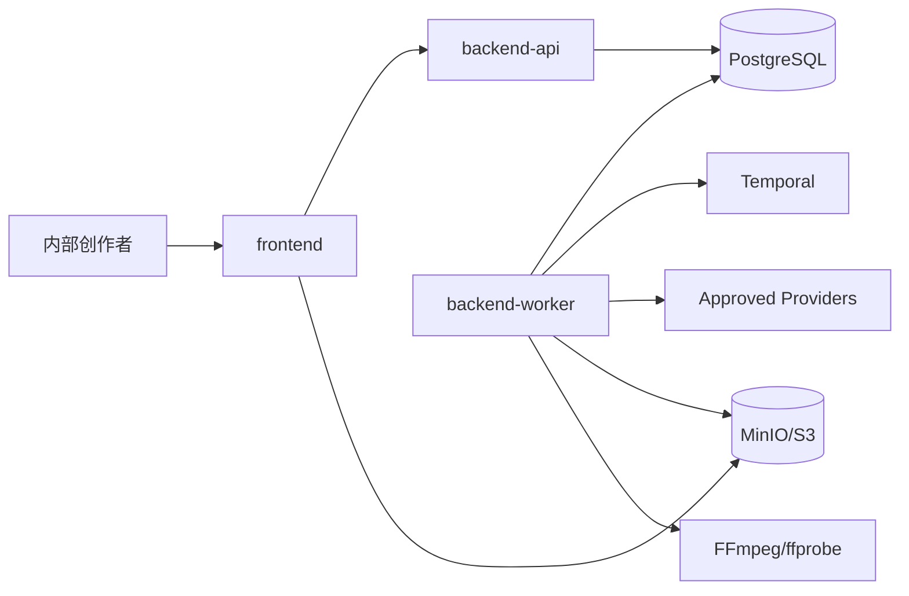

# MVP总体架构

## 1. 设计结论

MVP 用一个可重复的纵向闭环证明 Lanverse 能把输入故事正确落实为 AI 短剧：用户建立只含一个单集的项目、输入文本、生成并确认结构化剧本、生成角色/场景/风格资产与分镜、批量生成镜头候选、人工形成 Adoption、生成最小 TTS/字幕，最后由服务端合成为可下载 MP4。

AI 结果始终是候选；任务成功不等于候选采用，候选采用不等于成片已生成。所有高成本操作引用不可变输入快照，所有正式状态保存于 PostgreSQL。

## 2. 端到端业务流

来源只接收粘贴后符合 `text-normalization-v1` 的 UTF-8 中文故事纯文本：规范化后 300～3000 个 Unicode 代码点、至少含一个 Han 字符且无禁用代码点，并要求权利声明。剧本、资产和分镜可编辑但使用版本/ETag 防止静默覆盖。成片固定为 720×1280、24fps、H.264/AAC 48k、MP4；音频图只由逐句 TTS 与必要静音组成，源语言字幕同时烧录并输出 SRT。

## 3. 系统上下文

- 浏览器只经生成客户端访问 API；正式媒体通过短期授权读取私有对象。
- API 是同步命令和查询边界；Worker 结果必须调用模块应用用例，不能直接绕过规则写表。
- Workflow 仅保存稳定 ID，网络、数据库、对象存储、Provider 和 FFmpeg 副作用全部在 Activity。
- TaskEvent 在 PostgreSQL 内部追加保存且仅供后端恢复；前端同步任务状态的唯一方式是每 2 秒查询 `GET /v1/tasks/{task_id}`，刷新或断线后仍从权威查询收敛。

## 4. 六模块事实所有权

| 模块 | 拥有事实 | 不负责 |
| --- | --- | --- |
| `project-catalog` | Project、Episode、生命周期 | 剧本文本、镜头、任务 |
| `story-development` | SourceRevision、ScriptVersion、CreativeAssetVersion、Episode 级 ShotSpecVersion（含稳定 shot_id） | Provider 执行、媒体字节 |
| `generation` | GenerationCandidate、Adoption | Task 执行、输入快照、对象存储 |
| `production-jobs` | SubmissionSnapshot、ProductionTask、ProductionAttempt、TaskEvent、OutboxEvent、TaskOutput、取消/重试/对账 | 创作基线、候选采用 |
| `media-library` | MediaObject/MediaVersion、S3 引用、哈希、探测和派生谱系 | 镜头意图、任务状态 |
| `delivery` | SubtitleVersion、RenderSnapshot、DeliveryVersion、Manifest | 改写上游版本、执行 Provider |

每项业务事实只有一个写入模块。Adoption 以 `usage_type + usage_id + input_version_id + input_hash` 标识角色/场景资产参考、镜头图片、镜头视频或语音音频使用位置，每个版本化位置最多一个 active 关系；整体视觉风格不形成媒体使用位置，只以 confirmed 文字版本/哈希进入镜头图片和视频输入。新上游版本或兼容性输入变化不能复用旧槽位。API 幂等中间件是唯一 `IdempotencyRecord` 写入者，该记录是传输回执而非第七业务模块。模块只能从 `public/index.ts` 导入 Facade、Port、DTO 和事件，不得导入其他模块的 Domain、Repository 或 Prisma Model。跨模块长流程由 Workflow 调用公开应用用例逐步提交，不建立跨模块事务。

## 5. 前端页面与责任

| Feature / 路由语义 | 主要能力 | 不负责 |
| --- | --- | --- |
| `projects` / `/projects` | 创建项目、单集和查看阶段摘要 | 修改生成或交付事实 |
| `story` / `/episodes/:id/story` | 输入来源、生成/确认剧本、生成/调整分镜 | Provider 诊断 |
| `studio` / `/episodes/:id/studio` | 先生成/采用图片，再生成/采用镜头视频与逐句 TTS | 自动采用或渲染 |
| `tasks` / `/tasks` | 每 2 秒轮询进度，查看错误、取消、重试和回跳 | 编辑提示词或改变采用 |
| `delivery` / `/episodes/:id/delivery` | 请求渲染、查看质检和下载 MP4 | 修改上游输入或 Adoption |

TanStack Query 保存服务端缓存并只对活跃任务执行 2 秒轮询；Zustand 只保存未提交编辑、选区和面板状态。刷新页面、网络断开或清空客户端缓存不能丢失正式事实。

## 6. 权限与安全边界

MVP 的主体只有一个由部署边界保护且不持久化的 `internal_operator`；操作仅使用 request/task/version 标识关联。

- 本地应用只绑定 loopback；frontend、backend-api、minio 的宿主端口均显式绑定 `127.0.0.1`，backend-worker、postgres、temporal 不发布宿主端口。部署验收必须证明非 loopback 请求不可达。
- Provider、数据库和对象存储密钥只来自服务端环境/秘密注入，不进入 Git、浏览器、日志、Workflow 历史或错误响应。
- 来源、Prompt 和未发布媒体不得进入普通日志；只记录 ID、哈希、耗时和安全错误摘要。
- Provider 媒体仅从 Adapter 允许域或 SDK 获取，并执行大小、超时、类型、哈希及可解码检查。
- Delivery 用途固定记录为 `internal_review`，产品验收只覆盖受控内部播放与下载。

## 7. 部署与可观测性

`deploy/local/compose.yaml` 的服务键恰为 `frontend`、`backend-api`、`backend-worker`、`postgres`、`temporal`、`minio`。所有应用制品来自同一提交。只有 frontend、backend-api、minio 发布宿主端口且显式绑定 `127.0.0.1`；其余服务只加入内部 Compose 网络。每个服务定义容器内 healthcheck：frontend 检查既有页面入口，基础设施使用镜像自带命令，backend-api/backend-worker 分别复用其唯一 main 入口的 `--healthcheck` 模式检查配置和依赖并输出 release version；不得为此增加 HTTP Operation 或第三个后端入口。

可观测性 allowlist 为 Compose healthcheck 和结构化日志，日志使用 `request_id/task_id/attempt_id/workflow_id/release_version/error_code` 关联。Plan 必须给出本地资源上限、数据卷和安全停止步骤。

## 8. 失败、迁移与回滚

- 来源/结构化输出无效时保留原输入，任务失败并允许修正后新请求。
- 每个媒体使用位置独立创建 Task，前端按 Episode 聚合展示；部分失败时保留成功候选，只为失败使用位置创建新 Task。
- 上游版本变化不修改既有快照或候选，只将其显示为旧版本来源。
- Worker 重启、重复 OutboxEvent 和重复请求不得产生重复 Task、Candidate 或 Delivery。
- 渲染失败保留固定 RenderSnapshot 和既有媒体；系统自动重试在原 Task 下创建新 Attempt，用户重试创建引用原 Task 的新 Task。

初始数据库从 `0001` 建立。回滚停止新入口并回退应用制品，不删除数据库卷、Temporal 历史、对象或成功产物；不兼容数据变更只能前滚修正。

## 9. Design 验收标准

- AC-ARCH-001-001：可从项目入口导航并只使用本设计列出的页面、模块与运行单元完成来源→剧本→分镜→生成→采用→导出。
- AC-ARCH-001-002：每项 MVP 事实恰有一个六模块所有者，页面和 Worker 均不跨模块直接写表。
- AC-ARCH-001-003：Task、创作确认、候选采用和 Delivery 是分离事实，UI 不合并为单一“完成”状态。
- AC-ARCH-001-004：清除前端缓存或重启 API/Worker 后，PostgreSQL、Temporal 与对象存储足以恢复可判断状态。
- AC-ARCH-001-005：每个目录、接口、数据表、后台进程和 Acceptance 条目均可追溯到六模块与端到端业务流。
- AC-ARCH-001-006：安全边界限制为内部单操作者，部署与网络测试能证明未授权外部请求不可达。
