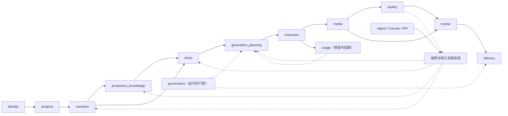

# AI 视频生产平台核心领域与数据模型设计

> 状态：提案 v4，待领域与数据评审
> 日期：2026-08-20
> 上游设计：[018-AI 视频生产平台目标产品与功能模块设计](018-AI视频生产平台目标产品与功能模块设计.md)
> 技术边界：[019-AI 视频生产平台目标系统架构设计](019-AI视频生产平台目标系统架构设计.md)
> 范围：领域对象、聚合、表所有权、关系、约束、版本和读模型

## 1. 设计结论

平台数据模型必须围绕“可修改的连续内容生产”设计，而不是围绕模型 API 设计。核心链路是：

```text
SourceRevision
  → NarrativeRevision
  → ProductionEntity / EntityStateRevision
  → Shot / ShotPlanRevision
  → GenerationPlan / GenerationPlanItem
  → Operation / GenerationJob / Attempt
  → MediaArtifact / Candidate / SelectionDecision
  → QualityIssue / RepairPlan
  → ReviewPackage / ReviewDecision
  → AssemblyRevision / DeliveryBuild / DeliverySnapshot
```

其中稳定对象负责身份，Revision 负责内容，Decision 负责人类决定，Plan 负责冻结副作用，Operation 负责可恢复运行，Snapshot 负责交付复现。下列对象不得合并：

- 角色身份不能与角色某次服装状态合并。
- 镜头身份不能与某版镜头拍法合并。
- 候选输出不能与“当前采用”状态合并。
- 装配草稿不能与正式交付快照合并。
- 生成计划不能与运行任务状态合并。
- 渲染中的交付构建不能与不可变交付快照合并。

## 2. 模块依赖与事实所有权



实线表示主要事实流，虚线表示运行时门禁或公开命令；它们都不是具体语言的 package/import 方向，也不表示可以跨模块直接操作数据表。反向修复由用例/流程协调器提交新命令，不允许 `quality.domain` 直接依赖 `generation_planning.domain`。

| 模块 | 独占写入的表前缀 | 允许引用的外部事实 |
| --- | --- | --- |
| identity | `iam_` | 无 |
| projects | `prj_` | 成员 ID |
| narrative | `nar_` | 项目、内容单元、媒体来源 ID |
| production_knowledge | `pk_` | 叙事锚点、媒体 ID |
| shots | `shot_` | 叙事、实体状态和参考 ID |
| agent | `agent_`、`canvas_` | 任意可读领域对象的 ID/版本 |
| generation_planning | `gen_plan_` | 镜头方案、实体状态、能力、权利和用量版本 |
| execution | `ops_`、`exec_` | 长操作、已批准计划项、提供商连接 |
| media | `media_` | 任务和来源 ID |
| quality | `qa_` | 候选、镜头方案、策略版本 |
| usage | `usage_` | 计划项、任务和尝试 ID |
| review | `review_` | 被审对象的类型、ID、版本和哈希 |
| delivery | `delivery_` | 主选、媒体、审批、权利与质量快照 |
| governance | `gov_`、`audit_` | 主体、媒体、提供商和交付 ID |
| templates_integrations | `tpl_`、`int_` | 已批准版本的不可变引用 |

## 3. 通用数据约定

### 3.1 标识

- 主键统一为时间有序 UUID，不使用自增 ID 对外暴露数量。
- 每个租户数据表包含 `workspace_id`，且所有唯一约束包含工作区。
- 一个对象跨版本保持稳定 ID；修订、决定、任务和快照使用独立 ID。
- 外部提供商 ID 只在 execution 模块中权威保存，其他模块引用内部 Job ID。

### 3.2 通用字段

```text
id                  UUID PK
workspace_id        UUID NOT NULL
created_at          TIMESTAMPTZ NOT NULL
created_by          UUID NOT NULL
updated_at          TIMESTAMPTZ NULL       # 只用于可编辑草稿/运行状态
archived_at         TIMESTAMPTZ NULL
schema_version      SMALLINT NOT NULL
```

修订对象额外包含：

```text
stable_object_id        UUID NOT NULL
revision_no             INTEGER NOT NULL
based_on_revision_id    UUID NULL
status                  revision_status NOT NULL
content_hash            BYTEA NOT NULL
approved_at             TIMESTAMPTZ NULL
approved_by             UUID NULL
```

### 3.3 修订约束

```sql
CREATE UNIQUE INDEX one_revision_number
ON example_revision (workspace_id, stable_object_id, revision_no);

CREATE UNIQUE INDEX one_current_revision
ON example_revision (workspace_id, stable_object_id)
WHERE status = 'current';
```

- `draft` 可编辑，但必须进行乐观并发检查。
- `proposed` 只允许撤回或批准。
- `current` 不允许更新内容字段。
- 新版本批准时，旧 current 与新 current 的切换在同一事务完成。
- `superseded` 和 `archived` 不能重新变为 current。

### 3.4 金额与资源单位

平台不实现商业计费，但需要记录外部资源消耗。所有用量记录由 `quantity_decimal + unit_code + rate_revision_id` 表示，例如 `video_second`、`image_generation`、`token`、`gpu_second`。如提供商返回实际费用，可作为运维对账值保存，但不能被复用成客户账单模型。

### 3.5 媒体时间与时间线单位

- 项目 Brief 以 `frame_rate_num/frame_rate_den` 保存有理帧率，例如 30000/1001；不使用浮点 `29.97` 作为权威值。
- Assembly 的画面位置保存整数 `timeline_tick` 和固定 `timeline_timebase`；媒体入出点保存原 Artifact 的整数 PTS 与 `time_base_num/time_base_den`。
- 字幕、音频 Cue、评论和质量证据必须绑定 Artifact/Assembly 修订及其时间基，不能只保存一个无来源的浮点秒数。
- 帧率转换、变速和重采样必须记录舍入规则；最终帧数、时长和音频采样数由 RenderPlan 确定并进入交付 Manifest。

## 4. M01 组织、身份与访问数据

### 4.1 聚合

`Workspace` 是租户根；`Membership` 是用户在工作区内的授权根。用户全局身份与工作区成员关系分离。

### 4.2 表

| 表 | 关键字段 | 约束 |
| --- | --- | --- |
| `iam_workspace` | name、status、policy_revision_id | status 为 active/suspended/archived |
| `iam_user` | identity_subject、display_name、status | identity_subject 全局唯一 |
| `iam_membership` | workspace_id、user_id、role_id、status | 每工作区/用户唯一 |
| `iam_role` | code、scope、is_system | 系统角色不可删除 |
| `iam_role_permission` | role_id、permission_code | 唯一组合 |
| `iam_project_grant` | project_id、membership_id、role_id | 不得扩大工作区角色的禁止项 |
| `iam_policy_revision` | policy_json、status、content_hash | current 唯一 |
| `iam_service_identity` | scopes、expires_at、status | 必须有到期时间和负责人 |

### 4.3 权限检查输入

权限决策至少读取：主体、工作区角色、项目角色、对象工作区、命令、对象状态、策略版本和必要的双人批准条件。API 不接受客户端直接传入“我是管理员”。

## 5. M02 项目与内容单元数据

### 5.1 聚合

- `Project`：制作范围、成员和总体状态。
- `ProjectBriefRevision`：目标、规格、约束和资源上限。
- `ContentUnit`：一集、一个广告变体或可独立交付单元。

### 5.2 表

| 表 | 关键字段 | 约束 |
| --- | --- | --- |
| `prj_project` | kind、status、current_brief_revision_id | archived 后禁止新计划 |
| `prj_brief_revision` | target_platforms、audience、target_duration_ticks、aspect_ratio、width/height、frame_rate_num/den、audio_sample_rate、language、quality_tier、usage_cap | current 唯一 |
| `prj_content_unit` | project_id、kind、title、status | 稳定身份 |
| `prj_content_order_revision` | project_id、status、content_hash | 批准后冻结 |
| `prj_content_order_item` | order_revision_id、content_unit_id、ordinal | 同修订 ordinal/内容单元分别唯一 |
| `prj_milestone` | type、due_at、status | 完成由事实事件驱动 |
| `prj_progress_projection` | counts_json、blockers_json、calculated_at | 仅读模型，可重建 |

项目状态：`draft → active → paused → completed → archived`。暂停阻止新执行，不取消已有外部任务；归档前必须处理进行中任务。

## 6. M03 导入与叙事理解数据

### 6.1 聚合

- `SourceRevision`：上传原件或文本输入的不可变记录。
- `NarrativeRevision`：一次完整结构化叙事版本。
- Scene、Beat、Dialogue 等属于 NarrativeRevision 的内容节点，不独立成为 current。

### 6.2 表

| 表 | 关键字段 | 约束 |
| --- | --- | --- |
| `nar_source_revision` | project_id、artifact_id、source_type、hash | 原件不可覆盖 |
| `nar_import_job` | source_revision_id、status、operation_id | 同解析配置可幂等复用；运行投影关联 Operation |
| `nar_parse_report` | parser_version、page_status_json、warnings | 追加报告 |
| `nar_narrative` | content_unit_id、current_revision_id | 稳定身份 |
| `nar_narrative_revision` | status、summary | current 唯一 |
| `nar_narrative_source` | narrative_revision_id、source_revision_id、purpose、ordinal | 组合唯一，可做外键与来源顺序校验 |
| `nar_scene` | narrative_revision_id、ordinal、purpose、time、location_hint | `(revision, ordinal)` 唯一 |
| `nar_beat` | scene_id、ordinal、goal、conflict、emotion_before/after | 归属同修订 |
| `nar_dialogue_line` | beat_id、speaker_hint、text、source_anchor_id | 归属同修订 |
| `nar_source_anchor` | source_revision_id、page、start_offset、end_offset | offset 合法 |
| `nar_extraction_proposal` | target_type、payload、confidence、anchor_ids、decision | 未批准不成为事实 |

### 6.3 实现规则

- 一次叙事修订内的 Scene/Beat 使用内部 UUID，方便镜头引用和差异匹配。
- 新来源版本通过确定性锚点、文本相似度和人工确认迁移旧节点，不按数组位置盲目覆盖。
- 提取置信度只用于排序；任何批准事实都记录 ProposalDecision。
- NarrativeRevision 批准后发布事件，镜头模块只生成新提案，不自动改变已批准镜头。

## 7. M04 生产知识与一致性图谱数据

### 7.1 聚合

- `ProductionEntity`：稳定身份，如角色“林夏”。
- `EntityStateRevision`：在某范围生效的具体状态，如“第二场开始穿黑色外套”。
- `ReferenceBinding`：参考媒体对实体状态或镜头的用途和强度。
- `WorldRuleRevision` / `StyleRuleRevision`：项目级约束。

### 7.2 表

| 表 | 关键字段 | 约束 |
| --- | --- | --- |
| `pk_entity` | project_id、type、canonical_name、aliases | 项目内规范名称唯一策略可配置 |
| `pk_entity_state_revision` | entity_id、facet_code、attributes_json、effective_scope_id、status | current 按实体/属性面/显式成员唯一 |
| `pk_effective_scope` | content_unit_id、source_order_revision_id、scope_kind、content_hash | 发布后不可变 |
| `pk_effective_scope_member` | scope_id、member_type、member_id | 只引用稳定 ContentUnit/Shot ID，组合唯一 |
| `pk_entity_relation` | from_entity_id、relation_type、to_entity_id、valid_range | 依赖关系禁止循环 |
| `pk_reference_binding` | owner_type/id/revision、artifact_id、purpose、weight、valid_range | owner 版本必填 |
| `pk_world_rule_revision` | scope_type/id、rules_json、precedence、status | 同范围 current 唯一 |
| `pk_style_rule_revision` | scope_type/id、visual_json、audio_json、negative_rules、precedence | 同范围 current 唯一 |
| `pk_impact_report` | change_set_hash、affected_refs_json、usage_estimate_id | 输入相同可复用 |

### 7.3 属性模型

实体属性分为：

- 身份属性：姓名、外观核心特征；更改需要高强度影响分析。
- 状态属性：服装、妆造、伤痕、持有物、情绪；带生效范围。
- 软提示：可被镜头局部覆盖的表现建议。
- 禁止项：提示编译和质量策略必须读取的负向规则。

不把所有属性塞进自由 JSON。高频查询和约束字段应标准化；长尾可扩展属性保留 Schema 版本。

用户输入“从第三场开始”或“后面五个镜头”时，发布命令必须基于明确的 NarrativeRevision/ShotOrderRevision 将自然范围解析成 ContentUnit/Shot 稳定 ID 的 `pk_effective_scope_member` 快照并预览成员。NarrativeScene 属于某个 NarrativeRevision，不作为跨版本稳定 Scope 成员。之后的叙事替换或镜头重排不会改变历史生效对象；需要随新结构变化时，用户发布新的 Scope 和 EntityStateRevision。

同一实体、同一 `facet_code`、同一成员不能同时解析出两个同优先级 current 状态。项目默认、内容单元和显式镜头的覆盖顺序必须固定为 `project < content_unit < explicit_member`；相同层级冲突阻止发布。

### 7.4 影响图

引用边单独存储为 `pk_dependency_edge` 投影：

```text
source_type / source_id / source_revision_id
target_type / target_id / target_revision_id
dependency_kind
strength = hard | soft
created_from_event_id
```

它是可重建读模型，不是各业务模块事实的复制。上游变更先遍历 hard/soft 边形成 ImpactReport，再由用户决定创建哪些新修订或计划。

## 8. M05 分镜与镜头数据

### 8.1 聚合

- `Shot`：稳定镜头身份。
- `ShotPlanRevision`：某版拍法。
- `ShotOrderRevision`：内容单元内的播放顺序。
- `AnimaticRevision`：预演引用的镜头方案、帧和时间。
- `AudioCue` / `AudioCueRevision`：对白表演、旁白、环境声、音效或音乐意图及其时间范围。

### 8.2 表

| 表 | 关键字段 | 约束 |
| --- | --- | --- |
| `shot_shot` | content_unit_id、lineage_parent_ids、status | 稳定身份 |
| `shot_plan_revision` | shot_id、purpose、framing、camera、motion、duration、audio_intent、status | current 唯一 |
| `shot_narrative_binding` | shot_plan_revision_id、scene_id、beat_id、coverage_kind | 引用同内容单元批准叙事 |
| `shot_entity_binding` | shot_plan_revision_id、entity_id、state_revision_id、role | 状态范围必须覆盖镜头 |
| `shot_dependency` | from_shot_id、to_shot_id、kind | 时间/连续性依赖禁止非法循环 |
| `shot_order_revision` | content_unit_id、status、content_hash | 批准后冻结 |
| `shot_order_item` | order_revision_id、shot_id、ordinal | 同修订 ordinal/镜头分别唯一 |
| `shot_storyboard_frame` | shot_plan_revision_id、position、candidate_id/accepted_artifact_id | 必须二选一来源 |
| `shot_animatic_revision` | order_revision_id、frame_refs、audio_refs、status | 批准后冻结 |
| `shot_audio_cue` | content_unit_id、shot_id、kind、status | 稳定身份；shot_id 可空但必须与 content_unit 一致 |
| `shot_audio_cue_revision` | audio_cue_id、voice_entity_state_id、text、performance_json、start/end_tick、status | 时间使用项目/装配时间基，current 唯一 |

### 8.3 拆分与合并

- 拆分创建新 Shot，并记录 `lineage = split_from`；旧 Shot 标记 superseded，不删除。
- 合并创建新 Shot，记录多个 `merged_from`；旧镜头的候选不自动成为新镜头候选。
- 叙事覆盖率按 Beat 的 CoverageRequirement 计算；拆分合并后必须保持覆盖守恒或明确记录缺口。

## 9. M06 Agent 与画布数据

| 表 | 关键字段 | 规则 |
| --- | --- | --- |
| `agent_session` | project_id、actor_id、scope、status | 会话不是事实源 |
| `agent_instruction` | session_id、text、attachments、created_at | 敏感输入遵循保留策略 |
| `agent_run` | session_id、operation_id、graph_id/version、input_contract_version、status、runtime_thread_ref、started/completed_at | 业务侧运行索引；不复制 checkpoint |
| `agent_proposal` | session_id、agent_run_id、based_on_versions、summary、expires_at | 基线变化后过期；同 run/result hash 幂等唯一 |
| `agent_proposal_item` | command_type、command_payload、risk_level、decision | 逐项接受/拒绝 |
| `canvas_view` | project_id、owner_id、visibility、filter_json | 团队/个人视图 |
| `canvas_layout` | view_id、object_ref、x/y/width/height | 只保存布局，不保存业务关系 |

AgentProposalItem 不能包含数据库补丁，只能包含可验证的领域命令。接受时由业务后端重新鉴权、校验版本和生成幂等键。LangGraph 等 Agent Runtime 的 thread/checkpoint 使用独立运行存储，不属于 `agent_` 业务表；业务查询只读取 AgentRun/Proposal，不能从 checkpoint 推断完成、批准或 current。

## 10. M07 生成规划数据

### 10.1 聚合

`GenerationPlan` 是批准边界；PlanItem 是最小执行和用量归因单位。批准后所有输入通过 `InputSnapshot` 冻结。

| 表 | 关键字段 | 约束 |
| --- | --- | --- |
| `gen_plan` | project_id、purpose、status、usage_cap、execution_disposition、approved_by | approved 后内容不可更新；不保存运行状态 |
| `gen_plan_item` | plan_id、target_type/id/revision、media_kind、ordinal | plan 内 ordinal 唯一 |
| `gen_plan_input_snapshot` | item_id、input_refs_json、content_hash | 引用精确版本 |
| `gen_plan_input_ref` | snapshot_id、ref_type/id/revision、content_hash、purpose | 对需要保留/删除保护的输入建立规范化引用 |
| `gen_plan_prompt_compilation` | item_id、compiler_version、provider_profile_revision_id、positive/negative、params_json | 随计划冻结 |
| `gen_plan_route_decision` | item_id、primary_capability_id、fallback_ids、reason_codes | fallback 在批准集合内 |
| `gen_plan_preflight_report` | plan_revision_hash、checks_json、blocking_count | 基线变化后失效 |
| `gen_capability_revision` | provider/model、constraints_json、governance_json、health | 历史计划引用历史版本 |

### 10.2 状态约束

计划状态仅允许：`draft`、`preflight_ready`、`blocked`、`awaiting_approval`、`approved`、`rejected`、`superseded`、`cancelled`。提交、运行、成功、部分失败和未知由 Operation/GenerationJob 表达。

只有 `awaiting_approval` 且预检没有 blocker 的计划能批准。顶层用例事务必须同时：

1. 验证所有输入仍是目标版本。
2. 重新读取权利和能力状态。
3. 通过 usage 模块公开端口创建 UsageReservation；调用方不得直接写 `usage_` 表。
4. 写入 approved 状态与审批事实。
5. 写入 Outbox 事件。

`execution_disposition` 必须是 `start_now` 或 `hold`。前者在批准用例同一事务中通过 execution 模块端口创建 Operation 和启动 Outbox；后者只允许后续显式 Submit 命令以相同方式创建。无论哪种方式，批准计划本身始终保持 approved。

## 11. M08 执行数据

| 表 | 关键字段 | 约束 |
| --- | --- | --- |
| `ops_operation` | kind、subject_type/id、status、progress、result_refs、error_code、recovery_actions、parent_operation_id | 用户可见长操作权威状态；业务幂等键唯一 |
| `ops_operation_step` | operation_id、step_code、status、started/ended_at、summary | 只保存小型进度，不复制领域结果 |
| `ops_task` | operation_id、kind、schema_version、payload_ref、status、available_at、lease_expires_at、attempt_count | 一个逻辑任务稳定 ID；重复投递复用同一行 |
| `ops_task_attempt` | task_id、attempt_no、worker_kind、started/ended_at、status、error_code | 只追加运行证据；不等同业务成功 |
| `exec_provider_connection` | provider_code、credential_ref、region、status、policy_revision_id | 凭据只保存密钥引用 |
| `exec_circuit_state` | connection_id、capability_id、state、opened_at、evidence | 可重建运行状态，变化需审计 |
| `exec_generation_job` | plan_item_id、operation_id、status、current_attempt_id | 每 plan item 一个业务 Job；不依赖具体队列或工作流引擎 ID |
| `exec_attempt` | job_id、purpose、attempt_no、status、started/ended_at | 只追加 |
| `exec_provider_submission` | attempt_id、connection_id、idempotency_key、external_job_id、result_certainty | `(connection_id, external_job_id)` 唯一 |
| `exec_callback_receipt` | provider_event_id、body_hash、verified、received_at | 提供商事件去重 |
| `exec_reconciliation_case` | job_id、reason、evidence_json、resolution | unknown 必须有关联 Case |
| `exec_rate_limit_lease` | connection_id、capability_id、expires_at | 可使用 Redis 实现，PG 留审计索引 |

`result_certainty` 只能是 `created`、`not_created` 或 `unknown`。网络异常不能自动映射成 `not_created`。

Operation 状态统一为：`accepted`、`queued`、`running`、`waiting_external`、`waiting_user`、`unknown`、`succeeded`、`partially_failed`、`failed`、`cancelled`。等待态和 unknown 经新证据可回到 running；终态不可回退，只能创建新的 Operation。Task/Job/Attempt 通过 `operation_id` 关联运行证据，前端只读取 Operation。对账器发现队列投递、Job/Attempt 或外部 Receipt 已推进但 Operation 投影滞后时修复投影并追加审计，不创建第二个 Operation。

## 12. M09 媒体、候选与选择数据

| 表 | 关键字段 | 约束 |
| --- | --- | --- |
| `media_artifact` | object_key、content_hash、media_type、status、retention_class | `(workspace, content_hash, purpose)` 可复用 |
| `media_metadata` | artifact_id、codec、duration、width/height、tracks_json | 探测版本可追踪 |
| `media_derivation_edge` | source_artifact_id、derived_artifact_id、operation、params_hash | 禁止派生循环 |
| `media_candidate` | target_type/id/revision、job_id、artifact_id、status | Job 输出序号唯一；目标版本创建后不可改 |
| `media_candidate_set` | target_ref、purpose、candidate_ids | 读模型或冻结比较集 |
| `media_selection_decision` | context_type/id、target_ref、candidate_id、decision、supersedes_id | 当前采用部分唯一 |

当前主选不能作为 Candidate 的字段；否则历史交付和并发选择无法正确表达。推荐分数、质量分数和人工选择分别保存。

Candidate 只表示“针对当时目标版本生成且已入库的历史输出”。上游出现新版本时 Candidate 仍保持 ready；查询层返回 `usable_for_context=false` 和原因。若用户希望复用到新版本，必须经过显式 `RebindCandidate`/选择预检并产生新的上下文决定，不能改写 Candidate 的 target_revision。

## 13. M10 质量与修复数据

| 表 | 关键字段 | 约束 |
| --- | --- | --- |
| `qa_policy_revision` | scope、rules_json、status | 评估引用精确版本 |
| `qa_evaluation` | subject_ref/version/hash、policy_revision_id、evaluator_version、status | 同输入可幂等复用 |
| `qa_issue` | evaluation_id、rule_code、severity、confidence、status | 问题身份稳定 |
| `qa_evidence_anchor` | issue_id、artifact_id、time_range、region、explanation | 至少一种可定位证据 |
| `qa_repair_plan` | issue_ids、change_set_json、impact_report_id、usage_estimate_id、status | approved 后冻结 |
| `qa_risk_acceptance` | issue_id、reason、accepted_by、expires_at | 高严重度需相应权限 |

修复完成不直接关闭问题。新候选必须经过目标规则复检；只有验证结果或明确 RiskAcceptance 才能把 Issue 置为 resolved/accepted_risk。

## 14. M11 资源配额与用量数据

| 表 | 关键字段 | 约束 |
| --- | --- | --- |
| `usage_envelope` | scope_type/id、soft_limit、hard_limit、unit_policy | 范围可继承但覆盖显式 |
| `usage_estimate` | subject_ref、line_items_json、lower/expected/upper、assumptions | 随计划冻结 |
| `usage_reservation` | plan_id、quantity、unit、status | 批准时原子预留 |
| `usage_entry` | job_id、attempt_id、kind、quantity、unit、provider_record_ref | 只追加 |
| `usage_rate_revision` | provider/capability、unit、conversion_json、effective_at | 历史不可改 |
| `usage_reconciliation_case` | expected、reported、delta、status | 差异不改写原条目 |

用量守恒：`available = limit - active_reservations - settled_usage + released_or_adjusted`。并发批准必须通过数据库行锁或原子条件更新防止超限。

## 15. M12 审阅数据

| 表 | 关键字段 | 约束 |
| --- | --- | --- |
| `review_package` | project_id、subject_manifest_json、content_hash、status | 发起后冻结 |
| `review_package_item` | package_id、subject_type/id/revision、content_hash、display_artifact_id | 规范化引用，组合唯一 |
| `review_thread` | package_id、subject_ref、status | 绑定冻结对象 |
| `review_comment` | thread_id、body、annotation_id、edited_revision | 编辑保留修订 |
| `review_annotation` | artifact_id、time_range、region、object_ref | 坐标与媒体版本绑定 |
| `review_decision` | package_id、decision、conditions、actor、policy_snapshot | 只追加 |
| `review_assignment` | package_id、reviewer_id、due_at、status | 权限撤销后失效 |
| `review_approval_policy_revision` | scope_type/id、required_roles、min_approvals、separation_rules、status | ReviewDecision 引用精确策略版本 |

审阅包 Manifest 列出每个被审对象的 type、ID、revision、hash 和显示媒体。任何对象变化都必须新建审阅包。

## 16. M13 装配与交付数据

| 表 | 关键字段 | 约束 |
| --- | --- | --- |
| `delivery_assembly` | content_unit_id、current_revision_id | 稳定身份 |
| `delivery_assembly_revision` | track_manifest_json、timeline_timebase_num/den、status、content_hash | current 唯一 |
| `delivery_track_item` | revision_id、track、ordinal、target_ref、selection_decision_id、source_pts、timeline_ticks | 引用可用候选及其正式选择决定 |
| `delivery_caption_revision` | content_unit_id、language、cues_json、status | Cue 使用装配时间基，current 唯一 |
| `delivery_audio_mix_revision` | content_unit_id、track_settings_json、loudness_target、status | current 唯一 |
| `delivery_export_preset_revision` | container、codec、resolution、frame_rate、audio/subtitle | 发布后冻结 |
| `delivery_build` | assembly_revision_id、input_manifest_json、input_hash、status、operation_id | 启动前冻结输入；可失败/取消/重跑 |
| `delivery_build_input` | build_id、ref_type/id/revision、artifact_id、content_hash、role | 规范化输入引用；构建期间阻止源 Artifact 被删除 |
| `delivery_render_run` | build_id、run_no、render_plan_hash、status、diagnostic_refs | 每次运行独立，允许复用确定性中间产物 |
| `delivery_snapshot` | build_id、input_manifest_hash、output_manifest_hash、created_at | 只在 Build 完成后一次性创建，不含 preparing 状态 |
| `delivery_manifest` | snapshot_id、artifact_refs、hashes、inputs_json | 与成品一起校验 |
| `delivery_manifest_item` | manifest_id、artifact_id、role、content_hash、required | 为完整性、保留和删除门禁提供规范化外键 |

DeliveryBuild 负责“正在渲染”的可变运行状态，RenderRun 负责每次尝试。所有必需 Artifact 和校验结果齐全，并再次确认权利、策略和审批仍有效后，在单一事务中创建 DeliverySnapshot 与 DeliveryManifest；此后输入、输出和哈希均不可补写。失败或部分成功的 Build 可以保留诊断与中间产物，但绝不能生成 ready Snapshot。

## 17. M14 治理与审计数据

| 表 | 关键字段 | 约束 |
| --- | --- | --- |
| `gov_rights_declaration` | artifact/entity_ref、owner、source、uses、regions、expires_at、external_processing | 当前声明可撤销但历史保留 |
| `gov_consent_record` | person/entity_ref、purpose、regions、valid_from/to、evidence_artifact_id、status | 真人肖像/声音使用依据，撤销保留历史 |
| `gov_provider_policy_revision` | connection/capability、regions、retention、training_use | 计划引用精确版本 |
| `gov_policy_evaluation` | subject_hash、policy_revisions、result、reasons | 可幂等复用 |
| `gov_exception_decision` | evaluation_id、scope、reason、approvers、expires_at | 有限范围和期限 |
| `audit_event` | actor、action、object_ref、before/after_hash、request_id、occurred_at | 追加、防篡改 |
| `gov_retention_policy_revision` | data_class、duration、legal_hold_behavior | current 唯一 |

AuditEvent 不保存媒体正文和完整提示词；保存哈希、引用和经过脱敏的变化摘要。

## 18. M15 模板与集成数据

| 表 | 关键字段 | 约束 |
| --- | --- | --- |
| `tpl_template` | workspace_id、kind、status | 稳定身份 |
| `tpl_template_revision` | manifest_json、dependency_hashes、status | 发布后不可改 |
| `int_api_client` | service_identity_id、scopes、status | 凭据单独存密钥服务 |
| `int_outbox_event` | event_id、topic、schema_version、payload_ref、available_at、published_at、attempt_count | 与领域事实同事务；发布失败可重试 |
| `int_inbox_receipt` | consumer、event_id、payload_hash、received_at、result | `(consumer, event_id)` 唯一，消费者去重 |
| `int_dead_letter` | task/event_id、consumer、reason_code、schema_version、first/last_seen_at、resolution | 只保存安全摘要和恢复引用，不复制敏感载荷 |
| `int_webhook_subscription` | events、endpoint_ref、secret_version、status | endpoint 经安全验证 |
| `int_webhook_delivery` | event_id、subscription_id、attempt、status | 重试幂等 |
| `int_private_capability` | capability_revision_id、health_endpoint_ref、owner | 不直接保存模型凭据 |

## 19. 跨模块引用策略

### 19.1 在线强校验

以下关系必须在命令事务前在线读取权威模块校验：

- 提交计划前的镜头方案、实体状态、权利和用量上限。
- 选择候选前的候选状态和目标版本。
- 审批前的审阅包哈希和审批权限。
- 交付前的主选、质量 blocker、权利与审批。

### 19.2 快照引用

计划、审批和交付保存 `{type, id, revision_id, content_hash}`。即使原对象后来归档，历史快照仍能证明当时使用的版本。

JSON Manifest 用于规范化哈希和方便整体读取，但任何会影响完整性、权利、保留或删除门禁的引用都必须另有规范化引用行和必要外键，例如 `gen_plan_input_ref`、`review_package_item`、`delivery_build_input`、`delivery_manifest_item`。不得只靠 JSON 中的 UUID 维持不可删除关系。

### 19.3 投影

项目概览、依赖图、镜头进度和用量汇总是可重建读模型。投影更新失败不能阻止权威事务，但必须暴露滞后时间；关键审批不能仅依赖投影。

## 20. 删除、归档与保留

- 草稿且无引用对象可以硬删除，但保留最小审计记录。
- 已批准、被执行、被审阅或被交付的对象只能归档。
- 媒体删除先冻结访问，再检查交付、法律保全和权利要求，最后异步删除对象。
- 对象存储删除失败时数据库保持 `deletion_pending`，不能先抹除引用。
- 工作区关闭按数据类别生成删除计划，不执行无条件级联删除。

## 21. 数据迁移纪律

1. Schema 变更采用向前兼容的 expand → migrate → contract。
2. 有序、不可变的 SQL migration 链是业务数据库演进记录；任何语言的 ORM/查询生成 metadata 都只能表示目标结构，不能替代迁移历史。CI 必须从空库和上一个生产基线执行迁移，并检查 schema 与声明模型没有未审阅漂移。
3. Worker 可能运行数小时，部署期间新旧代码必须同时识别过渡字段。
4. 枚举新增先部署读兼容，再开始写新值。
5. 大表回填分批、可暂停、有游标和指标，不放在阻塞迁移事务内。
6. 内容 JSON 有 `schema_version` 和迁移函数；旧交付快照不原地升级。
7. 删除列前确认 API、Worker、投影、导出和审计均不再读取。

## 22. 数据模型验收场景

1. 同一角色在不同场景使用不同服装状态，镜头能解析唯一有效状态。
2. 两个用户同时批准同一镜头的新版本时只有一个成功，另一个收到并发冲突。
3. 新角色状态发布后只生成影响报告，不改写已批准计划和历史交付。
4. 同一外部回调重复到达只保存一份 CallbackReceipt 业务结果。
5. 用户更换主选后，旧审阅包和交付仍引用旧选择决定。
6. 未知任务保留用量预留，并可在对账确认后结算或释放。
7. 质量策略升级后旧评估可查，但新交付按新策略重新预检。
8. 归档项目仍能按交付 Manifest 解析所有输入和审批事实。
9. 跨工作区使用任意已知 UUID 均不能读取或关联对象。
10. 删除媒体时，如仍被 DeliverySnapshot 引用，删除请求必须被阻塞。
11. 镜头重排后，已发布实体状态的显式 Scope 成员不发生静默变化。
12. GenerationJob 进入 unknown 时 GenerationPlan 仍为 approved，用户通过 Operation 查看对账。
13. 渲染或附属文件校验失败只产生失败的 DeliveryBuild/RenderRun，不产生 DeliverySnapshot。
14. 29.97/23.976 等分数帧率下，字幕、评论、裁剪和导出帧数经过往返后保持确定。
