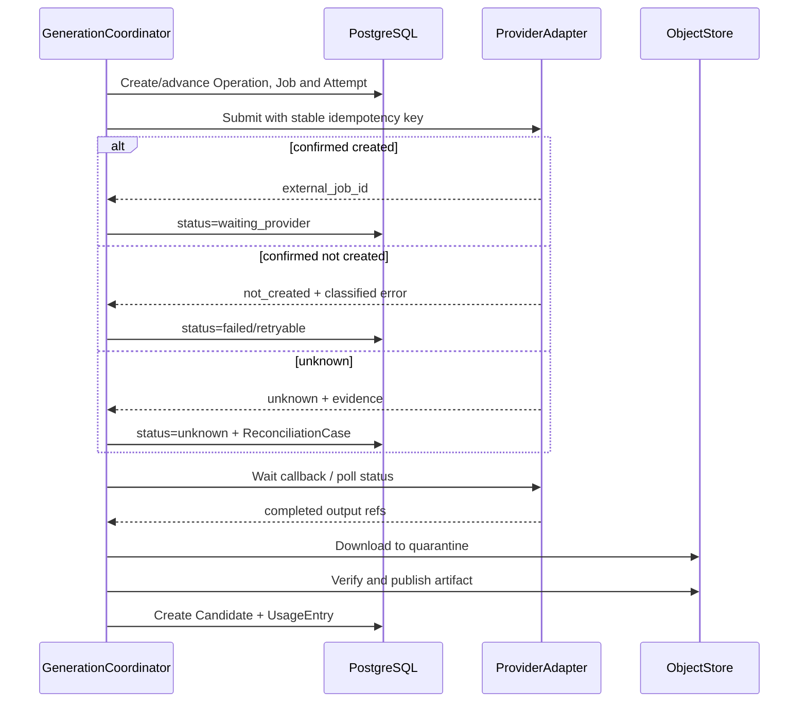

# AI 视频生产平台接口、工作流与功能实现设计

> 状态：提案 v4，待 API、耐久任务与研发评审；后端使用 019 的 Python 主栈
> 日期：2026-08-20
> 产品边界：[018-AI 视频生产平台目标产品与功能模块设计](018-AI视频生产平台目标产品与功能模块设计.md)
> 系统架构：[019-AI 视频生产平台目标系统架构设计](019-AI视频生产平台目标系统架构设计.md)
> 数据模型：[020-AI 视频生产平台核心领域与数据模型设计](020-AI视频生产平台核心领域与数据模型设计.md)

## 1. 实现结论

功能实现采用四层闭环：

1. 用户、画布或 API 提交同一种领域命令；Agent 先生成同一命令 Schema 的提案，用户接受后再进入相同命令处理器。
2. 应用层在 PostgreSQL 短事务中完成鉴权、版本校验和事实写入。
3. 需要长时间或外部副作用的命令在同一事务创建 Operation/Job 与 Outbox 启动意图。
4. Outbox 投递版本化 TaskEnvelope，独立 Python Worker 幂等执行并通过应用结果端口写回权威模块。

任何界面都不能直接拼接数据库更新；任何 Worker 都不能绕过已批准计划修改镜头、选择或审批。

019 已将 Python 单栈设为当前主路径：FastAPI、领域命令、事务、Outbox、调度/对账和 Worker 共享一套 Python 应用契约，但使用独立进程入口和最小权限。本文中的 `*Workflow` 表示可恢复的应用流程，不等于默认采用 Temporal；首期由 PostgreSQL 状态机、RabbitMQ、Scheduler/Reconciler 和幂等 Worker 实现。

`GenerationPlan`、`Operation`、`GenerationJob`、`Candidate`、`DeliveryBuild` 和 `DeliverySnapshot` 分别表达计划、用户可见运行、单项外部执行、历史输出、交付构建和最终交付。它们不能合并成一个跨全流程的大状态机。

## 2. HTTP 契约

### 2.1 路径与方法

```text
POST   /v1/{resources}                 创建稳定对象或提交命令
GET    /v1/{resources}/{id}            读取权威对象
GET    /v1/{resources}                 分页查询
PATCH  /v1/{resources}/{id}/draft      修改草稿，要求 If-Match
POST   /v1/{resources}/{id}:propose    提交为待批准
POST   /v1/{resources}/{id}:approve    批准并冻结
POST   /v1/{resources}/{id}:archive    归档
GET    /v1/events/stream               SSE 状态事件
```

冒号动作只用于具有明确业务语义的命令，不使用通用 `/action`。

### 2.2 请求头

| 请求头 | 适用范围 | 作用 |
| --- | --- | --- |
| `Authorization` | 所有请求 | 确定主体 |
| `X-Workspace-Id` | 所有租户请求 | 显式选择工作区，服务端验证成员关系 |
| `Idempotency-Key` | 所有 POST 命令 | 安全重试 |
| `If-Match` | 草稿更新与基线敏感命令 | 乐观并发 |
| `X-Request-Id` | 可选 | 调用方关联；缺失时服务端生成 |

### 2.3 异步返回

```json
{
  "command_id": "019...",
  "status": "accepted",
  "resource": {
    "type": "generation_plan",
    "id": "019...",
    "revision": 4
  },
  "operation": {
    "id": "019...",
    "status_url": "/v1/operations/019..."
  }
}
```

`202` 只表示命令已持久化；完成、失败、部分失败和未知通过 Operation 资源表达。

Operation 状态统一为：`accepted`、`queued`、`running`、`waiting_external`、`waiting_user`、`unknown`、`succeeded`、`partially_failed`、`failed`、`cancelled`。前端不读取 RabbitMQ、Task lease、Worker 进程或 LangGraph checkpoint 状态；`GET /v1/operations/{id}` 和 SSE 都来自 PostgreSQL Operation。Operation 的 `result_refs` 只引用业务结果，不复制候选、报告或快照正文。

Task、Job 和 Attempt 通过 `operation_id` 形成受限运维关联；普通客户端不把消息 ID、delivery tag 或 checkpoint ID 当作资源 ID 或恢复依据。

### 2.4 错误代码

| code | HTTP | 含义 | 客户端动作 |
| --- | --- | --- | --- |
| `revision_conflict` | 409 | 基线版本已变化 | 获取差异后重新提交 |
| `precondition_failed` | 412 | ETag 不匹配 | 刷新草稿 |
| `policy_blocked` | 422 | 权利或内容策略阻塞 | 按 recovery_actions 处理 |
| `usage_cap_exceeded` | 422 | 超过资源硬上限 | 缩小范围或申请批准 |
| `capability_unavailable` | 409 | 能力不可用或已失效 | 重新路由并创建新计划 |
| `operation_already_active` | 409 | 同一业务幂等范围已有运行或 unknown Operation | 读取现有 Operation，禁止重复提交 |
| `cross_workspace_reference` | 404 | 引用不属于当前工作区 | 不暴露对象是否存在 |

`unknown` 是 Operation/GenerationJob 的正常可恢复状态，不伪装成 HTTP 错误。进入 unknown 的原请求仍返回/保留同一个 Operation URL。

## 3. 模块 API

### 3.1 项目、导入和叙事

| API | 命令/查询 | 结果 |
| --- | --- | --- |
| `POST /v1/projects` | `CreateProject` | Project + Brief 草稿 |
| `POST /v1/projects/{id}/sources:initiate-upload` | `InitiateSourceUpload` | Artifact 占位和签名上传 |
| `POST /v1/source-revisions/{id}:complete-upload` | `CompleteSourceUpload` | 启动 ImportWorkflow |
| `GET /v1/import-jobs/{id}` | 查询解析状态 | ParseReport、缺口和恢复动作 |
| `GET /v1/narrative-revisions/{id}` | 查询结构 | Scene/Beat/Dialogue 与来源锚点 |
| `PATCH /v1/narrative-revisions/{id}/draft` | `EditNarrativeDraft` | 新草稿版本号 |
| `POST /v1/narrative-revisions/{id}:approve` | `ApproveNarrativeRevision` | current 修订和影响提案 |

### 3.2 生产知识与镜头

| API | 命令/查询 | 关键检查 |
| --- | --- | --- |
| `POST /v1/entities` | `CreateProductionEntity` | 项目、类型、规范名称 |
| `POST /v1/entities/{id}/state-revisions` | `CreateEntityStateRevision` | 生效范围与属性 Schema |
| `POST /v1/entity-state-revisions/{id}:preview-scope` | `PreviewEffectiveScope` | 将自然范围解析为稳定 ContentUnit/Shot ID 成员 |
| `POST /v1/entity-state-revisions/{id}:publish` | `PublishEntityStateRevision` | 显式 Scope、冲突、影响报告和权限 |
| `POST /v1/reference-bindings` | `BindReference` | 媒体可用、用途、所有者版本 |
| `POST /v1/content-units/{id}/shots:propose` | `ProposeShots` | 叙事 current、目标范围 |
| `PATCH /v1/shot-plan-revisions/{id}/draft` | `EditShotPlanDraft` | ETag、绑定范围 |
| `POST /v1/shot-plan-revisions/{id}:approve` | `ApproveShotPlanRevision` | 覆盖、状态和参考完整性 |
| `POST /v1/shot-order-revisions` | `ReorderShots` | 所有镜头同内容单元、不重复 |
| `POST /v1/audio-cues` | `CreateAudioCue` | 类型、镜头/内容单元、权威时间基 |
| `POST /v1/audio-cues/{id}/revisions` | `CreateAudioCueRevision` | 声音实体、文本/表演、整数时间位置 |

### 3.3 生成、任务与候选

| API | 命令/查询 | 关键检查 |
| --- | --- | --- |
| `POST /v1/generation-plans` | `CreateGenerationPlan` | 目标版本、规格、允许能力 |
| `POST /v1/generation-plans/{id}:preflight` | `PreflightGenerationPlan` | 输入、能力、权利和用量 |
| `POST /v1/generation-plans/{id}:approve` | `ApproveGenerationPlan` | 报告未过期、资源预留、`execution_disposition=start_now|hold` |
| `POST /v1/generation-plans/{id}:submit` | `SubmitGenerationPlan` | 仅 hold 且 approved；业务幂等；返回既有或新 Operation |
| `GET /v1/generation-jobs/{id}` | 查询 Job | 状态、进度、尝试和对账证据 |
| `POST /v1/generation-jobs/{id}:cancel` | `RequestJobCancellation` | 当前状态与提供商能力 |
| `POST /v1/reconciliation-cases/{id}:resolve` | `ResolveUnknownJob` | 具名证据与权限 |
| `GET /v1/candidate-sets/{id}` | 查询比较集 | 候选、代理、评分和问题 |
| `POST /v1/selection-decisions` | `SelectCandidate` | 候选 ready、目标上下文匹配或已通过显式复用预检 |

### 3.4 质量、审阅和交付

| API | 命令/查询 | 关键检查 |
| --- | --- | --- |
| `POST /v1/evaluations` | `RequestEvaluation` | subject hash、策略版本 |
| `POST /v1/quality-issues/{id}:acknowledge` | `AcknowledgeIssue` | 状态转换 |
| `POST /v1/repair-plans` | `CreateRepairPlan` | 问题、影响、预计用量 |
| `POST /v1/repair-plans/{id}:approve` | `ApproveRepairPlan` | 目标版本和门禁 |
| `POST /v1/review-packages` | `CreateReviewPackage` | Manifest 完整、媒体可读 |
| `POST /v1/review-packages/{id}:start` | `StartReview` | 冻结范围、审片权限 |
| `POST /v1/review-decisions` | `RecordReviewDecision` | 策略、哈希、审批人 |
| `POST /v1/delivery-builds` | `StartDeliveryBuild` | 冻结装配、主选决定、质量、审批、权利和输出规格 |
| `GET /v1/delivery-builds/{id}` | 查询构建 | 预检、RenderRun、校验和恢复动作 |
| `GET /v1/delivery-snapshots/{id}` | 查询最终快照 | 只返回已成功构建的不可变输入/输出 Manifest |

## 4. 领域事件契约

### 4.1 事件信封

```json
{
  "event_id": "019...",
  "event_type": "shot.plan.approved.v1",
  "occurred_at": "2026-08-19T12:00:00Z",
  "workspace_id": "019...",
  "aggregate": {"type": "shot", "id": "019...", "version": 7},
  "actor": {"type": "user", "id": "019..."},
  "trace_id": "...",
  "payload": {"shot_plan_revision_id": "019...", "content_hash": "..."}
}
```

- 事件名带 Schema 大版本。
- Payload 只包含订阅者做决定所需的小型事实。
- 媒体 URL、Prompt 全文和访问 Token 不进入事件。
- 订阅者先按 `event_id` 去重，再读取权威对象。

### 4.2 关键事件与处理器

| 事件 | 同步事实 | 异步处理 |
| --- | --- | --- |
| `narrative.revision.approved.v1` | 叙事 current 已切换 | 生成实体/镜头提案、更新依赖投影 |
| `entity.state.published.v1` | 状态版本已发布 | 计算影响、使草稿 PreflightReport 过期并提示已批准计划上下文漂移 |
| `shot.plan.approved.v1` | 镜头方案 current 已切换 | 更新覆盖率、允许生成规划 |
| `generation.plan.approved.v1` | 计划、用量预留及 start_now Operation 已按处置冻结 | Outbox 投递与既有 Operation 绑定的 Generation Task；hold 等待显式提交 |
| `generation.job.changed.v1` | Job 状态已提交 | 推送进度、汇总批次、记录用量 |
| `candidate.ready.v1` | 媒体已校验入库 | 技术质检、候选集投影 |
| `selection.recorded.v1` | 新选择决定已追加 | 装配风险、质量复检 |
| `quality.issue.opened.v1` | 问题及证据已保存 | 通知、阻塞投影 |
| `review.decision.recorded.v1` | 审阅决定已追加 | 修复或交付资格投影 |
| `delivery.build.changed.v1` | DeliveryBuild/RenderRun 状态已提交 | 更新 Operation、异常和恢复入口 |
| `delivery.ready.v1` | 不可变快照和 Manifest 已创建 | 通知、项目进度更新 |

## 5. ImportWorkflow

### 5.1 步骤

1. 校验 SourceRevision 状态和对象存储 HEAD。
2. 计算/确认内容哈希，拒绝上传未完成或大小不一致。
3. 文档安全检查；必要时转为受控中间格式。
4. 提取文本、结构和页码锚点，逐页保存 ParseReport。
5. 按 Schema 调用叙事分析器，得到 Scene/Beat/EntityHint 提案。
6. 校验提案引用的 SourceAnchor 和内容长度。
7. 创建 NarrativeRevision 草稿和 ExtractionProposal。
8. 将 ImportJob 置为 `needs_review` 并发送通知。

### 5.2 任务步骤策略

| 任务步骤 | 超时 | 重试 | 幂等键 |
| --- | --- | --- | --- |
| `verify_upload` | 1 min | 3 次传输重试 | artifact_id + hash |
| `extract_document` | 10 min | 确定失败不重试 | source_revision + extractor_version |
| `analyze_narrative` | 5 min | Schema/限流可有限重试 | source_hash + prompt/schema/model version |
| `persist_proposal` | 1 min | 数据库事务重试 | import_job_id + proposal_hash |

部分页失败时 ImportJob 返回 `partial` 并列出缺页；用户可继续校对成功内容或补充来源，不强迫整份重来。

## 6. InitialDraftWorkflow

用于 Agent 生成第一版可审阅方案，不直接执行高消耗视频任务：

1. 读取已批准 NarrativeRevision、项目 Brief 和现有生产知识。
2. 提出实体新增/合并/状态草稿；低置信度冲突进入待确认。
3. 提出 Shot、ShotPlanRevision 和 ShotOrderRevision 草稿。
4. 运行节拍覆盖、时长、实体状态和参考缺口检查。
5. 生成低消耗分镜计划草稿及 UsageEstimate。
6. 形成一个 AgentProposal，用户可逐项接受。

若用户在 AgentRun 期间批准了新的 NarrativeRevision，Run 仍可完成，但 Proposal 标记 `stale`，不能执行。

## 7. GenerationPlanWorkflow

GenerationPlan 的预检可由异步 Coordinator 执行，但批准必须是 PostgreSQL 中的短事务。批准命令接收 `execution_disposition`：

- `start_now`：批准事务通过 execution 端口同时创建 Operation、Job 和 Outbox；Dispatcher 投递与该 Operation 绑定的 Generation Task，失败时重投同一意图。
- `hold`：只冻结授权边界，直到显式 Submit 在短事务中创建 Operation 和启动 Outbox；重复 Submit 返回同一个活动 Operation。

计划批准后始终保持 `approved`。运行成功、部分失败、未知或取消只改变 Operation/GenerationJob。

### 7.1 预检顺序

1. **版本门禁**：镜头方案、实体状态、参考和规则仍为计划基线。
2. **完整性门禁**：必需实体、参考、输出规格和声音需求齐全。
3. **能力门禁**：至少一个能力满足格式、时长、参考数量和地区。
4. **治理门禁**：素材权利、提供商数据条款和内容策略兼容。
5. **编译门禁**：Prompt/参数通过提供商限制，负向规则未丢失。
6. **用量门禁**：计算 lower/expected/upper 并验证硬上限。

PreflightReport 保存所有检查及输入哈希。任何输入哈希变化都使报告过期。

### 7.2 提示编译

提示编译器输入为结构化对象：

```text
ShotIntent
EntityStateSnapshot[]
ReferenceBindingSnapshot[]
WorldAndStyleRules
ContinuityConstraints
OutputSpecification
ProviderCapabilityRevision
```

编译器输出为：正向提示、负向提示、参考及权重、参数、被省略字段和告警。编译结果必须可见、可锁定和可追踪；用户手工修改形成 Override，不回写上游事实。

## 8. ProviderGenerationWorkflow



### 8.1 重试规则

- DNS、连接重置、429：只重试传输或状态查询；提交是否重试取决于是否确认未创建。
- 4xx 输入错误：不重试，返回需修改输入。
- 模型安全拒绝：不换模型偷偷绕过；回到治理或新计划。
- 回调缺失：轮询恢复，不创建第二个任务。
- 下载失败：复用 external_job_id 重下，不重新生成。
- 文件损坏：隔离输出并按提供商证据决定重新下载或新计划。
- 取消未知：保持 unknown，继续对账。

### 8.2 回调处理

Webhook 端点只做：读取原始字节、验证签名/时间窗、按 ProviderEvent ID 去重、由 ExternalJob ID 反查内部 Job、保存 CallbackReceipt 并写 Outbox。Provider Coordinator/Reconciler 重新读取 Receipt 和 Job 后推进状态；Webhook 不直接把 Job 标记成功。

## 9. ImpactAnalysisWorkflow

上游变化可能来自叙事、实体状态、参考、风格、镜头顺序或质量策略。

1. 保存 ChangeSet，计算稳定哈希。
2. 从依赖投影查找直接引用，再按 hard/soft 边向下展开。
3. 对每个对象分类：`must_revise`、`needs_review`、`unaffected`。
4. 标识尚未执行计划、运行中任务、候选、审阅包和交付快照。
5. 估算选中范围的新计划用量。
6. 生成 ImpactReport，等待用户选择传播范围。

系统只自动使未执行草稿的 PreflightReport 过期，并把无法继续的计划草稿置为 blocked；已批准计划、候选和交付不被删除或改写。运行中任务默认继续，除非用户明确取消且提供商支持。

## 10. QualityAndRepairWorkflow

### 10.1 评估流水线

1. 技术探测：编码、时长、帧、音轨、黑帧、响度和字幕。
2. 镜头符合性：主体、动作、构图、场景和时长与 ShotIntent 对比。
3. 连续性：与相邻已选候选和 EntityStateSnapshot 比较。
4. 治理规则：禁用元素、品牌规则和交付必需项。
5. 去重/合并相同规则和证据区域，创建 QualityIssue。

评估器只输出结构化提案：rule_code、severity、confidence、time/region、evidence、suggested_actions。应用层校验后才保存 Issue。

### 10.2 修复

RepairPlan 明确动作属于哪一层：

- 后处理：裁剪、转码、音量、字幕时序。
- 重新编译：保持镜头意图，修改模型提示或参数。
- 换参考/能力：产生新 GenerationPlan。
- 修改镜头方案：先创建 ShotPlanRevision，再计算影响。
- 修改生产知识：先创建 EntityStateRevision，再计算更大影响。

执行完成后定向复检原规则；不以“新文件已生成”作为问题解决证据。

## 11. ReviewWorkflow

1. 根据对象版本生成 ReviewPackage Manifest 和审阅代理媒体。
2. 校验审片人访问范围并启动审阅。
3. 评论绑定包、对象、媒体版本、时间范围或画面区域。
4. 评论可转换为 QualityIssue，但保留双向引用。
5. ReviewDecision 与 Outbox 同事务写入；Review Coordinator 重新读取决定后推进流程。
6. `changes_requested` 产生待处理项；`approved` 只批准当前 Package。
7. 任一对象变化后原 Package 标记 superseded，但决定保留。

外部审片链接是短时、可撤销的审阅会话，不在 URL 中放工作区或对象存储长期凭据。

## 12. DeliveryWorkflow

### 12.1 预检

- 每个 TrackItem 有 ready 主选及可读原件。
- 当前装配没有缺口、重叠或非法时间范围。
- 阻塞级质量问题已解决或有有效 RiskAcceptance。
- ReviewPolicy 所需审批已满足且绑定当前内容哈希。
- 所有素材的 RightsDeclaration 覆盖目标用途、地区和期限。
- ExportPreset 与媒体规格兼容。

### 12.2 渲染阶段

1. 创建 DeliveryBuild，冻结装配、SelectionDecision、审批、权利、质量、时间基、预设和输入哈希。
2. 生成确定性 RenderPlan，并创建独立 RenderRun。
3. 下载/准备原件，验证哈希。
4. 按项目有理帧率和装配时间基生成中间轨：画面、对白、配音、音乐、字幕。
5. 执行 FFmpeg 装配；每阶段有独立 Artifact 和日志摘要。
6. 校验容器、编码、轨道、帧数、时长、黑帧、响度和字幕。
7. 生成完整输入/输出 Manifest、校验和与附属文件。
8. 重新检查会随时间变化的权利、策略和审批有效性，并确认 Build 输入哈希未变化。
9. 仅在所有必需产物通过后，一次性创建 DeliverySnapshot；失败保留 DeliveryBuild/RenderRun 和阶段产物用于诊断，不创建快照。

相同输入哈希可复用中间产物，但每次 RenderRun 仍保存独立运行记录。

## 13. Agent 功能实现

Agent 不直接拥有“自动操作系统”的旁路权限，而是领域命令的规划器。

FastAPI 应用端在短事务中创建 `AgentRun`、Operation 和 Outbox；Outbox Publisher 将版本化 `AgentRunRequest` 投递到专用 Agent 队列。Agent Worker 的 LangGraph 只执行一次 Run 内部的分析、只读 Tool 和提案图，输入输出使用 019 定义的版本化 Pydantic/JSON Schema。LangGraph checkpoint 不成为产品状态；所有写 Tool 实际只生成 ProposalItem，接受时由权威应用命令处理器重新鉴权、检查基线版本并提交。

| Tool | 只读/写入 | 输出/命令 |
| --- | --- | --- |
| `get_project_context` | 只读 | 精简项目、版本、阻塞和用量上下文 |
| `analyze_source` | 异步提案 | 创建 Import/分析任务提案 |
| `propose_entities` | 提案 | CreateEntity/State 草稿命令列表 |
| `propose_shots` | 提案 | CreateShot/ShotPlan/Reorder 命令列表 |
| `prepare_generation_plan` | 提案 | GenerationPlan 草稿和 Preflight |
| `explain_quality_issue` | 只读 | 证据、规则和候选修复动作 |
| `prepare_repair_plan` | 提案 | RepairPlan 草稿 |
| `get_operation_status` | 只读 | 权威 Operation 状态 |

Tool 输出有 JSON Schema、最大对象数量和版本引用。高消耗调用、选择、风险接受、审批和交付没有自动执行 Tool。

Agent Tool 分为两类：只读 Tool 通过受限内部 Query 端口获取最小上下文；提案 Tool 只构造命令载荷，不能调用写 API。产品级人工等待由业务命令/Operation 表达，不在 LangGraph `interrupt` 中维护第二套批准状态。

## 14. 画布与列表实现

- 画布节点键为 `{object_type, object_id, revision_id?}`。
- 节点内容通过批量 Query API 读取，布局通过 CanvasLayout 单独保存。
- 创建连线只产生“建议的领域命令”；例如镜头连到参考图对应 `BindReference`，不能保存任意业务边。
- 框选批量操作先调用 `:preview-command` 返回目标、跳过、冲突、影响和用量，再正式提交。
- 列表与画布调用同一命令；使用事件流刷新，断线后按 SSE cursor 补齐。
- 删除画布节点默认只移出当前视图；领域归档使用单独菜单和确认。

## 15. 媒体实现

### 15.1 上传

1. API 创建 Artifact 占位，返回限定大小、类型、对象键和期限的签名上传。
2. 客户端直传对象存储。
3. 完成命令验证对象 HEAD、大小和调用方声明哈希。
4. Media Worker 进行 MIME/魔数、恶意文件、ffprobe 和资源限制检查。
5. 通过后从 quarantine 发布到 originals，并生成代理。

### 15.2 FFmpeg 隔离

- 每任务独立临时目录、非 root、只读输入、限定输出目录。
- 禁用不需要的网络协议和设备访问。
- 设置 CPU、内存、磁盘、进程数和墙钟超时。
- 参数由受控结构编译，不拼接用户提供的 shell 字符串。
- 保存工具版本、参数哈希和截断后的标准错误摘要。

## 16. 权限和策略执行点

| 执行点 | 必须校验 |
| --- | --- |
| API 命令入口 | 身份、工作区、项目权限、对象状态 |
| Agent Proposal 接受 | 重新鉴权、版本、风险等级 |
| 计划预检 | 能力、权利、内容、资源上限 |
| 计划提交前 | 计划仍 approved、策略未撤销、连接健康 |
| 候选访问 | 对象工作区、项目访问、媒体用途 |
| 审阅启动/决定 | Package 访问、审批角色、哈希 |
| 交付创建 | 主选、质量、审批、权利、保留策略 |
| 签名下载 | 主体、对象、用途、期限、撤销状态 |

策略服务不可用时，高风险外发和正式交付失败关闭；普通只读可按短期缓存策略降级。

## 17. 事务与并发实现

- 每个命令使用一个短 PostgreSQL 事务。
- 命令表先按幂等键查找；相同键不同请求哈希返回冲突。
- 聚合更新包含 `WHERE revision_no = expected`；受影响行数为零即并发冲突。
- 领域状态与 Outbox 事件同事务写入。
- Worker 结果由权威应用端口使用业务唯一键提交，消息重复投递或 Worker 重启不会重复写事实；Agent/ML Worker 不直接写业务表。
- 资源预留使用条件更新或锁定 Scope 行，防止并发超限。
- 不在事务中调用 LLM、对象存储、RabbitMQ 或提供商。
- “批准计划 + 资源预留”等跨模块原子用例由顶层用例编排器调用各模块写端口；编排器不能绕过端口直接写对方表。
- Operation、Job 与启动意图在同一事务提交；Outbox/Dispatcher 至少一次投递，以业务幂等键保证只对应一个逻辑任务，重复消息复用既有 Operation/Job。

## 18. 观测实现

每次操作传播 W3C Trace Context，并把以下属性作为低基数字段：

```text
workspace_id_hash
module
command_type
workflow_type
provider_code
capability_code
job_status
error_class
```

项目名、文件名、Prompt、评论内容和签名 URL 不进入标签。日志事件包含 request/command/operation/task/job/attempt ID，支持从用户错误追到外部证据。

关键告警：unknown 任务积压、回调验签失败突增、Outbox 滞后、队列/死信积压、Task lease 过期、媒体隔离率、跨租户拒绝、用量估算偏差和交付校验失败。

## 19. 测试到功能的映射

| 功能 | 最低测试 |
| --- | --- |
| 修订批准 | 并发批准、旧基线、唯一 current、审计 |
| Agent 提案 | Schema、逐项决定、过期、越权 Tool |
| 生成计划 | 输入变化、能力变化、权利阻塞、资源上限 |
| 外部执行 | 提交超时、重复回调、乱序回调、取消未知 |
| Operation | Outbox 投递失败、Job 已推进但投影滞后、重复任务、父子进度汇总 |
| 媒体 | 伪造类型、损坏文件、超长媒体、派生谱系 |
| 选择 | 并发选择、目标上下文不匹配、显式复用、历史审阅不变化 |
| 质量修复 | 旧评估过期、局部范围、复检失败 |
| 审阅 | 内容哈希变化、链接撤销、权限变化 |
| 交付 | 缺素材、权利到期、部分附属失败、重复渲染、失败不产生 Snapshot、分数帧率时间基 |
| 租户隔离 | 已知 UUID 越权、签名 URL、RLS、服务身份 |

## 20. 研发切片与完成定义

| 切片 | 垂直功能 | 完成定义 |
| --- | --- | --- |
| A | Python 运行骨架、项目、来源直传/导入、叙事校对、最小实体和手工镜头、Operation/Outbox | 无 Agent/真实 Provider 时可从真实文档得到带锚点的批准叙事和至少 10 个镜头；任务重启可恢复 |
| B | 独立 Agent Worker、实体/镜头提案、checkpoint、逐项接受 | Agent 复用 A 的查询与命令；关闭 Agent 后手工流程完整；显式 Scope 不随重排漂移 |
| C | 计划、一个图像/视频适配器、候选选择 | 故障注入下无重复任务或候选 |
| D | 质量问题、修复计划、局部重做 | 问题有证据并通过复检关闭 |
| E | 审阅、基础画面/音频/字幕装配、DeliveryBuild/Snapshot | 失败构建不产生快照；成功交付可复现，审批/权利缺失被阻止 |
| F | 画布、团队协作与组织复用 | 与 Agent/列表使用同一命令，任何高风险动作需确认 |

每个切片必须同时完成：领域测试、真实 PostgreSQL 集成测试、Outbox/队列/Worker 故障测试、OpenAPI 与任务契约、权限负向测试、指标和运维恢复说明。页面可用但这些条件未满足时，不算完成。

## 21. 开发前仍需确定的配置

以下是实现配置，不改变本设计的模块边界：

1. 首期支持的来源格式和单文件上限。
2. 首期一个图像与一个视频能力的真实沙箱行为。
3. 首期项目最大镜头数、并发任务数和单媒体大小。
4. 正式交付需要的编码、字幕和工程交换格式。
5. 是否存在禁止外发、限定地域或必须私有部署的数据类别。
6. 外部审片是否首期必需；若不必需可先仅支持工作区成员。
