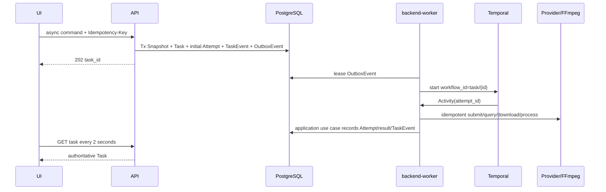

# 任务执行与媒体处理

## 1. 设计结论

剧本、分镜、媒体生成、逐句 TTS 和整集渲染都是持久任务。每条异步 API 命令只对应一个逻辑目标或媒体使用位置，并在 PostgreSQL 同一事务写入不可变输入快照、`ProductionTask`、初始 `ProductionAttempt`、TaskEvent 和 OutboxEvent 后返回 `202 task_id`；前端以多个独立命令形成只用于展示的 Task 集合。`backend-worker` 至少一次派发 OutboxEvent，以 `workflow_id=task/{task_id}` 幂等启动 Temporal。Workflow 只编排稳定 ID，所有副作用位于幂等 Activity。

## 2. 核心事实与不变式

| 对象 | 关键事实 | 不变式 |
| --- | --- | --- |
| `SubmissionSnapshot` | 类型、输入版本/哈希、Prompt、参数、Provider/模型 | 提交后不可修改；Task 只引用一个快照 |
| `ProductionTask` | 用户逻辑目标、作用域、状态、进度、结果/错误引用 | 终态不可回退；幂等键只创建一个逻辑任务 |
| `ProductionAttempt` | 一次外部执行、Provider 请求、用量和安全摘要 | 自动重试新建 Attempt，不覆盖旧 Attempt |
| `TaskEvent` | Task 资源版本、内部事件类型和安全载荷 | 与状态写入同事务追加；只用于恢复/追踪 |
| `OutboxEvent` | 待启动 Workflow 的内部消息、租约和退避 | 至少一次派发；重复派发不得重复 Workflow |
| `GenerationCandidate` | 明确 Attempt、确定性输出槽与 MediaVersion 的候选 | 每个 Task/usage slot 最多一个 ready `primary`；额外或迟到结果 blocked；成功不自动采用 |
| `SubtitleVersion` | 由已确认对白/旁白和当前 TTS 派生的字幕 Cue | 确认版本不可修改；上游变化只令 input_outdated=true |
| `RenderSnapshot` | 镜头顺序、采用媒体、TTS、字幕、规格和工具配方 | 同一快照可重试；输入变化必须新建快照 |
| `DeliveryVersion` | 一个 Render Task 的交付状态、MP4/SRT/Manifest 与质检摘要 | 自动 Attempt 更新同一版本；用户重试新建版本并引用失败/取消版本 |

## 3. 状态模型

| 对象 | 状态 |
| --- | --- |
| Task | 仅含 `queued/running/cancelling/cancelled/succeeded/failed/unknown`；queued/running 可进入 cancelling 或结果态，unknown 经对账可回 running/结果态；cancelling 最终进入 cancelled，或在已完成副作用先被证实时进入 succeeded/failed/unknown |
| Attempt | `created → submitted → provider_running → downloading → postprocessing → succeeded`；任一步可转 `failed/cancelled/unknown`，`unknown` 经对账回到已证明阶段或终态 |
| Candidate | `pending_media → ready/blocked`；标识/谱系/内容不可改，只有状态单向推进；是否采用由 Adoption 表达 |
| MediaVersion | `pending → ready/invalid`；标识/对象/谱系不可改，只有状态单向推进且版本不可原位替换 |
| DeliveryVersion | `rendering → ready/failed/cancelled`；三个终态均不可原位复活；Render Task 确认取消后，已存在的 Delivery 必须收敛为 cancelled |

Task 的 `progress={phase,completed,total}` 是展示数据，不参与合法状态判断。自动重试在同一 Task 下新建 Attempt；用户在 Task 失败后重试会创建新 Task，并保存 `retry_of_task_id`。

Task 查询可附带计算字段 `input_outdated`，但它不属于状态机。Candidate/Adoption 的 usage slot 固定 `usage_type/usage_id/input_version_id/input_hash`；上游新版本只使旧槽位对当前生产不合格，不修改已受理 Task、Attempt 或历史 Adoption。

媒体任务固定单一可采用的 `primary` 输出槽；一个成功 Task 在同一 usage slot 最多产生一个 ready Candidate。Provider 多余输出若需登记，按 Provider 原始顺序使用确定性 `extra/{index}` 输出槽且只允许 blocked；取消后的迟到主输出仍使用 `primary` 且只允许 blocked。`attempt_id+output_slot` 唯一使 Activity 重放复用原 Candidate/MediaVersion；自动重试不能把重放转换为第二个可采用候选，用户需要新候选时创建新 Task。

取消与完成竞争时，以数据库首次持久化且有外部证据支持的结果为准：cancelled 不得覆盖已证明的 succeeded/failed，迟到成功不得复活已持久化的 cancelled。Task 与 TaskEvent 在同一事务推进；跨模块不伪造原子事务。Render Task 在 Delivery 创建前取消时不创建空 Delivery；若 Delivery 已存在，Workflow 必须调用 delivery 用例使其收敛为 cancelled 后完成取消。

## 4. 创建、执行与恢复



- OutboxEvent 派发成功前不删除记录；失败按有上限的指数退避，超过阈值进入可重放失败状态。
- Activity 在发送前持久化稳定 `provider_request_key` 并作为 Provider 幂等键；数据库唯一约束保护 `task_id + attempt_no`、`provider_id + provider_request_key` 和输出槽位。
- Worker 崩溃后 Temporal 重放 Workflow；Activity 先查询本地 Attempt 和远端状态，再决定继续，不能盲目重复副作用。
- Provider 提交超时且无法证明未受理时，Attempt/Task 进入 `unknown`；只通过 `provider_request_id` 或客户端 token 对账。
- API/Worker 更新 Task 时同时追加 TaskEvent 并递增 `resource_version`；前端轮询只读取 Task，不消费内部事件。

## 5. Workflow 清单

| Workflow | 固定输入 | 结果 |
| --- | --- | --- |
| `GenerateScriptWorkflow` | SourceRevision、文本模型/Prompt Schema | 新 ScriptVersion 草稿、origin_task_id 与 TaskOutput |
| `GenerateStoryboardWorkflow` | 已确认 ScriptVersion、目标规格与结构化输出 Schema | CreativeAssetVersion 草稿集合、Episode 级 ShotSpecVersion 草稿、origin_task_id 与 TaskOutput |
| `GenerateMediaWorkflow` | 单个角色/场景资产参考、镜头图片、镜头视频或语音使用位置的 SubmissionSnapshot 与能力配置 | 一个 `primary` ready Candidate；额外/迟到结果 blocked；多个使用位置由前端提交独立 Task/Workflow |
| `RenderEpisodeWorkflow` | RenderSnapshot、FFmpeg 配方 | DeliveryVersion、MP4/SRT/Manifest MediaVersion 与质检摘要 |

Workflow 不跨越人工确认或采用等待。用户决定保存在 PostgreSQL，下一条命令基于该决定创建新的 Workflow，避免永久挂起的人机工作流。

## 6. Provider 端口

```text
TextProvider.submit/status/result/cancel(snapshot, schema, attempt)
ImageProvider.submit/status/result/cancel(snapshot, attempt)
VideoProvider.submit/status/result/cancel(snapshot, attempt)
TtsProvider.submit/status/result/cancel(sentence, voice, attempt)
```

静态 `ProviderRegistry` 是唯一 Provider 解析入口，从只读服务端配置为每种模态解析唯一 Adapter；MVP 先实现确定性 Mock，并在 `PLAN-01` T-011 前为每种模态绑定一个已批准真实 Adapter。配置外 Provider ID 必须启动失败；Provider、模型、凭据引用、额度、地区/保留边界和失败计费事实未确定时不得开始 T-011 或真实调用。

统一错误为 `RATE_LIMITED`、`CONTENT_REJECTED`、`INVALID_INPUT`、`AUTHENTICATION_FAILED`、`DEPENDENCY_UNAVAILABLE`、`OUTPUT_INVALID`、`PROVIDER_STATE_UNKNOWN`。只有明确可重试且未超 Attempt 上限的错误可自动退避；认证、输入和内容拒绝直接失败。

## 7. 媒体与最小声音链路

1. 先为角色/场景 CreativeAssetVersion 和镜头图片使用位置生成图片候选并形成 active Adoption；整体视觉风格不创建图片 usage slot，其 confirmed version ID/content_hash 必须进入相关镜头图片/视频的 Prompt、SubmissionSnapshot 和 `input_hash`。镜头视频快照必须同时引用镜头、confirmed 风格版本及相关角色/场景的 active 图片 Adoption，缺任一必需引用时不得创建视频 Task。图片/视频结果只能由 Adapter 从允许域或 SDK 取得，并限制 DNS/IP、重定向、字节、耗时和 MIME。
2. Worker 下载到受限临时目录，计算 SHA-256，并用 `ffprobe` 验证可解码、尺寸、帧率、时长和音轨；`shot_video` 还必须在进入 ready 前验证实际时长与快照中的 ShotSpec `duration_ticks` 相差不超过 90,000 ticks。通过后写入私有 S3/MinIO 并以 MediaVersion ready/Candidate ready 登记；超差、损坏或不可解码输出从 pending 单向进入 MediaVersion invalid/Candidate blocked，不能采用。
3. 剧本对白或旁白语音条目按句生成 TTS，保存 `speech_line_id/voice_id/text_hash/audio_media_version_id`；逐句失败使对应镜头阻断，不能以静音冒充成功。
4. 来源、ShotSpec、字幕与 RenderSnapshot 统一使用 90,000 ticks/秒；24fps 的 ShotSpec duration 必须对齐 3,750 ticks。源语言字幕由已确认的对白或旁白语音条目及当前 TTS 时长生成，Cue 保存稳定 ID、文本、起止 tick、音色角色、SpeechLine/ScriptVersion/text_hash 和 TTS MediaVersion。
5. Cue 起止时间均为 Episode 全局 tick。自动字幕从所属镜头全局起点加 9,000 ticks 前导开始，句间默认 9,000 ticks；用户只可编辑 draft 的字幕文本和全局起点而不改变剧本或 TTS，Cue 终点固定为起点加未变速 TTS 时长。confirmed 字幕再次编辑必须由 `deriveSubtitleDraft` 复制为带 parent 的新 draft；上游输入变化则由 `createSubtitles` 基于当前输入生成带 parent 的新 draft。确认前拒绝负时长、倒序、越出所属镜头、重叠、缺少语音映射或 TTS 溢出；溢出只能通过修改文本/音色或调整 3～8 秒 ShotSpec 新版本解决。SRT 与烧录滤镜共同使用 `millisecond=floor((tick+45)/90)` 的 half-up 换算，禁止各自舍入。每个 Episode 只有一个 current confirmed SubtitleVersion，上游变化只令旧版本 `input_outdated=true`。
6. RenderSnapshot 仅固定已采用镜头视频、每条语音的 TTS Adoption、confirmed SubtitleVersion、有序片段时间和输出配方；缺任一引用时拒绝创建且定位缺项。`renderEpisode` 先由 delivery 以外层 scope/key/request_hash 创建或复用 Snapshot，再直接调用 production-jobs 的持久化用例，以 `ProductionTask.idempotency_scope=render-task`、`idempotency_key={snapshot_id}` 创建或复用初始 Task，最后回写 snapshot.initial_task_id；该用例依赖 ProductionTask 的数据库唯一约束，不依赖 API 幂等中间件。并发或在三步任一点崩溃后，重放都复用同一 Snapshot/Task；同键异请求冲突，不使用跨模块事务。终态失败的用户重试使用新的用户重试 scope/key 创建新 Task/Delivery 并引用同一 Snapshot，但不改 initial_task_id。
7. Render Workflow 启动后创建与 Task 一一对应的 DeliveryVersion，只消费已通过第 2 步门禁并已采用的视频。每段视频先防御性复核对象哈希、可解码性和已保存探测摘要，再移除源音轨，使用保持比例缩放和居中补边得到 720×1280；长段从尾部 trim、短段用末帧补齐。防御性复核不符只使本次 Render Attempt/DeliveryVersion 失败并给出稳定输入错误，不得把 ready Candidate/MediaVersion 倒退为 blocked/invalid，也不得修改历史 Adoption。TTS 不变速、不裁剪，按 confirmed Cue 起点放置，空白区保持静音；音频图只包含 TTS 与静音。最终由服务端 FFmpeg 输出 24fps、H.264 yuv420p、AAC 48,000Hz stereo MP4，烧录字幕并生成内容一致的 SRT。FFmpeg 使用参数数组，记录工具/配方版本和输入输出哈希。
8. ffprobe 质检输出 codec、尺寸、帧率、时长、流数量和音画差；最大音画偏差必须不高于 100ms。烧录字体固定为 Noto Sans CJK SC（OFL-1.1），T-001 必须锁定字体文件 digest 并保留许可证副本。MP4、SRT 与规范 JSON Manifest 分别登记 MediaVersion；Manifest 固定列出输入版本/哈希、Adoption、Task/Attempt、工具配方、MP4/SRT 哈希和质检摘要，DeliveryVersion 另存 Manifest 自身哈希。失败不产生 ready DeliveryVersion。

## 8. 失败与处置

| 故障 | 状态与恢复 |
| --- | --- |
| 文本 Provider 返回非法 Schema | 保存安全摘要；自动重试新建 Attempt，耗尽后 Task failed |
| Provider 限流/暂不可用 | 有上限退避；保持 Task 可判断并继续使用快照指定的 Provider |
| 提交结果未知 | Task/Attempt unknown；对账前不重复提交或伪造失败 |
| 多项镜头任务部分失败 | 成功 Candidate 保留；集合视图显示逐项进度，失败使用位置由用户新建重试 Task |
| 候选入库时媒体超差、损坏或不可解码 | 从 pending 单向进入 MediaVersion invalid、Candidate blocked，不允许采用或渲染 |
| 渲染防御性复核与已保存哈希/探测不符 | Render Attempt/DeliveryVersion failed，输入 Candidate/MediaVersion/Adoption 保持不变；用户重新生成并采用新候选 |
| 取消后迟到结果 | 登记谱系并标记 blocked；版本不匹配另显示 input_outdated，不自动采用或复活 Task |
| TTS 某句失败 | 镜头阻断；已成功句不删除，自动恢复新 Attempt，人工重试新 Task |
| 渲染/质检失败 | DeliveryVersion failed；自动重试在原 Task/DeliveryVersion 下复用 RenderSnapshot 新建 ProductionAttempt，用户重试新建引用原 Task/DeliveryVersion 的 Task 与 DeliveryVersion，不覆盖旧 MP4/SRT/Manifest |
| 对象存储不可用 | 保持 Attempt/Delivery 未完成，恢复后按哈希继续，不伪造成功 |

## 9. 迁移与回滚

初始迁移建立 Task/Attempt/OutboxEvent/TaskEvent 唯一约束和状态字段。Workflow 代码变化须保持确定性；不兼容版本使用新 Workflow 类型或队列。回滚停止新命令、保留兼容 Worker 处理已受理 Workflow，并保留快照、Attempt、媒体和 Delivery；对象只在无数据库引用且经对账后清理。

## 10. Design 验收标准

- AC-ARCH-002-001：任一异步命令提交后即存在 Snapshot、唯一 Task、初始 Attempt、OutboxEvent 和初始 TaskEvent，API 返回同一 `task_id`。
- AC-ARCH-002-002：重复请求、OutboxEvent 或 Activity 只产生一个逻辑 Task、一个 Workflow 和每输出槽一个媒体版本。
- AC-ARCH-002-003：在派发、提交、下载、登记和渲染各点重启 Worker，任务均恢复到可判断状态且不重复副作用。
- AC-ARCH-002-004：供应受理未知、取消、迟到结果和 Task 集合部分失败均保留历史，并提供安全的对账或局部重试路径。
- AC-ARCH-002-005：每个采用媒体可追溯到快照、Task/Attempt、Provider/模型、输入版本、哈希和人工 Adoption。
- AC-ARCH-002-006：必需的逐句 TTS、可编辑/确认 SubtitleVersion、SRT 和 720×1280 MP4 均有固定输入、工具版本、质检及失败证据。
