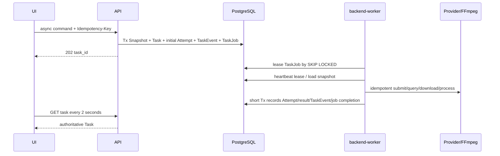

# 任务执行与媒体处理

## 1. 设计结论

剧本、分镜、媒体生成、逐句 TTS 和整集渲染都是持久任务。每个被 `production_jobs` 受理的异步 Task 只对应一个逻辑目标或媒体使用位置，并在 PostgreSQL 同一事务写入 `SubmissionSnapshot`、`ProductionTask`、初始 `ProductionAttempt`、TaskEvent 和 TaskJob 后返回 `202 task_id`；Render 的外层 RenderSnapshot 先由 delivery 幂等固定，再作为该 SubmissionSnapshot 的输入引用。前端以多个独立命令形成只用于展示的 Task 集合。单一 `backend-worker` 通过 `FOR UPDATE SKIP LOCKED` 获取 TaskJob 租约，按 Task 类型调用显式 Job Handler；数据库和外部副作用以短事务、稳定请求键与对账收敛。

## 2. 核心事实与不变式

| 对象 | 关键事实 | 不变式 |
| --- | --- | --- |
| `SubmissionSnapshot` | 类型、输入版本/哈希、Prompt、参数/parameters_hash、model_profile_id/Provider/模型/路由版本 | 提交后不可修改；Task 只引用一个快照 |
| `ProductionTask` | 用户逻辑目标、作用域、状态、进度、结果/错误引用 | 终态不可回退；幂等键只创建一个逻辑任务 |
| `ProductionAttempt` | 一次外部执行、Provider 请求、用量和安全摘要 | 自动重试新建 Attempt，不覆盖旧 Attempt |
| `TaskEvent` | Task 资源版本、内部事件类型和安全载荷 | 与状态写入同事务追加；只用于恢复/追踪 |
| `TaskJob` | Task 的待执行行、租约、心跳、尝试次数与退避 | 一个 Task 恰有一行；过期租约先对账再恢复，不重复外部副作用 |
| `GenerationCandidate` | 明确 Attempt、确定性输出槽与 MediaVersion 的候选 | 每个 Task/usage slot 最多一个 ready `primary`；额外或迟到结果 blocked；成功不自动采用 |
| `SubtitleVersion` | 由已确认对白/旁白和当前 TTS 派生的字幕 Cue | 确认版本不可修改；上游变化只令 input_outdated=true |
| `RenderSnapshot` | 镜头顺序、采用媒体、TTS、字幕、规格和工具配方 | 同一快照可重试；输入变化必须新建快照 |
| `DeliveryVersion` | 一个 Render Task 的交付状态、MP4/SRT/Manifest 与质检摘要 | 自动 Attempt 更新同一版本；用户重试新建版本并引用失败/取消版本 |

## 3. 状态模型

| 对象 | 状态 |
| --- | --- |
| Task | 仅含 `queued/running/cancelling/cancelled/succeeded/failed/unknown`；queued/running 可进入 cancelling 或结果态，unknown 经对账可回 running/结果态；cancelling 最终进入 cancelled，或在已完成副作用先被证实时进入 succeeded/failed/unknown |
| Attempt | `created → submitted → provider_running → downloading → postprocessing → succeeded`；任一步可转 `failed/cancelled/unknown`，`unknown` 经对账回到已证明阶段或终态 |
| Candidate | `pending_media → ready/blocked`；标识/谱系/内容不可改，只有状态单向推进；是否采用由 Adoption 表达 |
| MediaVersion | `pending → ready/invalid`；标识/对象/谱系不可改，只有状态单向推进且版本不可原位替换 |
| DeliveryVersion | `rendering → ready/failed/cancelled`；三个终态均不可原位复活；Render Task 确认取消后，已存在的 Delivery 必须收敛为 cancelled |

Task 的 `progress={phase,completed,total}` 是展示数据，不参与合法状态判断。自动重试在同一 Task 下新建 Attempt；用户在 Task 失败后重试会创建新 Task，并保存 `retry_of_task_id`。

Task 查询可附带计算字段 `input_outdated`，但它不属于状态机。Candidate/Adoption 的 usage slot 固定 `usage_type/usage_id/input_version_id/input_hash`；上游新版本只使旧槽位对当前生产不合格，不修改已受理 Task、Attempt 或历史 Adoption。

媒体任务固定单一可采用的 `primary` 输出槽；一个成功 Task 在同一 usage slot 最多产生一个 ready Candidate。Provider 多余输出若需登记，按 Provider 原始顺序使用确定性 `extra/{index}` 输出槽且只允许 blocked；取消后的迟到主输出仍使用 `primary` 且只允许 blocked。`attempt_id+output_slot` 唯一使 Job Handler 恢复时复用原 Candidate/MediaVersion；自动重试不能把恢复转换为第二个可采用候选，用户需要新候选时创建新 Task。

取消与完成竞争时，以数据库首次持久化且有外部证据支持的结果为准：cancelled 不得覆盖已证明的 succeeded/failed，迟到成功不得复活已持久化的 cancelled。Task 与 TaskEvent 在同一事务推进；跨模块不伪造原子事务。Render Task 在 Delivery 创建前取消时不创建空 Delivery；若 Delivery 已存在，Job Handler 必须调用 delivery 用例使其收敛为 cancelled 后完成取消。

## 4. 创建、执行与恢复



- TaskJob 永久保留执行事实；失败按有上限的指数退避更新 `next_attempt_at`，超过阈值进入只可显式 replay 的 failed。
- Job Handler 在发送前持久化稳定 `provider_request_key` 并作为 Provider 幂等键；数据库唯一约束保护 `task_id + attempt_no`、`provider_id + provider_request_key` 和输出槽位。
- Worker 周期心跳续租；崩溃后其他进程只领取已过期租约，先查询本地 Attempt 和远端状态，再决定继续，不能盲目重复副作用。
- Provider 提交超时且无法证明未受理时，Attempt/Task 进入 `unknown`；只通过 `provider_request_id` 或客户端 token 对账。
- API/Worker 更新 Task 时同时追加 TaskEvent 并递增 `resource_version`；前端轮询只读取 Task，不消费内部事件。

## 5. Job Handler 清单

| Job Handler | 固定输入 | 结果 |
| --- | --- | --- |
| `GenerateScriptJobHandler` | SourceRevision、文本 model_profile_id、Prompt 与 Schema | 新 ScriptVersion 草稿、origin_task_id 与 TaskOutput |
| `GenerateStoryboardJobHandler` | 已确认 ScriptVersion、目标规格与结构化输出 Schema | CreativeAssetVersion 草稿集合、Episode 级 ShotSpecVersion 草稿、origin_task_id 与 TaskOutput |
| `GenerateMediaJobHandler` | 单个角色/场景资产参考、镜头图片、镜头视频或语音使用位置的 SubmissionSnapshot 与能力配置 | 一个 `primary` ready Candidate；额外/迟到结果 blocked；多个使用位置由前端提交独立 Task |
| `RenderEpisodeJobHandler` | RenderSnapshot、FFmpeg 配方 | DeliveryVersion、MP4/SRT/Manifest MediaVersion 与质检摘要 |

Job Handler 不等待人工确认或采用。用户决定保存在 PostgreSQL，下一条命令基于该决定创建新的 TaskJob，避免永久挂起的进程内任务。

## 6. AI 调用端口与模型注册

```text
TextProvider.submit/status/result/cancel(snapshot, schema, attempt)
ImageProvider.submit/status/result/cancel(snapshot, attempt)
VideoProvider.submit/status/result/cancel(snapshot, attempt)
TtsProvider.submit/status/result/cancel(sentence, voice, attempt)
AiModelRegistry.resolveDefault(taskType, capability)
AiModelRegistry.resolveById(model_profile_id, capability)
```

`AiModelRegistry` 是唯一配置解析入口，从只读服务端配置加载多个版本化 `model_profile`。每个 profile 固定 capability、provider_id、model_id、Adapter 类型、凭据引用、参数边界和路由版本；profile 不可原位修改，Provider、模型、Adapter 或默认参数变化必须创建新 ID。每类必需能力至少配置一个默认 profile，也可并存多个已批准 profile。新生成命令在创建 SubmissionSnapshot 前调用 `resolveDefault`，按 TaskType/capability 的版本化默认路由解析 profile；执行和恢复只调用 `resolveById`。路由变化只影响之后的新生成命令，`retryTask` 继续使用原 Task 的 profile。Task 受理后只使用快照中的 profile 与 parameters_hash，失败、限流或 `unknown` 均不得静默切换。

非终态 Task 引用的 profile、Adapter 和凭据引用必须持续可解析；Worker 启动时发现默认路由或任一非终态引用缺失必须安全失败。只有不存在非终态引用后才能停用 profile，历史快照仍保留 profile、Provider、模型和路由版本用于追踪。

文本模型由 `langchain-core` 的模型/Runnable 接口实现 TextProvider；图片、视频和 TTS 若无适用 LangChain Provider 集成，可由直接 Python SDK Adapter 实现原有能力端口，但仍由 `AiModelRegistry` 管理并遵循同一快照、错误、幂等、用量和安全契约。只安装已批准 profile 必需的 Provider 集成包，不安装完整 `langchain` 或全生态依赖；依赖图、源码导入和运行时均不得出现 `langgraph*`。Provider SDK/集成的内建自动重试和 fallback 在 MVP 中关闭，重试只由 TaskJob 退避与 ProductionAttempt 驱动。MVP 的一个 Task/Attempt 只包含一个已冻结模型 profile 的一次逻辑调用；LangGraph、单 Task 多模型图和逐调用子任务表均不属于 MVP 实现范围。

MVP 先实现确定性 Mock，并在 PLAN-09 P09-T009 真实 smoke 前关闭全部启用真实 profile 的 Provider、模型、凭据、额度、地区/保留边界、查询/取消/幂等和失败计费决策。配置外 profile 或缺少必需默认 profile 必须启动失败。

统一错误为 `RATE_LIMITED`、`CONTENT_REJECTED`、`INVALID_INPUT`、`AUTHENTICATION_FAILED`、`DEPENDENCY_UNAVAILABLE`、`OUTPUT_INVALID`、`PROVIDER_STATE_UNKNOWN`。只有明确可重试且未超 Attempt 上限的错误可自动退避；认证、输入和内容拒绝直接失败。

## 7. 媒体与最小声音链路

1. 先为角色/场景 CreativeAssetVersion 和镜头图片使用位置生成图片候选并形成 active Adoption；整体视觉风格不创建图片 usage slot，其 confirmed version ID/content_hash 必须进入相关镜头图片/视频的 Prompt、SubmissionSnapshot 和 `input_hash`。镜头视频快照必须同时引用镜头、confirmed 风格版本及相关角色/场景的 active 图片 Adoption，缺任一必需引用时不得创建视频 Task。图片/视频结果只能由 Adapter 从允许域或 SDK 取得，并限制 DNS/IP、重定向、字节、耗时和 MIME。
2. Worker 下载到受限临时目录，计算 SHA-256，并用 `ffprobe` 验证可解码、尺寸、帧率、时长和音轨；`shot_video` 还必须在进入 ready 前验证实际时长与快照中的 ShotSpec `duration_ticks` 相差不超过 90,000 ticks。通过后写入私有 MinIO 并以 MediaVersion ready/Candidate ready 登记；超差、损坏或不可解码输出从 pending 单向进入 MediaVersion invalid/Candidate blocked，不能采用。
3. 剧本对白或旁白语音条目按句生成 TTS，保存 `speech_line_id/voice_id/text_hash/audio_media_version_id`；逐句失败使对应镜头阻断，不能以静音冒充成功。
4. 来源、ShotSpec、字幕与 RenderSnapshot 统一使用 90,000 ticks/秒；24fps 的 ShotSpec duration 必须对齐 3,750 ticks。源语言字幕由已确认的对白或旁白语音条目及当前 TTS 时长生成，Cue 保存稳定 ID、文本、起止 tick、音色角色、SpeechLine/ScriptVersion/text_hash 和 TTS MediaVersion。
5. Cue 起止时间均为 Episode 全局 tick。自动字幕从所属镜头全局起点加 9,000 ticks 前导开始，句间默认 9,000 ticks；用户只可编辑 draft 的字幕文本和全局起点而不改变剧本或 TTS，Cue 终点固定为起点加未变速 TTS 时长。confirmed 字幕再次编辑必须由 `deriveSubtitleDraft` 复制为带 parent 的新 draft；上游输入变化则由 `createSubtitles` 基于当前输入生成带 parent 的新 draft。确认前拒绝负时长、倒序、越出所属镜头、重叠、缺少语音映射或 TTS 溢出；溢出只能通过修改文本/音色或调整 3～8 秒 ShotSpec 新版本解决。SRT 与烧录滤镜共同使用 `millisecond=floor((tick+45)/90)` 的 half-up 换算，禁止各自舍入。每个 Episode 只有一个 current confirmed SubtitleVersion，上游变化只令旧版本 `input_outdated=true`。
6. RenderSnapshot 仅固定已采用镜头视频、每条语音的 TTS Adoption、confirmed SubtitleVersion、有序片段时间和输出配方；缺任一引用时拒绝创建且定位缺项。`renderEpisode` 使用三段事务：Tx1 由 delivery 以外层 scope/key/request_hash 原子创建/复用 pending IdempotencyRecord+RenderSnapshot；Tx2 由 `production_jobs` 创建/复用 `SubmissionSnapshot(type=render_episode,input_refs.render_snapshot_id=该 ID)`、初始 Task/Attempt/Event/TaskJob，以 `ProductionTask.idempotency_scope=render-task`、`idempotency_key={render_snapshot_id}` 收敛且不创建第二个 IdempotencyRecord，Task.snapshot_id 只保存 SubmissionSnapshot ID；Tx3 由 delivery CAS 回填 RenderSnapshot.initial_task_id 并把 Tx1 回执完成到 Task。DeliveryVersion 只由 Render Job Handler 首次幂等执行时以 `render_task_id` UQ 创建；Worker 领取前取消不创建 Delivery。并发或任一点崩溃后恢复都复用同一 RenderSnapshot/Task，开始执行后复用同一 Delivery；同键异请求冲突，不使用跨模块事务。终态失败的用户重试创建新的 SubmissionSnapshot/Task/Delivery，仍引用原 RenderSnapshot 且不改 initial_task_id。
7. Render Job Handler 创建与 Task 一一对应的 DeliveryVersion，只消费已通过第 2 步门禁并已采用的视频。每段视频先防御性复核对象哈希、可解码性和已保存探测摘要，再移除源音轨，使用保持比例缩放和居中补边得到 720×1280；长段从尾部 trim、短段用末帧补齐。防御性复核不符只使本次 Render Attempt/DeliveryVersion 失败并给出稳定输入错误，不得把 ready Candidate/MediaVersion 倒退为 blocked/invalid，也不得修改历史 Adoption。TTS 不变速、不裁剪，按 confirmed Cue 起点放置，空白区保持静音；音频图只包含 TTS 与静音。最终由服务端 FFmpeg 输出 24fps、H.264 yuv420p、AAC 48,000Hz stereo MP4，烧录字幕并生成内容一致的 SRT。FFmpeg 使用参数数组，记录工具/配方版本和输入输出哈希。
8. ffprobe 质检输出 codec、尺寸、帧率、时长、流数量和音画差；最大音画偏差必须不高于 100ms。烧录字体固定为 Noto Sans CJK SC（OFL-1.1），PLAN-02 必须锁定字体文件 digest 并保留许可证副本。MP4 以 `source_kind=ffmpeg`，SRT 与规范 JSON Manifest 以 `source_kind=application` 分别登记 MediaVersion；Manifest 固定列出输入版本/哈希、Adoption、Task/Attempt、工具配方、MP4/SRT 哈希和质检摘要，DeliveryVersion 另存 Manifest 自身哈希。失败不产生 ready DeliveryVersion。

## 8. 失败与处置

| 故障 | 状态与恢复 |
| --- | --- |
| 文本 Provider 返回非法 Schema | 保存安全摘要；自动重试新建 Attempt，耗尽后 Task failed |
| Provider 限流/暂不可用 | 有上限退避；保持 Task 可判断并继续使用快照指定的 Provider |
| 提交结果未知 | Task/Attempt unknown；对账前不重复提交或伪造失败 |
| 多项镜头任务部分失败 | 成功 Candidate 保留；集合视图显示逐项进度，失败使用位置由用户新建重试 Task |
| 候选入库时媒体超差、损坏或不可解码 | 从 pending 单向进入 MediaVersion invalid、Candidate blocked，不允许采用或渲染 |
| 渲染防御性复核与已保存哈希/探测不符 | Render Attempt/DeliveryVersion failed，输入 Candidate/MediaVersion/Adoption 保持不变；用户重新生成并采用新候选 |
| 取消后迟到结果 | 登记谱系并标记 blocked；版本不匹配另显示 input_outdated，不自动采用或复活 Task |
| TTS 某句失败 | 镜头阻断；已成功句不删除，自动恢复新 Attempt，人工重试新 Task |
| 渲染/质检失败 | DeliveryVersion failed；自动重试在原 Task/DeliveryVersion 下复用 RenderSnapshot 新建 ProductionAttempt，用户重试新建引用原 Task/DeliveryVersion 的 Task 与 DeliveryVersion，不覆盖旧 MP4/SRT/Manifest |
| 对象存储不可用 | 保持 Attempt/Delivery 未完成，恢复后按哈希继续，不伪造成功 |

## 9. 迁移与回滚

初始迁移建立 Task/Attempt/TaskJob/TaskEvent 唯一约束、状态与租约字段。Job Handler 变化必须继续解析全部非终态 TaskJob 的 payload release_version；不兼容版本保留兼容 Handler，直至任务排空。回滚先停止新命令和 TaskJob 领取，再等待当前租约完成或过期；不得把非终态 Task 交给不支持其 profile 的旧 Worker。回滚保留快照、Attempt、媒体和 Delivery；对象只在无数据库引用且经对账后清理。

## 10. Design 验收标准

- AC-ARCH-002-001：任一异步命令提交后即存在 Snapshot、唯一 Task、初始 Attempt、TaskJob 和初始 TaskEvent，API 返回同一 `task_id`。
- AC-ARCH-002-002：重复请求、租约恢复或 Job Handler 重入只产生一个逻辑 Task、一行 TaskJob 和每输出槽一个媒体版本。
- AC-ARCH-002-003：在派发、提交、下载、登记和渲染各点重启 Worker，任务均恢复到可判断状态且不重复副作用。
- AC-ARCH-002-004：供应受理未知、取消、迟到结果和 Task 集合部分失败均保留历史，并提供安全的对账或局部重试路径。
- AC-ARCH-002-005：每个采用媒体可追溯到快照、Task/Attempt、model_profile_id、Provider/模型/路由版本、输入版本、哈希和人工 Adoption；同一 Task 内配置不变。
- AC-ARCH-002-006：必需的逐句 TTS、可编辑/确认 SubtitleVersion、SRT 和 720×1280 MP4 均有固定输入、工具版本、质检及失败证据。
