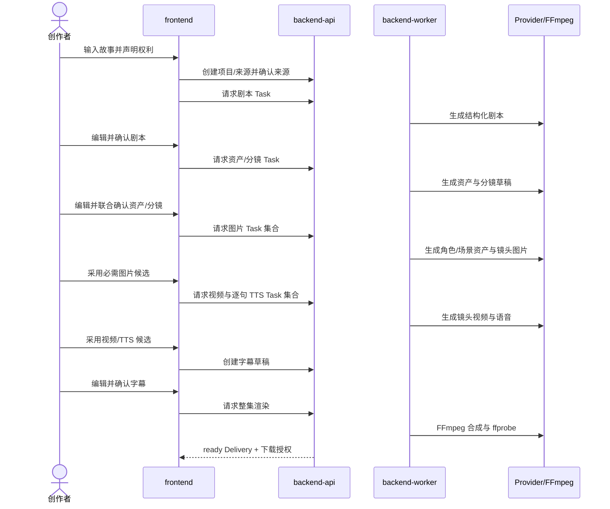

# AI短剧端到端制作流程

## 1. 切片结论

MVP 只有一个交付切片：内部创作者输入一份具有权利声明的故事文本，经 AI 生成、人工确认和可恢复任务，最终获得一部 30～60 秒、6～10 镜头、包含逐句 TTS 与源语言字幕的 720×1280 MP4。

本切片同时交付可运行前端、API、PostgreSQL TaskJob Worker、LangChain Core AI 接入、Provider Adapter、MinIO 与 FFmpeg；只有整条链路通过验收才算完成。`PRODUCT-01` 维护全局目标，`PRODUCT-02`～`PRODUCT-07` 按模块细化用户价值；`PLAN-01` 编排全局顺序，`PLAN-02`～`PLAN-09` 分工实现与测试。

## 2. 主用户与前提

- 主体：部署边界内的单个内部操作者，所有操作使用 request/task/version 标识关联。
- 输入：通过正文输入框粘贴符合 `text-normalization-v1`、规范化后 300～3000 个 Unicode 代码点且至少含一个 Han 字符的 UTF-8 中文故事正文，并提供标题和明确权利声明。
- 输出：一部用途为 `internal_review` 的 MP4，以及内容一致的 SRT 和 JSON Manifest。
- 内容规模：1 个 Project、1 个 Episode、6～10 个 Shot、目标成片 30～60 秒。
- 依赖：已批准模型配置目录为文本、图片、视频、TTS 每类必需能力提供至少一个默认 profile，并允许多个 profile 并存；每个 Task 受理时冻结一个 profile，测试另有确定性 Mock。

## 3. 阶段与可观察出口

| 阶段 | 用户动作 | 权威输出 | 退出条件 |
| --- | --- | --- | --- |
| 立项 | 创建 Project/Episode，粘贴正文并声明权利 | Project、Episode、SourceRevision | 正文/哈希/声明可回读 |
| 剧本 | 请求生成并轮询 Task，编辑后确认 | confirmed ScriptVersion | 场景、角色、对白/旁白语音条目和目标时长通过 Schema |
| 分镜 | 基于剧本生成并编辑资产与 ShotSpec，统一确认 | confirmed CreativeAssetVersion 集合及一个含 6～10 个有序 ShotSpec 的 confirmed ShotSpecVersion | 每镜 Prompt、语音引用、时长、画面意图和资产版本完整 |
| 图片 | 为角色/场景资产参考和镜头图片位置提交生成集合，轮询逐项结果；整体视觉风格只作为文字输入 | 图片 Candidate 及独立 Task 集合 | 每个角色/场景资产和镜头图片位置至少一个技术有效候选或明确失败；风格无图片槽 |
| 媒体 | 先采用必需图片，再提交每镜视频与逐句 TTS | 图片、每镜视频、每条语音唯一 active Adoption | 6～10 镜全部具备采用视频，且每条确认语音具备采用 TTS；无语音镜头不强制 TTS |
| 字幕 | 按 TTS 时长生成、编辑并确认 | confirmed SubtitleVersion | Cue 顺序、镜头范围、重叠与映射校验通过 |
| 合成 | 请求 Render 并轮询 Task | RenderSnapshot、DeliveryVersion | FFmpeg 完成且 ffprobe 质检通过 |
| 下载 | 按需请求短期下载授权 | MP4、SRT 与 JSON Manifest | 三项哈希匹配、MP4 可播放且授权未过期 |

每个异步入口成功后必须在一次响应内返回 `task_id`；多项媒体生成由前端使用独立幂等键提交多条单 usage-slot 命令并形成 Task 集合。前端立即进入 2 秒轮询；刷新或网络恢复后按 URL 中的 Project/Episode 和服务端 Task 列表继续，不依赖浏览器内存。

## 4. 关键用户路径

页面顺序为 Projects→Story→Studio→Tasks/Studio→Delivery；任一 Task 行都能回跳其业务对象，任务页不提供修改 Prompt 或 Adoption 的旁路。

## 5. 业务规则

- BR-ARCH-101-001：AI 剧本、分镜、媒体和声音均为候选，必须由用户确认或采用后才能进入下一固定快照。
- BR-ARCH-101-002：确认 Script 后的修改产生新 ScriptVersion；既有 Shot、Task 和 Candidate 不被覆盖。
- BR-ARCH-101-003：每个版本化 usage slot 最多一个 active Adoption；替换时旧关系转为 superseded，媒体版本不删除。
- BR-ARCH-101-004：Task 集合按使用位置独立保存结果；单镜失败不回滚其他镜头。
- BR-ARCH-101-005：逐句 TTS 和源语言字幕是 Render 的强制输入；缺失任何一句均阻断渲染。
- BR-ARCH-101-006：Delivery 只由固定 RenderSnapshot 创建；相同幂等键不产生第二个逻辑渲染。
- BR-ARCH-101-007：Delivery 的用途固定为 `internal_review`，验收覆盖受控内部播放、追踪和下载。
- BR-ARCH-101-008：6～10 个镜头各为 3～8 秒、期望时长合计 30～60 秒，且每条确认对白或旁白语音条目恰好归属一个镜头。

## 6. 快照与一致性

剧本任务固定 SourceRevision；分镜任务固定 confirmed ScriptVersion，并产出 CreativeAssetVersion 与 ShotSpecVersion 草稿；图片任务固定 jointly confirmed ShotSpecVersion、全部相关角色/场景/整体视觉风格版本与 Prompt，但只为角色/场景资产和镜头建立图片 usage slot；视频任务固定 ShotSpecVersion、confirmed 风格版本/哈希、镜头及相关角色/场景的 active 图片 Adoption、Provider/模型和参数；TTS 固定 SpeechLine、voice 和 text hash；RenderSnapshot 固定 Shot 顺序、每镜视频 Adoption、逐句 TTS Adoption、SubtitleVersion、timebase 与 FFmpeg 配方。

请求创建前重新校验输入版本。Candidate/Adoption 的版本化 usage slot 必须与当前 confirmed CreativeAssetVersion、ShotSpecVersion 或 ScriptVersion/文本哈希精确匹配；若客户端引用已过期，返回 `412 VERSION_CONFLICT`。已受理 Task 继续使用原快照、保持合法状态并在 UI 显示 `input_outdated=true`，不静默切换到最新内容。

## 7. 失败与恢复路径

| 场景 | 用户可见结果 | 恢复动作 |
| --- | --- | --- |
| 非法来源或权利未声明 | 同步校验错误，不创建 Task | 修正输入后重新提交 |
| AI 结构不符合 Schema | Task failed，保留安全错误码 | 修正正文或受控 Prompt 版本后新任务 |
| Provider 限流 | Task 保持 queued/running 并显示阶段 | 系统有限退避，耗尽后人工重试 |
| Provider 是否受理未知 | Task unknown，禁止新自动提交 | Worker 对账；确认失败后用户重试 |
| 2 个镜头生成失败 | 成功镜头可比较采用，失败镜头明确列出 | 仅选择失败镜头创建新 Task |
| Worker 在任一步重启 | 轮询仍返回原 task_id 和已保存进度 | TaskJob 租约过期后先对账，再由兼容 Job Handler 恢复 |
| TTS 单句失败 | 对应镜头阻断，已成功句保留 | 用户只为失败句创建引用原 Task 的新 Task |
| 渲染或质检失败 | DeliveryVersion failed，不提供下载 | 自动重试在原 Task/DeliveryVersion 新建 Attempt；用户重试以同 RenderSnapshot 新建 Task 与 DeliveryVersion |
| 下载授权过期 | Delivery 仍 ready | 重新请求短期授权，不复制媒体 |

取消是请求而非即时成功：前端显示“取消已请求”并保留当前非终态，直到服务端返回 `cancelled` 或已有终态。取消后的迟到媒体可登记用于对账，但必须 blocked；版本不匹配另显示 `input_outdated=true`，且不能自动采用。

## 8. 实现边界与验证顺序

`PLAN-01`～`PLAN-09` 必须把实现拆成可连续运行的 Red→Green 增量：

1. Red：模块边界、状态机、幂等和 OpenAPI 示例；Green：工程、Project/Source 与 Task 骨架。
2. Red：剧本/分镜 Schema 和版本冲突；Green：Mock 文本 Provider 与 Story 页面。
3. Red：重复领取、Worker 重启、unknown 和部分失败；Green：TaskJob lease/heartbeat、图片/视频/TTS Mock。
4. Red：Adoption 唯一性、RenderSnapshot 和媒体质检；Green：Studio、FFmpeg、Delivery。
5. Red：完整 Playwright 场景；Green：Mock 全闭环，再执行真实 Provider 单样片 smoke。

每一步必须从当前失败测试开始，只创建实际用到的目录。真实 Provider smoke 不进入确定性 CI，但其命令、输入、输出、费用和失败证据进入 `ACCEPTANCE-01`。

## 9. 迁移与回滚

无历史应用数据；根 `sql/` 作为[06 数据库表与迁移设计](06-数据库表与迁移设计.md)的可评审输入先行存在，但只有该 Design 接受并通过 database_design_ready 后，才可执行 SQL、创建 Alembic `0001_mvp` 和根 `docker-compose.yml`。实现回滚按 frontend→API→Worker 反向停用新入口并恢复上一兼容制品，不停止或删除本机既有 PostgreSQL/MinIO。若真实 Provider 无法使用，可回退到 Mock 继续工程验证，但不能据此判定真实成片 Acceptance 通过。

## 10. Design 验收标准

- AC-ARCH-101-001：设计包含从正文到 MP4 的全部用户动作、权威输出、阶段出口和回跳路径，且依赖仅来自[01 MVP技术选型与范围](01-MVP技术选型与范围.md)与[02 MVP总体架构](02-MVP总体架构.md)定义的六模块。
- AC-ARCH-101-002：Plan 可为固定 6 镜头夹具定义确定性 Mock E2E，在 30～60 秒范围生成一部完整 MP4，并连续 3 次通过。
- AC-ARCH-101-003：Plan 可并发重放同一命令 20 次并注入 Worker 重启，断言仍只有一个逻辑 Task/TaskJob、一次初始 Provider 副作用、每槽一个 Candidate，且原 `task_id` 可继续查询。
- AC-ARCH-101-004：Plan 可令固定六镜头夹具的第 3 镜头首次失败，断言其余五镜不变，且用户重试只为第 3 镜头失败使用位置创建带 `retry_of_task_id` 的新 Task和初始 Attempt。
- AC-ARCH-101-005：Plan 可断言字幕校验与确认、SRT 一致性，并用 ffprobe 断言 720×1280、24fps、H.264/AAC、时长 30～60 秒、逐句 TTS、可见源语言字幕及最大音画差≤100ms。
- AC-ARCH-101-006：任一 Delivery 可反查来源、Script、Shot、Snapshot、Task/Attempt、Provider/模型、Candidate、Adoption、媒体哈希、FFmpeg 版本和 Manifest。

以上 Design AC 只判断方案是否可执行；实际命令和运行结果必须由接受的 `PLAN-01`～`PLAN-09` 实施后写入 `ACCEPTANCE-01`。
