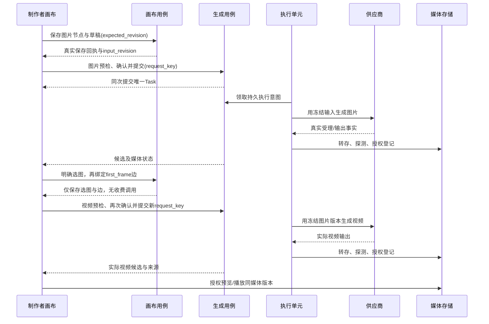

# Design 06：画布生图生视频Demo

## 问题、范围与设计依据

制作者需要在同一画布把提示词变成图片，再明确用一张图片生成视频，能够说明每个结果来自哪个输入，失败也能恢复。依据[Demo PRD](../prd/06-画布生图生视频Demo.md)与[Demo Plan](../plan/06-画布生图生视频Demo.md)；原始需求来自用户、项目、素材、供应商、模型、生成与画布。首轮不依赖剧本/设定/镜头。

本设计是待评审工程提案，接口/状态并未实现。首轮保留两类生成节点、单图首帧输入边、分别手动提交、实际媒体与持久恢复。删除/撤销、自动整图执行、多图/尾帧、Agent、导出、配音、全局通知不进入首轮。图片首帧能力必须有实际供应商证据，不能悄悄用文生视频替代。

## 模块边界与最小依赖

| 模块        | 本闭环负责什么                                | 设计唯一来源                          |
| ----------- | --------------------------------------------- | ------------------------------------- |
| 用户/项目   | 真实会话、授权项目及空画布身份                | [01](01-用户.md) / [02](02-项目.md)   |
| 素材媒体    | 原件、版本、就绪/审核及预览授权               | [03](03-素材.md)                      |
| 供应商/模型 | 服务端凭据、受测能力、发布版本、参数限制      | [04](04-供应商.md) / [05](05-模型.md) |
| 画布        | 节点/草稿/位置保存，明确选图，带版本的输入边  | [12](12-画布.md)                      |
| 生成        | 预检/确认、不可变输入、任务执行/候选/费用核对 | [10](10-生成.md)                      |
| 审计/诊断   | 关键写入事实、未知任务原因和安全关联标识      | [14](14-审计.md) / [15](15-健康.md)   |

不在这里复制第二份幂等/租约或媒体状态规范。首轮执行单元建议沿用模块化Go应用，持久工作记录由生成拥有；具体进程/部署在D0选定，不因旧代码存在而要求完整旧中间件。

## 节点、选图与输入边

| 对象                | 本Demo内容与关系                                                                                                                    |
| ------------------- | ----------------------------------------------------------------------------------------------------------------------------------- |
| ImageGenerationNode | 稳定node_id；图片NodeDraft含prompt/模型发布版本/支持画幅/数量等；只读Task/Candidate摘要；单一明确NodeSelection                      |
| VideoGenerationNode | 稳定node_id；视频NodeDraft含运动prompt/模型发布版本/画幅/时长；恰好一个有效first_frame输入；只读视频候选/任务                       |
| ImageToVideoEdge    | edge_id、source_node_id、target_node_id、source_selection_revision、candidate_id、media_id/version、role=first_frame、edge_revision |
| FrozenVideoInput    | 提交时复制精确边版本、候选及媒体版本、模型与规范参数/确认指纹；不引用运行时“源节点最新图”                                           |

图片必须来自同一授权项目的图片节点候选，真实字节已就绪且通过接受的媒体准入；服务端验证候选属于源节点任务及media对应关系，不能相信前端给的几个ID。只允许image-generation.image-output→video-generation.first-frame；拒绝自连、同端口多输入、缺失端点、非图片/不可用/越权媒体和不支持首帧的发布模型。生成数量/时长/比例来自真实发布模型，不写死“×2”“4s”。

选图命令只更新NodeSelection，连线命令只存InputEdge与目标草稿引用，不做供应商调用。连线时条件检查当前Selection版本；如果源节点已改选，建立请求返回冲突并保留用户输入。

源重新生成只追加新候选，不改变选择。用户改选时原边仍绑定旧图片，并显示source_changed；建议首轮**阻止该过期边的新视频提交，要求明确更新输入**，更新时显示新旧缩略图和来源，再同事务保存edge_revision及目标新input_revision。已有视频任务和视频保留原图，可播放并显示与当前草稿不同。该提交取舍待评审；如需允许继续用旧图，应增加明确确认语义并回写PRD，不静默放行。

## 正常链路及调用顺序

视频与图片各有独立Preflight/Consent/Task，请求键不能跨目标复用。成功提交不等于完成；供应商成功、媒体ready、审核准入和可播放依次有真实事实。任务读取按生成合同，画布查询不触发外部生成或恢复收费。

## 草稿保存、冻结和恢复

布局/草稿保存采用[画布CAS](12-画布.md)，确认仅针对已保存input_revision；未保存修改不能用旧确认提交。单纯拖动只改文档revision不改input_revision。预检之后目标草稿、边、选择所绑定输入/权限或模型可选性变化，在提交事务内拒绝；布局变化不改变规范输入。

生成提交原子写冻结快照、确认事实、Task、执行意图及审计。外部调用发生在事务后；任何分步窗口不能只记浏览器“submitted”。同键同输入返回同任务，异输入冲突；客户端丢回执先按原key查回，绝不能自行生成新key重提。具体指纹/租约/核对合同在[生成设计](10-生成.md)。

任务/候选返回属于原node_id与input_version。新草稿不被旧回执覆盖，人工选择不被新候选替换。节点查询返回历史摘要，点开再读冻结输入。用户刷新/重新登录/服务重启，先恢复真实用户/项目/画布身份、结构/草稿/选择/边，再查询既有Task与Media。旧URL过期从media_id取得新授权访问；不把供应商临时地址持久写入画布。

首轮viewport建议会话内临时，刷新fit到实际节点；fit不重置位置。移动端关键状态/操作可达，大画布局部导航；键盘位置移动、表单错误关联、等待播报、焦点返回和真实播放均需浏览器验证。

## 故障路径与可观察结果

| 触发                              | 系统处理                                          | 用户看到/验证什么                                     |
| --------------------------------- | ------------------------------------------------- | ----------------------------------------------------- |
| 保存失败或双窗口版本冲突          | 留本地草稿，返回真实失败/当前revision；不静默覆盖 | 未保存/冲突及可比较恢复内容，刷新不会假装保留未写数据 |
| 图片候选未ready、无权、审核不可用 | 阻止采用/连线/视频预检；不调用供应商              | 当前候选不可用原因与真实状态                          |
| 选图/边更新但尚未提交             | 仅写Selection/InputEdge                           | 供应商调用计数和费用事实不变                          |
| 源改选、重生图或迟到结果          | 旧边与任务快照不变；显式更新边，新结果只追加      | source_changed/input_changed标记、旧视频仍能打开      |
| 提交成功但响应丢失                | 原key查询/重发返回原Task                          | 一任务、一份冻结输入；不再次发起外部生成              |
| 供应商可能受理但超时/崩溃         | unknown；有查询/幂等证据才核对，否则manual        | 原任务可查、禁止盲目“重试生成”                        |
| 输出成功但转存失败/临时URL过期    | 媒体独立失败/恢复原输出；不重生成                 | 生成事实与不可播放原因分别展示                        |
| 服务重启/租约失效                 | 恢复工作记录，dispatching后的未知先核对           | 同Task、同媒体身份；无重复收费证据                    |
| 会话失效/项目切换                 | 重新授权，取消旧请求与播放，隔离缓存              | 不串项目、不泄露他人候选/输入                         |

## 原始需要与D-AC的设计覆盖

| Demo AC | 设计点                                    | 实施后验证方法                                        |
| ------- | ----------------------------------------- | ----------------------------------------------------- |
| D-AC-01 | typed节点/草稿、真实CAS保存、viewport分离 | 制作者建两节点/移动/保存→刷新/fit，比数据库版本和坐标 |
| D-AC-02 | 图片冻结Task、真实候选及Media.ready       | 实际生图→解码原件，核Task输入/候选/模型来源           |
| D-AC-03 | Selection/InputEdge版本命令无外部调用     | 选图连线→刷新，比媒体版本/供应商调用数                |
| D-AC-04 | FrozenVideoInput.first_frame与实际播放    | 明确图输入→实际视频，核供应商请求摘要与可解码视频     |
| D-AC-05 | 两种能力共享request_key/指纹合同          | 两窗口并发与丢提交回执→任务/调用次数不增加            |
| D-AC-06 | 端点/类型/权限/就绪/模型校验              | 两制作者＋无效组合/边界时长→调用前拒绝                |
| D-AC-07 | 源变更标记、快照不变、候选只追加          | 改选/改草稿/晚回执→旧图旧视频可查，手选不覆盖         |
| D-AC-08 | dispatch意图及unknown/manual证据核对      | 故障模拟“已受理丢响应”→不再POST，授权核对留证         |
| D-AC-09 | execution/media分状态，原输出搬运恢复     | 故障转存/过期URL→失败真实，修复不重新生成             |
| D-AC-10 | 服务端授权、CAS冲突、本地草稿保留         | 已知ID越权/双窗口保存→无泄漏、未保存内容可恢复        |
| D-AC-11 | 持久Task/Attempt租约与重启                | 运行中重启→查回同一ID，已发出调用先核对               |
| D-AC-12 | 请求/缓存/播放生命周期与无鼠标编辑        | 接受的桌面及390布局→键盘/焦点/卸载/项目切换实测       |

原FR-GEN-01～05与FR-CANVAS-01～04在各模块Design追踪，本Demo只是提前实现其中子集；用户/项目/素材/供应商/模型及质量AC仍须检查。当前表仅是待执行方法，无任何真实供应商/浏览器验收结果。

## D0决定与Plan落点

| 待决定项        | 本设计建议或需提供的证据                                        | 影响工作包         |
| --------------- | --------------------------------------------------------------- | ------------------ |
| 模型/供应商能力 | 实际生图及单图首帧视频、参数/结果格式、查询/去重/输出有效期证据 | D4/D5/D7～D12      |
| 账号/环境       | 合法演示账号、持久DB/媒体权限、受控执行单元与重启环境           | D1～D3、D6/D11/D12 |
| 媒体/外发       | 就绪/审核准入、文件限制、供应商数据外发范围及保留               | D3/D7/D8/D10       |
| 费用/确认/核对  | 可信费用或上限、确认有效期；未知费用拒绝；管理员核对依据        | D4/D7/D10/D12      |
| 交互取舍        | 单图首帧、源变化先更新边、删除/撤销后置、视口临时               | D6/D9/D12          |
| 一致性/恢复     | 指纹/键范围、保存CAS、执行意图/租约及媒体恢复                   | D6/D7/D11/D12      |

本轮不指定未经验证的供应商或价格。工程细化沿用Demo Plan D0～D12；D0先接受受影响选择，独立的身份/结构设计可先审阅，不将全部后续模块政策都变成首轮阻塞。接受记录须写范围/接受者/日期/Git基线，未接受不标可开工。

## 工程合同：Demo工程切片与端到端提交

本Demo不再设计另一套Task/媒体/数据库表；工程唯一合同由[01用户](01-用户.md#工程合同用户数据库与认证接口)、[02项目](02-项目.md#工程合同项目数据库与上下文接口)、[03媒体](03-素材.md#工程合同媒体与素材库数据库api)、[04供应商](04-供应商.md#工程合同供应商配置数据库与管理接口)、[05模型](05-模型.md#工程合同模型目录数据库与发布接口)、[10生成](10-生成.md#工程合同生成数据库执行账本与api)、[12画布](12-画布.md#工程合同画布数据库与编辑api)给出。以下是它们的集成与软件生命周期落点。

### 实际持久关系与事务边界

| 环节          | 写入表/约束                                                                | 对外接口/回执                                                   | 提交后才发生的动作                                     |
| ------------- | -------------------------------------------------------------------------- | --------------------------------------------------------------- | ------------------------------------------------------ |
| 登录/空项目   | accounts/user_sessions；projects/canvases/command_receipts/audit_events    | POST /api/sessions、POST /api/projects                          | Cookie确认真实身份，ProjectView返回真project/canvas ID |
| 图片草稿      | canvas_nodes/canvas_node_inputs；Canvas CAS及首版本延迟FK                  | PUT /api/projects/{project_id}/canvases/{canvas_id}             | 保存回执覆盖当前edit_sequence才显示已保存              |
| 生图提交      | generation_preflights/consents/tasks/refs/events/cost_facts/audit；键唯一  | POST /api/generation/preflights→确认→POST /api/generation/tasks | Worker持久dispatching后用冻结prompt/模型/参数调用      |
| 图片输出      | generation_candidates/media_objects/media_ingest_jobs/media_project_grants | GET Task/Candidates＋GET Media/preview                          | 真实解码/转存；非ready不选定                           |
| 明确选图      | canvas_node_selections/current_selection_revision；候选同node/media FK     | PUT /api/canvases/{canvas_id}/nodes/{node_id}/selection         | 无供应商副作用，新结果不覆盖手选                       |
| 视频输入边    | canvas_edges/edge_versions＋新目标input版本；源历史Selection FK            | POST/PATCH /api/canvases/{canvas_id}/input-edges                | 无收费；锁源选择/边/目标input/Canvas版本，旧边保留     |
| 视频提交      | 同generation_*；Refs记录first_frame精确media版本/摘要                      | 独立Preflight/Consent/Task/request_key                          | Worker编译真实first_frame请求；能力不支持就拒绝        |
| 视频播放/恢复 | 同Media/Candidate/Task事实查询，不写“播放成功”状态                         | GET /api/media/{media_id}/preview＋原Task/Canvas查询            | 加载真视频；失效URL重新授权，重启先核对旧意图          |

### 设计级请求和返回字段顺序

1. ProjectView取得project_id/canvas_id/document_revision。
2. CanvasSave提供save_key、expected_document_revision、节点UUID/位置尺寸/NodeDraftWrite；响应给input_revision和真实新document_revision。
3. GenerationPreflightRequest指向image node_id及已保存input_revision。PreflightView显示冻结snapshot/cost/external_data_scope/fingerprint/expires_at；提交只绑定这份确认。
4. GenerationSubmit用request_key、preflight_id、fingerprint和明确确认。202 TaskView表示已持久受理，随后查同Task，候选媒体ready/准入才可选图。
5. SelectionChange提供candidate_id及expected_selection/document_revision；EdgeChange提供源selection、目标input、edge/document四组版本。服务端解析精确Candidate/Media，不接受前端拼出来的URL/就绪状态。
6. 视频预检读取新保存的target input/edge版本，用户再次确认并用新提交键建立独立Task。执行摘要包含输入media_id/version/sha256及供应商编译版本；不保存秘密请求体。
7. 播放以Video Candidate的media_id/version取授权预览。页面从旧Task/旧Input可查上次图与视频，不把新草稿改成旧结果。
8. 提交响应丢失先用by-request-key查回；保存响应丢失查save_key回执/读真实Canvas。未知外部执行先核对，不自动换键调用。

### 并发协议与修正后的版本语义

所有编辑命令（布局、选图、绑定/更新边）成功均推进Canvas.document_revision，命令读回返回该真实值；Task后台追加与媒体完成不推进它。选图另推进source.selection_revision；建/更新边同时推进edge_revision和target.input_revision。布局移动不改input_revision。前端在不同命令之间更新本地已确认revision，冲突保留未保存草稿，不用旧版本“补写”覆盖选择/边。

重新生图仅追加候选，原Selection/EdgeVersion/视频Task不变。源改选令旧边source_changed，新视频提交建议要求明确更新边；旧视频任务仍冻结旧Media。预检后布局移动不改变fingerprint，预检后目标草稿/edge/相关源Selection变更则409并重新预检。租约接管不再次生成POST；Media转存恢复不创建第二次生成Task。

### D0～D12到工程设计的映射

| Plan阶段  | 详细工程输入                                             | 实施后必须核的证据                          |
| --------- | -------------------------------------------------------- | ------------------------------------------- |
| D0        | 架构、Schema/API合同、供应商能力/价格/外发/核对协议      | 接受基线及实测条件；未定参数不能填样例      |
| D1/D2     | accounts/session及projects/canvases FK、Cookie、授权范围 | 真账号/项目读回，受限/越权入口拒绝          |
| D3        | Media/Grant/Ingest/preview合同                           | 真字节/MIME/就绪/审核、故障不伪ready        |
| D4/D5     | Credential/Test原子发布、Model草稿/不可变版本/schema     | 真可用生图及first_frame视频能力             |
| D6        | Node/Input/Selection/Edge字段、CAS/回执、前端状态分离    | 冲突/丢保存回执、移动/fit坐标、布局版本     |
| D7        | Preflight/Consent/Task/Refs/Attempt/Event/Cost与唯一键   | 准入并发、冻结内容、调用次数、未知先核对    |
| D8/D9/D10 | 候选去重/媒体、明确选择/版本边、独立视频提交             | D-AC-02～07的真图/输入来源/视频及反例       |
| D11/D12   | 租约/dispatching/媒体恢复、缓存/焦点/播放生命周期        | 重启、丢受理响应/过期输出、浏览器及产品接受 |

### 发布、迁移与恢复的Demo最小范围

接受后实施首轮所需表/HTTP/Worker/前端；后置内容表不必随首轮预建。对既有库先只读核差异，再准备精确增量SQL/数据映射与回退，不运行新的最终态Schema覆盖旧库。停止新收费准入与领取、保留所有dispatch意图，升级后逐个查旧Task/Candidate/Media与Canvas关系；恢复演练至少核D-AC-05/08/09/11。外部已受理任务不能靠DB恢复回滚成未发生。

当前工程文档补全不证明SQL/接口/供应商/浏览器已经运行。字段/约束及事务仍待接受，设计级静态检查与真实数据库约束测试分别记录。
