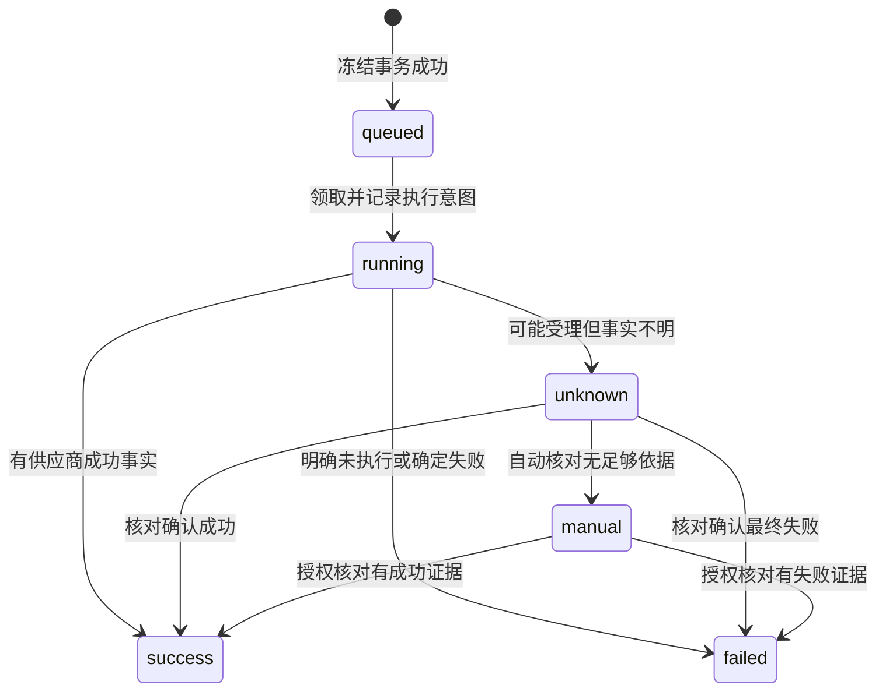

# Design 10：生成

执行编号：10；原始需求模块：14。依据[原始需求](../requirement/14-生成需求.md)、[PRD](../prd/10-生成.md)与[Plan](../plan/10-生成.md)。本文件把原始需要转换成项目方案，**全部新增设计选择仍待评审**；数据对象和接口为拟议合同，不表示已有表或已实现API。共同约束见[整体设计](00-项目需求设计.md)。原始FR、质量条件与AC仍须同时满足。

## 共享生成合同与所有权

生成模块负责预检、确认、冻结、任务、执行事实、候选和费用核对。画布/镜头/设定只提供授权目标与不可变输入版本，并明确采用结果；不能各自建第二套任务、偷偷调用供应商或自动选定。首轮实现生图和单图首帧视频，其他能力仍按原需求确认。

| 对象             | 拟议内容与不变量                                                                                                            |
| ---------------- | --------------------------------------------------------------------------------------------------------------------------- |
| GenerationIntent | user/project、target_type/id、input_version、published_model_version、参数、带用途/顺序的refs、candidate_count、request_key |
| Preflight        | 规范输入fingerprint、价格来源/金额或上限/币种、外发对象、有效期、权限/能力检查版本；不是执行任务                            |
| Consent          | actor、preflight_id、fingerprint、确认内容/时间；不能把旧确认用于新输入                                                     |
| GenerationTask   | id、request_key、fingerprint、冻结输入/模型/引用、consent_id、state、安全reason、created_at/updated_at                      |
| ExecutionAttempt | task_id、attempt_id、dispatch状态、凭据版本引用、provider_task_id、核对证据、租约owner/token/到期时间                       |
| Candidate        | 唯一来源(task_id, output_key)、media_id/version、冻结输入引用；只追加，不代表目标已采用                                     |
| CostFact         | 估算、确认上限、实际执行费用及核对证据分开；未知为null/unknown，不写0                                                       |

所有快照不包含秘密、会话、预览URL。提示词后缀、@对象、锁定设定、来源图片在冻结时展开或绑定明确不可变版本；不能运行时再读取“当前最新”作为旧任务输入。

## 预检与提交的并发边界

拟议POST /generation/preflights、POST /generation/tasks、GET /generation/tasks/{id}、GET /generation/tasks?request_key=…、GET /generation/tasks/{id}/candidates；管理员POST /generation/tasks/{id}/reconciliations。路径仅是本轮提案。预检/查询无供应商生成副作用，若价格查询本身收费须按供应商条件另处理。

1. 服务端从会话确定actor并核project/target权限；解析输入版本、发布模型、媒体就绪/审核、引用用途及真人声音声明，得到规范输入。
2. 规范化采用稳定字段顺序、明确缺省、版本化规则；指纹包含project/target、输入版本和内容、模型版本、用途/顺序/媒体版本、数量、外发及确认的费用约束。不包括request_id、request_key、视口、临时URL。不能仅比较提示词或原始JSON字节。
3. 首轮建议价格/可接受上限无法核实时拒绝收费提交；取得可信费用依据才发Preflight。Consent绑定指纹，输入/价格/外发范围或有效期改变必须重新确认；有效期配置在D0接受，不硬编码虚构价格。
4. 提交先完成当前授权，再在同一事务查幂等记录。已有同键同规范请求返回原Task和原执行事实，即使模型随后停用也不创建新任务；异输入返回幂等冲突。比较时使用原规范化版本，避免规则升级误判。
5. 对新键事务内锁定/条件校验目标输入版本、有关引用/授权状态和模型准入状态；预检后改草稿/停用/撤权/失去就绪/更换声音来源均拒绝并重新预检。记录冻结快照、Consent、queued任务、待执行意图和关键审计一起提交。外部网络调用在提交后执行。

建议幂等唯一范围为(actor_id, project_id, operation='generation.submit', request_key)，request_key由客户端为一次明确提交生成并在丢响应后保留。成功建任务后，键映射与任务保留同寿命；不得按短TTL过期后自动再收费。任务归档/清理时保留键墓碑还是禁止复用须另评审，本轮不清理记录。新的输入或用户明确发起新任务使用新键和新确认；失败也不删除原键。客户端pending key在同用户/项目上下文恢复，不包含秘密；换用户不能访问旧记录。

## 可恢复执行与状态转换

建议以数据库中的执行意图承载可靠调度；运行单元领取有界租约，逐次更新用lease_token防旧执行者覆盖新状态。业务task、外部attempt、媒体状态分别记录。没有供应商幂等/核对能力时，租约不能保证外部只执行一次。



领取后、网络调用前先持久写dispatching。若此后进程崩溃或超时，包括供应商已受理但provider_task_id未写回，都视为可能执行：进入unknown或按供应商有证据的幂等/查询恢复，不能让新Worker直接再次POST。只有明确尚未跨出调用边界的意图可重新领取；dispatching后无法证明未发出时宁可核对。失联在途任务恢复状态，不能回到普通可盲重试queued。

供应商返回任务ID后保存accepted事实并按其查询协议读状态；重复回执按provider事件标识/任务与结果标识去重。短事务条件推进任务，成功/失败事实不被较旧状态回执回退；互相矛盾的终态记录冲突和核对，不覆盖已有证据。过期Worker不能重新领取/创建dispatch意图或覆盖租约持有人；租约只约束本地状态写入，不能撤回已发出或已取得意图的外部调用。接管者对dispatching先核对、不再POST，旧执行者的真实输出证据仍经独立、去重的入库用例登记，避免因租约过期丢结果。

运行单元有明确context取消/退出和等待策略，停止领取后收敛正在执行的外部调用；取消本地请求不等于供应商取消。查询/安全下载允许按适配器规则有界重试，生成POST、测试收费与重提禁止套用自动重试。轮询退避/超时/最大并发取实际供应商限制和环境，D0确认；不承诺不存在的取消、退款或查询能力。

## 候选入库与媒体恢复

供应商成功只证明execution=success；媒体独立从receiving/validating到ready或failed，审核独立。UI在任务成功但媒体未ready时显示“生成完成，媒体处理中/保存失败”，不能报可播放成功。输出数量来自真实结果，不补齐缺少候选。

入库先保存输出来源和唯一output_key，再用[素材媒体合同](03-素材.md)拉取/校验实际字节，建立候选与media版本。重复回执只定位既有候选；如果供应商没有稳定结果标识，适配器必须明确去重依据，不能默认不可靠数组顺序。下载来源仅允许受控供应商输出，限制地址/重定向/大小及类型，不暴露任意URL抓取接口。

媒体搬运失败只重试原输出搬运；不重新生成、不新增费用确认。临时URL过期优先按原provider_task_id取回输出；无法取回就保留media.failed/需核对事实，不伪造原件。更新草稿、重新生成和迟到结果都不改变既有Selection/锁定版本；候选仍关联原Task/target/input_version。

## 原始需求到设计追踪

| 原始FR    | 项目设计与验证边界                                                     |
| --------- | ---------------------------------------------------------------------- |
| FR-GEN-01 | Preflight核权限/能力/媒体/声音与可信费用；任何非法组合在外部调用前拒绝 |
| FR-GEN-02 | 指纹/Consent＋幂等唯一＋冻结事务；并发、丢响应和草稿改动不重复执行     |
| FR-GEN-03 | 持久Task/Attempt及unknown/manual；刷新与重启查回同一ID                 |
| FR-GEN-04 | 去重Candidate＋独立媒体/审核状态；真实字节且不自动采用                 |
| FR-GEN-05 | CostFact/Reconciliation证据；未知先核对，恢复只在权限和证据支持时推进  |

重点测试：两个相同键并发、同键改数量/参考/价格约束、预检后撤权/停用/改输入、提交回执丢失、dispatching后崩溃、已受理丢ID、重复/乱序回执、租约接管、媒体转存失败和临时URL失效。以数据库任务/外部调用次数/冻结摘要/候选原件佐证，不能只比UI状态。

## 待评审与实施入口

本轮建议的指纹规范、永久保留到归档的键范围、未知价格拒绝、租约及停止策略待接受。供应商具体生成/查询/幂等/下载协议、金额/费用上限/有效期、真人声音声明、核对权限和证据来源是对应能力开工条件。取消/重试/退款仍未确认，首轮不提供无依据动作。D7～D12依赖和验收以[Demo Plan](../plan/06-画布生图生视频Demo.md)为准，完整模块余项见[模块Plan](../plan/10-生成.md)。

## 工程合同：生成数据库、执行账本与API

### 库表与字段

采用[整体数据库约定](00-项目需求设计.md#工程合同数据库全局约定)。除显式NULL字段外均NOT NULL；B/C/P含义见全局约定。本节为待评审设计，不修改或执行schema.sql。

| 表                           | 字段、类型、空值与默认                                                                                                                                                                                                                                                                                                                                                                                                                                                                                                                                                           | 主外键、唯一及检查约束                                                                                                                                                                                                                                                                                                   | 查询索引                                                                                      | 生命周期                                                          |
| ---------------------------- | -------------------------------------------------------------------------------------------------------------------------------------------------------------------------------------------------------------------------------------------------------------------------------------------------------------------------------------------------------------------------------------------------------------------------------------------------------------------------------------------------------------------------------------------------------------------------------- | ------------------------------------------------------------------------------------------------------------------------------------------------------------------------------------------------------------------------------------------------------------------------------------------------------------------------ | --------------------------------------------------------------------------------------------- | ----------------------------------------------------------------- |
| `generation_preflights`      | B/P；actor_id uuid FK accounts、target_kind text、target_id uuid、input_version_id uuid；model_version_id uuid、provider_id uuid、provider_config_revision bigint、credential_id uuid、fingerprint bytea、canonicalization_version integer；snapshot jsonb、cost_state text、amount/max_amount numeric(20,6) NULL、currency char(3) NULL、cost_source text NULL、external_data_scope jsonb、expires_at timestamptz                                                                                                                                                               | FK model_versions；FK(provider_id,credential_id)→provider_credentials；摘要32字节；费用known/unknown、已知金额非负；snapshot按版本schema；target实际FK在Task表保证，预检仍由目标端口校验                                                                                                                                 | (actor_id,project_id,created_at DESC,id DESC)                                                 | 只INSERT/SELECT，过期拒绝新Task；已建Task回查不受过期影响         |
| `generation_consents`        | B/P；actor_id uuid、preflight_id uuid、fingerprint bytea、cost_confirmed/data_transfer_confirmed boolean；confirmed_at timestamptz、terms_snapshot jsonb                                                                                                                                                                                                                                                                                                                                                                                                                         | FK accounts、(project_id,preflight_id)→generation_preflights(project_id,id)；UNIQUE(preflight_id,id)；两确认均true、fingerprint为32字节；准入事务比较Preflight内容                                                                                                                                                       | (actor_id,created_at DESC,id DESC)                                                            | Task冻结事务内生成，不独立伪造已执行费用                          |
| `generation_tasks`           | B/P；actor_id uuid、request_key uuid、fingerprint bytea、canonicalization_version integer；model_version_id/provider_id uuid、consent_id uuid；target_kind text；canvas_node_id/canvas_input_id/shot_id/shot_input_id/setting_id/setting_version_id uuid NULL、setting_slot text NULL；snapshot jsonb；state text DEFAULT queued、state_revision bigint DEFAULT 1、current_event_seq bigint DEFAULT 1；started_at/finished_at timestamptz NULL、reason_code text NULL、updated_at timestamptz DEFAULT now()                                                                      | UNIQUE(actor_id,project_id,request_key)；FK(model_version_id,provider_id)→model_versions(id,provider_id)；FK(project_id,consent_id)→generation_consents(project_id,id)；各目标复合FK详见下文；CHECK标准6状态/目标恰好一种/指纹32字节；UNIQUE(project_id,id,canvas_node_id)、对应shot/setting；FK current_event_seq延迟加 | (project_id,created_at DESC,id DESC)；(project_id,state,updated_at,id)；(state,created_at,id) | 冻结字段禁止UPDATE；仅state/revision/时间/安全原因推进            |
| `generation_task_refs`       | task_id uuid、project_id uuid、ordinal integer、role text；ref_kind text、media_id uuid NULL、media_version bigint NULL；candidate_id uuid NULL、setting_version_id uuid NULL、voice_source_version_id uuid NULL、voice_declaration_id uuid NULL；source_snapshot jsonb                                                                                                                                                                                                                                                                                                          | PK(task_id,ordinal)；FK(project_id,task_id)→Task；FK(project_id,media_id,media_version)→media_project_grants；FK候选/设定/voice_source/declaration后加；CHECK ordinal>=0、形状media/setting_media/voice及成对媒体字段                                                                                                    | (media_id,media_version,task_id)                                                              | 按用途与顺序冻结，不读“最新”或原URL                               |
| `generation_attempts`        | B；task_id uuid FK generation_tasks、attempt_no integer DEFAULT 1、provider_id uuid、credential_id uuid；dispatch_state text DEFAULT prepared、request_nonce uuid、compiled_request_sha256 bytea NULL、safe_request_summary jsonb DEFAULT空对象；provider_task_id text NULL、provider_task_namespace text NULL；lease_owner text NULL、lease_token uuid NULL、lease_until timestamptz NULL；next_poll_at timestamptz NULL、dispatch_recorded_at/accepted_at/finished_at timestamptz NULL、reason_code text NULL、revision bigint DEFAULT 1、updated_at timestamptz DEFAULT now() | UNIQUE(task_id,attempt_no)、UNIQUE(task_id,id)、UNIQUE(request_nonce)；FK(provider_id,credential_id)→provider_credentials；dispatch prepared/dispatching/accepted/terminal/unknown/manual；有provider_task_id时UNIQUE(provider_id,provider_task_namespace,provider_task_id)部分索引；ID有值时namespace必有               | (dispatch_state,next_poll_at,id)；(lease_until)                                               | 持久收费调用意图，首轮一个生成dispatch；查询重试不新增生成Attempt |
| `generation_task_events`     | task_id uuid、seq bigint、recorded_at timestamptz DEFAULT now()；from_state text NULL、to_state text、attempt_id uuid NULL、event_key text、safe_facts jsonb                                                                                                                                                                                                                                                                                                                                                                                                                     | PK(task_id,seq)；UNIQUE(task_id,event_key)；FK Task/Attempt；允许状态同Task；事件不可修改                                                                                                                                                                                                                                | (recorded_at,task_id,seq)                                                                     | 状态推进/audit同事务追加，晚到供应商时间作为事实不覆盖recorded_at |
| `generation_candidates`      | B/P；task_id uuid、output_key text、ordinal integer、media_id uuid、media_version bigint；canvas_node_id/shot_id/setting_id uuid NULL；source_snapshot jsonb                                                                                                                                                                                                                                                                                                                                                                                                                     | UNIQUE(task_id,output_key)；FK媒体版本及(project_id,media_id,media_version)→media_project_grants；FK(project_id,task_id,对应target_id)→Task；CHECK target恰好一种；UNIQUE(project_id,canvas_node_id,id,media_id,media_version)，shot/setting同理                                                                         | (task_id,ordinal,id)；(project_id,created_at DESC,id DESC)                                    | 只追加；Task目标从冻结字段复制并用复合FK限制                      |
| `generation_reconciliations` | B/P；task_id uuid、attempt_id uuid NULL、actor_id uuid；request_key uuid、expected_state_revision bigint；decision text、evidence_kind text、evidence_ref text、evidence_sha256 bytea、safe_summary jsonb                                                                                                                                                                                                                                                                                                                                                                        | FK Task/Attempt/accounts；UNIQUE(task_id,actor_id,request_key)；decision confirmed_success/confirmed_failure/needs_manual；摘要32字节                                                                                                                                                                                    | (task_id,created_at,id)                                                                       | 管理员有依据核对，append-only，无盲重提接口                       |
| `generation_cost_facts`      | B/P；task_id uuid、attempt_id uuid NULL、fact_key text、kind text、cost_state text、amount numeric(20,6) NULL、currency char(3) NULL、source_ref text NULL、recorded_at timestamptz DEFAULT now()                                                                                                                                                                                                                                                                                                                                                                                | FK Task/Attempt；UNIQUE(task_id,fact_key)；kind estimated/confirmed/executed/reconciled；unknown金额NULL，known有合法金额/币种                                                                                                                                                                                           | (project_id,recorded_at,id)；(task_id,recorded_at,id)                                         | 估算/确认/实际/核对分事实；不能回滚清已收费证据                   |

### 目标与候选的复合外键

Task不使用无约束的target_id多态字段。canvas目标必须同时有canvas_node_id/canvas_input_id，其余目标字段NULL，`(project_id,canvas_input_id,canvas_node_id)`引用canvas_node_inputs的同组三列唯一键；shot同理引用shot_input_versions；setting_slot必须有setting_id/setting_version_id/setting_slot，版本复合FK到setting_versions，并校验槽位枚举。CHECK分别约束三种形状、恰好一种有效。

Candidate复制对应Task的目标ID，通过同项目/Task/目标复合FK保证不能挪到别的节点。Selection再引用Candidate的同项目/目标/候选/media/version复合唯一键，防前端拼凑候选与媒体。model_versions需UNIQUE(id,provider_id)，用于冻结真实供应商绑定；发布后不会因当前目录provider变化而换供应商。

### 参考形状与声音版本

generation_task_refs.ref_kind为media时media_id/version必需；setting_media还须setting_version_id，voice形状必须voice_source_version_id，可不带媒体；非媒体音色不能因为有试听文件就把试听当实际生成输入。voice源及声明复合FK到同project的voice_source_versions、voice_declarations(project_id,id,voice_source_id)，真人源必须有适用声明，由加锁准入用例检查；catalog源允许无真人声明，unknown源拒绝。媒体字段有值时必须对应项目Grant；candidate有值时还核同候选/media版本，不能拼凑输出。角色/顺序决定实际外发对象，预览资源不自动外发。

Task.canvas/shot目标读已保存输入head；setting_slot的HTTP object_id为appearance_id，解析其setting_id/version并冻结当前metadata/造型head，指纹包含二者。Task.started_at/finished_at记录服务端观察执行，供应商内部时间另在安全事实中标来源，不混成实测内部耗时。dispatch_recorded_at表示已持久调用意图，不能单凭该字段断言网络已经送达。

### 领取与冻结事务

冻结：锁Actor/Project→Provider配置与发布Model当前准入→目标身份/输入版本及边/源Selection→媒体/Grant→校验Preflight指纹/有效期/费用/外发→插Consent/Task/Refs/prepared Attempt/queued Event/CostFact/audit。Task唯一键竞争败者回读既有Task并判等，不能再派发。重复键先验证原请求指纹，直接返回原Task，不重新读取最新草稿或重新确认过期的Preflight。

Worker在一个短事务用FOR UPDATE SKIP LOCKED领取无有效租约的prepared Attempt/有意图的queued Task，分配lease_token，推进Task.running。**后续另一短事务先提交dispatching及安全编译摘要，再发生网络调用**。dispatching成为收费边界记录，网络调用不能藏在可自动重试的事务回调中。prepared租约过期可重新领取；dispatching无证据进入unknown，不以过期租约重新POST。accepted有provider_task_id时仅查询原任务。Worker停止先停领取；在途外部操作不保证取消，输出事实仍可按原Task/事件键补记。

```sql
-- 评审用事务示意；不是可直接执行的迁移/完整实现。
SELECT id FROM generation_attempts
WHERE dispatch_state = 'prepared'
  AND (lease_until IS NULL OR lease_until <= now())
ORDER BY created_at, id FOR UPDATE SKIP LOCKED LIMIT 1;
UPDATE generation_attempts
SET dispatch_state = 'dispatching', revision = revision + 1,
    compiled_request_sha256 = :safe_request_digest
WHERE id = :attempt_id AND lease_token = :lease_token
  AND lease_until > now() AND dispatch_state = 'prepared';
-- 必须commit且更新一行后，才允许发出一次外部生成请求。
```

领取/重启/状态推进必须覆盖上述窗口的故障测试。租约不能撤回过期执行者已取得的外部意图；接管者不再生成POST避免双发。支持供应商幂等键时使用稳定request_nonce并核真实保证范围，否则unknown/manual作为诚实边界。状态回执/event_key去重、Task revision推进、Event/audit同事务；终态矛盾只留核对事实。

外部结果事务先把真实输出登记generation_outputs并推进Task/Event，随后由可恢复输出意图创建Media/转存Job，真实字节ready后发布可用候选投影。媒体处理失败仍保留Task.success和真实候选来源，不自动重生成；Candidate/Media/grant登记在同SQL事务，原件对象写入先在事务外。source_snapshot包含Task/input/model/ref版本及摘要，不含供应商临时URL或秘密。

### HTTP接口与DTO

路径统一以/api开头；字段后?表示可空/可省，其他为必需；Id/Rev/Time/Money/Page及通用错误见[全局HTTP合同](00-项目需求设计.md#工程合同http全局约定)。响应只包含所列字段，不直接序列化ORM。

| DTO                          | 字段与类型/语义                                                                                                                                                                                                                                                                                                    |
| ---------------------------- | ------------------------------------------------------------------------------------------------------------------------------------------------------------------------------------------------------------------------------------------------------------------------------------------------------------------ |
| `GenerationPreflightRequest` | project_id:Id、target:{kind:canvas_node/shot/setting_slot,object_id:Id（node/shot/appearance身份）,input_revision:Rev,slot?:front/side/full/expression}；输入参数/模型/参考从已保存版本解析，不接受未保存覆盖                                                                                                      |
| `PreflightView`              | id:Id、project_id:Id、target:Json、input_version_id:Id、model_version_id:Id、fingerprint:64位hex、snapshot:Json、cost:CostView、external_data_scope:Json、expires_at:Time                                                                                                                                          |
| `GenerationSubmit`           | request_key:Id、preflight_id:Id、fingerprint:string、confirmation:{cost:true,data_transfer:true}；不是仅勾选前端状态                                                                                                                                                                                               |
| `TaskView`                   | id:Id、project_id:Id、target:Json、input_version_id:Id、model_version_id:Id、state:queued/running/success/failed/unknown/manual、state_revision:Rev、reason_code:string?、cost:{estimated:CostView,confirmed:CostView,actual:CostView}、created_at/updated_at:Time、started_at/finished_at:Time?；不含凭据/外部URL |
| `CandidateView`              | id:Id、task_id:Id、output_key:string、ordinal:integer、media:MediaView、input_version_id:Id、model_version_id:Id、created_at:Time                                                                                                                                                                                  |
| `ReconcileRequest`           | request_key:Id、expected_state_revision:Rev、decision:confirmed_success/confirmed_failure/needs_manual、evidence:{kind:string,ref:string,sha256:string,summary:Json}；只接受已配置核对来源和允许字段                                                                                                               |

| 方法与路径                                                   | 权限                      | 请求                          | 响应/HTTP状态                 | 错误与写入边界                                                     |
| ------------------------------------------------------------ | ------------------------- | ----------------------------- | ----------------------------- | ------------------------------------------------------------------ |
| `POST /api/generation/preflights`                            | 项目所有者                | GenerationPreflightRequest    | 201 PreflightView             | 409 input/source变化；422模型/媒体/未知费用/声明无效；无生成副作用 |
| `POST /api/generation/tasks`                                 | Preflight本人＋项目所有者 | GenerationSubmit              | 202 TaskView＋Location        | 409键/指纹/目标变化；422确认过期/费用未知；冻结事务先于调用        |
| `GET /api/generation/tasks/by-request-key`                   | 正常本人                  | project_id:Id、request_key:Id | 200 TaskView                  | 404未建/无权；提交响应丢失先查询，不能换新键                       |
| `GET /api/generation/tasks/{task_id}`                        | 所属项目所有者            | 无                            | 200 TaskView                  | unknown/manual仍200，用业务状态表达                                |
| `GET /api/generation/tasks/{task_id}/candidates`             | 所属项目所有者            | cursor?                       | 200 CursorPage<CandidateView> | 非ready也给真实媒体状态，未自动选定                                |
| `POST /api/admin/generation/tasks/{task_id}/reconciliations` | 有核对范围的管理员        | ReconcileRequest              | 200 TaskView                  | 409状态并发；422无足够/不可信证据；不是重新收费命令                |

### 指纹与请求示意

Preflight包含canonicalization_version；费用/外发/输入规范共同指纹。重复提交比原Preflight及原Task指纹，preflight_id本身是定位信息，不以一个新ID冒充输入已变；未知金额不能被`confirmation=true`变成已知免费。

以下只定义JSON结构；尖括号内容不是实际ID/结果，正式接口须校验UUID和已保存版本：

```json
{
  "request_key": "<一次明确提交的UUID>",
  "preflight_id": "<已完成预检的UUID>",
  "fingerprint": "<预检返回的64位hex>",
  "confirmation": { "cost": true, "data_transfer": true }
}
```

费用、供应商request/response格式、超时/轮询限制及证据源不能从这个合同编造。参数在PublishedModelVersion、执行协议在供应商适配器按实际官方能力确定；没有核对能力的未知任务保留manual，不展示通用重试/退款按钮。

### 输出交接的持久表与锁顺序

### 库表与字段

采用[整体数据库约定](00-项目需求设计.md#工程合同数据库全局约定)。除显式NULL字段外均NOT NULL；B/C/P含义见全局约定。本节为待评审设计，不修改或执行schema.sql。

| 表                   | 字段、类型、空值与默认                                                                                                                                                                                                                                            | 主外键、唯一及检查约束                                                                                                                                                                                               | 查询索引             | 生命周期                                                          |
| -------------------- | ----------------------------------------------------------------------------------------------------------------------------------------------------------------------------------------------------------------------------------------------------------------- | -------------------------------------------------------------------------------------------------------------------------------------------------------------------------------------------------------------------- | -------------------- | ----------------------------------------------------------------- |
| `generation_outputs` | B/P；task_id uuid、attempt_id uuid、output_key text、ordinal integer、expected_kind text；source_kind text、source_locator_encrypted bytea NULL、source_store_ref text NULL、locator_key_ref text NULL、expires_at timestamptz NULL、safe_provider_metadata jsonb | FK同项目Task；FK(task_id,attempt_id)→generation_attempts(task_id,id)；UNIQUE(task_id,output_key)；source_kind provider_url/inline_staged/object_ref，locator或已持久store_ref必须有；输出Key由实际供应商去重协议确定 | (task_id,ordinal,id) | 外部成功事实与原输出位置交接，Locator不公开，不把元数据当探测事实 |

外部状态推进/核对事务统一Attempt→Task顺序，只写执行事实、输出manifest、Event/Cost/audit，不在持锁时写Media或做网络。输出含大字节时先存私有持久暂存对象，再提交可恢复source_store_ref；不能把内存buffer当已入库。generation_outputs.source定位信息服务端加密/受控存储，safe_provider_metadata明确是声明，不当实际MIME/尺寸。
媒体恢复器查输出manifest对应media_ingest_jobs，按唯一source_generation_output_id创建/定位同Job；对象/Media/Grant/候选发布在独立步骤按Media→Task顺序，结果事务成功后崩溃也能找回待转存输出。Candidate的(task_id,output_key)增加FK→generation_outputs；Ingest Job带source_generation_output_id FK，并验证其source_task_id/output_key吻合。重试只处理原输出，不重新调用生成。

### 初始Attempt与费用视图的闭环

Task冻结事务同时创建首个prepared Attempt及稳定request_nonce，避免queued任务没有可领取意图。Preflight服务端保存provider_config_revision及credential_id，费用/运行准入绑定该版本并纳入指纹；公开snapshot不返回secret_ref或Key。提交锁Provider并检查仍匹配，普通凭据替换后新提交重新预检；已经接受的Attempt沿冻结凭据引用执行，正常轮换保留旧版本到在途结束，紧急撤销策略另接受。
TaskView费用分estimated/confirmed/actual；actual在prepared且无外部调用事实时是not_executed（金额null），发出意图或受理不明时unknown，有真实计费/核对证据才known。预检估算不能显示成实际已收费，success也不证明费用已核对。

供应商Task ID的唯一范围必须按真实协议决定。provider_task_namespace记录已核验的账号/区域/API命名空间，不把裸task_id当全供应商唯一；无更广范围证据时至少绑定原Credential/Attempt上下文，回执只能归属已定位Attempt。namespace是安全定位信息，不含明文Key；轮换与查询沿原凭据/协议版本，不能从别的账号结果自动补成本任务。
