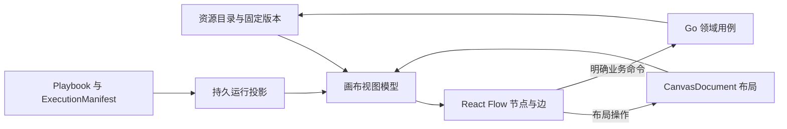

# 多媒体创作画布与运行可视化设计

- 状态：待评审目标，尚未取代已接受设计或解锁实施
- 日期：2026-09-07
- 上位边界：[0013 创作编排与多媒体画布架构调整](0013-创作编排与多媒体画布架构调整设计.md)
- 执行合同：[3004 Agent Harness 专业能力与创作流程](3004-AgentHarness专业能力与创作流程设计.md)
- 既有设计：[1001 前端架构](1001-前端应用架构.md) · [1002 工作台功能](1002-前端功能模块设计.md) · [0010 内容图与画布](0010-StoryGraph内容图与DAG创作画布设计.md)

## 1. 结论与范围

画布是围绕版本化创作资源的工作空间：展示来源、组织分镜、比较候选、提交受控修改，并投影 Harness 的持久执行检查点。采用 React Flow 提供选择、拖动、缩放、节点与连线交互；执行计划、正式资源和费用继续由服务端负责。

当前前端已有 Guided Studio 设计与 RTK Query 基础，尚未安装 React Flow；现有部分页面通过轮询取状态。当前上传仅支持受限文档，参考视频分析还依赖平台补齐视频接管、探测与派生媒体。本设计不是这些功能的完成声明。

本文负责视图模型、节点/分组、交互命令、运行投影、媒体呈现及恢复体验。平台身份、采纳与事件可靠性归 0013；Step、Attempt、Skill 和 OutputBinding 归 3004。非目标为浏览器执行器、自由代码节点、完整专业剪辑软件、多人 CRDT，以及只为画布建立平行的业务事实库。

## 2. 工作台入口与统一选择

保留项目级 Guided Studio：用户先选择源版本、剧集和场次，再进入对应视图；新项目显示导入入口与阶段导航，不要求用户从空白节点手工拼完整生产链。

| 视图 | 核心问题 | 主要内容与动作 |
| --- | --- | --- |
| 创作步骤 | 进行到哪里，下一步需要我做什么 | 阶段、输入、检查点、待审项和可执行动作 |
| 故事与设定 | 原稿中谁在何时做了什么 | Source、提及、身份、场次、状态与来源定位 |
| 导演分镜 | 这一场怎么拍，采用哪个候选 | 场次组、ShotBrief、FrameBoard、Take 对比与选择 |
| 运行诊断 | 为什么等待或失败，怎样恢复 | StepInstance、Attempt、Issue、用量和恢复动作 |

四个视图共享 SelectionContext：项目、源版本、集/场范围、选中 ResourceRef、候选或正式版本、可选 run/step 引用。切换视图保留语义选择，各视图单独保留镜头位置与筛选条件。找不到对应卡片时显示资源详情，不伪造节点或偷偷切换源版本。

默认界面由阶段导航、中央画布、按选择展开的属性/来源/对比面板组成；运行详情按需打开。窄屏保留列表与详情完成审阅、选择和恢复，复杂空间编辑可留在宽屏，不把所有操作压入微缩画布。

## 3. 数据模型与四种权威

| 数据 | 保存内容 | 不得混入 |
| --- | --- | --- |
| 资源目录摘要 | ResourceRef、标题、类型、scope、版本/质量/采纳摘要、媒体派生引用 | 完整原稿、永久签名 URL、可写业务 Head 副本 |
| CanvasDocument | canvas/schema/layout revision、节点、视觉连线、用户布局标记 | Workflow 状态机、供应商请求、正式候选内容 |
| CanvasNode | view instance ID、kind、resource/step/slot binding、parent、局部坐标、尺寸与折叠状态 | 用节点 ID 充当角色/镜头/operation ID |
| CanvasLink | 端口或视觉端点、关系 kind、可选业务关系引用 | 把所有连线默认为执行硬依赖 |
| ViewPreference | 用户视口、筛选、面板与显示偏好 | 项目业务版本或多人共享运行状态 |
| 运行投影 | Manifest/Step/Attempt、输出引用、检查点与游标 | 通过更新投影表决定下一任务 |

ResourceRef 身份沿用 0013。业务 revision、布局 revision、投影版本和 schema 版本互不替代。资源绑定支持固定版本 PINNED 与跟随已采纳版本 FOLLOW_ACCEPTED；跟随只影响编辑展示，执行、审批、比较与交付一律解析并冻结具体 revision。

删除资源导致引用不可用时保留可解释的失效卡片；权限撤销后服务端停止返回内容，客户端移除已缓存的受限详情。旧引用不能绕过当前权限校验。

## 4. 节点、端口与分镜组

| 节点 | 展示和交互 | 身份规则 |
| --- | --- | --- |
| 素材/资源卡 | 原稿、图像、音频、视频或设定摘要；查看来源、预览、作为参考 | 一个 ResourceRef 可有多个视图实例 |
| 步骤卡 | 已发布业务标题、输入、状态与输出槽；展开运行详情 | 绑定 StepInstance，技术重试不换逻辑卡 |
| 分镜组 | 场次/段落标题、镜头集合、紧凑网格与展开编辑 | 分组是视图容器，不复制场次或镜头 |
| 镜头卡 | 叙事目的、时长、参考、画板、当前 Take 与审阅 | 绑定正式镜头或固定草案 item_key |
| 便签卡 | 用户说明和视觉注释 | 仅布局内容，不隐式进入模型上下文 |
| 输出槽 | 预告输出角色、等待/部分/就绪状态 | 槽位键来自 OutputBinding，不靠显示标题去重 |

节点注册表声明可渲染资源类型、端口方向、数据类型、用途、必需性与基数。StepDescriptor 的 renderer 是受控枚举；后端不能发送任意 React 组件路径或可执行代码。

分镜组紧凑态可用 2×2 或分页缩略图；展开态显示相同镜头的独立卡片。成员与坐标使用组内逻辑坐标，移动父组不会逐个重写子节点绝对坐标；服务端拒绝包含环。缩放、屏幕像素与逻辑坐标通过 React Flow 的变换转换，拖入/拆组保持视觉位置。

同一分组渲染器可以展示参考片的 AnalyzedShot 或制作中的 ShotBrief，但二者保留不同资源类型和来源标识。参考片 StoryboardGroup 的叙事分组通过提案保存，用户纯粹拖动的视觉分组只改布局；FrameBoard 则保存制作镜头与画板格的关系，不能用紧凑网格截图替代各个源资源。

组内初始排序来自明确的镜头顺序，布局排序不能自动改 EditPlan。示例“两组、每组四镜头”的展开/折叠应保持八个资源身份和原候选选择；组移动不创建任何模型或媒体操作。

## 5. 关系与操作语义

| 关系/动作 | 含义 | 保存或执行路径 |
| --- | --- | --- |
| 故事关系 | 提及、身份、场次、节拍与状态的语义关联 | 读取内容投影；修改提交领域提案 |
| 参考关系 | 为指定角色/镜头提供 identity、pose、style 等用途参考 | 类型化绑定命令，校验权限、版本、用途及基数 |
| 执行硬依赖 | 某步骤必须消费指定已冻结输出 | 由 Playbook 编译与服务端校验，不从视觉线推断 |
| 视觉注释线 | 帮助理解的连线 | CanvasOperation，仅影响展示 |
| 隐藏/删除卡片 | 移除当前视图实例 | 不删除资源、不取消任务、不撤销采纳 |
| 修改提示、配方或参考 | 创作内容修订 | 新 Proposal/revision 与影响预览；不写节点 data 代替保存 |
| 选择候选 | 申请正式 TakeSelection | 版本校验与平台回执；本地高亮不能充当正式采用 |

拖出业务连线时先显示待保存状态，服务端通过后才成为已保存关系；拒绝时展示具体冲突并恢复原绑定。撤销/重做只直接处理可逆布局操作；撤销业务修改走领域新修订，已发生费用不能靠前端 undo 消除。

## 6. 布局保存与执行预览

CanvasOperation 包含 op_id、base_layout_revision、目标节点 revision 和受限操作。服务端原子校验并提交批量移动/分组；不同节点可按独立版本合并，同节点并发修改返回冲突与最新值。客户端保留未保存操作并允许重放或放弃，不用最后写入覆盖全部画布。

节点删除留版本化 tombstone；迟到移动不能复活已删除节点。系统输出槽按 canvas + step_instance + output_role + item_key 唯一创建；用户复制卡片生成新的 view instance。重建运行投影只恢复绑定与状态，不覆盖用户已保存位置。手工删除的系统卡不会因同一事件重放重生，可通过明确“显示产物”重新添加。

点击生成/重算时服务端形成 ExecutionPreview：固定输入版本、目标范围、依赖差异、可复用结果、预计成本/报价有效期、所需审阅与授权。用户确认针对该预览；正式命令核验 preview hash、版本和当前权限。输入、价格或授权发生变化时返回预览失效并重新计算，不能按画布旧显示直接扣费。

## 7. Harness 产物如何逐步出现在画布

执行前读取 Manifest 与 3004 的 StepDescriptor，预先显示已知阶段与输出角色。动态范围尚未发现时显示集合占位；持久展开事件提供稳定 scope 后创建 StepInstance。界面不从 token 文本或自由日志猜测有哪些角色、场次和镜头。

OutputBinding 指向已提交资源 revision 后填充输出槽。部分结果可以浏览，但明确显示 partial 和缺失范围，不能解除完整性门禁。技术重试更新 Attempt 面板；语义修订保留历史候选，通过新的 revision 展示差异。新产物默认只为新槽安排位置。

执行、审阅、采纳、质量、新旧状态和供应商状态分别表达。例如“生成成功 / 待审 / 未采纳”“旧版已采用 / 新版待选”“供应商结果未知 / 对账中”均为合法组合。人工已批准而 Owner Effect 尚未完成时显示“批准已记录，采纳处理中”；完整回执到达后才显示正式采纳。

进度只使用已知单位：已解析场数、已验证输出数或已完成镜头数。总量动态变化时说明范围扩展；不能把模型 token 百分比包装成整集制作进度。运行完成不自动意味着通过交付审查。

## 8. 快照、事件流与恢复

bootstrap 返回授权范围内的资源摘要、布局版本、执行描述、运行投影与 as_of_cursor。运行/资源投影在同一游标切面读取；布局是独立 CAS 事实，附自身 revision。不得将该展示快照宣称为跨库事务快照，执行仍使用服务端固定的 InputSnapshot。

沿 0013 的持久流从 as_of_cursor 补读并转入实时推送，避免先拉快照后订阅的空窗。事件带 event ID、对象 revision 和 schema；重复忽略，低版本不覆盖高版本，旧 Attempt 不改新 Attempt 的结果。客户端不假定过滤后的游标连续或简单加一。

初始采用鉴权 fetch stream，不把长期 Bearer token 放入 URL。断线按最后应用游标续读；游标过期、schema 不兼容、项目权限变化时重新 bootstrap，并重校未保存布局操作。查询缓存/投影重建不得重发生成请求或重跑 Workflow。

运行权威只来自已提交记录；前端乐观状态限于“命令发送中”和可逆布局。命令响应未知时按原幂等键查询，不能用新键盲目重试。权限撤销时终止流、清除该范围内容并按服务端结果重新取权限。

## 9. 多媒体、来源与局部重算

媒体卡优先读取 poster/thumbnail/preview 派生引用，原文件按需访问。画布持久数据不存大字节、base64 或易过期 URL；预览地址过期按原资源重新申请。离屏停止播放，限制同时活动播放器；音频提供波形或基础播放控件，视频标注媒体时间与帧信息。

拉片切点、帧证据以媒体 timebase/PTS 和派生帧映射记录，不能仅用帧序号除以声明 FPS 推算 VFR 时间。文本证据沿 3004 的源版本与 Unicode 区间定位；找不到对应版本时说明原因，禁止在最新文本上凑出近似高亮。

画布支持 Source → Mention/Entity → Beat → Shot → Take 的追溯。参考关系有明确用途；同一照片用于风格时不能自动当身份锁定。局部重算由服务端 DependencyIndex 按字段和输入消费关系给出受影响集合，用户选择批准范围，再启动修订运行。

旧 Take、TakeSelection 和 ReleaseBundle 保持可查；重算未成功前不清空已采用素材。参数修订、角色合并或道具状态改变需要重新验证相关参考和覆盖，但不能沿所有视觉连线扩大到整剧。蒙版/区域编辑可后续作为独立局部编辑器接入，不要求首版同时安装 Konva 或重型时间线引擎。

## 10. 工程落点、研究依据与验证场景

沿用 `frontend/src/features/`，首个消费者落地时创建画布功能模块，封装 node registry、资源到视图转换、布局操作、运行投影和媒体卡。RTK Query 负责服务端缓存，React Flow 接收派生 nodes/edges；临时选择/拖动状态独立。禁止从节点组件调用供应商或植入全局执行 Store。

nodeTypes/edgeTypes 保持稳定，节点组件按各自数据订阅，媒体与详情按需加载；大集合先使用紧凑分组与可见范围渲染。主线程负载、初始加载、拖动和播放器资源上限需用真实目标规模测量，本设计不凭依赖名称承诺性能。

公开研究与采用范围：

- [React Flow 官方仓库](https://github.com/xyflow/xyflow/blob/main/packages/react/README.md) 与 [性能说明](https://reactflow.dev/learn/advanced-use/performance)：作为交互基础，需应用自行控制订阅和重渲染。
- [Node Banana 分组层](https://github.com/shrimbly/node-banana/blob/5c0e0ae6150f29a6de819f8d6f1dedba15151f7c/src/components/GroupsOverlay.tsx) 与 [媒体画廊节点](https://github.com/shrimbly/node-banana/blob/5c0e0ae6150f29a6de819f8d6f1dedba15151f7c/src/components/nodes/OutputGalleryNode.tsx)：参考分层分组、预览与候选浏览交互；其业务 Store/浏览器 runner 不符合本平台执行边界，不能整体搬入。
- [PySceneDetect 官方说明](https://github.com/Breakthrough/PySceneDetect/blob/main/README.md)：是参考片切点/抽帧能力候选；不能证明语义分镜、人物识别或 VFR 来源已正确实现。

| 验证场景 | 应验证的结果 |
| --- | --- |
| 单份合成原稿解析到审阅采纳 | 步骤、来源、草案和正式版本联动，回执前不显示已采纳 |
| 两组八镜头展开、移动、刷新 | 资源不复制，布局保存，候选选择不变，无生成命令 |
| 同节点并发移动与删除后迟到操作 | 明确冲突；已删除卡不复活；无关节点操作可合并 |
| 输出持久化后断线、重复/乱序事件 | 相同槽位和版本，无重复卡，无执行重启 |
| 修改道具颜色后重算 | 只重算确实消费该字段的结果；不依赖该字段的声音结果可复用，交付版本不改 |
| 同一蒙面身份跨披露时点与闪回 | 世界设定可追溯，早期镜头仍遵守披露和场次状态 |
| 已批准后采纳失败、供应商 UNKNOWN | 显示真实恢复阶段；无重复采纳、购买或伪退款 |
| 预览过期、媒体地址过期、权限撤销 | 分别刷新预览、续取合法地址、清除受限内容 |

测试沿用各应用独立 `tests/`。上述是待派生的验收场景，尚未运行新画布或浏览器验收；首个界面闭环服务于已有合成原稿解析与采纳，再扩展分镜和真实媒体，参考视频导入须先补平台媒体能力。
