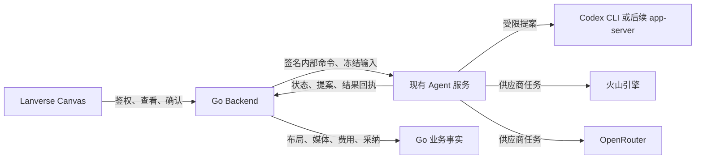
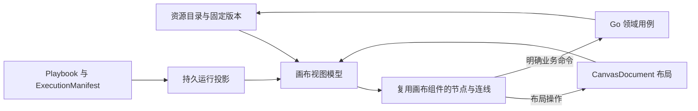

# 多媒体创作画布与运行可视化设计

- 状态：业务与数据边界沿用已接受目标；2026-09-23 画布编辑与 Backend 文档合同已有未提交实现，尚未完成浏览器及真实媒体验收；经现有 Agent 服务接入多供应商和 Codex 仅为设计
- 日期：2026-09-07
- 技术方案修订：2026-09-23；参考用户指定的 `basketikun/infinite-canvas`，核验基线 `dab19adc0847e32e39b7fc8ff90cb392561fb826`
- 上位边界：[0013 创作编排与多媒体画布架构调整](0013-创作编排与多媒体画布架构调整设计.md)
- 执行合同：[3004 Agent Harness 专业能力与创作流程](3004-AgentHarness专业能力与创作流程设计.md)
- 既有设计：[1001 前端架构](1001-前端应用架构.md) · [1002 工作台功能](1002-前端功能模块设计.md) · [0010 内容图与画布](0010-StoryGraph内容图与DAG创作画布设计.md)

## 1. 结论与范围

画布是围绕版本化创作资源的工作空间：展示来源、组织分镜、比较候选、提交受控修改，并投影 Harness 的持久执行检查点。首版直接在 Lanverse `frontend/` 实现；以 `basketikun/infinite-canvas` 的画布相关源码为迁入基线，先让已有画布交互和组件在当前项目运行，再做 Lanverse 业务适配。React Flow 不再作为首选依赖。执行计划、正式资源和费用继续由服务端负责。

当前 Lanverse 前端已有 Guided Studio 与 RTK Query 基础，尚无真实 Lens 页面或画布依赖；现有部分页面通过轮询取状态。当前上传仅支持受限文档，参考视频分析还依赖平台补齐视频接管、探测与派生媒体。本设计不是这些功能的完成声明。

用户指定的开源项目已在仓库外按提交 `dab19adc0847e32e39b7fc8ff90cb392561fb826` 只读核验。其 `web/` 是 Vite、React、Ant Design、Zustand 应用；`web/src/pages/canvas/project.tsx` 约 3400 行，混合空间交互、应用路由、浏览器本地保存、插件和媒体生成。可迁入的画布部分包括 `InfiniteCanvas`（256 行）、`canvas-mini-map`（137 行）、`canvas-connections`（78 行）、`canvas-create-menus`（115 行）、`canvas-node`（992 行）和 `canvas-toolbar`。这些文件仍引用主题 Store、节点注册表、服务或 Ant Design；迁入时保留现成 DOM/交互，逐步把这些应用级依赖换成 Lanverse 的输入与事件边界。整页应用路由和浏览器本地业务 Store 不进入 Lanverse。

本文负责视图模型、节点/分组、交互命令、运行投影、媒体呈现及恢复体验。平台身份、采纳与事件可靠性归 0013；Step、Attempt、Skill 和 OutputBinding 归 3004。非目标为浏览器执行器、自由代码节点、完整专业剪辑软件、多人 CRDT，以及只为画布建立平行的业务事实库。

### 1.1 组件与业务边界

| 归属 | 职责 |
| --- | --- |
| `basketikun/infinite-canvas` 的 MIT 源码 | 画布视口、点阵、小地图、连线及节点卡/工具条是迁入基线；逐文件保留来源和许可 |
| `frontend/src/components/canvas/` | 承载迁入组件、Lanverse View Model 适配、初始布局、详情面板及局部交互状态 |
| Lanverse Backend | 授权查询、正式资源/版本、布局命令与冲突、生成预览及业务回执 |
| 现有 `agent/` 服务 | AI 执行的统一内部入口；Codex 提案及火山/OpenRouter 等供应商调用按 1.7 逐项接入 |

画布组件不持有第二份业务事实。RTK Query 继续拥有服务端查询缓存；URL 拥有项目、Lens、范围和固定版本；画布局部状态只维护视口、选择与尚未提交的交互。节点渲染器不直接请求供应商、读取数据库或决定采纳状态。首版只读时关闭拖动、连线和删除，后续逐项开启受控操作。

### 1.2 身份和事件合同

StoryGraph/Workflow DTO 先经各自的纯转换函数，生成受控的节点与边。`node.id` 是稳定视图实例键；正式资源通过显式 `ResourceRef@revision` binding 引用，同一资源可显示多个卡片。视觉边、StoryGraph 关系边与执行依赖分别标记，不能从任意连线推断业务执行。当前选中节点只保存 ID，不复制整份 DTO。

后续 `CanvasDocument` 保存 `schema_version`、节点布局、视觉连线与 layout revision；不存大字节媒体、长期签名 URL、供应商凭据或工作流状态。画布的交互事件先转成受限布局意图，Go Authoring 校验权限与 base revision 后返回结果；业务动作走独立类型化命令，不能把节点 data 当正式写入。冲突、删除和旧版本均给出明确回执，不用整图覆盖。

### 1.3 技术选型与参考使用

Lanverse 保持当前 Next.js/React 应用结构。按文件迁入参考项目的画布 UI，保留节点卡、浮动工具与空间反馈的视觉结构；先把完整的空间外壳与媒体卡展示态在当前项目跑通，再将主题、资源 URL、节点注册表和事件回调接到 Lanverse 已有边界。迁入范围包含创作画布所需的视口、点阵、小地图、连线/卡片、选择、浮动工具与空态，不能缩减成只有 Story Lens。已有 StoryGraph Query 可作为第一个真实数据接入，创作画布的可写操作仍按后端正式命令逐项接通。首版初始坐标采用按稳定键排序的确定性布局，并在真实有界数据上验证；只有出现可复现的交叉/嵌套问题时再引入布局依赖。

迁入时保留指针缩放、拖动画布、点阵、小地图导航与按选择显示工具；复制实质代码须保留其 MIT 版权与许可声明。先保留画布局部视觉与交互所需的控件，再按 Lanverse 主题和业务操作改造；应用路由、Zustand 持久项目、浏览器直连生成与插件运行时不进入 Lanverse。若迁入某组件暴露不合理的应用级依赖，先拆出该组件的画布 UI 与交互，再继续迁入，不把技术方向自动切回 React Flow。

### 1.4 开源候选对比（2026-09-23）

GitHub Star 是此日 GitHub 仓库 API 的快照，能反映关注度，不能代替许可证、组件可迁入性或实际验收。公开事实来自 GitHub 仓库/源码与官方文档；“Lanverse 适配”是基于当前代码的工程判断，尚未经运行验证。

| 候选 | Star / 许可 | 现成可复用内容 | Lanverse 适配判断 |
| --- | ---: | --- | --- |
| [Excalidraw](https://github.com/excalidraw/excalidraw) | 132,703 / MIT | 可嵌入 React 白板、工具栏、画图与受限的嵌入内容渲染 | 白板体验成熟，但自由绘图视觉与图片/视频/步骤卡的业务形态相距较远；要做 LibTV 式节点仍需较多定制 |
| [tldraw](https://github.com/tldraw/tldraw) | 50,527 / 专有 SDK 许可 | 完整 React 编辑器、图片/视频形状、可定制 ShapeUtil/UI | 技术复用度高；[当前官方许可](https://tldraw.dev/sdk-features/license-key)要求商业生产使用授权 Key，未取得授权前不能作为 Lanverse 生产基座 |
| [React Flow](https://github.com/xyflow/xyflow) | 38,476 / MIT | 平移缩放、连线、点阵、MiniMap、Controls 和简单节点 | 适合图编辑底座，但媒体卡、创建入口、工具栏、来源详情和 LibTV 式交互仍需自行设计；本轮按用户反馈退出首选 |
| [Drawnix](https://github.com/plait-board/drawnix) | 14,750 / MIT | 白板/脑图/流程图的完整 React 组件与工具条 | 现成 UI 是通用白板，媒体生成卡与 Lanverse 资源身份仍需新增 |
| [basketikun/infinite-canvas](https://github.com/basketikun/infinite-canvas) | 6,937 / MIT | 视口、点阵、小地图、媒体节点、创建菜单、工具条与连接显示等源码 | 与 LibTV 目标和媒体流程最接近；组件依赖其 Vite 应用、主题和 Store，按画布范围迁入并逐步适配；本轮确定的基线 |
| [Node Banana](https://github.com/shrimbly/node-banana) | 1,570 / MIT | 图片/视频/音频生成节点与完整工作流 UI | Next.js/React 接近 Lanverse，但节点依赖 React Flow 和自身 Zustand 执行 Store；直接迁入仍承受本轮想避免的重做成本 |
| [Infinite Kanvas](https://github.com/fal-ai-community/infinite-kanvas) | 296 / 仓库未声明许可 | 图片/视频画布、React Konva 预览交互 | 无明确源码复用授权且围绕 fal.ai、tRPC 和本地状态构建；只可参考公开行为，当前不复制代码 |
| [Loomic](https://github.com/fancyboi999/loomic) | 264 / MIT | 对话驱动图像/视频无限画布 | 方向相近但社区和维护证据较薄；保留为观察项，不作为首个迁入基座 |

确定的方向是**迁入参考项目的画布源码，再做 Lanverse 项目化改造**。迁入顺序为视口、MiniMap、连接层、节点卡展示态、浮动工具；每一步记录依赖闭包和需要替换的应用级 import，并验证只读禁用、媒体缩略图与错误态是否能通过 Lanverse Backend 数据展示。`canvas-node.tsx` 接近千行，不能未经拆解即宣称可直接复用。Star 数会变化，实施时复查固定提交与许可证。

| 源码候选 | 优先复用的部分 | 必须替换/裁剪的依赖 |
| --- | --- | --- |
| `infinite-canvas.tsx` | 视口状态、指针平移、鼠标中心缩放、点阵与键盘手势 | 主题 Store 和 Ant Design 弹层识别改为显式主题/交互区属性 |
| `canvas-mini-map.tsx`、`canvas-connections.tsx` | 世界坐标映射、视口框、连接显示 | 节点注册表和颜色从 Lanverse View Model/主题输入 |
| `canvas-node.tsx` | 图片、视频、音频和文本卡的展示结构与选择态 | 图片本地存储、插件上下文、生成/重试回调与持久项目引用；只读 Lens 仅迁展示态 |
| `canvas-toolbar.tsx`、`canvas-create-menus.tsx` | 空间布局、浮层、图标与可用操作的呈现 | Ant Design、扩展插件、i18n/主题 Store 和未接通的生成入口；保留设计细节但仅暴露已授权命令 |

迁入必须产出可运行页面或隔离预览，并记录项目构建、深浅主题、键盘/触控板缩放、节点点击与连线命中、刷新恢复和中等范围有界数据的浏览器结果。若源代码需实质复制，随代码保存原 MIT 版权与许可文本。仅凭编译通过或 Star 数不能宣称完成迁入。

### 1.5 此前实施切片：项目内 Canvas 入口

2026-09-23 用户进一步明确：在当前项目工作区新增 Canvas 入口，借用参考项目的空间交互能力；视觉按根目录 `DESIGN.md` 与现有主题重做，并剔除本项目暂不需要的功能。首个切片在 `/projects/:projectId/canvas` 打开，入口位于项目详情；复用参考项目的世界坐标、指针平移、以指针为中心缩放与小地图映射。卡片外观、顶部信息、浮动控件和空态采用 Lanverse 的 Geist、语义色、无边框层级及键盘焦点规范，不搬入参考项目的 Ant Design 控件、应用路由或第二状态库。

现有项目与单集 Query 作为首个真实内容：项目卡与单集卡可选择、定位，详情深链到现有工作区。该切片不创建图片/视频生成按钮、自由节点编辑或浏览器本地持久项目；目前尚无独立 CanvasDocument 读写合同，不能把拖动或新增卡片做成刷新即丢失的正式功能。后续可写媒体卡须按本 Design 的布局、资源和生成命令分别实施。首个切片验收包括真实鉴权、无权限/空集/错误状态、平移缩放、MiniMap、键盘操作、刷新后从 Query 重建，以及明暗主题与窄屏列表替代视图。

画布以 `frontend/src/components/canvas/` 作为独立组件边界：视口几何、节点投影、节点外观、小地图及页面数据适配分别维护，`app/projects/[projectId]/canvas` 只装配路由。当前仓库只有单个 Next.js 前端应用，组件直接使用其主题、UI 基础控件与 Query；不在仓库根目录另建可独立运行的 Canvas 应用。若以后出现第二个真实消费端，再根据实际依赖提取共享包。

### 1.6 完整接入目标与当前缺口

2026-09-23 用户确认：交付目标是完整项目画布，Canvas 负责节点创作交互，真实媒体生成和保存由 Lanverse Backend 控制。上节只读入口是中间状态，不能作为完整接入的验收结果。

完整接入至少包含以下闭环：

1. 项目画布内新增、选择、拖动、调整尺寸、复制、删除、分组文本/图片/视频/音频/资源卡；连线、撤销/重做、快捷键、小地图、缩放、窄屏可操作替代视图。视觉遵循 `DESIGN.md`，不迁入 Ant Design、插件市场或浏览器 Provider Key。
2. Go CanvasDocument 保存节点实例、受限视觉连线、布局、配置与媒体版本引用；通过鉴权、幂等键、节点 revision 和冲突回执处理操作。刷新和跨设备重建同一画布；业务资源、执行状态与大字节媒体不复制进文档。
3. 画布卡片使用正式 Media/Generation/Cost/Review 合同：授权上传和预览，生成前固定输入与费用预览，确认后服务端执行图片/视频/音频任务，展示进度、失败、未知结果与候选历史，人工选择后才更新正式引用。前端不能直连供应商或把本地结果当成已保存。
4. 用户从真实项目打开、完成上述编辑和生成、刷新查回，再进入已有分镜/资产工作区；403、冲突、断线、供应商未配置、费用预留失败及结果未知均有明确可恢复路径。只有实际 Provider 输出和媒体文件可播放才可宣称对应模态通过。

实施顺序按依赖为 CanvasDocument/CAS → 完整节点编辑器 → 媒体上传与受控引用 → Backend 正式命令与 Agent 执行接入 → 各模态生成与人工选择 → 浏览器和真实服务验收。已存在的 Reference 图片生成合同受严格 Target/Plan 约束，不能直接用通用 Canvas Prompt 冒充；当前视频只有目录预设而无已注册执行 Adapter，音频目录/Adapter 也未接通。各模态必须在 Backend 增加正式受控路径并让 Agent 具备对应执行能力后才开启对应按钮。

### 1.7 现有 Agent 服务作为统一 AI 入口（2026-09-23，暂不编码）

用户明确要求画布的 AI 能力统一接入当前 `agent/` 服务。现有 Agent 是私有 HTTP 服务，`CREATION_AGENT_URL` 与 `AGENT_URL` 指向同一个 `agent:8787` origin；镜像已包含固定版本 Codex CLI，`agent/app/reasoning/codex.py` 已有受限的 `codex exec --ephemeral --sandbox read-only` 调用。这些是**已有工程事实**，不表示画布提案、多供应商媒体调用已接通。当前 Go Backend 仅注册 OpenAI 图片执行 Adapter；火山图片/视频只是目录预设，OpenRouter 媒体、音频、Canvas 通用生成命令尚未完成。

**目标边界**：Frontend 只调用 Go Backend 的公开接口；Go Backend 负责用户与项目授权、CanvasDocument、正式资源/媒体版本、生成预览、费用、幂等和采纳；现有 Agent 服务是 Codex、火山引擎和 OpenRouter 等 AI 执行能力的统一内部入口，负责受限推理、供应商调用、持久执行状态与提案/结果回执。Agent 不直接写 Go 业务库，不把模型输出当正式资源；Backend 不把浏览器节点数组当业务事实。这里的“本地 Codex”指 Agent 部署环境中的受控子进程，不要求用户电脑启动本机服务。

| 通道 | Agent 内的目标职责 | 实施前必须核验 |
| --- | --- | --- |
| Codex | 根据授权范围内的画布摘要，生成结构化 `CanvasProposal`，例如节点布局、便签、提示词修订；不直接写画布或发起付费生成 | 现有只读 CLI 可先做单轮提案；多轮交互确有需要时，在同一 Agent 服务内增加 app-server 协议适配、会话持久化和受限 MCP 工具 |
| 火山引擎方舟 | 由 Agent 的可信 Adapter 执行图片/视频等模型任务，保存供应商请求身份、轮询/回调状态、用量与结果回执 | 模型、地域、账号权限、异步语义、价格和媒体文件接管均按租户实测；目录预设不等于可执行 |
| OpenRouter | 由 Agent 的可信 Adapter 按具体模型与端点执行文本、图片、视频或语音任务 | [官方模型目录](https://openrouter.ai/docs/api/api-reference/models/get-models)用于发现能力；[图片](https://openrouter.ai/docs/guides/overview/multimodal/image-generation)、[视频](https://openrouter.ai/docs/guides/overview/multimodal/video-generation)、[语音](https://openrouter.ai/docs/guides/overview/multimodal/tts)合同各异，需逐模型确认可用性、费用与结果身份 |

参考项目固定提交中的 [`canvas-agent/README.md`](https://github.com/basketikun/infinite-canvas/blob/dab19adc0847e32e39b7fc8ff90cb392561fb826/canvas-agent/README.md)、[`codex-client.ts`](https://github.com/basketikun/infinite-canvas/blob/dab19adc0847e32e39b7fc8ff90cb392561fb826/canvas-agent/src/agent/codex-client.ts) 和 [`canvas/session.ts`](https://github.com/basketikun/infinite-canvas/blob/dab19adc0847e32e39b7fc8ff90cb392561fb826/canvas-agent/src/canvas/session.ts) 展示了本机服务启动 `codex app-server --stdio`、以线程/轮次处理事件、通过 MCP 读画布并调用网页工具的链路；[Codex app-server 文档](https://learn.chatgpt.com/docs/app-server)提供协议依据。其网页 `use-agent-bridge.ts` 直接以浏览器节点数组执行操作，`local-agent-panel.tsx` 在关闭工具确认时可自动执行写工具，`run_generation` 可在网页端触发生成。Lanverse 只借鉴线程事件、受限工具和操作提案的思路：不复制本机 Companion、浏览器直连、查询参数 token、自动写画布或前端直接生成。

#### 提案与生成的权威时序

1. 用户在 Canvas 发起请求。Backend 核验项目权限，冻结 `project_id`、操作者、选中节点与布局 revision、必要的资源摘要和命令幂等键，以现有服务间签名机制向 Agent 提交受限命令。Agent 只接收本轮最小上下文；Codex 子进程不继承业务数据库、供应商凭据或通用写入权限。
2. Agent 首先可复用现有只读 Codex CLI，按固定 Schema 生成 `CanvasProposal`：`proposal_id`、项目/操作者、来源快照 revision、节点 expected revision、类型化操作、影响摘要和有效期。Agent 持久记录提案和执行状态；Backend 向前端提供提案查询与事件投影。前端展示差异，拒绝或超时均不修改画布。
3. 用户接受提案时，Frontend 向 Backend 发送 `proposal_id` 和确认请求。Backend 再次校验权限、提案归属、有效期、操作边界与 CanvasDocument revision，按幂等键应用类型化操作并返回权威文档。409 冲突不自动重放；Agent 记录已接受、拒绝或失效回执，刷新后仍由 Backend 查询画布事实。
4. 涉及付费生成时，Codex 只能提出 `GenerationIntent`。Backend 先固定输入、模型能力、报价与费用预留，再创建持久任务并经 Agent 调用供应商。Agent 负责供应商请求身份、同步/异步状态、重试对账与原始结果；Backend 负责隔离媒体接管、探测、正式 `MediaVersion`/候选、费用结算及人工选择。超时状态是未知结果，先按原任务身份对账，不用新键重复付费。

Backend 与 Agent 的设计合同包括：内部命令的签名、命令 ID、操作者与项目 scope、冻结输入与 revision、到期时间；Agent 回执的执行 ID、供应商请求 ID、状态、用量、错误类别、结果引用与单调事件序号。公开接口包含提案查询/确认、`GenerationPreview`、`GenerationRequest`、任务状态/候选查询和正式选择。命令须能在断线、重复投递、服务重启和 409 后查询最终状态；Agent 的 `accepted` 只表示内部命令已持久接收，不代表已生成或已保存正式资源。会话与事件由 Agent 持久化，浏览器只订阅 Backend 投影；多标签页不能跨项目确认提案。

失败路径同样通过 Backend 呈现：Agent 不可用时新请求返回可重试的不可用状态，已有画布仍可读写；模型或凭据未配置时能力目录禁用对应生成入口；Codex 超时或提案 Schema 不合法时仅标记该提案失败；Provider 响应超时但是否扣费不明时任务保持 `unknown` 并用原供应商请求身份对账。权限撤销或画布 revision 变化使待确认提案失效，不允许后台自动应用；前端恢复时按项目查询 Backend 的权威状态。

现有 Go `generation` 已拥有 OpenAI 图片执行路径。迁移到统一 Agent 入口时，按**模型/能力**逐个切换执行所有权和路由；同一请求只允许一个执行 Owner，并保留原任务的回查路径。迁移完成前，不声称所有 AI 调用已统一。Provider Catalog 继续区分 `provider`、`model`、端点合同、输入/输出模态、地域、凭据版本、报价与可用性；凭据只交给 Agent 的可信 Adapter，Codex 受限运行时不得获得。Agent 凭据分发方式及 Go 现有执行任务迁移，需要在实施计划中按当前密钥管理与历史任务语义具体设计。火山视频任务实施时重新核验[官方视频生成 API](https://docs.volcengine.com/docs/ark/video-generation-api?lang=zh)。

设计层面的顺序为：① 现有 Agent 内的单轮 Codex 结构化便签/布局提案，完成预览、拒绝、确认、刷新和 409；② 多节点批量提案与必要的线程事件；③ 若单轮 CLI 无法满足交互，再在同一 Agent 服务内增加 app-server/MCP 适配；④ 火山及 OpenRouter 按具体模型/模态接入 Agent，并逐个迁移 Go 执行 Owner；⑤ 真实服务验收权限、费用、幂等、未知结果、原始文件与播放、候选选择。缺少可靠报价、结果身份或接管路径的能力保持不可生成。只通过 SDK 编译、HTTP 200 或参考项目 Demo 不算完成；本次仅更新设计，不提交供应商接入代码。

## 2. 工作台入口与统一选择

保留项目级 Guided Studio：用户先选择源版本、剧集和场次，再进入对应视图；新项目显示导入入口与阶段导航，不要求用户从空白节点手工拼完整生产链。

| 视图 | 核心问题 | 主要内容与动作 |
| --- | --- | --- |
| 创作步骤 | 进行到哪里，下一步需要我做什么 | 阶段、输入、检查点、待审项和可执行动作 |
| 故事与设定 | 原稿中谁在何时做了什么 | Source、提及、身份、场次、状态与来源定位 |
| 导演分镜 | 这一场怎么拍，采用哪个候选 | 场次组、ShotBrief、FrameBoard、Take 对比与选择 |
| 运行诊断 | 为什么等待或失败，怎样恢复 | StepInstance、Attempt、Issue、用量和恢复动作 |

四个视图共享 SelectionContext：项目、源版本、集/场范围、选中 ResourceRef、候选或正式版本、可选 run/step 引用。切换视图保留语义选择，各视图单独保留镜头位置与筛选条件。找不到对应卡片时显示资源详情，不伪造节点或偷偷切换源版本。

默认界面由阶段导航、中央画布、按选择展开的属性/来源/对比面板组成；运行详情按需打开。窄屏保留列表与详情完成审阅、选择和恢复，复杂空间编辑可留在宽屏，不把所有操作压入微缩画布。

### 2.1 LibTV 截图对应的 Lanverse 交互

用户提供的 LibTV 空画布截图能直接观察到深色点阵背景、顶部画布名称与模式切换、左侧浮动工具、中央创建入口、底部缩放/视图控制及右下角运行入口；截图不能证明其保存、连线、生成或协作的内部语义。Lanverse 借用空间层级与操作反馈，不复制品牌、图标和未核实的业务能力。

| 可见区域 | Lanverse 首个可验收切片 | 后续有正式合同才启用 |
| --- | --- | --- |
| 顶部 | 项目/画布名、当前源版本、Story Lens 范围、返回 Guided Studio | 故事板编辑与 Workflow 运行模式切换 |
| 中央点阵画布 | 拖拽平移、滚轮缩放、框选范围、选卡、Fit、MiniMap；按项目/集/场有界加载 | 自由新增、拖动保存、分组与业务连线 |
| 左侧浮动工具 | 选择、移动、资源列表、键盘帮助 | 生成、素材拖入、角色造型和批量整理 |
| 空画布入口 | 导入剧本或打开已有场次/分镜；有数据时直接定位内容 | 图片、视频、音频和智能剪辑等有真实 Backend 能力的命令 |
| 右侧详情 | 来源、固定版本、审阅/采纳状态、关联资源及明确失败信息 | 比较候选、受控修改、影响预览和重算 |

“无限”指连续世界坐标中的平移/缩放与按范围取数，不表示首次把整剧所有节点下载并渲染。截图中的五个快捷生成按钮不能当作 Lanverse 已有能力：未接通的动作不以可点击按钮或模拟成功占位。只读 Story Lens 先证明空间交互、业务身份和来源追溯；可编辑创作画布再证明节点创建、布局持久化、刷新恢复和正式命令回执，两个阶段分别验收。

## 3. 数据模型与四种权威

| 数据 | 保存内容 | 不得混入 |
| --- | --- | --- |
| 资源目录摘要 | ResourceRef、标题、类型、scope、版本/质量/采纳摘要、媒体派生引用 | 完整原稿、永久签名 URL、可写业务 Head 副本 |
| CanvasDocument | canvas/schema/layout revision、节点、视觉连线、用户布局标记 | Workflow 状态机、供应商请求、正式候选内容 |
| CanvasNode | view instance ID、kind、resource/step/slot binding、parent、局部坐标、尺寸与折叠状态 | 用节点 ID 充当角色/镜头/operation ID |
| CanvasLink | 端口或视觉端点、关系 kind、可选业务关系引用 | 把所有连线默认为执行硬依赖 |
| ViewPreference | 用户视口、筛选、面板与显示偏好 | 项目业务版本或多人共享运行状态 |
| 运行投影 | Manifest/Step/Attempt、输出引用、检查点与游标 | 通过更新投影表决定下一任务 |

ResourceRef 身份沿用 0013。业务 revision、布局 revision、投影版本和 schema 版本互不替代。资源绑定支持固定版本 PINNED 与跟随已采纳版本 FOLLOW_ACCEPTED；跟随只影响编辑展示，执行、审批、比较与交付一律解析并冻结具体 revision。

删除资源导致引用不可用时保留可解释的失效卡片；权限撤销后服务端停止返回内容，客户端移除已缓存的受限详情。旧引用不能绕过当前权限校验。

## 4. 节点、端口与分镜组

| 节点 | 展示和交互 | 身份规则 |
| --- | --- | --- |
| 素材/资源卡 | 原稿、图像、音频、视频或设定摘要；查看来源、预览、作为参考 | 一个 ResourceRef 可有多个视图实例 |
| 步骤卡 | 已发布业务标题、输入、状态与输出槽；展开运行详情 | 绑定 StepInstance，技术重试不换逻辑卡 |
| 分镜组 | 场次/段落标题、镜头集合、紧凑网格与展开编辑 | 分组是视图容器，不复制场次或镜头 |
| 镜头卡 | 叙事目的、时长、参考、画板、当前 Take 与审阅 | 绑定正式镜头或固定草案 item_key |
| 便签卡 | 用户说明和视觉注释 | 仅布局内容，不隐式进入模型上下文 |
| 输出槽 | 预告输出角色、等待/部分/就绪状态 | 槽位键来自 OutputBinding，不靠显示标题去重 |

节点注册表声明可渲染资源类型、端口方向、数据类型、用途、必需性与基数。StepDescriptor 的 renderer 是受控枚举；后端不能发送任意 React 组件路径或可执行代码。

分镜组紧凑态可用 2×2 或分页缩略图；展开态显示相同镜头的独立卡片。成员与坐标使用组内逻辑坐标，移动父组不会逐个重写子节点绝对坐标；服务端拒绝包含环。缩放、屏幕像素与逻辑坐标通过画布视口变换转换，拖入/拆组保持视觉位置。

同一分组渲染器可以展示参考片的 AnalyzedShot 或制作中的 ShotBrief，但二者保留不同资源类型和来源标识。参考片 StoryboardGroup 的叙事分组通过提案保存，用户纯粹拖动的视觉分组只改布局；FrameBoard 则保存制作镜头与画板格的关系，不能用紧凑网格截图替代各个源资源。

组内初始排序来自明确的镜头顺序，布局排序不能自动改 EditPlan。示例“两组、每组四镜头”的展开/折叠应保持八个资源身份和原候选选择；组移动不创建任何模型或媒体操作。

## 5. 关系与操作语义

| 关系/动作 | 含义 | 保存或执行路径 |
| --- | --- | --- |
| 故事关系 | 提及、身份、场次、节拍与状态的语义关联 | 读取内容投影；修改提交领域提案 |
| 参考关系 | 为指定角色/镜头提供 identity、pose、style 等用途参考 | 类型化绑定命令，校验权限、版本、用途及基数 |
| 执行硬依赖 | 某步骤必须消费指定已冻结输出 | 由 Playbook 编译与服务端校验，不从视觉线推断 |
| 视觉注释线 | 帮助理解的连线 | CanvasOperation，仅影响展示 |
| 隐藏/删除卡片 | 移除当前视图实例 | 不删除资源、不取消任务、不撤销采纳 |
| 修改提示、配方或参考 | 创作内容修订 | 新 Proposal/revision 与影响预览；不写节点 data 代替保存 |
| 选择候选 | 申请正式 TakeSelection | 版本校验与平台回执；本地高亮不能充当正式采用 |

拖出业务连线时先显示待保存状态，服务端通过后才成为已保存关系；拒绝时展示具体冲突并恢复原绑定。撤销/重做只直接处理可逆布局操作；撤销业务修改走领域新修订，已发生费用不能靠前端 undo 消除。

## 6. 布局保存与执行预览

CanvasOperation 包含 op_id、base_layout_revision、目标节点 revision 和受限操作。服务端原子校验并提交批量移动/分组；不同节点可按独立版本合并，同节点并发修改返回冲突与最新值。客户端保留未保存操作并允许重放或放弃，不用最后写入覆盖全部画布。

节点删除留版本化 tombstone；迟到移动不能复活已删除节点。系统输出槽按 canvas + step_instance + output_role + item_key 唯一创建；用户复制卡片生成新的 view instance。重建运行投影只恢复绑定与状态，不覆盖用户已保存位置。手工删除的系统卡不会因同一事件重放重生，可通过明确“显示产物”重新添加。

点击生成/重算时服务端形成 ExecutionPreview：固定输入版本、目标范围、依赖差异、可复用结果、预计成本/报价有效期、所需审阅与授权。用户确认针对该预览；正式命令核验 preview hash、版本和当前权限。输入、价格或授权发生变化时返回预览失效并重新计算，不能按画布旧显示直接扣费。

## 7. Harness 产物如何逐步出现在画布

执行前读取 Manifest 与 3004 的 StepDescriptor，预先显示已知阶段与输出角色。动态范围尚未发现时显示集合占位；持久展开事件提供稳定 scope 后创建 StepInstance。界面不从 token 文本或自由日志猜测有哪些角色、场次和镜头。

OutputBinding 指向已提交资源 revision 后填充输出槽。部分结果可以浏览，但明确显示 partial 和缺失范围，不能解除完整性门禁。技术重试更新 Attempt 面板；语义修订保留历史候选，通过新的 revision 展示差异。新产物默认只为新槽安排位置。

执行、审阅、采纳、质量、新旧状态和供应商状态分别表达。例如“生成成功 / 待审 / 未采纳”“旧版已采用 / 新版待选”“供应商结果未知 / 对账中”均为合法组合。人工已批准而 Owner Effect 尚未完成时显示“批准已记录，采纳处理中”；完整回执到达后才显示正式采纳。

进度只使用已知单位：已解析场数、已验证输出数或已完成镜头数。总量动态变化时说明范围扩展；不能把模型 token 百分比包装成整集制作进度。运行完成不自动意味着通过交付审查。

## 8. 快照、事件流与恢复

bootstrap 返回授权范围内的资源摘要、布局版本、执行描述、运行投影与 as_of_cursor。运行/资源投影在同一游标切面读取；布局是独立 CAS 事实，附自身 revision。不得将该展示快照宣称为跨库事务快照，执行仍使用服务端固定的 InputSnapshot。

沿 0013 的持久流从 as_of_cursor 补读并转入实时推送，避免先拉快照后订阅的空窗。事件带 event ID、对象 revision 和 schema；重复忽略，低版本不覆盖高版本，旧 Attempt 不改新 Attempt 的结果。客户端不假定过滤后的游标连续或简单加一。

初始采用鉴权 fetch stream，不把长期 Bearer token 放入 URL。断线按最后应用游标续读；游标过期、schema 不兼容、项目权限变化时重新 bootstrap，并重校未保存布局操作。查询缓存/投影重建不得重发生成请求或重跑 Workflow。

运行权威只来自已提交记录；前端乐观状态限于“命令发送中”和可逆布局。命令响应未知时按原幂等键查询，不能用新键盲目重试。权限撤销时终止流、清除该范围内容并按服务端结果重新取权限。

## 9. 多媒体、来源与局部重算

媒体卡优先读取 poster/thumbnail/preview 派生引用，原文件按需访问。画布持久数据不存大字节、base64 或易过期 URL；预览地址过期按原资源重新申请。离屏停止播放，限制同时活动播放器；音频提供波形或基础播放控件，视频标注媒体时间与帧信息。

拉片切点、帧证据以媒体 timebase/PTS 和派生帧映射记录，不能仅用帧序号除以声明 FPS 推算 VFR 时间。文本证据沿 3004 的源版本与 Unicode 区间定位；找不到对应版本时说明原因，禁止在最新文本上凑出近似高亮。

画布支持 Source → Mention/Entity → Beat → Shot → Take 的追溯。参考关系有明确用途；同一照片用于风格时不能自动当身份锁定。局部重算由服务端 DependencyIndex 按字段和输入消费关系给出受影响集合，用户选择批准范围，再启动修订运行。

旧 Take、TakeSelection 和 ReleaseBundle 保持可查；重算未成功前不清空已采用素材。参数修订、角色合并或道具状态改变需要重新验证相关参考和覆盖，但不能沿所有视觉连线扩大到整剧。蒙版/区域编辑可后续作为独立局部编辑器接入，不要求首版同时安装 Konva 或重型时间线引擎。

## 10. 工程落点、研究依据与验证场景

Lanverse 在首个真实消费者出现时建立 `frontend/src/components/canvas/`，负责资源与运行投影到节点/边的确定性转换、迁入组件、选择联动和后续布局命令。RTK Query 继续负责服务端缓存；画布节点/边只是一份由查询派生的视图，不成为第二份事实缓存。禁止从节点组件调用供应商或植入全局执行 Store。

当前 Go 已有按版本与范围查询的 StoryGraph Lens API，前端生成客户端也包含对应 GET；但尚无真实 Lens 页面。现有 Authoring Draft 的 `Layout` JSON 是 Draft 字段，不能直接视为本设计的独立 CanvasDocument/CAS 布局合同。迁入画布后的首个真实业务数据接入可复用现有 Lens Query，映射稳定节点与边，以只读画布验证来源详情和刷新/深链。进入拖动保存前须单独核验或实现 Go 布局身份、revision、冲突和权限命令；进入生成前须有相应业务预览、费用和回执合同。

迁入节点渲染器需按稳定业务键更新，媒体与详情按需加载；大集合先使用有界 Query、紧凑分组与可见范围渲染。主线程负载、初始加载、拖动和播放器资源上限需用真实目标规模测量，本设计不凭参考项目已有页面承诺性能。

直接实现按以下可验证顺序推进：

1. 固定参考提交与 MIT 许可，按视口、MiniMap、连接层、媒体节点展示态、浮动工具的顺序迁入 `frontend/src/components/canvas/`；每一批在当前 Next 应用构建和浏览器中工作，记录保留的组件及被替换的 Store/服务依赖。迁入结果必须显示真正的创作画布外壳，不以只读 Story Lens 代替。
2. 固定 Story Lens 范围、稳定节点键、查询截断和错误状态；在 `frontend/src/app/projects/[projectId]/storygraph/page.tsx` 复用迁入组件，使用现有生成客户端、RTK Query 和纯视图转换；完成有界节点、来源详情及可访问列表。创作画布的项目资源与媒体入口另接对应 Backend Query，未接通的生成动作不显示为成功。
3. 用真实已授权项目执行浏览器验收：打开、切换集/场、缩放/定位、查看来源、刷新与深链恢复；只读模式下不能新增、连接、移动或删除节点。对空数据、截断、过期版本、403、断网分别显示可解释状态。
4. 在独立 Go CanvasDocument/CAS 合同与业务命令通过评审后，依次开启布局移动与分组、受控参考绑定、生成预览和正式回执；每一类写入均验证刷新恢复、冲突与权限拒绝。

本技术方案与 [1001 前端应用架构](1001-前端应用架构.md)、[0013 上位架构](0013-创作编排与多媒体画布架构调整设计.md) 保持组件迁入与服务端 Owner 边界一致。旧 PRD、Requirement、Plan 与 Acceptance 仍是历史派生内容，待本 Design 审阅通过后再同步，不把此次文档编辑记为画布实现或验收。

公开研究与采用范围：

- [Infinite Canvas 固定提交](https://github.com/basketikun/infinite-canvas/tree/dab19adc0847e32e39b7fc8ff90cb392561fb826)、[视口组件](https://github.com/basketikun/infinite-canvas/blob/dab19adc0847e32e39b7fc8ff90cb392561fb826/web/src/components/canvas/infinite-canvas.tsx)、[节点卡](https://github.com/basketikun/infinite-canvas/blob/dab19adc0847e32e39b7fc8ff90cb392561fb826/web/src/components/canvas/canvas-node.tsx) 与 [MIT License](https://github.com/basketikun/infinite-canvas/blob/dab19adc0847e32e39b7fc8ff90cb392561fb826/LICENSE)：迁入候选、依赖与许可的核验依据。
- [tldraw 形状文档](https://tldraw.dev/sdk-features/shapes)、[生产许可](https://tldraw.dev/sdk-features/license-key)、[Excalidraw 嵌入 API](https://github.com/excalidraw/excalidraw/blob/master/dev-docs/docs/@excalidraw/excalidraw/api/props/render-props.mdx)、[Drawnix 组件入口](https://github.com/plait-board/drawnix/blob/develop/packages/drawnix/src/drawnix.tsx)：完整编辑器备选的功能与限制。
- [Next.js Client Components](https://nextjs.org/docs/app/getting-started/server-and-client-components)：限定画布的客户端加载边界。
- [PySceneDetect 官方说明](https://github.com/Breakthrough/PySceneDetect/blob/main/README.md)：是参考片切点/抽帧能力候选；不能证明语义分镜、人物识别或 VFR 来源已正确实现。

| 验证场景 | 应验证的结果 |
| --- | --- |
| 单份合成原稿解析到审阅采纳 | 步骤、来源、草案和正式版本联动，回执前不显示已采纳 |
| 两组八镜头展开、移动、刷新 | 资源不复制，布局保存，候选选择不变，无生成命令 |
| 同节点并发移动与删除后迟到操作 | 明确冲突；已删除卡不复活；无关节点操作可合并 |
| 输出持久化后断线、重复/乱序事件 | 相同槽位和版本，无重复卡，无执行重启 |
| 修改道具颜色后重算 | 只重算确实消费该字段的结果；不依赖该字段的声音结果可复用，交付版本不改 |
| 同一蒙面身份跨披露时点与闪回 | 世界设定可追溯，早期镜头仍遵守披露和场次状态 |
| 已批准后采纳失败、供应商 UNKNOWN | 显示真实恢复阶段；无重复采纳、购买或伪退款 |
| 预览过期、媒体地址过期、权限撤销 | 分别刷新预览、续取合法地址、清除受限内容 |

测试沿用各应用独立 `tests/`。上述是待派生的验收场景，尚未运行新画布或浏览器验收；首个界面闭环服务于已有合成原稿解析与采纳，再扩展分镜和真实媒体，参考视频导入须先补平台媒体能力。
