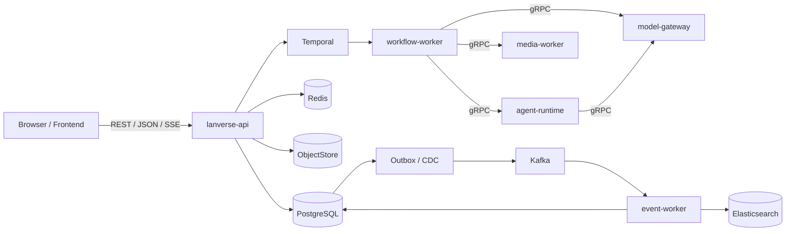

# 后端服务架构

- 状态：已接受设计
- 日期：2026-08-25
- 来源：[系统总体架构](0003-系统总体架构.md) · [架构分层与依赖规则](0004-架构分层与依赖规则.md) · [领域语言与模块命名规范](0006-领域语言与模块命名规范.md)
- 派生文档：[后端运行架构需求规格](../requirement/2001-后端运行架构需求规格.md) · [后端运行架构实施计划](../plan/2001-后端运行架构实施计划.md)

## 结论

Lanverse Backend 采用一个 Go Module、五个独立 Binary 和一个受限 Python Agent Runtime。Go 拥有业务事实、事务、长任务编排、Provider 接入、媒体处理与事件投影；Python 只执行有限、可授权、可计量的 Agent 推理。

后端先作为模块化单体交付，再按运行职责组装为多个进程。模块边界决定事实所有权，Binary 边界决定网络与故障语义，二者不相互冒充。



## 运行单元

| 运行单元 | 主要职责 | 不拥有 |
|---|---|---|
| `lanverse-api` | 公共 REST/SSE、认证授权、领域 Command/Query、资产签名、Callback 入口、费用与限额事实 | Temporal History、Provider 运行、媒体编码、Search 写入 |
| `workflow-worker` | Temporal Workflow/Activity、长任务、Timer、Retry、Signal、Compensation 与人工等待 | 公共 HTTP、业务表越界写入、模型密钥 |
| `model-gateway` | Generation Capability、模型路由、Provider Adapter、Job/Callback、限流、对账 | Episode 编排、Artifact 字节所有权、费用账本 |
| `media-worker` | Probe、Derivative、字幕、混音、Motion、Render、Export 和确定性技术 QC | 候选选择、业务资产状态、公共上传授权 |
| `event-worker` | Inbox、DLQ、Replay、Audit/Search/通知/分析投影和 Reindex | 同步业务 Command、Workflow Timer、Human Wait |
| `agent-runtime` | Structured、ToolLoop、受限 LangGraph Executor，Skill/Prompt/Rubric 执行 | 数据库、对象存储、Shell、任意网络与业务事实 |

五个 Go Binary 共享领域与 Application 实现，但每个组合根只装配所需模块、Adapter、凭据与网络权限。不为了部署拆分复制领域逻辑。

## 模块与分层

业务模块的规范名为 `access`、`production`、`preset`、`authoring`、`workflow`、`review`、`generation`、`agent`、`asset`、`media`、`cost`、`quota`、`eventing`、`search`。每个模块按以下依赖方向组织：

```text
Inbound Adapter
      ↓
Application / Use Case
      ↓
Domain
      ↑
Port ← Outbound Adapter
```

- Composition Root 负责配置、注入、Telemetry 和生命周期，不包含业务规则。
- Inbound Adapter 只处理认证、协议校验、转换、Context 传播和错误映射。
- Application 拥有用例、授权、事务、幂等、乐观锁、跨聚合协调和 Outbox。
- Domain 拥有 Entity、Value Object、Policy、State Machine 和 Domain Event，不依赖框架或基础设施。
- Port 由使用它的模块定义；Repository Port 以聚合为单位，不暴露通用 CRUD 或跨模块 Join。

同一 Binary 内的跨模块用例通过公开 Application Interface 和共享 Unit of Work 组合；跨 Binary 通过持久 Intent、幂等 Receipt、gRPC/Event 与可补偿 Saga 协作，不使用分布式数据库事务。

## 协议与契约所有权

| 契约 | 消费者 | 事实源 |
|---|---|---|
| 公共 REST/JSON 与 SSE | Browser / Frontend | OpenAPI |
| Backend 内部 RPC | Go Binary | Protobuf |
| 业务事件 | Go Producer / Consumer | Event Schema + Event Envelope |
| Backend 与 Agent RPC | Go / Python | Agent Protobuf |
| 协作通道 | Collaboration / Browser | 版本化 WebSocket 契约 |

契约变更顺序固定为 `Design → Source Schema → Compatibility Test → Generate → Implement → E2E`。生成代码不手工修改；Go、Python 和 Frontend 不各自维护语义重复的 DTO、错误体或状态枚举。

Command 按主体分为已认证业务、已认证账户级、匿名认证、Provider Callback、内部服务和运维六类。每类契约明确主体、作用域、幂等键、并发修订、Correlation/Causation 和审计上下文。

## 数据与事实所有权

| 资源 | 权威内容 | 边界 |
|---|---|---|
| PostgreSQL | 业务聚合、不可变 Revision、Intent/Receipt、Cost/Quota、Outbox | 每个事实只有一个 Owner 模块 |
| Temporal | Workflow History、Timer、Retry、Signal、Activity 运行状态 | PostgreSQL 只保存业务绑定和查询投影 |
| ObjectStore | 图片、视频、音频、字幕、文档与导出字节 | Asset 保存元数据、Hash、Lineage 和 Location |
| Kafka | 已提交领域事件的至少一次传输 | 不承担同步命令、Timer、Human Wait 或 Token Stream |
| Redis | Session、Cache、Rate Limit、短租约 | 不是业务事实源，丢失后可恢复 |
| Elasticsearch | Search 和分析投影 | 可丢弃重建，不参与 Command 正确性 |

生产 Schema 只能通过版本化 Schema Migration 变更。Migration 需要连续版本、Checksum、Advisory Lock、事务 Receipt 和明确失败语义。业务 Command 在同一 PostgreSQL 事务中修改 Owner 事实并写 Outbox，禁止数据库提交后直接发 Kafka 形成双写。

## 业务命令与故障语义

一条修改命令按以下顺序执行：

1. 校验协议、Actor/Service Principal、Workspace 和 Access Capability。
2. 以命令作用域查询幂等 Receipt，已完成时返回同一结果。
3. 锁定目标聚合并校验 `expected_revision`、领域不变量和冻结的版本引用。
4. 在一个事务内保存聚合、Receipt 和 Outbox。
5. 提交后返回稳定资源 ID、Revision 和可追踪状态。

外部调用必须区分 `known_failure` 和 `outcome_unknown`。结果未知时使用稳定 Intent/Invocation/Job ID 对账，不得将未知当作失败盲目重提。

## Workflow 与高成本执行

Temporal 是 Episode/Shot 长生命周期的执行权威源。Workflow Start、Control 和 Signal 使用持久 Intent/Receipt 和稳定 Workflow ID；Temporal 确认后再更新 PostgreSQL 查询投影。Workflow 代码保持确定性，通过版本与 Replay 门禁演进。

付费 Provider、Agent 模型调用与高成本 Media Job 统一执行：

```text
Intent + Cost/Quota Reservation + Outbox
  → AcquireExecutionClaim
  → 短时 ExecutionAuthorization
  → Provider / Agent / Media Execution
  → Receipt
  → Settle / Consume / Release / Reconcile
```

Claim 在一个事务中锁定 Intent 和两类 Reservation。Authorization 只证明已领取的 Claim，不成为第二份业务事实。执行结果未知时进入 Reconcile，不释放预留后重提。

## Agent 运行边界

Go `agent` 模块拥有 Agent Manifest、Invocation、Execution Grant、预算、版本引用和运行记录。Python Runtime 只接受签名 Grant，其作用域绑定 Run、Node、可用 Tool、模型能力、步数、调用次数、Token、费用和 deadline。

- 模型调用只能经 Model Gateway。
- 业务上下文只能经 Backend Tool Allowlist API 获取。
- 输出只能是结构化 Candidate 或 Decision Proposal。
- 确定性校验、权限和版本检查通过后，才能由 Go Application 写入业务事实。
- Runtime 没有数据库、对象存储、Yjs、Shell 或任意网络权限。

## 资产、媒体与对象存储

Asset 是可版本化业务对象，Artifact 是不可变产物记录，Object 是字节位置。三者不可合并为一个“文件”状态。Artifact 通过 Hash、Media Type、Readiness、Lineage 和 Storage Location 与字节关联。

所有 Bucket 保持私有。Browser 使用短期、限作用域 Presigned URL 直传/下载；业务 API 不中转大文件。Media 输出先写临时位置，通过完整性、Hash 和技术 QC 后登记新 Artifact/Lineage，不覆盖输入。

## 事件与投影

Event Envelope 包含 Event ID/Type/Schema Version、Aggregate ID/Revision、Workspace ID、Partition Key、Occurred At、Trace ID、Correlation ID、Causation ID 和严格 Payload。Consumer 按 Event ID 幂等，按聚合分区保序，并以 Revision 阻止旧事件覆盖新投影。

Poison Message 进入 DLQ；Replay 使用独立任务、Checkpoint 和水位协议与实时消费收敛。Search、Audit、通知和分析投影均可从 PostgreSQL Snapshot + Event 重建，投影故障不回滚业务事实。

## 运行基础设施

完整运行面包含 PostgreSQL、Redis、ObjectStore、Kafka、Temporal、Kafka Connect/Debezium、Elasticsearch/Kibana、OpenTelemetry Collector、Prometheus 和 Grafana。所有有状态依赖都需要持久化、Health、资源限额、私有网络、备份/恢复策略和生产配置。

每个 Binary 提供：

- 不访问外部依赖的 Liveness；
- 反映必要依赖和 Schema/Contract 状态的 Readiness；
- Build/Contract/Schema Version 信息；
- 有界标签的 Metrics 和结构化、脱敏日志；
- 停止接收新工作、Drain、有界超时和恢复 Receipt 的优雅停机。

## 安全与可观测性

1. 每个 Workspace 资源命令都重新授权；跨租户拒绝不泄漏对象是否存在。
2. Callback 验签、限制重放窗口并以 Provider Event ID 幂等；gRPC 使用服务身份和最小作用域。
3. 各 Binary 只获得职责所需的凭据；Secret 不进入命令行、日志、Metric Label、Trace、Event 或公共 API。
4. Trace Context 跨 HTTP、gRPC、Temporal、Agent、Provider、Media 和 Kafka 传播，使用 Correlation/Causation 还原整条业务链。
5. 对授权、费用、限额、内容权利和关键依赖采用 fail closed，降级不能绕过业务不变量。

## 故障与恢复矩阵

| 故障 | 必要事实 | 恢复方式 |
|---|---|---|
| PostgreSQL 提交结果未知 | Command ID、Receipt Key、Aggregate Revision | 先按幂等键对账，再决定返回或重执行 |
| Temporal Start/Signal 返回未知 | Intent、稳定 Workflow/Control ID、Input Hash | Describe/查询 History，写入 Receipt 后收敛 |
| Provider Job 返回未知 | Claim、Provider Request Key、Attempt | Query/Callback 对账，不释放预留后盲目重提 |
| Worker 中断 | Intent/Heartbeat/Lease/Receipt | 超时后由同一幂等身份接管 |
| Kafka 重复或乱序 | Event ID、Aggregate Revision、Checkpoint | Inbox 去重，Revision 栅栏，Checkpoint 继续 |
| 投影损坏 | Snapshot Version、Event Schema、Replay Job | 丢弃投影并全量重建，不修改业务事实 |

## 核心不变量

1. 每个业务事实、Topic、Index、Bucket Prefix 和 Workflow Type 只有一个 Owner。
2. Browser、Agent、Provider、Collaboration 和投影不能直接修改业务事实。
3. 每次执行冻结 Revision、Definition、Policy、Skill/Prompt、Capability/Model、Price 和输入 Artifact 版本。
4. 长任务由 Temporal 编排，事件只广播已提交事实，投影只服务查询。
5. 外部结果未知必须对账；重试不得生成重复事实、费用、Artifact 或生产效果。
6. 大文件不经公共 API 中转，所有 Bucket 私有，用户与服务均使用最小作用域。
